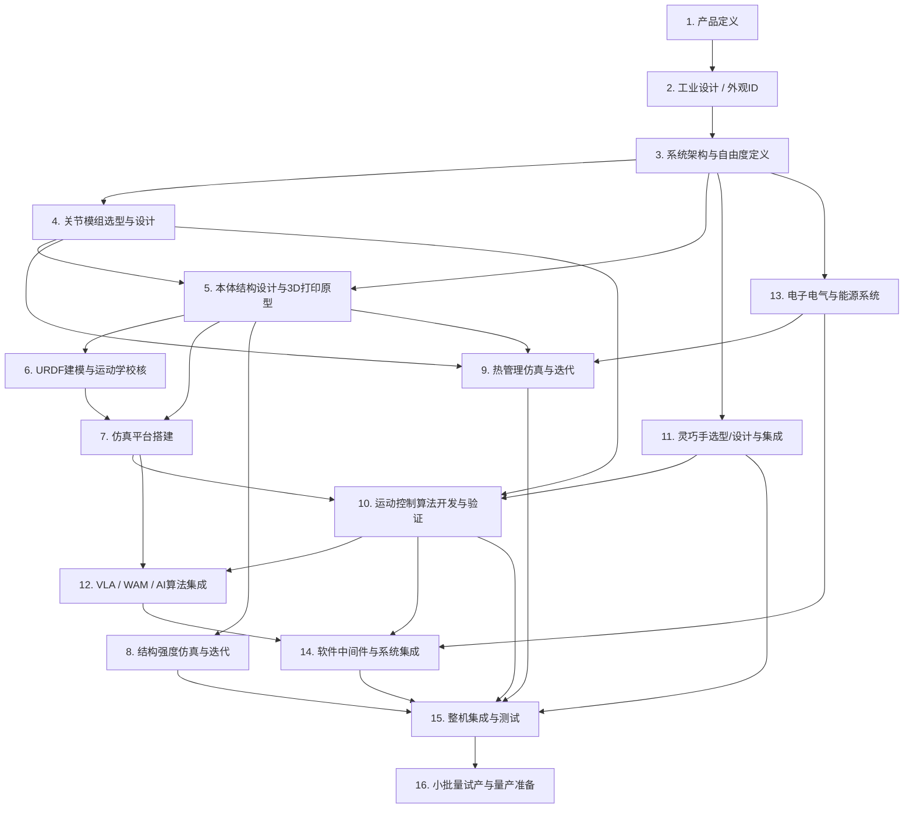
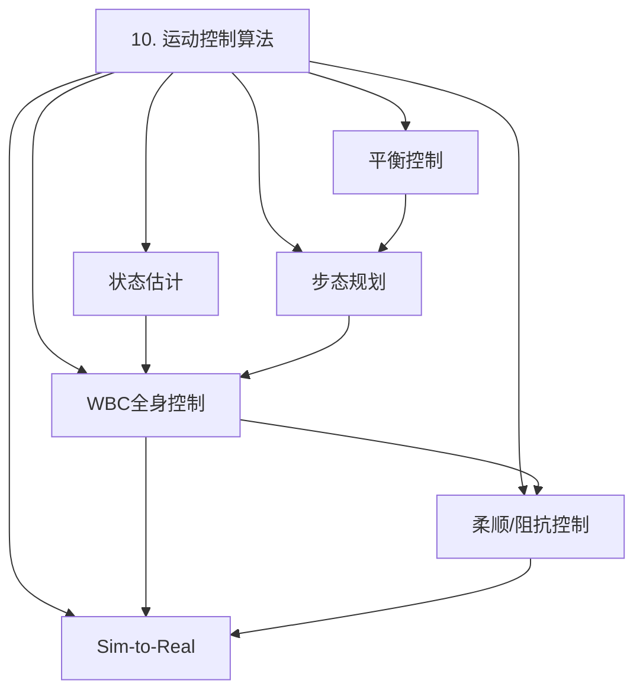

# 全尺寸双足人形机器人产品从设计到量产前试产的全流程报告

> 目标：面向**全尺寸双足人形机器人**（身高 1.6–1.8 m，体重 50–80 kg，双足行走 + 双臂操作 + 灵巧手），覆盖从产品定义到量产前小批量试产的完整开发链路。
> 本报告基于当前知识图谱中的技术栈（WBC、MPC、VLA、WAM、关节模组、灵巧手、结构/热仿真等）进行系统化拆解。

---

## 1. 总体流程图

---

## 2. 阶段任务树与详细拆解

每个任务条目包含：
- **任务ID**：便于依赖管理。
- **任务名称**
- **方法 / 工具**
- **设计思考逻辑**
- **关键约束**
- **完成标准 / 输出物**

---

### 阶段 1：产品定义（Product Definition）

| 任务ID | 任务名称 | 方法 / 工具 | 设计思考逻辑 | 关键约束 | 完成标准 / 输出物 |
|---|---|---|---|---|---|
| P1.1 | 市场需求与场景定义 | 市场调研、用户访谈、竞品分析、ROI模型 | 明确目标场景（工业巡检、物流搬运、服务陪伴、科研平台），场景决定自由度、负载、续航、成本上限 | 市场规模、客户付费意愿、法规限制 | 《市场需求文档 MRD》：目标场景优先级、关键用户旅程、价格区间 |
| P1.2 | 技术路线图制定 | TRL评估、技术成熟度矩阵、风险-收益排序 | 区分“必须有”与“差异化”技术，优先落地高TRL、低风险模块 | 核心技术专利壁垒、供应链可得性 | 《技术路线图》：分阶段技术目标、里程碑、风险清单 |
| P1.3 | 产品规格书（PRD） | 系统工程QFD、性能指标分解 | 将市场需求转化为可量化指标：身高、体重、DOF、步行速度、续航、负载、跌倒自恢复、噪音、成本 | 指标间相互耦合（速度↑→功耗↑→重量↑） | 《PRD》：完整KPI表格、验收测试条件 |
| P1.4 | 法规与安全标准识别 | ISO 10218、ISO/TS 15066、IEC 61508、地区准入法规 | 安全设计必须前置，否则后期结构/控制重构成本极高 | 不同国家准入差异、责任归属 | 《法规映射表》：适用标准、合规检查项、认证计划 |
| P1.5 | 成本目标与商业模式 | BOM成本建模、TCO分析 | 设定整机BOM目标并分解到子系统，决定自研/外购策略 | 零部件单价、批量折扣、研发投入 | 《成本目标分解表》：整机目标BOM、子系统上限、盈亏平衡批量 |

**阶段输出**：MRD、PRD、技术路线图、法规与成本框架。

---

### 阶段 2：工业设计 / 外观ID（Industrial Design）

| 任务ID | 任务名称 | 方法 / 工具 | 设计思考逻辑 | 关键约束 | 完成标准 / 输出物 |
|---|---|---|---|---|---|
| P2.1 | 概念草图与形态语言 | Sketch、Rhino、Blender、AI辅助造型 | 平衡“科技感”与“亲和力”，同时预留内部机构空间 | 内部关节/电池/线束空间、散热开口、维护开口 | 3–5套概念方案、形态语言定义 |
| P2.2 | 3D外观A面建模 | Alias / Rhino / Blender / Cinema 4D | 外观面需与结构骨架留有足够间隙（≥5 mm典型包络），避免运动干涉 | 曲面可制造性、喷涂/覆膜工艺 | 高精度外观A面模型、渲染图、CMF方案 |
| P2.3 | 人机工程与可达域分析 | 人机工程软件、人体尺寸数据库 | 验证机器人操作高度、视野、避障范围是否覆盖目标场景的人体/设备尺度 | 关节运动范围尚未最终冻结 | 《人机工程报告》：可达域包络、关键操作姿态 |
| P2.4 | 外观手板/快速原型 | SLA/SLS 3D打印、泡沫模型、喷漆 | 在结构设计前验证外观比例、视觉重心、品牌识别度 | 手板材料强度不等于最终结构 | 1:1外观手板、评审纪要 |
| P2.5 | ID与结构接口冻结 | ID/结构联合评审、GD&T定义 | 外观面与结构骨架的接口（安装点、拆卸缝、密封）需在结构详细设计前确定 | 后续修改成本高 | 《ID-结构接口规范》：安装方式、公差、密封等级 |

**前置依赖**：P1.3（PRD）  
**阶段输出**：A面模型、CMF、外观手板、接口规范。

---

### 阶段 3：系统架构与自由度定义（System Architecture & DOF）

| 任务ID | 任务名称 | 方法 / 工具 | 设计思考逻辑 | 关键约束 | 完成标准 / 输出物 |
|---|---|---|---|---|---|
| P3.1 | 功能分解与系统划分 | 功能树、N²图、接口矩阵 | 将整机拆分为运动、操作、感知、计算、能源、热管理、结构七大子系统 | 子系统间带宽、实时性、功耗预算 | 《系统架构图》：子系统划分、接口定义、数据流 |
| P3.2 | 自由度（DOF）配置 | 仿生参考、任务驱动分析 | 腿部通常6×2，手臂7×2，躯干1–3，头部2–3，手部11–22；优先保证任务可达性再减少冗余 | 重量、成本、控制复杂度 | 《DOF配置表》：每个关节自由度、运动范围、额定速度 |
| P3.3 | 关节运动学/动力学初步计算 | 解析法、Matlab/Python、Pinocchio/RBDL | 根据目标运动（蹲起、行走、抓取）估算关节峰值扭矩与速度 | 静态/动态载荷假设需保守 | 《关节需求规格》：各关节峰值扭矩、连续扭矩、最大速度 |
| P3.4 | 整机质量属性预算 | Excel/PLM、质量追踪表 | 按子系统分配质量、CoM、惯量，确保静态稳定余量 | 总重目标、电池能量密度 | 《质量预算表》：各部件目标质量、整机CoM范围、主惯量上限 |
| P3.5 | 电气与通信架构初步设计 | 拓扑图、网络带宽计算 | 确定集中式 vs 分布式计算、关节总线类型、传感器融合架构 | 实时性、EMC、线缆数量 | 《电气架构草图》：计算节点、总线类型、供电分区 |

**前置依赖**：P1.3、P2.5  
**阶段输出**：系统架构、DOF表、关节需求、质量预算、电气架构草图。

---

### 阶段 4：关节模组选型与设计（Actuator Design）

| 任务ID | 任务名称 | 方法 / 工具 | 设计思考逻辑 | 关键约束 | 完成标准 / 输出物 |
|---|---|---|---|---|---|
| P4.1 | 关节性能需求精化 | P3.3输出 + 安全系数、热裕量 | 峰值扭矩 = 动力学峰值 × 1.5–2.0 安全系数；连续扭矩按持续行走工况 | 电机热时间常数、散热能力 | 各关节最终扭矩/速度/带宽需求表 |
| P4.2 | 执行器拓扑选择 | 准直驱（QDD）、谐波减速、行星+无框电机对比 | 高动态关节（髋/踝）倾向QDD；高扭矩小体积（肩/腕）倾向谐波 | 反驱透明度 vs 扭矩密度 | 《执行器拓扑决策矩阵》：各关节选型、理由 |
| P4.3 | 电机选型 | 转矩密度、热阻、编码器分辨率、峰值电流 | 优先选择高转矩密度无框电机或集成电机；校核绕组温升 | 驱动器母线电压、电流能力 | 电机规格书、选型对比表 |
| P4.4 | 减速器与传动选型 | 谐波减速器、行星减速器、同步带、丝杠对比 | 考虑背隙、刚度、效率、寿命、噪音；输出端需配置力矩/位置传感器 | 谐波柔轮疲劳、行星磨损 | 减速器规格、传动链图纸 |
| P4.5 | 驱动器与编码器集成 | FOC驱动器、绝对/增量编码器、双编码器方案 | 关节内部尽量集成驱动器以缩短线缆；双编码器提升控制精度 | 空间、散热、EMI | 关节模组电气原理图、编码器方案 |
| P4.6 | 关节模组原型与台架测试 | 扭矩传感器、功率分析仪、温升测试 | 验证峰值扭矩、连续扭矩、刚度、带宽、效率、温升 | 测试夹具刚性 | 《关节测试报告》：扭矩-电流曲线、效率图、温升曲线 |
| P4.7 | 关节可靠性验证 | 加速寿命试验、振动试验 | 预估关节在目标寿命内的磨损与失效模式 | MTBF目标、维护周期 | 寿命测试计划、失效模式分析 |

**前置依赖**：P3.2、P3.3  
**阶段输出**：关节模组规格、原型、测试数据。

---

### 阶段 5：本体结构设计与3D打印原型（Body Structure）

| 任务ID | 任务名称 | 方法 / 工具 | 设计思考逻辑 | 关键约束 | 完成标准 / 输出物 |
|---|---|---|---|---|---|
| P5.1 | 骨架/连杆拓扑设计 | SolidWorks / NX / CATIA、拓扑优化 | 采用“中心骨架 + 四肢模块”思路，便于装配与维护；关键承力件用金属，次结构可用复材/打印 | 刚度、强度、重量、可维护性 | 3D结构骨架模型、关键截面设计 |
| P5.2 | 材料选择 | 铝合金7075/6061、碳纤维、PA12/PA11 CF、钛合金 | 高载荷连杆用铝合金/CNC，外壳/支架用SLS/MJF 3D打印，关键紧固件用高强度钢 | 成本、批量制造可行性 | 《材料选型表》：各部件材料、工艺、原因 |
| P5.3 | 关节接口与轴承布置 | 轴承选型、配合公差分析 | 关节输出端需承受径向/轴向/力矩载荷，采用交叉滚子轴承或角接触轴承组合 | 加工精度、装配顺序 | 关节接口图纸、轴承布置方案 |
| P5.4 | 3D打印原型件设计 | 面向增材制造的设计（DfAM） | 用于快速验证装配关系、线束走向、维护开口；非承力或低承力件优先打印 | 打印材料强度、层间结合 | 3D打印件图纸、打印清单 |
| P5.5 | 线缆与管路布线设计 | 线束3D布线、弯曲半径校核 | 动力/信号/冷却管路需随关节运动不拉扯、不磨损；预留维护长度 | 弯曲寿命、EMC屏蔽、散热 | 《布线设计规范》：线缆型号、固定点、弯曲半径 |
| P5.6 | 可维护性与装配性设计 | DFA分析、装配顺序模拟 | 模块化解耦：手臂、腿部、躯干可独立拆装；关键件可达性 | 工具空间、紧固件标准化 | 《装配顺序图》、维护手册草案 |

**前置依赖**：P2.5、P3.2、P4.2–P4.5  
**阶段输出**：本体CAD、材料BOM、3D打印清单、布线规范。

---

### 阶段 6：URDF建模与运动学校核（URDF & Kinematics）

| 任务ID | 任务名称 | 方法 / 工具 | 设计思考逻辑 | 关键约束 | 完成标准 / 输出物 |
|---|---|---|---|---|---|
| P6.1 | URDF/SDF模型构建 | ROS URDF、Xacro、SolidWorks→URDF插件 | 连杆、关节、惯性、碰撞体、视觉模型需与CAD一致；质量属性来自P3.4 | 坐标系一致性、单位统一 | 可加载的URDF/SDF文件 |
| P6.2 | DH/修改DH参数定义 | 解析法、Pinocchio/RBDL | 为每个关节链建立运动学参数，便于逆解与控制 | 坐标系方向约定 | 《DH参数表》、正逆运动学代码 |
| P6.3 | 正逆运动学验证 | 数值/解析逆解、随机姿态测试 | 验证URDF中关节极限、连杆长度与CAD一致；IK解算成功率高 | 奇异位置、关节极限 | 测试脚本、误差统计报告 |
| P6.4 | 工作空间与可达性分析 | Matlab、Python、RViz | 生成足端/手末端可达空间云图，验证覆盖P2.3人机工程需求 | 自碰撞约束 | 《工作空间分析报告》：可达域、奇异位形 |
| P6.5 | 碰撞检测模型 | 凸包/简化网格、FCL/PyBullet | 运动过程中肢体与环境、肢体与肢体不得发生碰撞 | 碰撞体过紧导致误报，过松导致漏报 | 碰撞检测配置、无碰撞运动样例 |

**前置依赖**：P5.1、P5.6  
**阶段输出**：URDF、DH参数、运动学验证报告、碰撞模型。

---

### 阶段 7：仿真平台搭建（Simulation）

| 任务ID | 任务名称 | 方法 / 工具 | 设计思考逻辑 | 关键约束 | 完成标准 / 输出物 |
|---|---|---|---|---|---|
| P7.1 | 仿真环境选型与导入 | Isaac Sim / Gazebo / MuJoCo / RaiSim | 优先选择支持GPU并行、接触稳定、传感器仿真完善的环境；可多用互补 | _license、硬件要求、 sim-to-real gap | 《仿真平台选型报告》、URDF导入成功 |
| P7.2 | 传感器模型配置 | IMU、关节编码器、力/力矩传感器、相机、LiDAR模型 | 传感器噪声、延迟、采样率需贴近真实硬件，才能有效验证算法 | 算力消耗 | 传感器配置文件、噪声模型 |
| P7.3 | 接触与摩擦参数标定 | 摩擦系数辨识、接触刚度/阻尼调参 | 通过简单实验（滑块、单腿站立）调参，使仿真与真实物理响应一致 | 仿真稳定性 vs 真实性 | 《接触参数表》、标定视频/数据 |
| P7.4 | 基础控制器与行走仿真 | LQR/MPC平衡、开环/CPG步态 | 先实现稳定站立与原地踏步，再扩展到前进/转向/斜坡 | 算力、仿真速度 | 仿真视频、稳定行走数据 |
| P7.5 | 扰动与跌倒仿真 | 外部推力、地面不平、负载变化 | 验证控制鲁棒性，为真实测试建立安全边界 | 仿真结果需保守 | 扰动测试报告、安全边界定义 |

**前置依赖**：P6.1–P6.5、P10.1–P10.3（控制算法可与仿真并行迭代）  
**阶段输出**：仿真环境、传感器模型、接触参数、基础控制器。

---

### 阶段 8：结构强度仿真与迭代（Structural FEA）

| 任务ID | 任务名称 | 方法 / 工具 | 设计思考逻辑 | 关键约束 | 完成标准 / 输出物 |
|---|---|---|---|---|---|
| P8.1 | 载荷工况定义 | 静力学、动力学冲击、跌落、典型运动反力 | 最严苛工况决定结构设计；包含单腿支撑、跌倒冲击、抓取最大负载 | 载荷传递路径、安全系数 | 《载荷工况表》：载荷大小、方向、作用点 |
| P8.2 | FEA模型准备 | HyperMesh / ANSA / Abaqus / ANSYS | 简化非承力特征、网格划分、材料属性、接触/绑定设置 | 网格质量、计算时间 | 高质量FEA模型 |
| P8.3 | 静/动态应力与变形分析 | 线弹性/非线性分析 | 校核关键件应力是否低于材料屈服/疲劳极限，变形是否影响运动 | 局部应力集中、焊缝/螺接 | 《FEA应力报告》：von Mises、变形云图 |
| P8.4 | 疲劳与寿命预估 | S-N曲线、Miner累积损伤 | 对高周疲劳部位（关节耳片、连杆孔边）进行寿命评估 | 载荷谱不确定性 | 疲劳分析报告、关键件寿命 |
| P8.5 | 轻量化与拓扑优化 | 拓扑优化、尺寸优化、筋板布置 | 在应力裕量足够前提下减重，降低整机惯量 | 制造工艺限制 | 优化后CAD、减重比例 |
| P8.6 | 设计迭代与验证 | 更新CAD → 重新FEA → 原型加载试验 | 形成“仿真-试验-修正”闭环 | 迭代周期 | 《结构验证闭环报告》 |

**前置依赖**：P5.1–P5.3、P3.4  
**阶段输出**：FEA报告、优化后结构、结构验证数据。

---

### 阶段 9：热管理仿真与迭代（Thermal Management）

| 任务ID | 任务名称 | 方法 / 工具 | 设计思考逻辑 | 关键约束 | 完成标准 / 输出物 |
|---|---|---|---|---|---|
| P9.1 | 热源与功耗清单 | 电机损耗、驱动器损耗、计算平台功耗、传感器功耗 | 按连续运行工况统计总发热功率，识别主要热源 | 工作制、环境温度 | 《热源清单》：各部件功耗、发热功率 |
| P9.2 | 热网络/CFD模型 | Fluent / Star-CCM+ / 集总参数热网络 | 对密闭腔体、关节内部、计算仓进行温升仿真 | 对流边界、材料导热系数 | 热仿真模型、边界条件 |
| P9.3 | 散热方案设计 | 自然散热、热管、风扇、液冷、相变材料 | 关节内部优先导热+局部风扇；躯干计算仓可上热管/液冷 | 空间、噪音、可靠性 | 《散热方案》：各部件散热方式、关键尺寸 |
| P9.4 | 连续运行温升仿真 | 瞬态热分析、关键节点温度曲线 | 验证电机绕组、驱动器、电池、计算平台在目标运行周期内不超过最高工作温度 | 环境温度、散热能力衰减 | 《温升仿真报告》：关键节点温度、是否满足降额 |
| P9.5 | 热测试与迭代 | 热电偶/红外热像、加速温升试验 | 对比仿真与实测，修正热阻/接触热阻参数 | 传感器布置 | 热测试报告、设计迭代记录 |

**前置依赖**：P4.6、P5.1、P13.2  
**阶段输出**：热仿真报告、散热方案、热测试数据。

---

### 阶段 10：运动控制算法开发与验证（Motion Control）

| 任务ID | 任务名称 | 方法 / 工具 | 设计思考逻辑 | 关键约束 | 完成标准 / 输出物 |
|---|---|---|---|---|---|
| P10.1 | 状态估计 | EKF/UKF、IMU+关节编码器+力觉融合 | 实时估计质心位置、速度、足端接触状态；是平衡控制的基础 | 传感器延迟、协方差调参 | 状态估计器、实测轨迹对比 |
| P10.2 | 平衡与站立控制 | LQR、MPC、ZMP/Capture Point | 双足站立与抗扰是核心安全功能；MPC可统一处理约束 | 实时求解频率（≥100 Hz） | 站立抗扰仿真/实物视频 |
| P10.3 | 步态规划 | ZMP preview、Raibert heuristic、RL/IL | 从周期性行走到非结构化地形；先稳定再高效 | 关节速度/扭矩限制 | 平地/斜坡/障碍行走数据 |
| P10.4 | 全身控制 WBC | QP-based WBC、任务优先级、接触力优化 | 协调下肢平衡、躯干姿态、上肢操作；满足摩擦锥约束 | 计算实时性、任务冲突 | WBC控制器、多任务协调演示 |
| P10.5 | 柔顺/阻抗控制 | 关节阻抗、笛卡尔阻抗、力位混合控制 | 实现与环境/人的安全交互，降低碰撞冲击 | 稳定性、带宽 | 柔顺接触实验数据 |
| P10.6 | Sim-to-Real迁移 | 域随机化、系统辨识、在线自适应 | 仿真参数与实际存在差异，需通过辨识与自适应缩小gap | 安全护栏、逐步解锁 | 从仿真到实物的迁移报告 |

**前置依赖**：P4.6、P6.4、P7.5  
**阶段输出**：状态估计、平衡/步态/WBC控制器、sim-to-real验证。

---

### 阶段 11：灵巧手选型/设计与集成（Dexterous Hand）

| 任务ID | 任务名称 | 方法 / 工具 | 设计思考逻辑 | 关键约束 | 完成标准 / 输出物 |
|---|---|---|---|---|---|
| P11.1 | 手部DOF与功能定义 | 任务分析、抓取分类 | 拇指对掌、手指屈曲/外展；根据目标物体决定是否需要全自由度或欠驱动 | 重量、体积、线缆数量 | 《手部规格书》：DOF、关节范围、指尖力 |
| P11.2 | 驱动方案选择 | 腱绳传动、微型电机直驱、液压/气动 | 腱绳传动体积小但复杂；直驱易维护但体积大；欠驱动降低成本 | 可靠性、可维护性 | 驱动方案决策报告 |
| P11.3 | 触觉与力觉传感器集成 | 阵列触觉、指尖六维力、关节力矩 | 精细操作依赖触觉反馈；力控保障安全 | 布线、信号处理、成本 | 传感器布置方案 |
| P11.4 | 抓取规划与控制 | 抓取姿态生成、力闭合、灵巧操作 | 基于物体模型或视觉生成稳定抓取；支持包络抓取与精确捏取 | 实时性、物体多样性 | 抓取库/策略、典型物体抓取视频 |
| P11.5 | 与手臂集成与标定 | 手眼标定、腕部接口、线缆管理 | 手腕作为手与臂的接口，需考虑载荷、通信、热管理 | 腕部自由度、布线 | 集成测试报告 |

**前置依赖**：P3.2、P10.5  
**阶段输出**：灵巧手设计/选型、传感器方案、抓取策略、集成验证。

---

### 阶段 12：VLA / WAM / AI算法集成（AI & Perception）

| 任务ID | 任务名称 | 方法 / 工具 | 设计思考逻辑 | 关键约束 | 完成标准 / 输出物 |
|---|---|---|---|---|---|
| P12.1 | 感知栈搭建 | RGB-D相机、LiDAR、IMU、麦克风阵列 | 提供语义理解、深度估计、SLAM、人体/物体检测 | 算力、延迟、光照鲁棒性 | 感知模块架构、标定结果 |
| P12.2 | VLA模型部署与微调 | OpenVLA、RT-X、π0 或自研模型 | 将视觉-语言指令映射到机器人动作；需针对本机本体进行微调 | 数据量、sim-to-real、安全性 | 可执行自然语言指令的端到端demo |
| P12.3 | 世界模型 / WAM | 视频生成模型、动力学模型、MPC结合 | 预测动作后果，支持长程规划与风险预判 | 模型幻觉、计算开销 | 世界模型预测能力演示 |
| P12.4 | 任务规划与操作策略 | LLM+PDDL、Skill Library、Behavior Trees | 高层任务分解为可复用技能；低层由VLA/控制执行 | 技能覆盖度、失败恢复 | 多步骤任务执行视频 |
| P12.5 | 人机交互与安全监控 | 语音/手势/凝视、急停、碰撞检测 | 人机共融场景必须保证安全、可解释、可中断 | 响应延迟、误触发 | HMI设计、安全监控模块 |

**前置依赖**：P7.4、P10.4、P11.5  
**阶段输出**：感知栈、VLA/WAM模型、任务规划系统、HMI。

---

### 阶段 13：电子电气与能源系统（Electronics & Power）

| 任务ID | 任务名称 | 方法 / 工具 | 设计思考逻辑 | 关键约束 | 完成标准 / 输出物 |
|---|---|---|---|---|---|
| P13.1 | 计算平台架构 | Jetson / Intel NUC / 自研载板 | 高层AI任务用GPU，实时控制用MCU/FPGA，分层降低延迟 | 功耗、散热、重量 | 计算平台框图、算力预算 |
| P13.2 | 电池与BMS设计 | 锂电池选型、SOC/SOH估算、快充策略 | 续航与重量平衡；BMS需过充/过放/过温保护 | 安全认证、热失控 | 电池包方案、BMS规格、续航估算 |
| P13.3 | 电源分配与DC-DC | 母线电压选择、DC-DC模块、滤波 | 电机母线（48 V）与逻辑电源隔离，降低噪声耦合 | 压降、EMC、效率 | 电源分配图、DC-DC选型 |
| P13.4 | 通信网络设计 | CAN-FD、EtherCAT、Ethernet、TSN | 关节控制用CAN-FD/EtherCAT，视觉/AI用Ethernet；关键信号走冗余 | 实时性、线缆数量 | 通信拓扑图、协议分配 |
| P13.5 | 安全与急停系统 | 硬件急停、看门狗、熔断、安全PLC | 任何软件失效都能通过硬件切断动力；符合功能安全 | 响应时间、可靠性 | 安全系统原理图、FMEA |

**前置依赖**：P3.5、P4.5  
**阶段输出**：电气架构、电池/BMS、电源分配、通信与安全系统。

---

### 阶段 14：软件中间件与系统集成（Software & Integration）

| 任务ID | 任务名称 | 方法 / 工具 | 设计思考逻辑 | 关键约束 | 完成标准 / 输出物 |
|---|---|---|---|---|---|
| P14.1 | 中间件选型与适配 | ROS2 / DDS / 自研中间件 | ROS2适合算法快速迭代，DDS提供QoS；硬实时控制可剥离到裸机/RTOS | 实时性、消息延迟 | 中间件架构图、节点清单 |
| P14.2 | 实时控制框架 | EtherCAT主站、RTOS、控制周期保证 | 保证控制环（≥1 kHz）不受AI任务干扰 | 抖动、调度策略 | 实时性能测试报告 |
| P14.3 | 数据记录与回放 | rosbag2、结构化日志、数据湖 | 便于问题复现、模型训练、性能分析 | 存储容量、带宽 | 数据记录方案 |
| P14.4 | OTA与诊断 | 远程升级、健康监控、故障码 | 小批量及量产阶段快速迭代软件；预测性维护 | 安全性、回滚机制 | OTA方案、诊断协议 |
| P14.5 | 系统联调与接口测试 | 单元测试、HIL测试、集成测试 | 验证各模块接口、时序、异常处理 | 测试覆盖率 | 集成测试报告 |

**前置依赖**：P10.4、P12.4、P13.4  
**阶段输出**：软件架构、实时框架、数据/OTA/诊断系统、集成测试报告。

---

### 阶段 15：整机集成与测试（System Integration & Test）

| 任务ID | 任务名称 | 方法 / 工具 | 设计思考逻辑 | 关键约束 | 完成标准 / 输出物 |
|---|---|---|---|---|---|
| P15.1 | 子系统集成 | 腿部、手臂、躯干、头部、手部分步集成 | 先单独验证子系统，再整机集成；降低调试难度 | 接口一致性 | 各子系统功能验证报告 |
| P15.2 | 功能安全测试 | 急停、跌倒保护、碰撞检测、限位 | 任何异常都能安全停机或进入保护姿态 | 安全标准 | 安全测试报告 |
| P15.3 | 性能测试 | 行走速度、续航、负载、操作精度 | 对照PRD逐项验证KPI | 测试环境、重复次数 | 《性能测试报告》 |
| P15.4 | 环境适应性测试 | 温度、湿度、灰尘、电磁干扰 | 验证目标使用环境的鲁棒性 | 测试成本、时间 | 环境测试报告 |
| P15.5 | 可靠性与耐久测试 | 连续运行、关节循环、跌落 | 暴露早期失效，验证MTBF假设 | 测试周期 | 可靠性测试计划与结果 |

**前置依赖**：P8.6、P9.5、P10.6、P11.5、P14.5  
**阶段输出**：集成测试报告、安全/性能/环境/可靠性验证。

---

### 阶段 16：小批量试产与量产准备（Pilot Production）

| 任务ID | 任务名称 | 方法 / 工具 | 设计思考逻辑 | 关键约束 | 完成标准 / 输出物 |
|---|---|---|---|---|---|
| P16.1 | DFM/DFA评审 | 设计可制造性/可装配性分析 | 将3D打印/CNC原型转化为压铸、注塑、钣金等量产工艺 | 模具成本、良率 | DFM/DFA报告、工程变更清单 |
| P16.2 | 供应商选择与试制 | 供应商审核、样品承认、IQC | 关键部件（电机、减速器、电池、计算板）需多家备份 | 交付周期、质量一致性 | 供应商清单、样品测试报告 |
| P16.3 | 装配线规划 | 工位设计、工装夹具、标准作业 | 从单台手工装配过渡到小批量流水线 | 节拍、人员培训 | 装配流程图、工装清单 |
| P16.4 | 质量控制体系 | SPC、FAI、来料检验、过程检验 | 建立关键尺寸与性能监控，防止批量不良 | AQL标准、检测能力 | 质量计划、检验规范 |
| P16.5 | 成本核算与迭代 | 实际BOM、制造成本、良率影响 | 小批量数据修正早期成本模型，为量产定价/融资提供依据 | 规模经济 | 小批量成本分析报告 |
| P16.6 | 小批量试产与问题闭环 | 10–50台试产、问题追踪、ECN | 验证供应链、装配、测试、软件全链路 | 时间、资源 | 试产总结报告、量产 readiness 评估 |

**前置依赖**：P15.5  
**阶段输出**：DFM/DFA报告、供应商/工装/质量体系、小批量试产总结。

---

## 3. 关键依赖矩阵（节选）

| 任务 | 直接前置依赖 | 说明 |
|---|---|---|
| P2 ID设计 | P1.3 PRD | 外观必须服务于产品定位与指标 |
| P3 系统架构 | P1.3、P2.5 | 在ID与结构接口冻结后定义内部布局 |
| P4 关节模组 | P3.2、P3.3 | DOF与动力学需求决定关节规格 |
| P5 本体结构 | P2.5、P3.2、P4.2–P4.5 | 结构需包裹关节与外观 |
| P6 URDF | P5.1、P5.6 | 结构CAD是URDF几何/惯量来源 |
| P7 仿真 | P6 + P10（可并行） | 仿真需URDF与控制器共同驱动 |
| P8 结构FEA | P5.1–P5.3、P3.4 | 结构几何与载荷决定仿真输入 |
| P9 热管理 | P4.6、P5.1、P13.2 | 热源来自关节、驱动器、电池、计算平台 |
| P10 运动控制 | P4.6、P6.4、P7.5 | 控制依赖硬件、模型与仿真验证 |
| P11 灵巧手 | P3.2、P10.5 | 手部DOF与手臂控制协同 |
| P12 VLA/WAM | P7.4、P10.4、P11.5 | AI算法需仿真/实物平台与感知/控制基座 |
| P13 电子电气 | P3.5、P4.5 | 电气架构由系统与关节驱动方案决定 |
| P14 软件集成 | P10.4、P12.4、P13.4 | 中间件连接控制、AI、硬件 |
| P15 整机测试 | P8.6、P9.5、P10.6、P11.5、P14.5 | 所有子系统就绪后才能整机验证 |
| P16 小批量试产 | P15.5 | 整机验证通过是试产前提 |

---

## 4. 流程图树的展开示意

以 P10（运动控制）为例，子任务可进一步展开为：

---

## 5. 与当前知识图谱的衔接建议

当前图谱已覆盖 WBC、MPC、VLA、WAM、关节模组、灵巧手、结构/热仿真、供应链等核心节点。建议下一步：

1. 将本报告中的每个阶段/任务映射为图谱中的 `method` / `process` / `system` 节点。
2. 用 `requires`、`enables`、`is_based_on` 等关系建立阶段间依赖边。
3. 将报告作为项目顶层 `process` 节点 `ent_process_humanoid_full_development` 的 body，便于后续检索与追踪。

---

## 6. 立即可以启动的前三项任务

1. **冻结 PRD（P1.3）**：召集产品、技术、市场三方，确认身高、体重、DOF、负载、续航、目标场景、成本上限。
2. **组建 ID-结构联合小组（P2.5）**：同步推进外观A面与内部骨架接口，避免后期返工。
3. **建立关节性能需求基线（P3.3）**：基于典型动作（站立、蹲起、步行、抓取）做初步逆动力学估算，为关节选型提供输入。
