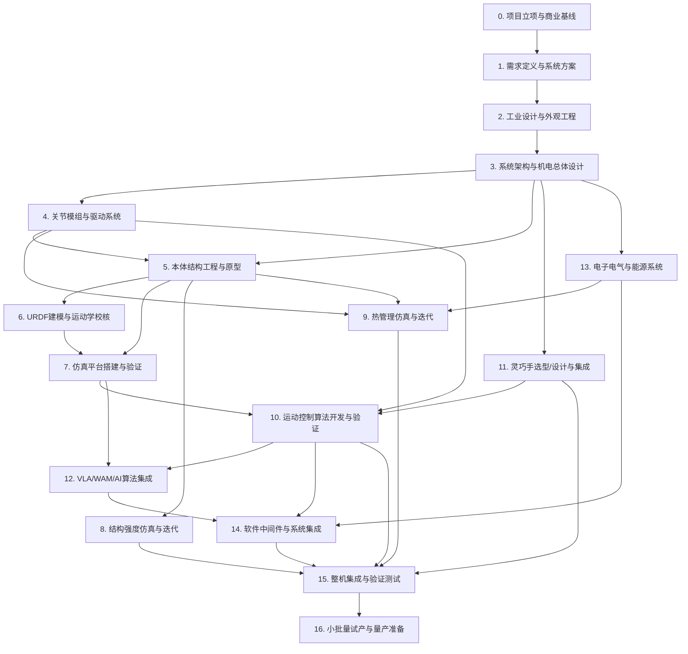

# 全尺寸双足人形机器人产品开发全流程报告（V3 / 三四级任务展开版）

> 本报告在 V2 工程级 WBS 基础上，将每个二级任务进一步展开为三级子任务与四级关键动作，可直接用于项目计划、排期与责任分配。

**统计**：17 个阶段，52 个工作包，154 个二级任务，770 个三级子任务。

## 0. 总体流程图

## 0.1 阶段间关键依赖矩阵

| 阶段 | 关键前置依赖 | 说明 |
|---|---|---|
| P1 需求 | P0 立项 | 商业与法规基线决定需求边界 |
| P2 ID | P1 需求 | 外观服务于产品定位与指标 |
| P3 系统架构 | P1、P2 | 在ID与结构接口冻结后定义内部布局 |
| P4 关节 | P3 | DOF与动力学需求决定关节规格 |
| P5 结构 | P2、P3、P4 | 结构需包裹关节与外观 |
| P6 URDF | P5 | 结构CAD是URDF几何/惯量来源 |
| P7 仿真 | P6、P10 | 仿真需URDF与控制器共同驱动 |
| P8 结构FEA | P5、P3 | 结构几何与载荷决定仿真输入 |
| P9 热管理 | P4、P5、P13 | 热源来自关节、驱动器、电池、计算平台 |
| P10 控制 | P4、P6、P7 | 控制依赖硬件、模型与仿真验证 |
| P11 灵巧手 | P3、P10 | 手部DOF与手臂控制协同 |
| P12 AI/VLA | P7、P10、P11 | AI算法需仿真/实物平台与感知/控制基座 |
| P13 电子电气 | P3、P4 | 电气架构由系统与关节驱动方案决定 |
| P14 软件 | P10、P12、P13 | 中间件连接控制、AI、硬件 |
| P15 整机测试 | P8、P9、P10、P11、P14 | 所有子系统就绪后才能整机验证 |
| P16 试产 | P15 | 整机验证通过是试产前提 |

## P0 项目立项与商业基线
### P0.1 商业与战略论证
#### P0.1.1 市场机会与场景画布

- **方法 / 工具**：TAM/SAM/SOM 分析、用户画像、场景故事板、竞品对标（波士顿矩阵）
- **设计思考逻辑**：明确机器人在哪些场景创造可量化的经济价值；场景决定形态、价格、性能优先级
- **关键约束**：预算上限、进入壁垒、法规限制、客户付费意愿
- **完成标准 / 输出物**：输出《商业画布》与至少 3 个优先级场景及对应 KPI

**三级子任务：**

- **P0.1.1.1 输入梳理与目标量化**：整理「市场机会与场景画布」所需的上游输入、参考标准与资源，将完成标准转化为可量化的验收指标，并明确 Owner 与里程碑。
**四级关键动作：**

1. 列出所有上游输入清单并确认版本
2. 将验收标准转化为可量化 KPI
3. 建立任务 Owner、时间节点与风险登记

- **P0.1.1.2 方案/方法设计**：针对「市场机会与场景画布」制定实施方法或候选方案，使用「TAM/SAM/SOM 分析、用户画像、场景故事板、竞品对标（波士顿矩阵）」进行论证，明确技术路线与资源需求。
**四级关键动作：**

1. 形成不少于 2 个候选方案
2. 建立评估矩阵并量化打分
3. 组织评审并冻结方案

- **P0.1.1.3 实施/原型/样件制作**：根据设计方案执行「市场机会与场景画布」的实施工作，制作原型、样件或完成关键步骤，记录过程数据。
**四级关键动作：**

1. 建立模型/样机并记录关键参数
2. 执行仿真或原型验证
3. 记录异常与偏差

- **P0.1.1.4 验证与问题闭环**：对「市场机会与场景画布」输出进行验证，检查是否满足完成标准，记录问题并跟踪至关闭。
**四级关键动作：**

1. 制定测试/评审计划与通过准则
2. 执行测试并记录原始数据
3. 输出问题清单与改进措施

- **P0.1.1.5 文档输出与下游交付**：输出「市场机会与场景画布」最终报告/图纸/规范，更新 ICD/BOM/SOP/需求追溯链，完成向下游环节的正式交付。
**四级关键动作：**

1. 按模板编写文档并引用原始数据
2. 完成内部评审与版本控制
3. 发布并通知下游依赖方

#### P0.1.2 项目章程与资源配置

- **方法 / 工具**：项目章程模板、RACI 矩阵、阶段门评审机制（Stage-Gate）
- **设计思考逻辑**：在产品开发前锁定决策链、资源池、里程碑与退出条件
- **关键约束**：融资节奏、核心团队到岗时间、外包比例
- **完成标准 / 输出物**：章程签字、核心团队 R&R 明确、项目计划基线发布

**三级子任务：**

- **P0.1.2.1 输入梳理与目标量化**：整理「项目章程与资源配置」所需的上游输入、参考标准与资源，将完成标准转化为可量化的验收指标，并明确 Owner 与里程碑。
**四级关键动作：**

1. 列出所有上游输入清单并确认版本
2. 将验收标准转化为可量化 KPI
3. 建立任务 Owner、时间节点与风险登记

- **P0.1.2.2 方案/方法设计**：针对「项目章程与资源配置」制定实施方法或候选方案，使用「项目章程模板、RACI 矩阵、阶段门评审机制（Stage-Gate）」进行论证，明确技术路线与资源需求。
**四级关键动作：**

1. 形成不少于 2 个候选方案
2. 建立评估矩阵并量化打分
3. 组织评审并冻结方案

- **P0.1.2.3 实施/原型/样件制作**：根据设计方案执行「项目章程与资源配置」的实施工作，制作原型、样件或完成关键步骤，记录过程数据。
**四级关键动作：**

1. 建立模型/样机并记录关键参数
2. 执行仿真或原型验证
3. 记录异常与偏差

- **P0.1.2.4 验证与问题闭环**：对「项目章程与资源配置」输出进行验证，检查是否满足完成标准，记录问题并跟踪至关闭。
**四级关键动作：**

1. 制定测试/评审计划与通过准则
2. 执行测试并记录原始数据
3. 输出问题清单与改进措施

- **P0.1.2.5 文档输出与下游交付**：输出「项目章程与资源配置」最终报告/图纸/规范，更新 ICD/BOM/SOP/需求追溯链，完成向下游环节的正式交付。
**四级关键动作：**

1. 按模板编写文档并引用原始数据
2. 完成内部评审与版本控制
3. 发布并通知下游依赖方

#### P0.1.3 知识产权与合规策略

- **方法 / 工具**：专利检索（FTO）、标准差距分析、出口管制筛查
- **设计思考逻辑**：提前识别专利雷区与强制认证，避免设计冻结后大改
- **关键约束**：专利壁垒、数据跨境、开源协议、安全认证预算
- **完成标准 / 输出物**：FTO 报告、适用标准清单、IP 布局建议

**三级子任务：**

- **P0.1.3.1 输入梳理与目标量化**：整理「知识产权与合规策略」所需的上游输入、参考标准与资源，将完成标准转化为可量化的验收指标，并明确 Owner 与里程碑。
**四级关键动作：**

1. 列出所有上游输入清单并确认版本
2. 将验收标准转化为可量化 KPI
3. 建立任务 Owner、时间节点与风险登记

- **P0.1.3.2 方案/方法设计**：针对「知识产权与合规策略」制定实施方法或候选方案，使用「专利检索（FTO）、标准差距分析、出口管制筛查」进行论证，明确技术路线与资源需求。
**四级关键动作：**

1. 形成不少于 2 个候选方案
2. 建立评估矩阵并量化打分
3. 组织评审并冻结方案

- **P0.1.3.3 实施/原型/样件制作**：根据设计方案执行「知识产权与合规策略」的实施工作，制作原型、样件或完成关键步骤，记录过程数据。
**四级关键动作：**

1. 建立模型/样机并记录关键参数
2. 执行仿真或原型验证
3. 记录异常与偏差

- **P0.1.3.4 验证与问题闭环**：对「知识产权与合规策略」输出进行验证，检查是否满足完成标准，记录问题并跟踪至关闭。
**四级关键动作：**

1. 制定测试/评审计划与通过准则
2. 执行测试并记录原始数据
3. 输出问题清单与改进措施

- **P0.1.3.5 文档输出与下游交付**：输出「知识产权与合规策略」最终报告/图纸/规范，更新 ICD/BOM/SOP/需求追溯链，完成向下游环节的正式交付。
**四级关键动作：**

1. 按模板编写文档并引用原始数据
2. 完成内部评审与版本控制
3. 发布并通知下游依赖方

#### P0.1.4 全生命周期成本模型 v0

- **方法 / 工具**：BOM 目标分解、TCO 模型、盈亏平衡批量计算
- **设计思考逻辑**：成本目标必须早于设计冻结；用于指导自研/外购与材料选择
- **关键约束**：目标售价、毛利率、供应链最小订单量
- **完成标准 / 输出物**：整机 BOM 目标、子系统成本上限、盈亏平衡产量

**三级子任务：**

- **P0.1.4.1 输入梳理与目标量化**：整理「全生命周期成本模型 v0」所需的上游输入、参考标准与资源，将完成标准转化为可量化的验收指标，并明确 Owner 与里程碑。
**四级关键动作：**

1. 列出所有上游输入清单并确认版本
2. 将验收标准转化为可量化 KPI
3. 建立任务 Owner、时间节点与风险登记

- **P0.1.4.2 方案/方法设计**：针对「全生命周期成本模型 v0」制定实施方法或候选方案，使用「BOM 目标分解、TCO 模型、盈亏平衡批量计算」进行论证，明确技术路线与资源需求。
**四级关键动作：**

1. 形成不少于 2 个候选方案
2. 建立评估矩阵并量化打分
3. 组织评审并冻结方案

- **P0.1.4.3 实施/原型/样件制作**：根据设计方案执行「全生命周期成本模型 v0」的实施工作，制作原型、样件或完成关键步骤，记录过程数据。
**四级关键动作：**

1. 建立模型/样机并记录关键参数
2. 执行仿真或原型验证
3. 记录异常与偏差

- **P0.1.4.4 验证与问题闭环**：对「全生命周期成本模型 v0」输出进行验证，检查是否满足完成标准，记录问题并跟踪至关闭。
**四级关键动作：**

1. 制定测试/评审计划与通过准则
2. 执行测试并记录原始数据
3. 输出问题清单与改进措施

- **P0.1.4.5 文档输出与下游交付**：输出「全生命周期成本模型 v0」最终报告/图纸/规范，更新 ICD/BOM/SOP/需求追溯链，完成向下游环节的正式交付。
**四级关键动作：**

1. 按模板编写文档并引用原始数据
2. 完成内部评审与版本控制
3. 发布并通知下游依赖方

### P0.2 项目治理与风险管理
#### P0.2.1 项目治理结构搭建

- **方法 / 工具**：PMO、技术委员会、变更控制委员会（CCB）、周报/月报机制
- **设计思考逻辑**：人形机器人跨学科复杂度高，必须有快速决策与变更控制机制
- **关键约束**：决策效率、信息透明、权责清晰
- **完成标准 / 输出物**：治理文档发布、会议节奏固定、CCB 成立

**三级子任务：**

- **P0.2.1.1 输入梳理与目标量化**：整理「项目治理结构搭建」所需的上游输入、参考标准与资源，将完成标准转化为可量化的验收指标，并明确 Owner 与里程碑。
**四级关键动作：**

1. 列出所有上游输入清单并确认版本
2. 将验收标准转化为可量化 KPI
3. 建立任务 Owner、时间节点与风险登记

- **P0.2.1.2 方案/方法设计**：针对「项目治理结构搭建」制定实施方法或候选方案，使用「PMO、技术委员会、变更控制委员会（CCB）、周报/月报机制」进行论证，明确技术路线与资源需求。
**四级关键动作：**

1. 形成不少于 2 个候选方案
2. 建立评估矩阵并量化打分
3. 组织评审并冻结方案

- **P0.2.1.3 实施/原型/样件制作**：根据设计方案执行「项目治理结构搭建」的实施工作，制作原型、样件或完成关键步骤，记录过程数据。
**四级关键动作：**

1. 建立模型/样机并记录关键参数
2. 执行仿真或原型验证
3. 记录异常与偏差

- **P0.2.1.4 验证与问题闭环**：对「项目治理结构搭建」输出进行验证，检查是否满足完成标准，记录问题并跟踪至关闭。
**四级关键动作：**

1. 制定测试/评审计划与通过准则
2. 执行测试并记录原始数据
3. 输出问题清单与改进措施

- **P0.2.1.5 文档输出与下游交付**：输出「项目治理结构搭建」最终报告/图纸/规范，更新 ICD/BOM/SOP/需求追溯链，完成向下游环节的正式交付。
**四级关键动作：**

1. 按模板编写文档并引用原始数据
2. 完成内部评审与版本控制
3. 发布并通知下游依赖方

#### P0.2.2 风险登记册与应对计划

- **方法 / 工具**：FMEA 前置、风险矩阵、技术/供应链/法规/资金风险清单
- **设计思考逻辑**：将不确定性前置管理；高风险项必须在早期验证或规避
- **关键约束**：风险接受阈值、保险与备用方案成本
- **完成标准 / 输出物**：Top-10 风险清单、 Owner、Mitigation Plan、Trigger

**三级子任务：**

- **P0.2.2.1 输入梳理与目标量化**：整理「风险登记册与应对计划」所需的上游输入、参考标准与资源，将完成标准转化为可量化的验收指标，并明确 Owner 与里程碑。
**四级关键动作：**

1. 列出所有上游输入清单并确认版本
2. 将验收标准转化为可量化 KPI
3. 建立任务 Owner、时间节点与风险登记

- **P0.2.2.2 方案/方法设计**：针对「风险登记册与应对计划」制定实施方法或候选方案，使用「FMEA 前置、风险矩阵、技术/供应链/法规/资金风险清单」进行论证，明确技术路线与资源需求。
**四级关键动作：**

1. 形成不少于 2 个候选方案
2. 建立评估矩阵并量化打分
3. 组织评审并冻结方案

- **P0.2.2.3 实施/原型/样件制作**：根据设计方案执行「风险登记册与应对计划」的实施工作，制作原型、样件或完成关键步骤，记录过程数据。
**四级关键动作：**

1. 建立模型/样机并记录关键参数
2. 执行仿真或原型验证
3. 记录异常与偏差

- **P0.2.2.4 验证与问题闭环**：对「风险登记册与应对计划」输出进行验证，检查是否满足完成标准，记录问题并跟踪至关闭。
**四级关键动作：**

1. 制定测试/评审计划与通过准则
2. 执行测试并记录原始数据
3. 输出问题清单与改进措施

- **P0.2.2.5 文档输出与下游交付**：输出「风险登记册与应对计划」最终报告/图纸/规范，更新 ICD/BOM/SOP/需求追溯链，完成向下游环节的正式交付。
**四级关键动作：**

1. 按模板编写文档并引用原始数据
2. 完成内部评审与版本控制
3. 发布并通知下游依赖方

#### P0.2.3 需求管理工具与追溯链

- **方法 / 工具**：DOORS / Jama / Valispace / 自研需求矩阵
- **设计思考逻辑**：所有设计、测试、变更都能追溯到需求，避免范围蔓延
- **关键约束**：工具成本、团队学习曲线、与 PLM 集成
- **完成标准 / 输出物**：需求基线建立、ID/状态/Owner/验收条件完整

**三级子任务：**

- **P0.2.3.1 输入梳理与目标量化**：整理「需求管理工具与追溯链」所需的上游输入、参考标准与资源，将完成标准转化为可量化的验收指标，并明确 Owner 与里程碑。
**四级关键动作：**

1. 列出所有上游输入清单并确认版本
2. 将验收标准转化为可量化 KPI
3. 建立任务 Owner、时间节点与风险登记

- **P0.2.3.2 方案/方法设计**：针对「需求管理工具与追溯链」制定实施方法或候选方案，使用「DOORS / Jama / Valispace / 自研需求矩阵」进行论证，明确技术路线与资源需求。
**四级关键动作：**

1. 形成不少于 2 个候选方案
2. 建立评估矩阵并量化打分
3. 组织评审并冻结方案

- **P0.2.3.3 实施/原型/样件制作**：根据设计方案执行「需求管理工具与追溯链」的实施工作，制作原型、样件或完成关键步骤，记录过程数据。
**四级关键动作：**

1. 建立模型/样机并记录关键参数
2. 执行仿真或原型验证
3. 记录异常与偏差

- **P0.2.3.4 验证与问题闭环**：对「需求管理工具与追溯链」输出进行验证，检查是否满足完成标准，记录问题并跟踪至关闭。
**四级关键动作：**

1. 制定测试/评审计划与通过准则
2. 执行测试并记录原始数据
3. 输出问题清单与改进措施

- **P0.2.3.5 文档输出与下游交付**：输出「需求管理工具与追溯链」最终报告/图纸/规范，更新 ICD/BOM/SOP/需求追溯链，完成向下游环节的正式交付。
**四级关键动作：**

1. 按模板编写文档并引用原始数据
2. 完成内部评审与版本控制
3. 发布并通知下游依赖方

## P1 需求定义与系统方案（Concept / Pre-A）
### P1.1 需求工程
#### P1.1.1 利益相关方需求采集

- **方法 / 工具**：访谈、问卷、工作坊、现场跟拍、Kano 模型
- **设计思考逻辑**：识别显性与隐性需求；区分 Must-have / Differentiator / Exciter
- **关键约束**：时间、样本代表性、需求冲突
- **完成标准 / 输出物**：利益相关方清单、需求池、优先级排序

**三级子任务：**

- **P1.1.1.1 输入梳理与目标量化**：整理「利益相关方需求采集」所需的上游输入、参考标准与资源，将完成标准转化为可量化的验收指标，并明确 Owner 与里程碑。
**四级关键动作：**

1. 列出所有上游输入清单并确认版本
2. 将验收标准转化为可量化 KPI
3. 建立任务 Owner、时间节点与风险登记

- **P1.1.1.2 方案/方法设计**：针对「利益相关方需求采集」制定实施方法或候选方案，使用「访谈、问卷、工作坊、现场跟拍、Kano 模型」进行论证，明确技术路线与资源需求。
**四级关键动作：**

1. 形成不少于 2 个候选方案
2. 建立评估矩阵并量化打分
3. 组织评审并冻结方案

- **P1.1.1.3 实施/原型/样件制作**：根据设计方案执行「利益相关方需求采集」的实施工作，制作原型、样件或完成关键步骤，记录过程数据。
**四级关键动作：**

1. 建立模型/样机并记录关键参数
2. 执行仿真或原型验证
3. 记录异常与偏差

- **P1.1.1.4 验证与问题闭环**：对「利益相关方需求采集」输出进行验证，检查是否满足完成标准，记录问题并跟踪至关闭。
**四级关键动作：**

1. 制定测试/评审计划与通过准则
2. 执行测试并记录原始数据
3. 输出问题清单与改进措施

- **P1.1.1.5 文档输出与下游交付**：输出「利益相关方需求采集」最终报告/图纸/规范，更新 ICD/BOM/SOP/需求追溯链，完成向下游环节的正式交付。
**四级关键动作：**

1. 按模板编写文档并引用原始数据
2. 完成内部评审与版本控制
3. 发布并通知下游依赖方

#### P1.1.2 系统需求规格书（SyRS）

- **方法 / 工具**：SysML 用例图、需求树、SMART 原则
- **设计思考逻辑**：将商业语言转化为工程语言：尺寸、重量、DOF、速度、负载、续航、安全等级
- **关键约束**：指标耦合、测试可行性、成本驱动
- **完成标准 / 输出物**：SyRS 基线发布、需求可追溯、验收条件量化

**三级子任务：**

- **P1.1.2.1 输入梳理与目标量化**：整理「系统需求规格书（SyRS）」所需的上游输入、参考标准与资源，将完成标准转化为可量化的验收指标，并明确 Owner 与里程碑。
**四级关键动作：**

1. 列出所有上游输入清单并确认版本
2. 将验收标准转化为可量化 KPI
3. 建立任务 Owner、时间节点与风险登记

- **P1.1.2.2 方案/方法设计**：针对「系统需求规格书（SyRS）」制定实施方法或候选方案，使用「SysML 用例图、需求树、SMART 原则」进行论证，明确技术路线与资源需求。
**四级关键动作：**

1. 形成不少于 2 个候选方案
2. 建立评估矩阵并量化打分
3. 组织评审并冻结方案

- **P1.1.2.3 实施/原型/样件制作**：根据设计方案执行「系统需求规格书（SyRS）」的实施工作，制作原型、样件或完成关键步骤，记录过程数据。
**四级关键动作：**

1. 建立模型/样机并记录关键参数
2. 执行仿真或原型验证
3. 记录异常与偏差

- **P1.1.2.4 验证与问题闭环**：对「系统需求规格书（SyRS）」输出进行验证，检查是否满足完成标准，记录问题并跟踪至关闭。
**四级关键动作：**

1. 制定测试/评审计划与通过准则
2. 执行测试并记录原始数据
3. 输出问题清单与改进措施

- **P1.1.2.5 文档输出与下游交付**：输出「系统需求规格书（SyRS）」最终报告/图纸/规范，更新 ICD/BOM/SOP/需求追溯链，完成向下游环节的正式交付。
**四级关键动作：**

1. 按模板编写文档并引用原始数据
2. 完成内部评审与版本控制
3. 发布并通知下游依赖方

#### P1.1.3 法规、标准与安全需求映射

- **方法 / 工具**：ISO 10218-1/2、ISO/TS 15066、IEC 61508、IEC 62368、CE/FCC/UL 差距分析
- **设计思考逻辑**：安全需求必须在设计早期成为硬约束，而非后期补票
- **关键约束**：地区差异、认证周期、测试费用
- **完成标准 / 输出物**：法规需求矩阵、合规路线图、安全目标等级（SIL/PL）

**三级子任务：**

- **P1.1.3.1 输入梳理与目标量化**：整理「法规、标准与安全需求映射」所需的上游输入、参考标准与资源，将完成标准转化为可量化的验收指标，并明确 Owner 与里程碑。
**四级关键动作：**

1. 列出所有上游输入清单并确认版本
2. 将验收标准转化为可量化 KPI
3. 建立任务 Owner、时间节点与风险登记

- **P1.1.3.2 方案/方法设计**：针对「法规、标准与安全需求映射」制定实施方法或候选方案，使用「ISO 10218-1/2、ISO/TS 15066、IEC 61508、IEC 62368、CE/FCC/UL 差距分析」进行论证，明确技术路线与资源需求。
**四级关键动作：**

1. 形成不少于 2 个候选方案
2. 建立评估矩阵并量化打分
3. 组织评审并冻结方案

- **P1.1.3.3 实施/原型/样件制作**：根据设计方案执行「法规、标准与安全需求映射」的实施工作，制作原型、样件或完成关键步骤，记录过程数据。
**四级关键动作：**

1. 建立模型/样机并记录关键参数
2. 执行仿真或原型验证
3. 记录异常与偏差

- **P1.1.3.4 验证与问题闭环**：对「法规、标准与安全需求映射」输出进行验证，检查是否满足完成标准，记录问题并跟踪至关闭。
**四级关键动作：**

1. 制定测试/评审计划与通过准则
2. 执行测试并记录原始数据
3. 输出问题清单与改进措施

- **P1.1.3.5 文档输出与下游交付**：输出「法规、标准与安全需求映射」最终报告/图纸/规范，更新 ICD/BOM/SOP/需求追溯链，完成向下游环节的正式交付。
**四级关键动作：**

1. 按模板编写文档并引用原始数据
2. 完成内部评审与版本控制
3. 发布并通知下游依赖方

#### P1.1.4 人因工程与交互需求

- **方法 / 工具**：人体测量数据库、可达域分析、惊吓反应实验、HMI 原型
- **设计思考逻辑**：机器人与人共融场景的高度、视野、声音、动作必须可接受
- **关键约束**：文化差异、用户群体多样性、心理安全
- **完成标准 / 输出物**：人因需求报告、关键交互姿态包络、HMI 原则

**三级子任务：**

- **P1.1.4.1 输入梳理与目标量化**：整理「人因工程与交互需求」所需的上游输入、参考标准与资源，将完成标准转化为可量化的验收指标，并明确 Owner 与里程碑。
**四级关键动作：**

1. 列出所有上游输入清单并确认版本
2. 将验收标准转化为可量化 KPI
3. 建立任务 Owner、时间节点与风险登记

- **P1.1.4.2 方案/方法设计**：针对「人因工程与交互需求」制定实施方法或候选方案，使用「人体测量数据库、可达域分析、惊吓反应实验、HMI 原型」进行论证，明确技术路线与资源需求。
**四级关键动作：**

1. 形成不少于 2 个候选方案
2. 建立评估矩阵并量化打分
3. 组织评审并冻结方案

- **P1.1.4.3 实施/原型/样件制作**：根据设计方案执行「人因工程与交互需求」的实施工作，制作原型、样件或完成关键步骤，记录过程数据。
**四级关键动作：**

1. 建立模型/样机并记录关键参数
2. 执行仿真或原型验证
3. 记录异常与偏差

- **P1.1.4.4 验证与问题闭环**：对「人因工程与交互需求」输出进行验证，检查是否满足完成标准，记录问题并跟踪至关闭。
**四级关键动作：**

1. 制定测试/评审计划与通过准则
2. 执行测试并记录原始数据
3. 输出问题清单与改进措施

- **P1.1.4.5 文档输出与下游交付**：输出「人因工程与交互需求」最终报告/图纸/规范，更新 ICD/BOM/SOP/需求追溯链，完成向下游环节的正式交付。
**四级关键动作：**

1. 按模板编写文档并引用原始数据
2. 完成内部评审与版本控制
3. 发布并通知下游依赖方

### P1.2 概念设计
#### P1.2.1 概念方案发散与收敛

- **方法 / 工具**：头脑风暴、形态草图、Morphological Matrix、Pugh Matrix
- **设计思考逻辑**：在多种整机布局、驱动方案、传感方案中系统评估
- **关键约束**：技术成熟度、成本、可制造性
- **完成标准 / 输出物**：至少 3 套概念方案、评分矩阵、选定方案理由

**三级子任务：**

- **P1.2.1.1 输入梳理与目标量化**：整理「概念方案发散与收敛」所需的上游输入、参考标准与资源，将完成标准转化为可量化的验收指标，并明确 Owner 与里程碑。
**四级关键动作：**

1. 列出所有上游输入清单并确认版本
2. 将验收标准转化为可量化 KPI
3. 建立任务 Owner、时间节点与风险登记

- **P1.2.1.2 方案/方法设计**：针对「概念方案发散与收敛」制定实施方法或候选方案，使用「头脑风暴、形态草图、Morphological Matrix、Pugh Matrix」进行论证，明确技术路线与资源需求。
**四级关键动作：**

1. 形成不少于 2 个候选方案
2. 建立评估矩阵并量化打分
3. 组织评审并冻结方案

- **P1.2.1.3 实施/原型/样件制作**：根据设计方案执行「概念方案发散与收敛」的实施工作，制作原型、样件或完成关键步骤，记录过程数据。
**四级关键动作：**

1. 建立模型/样机并记录关键参数
2. 执行仿真或原型验证
3. 记录异常与偏差

- **P1.2.1.4 验证与问题闭环**：对「概念方案发散与收敛」输出进行验证，检查是否满足完成标准，记录问题并跟踪至关闭。
**四级关键动作：**

1. 制定测试/评审计划与通过准则
2. 执行测试并记录原始数据
3. 输出问题清单与改进措施

- **P1.2.1.5 文档输出与下游交付**：输出「概念方案发散与收敛」最终报告/图纸/规范，更新 ICD/BOM/SOP/需求追溯链，完成向下游环节的正式交付。
**四级关键动作：**

1. 按模板编写文档并引用原始数据
2. 完成内部评审与版本控制
3. 发布并通知下游依赖方

#### P1.2.2 整机架构与功能分配

- **方法 / 工具**：功能分解、N² 图、接口控制文档（ICD）草案
- **设计思考逻辑**：明确运动、操作、感知、计算、能源、热管理、结构子系统的边界
- **关键约束**：实时性、功耗、线缆数量、可维护性
- **完成标准 / 输出物**：系统架构图、功能分配表、ICD 草案

**三级子任务：**

- **P1.2.2.1 输入梳理与目标量化**：整理「整机架构与功能分配」所需的上游输入、参考标准与资源，将完成标准转化为可量化的验收指标，并明确 Owner 与里程碑。
**四级关键动作：**

1. 列出所有上游输入清单并确认版本
2. 将验收标准转化为可量化 KPI
3. 建立任务 Owner、时间节点与风险登记

- **P1.2.2.2 方案/方法设计**：针对「整机架构与功能分配」制定实施方法或候选方案，使用「功能分解、N² 图、接口控制文档（ICD）草案」进行论证，明确技术路线与资源需求。
**四级关键动作：**

1. 形成不少于 2 个候选方案
2. 建立评估矩阵并量化打分
3. 组织评审并冻结方案

- **P1.2.2.3 实施/原型/样件制作**：根据设计方案执行「整机架构与功能分配」的实施工作，制作原型、样件或完成关键步骤，记录过程数据。
**四级关键动作：**

1. 建立模型/样机并记录关键参数
2. 执行仿真或原型验证
3. 记录异常与偏差

- **P1.2.2.4 验证与问题闭环**：对「整机架构与功能分配」输出进行验证，检查是否满足完成标准，记录问题并跟踪至关闭。
**四级关键动作：**

1. 制定测试/评审计划与通过准则
2. 执行测试并记录原始数据
3. 输出问题清单与改进措施

- **P1.2.2.5 文档输出与下游交付**：输出「整机架构与功能分配」最终报告/图纸/规范，更新 ICD/BOM/SOP/需求追溯链，完成向下游环节的正式交付。
**四级关键动作：**

1. 按模板编写文档并引用原始数据
2. 完成内部评审与版本控制
3. 发布并通知下游依赖方

#### P1.2.3 关键技术指标权衡分析

- **方法 / 工具**：多目标优化、Pareto 前沿、敏感性分析
- **设计思考逻辑**：速度 vs 续航 vs 成本 vs 负载；找到可接受的设计空间
- **关键约束**：物理极限、供应链能力、预算
- **完成标准 / 输出物**：权衡分析表、指标边界、设计空间图

**三级子任务：**

- **P1.2.3.1 输入梳理与目标量化**：整理「关键技术指标权衡分析」所需的上游输入、参考标准与资源，将完成标准转化为可量化的验收指标，并明确 Owner 与里程碑。
**四级关键动作：**

1. 列出所有上游输入清单并确认版本
2. 将验收标准转化为可量化 KPI
3. 建立任务 Owner、时间节点与风险登记

- **P1.2.3.2 方案/方法设计**：针对「关键技术指标权衡分析」制定实施方法或候选方案，使用「多目标优化、Pareto 前沿、敏感性分析」进行论证，明确技术路线与资源需求。
**四级关键动作：**

1. 形成不少于 2 个候选方案
2. 建立评估矩阵并量化打分
3. 组织评审并冻结方案

- **P1.2.3.3 实施/原型/样件制作**：根据设计方案执行「关键技术指标权衡分析」的实施工作，制作原型、样件或完成关键步骤，记录过程数据。
**四级关键动作：**

1. 建立模型/样机并记录关键参数
2. 执行仿真或原型验证
3. 记录异常与偏差

- **P1.2.3.4 验证与问题闭环**：对「关键技术指标权衡分析」输出进行验证，检查是否满足完成标准，记录问题并跟踪至关闭。
**四级关键动作：**

1. 制定测试/评审计划与通过准则
2. 执行测试并记录原始数据
3. 输出问题清单与改进措施

- **P1.2.3.5 文档输出与下游交付**：输出「关键技术指标权衡分析」最终报告/图纸/规范，更新 ICD/BOM/SOP/需求追溯链，完成向下游环节的正式交付。
**四级关键动作：**

1. 按模板编写文档并引用原始数据
2. 完成内部评审与版本控制
3. 发布并通知下游依赖方

#### P1.2.4 概念验证（Proof of Concept）

- **方法 / 工具**：快速样机、关键子系统台架测试、技术 de-risk
- **设计思考逻辑**：对最高风险项（如关节峰值扭矩、单腿平衡、手指力控）提前验证
- **关键约束**：时间、预算、样机精度
- **完成标准 / 输出物**：POC 报告、风险降级记录、Go/No-Go 决策

**三级子任务：**

- **P1.2.4.1 输入梳理与目标量化**：整理「概念验证（Proof of Concept）」所需的上游输入、参考标准与资源，将完成标准转化为可量化的验收指标，并明确 Owner 与里程碑。
**四级关键动作：**

1. 列出所有上游输入清单并确认版本
2. 将验收标准转化为可量化 KPI
3. 建立任务 Owner、时间节点与风险登记

- **P1.2.4.2 方案/方法设计**：针对「概念验证（Proof of Concept）」制定实施方法或候选方案，使用「快速样机、关键子系统台架测试、技术 de-risk」进行论证，明确技术路线与资源需求。
**四级关键动作：**

1. 形成不少于 2 个候选方案
2. 建立评估矩阵并量化打分
3. 组织评审并冻结方案

- **P1.2.4.3 实施/原型/样件制作**：根据设计方案执行「概念验证（Proof of Concept）」的实施工作，制作原型、样件或完成关键步骤，记录过程数据。
**四级关键动作：**

1. 建立模型/样机并记录关键参数
2. 执行仿真或原型验证
3. 记录异常与偏差

- **P1.2.4.4 测试执行与结果分析**：按照验收标准执行「概念验证（Proof of Concept）」测试，统计通过率/误差/偏差，进行根因分析并形成改进清单。
**四级关键动作：**

1. 制定测试/评审计划与通过准则
2. 执行测试并记录原始数据
3. 输出问题清单与改进措施

- **P1.2.4.5 文档输出与下游交付**：输出「概念验证（Proof of Concept）」最终报告/图纸/规范，更新 ICD/BOM/SOP/需求追溯链，完成向下游环节的正式交付。
**四级关键动作：**

1. 按模板编写文档并引用原始数据
2. 完成内部评审与版本控制
3. 发布并通知下游依赖方

## P2 工业设计与外观工程（ID / A-Surface）
### P2.1 造型与品牌定义
#### P2.1.1 设计语言与品牌 DNA

- **方法 / 工具**：情绪板、形态趋势研究、品牌符号提取
- **设计思考逻辑**：外观是产品差异化的重要载体，同时必须服务功能
- **关键约束**：内部机构空间、散热开口、维护开口、CMF 成本
- **完成标准 / 输出物**：设计语言指南、3 套造型方向

**三级子任务：**

- **P2.1.1.1 输入梳理与目标量化**：整理「设计语言与品牌 DNA」所需的上游输入、参考标准与资源，将完成标准转化为可量化的验收指标，并明确 Owner 与里程碑。
**四级关键动作：**

1. 列出所有上游输入清单并确认版本
2. 将验收标准转化为可量化 KPI
3. 建立任务 Owner、时间节点与风险登记

- **P2.1.1.2 概念与详细设计**：完成「设计语言与品牌 DNA」的概念设计、详细设计与接口定义，使用「情绪板、形态趋势研究、品牌符号提取」验证可行性，输出图纸/算法/逻辑框架。
**四级关键动作：**

1. 形成不少于 2 个候选方案
2. 建立评估矩阵并量化打分
3. 组织评审并冻结方案

- **P2.1.1.3 实施/原型/样件制作**：根据设计方案执行「设计语言与品牌 DNA」的实施工作，制作原型、样件或完成关键步骤，记录过程数据。
**四级关键动作：**

1. 建立模型/样机并记录关键参数
2. 执行仿真或原型验证
3. 记录异常与偏差

- **P2.1.1.4 验证与问题闭环**：对「设计语言与品牌 DNA」输出进行验证，检查是否满足完成标准，记录问题并跟踪至关闭。
**四级关键动作：**

1. 制定测试/评审计划与通过准则
2. 执行测试并记录原始数据
3. 输出问题清单与改进措施

- **P2.1.1.5 文档输出与下游交付**：输出「设计语言与品牌 DNA」最终报告/图纸/规范，更新 ICD/BOM/SOP/需求追溯链，完成向下游环节的正式交付。
**四级关键动作：**

1. 按模板编写文档并引用原始数据
2. 完成内部评审与版本控制
3. 发布并通知下游依赖方

#### P2.1.2 A 面 3D 建模与可视化

- **方法 / 工具**：Alias / Rhino / Blender / Cinema 4D、KeyShot 渲染
- **设计思考逻辑**：在外观冻结前充分验证比例、姿态、视觉重心
- **关键约束**：曲面可制造性、喷涂/覆膜工艺、光学传感器窗口
- **完成标准 / 输出物**：高精度 A 面、渲染图、CMF 方案、关键视角评审通过

**三级子任务：**

- **P2.1.2.1 输入梳理与目标量化**：整理「A 面 3D 建模与可视化」所需的上游输入、参考标准与资源，将完成标准转化为可量化的验收指标，并明确 Owner 与里程碑。
**四级关键动作：**

1. 列出所有上游输入清单并确认版本
2. 将验收标准转化为可量化 KPI
3. 建立任务 Owner、时间节点与风险登记

- **P2.1.2.2 方案/方法设计**：针对「A 面 3D 建模与可视化」制定实施方法或候选方案，使用「Alias / Rhino / Blender / Cinema 4D、KeyShot 渲染」进行论证，明确技术路线与资源需求。
**四级关键动作：**

1. 形成不少于 2 个候选方案
2. 建立评估矩阵并量化打分
3. 组织评审并冻结方案

- **P2.1.2.3 实施/原型/样件制作**：根据设计方案执行「A 面 3D 建模与可视化」的实施工作，制作原型、样件或完成关键步骤，记录过程数据。
**四级关键动作：**

1. 建立模型/样机并记录关键参数
2. 执行仿真或原型验证
3. 记录异常与偏差

- **P2.1.2.4 验证与问题闭环**：对「A 面 3D 建模与可视化」输出进行验证，检查是否满足完成标准，记录问题并跟踪至关闭。
**四级关键动作：**

1. 制定测试/评审计划与通过准则
2. 执行测试并记录原始数据
3. 输出问题清单与改进措施

- **P2.1.2.5 文档输出与下游交付**：输出「A 面 3D 建模与可视化」最终报告/图纸/规范，更新 ICD/BOM/SOP/需求追溯链，完成向下游环节的正式交付。
**四级关键动作：**

1. 按模板编写文档并引用原始数据
2. 完成内部评审与版本控制
3. 发布并通知下游依赖方

#### P2.1.3 外观手板与比例模型

- **方法 / 工具**：SLA/SLS 3D 打印、泡沫 CNC、喷漆、覆膜
- **设计思考逻辑**：1:1 物理模型验证视觉比例、装配空间、人机交互
- **关键约束**：手板材料不等于量产材料、强度有限
- **完成标准 / 输出物**：1:1 外观手板、评审纪要、问题清单

**三级子任务：**

- **P2.1.3.1 输入梳理与目标量化**：整理「外观手板与比例模型」所需的上游输入、参考标准与资源，将完成标准转化为可量化的验收指标，并明确 Owner 与里程碑。
**四级关键动作：**

1. 列出所有上游输入清单并确认版本
2. 将验收标准转化为可量化 KPI
3. 建立任务 Owner、时间节点与风险登记

- **P2.1.3.2 方案/方法设计**：针对「外观手板与比例模型」制定实施方法或候选方案，使用「SLA/SLS 3D 打印、泡沫 CNC、喷漆、覆膜」进行论证，明确技术路线与资源需求。
**四级关键动作：**

1. 形成不少于 2 个候选方案
2. 建立评估矩阵并量化打分
3. 组织评审并冻结方案

- **P2.1.3.3 实施/原型/样件制作**：根据设计方案执行「外观手板与比例模型」的实施工作，制作原型、样件或完成关键步骤，记录过程数据。
**四级关键动作：**

1. 建立模型/样机并记录关键参数
2. 执行仿真或原型验证
3. 记录异常与偏差

- **P2.1.3.4 验证与问题闭环**：对「外观手板与比例模型」输出进行验证，检查是否满足完成标准，记录问题并跟踪至关闭。
**四级关键动作：**

1. 制定测试/评审计划与通过准则
2. 执行测试并记录原始数据
3. 输出问题清单与改进措施

- **P2.1.3.5 文档输出与下游交付**：输出「外观手板与比例模型」最终报告/图纸/规范，更新 ICD/BOM/SOP/需求追溯链，完成向下游环节的正式交付。
**四级关键动作：**

1. 按模板编写文档并引用原始数据
2. 完成内部评审与版本控制
3. 发布并通知下游依赖方

### P2.2 人机工程与交互设计
#### P2.2.1 人体尺度与可达域分析

- **方法 / 工具**：人体测量数据库、CATIA / Jack / RAMSIS、可达域云图
- **设计思考逻辑**：验证机器人能完成目标场景所需的操作高度、视野与避障
- **关键约束**：关节运动范围未定、需预留裕量
- **完成标准 / 输出物**：可达域报告、关键操作姿态、干涉检查

**三级子任务：**

- **P2.2.1.1 输入梳理与目标量化**：整理「人体尺度与可达域分析」所需的上游输入、参考标准与资源，将完成标准转化为可量化的验收指标，并明确 Owner 与里程碑。
**四级关键动作：**

1. 列出所有上游输入清单并确认版本
2. 将验收标准转化为可量化 KPI
3. 建立任务 Owner、时间节点与风险登记

- **P2.2.1.2 方案/方法设计**：针对「人体尺度与可达域分析」制定实施方法或候选方案，使用「人体测量数据库、CATIA / Jack / RAMSIS、可达域云图」进行论证，明确技术路线与资源需求。
**四级关键动作：**

1. 形成不少于 2 个候选方案
2. 建立评估矩阵并量化打分
3. 组织评审并冻结方案

- **P2.2.1.3 实施/原型/样件制作**：根据设计方案执行「人体尺度与可达域分析」的实施工作，制作原型、样件或完成关键步骤，记录过程数据。
**四级关键动作：**

1. 建立模型/样机并记录关键参数
2. 执行仿真或原型验证
3. 记录异常与偏差

- **P2.2.1.4 验证与问题闭环**：对「人体尺度与可达域分析」输出进行验证，检查是否满足完成标准，记录问题并跟踪至关闭。
**四级关键动作：**

1. 制定测试/评审计划与通过准则
2. 执行测试并记录原始数据
3. 输出问题清单与改进措施

- **P2.2.1.5 文档输出与下游交付**：输出「人体尺度与可达域分析」最终报告/图纸/规范，更新 ICD/BOM/SOP/需求追溯链，完成向下游环节的正式交付。
**四级关键动作：**

1. 按模板编写文档并引用原始数据
2. 完成内部评审与版本控制
3. 发布并通知下游依赖方

#### P2.2.2 人机交互（HMI）设计

- **方法 / 工具**：用户旅程图、语音/手势/触屏/灯语原型、可用性测试
- **设计思考逻辑**：降低用户使用门槛，建立信任与可预测性
- **关键约束**：多模态一致性、响应延迟、误触发
- **完成标准 / 输出物**：HMI 规范、交互原型、可用性测试报告

**三级子任务：**

- **P2.2.2.1 输入梳理与目标量化**：整理「人机交互（HMI）设计」所需的上游输入、参考标准与资源，将完成标准转化为可量化的验收指标，并明确 Owner 与里程碑。
**四级关键动作：**

1. 列出所有上游输入清单并确认版本
2. 将验收标准转化为可量化 KPI
3. 建立任务 Owner、时间节点与风险登记

- **P2.2.2.2 概念与详细设计**：完成「人机交互（HMI）设计」的概念设计、详细设计与接口定义，使用「用户旅程图、语音/手势/触屏/灯语原型、可用性测试」验证可行性，输出图纸/算法/逻辑框架。
**四级关键动作：**

1. 形成不少于 2 个候选方案
2. 建立评估矩阵并量化打分
3. 组织评审并冻结方案

- **P2.2.2.3 实施/原型/样件制作**：根据设计方案执行「人机交互（HMI）设计」的实施工作，制作原型、样件或完成关键步骤，记录过程数据。
**四级关键动作：**

1. 建立模型/样机并记录关键参数
2. 执行仿真或原型验证
3. 记录异常与偏差

- **P2.2.2.4 验证与问题闭环**：对「人机交互（HMI）设计」输出进行验证，检查是否满足完成标准，记录问题并跟踪至关闭。
**四级关键动作：**

1. 制定测试/评审计划与通过准则
2. 执行测试并记录原始数据
3. 输出问题清单与改进措施

- **P2.2.2.5 文档输出与下游交付**：输出「人机交互（HMI）设计」最终报告/图纸/规范，更新 ICD/BOM/SOP/需求追溯链，完成向下游环节的正式交付。
**四级关键动作：**

1. 按模板编写文档并引用原始数据
2. 完成内部评审与版本控制
3. 发布并通知下游依赖方

#### P2.2.3 ID-结构接口冻结

- **方法 / 工具**：GD&T、安装点布局、分缝/拆卸方案联合评审
- **设计思考逻辑**：外观面与内部骨架的接口必须在详细设计前确定
- **关键约束**：后续修改成本高、模具周期长
- **完成标准 / 输出物**：《ID-结构接口规范》、安装点图、密封等级定义

**三级子任务：**

- **P2.2.3.1 输入梳理与目标量化**：整理「ID-结构接口冻结」所需的上游输入、参考标准与资源，将完成标准转化为可量化的验收指标，并明确 Owner 与里程碑。
**四级关键动作：**

1. 列出所有上游输入清单并确认版本
2. 将验收标准转化为可量化 KPI
3. 建立任务 Owner、时间节点与风险登记

- **P2.2.3.2 方案/方法设计**：针对「ID-结构接口冻结」制定实施方法或候选方案，使用「GD&T、安装点布局、分缝/拆卸方案联合评审」进行论证，明确技术路线与资源需求。
**四级关键动作：**

1. 形成不少于 2 个候选方案
2. 建立评估矩阵并量化打分
3. 组织评审并冻结方案

- **P2.2.3.3 实施/原型/样件制作**：根据设计方案执行「ID-结构接口冻结」的实施工作，制作原型、样件或完成关键步骤，记录过程数据。
**四级关键动作：**

1. 建立模型/样机并记录关键参数
2. 执行仿真或原型验证
3. 记录异常与偏差

- **P2.2.3.4 验证与问题闭环**：对「ID-结构接口冻结」输出进行验证，检查是否满足完成标准，记录问题并跟踪至关闭。
**四级关键动作：**

1. 制定测试/评审计划与通过准则
2. 执行测试并记录原始数据
3. 输出问题清单与改进措施

- **P2.2.3.5 文档输出与下游交付**：输出「ID-结构接口冻结」最终报告/图纸/规范，更新 ICD/BOM/SOP/需求追溯链，完成向下游环节的正式交付。
**四级关键动作：**

1. 按模板编写文档并引用原始数据
2. 完成内部评审与版本控制
3. 发布并通知下游依赖方

## P3 系统架构与机电总体设计（System / Preliminary Design）
### P3.1 机械总体设计
#### P3.1.1 DOF 配置与关节布局

- **方法 / 工具**：仿生分析、任务驱动 DOF 分析、冗余度评估
- **设计思考逻辑**：腿部 6×2、手臂 7×2、躯干 1–3、头部 2–3、手部 11–22；在满足任务前提下减少复杂度和重量
- **关键约束**：重量、成本、控制实时性、线束数量
- **完成标准 / 输出物**：DOF 配置表、关节运动范围、关节速度/扭矩需求 v1

**三级子任务：**

- **P3.1.1.1 输入梳理与目标量化**：整理「DOF 配置与关节布局」所需的上游输入、参考标准与资源，将完成标准转化为可量化的验收指标，并明确 Owner 与里程碑。
**四级关键动作：**

1. 列出所有上游输入清单并确认版本
2. 将验收标准转化为可量化 KPI
3. 建立任务 Owner、时间节点与风险登记

- **P3.1.1.2 方案/方法设计**：针对「DOF 配置与关节布局」制定实施方法或候选方案，使用「仿生分析、任务驱动 DOF 分析、冗余度评估」进行论证，明确技术路线与资源需求。
**四级关键动作：**

1. 形成不少于 2 个候选方案
2. 建立评估矩阵并量化打分
3. 组织评审并冻结方案

- **P3.1.1.3 实施/原型/样件制作**：根据设计方案执行「DOF 配置与关节布局」的实施工作，制作原型、样件或完成关键步骤，记录过程数据。
**四级关键动作：**

1. 建立模型/样机并记录关键参数
2. 执行仿真或原型验证
3. 记录异常与偏差

- **P3.1.1.4 验证与问题闭环**：对「DOF 配置与关节布局」输出进行验证，检查是否满足完成标准，记录问题并跟踪至关闭。
**四级关键动作：**

1. 制定测试/评审计划与通过准则
2. 执行测试并记录原始数据
3. 输出问题清单与改进措施

- **P3.1.1.5 文档输出与下游交付**：输出「DOF 配置与关节布局」最终报告/图纸/规范，更新 ICD/BOM/SOP/需求追溯链，完成向下游环节的正式交付。
**四级关键动作：**

1. 按模板编写文档并引用原始数据
2. 完成内部评审与版本控制
3. 发布并通知下游依赖方

#### P3.1.2 整机质量属性预算

- **方法 / 工具**：自顶向下质量分配、 bottoms-up 核算、CoM 与惯量追踪
- **设计思考逻辑**：质量和惯量直接影响能耗、动态响应与稳定性；需在早期锁定
- **关键约束**：总重目标、电池能量密度、结构材料
- **完成标准 / 输出物**：《质量预算表》、整机 CoM 范围、主惯量上限

**三级子任务：**

- **P3.1.2.1 输入梳理与目标量化**：整理「整机质量属性预算」所需的上游输入、参考标准与资源，将完成标准转化为可量化的验收指标，并明确 Owner 与里程碑。
**四级关键动作：**

1. 列出所有上游输入清单并确认版本
2. 将验收标准转化为可量化 KPI
3. 建立任务 Owner、时间节点与风险登记

- **P3.1.2.2 方案/方法设计**：针对「整机质量属性预算」制定实施方法或候选方案，使用「自顶向下质量分配、 bottoms-up 核算、CoM 与惯量追踪」进行论证，明确技术路线与资源需求。
**四级关键动作：**

1. 形成不少于 2 个候选方案
2. 建立评估矩阵并量化打分
3. 组织评审并冻结方案

- **P3.1.2.3 实施/原型/样件制作**：根据设计方案执行「整机质量属性预算」的实施工作，制作原型、样件或完成关键步骤，记录过程数据。
**四级关键动作：**

1. 建立模型/样机并记录关键参数
2. 执行仿真或原型验证
3. 记录异常与偏差

- **P3.1.2.4 验证与问题闭环**：对「整机质量属性预算」输出进行验证，检查是否满足完成标准，记录问题并跟踪至关闭。
**四级关键动作：**

1. 制定测试/评审计划与通过准则
2. 执行测试并记录原始数据
3. 输出问题清单与改进措施

- **P3.1.2.5 文档输出与下游交付**：输出「整机质量属性预算」最终报告/图纸/规范，更新 ICD/BOM/SOP/需求追溯链，完成向下游环节的正式交付。
**四级关键动作：**

1. 按模板编写文档并引用原始数据
2. 完成内部评审与版本控制
3. 发布并通知下游依赖方

#### P3.1.3 运动学与动力学初步分析

- **方法 / 工具**：解析法、Matlab/Python、Pinocchio/RBDL、典型动作仿真
- **设计思考逻辑**：估算站立、蹲起、行走、抓取时各关节峰值扭矩和速度
- **关键约束**：载荷假设保守性、接触模型简化
- **完成标准 / 输出物**：关节需求规格 v1、峰值/连续扭矩表、关键动作反力

**三级子任务：**

- **P3.1.3.1 输入梳理与目标量化**：整理「运动学与动力学初步分析」所需的上游输入、参考标准与资源，将完成标准转化为可量化的验收指标，并明确 Owner 与里程碑。
**四级关键动作：**

1. 列出所有上游输入清单并确认版本
2. 将验收标准转化为可量化 KPI
3. 建立任务 Owner、时间节点与风险登记

- **P3.1.3.2 方案/方法设计**：针对「运动学与动力学初步分析」制定实施方法或候选方案，使用「解析法、Matlab/Python、Pinocchio/RBDL、典型动作仿真」进行论证，明确技术路线与资源需求。
**四级关键动作：**

1. 形成不少于 2 个候选方案
2. 建立评估矩阵并量化打分
3. 组织评审并冻结方案

- **P3.1.3.3 建模/仿真与样机实现**：建立「运动学与动力学初步分析」的仿真/数学模型或原型样机，使用「解析法、Matlab/Python、Pinocchio/RBDL、典型动作仿真」执行计算或实验，记录关键参数与边界条件。
**四级关键动作：**

1. 建立模型/样机并记录关键参数
2. 执行仿真或原型验证
3. 记录异常与偏差

- **P3.1.3.4 仿真结果校核与优化**：校核「运动学与动力学初步分析」仿真结果与理论/试验数据的一致性，识别薄弱点并迭代优化。
**四级关键动作：**

1. 建立模型/样机并记录关键参数
2. 执行仿真或原型验证
3. 记录异常与偏差

- **P3.1.3.5 文档输出与下游交付**：输出「运动学与动力学初步分析」最终报告/图纸/规范，更新 ICD/BOM/SOP/需求追溯链，完成向下游环节的正式交付。
**四级关键动作：**

1. 按模板编写文档并引用原始数据
2. 完成内部评审与版本控制
3. 发布并通知下游依赖方

#### P3.1.4 结构拓扑与传力路径设计

- **方法 / 工具**：拓扑优化、受力路径草图、模块化划分
- **设计思考逻辑**：采用中心骨架 + 可拆卸四肢模块，便于装配、维护与升级
- **关键约束**：刚度、强度、重量、可维护性
- **完成标准 / 输出物**：结构拓扑方案、传力路径图、模块接口定义

**三级子任务：**

- **P3.1.4.1 输入梳理与目标量化**：整理「结构拓扑与传力路径设计」所需的上游输入、参考标准与资源，将完成标准转化为可量化的验收指标，并明确 Owner 与里程碑。
**四级关键动作：**

1. 列出所有上游输入清单并确认版本
2. 将验收标准转化为可量化 KPI
3. 建立任务 Owner、时间节点与风险登记

- **P3.1.4.2 概念与详细设计**：完成「结构拓扑与传力路径设计」的概念设计、详细设计与接口定义，使用「拓扑优化、受力路径草图、模块化划分」验证可行性，输出图纸/算法/逻辑框架。
**四级关键动作：**

1. 形成不少于 2 个候选方案
2. 建立评估矩阵并量化打分
3. 组织评审并冻结方案

- **P3.1.4.3 实施/原型/样件制作**：根据设计方案执行「结构拓扑与传力路径设计」的实施工作，制作原型、样件或完成关键步骤，记录过程数据。
**四级关键动作：**

1. 建立模型/样机并记录关键参数
2. 执行仿真或原型验证
3. 记录异常与偏差

- **P3.1.4.4 验证与问题闭环**：对「结构拓扑与传力路径设计」输出进行验证，检查是否满足完成标准，记录问题并跟踪至关闭。
**四级关键动作：**

1. 制定测试/评审计划与通过准则
2. 执行测试并记录原始数据
3. 输出问题清单与改进措施

- **P3.1.4.5 文档输出与下游交付**：输出「结构拓扑与传力路径设计」最终报告/图纸/规范，更新 ICD/BOM/SOP/需求追溯链，完成向下游环节的正式交付。
**四级关键动作：**

1. 按模板编写文档并引用原始数据
2. 完成内部评审与版本控制
3. 发布并通知下游依赖方

### P3.2 电气与计算架构
#### P3.2.1 计算架构与节点分布

- **方法 / 工具**：算力需求估算、集中式 vs 分布式对比、安全分区
- **设计思考逻辑**：AI 任务（GPU）、实时控制（MCU/FPGA）、安全监控分离，降低互相干扰
- **关键约束**：功耗、散热、重量、实时性
- **完成标准 / 输出物**：计算架构图、各节点算力/功耗预算、通信接口

**三级子任务：**

- **P3.2.1.1 输入梳理与目标量化**：整理「计算架构与节点分布」所需的上游输入、参考标准与资源，将完成标准转化为可量化的验收指标，并明确 Owner 与里程碑。
**四级关键动作：**

1. 列出所有上游输入清单并确认版本
2. 将验收标准转化为可量化 KPI
3. 建立任务 Owner、时间节点与风险登记

- **P3.2.1.2 方案/方法设计**：针对「计算架构与节点分布」制定实施方法或候选方案，使用「算力需求估算、集中式 vs 分布式对比、安全分区」进行论证，明确技术路线与资源需求。
**四级关键动作：**

1. 形成不少于 2 个候选方案
2. 建立评估矩阵并量化打分
3. 组织评审并冻结方案

- **P3.2.1.3 实施/原型/样件制作**：根据设计方案执行「计算架构与节点分布」的实施工作，制作原型、样件或完成关键步骤，记录过程数据。
**四级关键动作：**

1. 建立模型/样机并记录关键参数
2. 执行仿真或原型验证
3. 记录异常与偏差

- **P3.2.1.4 验证与问题闭环**：对「计算架构与节点分布」输出进行验证，检查是否满足完成标准，记录问题并跟踪至关闭。
**四级关键动作：**

1. 制定测试/评审计划与通过准则
2. 执行测试并记录原始数据
3. 输出问题清单与改进措施

- **P3.2.1.5 文档输出与下游交付**：输出「计算架构与节点分布」最终报告/图纸/规范，更新 ICD/BOM/SOP/需求追溯链，完成向下游环节的正式交付。
**四级关键动作：**

1. 按模板编写文档并引用原始数据
2. 完成内部评审与版本控制
3. 发布并通知下游依赖方

#### P3.2.2 通信网络架构

- **方法 / 工具**：CAN-FD / EtherCAT / Ethernet / TSN 带宽与时延分析
- **设计思考逻辑**：关节控制需要高实时性，视觉/AI 需要高带宽；必要时双总线
- **关键约束**：线缆数量、EMC、成本、可扩展性
- **完成标准 / 输出物**：通信拓扑图、协议分配表、带宽/延迟预算

**三级子任务：**

- **P3.2.2.1 输入梳理与目标量化**：整理「通信网络架构」所需的上游输入、参考标准与资源，将完成标准转化为可量化的验收指标，并明确 Owner 与里程碑。
**四级关键动作：**

1. 列出所有上游输入清单并确认版本
2. 将验收标准转化为可量化 KPI
3. 建立任务 Owner、时间节点与风险登记

- **P3.2.2.2 方案/方法设计**：针对「通信网络架构」制定实施方法或候选方案，使用「CAN-FD / EtherCAT / Ethernet / TSN 带宽与时延分析」进行论证，明确技术路线与资源需求。
**四级关键动作：**

1. 形成不少于 2 个候选方案
2. 建立评估矩阵并量化打分
3. 组织评审并冻结方案

- **P3.2.2.3 实施/原型/样件制作**：根据设计方案执行「通信网络架构」的实施工作，制作原型、样件或完成关键步骤，记录过程数据。
**四级关键动作：**

1. 建立模型/样机并记录关键参数
2. 执行仿真或原型验证
3. 记录异常与偏差

- **P3.2.2.4 验证与问题闭环**：对「通信网络架构」输出进行验证，检查是否满足完成标准，记录问题并跟踪至关闭。
**四级关键动作：**

1. 制定测试/评审计划与通过准则
2. 执行测试并记录原始数据
3. 输出问题清单与改进措施

- **P3.2.2.5 文档输出与下游交付**：输出「通信网络架构」最终报告/图纸/规范，更新 ICD/BOM/SOP/需求追溯链，完成向下游环节的正式交付。
**四级关键动作：**

1. 按模板编写文档并引用原始数据
2. 完成内部评审与版本控制
3. 发布并通知下游依赖方

#### P3.2.3 电源架构初步设计

- **方法 / 工具**：母线电压选择、功率流分析、安全分区
- **设计思考逻辑**：电机母线（48 V/60 V/72 V）与逻辑电源隔离；故障时安全断电
- **关键约束**：压降、效率、EMI、安全标准
- **完成标准 / 输出物**：电源架构图、母线电压选择理由、功率预算 v1

**三级子任务：**

- **P3.2.3.1 输入梳理与目标量化**：整理「电源架构初步设计」所需的上游输入、参考标准与资源，将完成标准转化为可量化的验收指标，并明确 Owner 与里程碑。
**四级关键动作：**

1. 列出所有上游输入清单并确认版本
2. 将验收标准转化为可量化 KPI
3. 建立任务 Owner、时间节点与风险登记

- **P3.2.3.2 概念与详细设计**：完成「电源架构初步设计」的概念设计、详细设计与接口定义，使用「母线电压选择、功率流分析、安全分区」验证可行性，输出图纸/算法/逻辑框架。
**四级关键动作：**

1. 形成不少于 2 个候选方案
2. 建立评估矩阵并量化打分
3. 组织评审并冻结方案

- **P3.2.3.3 实施/原型/样件制作**：根据设计方案执行「电源架构初步设计」的实施工作，制作原型、样件或完成关键步骤，记录过程数据。
**四级关键动作：**

1. 建立模型/样机并记录关键参数
2. 执行仿真或原型验证
3. 记录异常与偏差

- **P3.2.3.4 验证与问题闭环**：对「电源架构初步设计」输出进行验证，检查是否满足完成标准，记录问题并跟踪至关闭。
**四级关键动作：**

1. 制定测试/评审计划与通过准则
2. 执行测试并记录原始数据
3. 输出问题清单与改进措施

- **P3.2.3.5 文档输出与下游交付**：输出「电源架构初步设计」最终报告/图纸/规范，更新 ICD/BOM/SOP/需求追溯链，完成向下游环节的正式交付。
**四级关键动作：**

1. 按模板编写文档并引用原始数据
2. 完成内部评审与版本控制
3. 发布并通知下游依赖方

### P3.3 安全与可靠性架构
#### P3.3.1 功能安全概念设计

- **方法 / 工具**：HARA、STPA、安全目标分解、冗余策略
- **设计思考逻辑**：识别与人接触、跌倒、夹持、电气相关的危害，定义安全功能
- **关键约束**：SIL/PL 等级、成本、复杂度
- **完成标准 / 输出物**：安全概念文档、安全目标、功能安全架构

**三级子任务：**

- **P3.3.1.1 输入梳理与目标量化**：整理「功能安全概念设计」所需的上游输入、参考标准与资源，将完成标准转化为可量化的验收指标，并明确 Owner 与里程碑。
**四级关键动作：**

1. 列出所有上游输入清单并确认版本
2. 将验收标准转化为可量化 KPI
3. 建立任务 Owner、时间节点与风险登记

- **P3.3.1.2 概念与详细设计**：完成「功能安全概念设计」的概念设计、详细设计与接口定义，使用「HARA、STPA、安全目标分解、冗余策略」验证可行性，输出图纸/算法/逻辑框架。
**四级关键动作：**

1. 形成不少于 2 个候选方案
2. 建立评估矩阵并量化打分
3. 组织评审并冻结方案

- **P3.3.1.3 实施/原型/样件制作**：根据设计方案执行「功能安全概念设计」的实施工作，制作原型、样件或完成关键步骤，记录过程数据。
**四级关键动作：**

1. 建立模型/样机并记录关键参数
2. 执行仿真或原型验证
3. 记录异常与偏差

- **P3.3.1.4 验证与问题闭环**：对「功能安全概念设计」输出进行验证，检查是否满足完成标准，记录问题并跟踪至关闭。
**四级关键动作：**

1. 制定测试/评审计划与通过准则
2. 执行测试并记录原始数据
3. 输出问题清单与改进措施

- **P3.3.1.5 文档输出与下游交付**：输出「功能安全概念设计」最终报告/图纸/规范，更新 ICD/BOM/SOP/需求追溯链，完成向下游环节的正式交付。
**四级关键动作：**

1. 按模板编写文档并引用原始数据
2. 完成内部评审与版本控制
3. 发布并通知下游依赖方

#### P3.3.2 可靠性目标与分配

- **方法 / 工具**：可靠性框图（RBD）、FMEA、MTBF 分配
- **设计思考逻辑**：整机可靠性目标分解到关节、电池、计算等关键部件
- **关键约束**：测试时间、加速试验能力、数据有限
- **完成标准 / 输出物**：可靠性目标分配表、关键件 MTBF 目标

**三级子任务：**

- **P3.3.2.1 输入梳理与目标量化**：整理「可靠性目标与分配」所需的上游输入、参考标准与资源，将完成标准转化为可量化的验收指标，并明确 Owner 与里程碑。
**四级关键动作：**

1. 列出所有上游输入清单并确认版本
2. 将验收标准转化为可量化 KPI
3. 建立任务 Owner、时间节点与风险登记

- **P3.3.2.2 方案/方法设计**：针对「可靠性目标与分配」制定实施方法或候选方案，使用「可靠性框图（RBD）、FMEA、MTBF 分配」进行论证，明确技术路线与资源需求。
**四级关键动作：**

1. 形成不少于 2 个候选方案
2. 建立评估矩阵并量化打分
3. 组织评审并冻结方案

- **P3.3.2.3 实施/原型/样件制作**：根据设计方案执行「可靠性目标与分配」的实施工作，制作原型、样件或完成关键步骤，记录过程数据。
**四级关键动作：**

1. 建立模型/样机并记录关键参数
2. 执行仿真或原型验证
3. 记录异常与偏差

- **P3.3.2.4 验证与问题闭环**：对「可靠性目标与分配」输出进行验证，检查是否满足完成标准，记录问题并跟踪至关闭。
**四级关键动作：**

1. 制定测试/评审计划与通过准则
2. 执行测试并记录原始数据
3. 输出问题清单与改进措施

- **P3.3.2.5 文档输出与下游交付**：输出「可靠性目标与分配」最终报告/图纸/规范，更新 ICD/BOM/SOP/需求追溯链，完成向下游环节的正式交付。
**四级关键动作：**

1. 按模板编写文档并引用原始数据
2. 完成内部评审与版本控制
3. 发布并通知下游依赖方

### P3.4 系统辨识与校准
#### P3.4.1 关节零点与传感器标定

- **方法 / 工具**：编码器零点标定、IMU 六位置标定、力/力矩传感器加载标定、标定夹具
- **设计思考逻辑**：传感器读数与实际控制输入的准确性直接决定状态估计与力控精度
- **关键约束**：标定精度、温度漂移、重复性、现场可维护性
- **完成标准 / 输出物**：关节零点误差 < 目标、IMU 偏差 < 目标、力传感器线性度达标

**三级子任务：**

- **P3.4.1.1 输入梳理与目标量化**：整理「关节零点与传感器标定」所需输入、参考标准，将验收标准转化为可量化 KPI。
**四级关键动作：**

1. 列出上游输入与验收指标
2. 确认版本与责任人
3. 建立追踪表

- **P3.4.1.2 方案/方法设计**：针对「关节零点与传感器标定」制定实施方法或候选方案，使用「编码器零点标定、IMU 六位置标定、力/力矩传感器加载标定、标定夹具」论证。
**四级关键动作：**

1. 形成候选方案
2. 建立评估矩阵
3. 组织评审并冻结方案

- **P3.4.1.3 实施/建模/实验**：根据方案执行「关节零点与传感器标定」的实施工作，建立模型、样机或完成实验。
**四级关键动作：**

1. 明确输入/方法/输出
2. 执行并记录关键数据
3. 与上下游确认接口

- **P3.4.1.4 验证与优化**：对「关节零点与传感器标定」结果进行验证，分析偏差并迭代优化。
**四级关键动作：**

1. 制定测试计划
2. 执行测试并记录
3. 输出问题清单与改进

- **P3.4.1.5 文档输出与下游交付**：输出「关节零点与传感器标定」最终报告/规范，更新 ICD/BOM/SOP/需求追溯链。
**四级关键动作：**

1. 按模板编写
2. 内部评审
3. 发布并通知下游

#### P3.4.2 手眼标定与外部参数标定

- **方法 / 工具**：相机-机器人标定板、ArUco/AprilTag、Eye-in-Hand/Eye-to-Hand 算法
- **设计思考逻辑**：视觉感知结果必须准确映射到机器人基座或工具坐标系
- **关键约束**：标定板精度、相机畸变、遮挡
- **完成标准 / 输出物**：手眼标定重投影误差 < 目标、外参稳定

**三级子任务：**

- **P3.4.2.1 输入梳理与目标量化**：整理「手眼标定与外部参数标定」所需输入、参考标准，将验收标准转化为可量化 KPI。
**四级关键动作：**

1. 列出上游输入与验收指标
2. 确认版本与责任人
3. 建立追踪表

- **P3.4.2.2 方案/方法设计**：针对「手眼标定与外部参数标定」制定实施方法或候选方案，使用「相机-机器人标定板、ArUco/AprilTag、Eye-in-Hand/Eye-to-Hand 算法」论证。
**四级关键动作：**

1. 形成候选方案
2. 建立评估矩阵
3. 组织评审并冻结方案

- **P3.4.2.3 实施/建模/实验**：根据方案执行「手眼标定与外部参数标定」的实施工作，建立模型、样机或完成实验。
**四级关键动作：**

1. 明确输入/方法/输出
2. 执行并记录关键数据
3. 与上下游确认接口

- **P3.4.2.4 验证与优化**：对「手眼标定与外部参数标定」结果进行验证，分析偏差并迭代优化。
**四级关键动作：**

1. 制定测试计划
2. 执行测试并记录
3. 输出问题清单与改进

- **P3.4.2.5 文档输出与下游交付**：输出「手眼标定与外部参数标定」最终报告/规范，更新 ICD/BOM/SOP/需求追溯链。
**四级关键动作：**

1. 按模板编写
2. 内部评审
3. 发布并通知下游

#### P3.4.3 质心/惯量参数辨识

- **方法 / 工具**：摆动实验、悬挂法、力台测量、最小二乘/最大似然辨识
- **设计思考逻辑**：URDF 中的质心与惯量参数需与实物一致，才能进行准确动力学控制
- **关键约束**：激励充分性、测量噪声、参数可辨识性
- **完成标准 / 输出物**：辨识后整机质量/CoM/惯量与实测误差 < 5%

**三级子任务：**

- **P3.4.3.1 输入梳理与目标量化**：整理「质心/惯量参数辨识」所需输入、参考标准，将验收标准转化为可量化 KPI。
**四级关键动作：**

1. 列出上游输入与验收指标
2. 确认版本与责任人
3. 建立追踪表

- **P3.4.3.2 方案/方法设计**：针对「质心/惯量参数辨识」制定实施方法或候选方案，使用「摆动实验、悬挂法、力台测量、最小二乘/最大似然辨识」论证。
**四级关键动作：**

1. 形成候选方案
2. 建立评估矩阵
3. 组织评审并冻结方案

- **P3.4.3.3 实施/建模/实验**：根据方案执行「质心/惯量参数辨识」的实施工作，建立模型、样机或完成实验。
**四级关键动作：**

1. 明确输入/方法/输出
2. 执行并记录关键数据
3. 与上下游确认接口

- **P3.4.3.4 验证与优化**：对「质心/惯量参数辨识」结果进行验证，分析偏差并迭代优化。
**四级关键动作：**

1. 制定测试计划
2. 执行测试并记录
3. 输出问题清单与改进

- **P3.4.3.5 文档输出与下游交付**：输出「质心/惯量参数辨识」最终报告/规范，更新 ICD/BOM/SOP/需求追溯链。
**四级关键动作：**

1. 按模板编写
2. 内部评审
3. 发布并通知下游

#### P3.4.4 连杆加工误差与DH参数现场修正

- **方法 / 工具**：三坐标测量/激光跟踪仪、运动学误差模型、DH 参数优化
- **设计思考逻辑**：实际连杆长度、关节轴线偏差会导致末端定位误差，需要现场修正
- **关键约束**：测量设备可达性、修正模型不引入奇异
- **完成标准 / 输出物**：末端定位精度提升 > 30%、DH 修正表发布

**三级子任务：**

- **P3.4.4.1 输入梳理与目标量化**：整理「连杆加工误差与DH参数现场修正」所需输入、参考标准，将验收标准转化为可量化 KPI。
**四级关键动作：**

1. 列出上游输入与验收指标
2. 确认版本与责任人
3. 建立追踪表

- **P3.4.4.2 方案/方法设计**：针对「连杆加工误差与DH参数现场修正」制定实施方法或候选方案，使用「三坐标测量/激光跟踪仪、运动学误差模型、DH 参数优化」论证。
**四级关键动作：**

1. 形成候选方案
2. 建立评估矩阵
3. 组织评审并冻结方案

- **P3.4.4.3 实施/建模/实验**：根据方案执行「连杆加工误差与DH参数现场修正」的实施工作，建立模型、样机或完成实验。
**四级关键动作：**

1. 明确输入/方法/输出
2. 执行并记录关键数据
3. 与上下游确认接口

- **P3.4.4.4 验证与优化**：对「连杆加工误差与DH参数现场修正」结果进行验证，分析偏差并迭代优化。
**四级关键动作：**

1. 制定测试计划
2. 执行测试并记录
3. 输出问题清单与改进

- **P3.4.4.5 文档输出与下游交付**：输出「连杆加工误差与DH参数现场修正」最终报告/规范，更新 ICD/BOM/SOP/需求追溯链。
**四级关键动作：**

1. 按模板编写
2. 内部评审
3. 发布并通知下游

#### P3.4.5 动力学参数辨识与URDF更新

- **方法 / 工具**：激励轨迹设计、关节力矩/位置数据采集、摩擦/惯量辨识、URDF 回归
- **设计思考逻辑**：将辨识得到的摩擦、惯量、质心参数反馈更新 URDF，提高仿真与实际控制精度
- **关键约束**：安全激励边界、关节速度/扭矩限制
- **完成标准 / 输出物**：辨识 URDF 与实测扭矩误差 < 目标、版本更新

**三级子任务：**

- **P3.4.5.1 输入梳理与目标量化**：整理「动力学参数辨识与URDF更新」所需输入、参考标准，将验收标准转化为可量化 KPI。
**四级关键动作：**

1. 列出上游输入与验收指标
2. 确认版本与责任人
3. 建立追踪表

- **P3.4.5.2 方案/方法设计**：针对「动力学参数辨识与URDF更新」制定实施方法或候选方案，使用「激励轨迹设计、关节力矩/位置数据采集、摩擦/惯量辨识、URDF 回归」论证。
**四级关键动作：**

1. 形成候选方案
2. 建立评估矩阵
3. 组织评审并冻结方案

- **P3.4.5.3 实施/建模/实验**：根据方案执行「动力学参数辨识与URDF更新」的实施工作，建立模型、样机或完成实验。
**四级关键动作：**

1. 明确输入/方法/输出
2. 执行并记录关键数据
3. 与上下游确认接口

- **P3.4.5.4 验证与优化**：对「动力学参数辨识与URDF更新」结果进行验证，分析偏差并迭代优化。
**四级关键动作：**

1. 制定测试计划
2. 执行测试并记录
3. 输出问题清单与改进

- **P3.4.5.5 文档输出与下游交付**：输出「动力学参数辨识与URDF更新」最终报告/规范，更新 ICD/BOM/SOP/需求追溯链。
**四级关键动作：**

1. 按模板编写
2. 内部评审
3. 发布并通知下游

## P4 关节模组与驱动系统设计（Actuator & Drive）
### P4.1 关节需求与拓扑
#### P4.1.1 关节性能需求精化

- **方法 / 工具**：P3.1.3 输出 + 安全系数、热裕量、带宽需求
- **设计思考逻辑**：峰值扭矩 = 动力学峰值 × 1.5–2.0 安全系数；连续扭矩按持续行走工况
- **关键约束**：电机热时间常数、散热能力、反向驱动透明度
- **完成标准 / 输出物**：各关节最终扭矩/速度/带宽需求表 v2

**三级子任务：**

- **P4.1.1.1 输入梳理与目标量化**：整理「关节性能需求精化」所需的上游输入、参考标准与资源，将完成标准转化为可量化的验收指标，并明确 Owner 与里程碑。
**四级关键动作：**

1. 列出所有上游输入清单并确认版本
2. 将验收标准转化为可量化 KPI
3. 建立任务 Owner、时间节点与风险登记

- **P4.1.1.2 方案/方法设计**：针对「关节性能需求精化」制定实施方法或候选方案，使用「P3.1.3 输出 + 安全系数、热裕量、带宽需求」进行论证，明确技术路线与资源需求。
**四级关键动作：**

1. 形成不少于 2 个候选方案
2. 建立评估矩阵并量化打分
3. 组织评审并冻结方案

- **P4.1.1.3 实施/原型/样件制作**：根据设计方案执行「关节性能需求精化」的实施工作，制作原型、样件或完成关键步骤，记录过程数据。
**四级关键动作：**

1. 建立模型/样机并记录关键参数
2. 执行仿真或原型验证
3. 记录异常与偏差

- **P4.1.1.4 验证与问题闭环**：对「关节性能需求精化」输出进行验证，检查是否满足完成标准，记录问题并跟踪至关闭。
**四级关键动作：**

1. 制定测试/评审计划与通过准则
2. 执行测试并记录原始数据
3. 输出问题清单与改进措施

- **P4.1.1.5 文档输出与下游交付**：输出「关节性能需求精化」最终报告/图纸/规范，更新 ICD/BOM/SOP/需求追溯链，完成向下游环节的正式交付。
**四级关键动作：**

1. 按模板编写文档并引用原始数据
2. 完成内部评审与版本控制
3. 发布并通知下游依赖方

#### P4.1.2 执行器拓扑选择

- **方法 / 工具**：QDD、谐波减速、行星+无框电机、直驱对比表
- **设计思考逻辑**：高动态关节（髋/踝）倾向 QDD；高扭矩小体积（肩/腕）倾向谐波
- **关键约束**：反驱透明度、刚度、背隙、效率、噪音
- **完成标准 / 输出物**：《执行器拓扑决策矩阵》：每关节选型、理由、备份方案

**三级子任务：**

- **P4.1.2.1 输入梳理与目标量化**：整理「执行器拓扑选择」所需的上游输入、参考标准与资源，将完成标准转化为可量化的验收指标，并明确 Owner 与里程碑。
**四级关键动作：**

1. 列出所有上游输入清单并确认版本
2. 将验收标准转化为可量化 KPI
3. 建立任务 Owner、时间节点与风险登记

- **P4.1.2.2 候选方案建立与评估**：针对「执行器拓扑选择」建立候选方案库，使用「QDD、谐波减速、行星+无框电机、直驱对比表」进行量化评估，考虑成本、性能、供应链、可维护性后确定最终方案。
**四级关键动作：**

1. 形成不少于 2 个候选方案
2. 建立评估矩阵并量化打分
3. 组织评审并冻结方案

- **P4.1.2.3 实施/原型/样件制作**：根据设计方案执行「执行器拓扑选择」的实施工作，制作原型、样件或完成关键步骤，记录过程数据。
**四级关键动作：**

1. 建立模型/样机并记录关键参数
2. 执行仿真或原型验证
3. 记录异常与偏差

- **P4.1.2.4 验证与问题闭环**：对「执行器拓扑选择」输出进行验证，检查是否满足完成标准，记录问题并跟踪至关闭。
**四级关键动作：**

1. 制定测试/评审计划与通过准则
2. 执行测试并记录原始数据
3. 输出问题清单与改进措施

- **P4.1.2.5 文档输出与下游交付**：输出「执行器拓扑选择」最终报告/图纸/规范，更新 ICD/BOM/SOP/需求追溯链，完成向下游环节的正式交付。
**四级关键动作：**

1. 按模板编写文档并引用原始数据
2. 完成内部评审与版本控制
3. 发布并通知下游依赖方

### P4.2 电机与减速器
#### P4.2.1 电机选型

- **方法 / 工具**：转矩密度、热阻、编码器分辨率、峰值电流、效率图对比
- **设计思考逻辑**：优先高转矩密度无框/集成电机；校核绕组温升与退磁
- **关键约束**：驱动器母线电压、电流能力、供货周期
- **完成标准 / 输出物**：电机规格书、选型对比表、热校核

**三级子任务：**

- **P4.2.1.1 输入梳理与目标量化**：整理「电机选型」所需的上游输入、参考标准与资源，将完成标准转化为可量化的验收指标，并明确 Owner 与里程碑。
**四级关键动作：**

1. 列出所有上游输入清单并确认版本
2. 将验收标准转化为可量化 KPI
3. 建立任务 Owner、时间节点与风险登记

- **P4.2.1.2 候选方案建立与评估**：针对「电机选型」建立候选方案库，使用「转矩密度、热阻、编码器分辨率、峰值电流、效率图对比」进行量化评估，考虑成本、性能、供应链、可维护性后确定最终方案。
**四级关键动作：**

1. 形成不少于 2 个候选方案
2. 建立评估矩阵并量化打分
3. 组织评审并冻结方案

- **P4.2.1.3 实施/原型/样件制作**：根据设计方案执行「电机选型」的实施工作，制作原型、样件或完成关键步骤，记录过程数据。
**四级关键动作：**

1. 建立模型/样机并记录关键参数
2. 执行仿真或原型验证
3. 记录异常与偏差

- **P4.2.1.4 验证与问题闭环**：对「电机选型」输出进行验证，检查是否满足完成标准，记录问题并跟踪至关闭。
**四级关键动作：**

1. 制定测试/评审计划与通过准则
2. 执行测试并记录原始数据
3. 输出问题清单与改进措施

- **P4.2.1.5 文档输出与下游交付**：输出「电机选型」最终报告/图纸/规范，更新 ICD/BOM/SOP/需求追溯链，完成向下游环节的正式交付。
**四级关键动作：**

1. 按模板编写文档并引用原始数据
2. 完成内部评审与版本控制
3. 发布并通知下游依赖方

#### P4.2.2 减速器与传动选型

- **方法 / 工具**：谐波、行星、摆线、同步带、丝杠对比；背隙/刚度/寿命测试
- **设计思考逻辑**：输出端力矩/位置传感器配置决定控制精度；传动链刚度影响带宽
- **关键约束**：谐波柔轮疲劳、行星磨损、噪音、成本
- **完成标准 / 输出物**：减速器规格、传动链图纸、刚度/背隙预算

**三级子任务：**

- **P4.2.2.1 输入梳理与目标量化**：整理「减速器与传动选型」所需的上游输入、参考标准与资源，将完成标准转化为可量化的验收指标，并明确 Owner 与里程碑。
**四级关键动作：**

1. 列出所有上游输入清单并确认版本
2. 将验收标准转化为可量化 KPI
3. 建立任务 Owner、时间节点与风险登记

- **P4.2.2.2 候选方案建立与评估**：针对「减速器与传动选型」建立候选方案库，使用「谐波、行星、摆线、同步带、丝杠对比；背隙/刚度/寿命测试」进行量化评估，考虑成本、性能、供应链、可维护性后确定最终方案。
**四级关键动作：**

1. 形成不少于 2 个候选方案
2. 建立评估矩阵并量化打分
3. 组织评审并冻结方案

- **P4.2.2.3 实施/原型/样件制作**：根据设计方案执行「减速器与传动选型」的实施工作，制作原型、样件或完成关键步骤，记录过程数据。
**四级关键动作：**

1. 建立模型/样机并记录关键参数
2. 执行仿真或原型验证
3. 记录异常与偏差

- **P4.2.2.4 验证与问题闭环**：对「减速器与传动选型」输出进行验证，检查是否满足完成标准，记录问题并跟踪至关闭。
**四级关键动作：**

1. 制定测试/评审计划与通过准则
2. 执行测试并记录原始数据
3. 输出问题清单与改进措施

- **P4.2.2.5 文档输出与下游交付**：输出「减速器与传动选型」最终报告/图纸/规范，更新 ICD/BOM/SOP/需求追溯链，完成向下游环节的正式交付。
**四级关键动作：**

1. 按模板编写文档并引用原始数据
2. 完成内部评审与版本控制
3. 发布并通知下游依赖方

#### P4.2.3 轴承与输出接口设计

- **方法 / 工具**：轴承寿命计算、交叉滚子/角接触组合、配合公差分析
- **设计思考逻辑**：关节输出端承受径向/轴向/力矩复合载荷，轴承布置决定寿命
- **关键约束**：加工精度、装配顺序、维护性
- **完成标准 / 输出物**：轴承选型表、接口图纸、寿命校核

**三级子任务：**

- **P4.2.3.1 输入梳理与目标量化**：整理「轴承与输出接口设计」所需的上游输入、参考标准与资源，将完成标准转化为可量化的验收指标，并明确 Owner 与里程碑。
**四级关键动作：**

1. 列出所有上游输入清单并确认版本
2. 将验收标准转化为可量化 KPI
3. 建立任务 Owner、时间节点与风险登记

- **P4.2.3.2 概念与详细设计**：完成「轴承与输出接口设计」的概念设计、详细设计与接口定义，使用「轴承寿命计算、交叉滚子/角接触组合、配合公差分析」验证可行性，输出图纸/算法/逻辑框架。
**四级关键动作：**

1. 形成不少于 2 个候选方案
2. 建立评估矩阵并量化打分
3. 组织评审并冻结方案

- **P4.2.3.3 实施/原型/样件制作**：根据设计方案执行「轴承与输出接口设计」的实施工作，制作原型、样件或完成关键步骤，记录过程数据。
**四级关键动作：**

1. 建立模型/样机并记录关键参数
2. 执行仿真或原型验证
3. 记录异常与偏差

- **P4.2.3.4 验证与问题闭环**：对「轴承与输出接口设计」输出进行验证，检查是否满足完成标准，记录问题并跟踪至关闭。
**四级关键动作：**

1. 制定测试/评审计划与通过准则
2. 执行测试并记录原始数据
3. 输出问题清单与改进措施

- **P4.2.3.5 文档输出与下游交付**：输出「轴承与输出接口设计」最终报告/图纸/规范，更新 ICD/BOM/SOP/需求追溯链，完成向下游环节的正式交付。
**四级关键动作：**

1. 按模板编写文档并引用原始数据
2. 完成内部评审与版本控制
3. 发布并通知下游依赖方

### P4.3 驱动器与传感器集成
#### P4.3.1 电机驱动器设计/选型

- **方法 / 工具**：FOC 驱动器、SiC/GaN 方案、峰值/连续电流、热设计
- **设计思考逻辑**：关节内部集成驱动器可缩短线缆、降低 EMI；需考虑散热
- **关键约束**：空间、散热、EMI、功能安全
- **完成标准 / 输出物**：驱动器规格、电气原理图、热仿真/测试

**三级子任务：**

- **P4.3.1.1 输入梳理与目标量化**：整理「电机驱动器设计/选型」所需的上游输入、参考标准与资源，将完成标准转化为可量化的验收指标，并明确 Owner 与里程碑。
**四级关键动作：**

1. 列出所有上游输入清单并确认版本
2. 将验收标准转化为可量化 KPI
3. 建立任务 Owner、时间节点与风险登记

- **P4.3.1.2 候选方案建立与评估**：针对「电机驱动器设计/选型」建立候选方案库，使用「FOC 驱动器、SiC/GaN 方案、峰值/连续电流、热设计」进行量化评估，考虑成本、性能、供应链、可维护性后确定最终方案。
**四级关键动作：**

1. 形成不少于 2 个候选方案
2. 建立评估矩阵并量化打分
3. 组织评审并冻结方案

- **P4.3.1.3 实施/原型/样件制作**：根据设计方案执行「电机驱动器设计/选型」的实施工作，制作原型、样件或完成关键步骤，记录过程数据。
**四级关键动作：**

1. 建立模型/样机并记录关键参数
2. 执行仿真或原型验证
3. 记录异常与偏差

- **P4.3.1.4 验证与问题闭环**：对「电机驱动器设计/选型」输出进行验证，检查是否满足完成标准，记录问题并跟踪至关闭。
**四级关键动作：**

1. 制定测试/评审计划与通过准则
2. 执行测试并记录原始数据
3. 输出问题清单与改进措施

- **P4.3.1.5 文档输出与下游交付**：输出「电机驱动器设计/选型」最终报告/图纸/规范，更新 ICD/BOM/SOP/需求追溯链，完成向下游环节的正式交付。
**四级关键动作：**

1. 按模板编写文档并引用原始数据
2. 完成内部评审与版本控制
3. 发布并通知下游依赖方

#### P4.3.2 位置/力矩传感器方案

- **方法 / 工具**：绝对/增量编码器、磁编/光编、力矩传感器、双编码器方案
- **设计思考逻辑**：双编码器提升控制精度；力矩传感器实现柔顺控制
- **关键约束**：成本、精度、抗油污振动、布线
- **完成标准 / 输出物**：传感器方案、精度预算、安装图纸

**三级子任务：**

- **P4.3.2.1 输入梳理与目标量化**：整理「位置/力矩传感器方案」所需的上游输入、参考标准与资源，将完成标准转化为可量化的验收指标，并明确 Owner 与里程碑。
**四级关键动作：**

1. 列出所有上游输入清单并确认版本
2. 将验收标准转化为可量化 KPI
3. 建立任务 Owner、时间节点与风险登记

- **P4.3.2.2 方案/方法设计**：针对「位置/力矩传感器方案」制定实施方法或候选方案，使用「绝对/增量编码器、磁编/光编、力矩传感器、双编码器方案」进行论证，明确技术路线与资源需求。
**四级关键动作：**

1. 形成不少于 2 个候选方案
2. 建立评估矩阵并量化打分
3. 组织评审并冻结方案

- **P4.3.2.3 实施/原型/样件制作**：根据设计方案执行「位置/力矩传感器方案」的实施工作，制作原型、样件或完成关键步骤，记录过程数据。
**四级关键动作：**

1. 建立模型/样机并记录关键参数
2. 执行仿真或原型验证
3. 记录异常与偏差

- **P4.3.2.4 验证与问题闭环**：对「位置/力矩传感器方案」输出进行验证，检查是否满足完成标准，记录问题并跟踪至关闭。
**四级关键动作：**

1. 制定测试/评审计划与通过准则
2. 执行测试并记录原始数据
3. 输出问题清单与改进措施

- **P4.3.2.5 文档输出与下游交付**：输出「位置/力矩传感器方案」最终报告/图纸/规范，更新 ICD/BOM/SOP/需求追溯链，完成向下游环节的正式交付。
**四级关键动作：**

1. 按模板编写文档并引用原始数据
2. 完成内部评审与版本控制
3. 发布并通知下游依赖方

#### P4.3.3 关节模组集成与台架测试

- **方法 / 工具**：扭矩传感器、功率分析仪、温升/刚度/带宽测试
- **设计思考逻辑**：台架验证峰值扭矩、连续扭矩、刚度、效率、温升是否达标
- **关键约束**：测试夹具刚性、测量精度
- **完成标准 / 输出物**：《关节测试报告》：扭矩-电流、效率图、温升曲线、带宽

**三级子任务：**

- **P4.3.3.1 输入梳理与目标量化**：整理「关节模组集成与台架测试」所需的上游输入、参考标准与资源，将完成标准转化为可量化的验收指标，并明确 Owner 与里程碑。
**四级关键动作：**

1. 列出所有上游输入清单并确认版本
2. 将验收标准转化为可量化 KPI
3. 建立任务 Owner、时间节点与风险登记

- **P4.3.3.2 接口与集成策略设计**：梳理「关节模组集成与台架测试」涉及的子系统接口、数据流与时序，制定集成顺序、回退策略与异常处理机制。
**四级关键动作：**

1. 形成不少于 2 个候选方案
2. 建立评估矩阵并量化打分
3. 组织评审并冻结方案

- **P4.3.3.3 实施/原型/样件制作**：根据设计方案执行「关节模组集成与台架测试」的实施工作，制作原型、样件或完成关键步骤，记录过程数据。
**四级关键动作：**

1. 建立模型/样机并记录关键参数
2. 执行仿真或原型验证
3. 记录异常与偏差

- **P4.3.3.4 测试执行与结果分析**：按照验收标准执行「关节模组集成与台架测试」测试，统计通过率/误差/偏差，进行根因分析并形成改进清单。
**四级关键动作：**

1. 制定测试/评审计划与通过准则
2. 执行测试并记录原始数据
3. 输出问题清单与改进措施

- **P4.3.3.5 文档输出与下游交付**：输出「关节模组集成与台架测试」最终报告/图纸/规范，更新 ICD/BOM/SOP/需求追溯链，完成向下游环节的正式交付。
**四级关键动作：**

1. 按模板编写文档并引用原始数据
2. 完成内部评审与版本控制
3. 发布并通知下游依赖方

### P4.4 关节可靠性
#### P4.4.1 关节寿命与失效分析

- **方法 / 工具**：加速寿命试验、振动试验、磨损分析、FMEA
- **设计思考逻辑**：预估关节在目标寿命内的磨损与失效模式，指导维护策略
- **关键约束**：MTBF 目标、维护周期、测试成本
- **完成标准 / 输出物**：寿命测试计划、失效模式分析、维护周期建议

**三级子任务：**

- **P4.4.1.1 输入梳理与目标量化**：整理「关节寿命与失效分析」所需的上游输入、参考标准与资源，将完成标准转化为可量化的验收指标，并明确 Owner 与里程碑。
**四级关键动作：**

1. 列出所有上游输入清单并确认版本
2. 将验收标准转化为可量化 KPI
3. 建立任务 Owner、时间节点与风险登记

- **P4.4.1.2 方案/方法设计**：针对「关节寿命与失效分析」制定实施方法或候选方案，使用「加速寿命试验、振动试验、磨损分析、FMEA」进行论证，明确技术路线与资源需求。
**四级关键动作：**

1. 形成不少于 2 个候选方案
2. 建立评估矩阵并量化打分
3. 组织评审并冻结方案

- **P4.4.1.3 实施/原型/样件制作**：根据设计方案执行「关节寿命与失效分析」的实施工作，制作原型、样件或完成关键步骤，记录过程数据。
**四级关键动作：**

1. 建立模型/样机并记录关键参数
2. 执行仿真或原型验证
3. 记录异常与偏差

- **P4.4.1.4 验证与问题闭环**：对「关节寿命与失效分析」输出进行验证，检查是否满足完成标准，记录问题并跟踪至关闭。
**四级关键动作：**

1. 制定测试/评审计划与通过准则
2. 执行测试并记录原始数据
3. 输出问题清单与改进措施

- **P4.4.1.5 文档输出与下游交付**：输出「关节寿命与失效分析」最终报告/图纸/规范，更新 ICD/BOM/SOP/需求追溯链，完成向下游环节的正式交付。
**四级关键动作：**

1. 按模板编写文档并引用原始数据
2. 完成内部评审与版本控制
3. 发布并通知下游依赖方

#### P4.4.2 关节安全与故障保护

- **方法 / 工具**：过流/过温/过压保护、刹车、limp-home 模式
- **设计思考逻辑**：关节失效不能导致整机失控；需有故障安全状态
- **关键约束**：响应时间、额外重量、成本
- **完成标准 / 输出物**：故障保护策略、FMEA 更新、安全测试

**三级子任务：**

- **P4.4.2.1 输入梳理与目标量化**：整理「关节安全与故障保护」所需的上游输入、参考标准与资源，将完成标准转化为可量化的验收指标，并明确 Owner 与里程碑。
**四级关键动作：**

1. 列出所有上游输入清单并确认版本
2. 将验收标准转化为可量化 KPI
3. 建立任务 Owner、时间节点与风险登记

- **P4.4.2.2 方案/方法设计**：针对「关节安全与故障保护」制定实施方法或候选方案，使用「过流/过温/过压保护、刹车、limp-home 模式」进行论证，明确技术路线与资源需求。
**四级关键动作：**

1. 形成不少于 2 个候选方案
2. 建立评估矩阵并量化打分
3. 组织评审并冻结方案

- **P4.4.2.3 实施/原型/样件制作**：根据设计方案执行「关节安全与故障保护」的实施工作，制作原型、样件或完成关键步骤，记录过程数据。
**四级关键动作：**

1. 建立模型/样机并记录关键参数
2. 执行仿真或原型验证
3. 记录异常与偏差

- **P4.4.2.4 验证与问题闭环**：对「关节安全与故障保护」输出进行验证，检查是否满足完成标准，记录问题并跟踪至关闭。
**四级关键动作：**

1. 制定测试/评审计划与通过准则
2. 执行测试并记录原始数据
3. 输出问题清单与改进措施

- **P4.4.2.5 文档输出与下游交付**：输出「关节安全与故障保护」最终报告/图纸/规范，更新 ICD/BOM/SOP/需求追溯链，完成向下游环节的正式交付。
**四级关键动作：**

1. 按模板编写文档并引用原始数据
2. 完成内部评审与版本控制
3. 发布并通知下游依赖方

### P4.5 NVH 与声学设计
#### P4.5.1 电机/减速器噪声源分析

- **方法 / 工具**：声功率测量、频谱分析、阶次分析、结构模态测试
- **设计思考逻辑**：识别主要噪声源（齿槽转矩、换向、齿轮啮合）以针对性降噪
- **关键约束**：测试环境本底噪声、传感器布置
- **完成标准 / 输出物**：噪声源频谱图、主要贡献频段识别

**三级子任务：**

- **P4.5.1.1 输入梳理与目标量化**：整理「电机/减速器噪声源分析」所需输入、参考标准，将验收标准转化为可量化 KPI。
**四级关键动作：**

1. 列出上游输入与验收指标
2. 确认版本与责任人
3. 建立追踪表

- **P4.5.1.2 方案/方法设计**：针对「电机/减速器噪声源分析」制定实施方法或候选方案，使用「声功率测量、频谱分析、阶次分析、结构模态测试」论证。
**四级关键动作：**

1. 形成候选方案
2. 建立评估矩阵
3. 组织评审并冻结方案

- **P4.5.1.3 实施/建模/实验**：根据方案执行「电机/减速器噪声源分析」的实施工作，建立模型、样机或完成实验。
**四级关键动作：**

1. 明确输入/方法/输出
2. 执行并记录关键数据
3. 与上下游确认接口

- **P4.5.1.4 验证与优化**：对「电机/减速器噪声源分析」结果进行验证，分析偏差并迭代优化。
**四级关键动作：**

1. 制定测试计划
2. 执行测试并记录
3. 输出问题清单与改进

- **P4.5.1.5 文档输出与下游交付**：输出「电机/减速器噪声源分析」最终报告/规范，更新 ICD/BOM/SOP/需求追溯链。
**四级关键动作：**

1. 按模板编写
2. 内部评审
3. 发布并通知下游

#### P4.5.2 整机 NVH 测试

- **方法 / 工具**：半消声室/现场声压测量、振动加速度、声强扫描
- **设计思考逻辑**：评估整机在站立、行走、操作时的噪声与振动水平
- **关键约束**：测试场地、背景噪声、运行工况
- **完成标准 / 输出物**：整机噪音 dB(A) 满足目标、振动幅值满足目标

**三级子任务：**

- **P4.5.2.1 输入梳理与目标量化**：整理「整机 NVH 测试」所需输入、参考标准，将验收标准转化为可量化 KPI。
**四级关键动作：**

1. 列出上游输入与验收指标
2. 确认版本与责任人
3. 建立追踪表

- **P4.5.2.2 方案/方法设计**：针对「整机 NVH 测试」制定实施方法或候选方案，使用「半消声室/现场声压测量、振动加速度、声强扫描」论证。
**四级关键动作：**

1. 形成候选方案
2. 建立评估矩阵
3. 组织评审并冻结方案

- **P4.5.2.3 实施/建模/实验**：根据方案执行「整机 NVH 测试」的实施工作，建立模型、样机或完成实验。
**四级关键动作：**

1. 明确输入/方法/输出
2. 执行并记录关键数据
3. 与上下游确认接口

- **P4.5.2.4 验证与优化**：对「整机 NVH 测试」结果进行验证，分析偏差并迭代优化。
**四级关键动作：**

1. 制定测试计划
2. 执行测试并记录
3. 输出问题清单与改进

- **P4.5.2.5 文档输出与下游交付**：输出「整机 NVH 测试」最终报告/规范，更新 ICD/BOM/SOP/需求追溯链。
**四级关键动作：**

1. 按模板编写
2. 内部评审
3. 发布并通知下游

#### P4.5.3 降噪设计与验证

- **方法 / 工具**：阻尼材料、隔振垫、齿形优化、控制降噪（电流谐波抑制）
- **设计思考逻辑**：从结构与控制两方面降低噪声，满足人机共融场景要求
- **关键约束**：重量、散热、成本
- **完成标准 / 输出物**：降噪方案、验证前后对比、满足法规/场景要求

**三级子任务：**

- **P4.5.3.1 输入梳理与目标量化**：整理「降噪设计与验证」所需输入、参考标准，将验收标准转化为可量化 KPI。
**四级关键动作：**

1. 列出上游输入与验收指标
2. 确认版本与责任人
3. 建立追踪表

- **P4.5.3.2 方案/方法设计**：针对「降噪设计与验证」制定实施方法或候选方案，使用「阻尼材料、隔振垫、齿形优化、控制降噪（电流谐波抑制）」论证。
**四级关键动作：**

1. 形成候选方案
2. 建立评估矩阵
3. 组织评审并冻结方案

- **P4.5.3.3 实施/建模/实验**：根据方案执行「降噪设计与验证」的实施工作，建立模型、样机或完成实验。
**四级关键动作：**

1. 明确输入/方法/输出
2. 执行并记录关键数据
3. 与上下游确认接口

- **P4.5.3.4 验证与优化**：对「降噪设计与验证」结果进行验证，分析偏差并迭代优化。
**四级关键动作：**

1. 制定测试计划
2. 执行测试并记录
3. 输出问题清单与改进

- **P4.5.3.5 文档输出与下游交付**：输出「降噪设计与验证」最终报告/规范，更新 ICD/BOM/SOP/需求追溯链。
**四级关键动作：**

1. 按模板编写
2. 内部评审
3. 发布并通知下游

## P5 本体结构工程与原型（Mechanical Structure）
### P5.1 详细结构设计
#### P5.1.1 中心骨架与四肢连杆设计

- **方法 / 工具**：SolidWorks / NX / CATIA、拓扑优化、尺寸优化
- **设计思考逻辑**：中心骨架承载躯干负载并传递至腿；四肢连杆需高刚度低重量
- **关键约束**：刚度、强度、重量、装配可达性
- **完成标准 / 输出物**：3D 结构模型、关键截面设计、BOM 初稿

**三级子任务：**

- **P5.1.1.1 输入梳理与目标量化**：整理「中心骨架与四肢连杆设计」所需的上游输入、参考标准与资源，将完成标准转化为可量化的验收指标，并明确 Owner 与里程碑。
**四级关键动作：**

1. 列出所有上游输入清单并确认版本
2. 将验收标准转化为可量化 KPI
3. 建立任务 Owner、时间节点与风险登记

- **P5.1.1.2 概念与详细设计**：完成「中心骨架与四肢连杆设计」的概念设计、详细设计与接口定义，使用「SolidWorks / NX / CATIA、拓扑优化、尺寸优化」验证可行性，输出图纸/算法/逻辑框架。
**四级关键动作：**

1. 形成不少于 2 个候选方案
2. 建立评估矩阵并量化打分
3. 组织评审并冻结方案

- **P5.1.1.3 实施/原型/样件制作**：根据设计方案执行「中心骨架与四肢连杆设计」的实施工作，制作原型、样件或完成关键步骤，记录过程数据。
**四级关键动作：**

1. 建立模型/样机并记录关键参数
2. 执行仿真或原型验证
3. 记录异常与偏差

- **P5.1.1.4 验证与问题闭环**：对「中心骨架与四肢连杆设计」输出进行验证，检查是否满足完成标准，记录问题并跟踪至关闭。
**四级关键动作：**

1. 制定测试/评审计划与通过准则
2. 执行测试并记录原始数据
3. 输出问题清单与改进措施

- **P5.1.1.5 文档输出与下游交付**：输出「中心骨架与四肢连杆设计」最终报告/图纸/规范，更新 ICD/BOM/SOP/需求追溯链，完成向下游环节的正式交付。
**四级关键动作：**

1. 按模板编写文档并引用原始数据
2. 完成内部评审与版本控制
3. 发布并通知下游依赖方

#### P5.1.2 关节安装接口与壳体设计

- **方法 / 工具**：接口公差分析、定位销/法兰设计、密封设计
- **设计思考逻辑**：关节与结构之间需精确同轴、可重复拆装，并防尘防水
- **关键约束**：加工精度、密封等级、维护空间
- **完成标准 / 输出物**：关节接口图纸、壳体 3D、密封方案

**三级子任务：**

- **P5.1.2.1 输入梳理与目标量化**：整理「关节安装接口与壳体设计」所需的上游输入、参考标准与资源，将完成标准转化为可量化的验收指标，并明确 Owner 与里程碑。
**四级关键动作：**

1. 列出所有上游输入清单并确认版本
2. 将验收标准转化为可量化 KPI
3. 建立任务 Owner、时间节点与风险登记

- **P5.1.2.2 概念与详细设计**：完成「关节安装接口与壳体设计」的概念设计、详细设计与接口定义，使用「接口公差分析、定位销/法兰设计、密封设计」验证可行性，输出图纸/算法/逻辑框架。
**四级关键动作：**

1. 形成不少于 2 个候选方案
2. 建立评估矩阵并量化打分
3. 组织评审并冻结方案

- **P5.1.2.3 实施/原型/样件制作**：根据设计方案执行「关节安装接口与壳体设计」的实施工作，制作原型、样件或完成关键步骤，记录过程数据。
**四级关键动作：**

1. 建立模型/样机并记录关键参数
2. 执行仿真或原型验证
3. 记录异常与偏差

- **P5.1.2.4 验证与问题闭环**：对「关节安装接口与壳体设计」输出进行验证，检查是否满足完成标准，记录问题并跟踪至关闭。
**四级关键动作：**

1. 制定测试/评审计划与通过准则
2. 执行测试并记录原始数据
3. 输出问题清单与改进措施

- **P5.1.2.5 文档输出与下游交付**：输出「关节安装接口与壳体设计」最终报告/图纸/规范，更新 ICD/BOM/SOP/需求追溯链，完成向下游环节的正式交付。
**四级关键动作：**

1. 按模板编写文档并引用原始数据
2. 完成内部评审与版本控制
3. 发布并通知下游依赖方

#### P5.1.3 外观覆盖件与分缝设计

- **方法 / 工具**：A 面分缝、卡扣/螺钉隐藏、可拆卸面板
- **设计思考逻辑**：覆盖件需兼顾外观、散热、维护开口、跌落保护
- **关键约束**：ID 冻结、模具/打印工艺、装配顺序
- **完成标准 / 输出物**：覆盖件 3D、分缝方案、维护开口布局

**三级子任务：**

- **P5.1.3.1 输入梳理与目标量化**：整理「外观覆盖件与分缝设计」所需的上游输入、参考标准与资源，将完成标准转化为可量化的验收指标，并明确 Owner 与里程碑。
**四级关键动作：**

1. 列出所有上游输入清单并确认版本
2. 将验收标准转化为可量化 KPI
3. 建立任务 Owner、时间节点与风险登记

- **P5.1.3.2 概念与详细设计**：完成「外观覆盖件与分缝设计」的概念设计、详细设计与接口定义，使用「A 面分缝、卡扣/螺钉隐藏、可拆卸面板」验证可行性，输出图纸/算法/逻辑框架。
**四级关键动作：**

1. 形成不少于 2 个候选方案
2. 建立评估矩阵并量化打分
3. 组织评审并冻结方案

- **P5.1.3.3 实施/原型/样件制作**：根据设计方案执行「外观覆盖件与分缝设计」的实施工作，制作原型、样件或完成关键步骤，记录过程数据。
**四级关键动作：**

1. 建立模型/样机并记录关键参数
2. 执行仿真或原型验证
3. 记录异常与偏差

- **P5.1.3.4 验证与问题闭环**：对「外观覆盖件与分缝设计」输出进行验证，检查是否满足完成标准，记录问题并跟踪至关闭。
**四级关键动作：**

1. 制定测试/评审计划与通过准则
2. 执行测试并记录原始数据
3. 输出问题清单与改进措施

- **P5.1.3.5 文档输出与下游交付**：输出「外观覆盖件与分缝设计」最终报告/图纸/规范，更新 ICD/BOM/SOP/需求追溯链，完成向下游环节的正式交付。
**四级关键动作：**

1. 按模板编写文档并引用原始数据
2. 完成内部评审与版本控制
3. 发布并通知下游依赖方

### P5.2 材料与工艺
#### P5.2.1 结构材料选型

- **方法 / 工具**：铝合金 7075/6061、碳纤维、钛合金、工程塑料对比
- **设计思考逻辑**：高载荷连杆用铝合金/CNC，外壳/支架用 SLS/MJF 3D 打印或注塑
- **关键约束**：强度、刚度、密度、成本、批量制造可行性
- **完成标准 / 输出物**：《材料选型表》：各部件材料、工艺、原因

**三级子任务：**

- **P5.2.1.1 输入梳理与目标量化**：整理「结构材料选型」所需的上游输入、参考标准与资源，将完成标准转化为可量化的验收指标，并明确 Owner 与里程碑。
**四级关键动作：**

1. 列出所有上游输入清单并确认版本
2. 将验收标准转化为可量化 KPI
3. 建立任务 Owner、时间节点与风险登记

- **P5.2.1.2 候选方案建立与评估**：针对「结构材料选型」建立候选方案库，使用「铝合金 7075/6061、碳纤维、钛合金、工程塑料对比」进行量化评估，考虑成本、性能、供应链、可维护性后确定最终方案。
**四级关键动作：**

1. 形成不少于 2 个候选方案
2. 建立评估矩阵并量化打分
3. 组织评审并冻结方案

- **P5.2.1.3 实施/原型/样件制作**：根据设计方案执行「结构材料选型」的实施工作，制作原型、样件或完成关键步骤，记录过程数据。
**四级关键动作：**

1. 建立模型/样机并记录关键参数
2. 执行仿真或原型验证
3. 记录异常与偏差

- **P5.2.1.4 验证与问题闭环**：对「结构材料选型」输出进行验证，检查是否满足完成标准，记录问题并跟踪至关闭。
**四级关键动作：**

1. 制定测试/评审计划与通过准则
2. 执行测试并记录原始数据
3. 输出问题清单与改进措施

- **P5.2.1.5 文档输出与下游交付**：输出「结构材料选型」最终报告/图纸/规范，更新 ICD/BOM/SOP/需求追溯链，完成向下游环节的正式交付。
**四级关键动作：**

1. 按模板编写文档并引用原始数据
2. 完成内部评审与版本控制
3. 发布并通知下游依赖方

#### P5.2.2 面向增材制造的设计（DfAM）

- **方法 / 工具**：SLS/MJF/SLA 设计规范、支撑优化、晶格结构
- **设计思考逻辑**：原型阶段大量结构件采用 3D 打印，需针对打印工艺优化
- **关键约束**：打印材料强度、层间结合、尺寸精度、表面质量
- **完成标准 / 输出物**：DfAM 检查清单、3D 打印件图纸、打印参数

**三级子任务：**

- **P5.2.2.1 输入梳理与目标量化**：整理「面向增材制造的设计（DfAM）」所需的上游输入、参考标准与资源，将完成标准转化为可量化的验收指标，并明确 Owner 与里程碑。
**四级关键动作：**

1. 列出所有上游输入清单并确认版本
2. 将验收标准转化为可量化 KPI
3. 建立任务 Owner、时间节点与风险登记

- **P5.2.2.2 概念与详细设计**：完成「面向增材制造的设计（DfAM）」的概念设计、详细设计与接口定义，使用「SLS/MJF/SLA 设计规范、支撑优化、晶格结构」验证可行性，输出图纸/算法/逻辑框架。
**四级关键动作：**

1. 形成不少于 2 个候选方案
2. 建立评估矩阵并量化打分
3. 组织评审并冻结方案

- **P5.2.2.3 实施/原型/样件制作**：根据设计方案执行「面向增材制造的设计（DfAM）」的实施工作，制作原型、样件或完成关键步骤，记录过程数据。
**四级关键动作：**

1. 建立模型/样机并记录关键参数
2. 执行仿真或原型验证
3. 记录异常与偏差

- **P5.2.2.4 验证与问题闭环**：对「面向增材制造的设计（DfAM）」输出进行验证，检查是否满足完成标准，记录问题并跟踪至关闭。
**四级关键动作：**

1. 制定测试/评审计划与通过准则
2. 执行测试并记录原始数据
3. 输出问题清单与改进措施

- **P5.2.2.5 文档输出与下游交付**：输出「面向增材制造的设计（DfAM）」最终报告/图纸/规范，更新 ICD/BOM/SOP/需求追溯链，完成向下游环节的正式交付。
**四级关键动作：**

1. 按模板编写文档并引用原始数据
2. 完成内部评审与版本控制
3. 发布并通知下游依赖方

#### P5.2.3 面向量产工艺评估

- **方法 / 工具**：压铸、注塑、钣金、CNC、复材成型工艺对比
- **设计思考逻辑**：原型验证后需将 3D 打印件转换为可量产工艺
- **关键约束**：模具成本、最小订单量、良率、周期
- **完成标准 / 输出物**：量产工艺路线图、关键件工艺选择

**三级子任务：**

- **P5.2.3.1 输入梳理与目标量化**：整理「面向量产工艺评估」所需的上游输入、参考标准与资源，将完成标准转化为可量化的验收指标，并明确 Owner 与里程碑。
**四级关键动作：**

1. 列出所有上游输入清单并确认版本
2. 将验收标准转化为可量化 KPI
3. 建立任务 Owner、时间节点与风险登记

- **P5.2.3.2 方案/方法设计**：针对「面向量产工艺评估」制定实施方法或候选方案，使用「压铸、注塑、钣金、CNC、复材成型工艺对比」进行论证，明确技术路线与资源需求。
**四级关键动作：**

1. 形成不少于 2 个候选方案
2. 建立评估矩阵并量化打分
3. 组织评审并冻结方案

- **P5.2.3.3 实施/原型/样件制作**：根据设计方案执行「面向量产工艺评估」的实施工作，制作原型、样件或完成关键步骤，记录过程数据。
**四级关键动作：**

1. 建立模型/样机并记录关键参数
2. 执行仿真或原型验证
3. 记录异常与偏差

- **P5.2.3.4 验证与问题闭环**：对「面向量产工艺评估」输出进行验证，检查是否满足完成标准，记录问题并跟踪至关闭。
**四级关键动作：**

1. 制定测试/评审计划与通过准则
2. 执行测试并记录原始数据
3. 输出问题清单与改进措施

- **P5.2.3.5 文档输出与下游交付**：输出「面向量产工艺评估」最终报告/图纸/规范，更新 ICD/BOM/SOP/需求追溯链，完成向下游环节的正式交付。
**四级关键动作：**

1. 按模板编写文档并引用原始数据
2. 完成内部评审与版本控制
3. 发布并通知下游依赖方

### P5.3 布线、维护与装配
#### P5.3.1 线缆与管路布线设计

- **方法 / 工具**：3D 线束布线、弯曲半径校核、固定点设计
- **设计思考逻辑**：动力/信号/冷却管路随关节运动不拉扯、不磨损；预留维护长度
- **关键约束**：弯曲寿命、EMC 屏蔽、散热、可更换性
- **完成标准 / 输出物**：《布线设计规范》：线缆型号、固定点、弯曲半径、走向

**三级子任务：**

- **P5.3.1.1 输入梳理与目标量化**：整理「线缆与管路布线设计」所需的上游输入、参考标准与资源，将完成标准转化为可量化的验收指标，并明确 Owner 与里程碑。
**四级关键动作：**

1. 列出所有上游输入清单并确认版本
2. 将验收标准转化为可量化 KPI
3. 建立任务 Owner、时间节点与风险登记

- **P5.3.1.2 概念与详细设计**：完成「线缆与管路布线设计」的概念设计、详细设计与接口定义，使用「3D 线束布线、弯曲半径校核、固定点设计」验证可行性，输出图纸/算法/逻辑框架。
**四级关键动作：**

1. 形成不少于 2 个候选方案
2. 建立评估矩阵并量化打分
3. 组织评审并冻结方案

- **P5.3.1.3 实施/原型/样件制作**：根据设计方案执行「线缆与管路布线设计」的实施工作，制作原型、样件或完成关键步骤，记录过程数据。
**四级关键动作：**

1. 建立模型/样机并记录关键参数
2. 执行仿真或原型验证
3. 记录异常与偏差

- **P5.3.1.4 验证与问题闭环**：对「线缆与管路布线设计」输出进行验证，检查是否满足完成标准，记录问题并跟踪至关闭。
**四级关键动作：**

1. 制定测试/评审计划与通过准则
2. 执行测试并记录原始数据
3. 输出问题清单与改进措施

- **P5.3.1.5 文档输出与下游交付**：输出「线缆与管路布线设计」最终报告/图纸/规范，更新 ICD/BOM/SOP/需求追溯链，完成向下游环节的正式交付。
**四级关键动作：**

1. 按模板编写文档并引用原始数据
2. 完成内部评审与版本控制
3. 发布并通知下游依赖方

#### P5.3.2 装配顺序与工装夹具规划

- **方法 / 工具**：DFA 分析、装配仿真、标准作业指导书（SOP）
- **设计思考逻辑**：模块化解耦：手臂、腿部、躯干可独立拆装；关键件可达性
- **关键约束**：工具空间、紧固件标准化、节拍
- **完成标准 / 输出物**：装配顺序图、工装清单、SOP 草案

**三级子任务：**

- **P5.3.2.1 输入梳理与目标量化**：整理「装配顺序与工装夹具规划」所需的上游输入、参考标准与资源，将完成标准转化为可量化的验收指标，并明确 Owner 与里程碑。
**四级关键动作：**

1. 列出所有上游输入清单并确认版本
2. 将验收标准转化为可量化 KPI
3. 建立任务 Owner、时间节点与风险登记

- **P5.3.2.2 算法/控制方案设计**：基于「DFA 分析、装配仿真、标准作业指导书（SOP）」建立数学模型或算法框架，形成候选方案，评估稳定性、实时性与可扩展性，并冻结实现路径。
**四级关键动作：**

1. 形成不少于 2 个候选方案
2. 建立评估矩阵并量化打分
3. 组织评审并冻结方案

- **P5.3.2.3 建模/仿真与样机实现**：建立「装配顺序与工装夹具规划」的仿真/数学模型或原型样机，使用「DFA 分析、装配仿真、标准作业指导书（SOP）」执行计算或实验，记录关键参数与边界条件。
**四级关键动作：**

1. 建立模型/样机并记录关键参数
2. 执行仿真或原型验证
3. 记录异常与偏差

- **P5.3.2.4 仿真结果校核与优化**：校核「装配顺序与工装夹具规划」仿真结果与理论/试验数据的一致性，识别薄弱点并迭代优化。
**四级关键动作：**

1. 建立模型/样机并记录关键参数
2. 执行仿真或原型验证
3. 记录异常与偏差

- **P5.3.2.5 文档输出与下游交付**：输出「装配顺序与工装夹具规划」最终报告/图纸/规范，更新 ICD/BOM/SOP/需求追溯链，完成向下游环节的正式交付。
**四级关键动作：**

1. 按模板编写文档并引用原始数据
2. 完成内部评审与版本控制
3. 发布并通知下游依赖方

#### P5.3.3 可维护性与维修性设计

- **方法 / 工具**：MTTR 分析、易损件识别、快拆结构
- **设计思考逻辑**：关节、电池、计算模块应能在现场快速更换
- **关键约束**：结构强度、密封、成本
- **完成标准 / 输出物**：维护手册草案、MTTR 目标、快拆件清单

**三级子任务：**

- **P5.3.3.1 输入梳理与目标量化**：整理「可维护性与维修性设计」所需的上游输入、参考标准与资源，将完成标准转化为可量化的验收指标，并明确 Owner 与里程碑。
**四级关键动作：**

1. 列出所有上游输入清单并确认版本
2. 将验收标准转化为可量化 KPI
3. 建立任务 Owner、时间节点与风险登记

- **P5.3.3.2 概念与详细设计**：完成「可维护性与维修性设计」的概念设计、详细设计与接口定义，使用「MTTR 分析、易损件识别、快拆结构」验证可行性，输出图纸/算法/逻辑框架。
**四级关键动作：**

1. 形成不少于 2 个候选方案
2. 建立评估矩阵并量化打分
3. 组织评审并冻结方案

- **P5.3.3.3 实施/原型/样件制作**：根据设计方案执行「可维护性与维修性设计」的实施工作，制作原型、样件或完成关键步骤，记录过程数据。
**四级关键动作：**

1. 建立模型/样机并记录关键参数
2. 执行仿真或原型验证
3. 记录异常与偏差

- **P5.3.3.4 验证与问题闭环**：对「可维护性与维修性设计」输出进行验证，检查是否满足完成标准，记录问题并跟踪至关闭。
**四级关键动作：**

1. 制定测试/评审计划与通过准则
2. 执行测试并记录原始数据
3. 输出问题清单与改进措施

- **P5.3.3.5 文档输出与下游交付**：输出「可维护性与维修性设计」最终报告/图纸/规范，更新 ICD/BOM/SOP/需求追溯链，完成向下游环节的正式交付。
**四级关键动作：**

1. 按模板编写文档并引用原始数据
2. 完成内部评审与版本控制
3. 发布并通知下游依赖方

## P6 URDF 建模与运动学校核（Kinematics & URDF）
### P6.1 URDF/SDF 模型构建
#### P6.1.1 URDF/SDF 文件生成

- **方法 / 工具**：ROS URDF、Xacro、SolidWorks/NX → URDF 插件、惯性参数校核
- **设计思考逻辑**：连杆、关节、惯性、碰撞体、视觉模型需与 CAD 完全一致；质量属性来自 P3.1.2/P3.1.3
- **关键约束**：坐标系一致性、单位统一、碰撞体不能太密
- **完成标准 / 输出物**：可在 RViz/Gazebo/Isaac Sim 中正确加载、无解析错误

**三级子任务：**

- **P6.1.1.1 输入梳理与目标量化**：整理「URDF/SDF 文件生成」所需的上游输入、参考标准与资源，将完成标准转化为可量化的验收指标，并明确 Owner 与里程碑。
**四级关键动作：**

1. 列出所有上游输入清单并确认版本
2. 将验收标准转化为可量化 KPI
3. 建立任务 Owner、时间节点与风险登记

- **P6.1.1.2 方案/方法设计**：针对「URDF/SDF 文件生成」制定实施方法或候选方案，使用「ROS URDF、Xacro、SolidWorks/NX → URDF 插件、惯性参数校核」进行论证，明确技术路线与资源需求。
**四级关键动作：**

1. 形成不少于 2 个候选方案
2. 建立评估矩阵并量化打分
3. 组织评审并冻结方案

- **P6.1.1.3 实施/原型/样件制作**：根据设计方案执行「URDF/SDF 文件生成」的实施工作，制作原型、样件或完成关键步骤，记录过程数据。
**四级关键动作：**

1. 建立模型/样机并记录关键参数
2. 执行仿真或原型验证
3. 记录异常与偏差

- **P6.1.1.4 验证与问题闭环**：对「URDF/SDF 文件生成」输出进行验证，检查是否满足完成标准，记录问题并跟踪至关闭。
**四级关键动作：**

1. 制定测试/评审计划与通过准则
2. 执行测试并记录原始数据
3. 输出问题清单与改进措施

- **P6.1.1.5 文档输出与下游交付**：输出「URDF/SDF 文件生成」最终报告/图纸/规范，更新 ICD/BOM/SOP/需求追溯链，完成向下游环节的正式交付。
**四级关键动作：**

1. 按模板编写文档并引用原始数据
2. 完成内部评审与版本控制
3. 发布并通知下游依赖方

#### P6.1.2 DH / 修改 DH 参数定义

- **方法 / 工具**：解析法、Pinocchio/RBDL、符号计算
- **设计思考逻辑**：为每条运动链建立标准运动学参数，便于逆解与控制器实现
- **关键约束**：坐标系方向约定、关节零点定义
- **完成标准 / 输出物**：《DH 参数表》、正运动学代码与 URDF 对比误差 < 1e-6

**三级子任务：**

- **P6.1.2.1 输入梳理与目标量化**：整理「DH / 修改 DH 参数定义」所需的上游输入、参考标准与资源，将完成标准转化为可量化的验收指标，并明确 Owner 与里程碑。
**四级关键动作：**

1. 列出所有上游输入清单并确认版本
2. 将验收标准转化为可量化 KPI
3. 建立任务 Owner、时间节点与风险登记

- **P6.1.2.2 方案/方法设计**：针对「DH / 修改 DH 参数定义」制定实施方法或候选方案，使用「解析法、Pinocchio/RBDL、符号计算」进行论证，明确技术路线与资源需求。
**四级关键动作：**

1. 形成不少于 2 个候选方案
2. 建立评估矩阵并量化打分
3. 组织评审并冻结方案

- **P6.1.2.3 实施/原型/样件制作**：根据设计方案执行「DH / 修改 DH 参数定义」的实施工作，制作原型、样件或完成关键步骤，记录过程数据。
**四级关键动作：**

1. 建立模型/样机并记录关键参数
2. 执行仿真或原型验证
3. 记录异常与偏差

- **P6.1.2.4 验证与问题闭环**：对「DH / 修改 DH 参数定义」输出进行验证，检查是否满足完成标准，记录问题并跟踪至关闭。
**四级关键动作：**

1. 制定测试/评审计划与通过准则
2. 执行测试并记录原始数据
3. 输出问题清单与改进措施

- **P6.1.2.5 文档输出与下游交付**：输出「DH / 修改 DH 参数定义」最终报告/图纸/规范，更新 ICD/BOM/SOP/需求追溯链，完成向下游环节的正式交付。
**四级关键动作：**

1. 按模板编写文档并引用原始数据
2. 完成内部评审与版本控制
3. 发布并通知下游依赖方

#### P6.1.3 碰撞与自干涉模型

- **方法 / 工具**：凸包/简化网格、FCL/PyBullet、碰撞矩阵
- **设计思考逻辑**：运动过程中肢体与环境、肢体与肢体不得发生碰撞；碰撞体过紧会误报，过松会漏报
- **关键约束**：计算开销、精度、维护性
- **完成标准 / 输出物**：典型动作无自碰撞误报、关键姿态无环境穿透

**三级子任务：**

- **P6.1.3.1 输入梳理与目标量化**：整理「碰撞与自干涉模型」所需的上游输入、参考标准与资源，将完成标准转化为可量化的验收指标，并明确 Owner 与里程碑。
**四级关键动作：**

1. 列出所有上游输入清单并确认版本
2. 将验收标准转化为可量化 KPI
3. 建立任务 Owner、时间节点与风险登记

- **P6.1.3.2 方案/方法设计**：针对「碰撞与自干涉模型」制定实施方法或候选方案，使用「凸包/简化网格、FCL/PyBullet、碰撞矩阵」进行论证，明确技术路线与资源需求。
**四级关键动作：**

1. 形成不少于 2 个候选方案
2. 建立评估矩阵并量化打分
3. 组织评审并冻结方案

- **P6.1.3.3 实施/原型/样件制作**：根据设计方案执行「碰撞与自干涉模型」的实施工作，制作原型、样件或完成关键步骤，记录过程数据。
**四级关键动作：**

1. 建立模型/样机并记录关键参数
2. 执行仿真或原型验证
3. 记录异常与偏差

- **P6.1.3.4 验证与问题闭环**：对「碰撞与自干涉模型」输出进行验证，检查是否满足完成标准，记录问题并跟踪至关闭。
**四级关键动作：**

1. 制定测试/评审计划与通过准则
2. 执行测试并记录原始数据
3. 输出问题清单与改进措施

- **P6.1.3.5 文档输出与下游交付**：输出「碰撞与自干涉模型」最终报告/图纸/规范，更新 ICD/BOM/SOP/需求追溯链，完成向下游环节的正式交付。
**四级关键动作：**

1. 按模板编写文档并引用原始数据
2. 完成内部评审与版本控制
3. 发布并通知下游依赖方

### P6.2 运动学验证
#### P6.2.1 正逆运动学解算验证

- **方法 / 工具**：解析/数值逆解、随机姿态采样、奇异性分析
- **设计思考逻辑**：验证 URDF 中关节极限、连杆长度与 CAD 一致；IK 解算成功率高
- **关键约束**：奇异位置、多解选择、关节极限
- **完成标准 / 输出物**：随机 1000 组位姿 IK 成功率 > 99%、位置误差 < 1 mm

**三级子任务：**

- **P6.2.1.1 输入梳理与目标量化**：整理「正逆运动学解算验证」所需的上游输入、参考标准与资源，将完成标准转化为可量化的验收指标，并明确 Owner 与里程碑。
**四级关键动作：**

1. 列出所有上游输入清单并确认版本
2. 将验收标准转化为可量化 KPI
3. 建立任务 Owner、时间节点与风险登记

- **P6.2.1.2 方案/方法设计**：针对「正逆运动学解算验证」制定实施方法或候选方案，使用「解析/数值逆解、随机姿态采样、奇异性分析」进行论证，明确技术路线与资源需求。
**四级关键动作：**

1. 形成不少于 2 个候选方案
2. 建立评估矩阵并量化打分
3. 组织评审并冻结方案

- **P6.2.1.3 实施/原型/样件制作**：根据设计方案执行「正逆运动学解算验证」的实施工作，制作原型、样件或完成关键步骤，记录过程数据。
**四级关键动作：**

1. 建立模型/样机并记录关键参数
2. 执行仿真或原型验证
3. 记录异常与偏差

- **P6.2.1.4 测试执行与结果分析**：按照验收标准执行「正逆运动学解算验证」测试，统计通过率/误差/偏差，进行根因分析并形成改进清单。
**四级关键动作：**

1. 制定测试/评审计划与通过准则
2. 执行测试并记录原始数据
3. 输出问题清单与改进措施

- **P6.2.1.5 文档输出与下游交付**：输出「正逆运动学解算验证」最终报告/图纸/规范，更新 ICD/BOM/SOP/需求追溯链，完成向下游环节的正式交付。
**四级关键动作：**

1. 按模板编写文档并引用原始数据
2. 完成内部评审与版本控制
3. 发布并通知下游依赖方

#### P6.2.2 工作空间与可达性分析

- **方法 / 工具**：Matlab/Python、RViz、蒙特卡洛采样
- **设计思考逻辑**：生成足端/手末端可达空间云图，验证覆盖 P2.2.1 人机工程需求
- **关键约束**：自碰撞约束、关节极限
- **完成标准 / 输出物**：《工作空间分析报告》：可达域包络、关键姿态覆盖度 > 95%

**三级子任务：**

- **P6.2.2.1 输入梳理与目标量化**：整理「工作空间与可达性分析」所需的上游输入、参考标准与资源，将完成标准转化为可量化的验收指标，并明确 Owner 与里程碑。
**四级关键动作：**

1. 列出所有上游输入清单并确认版本
2. 将验收标准转化为可量化 KPI
3. 建立任务 Owner、时间节点与风险登记

- **P6.2.2.2 方案/方法设计**：针对「工作空间与可达性分析」制定实施方法或候选方案，使用「Matlab/Python、RViz、蒙特卡洛采样」进行论证，明确技术路线与资源需求。
**四级关键动作：**

1. 形成不少于 2 个候选方案
2. 建立评估矩阵并量化打分
3. 组织评审并冻结方案

- **P6.2.2.3 实施/原型/样件制作**：根据设计方案执行「工作空间与可达性分析」的实施工作，制作原型、样件或完成关键步骤，记录过程数据。
**四级关键动作：**

1. 建立模型/样机并记录关键参数
2. 执行仿真或原型验证
3. 记录异常与偏差

- **P6.2.2.4 验证与问题闭环**：对「工作空间与可达性分析」输出进行验证，检查是否满足完成标准，记录问题并跟踪至关闭。
**四级关键动作：**

1. 制定测试/评审计划与通过准则
2. 执行测试并记录原始数据
3. 输出问题清单与改进措施

- **P6.2.2.5 文档输出与下游交付**：输出「工作空间与可达性分析」最终报告/图纸/规范，更新 ICD/BOM/SOP/需求追溯链，完成向下游环节的正式交付。
**四级关键动作：**

1. 按模板编写文档并引用原始数据
2. 完成内部评审与版本控制
3. 发布并通知下游依赖方

#### P6.2.3 雅可比与速度/力传递分析

- **方法 / 工具**：几何雅可比、可操作度椭球、力椭球
- **设计思考逻辑**：评估机器人在不同姿态下的速度/力操作能力，为控制设计提供依据
- **关键约束**：数值稳定性
- **完成标准 / 输出物**：典型姿态可操作度指标、力传递效率分析

**三级子任务：**

- **P6.2.3.1 输入梳理与目标量化**：整理「雅可比与速度/力传递分析」所需的上游输入、参考标准与资源，将完成标准转化为可量化的验收指标，并明确 Owner 与里程碑。
**四级关键动作：**

1. 列出所有上游输入清单并确认版本
2. 将验收标准转化为可量化 KPI
3. 建立任务 Owner、时间节点与风险登记

- **P6.2.3.2 方案/方法设计**：针对「雅可比与速度/力传递分析」制定实施方法或候选方案，使用「几何雅可比、可操作度椭球、力椭球」进行论证，明确技术路线与资源需求。
**四级关键动作：**

1. 形成不少于 2 个候选方案
2. 建立评估矩阵并量化打分
3. 组织评审并冻结方案

- **P6.2.3.3 实施/原型/样件制作**：根据设计方案执行「雅可比与速度/力传递分析」的实施工作，制作原型、样件或完成关键步骤，记录过程数据。
**四级关键动作：**

1. 建立模型/样机并记录关键参数
2. 执行仿真或原型验证
3. 记录异常与偏差

- **P6.2.3.4 验证与问题闭环**：对「雅可比与速度/力传递分析」输出进行验证，检查是否满足完成标准，记录问题并跟踪至关闭。
**四级关键动作：**

1. 制定测试/评审计划与通过准则
2. 执行测试并记录原始数据
3. 输出问题清单与改进措施

- **P6.2.3.5 文档输出与下游交付**：输出「雅可比与速度/力传递分析」最终报告/图纸/规范，更新 ICD/BOM/SOP/需求追溯链，完成向下游环节的正式交付。
**四级关键动作：**

1. 按模板编写文档并引用原始数据
2. 完成内部评审与版本控制
3. 发布并通知下游依赖方

## P7 仿真平台搭建与验证（Simulation）
### P7.1 仿真环境
#### P7.1.1 仿真平台选型与导入

- **方法 / 工具**：Isaac Sim / Gazebo / MuJoCo / RaiSim / Bullet 对比
- **设计思考逻辑**：优先 GPU 并行、接触稳定、传感器仿真完善；不同场景可互补使用
- **关键约束**：License、硬件要求、sim-to-real gap、团队熟悉度
- **完成标准 / 输出物**：《仿真平台选型报告》、URDF/SDF 导入成功、基础站立仿真通过

**三级子任务：**

- **P7.1.1.1 输入梳理与目标量化**：整理「仿真平台选型与导入」所需的上游输入、参考标准与资源，将完成标准转化为可量化的验收指标，并明确 Owner 与里程碑。
**四级关键动作：**

1. 列出所有上游输入清单并确认版本
2. 将验收标准转化为可量化 KPI
3. 建立任务 Owner、时间节点与风险登记

- **P7.1.1.2 候选方案建立与评估**：针对「仿真平台选型与导入」建立候选方案库，使用「Isaac Sim / Gazebo / MuJoCo / RaiSim / Bullet 对比」进行量化评估，考虑成本、性能、供应链、可维护性后确定最终方案。
**四级关键动作：**

1. 形成不少于 2 个候选方案
2. 建立评估矩阵并量化打分
3. 组织评审并冻结方案

- **P7.1.1.3 实施/原型/样件制作**：根据设计方案执行「仿真平台选型与导入」的实施工作，制作原型、样件或完成关键步骤，记录过程数据。
**四级关键动作：**

1. 建立模型/样机并记录关键参数
2. 执行仿真或原型验证
3. 记录异常与偏差

- **P7.1.1.4 验证与问题闭环**：对「仿真平台选型与导入」输出进行验证，检查是否满足完成标准，记录问题并跟踪至关闭。
**四级关键动作：**

1. 制定测试/评审计划与通过准则
2. 执行测试并记录原始数据
3. 输出问题清单与改进措施

- **P7.1.1.5 文档输出与下游交付**：输出「仿真平台选型与导入」最终报告/图纸/规范，更新 ICD/BOM/SOP/需求追溯链，完成向下游环节的正式交付。
**四级关键动作：**

1. 按模板编写文档并引用原始数据
2. 完成内部评审与版本控制
3. 发布并通知下游依赖方

#### P7.1.2 传感器与执行器模型配置

- **方法 / 工具**：IMU/编码器/力觉/相机/LiDAR 噪声模型、延迟模型
- **设计思考逻辑**：传感器噪声、延迟、采样率需贴近真实硬件，才能有效验证算法
- **关键约束**：算力消耗、模型复杂度
- **完成标准 / 输出物**：传感器配置文件、噪声/延迟参数表、与真实硬件对比

**三级子任务：**

- **P7.1.2.1 输入梳理与目标量化**：整理「传感器与执行器模型配置」所需的上游输入、参考标准与资源，将完成标准转化为可量化的验收指标，并明确 Owner 与里程碑。
**四级关键动作：**

1. 列出所有上游输入清单并确认版本
2. 将验收标准转化为可量化 KPI
3. 建立任务 Owner、时间节点与风险登记

- **P7.1.2.2 方案/方法设计**：针对「传感器与执行器模型配置」制定实施方法或候选方案，使用「IMU/编码器/力觉/相机/LiDAR 噪声模型、延迟模型」进行论证，明确技术路线与资源需求。
**四级关键动作：**

1. 形成不少于 2 个候选方案
2. 建立评估矩阵并量化打分
3. 组织评审并冻结方案

- **P7.1.2.3 实施/原型/样件制作**：根据设计方案执行「传感器与执行器模型配置」的实施工作，制作原型、样件或完成关键步骤，记录过程数据。
**四级关键动作：**

1. 建立模型/样机并记录关键参数
2. 执行仿真或原型验证
3. 记录异常与偏差

- **P7.1.2.4 验证与问题闭环**：对「传感器与执行器模型配置」输出进行验证，检查是否满足完成标准，记录问题并跟踪至关闭。
**四级关键动作：**

1. 制定测试/评审计划与通过准则
2. 执行测试并记录原始数据
3. 输出问题清单与改进措施

- **P7.1.2.5 文档输出与下游交付**：输出「传感器与执行器模型配置」最终报告/图纸/规范，更新 ICD/BOM/SOP/需求追溯链，完成向下游环节的正式交付。
**四级关键动作：**

1. 按模板编写文档并引用原始数据
2. 完成内部评审与版本控制
3. 发布并通知下游依赖方

#### P7.1.3 接触与摩擦参数标定

- **方法 / 工具**：摩擦系数辨识、接触刚度/阻尼调参、单腿站立实验对比
- **设计思考逻辑**：通过简单实验调参，使仿真与真实物理响应一致
- **关键约束**：仿真稳定性 vs 真实性
- **完成标准 / 输出物**：《接触参数表》、标定视频/数据、单腿站立稳定

**三级子任务：**

- **P7.1.3.1 输入梳理与目标量化**：整理「接触与摩擦参数标定」所需的上游输入、参考标准与资源，将完成标准转化为可量化的验收指标，并明确 Owner 与里程碑。
**四级关键动作：**

1. 列出所有上游输入清单并确认版本
2. 将验收标准转化为可量化 KPI
3. 建立任务 Owner、时间节点与风险登记

- **P7.1.3.2 方案/方法设计**：针对「接触与摩擦参数标定」制定实施方法或候选方案，使用「摩擦系数辨识、接触刚度/阻尼调参、单腿站立实验对比」进行论证，明确技术路线与资源需求。
**四级关键动作：**

1. 形成不少于 2 个候选方案
2. 建立评估矩阵并量化打分
3. 组织评审并冻结方案

- **P7.1.3.3 实施/原型/样件制作**：根据设计方案执行「接触与摩擦参数标定」的实施工作，制作原型、样件或完成关键步骤，记录过程数据。
**四级关键动作：**

1. 建立模型/样机并记录关键参数
2. 执行仿真或原型验证
3. 记录异常与偏差

- **P7.1.3.4 验证与问题闭环**：对「接触与摩擦参数标定」输出进行验证，检查是否满足完成标准，记录问题并跟踪至关闭。
**四级关键动作：**

1. 制定测试/评审计划与通过准则
2. 执行测试并记录原始数据
3. 输出问题清单与改进措施

- **P7.1.3.5 文档输出与下游交付**：输出「接触与摩擦参数标定」最终报告/图纸/规范，更新 ICD/BOM/SOP/需求追溯链，完成向下游环节的正式交付。
**四级关键动作：**

1. 按模板编写文档并引用原始数据
2. 完成内部评审与版本控制
3. 发布并通知下游依赖方

### P7.2 控制器 baseline 与场景验证
#### P7.2.1 基础站立与行走仿真

- **方法 / 工具**：LQR/MPC 平衡、CPG/ZMP 步态、PD 位置控制
- **设计思考逻辑**：先实现稳定站立与原地踏步，再扩展到前进/转向/斜坡
- **关键约束**：算力、仿真速度、模型精度
- **完成标准 / 输出物**：仿真视频、稳定行走 10 m、转向/斜坡通过

**三级子任务：**

- **P7.2.1.1 输入梳理与目标量化**：整理「基础站立与行走仿真」所需的上游输入、参考标准与资源，将完成标准转化为可量化的验收指标，并明确 Owner 与里程碑。
**四级关键动作：**

1. 列出所有上游输入清单并确认版本
2. 将验收标准转化为可量化 KPI
3. 建立任务 Owner、时间节点与风险登记

- **P7.2.1.2 方案/方法设计**：针对「基础站立与行走仿真」制定实施方法或候选方案，使用「LQR/MPC 平衡、CPG/ZMP 步态、PD 位置控制」进行论证，明确技术路线与资源需求。
**四级关键动作：**

1. 形成不少于 2 个候选方案
2. 建立评估矩阵并量化打分
3. 组织评审并冻结方案

- **P7.2.1.3 实施/原型/样件制作**：根据设计方案执行「基础站立与行走仿真」的实施工作，制作原型、样件或完成关键步骤，记录过程数据。
**四级关键动作：**

1. 建立模型/样机并记录关键参数
2. 执行仿真或原型验证
3. 记录异常与偏差

- **P7.2.1.4 验证与问题闭环**：对「基础站立与行走仿真」输出进行验证，检查是否满足完成标准，记录问题并跟踪至关闭。
**四级关键动作：**

1. 制定测试/评审计划与通过准则
2. 执行测试并记录原始数据
3. 输出问题清单与改进措施

- **P7.2.1.5 文档输出与下游交付**：输出「基础站立与行走仿真」最终报告/图纸/规范，更新 ICD/BOM/SOP/需求追溯链，完成向下游环节的正式交付。
**四级关键动作：**

1. 按模板编写文档并引用原始数据
2. 完成内部评审与版本控制
3. 发布并通知下游依赖方

#### P7.2.2 扰动与跌倒仿真

- **方法 / 工具**：外部推力、地面不平、负载变化、跌落测试
- **设计思考逻辑**：验证控制鲁棒性，为真实测试建立安全边界
- **关键约束**：仿真结果需保守
- **完成标准 / 输出物**：扰动恢复能力、跌倒损伤评估、安全边界定义

**三级子任务：**

- **P7.2.2.1 输入梳理与目标量化**：整理「扰动与跌倒仿真」所需的上游输入、参考标准与资源，将完成标准转化为可量化的验收指标，并明确 Owner 与里程碑。
**四级关键动作：**

1. 列出所有上游输入清单并确认版本
2. 将验收标准转化为可量化 KPI
3. 建立任务 Owner、时间节点与风险登记

- **P7.2.2.2 方案/方法设计**：针对「扰动与跌倒仿真」制定实施方法或候选方案，使用「外部推力、地面不平、负载变化、跌落测试」进行论证，明确技术路线与资源需求。
**四级关键动作：**

1. 形成不少于 2 个候选方案
2. 建立评估矩阵并量化打分
3. 组织评审并冻结方案

- **P7.2.2.3 实施/原型/样件制作**：根据设计方案执行「扰动与跌倒仿真」的实施工作，制作原型、样件或完成关键步骤，记录过程数据。
**四级关键动作：**

1. 建立模型/样机并记录关键参数
2. 执行仿真或原型验证
3. 记录异常与偏差

- **P7.2.2.4 验证与问题闭环**：对「扰动与跌倒仿真」输出进行验证，检查是否满足完成标准，记录问题并跟踪至关闭。
**四级关键动作：**

1. 制定测试/评审计划与通过准则
2. 执行测试并记录原始数据
3. 输出问题清单与改进措施

- **P7.2.2.5 文档输出与下游交付**：输出「扰动与跌倒仿真」最终报告/图纸/规范，更新 ICD/BOM/SOP/需求追溯链，完成向下游环节的正式交付。
**四级关键动作：**

1. 按模板编写文档并引用原始数据
2. 完成内部评审与版本控制
3. 发布并通知下游依赖方

#### P7.2.3 操作与抓取仿真

- **方法 / 工具**：手臂/灵巧手模型、抓取姿态生成、接触力反馈
- **设计思考逻辑**：在仿真中验证上肢操作任务，减少实物调试风险
- **关键约束**：接触模型精度、手模型复杂度
- **完成标准 / 输出物**：典型物体抓取仿真、力控接触稳定

**三级子任务：**

- **P7.2.3.1 输入梳理与目标量化**：整理「操作与抓取仿真」所需的上游输入、参考标准与资源，将完成标准转化为可量化的验收指标，并明确 Owner 与里程碑。
**四级关键动作：**

1. 列出所有上游输入清单并确认版本
2. 将验收标准转化为可量化 KPI
3. 建立任务 Owner、时间节点与风险登记

- **P7.2.3.2 方案/方法设计**：针对「操作与抓取仿真」制定实施方法或候选方案，使用「手臂/灵巧手模型、抓取姿态生成、接触力反馈」进行论证，明确技术路线与资源需求。
**四级关键动作：**

1. 形成不少于 2 个候选方案
2. 建立评估矩阵并量化打分
3. 组织评审并冻结方案

- **P7.2.3.3 实施/原型/样件制作**：根据设计方案执行「操作与抓取仿真」的实施工作，制作原型、样件或完成关键步骤，记录过程数据。
**四级关键动作：**

1. 建立模型/样机并记录关键参数
2. 执行仿真或原型验证
3. 记录异常与偏差

- **P7.2.3.4 验证与问题闭环**：对「操作与抓取仿真」输出进行验证，检查是否满足完成标准，记录问题并跟踪至关闭。
**四级关键动作：**

1. 制定测试/评审计划与通过准则
2. 执行测试并记录原始数据
3. 输出问题清单与改进措施

- **P7.2.3.5 文档输出与下游交付**：输出「操作与抓取仿真」最终报告/图纸/规范，更新 ICD/BOM/SOP/需求追溯链，完成向下游环节的正式交付。
**四级关键动作：**

1. 按模板编写文档并引用原始数据
2. 完成内部评审与版本控制
3. 发布并通知下游依赖方

## P8 结构强度仿真与迭代（Structural FEA）
### P8.1 载荷与仿真模型
#### P8.1.1 载荷工况定义

- **方法 / 工具**：静力学、动态冲击、跌落、典型运动反力、疲劳载荷谱
- **设计思考逻辑**：最严苛工况决定结构设计；包含单腿支撑、跌倒冲击、抓取最大负载
- **关键约束**：载荷传递路径、安全系数、测试验证
- **完成标准 / 输出物**：《载荷工况表》：载荷大小、方向、作用点、发生概率

**三级子任务：**

- **P8.1.1.1 输入梳理与目标量化**：整理「载荷工况定义」所需的上游输入、参考标准与资源，将完成标准转化为可量化的验收指标，并明确 Owner 与里程碑。
**四级关键动作：**

1. 列出所有上游输入清单并确认版本
2. 将验收标准转化为可量化 KPI
3. 建立任务 Owner、时间节点与风险登记

- **P8.1.1.2 方案/方法设计**：针对「载荷工况定义」制定实施方法或候选方案，使用「静力学、动态冲击、跌落、典型运动反力、疲劳载荷谱」进行论证，明确技术路线与资源需求。
**四级关键动作：**

1. 形成不少于 2 个候选方案
2. 建立评估矩阵并量化打分
3. 组织评审并冻结方案

- **P8.1.1.3 实施/原型/样件制作**：根据设计方案执行「载荷工况定义」的实施工作，制作原型、样件或完成关键步骤，记录过程数据。
**四级关键动作：**

1. 建立模型/样机并记录关键参数
2. 执行仿真或原型验证
3. 记录异常与偏差

- **P8.1.1.4 验证与问题闭环**：对「载荷工况定义」输出进行验证，检查是否满足完成标准，记录问题并跟踪至关闭。
**四级关键动作：**

1. 制定测试/评审计划与通过准则
2. 执行测试并记录原始数据
3. 输出问题清单与改进措施

- **P8.1.1.5 文档输出与下游交付**：输出「载荷工况定义」最终报告/图纸/规范，更新 ICD/BOM/SOP/需求追溯链，完成向下游环节的正式交付。
**四级关键动作：**

1. 按模板编写文档并引用原始数据
2. 完成内部评审与版本控制
3. 发布并通知下游依赖方

#### P8.1.2 FEA 模型准备

- **方法 / 工具**：HyperMesh / ANSA / Abaqus / ANSYS、网格收敛分析
- **设计思考逻辑**：简化非承力特征、合理网格划分、材料属性、接触/绑定设置
- **关键约束**：网格质量、计算时间、资源
- **完成标准 / 输出物**：高质量 FEA 模型、网格质量报告、边界条件清单

**三级子任务：**

- **P8.1.2.1 输入梳理与目标量化**：整理「FEA 模型准备」所需的上游输入、参考标准与资源，将完成标准转化为可量化的验收指标，并明确 Owner 与里程碑。
**四级关键动作：**

1. 列出所有上游输入清单并确认版本
2. 将验收标准转化为可量化 KPI
3. 建立任务 Owner、时间节点与风险登记

- **P8.1.2.2 方案/方法设计**：针对「FEA 模型准备」制定实施方法或候选方案，使用「HyperMesh / ANSA / Abaqus / ANSYS、网格收敛分析」进行论证，明确技术路线与资源需求。
**四级关键动作：**

1. 形成不少于 2 个候选方案
2. 建立评估矩阵并量化打分
3. 组织评审并冻结方案

- **P8.1.2.3 实施/原型/样件制作**：根据设计方案执行「FEA 模型准备」的实施工作，制作原型、样件或完成关键步骤，记录过程数据。
**四级关键动作：**

1. 建立模型/样机并记录关键参数
2. 执行仿真或原型验证
3. 记录异常与偏差

- **P8.1.2.4 验证与问题闭环**：对「FEA 模型准备」输出进行验证，检查是否满足完成标准，记录问题并跟踪至关闭。
**四级关键动作：**

1. 制定测试/评审计划与通过准则
2. 执行测试并记录原始数据
3. 输出问题清单与改进措施

- **P8.1.2.5 文档输出与下游交付**：输出「FEA 模型准备」最终报告/图纸/规范，更新 ICD/BOM/SOP/需求追溯链，完成向下游环节的正式交付。
**四级关键动作：**

1. 按模板编写文档并引用原始数据
2. 完成内部评审与版本控制
3. 发布并通知下游依赖方

#### P8.1.3 非线性分析与稳定性

- **方法 / 工具**：接触非线性、几何非线性、屈曲分析
- **设计思考逻辑**：薄壁结构在冲击下可能发生屈曲；大变形需考虑几何非线性
- **关键约束**：收敛难度、计算成本
- **完成标准 / 输出物**：屈曲模态、大变形下的应力/应变

**三级子任务：**

- **P8.1.3.1 输入梳理与目标量化**：整理「非线性分析与稳定性」所需的上游输入、参考标准与资源，将完成标准转化为可量化的验收指标，并明确 Owner 与里程碑。
**四级关键动作：**

1. 列出所有上游输入清单并确认版本
2. 将验收标准转化为可量化 KPI
3. 建立任务 Owner、时间节点与风险登记

- **P8.1.3.2 方案/方法设计**：针对「非线性分析与稳定性」制定实施方法或候选方案，使用「接触非线性、几何非线性、屈曲分析」进行论证，明确技术路线与资源需求。
**四级关键动作：**

1. 形成不少于 2 个候选方案
2. 建立评估矩阵并量化打分
3. 组织评审并冻结方案

- **P8.1.3.3 实施/原型/样件制作**：根据设计方案执行「非线性分析与稳定性」的实施工作，制作原型、样件或完成关键步骤，记录过程数据。
**四级关键动作：**

1. 建立模型/样机并记录关键参数
2. 执行仿真或原型验证
3. 记录异常与偏差

- **P8.1.3.4 验证与问题闭环**：对「非线性分析与稳定性」输出进行验证，检查是否满足完成标准，记录问题并跟踪至关闭。
**四级关键动作：**

1. 制定测试/评审计划与通过准则
2. 执行测试并记录原始数据
3. 输出问题清单与改进措施

- **P8.1.3.5 文档输出与下游交付**：输出「非线性分析与稳定性」最终报告/图纸/规范，更新 ICD/BOM/SOP/需求追溯链，完成向下游环节的正式交付。
**四级关键动作：**

1. 按模板编写文档并引用原始数据
2. 完成内部评审与版本控制
3. 发布并通知下游依赖方

### P8.2 强度、疲劳与优化
#### P8.2.1 静动态应力与变形分析

- **方法 / 工具**：线弹性/弹塑性分析、von Mises、变形云图
- **设计思考逻辑**：校核关键件应力是否低于材料屈服/疲劳极限，变形是否影响运动
- **关键约束**：局部应力集中、焊缝/螺接模拟
- **完成标准 / 输出物**：《FEA 应力报告》：应力、变形、安全系数

**三级子任务：**

- **P8.2.1.1 输入梳理与目标量化**：整理「静动态应力与变形分析」所需的上游输入、参考标准与资源，将完成标准转化为可量化的验收指标，并明确 Owner 与里程碑。
**四级关键动作：**

1. 列出所有上游输入清单并确认版本
2. 将验收标准转化为可量化 KPI
3. 建立任务 Owner、时间节点与风险登记

- **P8.2.1.2 方案/方法设计**：针对「静动态应力与变形分析」制定实施方法或候选方案，使用「线弹性/弹塑性分析、von Mises、变形云图」进行论证，明确技术路线与资源需求。
**四级关键动作：**

1. 形成不少于 2 个候选方案
2. 建立评估矩阵并量化打分
3. 组织评审并冻结方案

- **P8.2.1.3 实施/原型/样件制作**：根据设计方案执行「静动态应力与变形分析」的实施工作，制作原型、样件或完成关键步骤，记录过程数据。
**四级关键动作：**

1. 建立模型/样机并记录关键参数
2. 执行仿真或原型验证
3. 记录异常与偏差

- **P8.2.1.4 验证与问题闭环**：对「静动态应力与变形分析」输出进行验证，检查是否满足完成标准，记录问题并跟踪至关闭。
**四级关键动作：**

1. 制定测试/评审计划与通过准则
2. 执行测试并记录原始数据
3. 输出问题清单与改进措施

- **P8.2.1.5 文档输出与下游交付**：输出「静动态应力与变形分析」最终报告/图纸/规范，更新 ICD/BOM/SOP/需求追溯链，完成向下游环节的正式交付。
**四级关键动作：**

1. 按模板编写文档并引用原始数据
2. 完成内部评审与版本控制
3. 发布并通知下游依赖方

#### P8.2.2 疲劳与寿命预估

- **方法 / 工具**：S-N 曲线、Miner 累积损伤、雨流计数
- **设计思考逻辑**：对高周疲劳部位（关节耳片、连杆孔边）进行寿命评估
- **关键约束**：载荷谱不确定性、材料疲劳数据
- **完成标准 / 输出物**：疲劳分析报告、关键件循环寿命 > 目标

**三级子任务：**

- **P8.2.2.1 输入梳理与目标量化**：整理「疲劳与寿命预估」所需的上游输入、参考标准与资源，将完成标准转化为可量化的验收指标，并明确 Owner 与里程碑。
**四级关键动作：**

1. 列出所有上游输入清单并确认版本
2. 将验收标准转化为可量化 KPI
3. 建立任务 Owner、时间节点与风险登记

- **P8.2.2.2 方案/方法设计**：针对「疲劳与寿命预估」制定实施方法或候选方案，使用「S-N 曲线、Miner 累积损伤、雨流计数」进行论证，明确技术路线与资源需求。
**四级关键动作：**

1. 形成不少于 2 个候选方案
2. 建立评估矩阵并量化打分
3. 组织评审并冻结方案

- **P8.2.2.3 实施/原型/样件制作**：根据设计方案执行「疲劳与寿命预估」的实施工作，制作原型、样件或完成关键步骤，记录过程数据。
**四级关键动作：**

1. 建立模型/样机并记录关键参数
2. 执行仿真或原型验证
3. 记录异常与偏差

- **P8.2.2.4 验证与问题闭环**：对「疲劳与寿命预估」输出进行验证，检查是否满足完成标准，记录问题并跟踪至关闭。
**四级关键动作：**

1. 制定测试/评审计划与通过准则
2. 执行测试并记录原始数据
3. 输出问题清单与改进措施

- **P8.2.2.5 文档输出与下游交付**：输出「疲劳与寿命预估」最终报告/图纸/规范，更新 ICD/BOM/SOP/需求追溯链，完成向下游环节的正式交付。
**四级关键动作：**

1. 按模板编写文档并引用原始数据
2. 完成内部评审与版本控制
3. 发布并通知下游依赖方

#### P8.2.3 轻量化与拓扑优化

- **方法 / 工具**：拓扑优化、尺寸优化、筋板/加强筋布置、复合材料替代
- **设计思考逻辑**：在应力裕量足够前提下减重，降低整机惯量与能耗
- **关键约束**：制造工艺限制、成本
- **完成标准 / 输出物**：优化后 CAD、减重比例 > 目标、强度仍满足

**三级子任务：**

- **P8.2.3.1 输入梳理与目标量化**：整理「轻量化与拓扑优化」所需的上游输入、参考标准与资源，将完成标准转化为可量化的验收指标，并明确 Owner 与里程碑。
**四级关键动作：**

1. 列出所有上游输入清单并确认版本
2. 将验收标准转化为可量化 KPI
3. 建立任务 Owner、时间节点与风险登记

- **P8.2.3.2 方案/方法设计**：针对「轻量化与拓扑优化」制定实施方法或候选方案，使用「拓扑优化、尺寸优化、筋板/加强筋布置、复合材料替代」进行论证，明确技术路线与资源需求。
**四级关键动作：**

1. 形成不少于 2 个候选方案
2. 建立评估矩阵并量化打分
3. 组织评审并冻结方案

- **P8.2.3.3 实施/原型/样件制作**：根据设计方案执行「轻量化与拓扑优化」的实施工作，制作原型、样件或完成关键步骤，记录过程数据。
**四级关键动作：**

1. 建立模型/样机并记录关键参数
2. 执行仿真或原型验证
3. 记录异常与偏差

- **P8.2.3.4 验证与问题闭环**：对「轻量化与拓扑优化」输出进行验证，检查是否满足完成标准，记录问题并跟踪至关闭。
**四级关键动作：**

1. 制定测试/评审计划与通过准则
2. 执行测试并记录原始数据
3. 输出问题清单与改进措施

- **P8.2.3.5 文档输出与下游交付**：输出「轻量化与拓扑优化」最终报告/图纸/规范，更新 ICD/BOM/SOP/需求追溯链，完成向下游环节的正式交付。
**四级关键动作：**

1. 按模板编写文档并引用原始数据
2. 完成内部评审与版本控制
3. 发布并通知下游依赖方

#### P8.2.4 仿真-试验闭环迭代

- **方法 / 工具**：原型加载试验、应变片、位移传感器、与 FEA 对比
- **设计思考逻辑**：通过试验修正仿真边界条件与材料参数，形成闭环
- **关键约束**：试验夹具、加载精度
- **完成标准 / 输出物**：仿真与试验误差 < 15%、设计迭代记录

**三级子任务：**

- **P8.2.4.1 输入梳理与目标量化**：整理「仿真-试验闭环迭代」所需的上游输入、参考标准与资源，将完成标准转化为可量化的验收指标，并明确 Owner 与里程碑。
**四级关键动作：**

1. 列出所有上游输入清单并确认版本
2. 将验收标准转化为可量化 KPI
3. 建立任务 Owner、时间节点与风险登记

- **P8.2.4.2 接口与集成策略设计**：梳理「仿真-试验闭环迭代」涉及的子系统接口、数据流与时序，制定集成顺序、回退策略与异常处理机制。
**四级关键动作：**

1. 形成不少于 2 个候选方案
2. 建立评估矩阵并量化打分
3. 组织评审并冻结方案

- **P8.2.4.3 建模/仿真与样机实现**：建立「仿真-试验闭环迭代」的仿真/数学模型或原型样机，使用「原型加载试验、应变片、位移传感器、与 FEA 对比」执行计算或实验，记录关键参数与边界条件。
**四级关键动作：**

1. 建立模型/样机并记录关键参数
2. 执行仿真或原型验证
3. 记录异常与偏差

- **P8.2.4.4 测试执行与结果分析**：按照验收标准执行「仿真-试验闭环迭代」测试，统计通过率/误差/偏差，进行根因分析并形成改进清单。
**四级关键动作：**

1. 制定测试/评审计划与通过准则
2. 执行测试并记录原始数据
3. 输出问题清单与改进措施

- **P8.2.4.5 文档输出与下游交付**：输出「仿真-试验闭环迭代」最终报告/图纸/规范，更新 ICD/BOM/SOP/需求追溯链，完成向下游环节的正式交付。
**四级关键动作：**

1. 按模板编写文档并引用原始数据
2. 完成内部评审与版本控制
3. 发布并通知下游依赖方

## P9 热管理仿真与迭代（Thermal Management）
### P9.1 热需求与模型
#### P9.1.1 热源与功耗清单

- **方法 / 工具**：电机损耗（铜损+铁损）、驱动器损耗、计算平台功耗、传感器功耗统计
- **设计思考逻辑**：按连续运行工况统计总发热功率，识别主要热源
- **关键约束**：工作制、环境温度、 duty cycle
- **完成标准 / 输出物**：《热源清单》：各部件功耗、发热功率、占比

**三级子任务：**

- **P9.1.1.1 输入梳理与目标量化**：整理「热源与功耗清单」所需的上游输入、参考标准与资源，将完成标准转化为可量化的验收指标，并明确 Owner 与里程碑。
**四级关键动作：**

1. 列出所有上游输入清单并确认版本
2. 将验收标准转化为可量化 KPI
3. 建立任务 Owner、时间节点与风险登记

- **P9.1.1.2 方案/方法设计**：针对「热源与功耗清单」制定实施方法或候选方案，使用「电机损耗（铜损+铁损）、驱动器损耗、计算平台功耗、传感器功耗统计」进行论证，明确技术路线与资源需求。
**四级关键动作：**

1. 形成不少于 2 个候选方案
2. 建立评估矩阵并量化打分
3. 组织评审并冻结方案

- **P9.1.1.3 实施/原型/样件制作**：根据设计方案执行「热源与功耗清单」的实施工作，制作原型、样件或完成关键步骤，记录过程数据。
**四级关键动作：**

1. 建立模型/样机并记录关键参数
2. 执行仿真或原型验证
3. 记录异常与偏差

- **P9.1.1.4 验证与问题闭环**：对「热源与功耗清单」输出进行验证，检查是否满足完成标准，记录问题并跟踪至关闭。
**四级关键动作：**

1. 制定测试/评审计划与通过准则
2. 执行测试并记录原始数据
3. 输出问题清单与改进措施

- **P9.1.1.5 文档输出与下游交付**：输出「热源与功耗清单」最终报告/图纸/规范，更新 ICD/BOM/SOP/需求追溯链，完成向下游环节的正式交付。
**四级关键动作：**

1. 按模板编写文档并引用原始数据
2. 完成内部评审与版本控制
3. 发布并通知下游依赖方

#### P9.1.2 热网络 / CFD 模型

- **方法 / 工具**：Fluent / Star-CCM+ / Icepak / 集总参数热网络
- **设计思考逻辑**：对密闭腔体、关节内部、计算仓进行温升仿真
- **关键约束**：对流边界、材料导热系数、接触热阻
- **完成标准 / 输出物**：热仿真模型、边界条件、网格/节点清单

**三级子任务：**

- **P9.1.2.1 输入梳理与目标量化**：整理「热网络 / CFD 模型」所需的上游输入、参考标准与资源，将完成标准转化为可量化的验收指标，并明确 Owner 与里程碑。
**四级关键动作：**

1. 列出所有上游输入清单并确认版本
2. 将验收标准转化为可量化 KPI
3. 建立任务 Owner、时间节点与风险登记

- **P9.1.2.2 方案/方法设计**：针对「热网络 / CFD 模型」制定实施方法或候选方案，使用「Fluent / Star-CCM+ / Icepak / 集总参数热网络」进行论证，明确技术路线与资源需求。
**四级关键动作：**

1. 形成不少于 2 个候选方案
2. 建立评估矩阵并量化打分
3. 组织评审并冻结方案

- **P9.1.2.3 建模/仿真与样机实现**：建立「热网络 / CFD 模型」的仿真/数学模型或原型样机，使用「Fluent / Star-CCM+ / Icepak / 集总参数热网络」执行计算或实验，记录关键参数与边界条件。
**四级关键动作：**

1. 建立模型/样机并记录关键参数
2. 执行仿真或原型验证
3. 记录异常与偏差

- **P9.1.2.4 仿真结果校核与优化**：校核「热网络 / CFD 模型」仿真结果与理论/试验数据的一致性，识别薄弱点并迭代优化。
**四级关键动作：**

1. 建立模型/样机并记录关键参数
2. 执行仿真或原型验证
3. 记录异常与偏差

- **P9.1.2.5 文档输出与下游交付**：输出「热网络 / CFD 模型」最终报告/图纸/规范，更新 ICD/BOM/SOP/需求追溯链，完成向下游环节的正式交付。
**四级关键动作：**

1. 按模板编写文档并引用原始数据
2. 完成内部评审与版本控制
3. 发布并通知下游依赖方

#### P9.1.3 材料与界面热阻标定

- **方法 / 工具**：导热系数测试、接触热阻测试、TIM 选型
- **设计思考逻辑**：仿真精度高度依赖材料与界面热参数
- **关键约束**：测试成本、样品制备
- **完成标准 / 输出物**：材料热参数表、接触热阻数据库

**三级子任务：**

- **P9.1.3.1 输入梳理与目标量化**：整理「材料与界面热阻标定」所需的上游输入、参考标准与资源，将完成标准转化为可量化的验收指标，并明确 Owner 与里程碑。
**四级关键动作：**

1. 列出所有上游输入清单并确认版本
2. 将验收标准转化为可量化 KPI
3. 建立任务 Owner、时间节点与风险登记

- **P9.1.3.2 方案/方法设计**：针对「材料与界面热阻标定」制定实施方法或候选方案，使用「导热系数测试、接触热阻测试、TIM 选型」进行论证，明确技术路线与资源需求。
**四级关键动作：**

1. 形成不少于 2 个候选方案
2. 建立评估矩阵并量化打分
3. 组织评审并冻结方案

- **P9.1.3.3 实施/原型/样件制作**：根据设计方案执行「材料与界面热阻标定」的实施工作，制作原型、样件或完成关键步骤，记录过程数据。
**四级关键动作：**

1. 建立模型/样机并记录关键参数
2. 执行仿真或原型验证
3. 记录异常与偏差

- **P9.1.3.4 验证与问题闭环**：对「材料与界面热阻标定」输出进行验证，检查是否满足完成标准，记录问题并跟踪至关闭。
**四级关键动作：**

1. 制定测试/评审计划与通过准则
2. 执行测试并记录原始数据
3. 输出问题清单与改进措施

- **P9.1.3.5 文档输出与下游交付**：输出「材料与界面热阻标定」最终报告/图纸/规范，更新 ICD/BOM/SOP/需求追溯链，完成向下游环节的正式交付。
**四级关键动作：**

1. 按模板编写文档并引用原始数据
2. 完成内部评审与版本控制
3. 发布并通知下游依赖方

### P9.2 散热方案与验证
#### P9.2.1 散热方案设计

- **方法 / 工具**：自然散热、热管、风扇、液冷、相变材料、导热界面材料
- **设计思考逻辑**：关节内部优先导热+局部风扇；躯干计算仓可上热管/液冷
- **关键约束**：空间、噪音、可靠性、维护性
- **完成标准 / 输出物**：《散热方案》：各部件散热方式、关键尺寸、风扇/泵选型

**三级子任务：**

- **P9.2.1.1 输入梳理与目标量化**：整理「散热方案设计」所需的上游输入、参考标准与资源，将完成标准转化为可量化的验收指标，并明确 Owner 与里程碑。
**四级关键动作：**

1. 列出所有上游输入清单并确认版本
2. 将验收标准转化为可量化 KPI
3. 建立任务 Owner、时间节点与风险登记

- **P9.2.1.2 概念与详细设计**：完成「散热方案设计」的概念设计、详细设计与接口定义，使用「自然散热、热管、风扇、液冷、相变材料、导热界面材料」验证可行性，输出图纸/算法/逻辑框架。
**四级关键动作：**

1. 形成不少于 2 个候选方案
2. 建立评估矩阵并量化打分
3. 组织评审并冻结方案

- **P9.2.1.3 实施/原型/样件制作**：根据设计方案执行「散热方案设计」的实施工作，制作原型、样件或完成关键步骤，记录过程数据。
**四级关键动作：**

1. 建立模型/样机并记录关键参数
2. 执行仿真或原型验证
3. 记录异常与偏差

- **P9.2.1.4 验证与问题闭环**：对「散热方案设计」输出进行验证，检查是否满足完成标准，记录问题并跟踪至关闭。
**四级关键动作：**

1. 制定测试/评审计划与通过准则
2. 执行测试并记录原始数据
3. 输出问题清单与改进措施

- **P9.2.1.5 文档输出与下游交付**：输出「散热方案设计」最终报告/图纸/规范，更新 ICD/BOM/SOP/需求追溯链，完成向下游环节的正式交付。
**四级关键动作：**

1. 按模板编写文档并引用原始数据
2. 完成内部评审与版本控制
3. 发布并通知下游依赖方

#### P9.2.2 连续运行温升仿真

- **方法 / 工具**：瞬态热分析、关键节点温度曲线、降额校核
- **设计思考逻辑**：验证电机绕组、驱动器、电池、计算平台在目标运行周期内不超过最高工作温度
- **关键约束**：环境温度、散热能力衰减、灰尘堵塞
- **完成标准 / 输出物**：《温升仿真报告》：关键节点温度、满足降额要求

**三级子任务：**

- **P9.2.2.1 输入梳理与目标量化**：整理「连续运行温升仿真」所需的上游输入、参考标准与资源，将完成标准转化为可量化的验收指标，并明确 Owner 与里程碑。
**四级关键动作：**

1. 列出所有上游输入清单并确认版本
2. 将验收标准转化为可量化 KPI
3. 建立任务 Owner、时间节点与风险登记

- **P9.2.2.2 方案/方法设计**：针对「连续运行温升仿真」制定实施方法或候选方案，使用「瞬态热分析、关键节点温度曲线、降额校核」进行论证，明确技术路线与资源需求。
**四级关键动作：**

1. 形成不少于 2 个候选方案
2. 建立评估矩阵并量化打分
3. 组织评审并冻结方案

- **P9.2.2.3 实施/原型/样件制作**：根据设计方案执行「连续运行温升仿真」的实施工作，制作原型、样件或完成关键步骤，记录过程数据。
**四级关键动作：**

1. 建立模型/样机并记录关键参数
2. 执行仿真或原型验证
3. 记录异常与偏差

- **P9.2.2.4 验证与问题闭环**：对「连续运行温升仿真」输出进行验证，检查是否满足完成标准，记录问题并跟踪至关闭。
**四级关键动作：**

1. 制定测试/评审计划与通过准则
2. 执行测试并记录原始数据
3. 输出问题清单与改进措施

- **P9.2.2.5 文档输出与下游交付**：输出「连续运行温升仿真」最终报告/图纸/规范，更新 ICD/BOM/SOP/需求追溯链，完成向下游环节的正式交付。
**四级关键动作：**

1. 按模板编写文档并引用原始数据
2. 完成内部评审与版本控制
3. 发布并通知下游依赖方

#### P9.2.3 热测试与迭代

- **方法 / 工具**：热电偶/红外热像、加速温升试验、对比仿真修正
- **设计思考逻辑**：对比仿真与实测，修正热阻/接触热阻参数
- **关键约束**：传感器布置、环境温度控制
- **完成标准 / 输出物**：热测试报告、仿真-实测误差 < 20%、设计迭代记录

**三级子任务：**

- **P9.2.3.1 输入梳理与目标量化**：整理「热测试与迭代」所需的上游输入、参考标准与资源，将完成标准转化为可量化的验收指标，并明确 Owner 与里程碑。
**四级关键动作：**

1. 列出所有上游输入清单并确认版本
2. 将验收标准转化为可量化 KPI
3. 建立任务 Owner、时间节点与风险登记

- **P9.2.3.2 方案/方法设计**：针对「热测试与迭代」制定实施方法或候选方案，使用「热电偶/红外热像、加速温升试验、对比仿真修正」进行论证，明确技术路线与资源需求。
**四级关键动作：**

1. 形成不少于 2 个候选方案
2. 建立评估矩阵并量化打分
3. 组织评审并冻结方案

- **P9.2.3.3 建模/仿真与样机实现**：建立「热测试与迭代」的仿真/数学模型或原型样机，使用「热电偶/红外热像、加速温升试验、对比仿真修正」执行计算或实验，记录关键参数与边界条件。
**四级关键动作：**

1. 建立模型/样机并记录关键参数
2. 执行仿真或原型验证
3. 记录异常与偏差

- **P9.2.3.4 测试执行与结果分析**：按照验收标准执行「热测试与迭代」测试，统计通过率/误差/偏差，进行根因分析并形成改进清单。
**四级关键动作：**

1. 制定测试/评审计划与通过准则
2. 执行测试并记录原始数据
3. 输出问题清单与改进措施

- **P9.2.3.5 文档输出与下游交付**：输出「热测试与迭代」最终报告/图纸/规范，更新 ICD/BOM/SOP/需求追溯链，完成向下游环节的正式交付。
**四级关键动作：**

1. 按模板编写文档并引用原始数据
2. 完成内部评审与版本控制
3. 发布并通知下游依赖方

## P10 运动控制算法开发与验证（Motion Control）
### P10.1 状态估计与感知融合
#### P10.1.1 IMU 与关节编码器融合

- **方法 / 工具**：EKF/UKF/Madgwick、零速修正、关节运动学积分
- **设计思考逻辑**：实时估计质心位置、速度、姿态；是平衡控制的基础
- **关键约束**：传感器延迟、协方差调参、足端打滑
- **完成标准 / 输出物**：状态估计器、实测轨迹误差 < 目标、站立漂移可控

**三级子任务：**

- **P10.1.1.1 输入梳理与目标量化**：整理「IMU 与关节编码器融合」所需的上游输入、参考标准与资源，将完成标准转化为可量化的验收指标，并明确 Owner 与里程碑。
**四级关键动作：**

1. 列出所有上游输入清单并确认版本
2. 将验收标准转化为可量化 KPI
3. 建立任务 Owner、时间节点与风险登记

- **P10.1.1.2 方案/方法设计**：针对「IMU 与关节编码器融合」制定实施方法或候选方案，使用「EKF/UKF/Madgwick、零速修正、关节运动学积分」进行论证，明确技术路线与资源需求。
**四级关键动作：**

1. 形成不少于 2 个候选方案
2. 建立评估矩阵并量化打分
3. 组织评审并冻结方案

- **P10.1.1.3 实施/原型/样件制作**：根据设计方案执行「IMU 与关节编码器融合」的实施工作，制作原型、样件或完成关键步骤，记录过程数据。
**四级关键动作：**

1. 建立模型/样机并记录关键参数
2. 执行仿真或原型验证
3. 记录异常与偏差

- **P10.1.1.4 验证与问题闭环**：对「IMU 与关节编码器融合」输出进行验证，检查是否满足完成标准，记录问题并跟踪至关闭。
**四级关键动作：**

1. 制定测试/评审计划与通过准则
2. 执行测试并记录原始数据
3. 输出问题清单与改进措施

- **P10.1.1.5 文档输出与下游交付**：输出「IMU 与关节编码器融合」最终报告/图纸/规范，更新 ICD/BOM/SOP/需求追溯链，完成向下游环节的正式交付。
**四级关键动作：**

1. 按模板编写文档并引用原始数据
2. 完成内部评审与版本控制
3. 发布并通知下游依赖方

#### P10.1.2 接触状态估计

- **方法 / 工具**：足底力/力矩、加速度突变检测、概率接触检测
- **设计思考逻辑**：准确判断足端是否触地是步态切换与平衡控制的关键
- **关键约束**：噪声、传感器位置、地面硬度
- **完成标准 / 输出物**：接触检测准确率 > 98%、误触发率 < 2%

**三级子任务：**

- **P10.1.2.1 输入梳理与目标量化**：整理「接触状态估计」所需的上游输入、参考标准与资源，将完成标准转化为可量化的验收指标，并明确 Owner 与里程碑。
**四级关键动作：**

1. 列出所有上游输入清单并确认版本
2. 将验收标准转化为可量化 KPI
3. 建立任务 Owner、时间节点与风险登记

- **P10.1.2.2 算法/控制方案设计**：基于「足底力/力矩、加速度突变检测、概率接触检测」建立数学模型或算法框架，形成候选方案，评估稳定性、实时性与可扩展性，并冻结实现路径。
**四级关键动作：**

1. 形成不少于 2 个候选方案
2. 建立评估矩阵并量化打分
3. 组织评审并冻结方案

- **P10.1.2.3 算法实现与仿真验证**：将「接触状态估计」的算法在仿真环境或离线数据中实现，验证功能正确性、实时性与鲁棒性。
**四级关键动作：**

1. 建立模型/样机并记录关键参数
2. 执行仿真或原型验证
3. 记录异常与偏差

- **P10.1.2.4 算法调参与性能验证**：对「接触状态估计」算法进行参数调优与边界测试，验证在典型/极端工况下的性能是否满足指标。
**四级关键动作：**

1. 制定测试/评审计划与通过准则
2. 执行测试并记录原始数据
3. 输出问题清单与改进措施

- **P10.1.2.5 文档输出与下游交付**：输出「接触状态估计」最终报告/图纸/规范，更新 ICD/BOM/SOP/需求追溯链，完成向下游环节的正式交付。
**四级关键动作：**

1. 按模板编写文档并引用原始数据
2. 完成内部评审与版本控制
3. 发布并通知下游依赖方

#### P10.1.3 外力/扰动估计

- **方法 / 工具**：动量观测器、广义动量、卡尔曼滤波
- **设计思考逻辑**：估计外部推力/拉力，用于鲁棒平衡与跌倒预测
- **关键约束**：模型误差、延迟
- **完成标准 / 输出物**：外力估计响应 < 100 ms、稳态误差 < 目标

**三级子任务：**

- **P10.1.3.1 输入梳理与目标量化**：整理「外力/扰动估计」所需的上游输入、参考标准与资源，将完成标准转化为可量化的验收指标，并明确 Owner 与里程碑。
**四级关键动作：**

1. 列出所有上游输入清单并确认版本
2. 将验收标准转化为可量化 KPI
3. 建立任务 Owner、时间节点与风险登记

- **P10.1.3.2 算法/控制方案设计**：基于「动量观测器、广义动量、卡尔曼滤波」建立数学模型或算法框架，形成候选方案，评估稳定性、实时性与可扩展性，并冻结实现路径。
**四级关键动作：**

1. 形成不少于 2 个候选方案
2. 建立评估矩阵并量化打分
3. 组织评审并冻结方案

- **P10.1.3.3 算法实现与仿真验证**：将「外力/扰动估计」的算法在仿真环境或离线数据中实现，验证功能正确性、实时性与鲁棒性。
**四级关键动作：**

1. 建立模型/样机并记录关键参数
2. 执行仿真或原型验证
3. 记录异常与偏差

- **P10.1.3.4 算法调参与性能验证**：对「外力/扰动估计」算法进行参数调优与边界测试，验证在典型/极端工况下的性能是否满足指标。
**四级关键动作：**

1. 制定测试/评审计划与通过准则
2. 执行测试并记录原始数据
3. 输出问题清单与改进措施

- **P10.1.3.5 文档输出与下游交付**：输出「外力/扰动估计」最终报告/图纸/规范，更新 ICD/BOM/SOP/需求追溯链，完成向下游环节的正式交付。
**四级关键动作：**

1. 按模板编写文档并引用原始数据
2. 完成内部评审与版本控制
3. 发布并通知下游依赖方

### P10.2 平衡、步态与 WBC
#### P10.2.1 站立与抗扰平衡控制

- **方法 / 工具**：LQR、MPC、ZMP/Capture Point、角动量控制
- **设计思考逻辑**：双足站立与抗扰是核心安全功能；MPC 可统一处理约束
- **关键约束**：实时求解频率 ≥ 100 Hz、关节极限
- **完成标准 / 输出物**：站立抗扰实物视频、恢复能力满足指标

**三级子任务：**

- **P10.2.1.1 输入梳理与目标量化**：整理「站立与抗扰平衡控制」所需的上游输入、参考标准与资源，将完成标准转化为可量化的验收指标，并明确 Owner 与里程碑。
**四级关键动作：**

1. 列出所有上游输入清单并确认版本
2. 将验收标准转化为可量化 KPI
3. 建立任务 Owner、时间节点与风险登记

- **P10.2.1.2 算法/控制方案设计**：基于「LQR、MPC、ZMP/Capture Point、角动量控制」建立数学模型或算法框架，形成候选方案，评估稳定性、实时性与可扩展性，并冻结实现路径。
**四级关键动作：**

1. 形成不少于 2 个候选方案
2. 建立评估矩阵并量化打分
3. 组织评审并冻结方案

- **P10.2.1.3 算法实现与仿真验证**：将「站立与抗扰平衡控制」的算法在仿真环境或离线数据中实现，验证功能正确性、实时性与鲁棒性。
**四级关键动作：**

1. 建立模型/样机并记录关键参数
2. 执行仿真或原型验证
3. 记录异常与偏差

- **P10.2.1.4 算法调参与性能验证**：对「站立与抗扰平衡控制」算法进行参数调优与边界测试，验证在典型/极端工况下的性能是否满足指标。
**四级关键动作：**

1. 制定测试/评审计划与通过准则
2. 执行测试并记录原始数据
3. 输出问题清单与改进措施

- **P10.2.1.5 文档输出与下游交付**：输出「站立与抗扰平衡控制」最终报告/图纸/规范，更新 ICD/BOM/SOP/需求追溯链，完成向下游环节的正式交付。
**四级关键动作：**

1. 按模板编写文档并引用原始数据
2. 完成内部评审与版本控制
3. 发布并通知下游依赖方

#### P10.2.2 步态规划与地形适应

- **方法 / 工具**：ZMP preview、Raibert heuristic、基于优化的步态、RL/IL
- **设计思考逻辑**：从周期性行走到非结构化地形；先稳定再高效
- **关键约束**：关节速度/扭矩限制、能耗
- **完成标准 / 输出物**：平地/斜坡/障碍行走数据、速度/能耗满足 PRD

**三级子任务：**

- **P10.2.2.1 输入梳理与目标量化**：整理「步态规划与地形适应」所需的上游输入、参考标准与资源，将完成标准转化为可量化的验收指标，并明确 Owner 与里程碑。
**四级关键动作：**

1. 列出所有上游输入清单并确认版本
2. 将验收标准转化为可量化 KPI
3. 建立任务 Owner、时间节点与风险登记

- **P10.2.2.2 算法/控制方案设计**：基于「ZMP preview、Raibert heuristic、基于优化的步态、RL/IL」建立数学模型或算法框架，形成候选方案，评估稳定性、实时性与可扩展性，并冻结实现路径。
**四级关键动作：**

1. 形成不少于 2 个候选方案
2. 建立评估矩阵并量化打分
3. 组织评审并冻结方案

- **P10.2.2.3 算法实现与仿真验证**：将「步态规划与地形适应」的算法在仿真环境或离线数据中实现，验证功能正确性、实时性与鲁棒性。
**四级关键动作：**

1. 建立模型/样机并记录关键参数
2. 执行仿真或原型验证
3. 记录异常与偏差

- **P10.2.2.4 算法调参与性能验证**：对「步态规划与地形适应」算法进行参数调优与边界测试，验证在典型/极端工况下的性能是否满足指标。
**四级关键动作：**

1. 制定测试/评审计划与通过准则
2. 执行测试并记录原始数据
3. 输出问题清单与改进措施

- **P10.2.2.5 文档输出与下游交付**：输出「步态规划与地形适应」最终报告/图纸/规范，更新 ICD/BOM/SOP/需求追溯链，完成向下游环节的正式交付。
**四级关键动作：**

1. 按模板编写文档并引用原始数据
2. 完成内部评审与版本控制
3. 发布并通知下游依赖方

#### P10.2.3 全身控制 WBC

- **方法 / 工具**：QP-based WBC、任务优先级、接触力优化、零空间投影
- **设计思考逻辑**：协调下肢平衡、躯干姿态、上肢操作；满足摩擦锥约束
- **关键约束**：计算实时性、任务冲突、摩擦锥
- **完成标准 / 输出物**：WBC 控制器、多任务协调演示、求解时间 < 1 ms

**三级子任务：**

- **P10.2.3.1 输入梳理与目标量化**：整理「全身控制 WBC」所需的上游输入、参考标准与资源，将完成标准转化为可量化的验收指标，并明确 Owner 与里程碑。
**四级关键动作：**

1. 列出所有上游输入清单并确认版本
2. 将验收标准转化为可量化 KPI
3. 建立任务 Owner、时间节点与风险登记

- **P10.2.3.2 算法/控制方案设计**：基于「QP-based WBC、任务优先级、接触力优化、零空间投影」建立数学模型或算法框架，形成候选方案，评估稳定性、实时性与可扩展性，并冻结实现路径。
**四级关键动作：**

1. 形成不少于 2 个候选方案
2. 建立评估矩阵并量化打分
3. 组织评审并冻结方案

- **P10.2.3.3 算法实现与仿真验证**：将「全身控制 WBC」的算法在仿真环境或离线数据中实现，验证功能正确性、实时性与鲁棒性。
**四级关键动作：**

1. 建立模型/样机并记录关键参数
2. 执行仿真或原型验证
3. 记录异常与偏差

- **P10.2.3.4 算法调参与性能验证**：对「全身控制 WBC」算法进行参数调优与边界测试，验证在典型/极端工况下的性能是否满足指标。
**四级关键动作：**

1. 制定测试/评审计划与通过准则
2. 执行测试并记录原始数据
3. 输出问题清单与改进措施

- **P10.2.3.5 文档输出与下游交付**：输出「全身控制 WBC」最终报告/图纸/规范，更新 ICD/BOM/SOP/需求追溯链，完成向下游环节的正式交付。
**四级关键动作：**

1. 按模板编写文档并引用原始数据
2. 完成内部评审与版本控制
3. 发布并通知下游依赖方

#### P10.2.4 柔顺 / 阻抗控制

- **方法 / 工具**：关节阻抗、笛卡尔阻抗、力位混合控制、导纳控制
- **设计思考逻辑**：实现与环境/人的安全交互，降低碰撞冲击
- **关键约束**：稳定性、带宽、力传感器噪声
- **完成标准 / 输出物**：柔顺接触实验数据、碰撞力 < 安全阈值

**三级子任务：**

- **P10.2.4.1 输入梳理与目标量化**：整理「柔顺 / 阻抗控制」所需的上游输入、参考标准与资源，将完成标准转化为可量化的验收指标，并明确 Owner 与里程碑。
**四级关键动作：**

1. 列出所有上游输入清单并确认版本
2. 将验收标准转化为可量化 KPI
3. 建立任务 Owner、时间节点与风险登记

- **P10.2.4.2 算法/控制方案设计**：基于「关节阻抗、笛卡尔阻抗、力位混合控制、导纳控制」建立数学模型或算法框架，形成候选方案，评估稳定性、实时性与可扩展性，并冻结实现路径。
**四级关键动作：**

1. 形成不少于 2 个候选方案
2. 建立评估矩阵并量化打分
3. 组织评审并冻结方案

- **P10.2.4.3 算法实现与仿真验证**：将「柔顺 / 阻抗控制」的算法在仿真环境或离线数据中实现，验证功能正确性、实时性与鲁棒性。
**四级关键动作：**

1. 建立模型/样机并记录关键参数
2. 执行仿真或原型验证
3. 记录异常与偏差

- **P10.2.4.4 算法调参与性能验证**：对「柔顺 / 阻抗控制」算法进行参数调优与边界测试，验证在典型/极端工况下的性能是否满足指标。
**四级关键动作：**

1. 制定测试/评审计划与通过准则
2. 执行测试并记录原始数据
3. 输出问题清单与改进措施

- **P10.2.4.5 文档输出与下游交付**：输出「柔顺 / 阻抗控制」最终报告/图纸/规范，更新 ICD/BOM/SOP/需求追溯链，完成向下游环节的正式交付。
**四级关键动作：**

1. 按模板编写文档并引用原始数据
2. 完成内部评审与版本控制
3. 发布并通知下游依赖方

### P10.3 Sim-to-Real 与测试
#### P10.3.1 系统辨识与参数校准

- **方法 / 工具**：最小二乘、最大似然、频域辨识、摩擦/惯量辨识
- **设计思考逻辑**：仿真参数与实际存在差异，需通过辨识缩小 gap
- **关键约束**：激励信号安全性、参数可辨识性
- **完成标准 / 输出物**：辨识报告、仿真-实物频率响应对比

**三级子任务：**

- **P10.3.1.1 输入梳理与目标量化**：整理「系统辨识与参数校准」所需的上游输入、参考标准与资源，将完成标准转化为可量化的验收指标，并明确 Owner 与里程碑。
**四级关键动作：**

1. 列出所有上游输入清单并确认版本
2. 将验收标准转化为可量化 KPI
3. 建立任务 Owner、时间节点与风险登记

- **P10.3.1.2 方案/方法设计**：针对「系统辨识与参数校准」制定实施方法或候选方案，使用「最小二乘、最大似然、频域辨识、摩擦/惯量辨识」进行论证，明确技术路线与资源需求。
**四级关键动作：**

1. 形成不少于 2 个候选方案
2. 建立评估矩阵并量化打分
3. 组织评审并冻结方案

- **P10.3.1.3 实施/原型/样件制作**：根据设计方案执行「系统辨识与参数校准」的实施工作，制作原型、样件或完成关键步骤，记录过程数据。
**四级关键动作：**

1. 建立模型/样机并记录关键参数
2. 执行仿真或原型验证
3. 记录异常与偏差

- **P10.3.1.4 验证与问题闭环**：对「系统辨识与参数校准」输出进行验证，检查是否满足完成标准，记录问题并跟踪至关闭。
**四级关键动作：**

1. 制定测试/评审计划与通过准则
2. 执行测试并记录原始数据
3. 输出问题清单与改进措施

- **P10.3.1.5 文档输出与下游交付**：输出「系统辨识与参数校准」最终报告/图纸/规范，更新 ICD/BOM/SOP/需求追溯链，完成向下游环节的正式交付。
**四级关键动作：**

1. 按模板编写文档并引用原始数据
2. 完成内部评审与版本控制
3. 发布并通知下游依赖方

#### P10.3.2 域随机化与鲁棒训练

- **方法 / 工具**：Domain Randomization、系统噪声注入、地形/负载变化
- **设计思考逻辑**：提升策略/控制器对参数不确定性的鲁棒性
- **关键约束**：训练成本、仿真速度
- **完成标准 / 输出物**：随机化参数范围、跨域迁移成功率

**三级子任务：**

- **P10.3.2.1 输入梳理与目标量化**：整理「域随机化与鲁棒训练」所需的上游输入、参考标准与资源，将完成标准转化为可量化的验收指标，并明确 Owner 与里程碑。
**四级关键动作：**

1. 列出所有上游输入清单并确认版本
2. 将验收标准转化为可量化 KPI
3. 建立任务 Owner、时间节点与风险登记

- **P10.3.2.2 方案/方法设计**：针对「域随机化与鲁棒训练」制定实施方法或候选方案，使用「Domain Randomization、系统噪声注入、地形/负载变化」进行论证，明确技术路线与资源需求。
**四级关键动作：**

1. 形成不少于 2 个候选方案
2. 建立评估矩阵并量化打分
3. 组织评审并冻结方案

- **P10.3.2.3 实施/原型/样件制作**：根据设计方案执行「域随机化与鲁棒训练」的实施工作，制作原型、样件或完成关键步骤，记录过程数据。
**四级关键动作：**

1. 建立模型/样机并记录关键参数
2. 执行仿真或原型验证
3. 记录异常与偏差

- **P10.3.2.4 验证与问题闭环**：对「域随机化与鲁棒训练」输出进行验证，检查是否满足完成标准，记录问题并跟踪至关闭。
**四级关键动作：**

1. 制定测试/评审计划与通过准则
2. 执行测试并记录原始数据
3. 输出问题清单与改进措施

- **P10.3.2.5 文档输出与下游交付**：输出「域随机化与鲁棒训练」最终报告/图纸/规范，更新 ICD/BOM/SOP/需求追溯链，完成向下游环节的正式交付。
**四级关键动作：**

1. 按模板编写文档并引用原始数据
2. 完成内部评审与版本控制
3. 发布并通知下游依赖方

#### P10.3.3 实物安全解锁与验证

- **方法 / 工具**：吊带保护、渐进解锁、急停、跌倒保护
- **设计思考逻辑**：从仿真到实物需分阶段解锁，确保人机安全
- **关键约束**：安全护栏、人员培训、保险
- **完成标准 / 输出物**：Sim-to-Real 迁移报告、关键动作实物通过

**三级子任务：**

- **P10.3.3.1 输入梳理与目标量化**：整理「实物安全解锁与验证」所需的上游输入、参考标准与资源，将完成标准转化为可量化的验收指标，并明确 Owner 与里程碑。
**四级关键动作：**

1. 列出所有上游输入清单并确认版本
2. 将验收标准转化为可量化 KPI
3. 建立任务 Owner、时间节点与风险登记

- **P10.3.3.2 方案/方法设计**：针对「实物安全解锁与验证」制定实施方法或候选方案，使用「吊带保护、渐进解锁、急停、跌倒保护」进行论证，明确技术路线与资源需求。
**四级关键动作：**

1. 形成不少于 2 个候选方案
2. 建立评估矩阵并量化打分
3. 组织评审并冻结方案

- **P10.3.3.3 实施/原型/样件制作**：根据设计方案执行「实物安全解锁与验证」的实施工作，制作原型、样件或完成关键步骤，记录过程数据。
**四级关键动作：**

1. 建立模型/样机并记录关键参数
2. 执行仿真或原型验证
3. 记录异常与偏差

- **P10.3.3.4 测试执行与结果分析**：按照验收标准执行「实物安全解锁与验证」测试，统计通过率/误差/偏差，进行根因分析并形成改进清单。
**四级关键动作：**

1. 制定测试/评审计划与通过准则
2. 执行测试并记录原始数据
3. 输出问题清单与改进措施

- **P10.3.3.5 文档输出与下游交付**：输出「实物安全解锁与验证」最终报告/图纸/规范，更新 ICD/BOM/SOP/需求追溯链，完成向下游环节的正式交付。
**四级关键动作：**

1. 按模板编写文档并引用原始数据
2. 完成内部评审与版本控制
3. 发布并通知下游依赖方

## P11 灵巧手选型/设计与集成（Dexterous Hand）
### P11.1 手部架构与驱动
#### P11.1.1 手部 DOF 与功能定义

- **方法 / 工具**：任务分析、抓取分类、仿生对比
- **设计思考逻辑**：拇指对掌、手指屈曲/外展；根据目标物体决定全自由度或欠驱动
- **关键约束**：重量、体积、线缆数量、成本
- **完成标准 / 输出物**：《手部规格书》：DOF、关节范围、指尖力、抓取类型覆盖

**三级子任务：**

- **P11.1.1.1 输入梳理与目标量化**：整理「手部 DOF 与功能定义」所需的上游输入、参考标准与资源，将完成标准转化为可量化的验收指标，并明确 Owner 与里程碑。
**四级关键动作：**

1. 列出所有上游输入清单并确认版本
2. 将验收标准转化为可量化 KPI
3. 建立任务 Owner、时间节点与风险登记

- **P11.1.1.2 方案/方法设计**：针对「手部 DOF 与功能定义」制定实施方法或候选方案，使用「任务分析、抓取分类、仿生对比」进行论证，明确技术路线与资源需求。
**四级关键动作：**

1. 形成不少于 2 个候选方案
2. 建立评估矩阵并量化打分
3. 组织评审并冻结方案

- **P11.1.1.3 实施/原型/样件制作**：根据设计方案执行「手部 DOF 与功能定义」的实施工作，制作原型、样件或完成关键步骤，记录过程数据。
**四级关键动作：**

1. 建立模型/样机并记录关键参数
2. 执行仿真或原型验证
3. 记录异常与偏差

- **P11.1.1.4 验证与问题闭环**：对「手部 DOF 与功能定义」输出进行验证，检查是否满足完成标准，记录问题并跟踪至关闭。
**四级关键动作：**

1. 制定测试/评审计划与通过准则
2. 执行测试并记录原始数据
3. 输出问题清单与改进措施

- **P11.1.1.5 文档输出与下游交付**：输出「手部 DOF 与功能定义」最终报告/图纸/规范，更新 ICD/BOM/SOP/需求追溯链，完成向下游环节的正式交付。
**四级关键动作：**

1. 按模板编写文档并引用原始数据
2. 完成内部评审与版本控制
3. 发布并通知下游依赖方

#### P11.1.2 驱动与传动方案

- **方法 / 工具**：腱绳传动、微型电机直驱、连杆传动、液压/气动对比
- **设计思考逻辑**：腱绳体积小但复杂；直驱易维护但体积大；欠驱动降低成本
- **关键约束**：可靠性、可维护性、回差、力控精度
- **完成标准 / 输出物**：驱动方案决策报告、传动链图纸

**三级子任务：**

- **P11.1.2.1 输入梳理与目标量化**：整理「驱动与传动方案」所需的上游输入、参考标准与资源，将完成标准转化为可量化的验收指标，并明确 Owner 与里程碑。
**四级关键动作：**

1. 列出所有上游输入清单并确认版本
2. 将验收标准转化为可量化 KPI
3. 建立任务 Owner、时间节点与风险登记

- **P11.1.2.2 方案/方法设计**：针对「驱动与传动方案」制定实施方法或候选方案，使用「腱绳传动、微型电机直驱、连杆传动、液压/气动对比」进行论证，明确技术路线与资源需求。
**四级关键动作：**

1. 形成不少于 2 个候选方案
2. 建立评估矩阵并量化打分
3. 组织评审并冻结方案

- **P11.1.2.3 实施/原型/样件制作**：根据设计方案执行「驱动与传动方案」的实施工作，制作原型、样件或完成关键步骤，记录过程数据。
**四级关键动作：**

1. 建立模型/样机并记录关键参数
2. 执行仿真或原型验证
3. 记录异常与偏差

- **P11.1.2.4 验证与问题闭环**：对「驱动与传动方案」输出进行验证，检查是否满足完成标准，记录问题并跟踪至关闭。
**四级关键动作：**

1. 制定测试/评审计划与通过准则
2. 执行测试并记录原始数据
3. 输出问题清单与改进措施

- **P11.1.2.5 文档输出与下游交付**：输出「驱动与传动方案」最终报告/图纸/规范，更新 ICD/BOM/SOP/需求追溯链，完成向下游环节的正式交付。
**四级关键动作：**

1. 按模板编写文档并引用原始数据
2. 完成内部评审与版本控制
3. 发布并通知下游依赖方

#### P11.1.3 触觉与力觉传感器集成

- **方法 / 工具**：阵列触觉、指尖六维力、关节力矩、滑移检测
- **设计思考逻辑**：精细操作依赖触觉反馈；力控保障安全
- **关键约束**：布线、信号处理、成本、空间
- **完成标准 / 输出物**：传感器布置方案、信号处理链、标定方法

**三级子任务：**

- **P11.1.3.1 输入梳理与目标量化**：整理「触觉与力觉传感器集成」所需的上游输入、参考标准与资源，将完成标准转化为可量化的验收指标，并明确 Owner 与里程碑。
**四级关键动作：**

1. 列出所有上游输入清单并确认版本
2. 将验收标准转化为可量化 KPI
3. 建立任务 Owner、时间节点与风险登记

- **P11.1.3.2 接口与集成策略设计**：梳理「触觉与力觉传感器集成」涉及的子系统接口、数据流与时序，制定集成顺序、回退策略与异常处理机制。
**四级关键动作：**

1. 形成不少于 2 个候选方案
2. 建立评估矩阵并量化打分
3. 组织评审并冻结方案

- **P11.1.3.3 实施/原型/样件制作**：根据设计方案执行「触觉与力觉传感器集成」的实施工作，制作原型、样件或完成关键步骤，记录过程数据。
**四级关键动作：**

1. 建立模型/样机并记录关键参数
2. 执行仿真或原型验证
3. 记录异常与偏差

- **P11.1.3.4 验证与问题闭环**：对「触觉与力觉传感器集成」输出进行验证，检查是否满足完成标准，记录问题并跟踪至关闭。
**四级关键动作：**

1. 制定测试/评审计划与通过准则
2. 执行测试并记录原始数据
3. 输出问题清单与改进措施

- **P11.1.3.5 文档输出与下游交付**：输出「触觉与力觉传感器集成」最终报告/图纸/规范，更新 ICD/BOM/SOP/需求追溯链，完成向下游环节的正式交付。
**四级关键动作：**

1. 按模板编写文档并引用原始数据
2. 完成内部评审与版本控制
3. 发布并通知下游依赖方

### P11.2 抓取规划与控制集成
#### P11.2.1 抓取姿态生成与力闭合分析

- **方法 / 工具**：GraspIt / OpenRAVE、力闭合判据、对抗抓取
- **设计思考逻辑**：基于物体模型或点云生成稳定抓取；支持包络抓取与精确捏取
- **关键约束**：实时性、物体多样性、模型不确定性
- **完成标准 / 输出物**：抓取库/策略、典型物体成功率 > 目标

**三级子任务：**

- **P11.2.1.1 输入梳理与目标量化**：整理「抓取姿态生成与力闭合分析」所需的上游输入、参考标准与资源，将完成标准转化为可量化的验收指标，并明确 Owner 与里程碑。
**四级关键动作：**

1. 列出所有上游输入清单并确认版本
2. 将验收标准转化为可量化 KPI
3. 建立任务 Owner、时间节点与风险登记

- **P11.2.1.2 方案/方法设计**：针对「抓取姿态生成与力闭合分析」制定实施方法或候选方案，使用「GraspIt / OpenRAVE、力闭合判据、对抗抓取」进行论证，明确技术路线与资源需求。
**四级关键动作：**

1. 形成不少于 2 个候选方案
2. 建立评估矩阵并量化打分
3. 组织评审并冻结方案

- **P11.2.1.3 实施/原型/样件制作**：根据设计方案执行「抓取姿态生成与力闭合分析」的实施工作，制作原型、样件或完成关键步骤，记录过程数据。
**四级关键动作：**

1. 建立模型/样机并记录关键参数
2. 执行仿真或原型验证
3. 记录异常与偏差

- **P11.2.1.4 验证与问题闭环**：对「抓取姿态生成与力闭合分析」输出进行验证，检查是否满足完成标准，记录问题并跟踪至关闭。
**四级关键动作：**

1. 制定测试/评审计划与通过准则
2. 执行测试并记录原始数据
3. 输出问题清单与改进措施

- **P11.2.1.5 文档输出与下游交付**：输出「抓取姿态生成与力闭合分析」最终报告/图纸/规范，更新 ICD/BOM/SOP/需求追溯链，完成向下游环节的正式交付。
**四级关键动作：**

1. 按模板编写文档并引用原始数据
2. 完成内部评审与版本控制
3. 发布并通知下游依赖方

#### P11.2.2 手指阻抗与力控

- **方法 / 工具**：关节/指尖阻抗控制、导纳控制、力位混合
- **设计思考逻辑**：实现柔顺抓取，避免损坏物体或手指
- **关键约束**：带宽、稳定性、传感器噪声
- **完成标准 / 输出物**：力控实验数据、易碎物体抓取视频

**三级子任务：**

- **P11.2.2.1 输入梳理与目标量化**：整理「手指阻抗与力控」所需的上游输入、参考标准与资源，将完成标准转化为可量化的验收指标，并明确 Owner 与里程碑。
**四级关键动作：**

1. 列出所有上游输入清单并确认版本
2. 将验收标准转化为可量化 KPI
3. 建立任务 Owner、时间节点与风险登记

- **P11.2.2.2 方案/方法设计**：针对「手指阻抗与力控」制定实施方法或候选方案，使用「关节/指尖阻抗控制、导纳控制、力位混合」进行论证，明确技术路线与资源需求。
**四级关键动作：**

1. 形成不少于 2 个候选方案
2. 建立评估矩阵并量化打分
3. 组织评审并冻结方案

- **P11.2.2.3 实施/原型/样件制作**：根据设计方案执行「手指阻抗与力控」的实施工作，制作原型、样件或完成关键步骤，记录过程数据。
**四级关键动作：**

1. 建立模型/样机并记录关键参数
2. 执行仿真或原型验证
3. 记录异常与偏差

- **P11.2.2.4 验证与问题闭环**：对「手指阻抗与力控」输出进行验证，检查是否满足完成标准，记录问题并跟踪至关闭。
**四级关键动作：**

1. 制定测试/评审计划与通过准则
2. 执行测试并记录原始数据
3. 输出问题清单与改进措施

- **P11.2.2.5 文档输出与下游交付**：输出「手指阻抗与力控」最终报告/图纸/规范，更新 ICD/BOM/SOP/需求追溯链，完成向下游环节的正式交付。
**四级关键动作：**

1. 按模板编写文档并引用原始数据
2. 完成内部评审与版本控制
3. 发布并通知下游依赖方

#### P11.2.3 与手臂集成与手眼标定

- **方法 / 工具**：腕部接口设计、手眼标定、线缆管理、联合控制
- **设计思考逻辑**：手腕作为手与臂的接口，需考虑载荷、通信、热管理
- **关键约束**：腕部自由度、布线、标定精度
- **完成标准 / 输出物**：集成测试报告、手眼标定误差 < 目标

**三级子任务：**

- **P11.2.3.1 输入梳理与目标量化**：整理「与手臂集成与手眼标定」所需的上游输入、参考标准与资源，将完成标准转化为可量化的验收指标，并明确 Owner 与里程碑。
**四级关键动作：**

1. 列出所有上游输入清单并确认版本
2. 将验收标准转化为可量化 KPI
3. 建立任务 Owner、时间节点与风险登记

- **P11.2.3.2 接口与集成策略设计**：梳理「与手臂集成与手眼标定」涉及的子系统接口、数据流与时序，制定集成顺序、回退策略与异常处理机制。
**四级关键动作：**

1. 形成不少于 2 个候选方案
2. 建立评估矩阵并量化打分
3. 组织评审并冻结方案

- **P11.2.3.3 实施/原型/样件制作**：根据设计方案执行「与手臂集成与手眼标定」的实施工作，制作原型、样件或完成关键步骤，记录过程数据。
**四级关键动作：**

1. 建立模型/样机并记录关键参数
2. 执行仿真或原型验证
3. 记录异常与偏差

- **P11.2.3.4 验证与问题闭环**：对「与手臂集成与手眼标定」输出进行验证，检查是否满足完成标准，记录问题并跟踪至关闭。
**四级关键动作：**

1. 制定测试/评审计划与通过准则
2. 执行测试并记录原始数据
3. 输出问题清单与改进措施

- **P11.2.3.5 文档输出与下游交付**：输出「与手臂集成与手眼标定」最终报告/图纸/规范，更新 ICD/BOM/SOP/需求追溯链，完成向下游环节的正式交付。
**四级关键动作：**

1. 按模板编写文档并引用原始数据
2. 完成内部评审与版本控制
3. 发布并通知下游依赖方

## P12 VLA / WAM / AI 算法集成（AI & Perception）
### P12.1 感知栈
#### P12.1.1 传感器选型与标定

- **方法 / 工具**：RGB-D 相机、LiDAR、IMU、麦克风阵列、触觉阵列
- **设计思考逻辑**：提供语义理解、深度估计、SLAM、人体/物体检测
- **关键约束**：算力、延迟、光照鲁棒性、成本
- **完成标准 / 输出物**：感知模块架构、标定结果、精度指标

**三级子任务：**

- **P12.1.1.1 输入梳理与目标量化**：整理「传感器选型与标定」所需的上游输入、参考标准与资源，将完成标准转化为可量化的验收指标，并明确 Owner 与里程碑。
**四级关键动作：**

1. 列出所有上游输入清单并确认版本
2. 将验收标准转化为可量化 KPI
3. 建立任务 Owner、时间节点与风险登记

- **P12.1.1.2 候选方案建立与评估**：针对「传感器选型与标定」建立候选方案库，使用「RGB-D 相机、LiDAR、IMU、麦克风阵列、触觉阵列」进行量化评估，考虑成本、性能、供应链、可维护性后确定最终方案。
**四级关键动作：**

1. 形成不少于 2 个候选方案
2. 建立评估矩阵并量化打分
3. 组织评审并冻结方案

- **P12.1.1.3 实施/原型/样件制作**：根据设计方案执行「传感器选型与标定」的实施工作，制作原型、样件或完成关键步骤，记录过程数据。
**四级关键动作：**

1. 建立模型/样机并记录关键参数
2. 执行仿真或原型验证
3. 记录异常与偏差

- **P12.1.1.4 验证与问题闭环**：对「传感器选型与标定」输出进行验证，检查是否满足完成标准，记录问题并跟踪至关闭。
**四级关键动作：**

1. 制定测试/评审计划与通过准则
2. 执行测试并记录原始数据
3. 输出问题清单与改进措施

- **P12.1.1.5 文档输出与下游交付**：输出「传感器选型与标定」最终报告/图纸/规范，更新 ICD/BOM/SOP/需求追溯链，完成向下游环节的正式交付。
**四级关键动作：**

1. 按模板编写文档并引用原始数据
2. 完成内部评审与版本控制
3. 发布并通知下游依赖方

#### P12.1.2 SLAM 与场景理解

- **方法 / 工具**：视觉/激光 SLAM、语义分割、3D 场景图
- **设计思考逻辑**：机器人需知道自己在哪、周围有什么、如何到达目标
- **关键约束**：动态环境、计算资源、地图更新
- **完成标准 / 输出物**：定位精度、地图一致性、语义标注准确率

**三级子任务：**

- **P12.1.2.1 输入梳理与目标量化**：整理「SLAM 与场景理解」所需的上游输入、参考标准与资源，将完成标准转化为可量化的验收指标，并明确 Owner 与里程碑。
**四级关键动作：**

1. 列出所有上游输入清单并确认版本
2. 将验收标准转化为可量化 KPI
3. 建立任务 Owner、时间节点与风险登记

- **P12.1.2.2 方案/方法设计**：针对「SLAM 与场景理解」制定实施方法或候选方案，使用「视觉/激光 SLAM、语义分割、3D 场景图」进行论证，明确技术路线与资源需求。
**四级关键动作：**

1. 形成不少于 2 个候选方案
2. 建立评估矩阵并量化打分
3. 组织评审并冻结方案

- **P12.1.2.3 实施/原型/样件制作**：根据设计方案执行「SLAM 与场景理解」的实施工作，制作原型、样件或完成关键步骤，记录过程数据。
**四级关键动作：**

1. 建立模型/样机并记录关键参数
2. 执行仿真或原型验证
3. 记录异常与偏差

- **P12.1.2.4 验证与问题闭环**：对「SLAM 与场景理解」输出进行验证，检查是否满足完成标准，记录问题并跟踪至关闭。
**四级关键动作：**

1. 制定测试/评审计划与通过准则
2. 执行测试并记录原始数据
3. 输出问题清单与改进措施

- **P12.1.2.5 文档输出与下游交付**：输出「SLAM 与场景理解」最终报告/图纸/规范，更新 ICD/BOM/SOP/需求追溯链，完成向下游环节的正式交付。
**四级关键动作：**

1. 按模板编写文档并引用原始数据
2. 完成内部评审与版本控制
3. 发布并通知下游依赖方

#### P12.1.3 人体/物体检测与跟踪

- **方法 / 工具**：2D/3D 检测、多目标跟踪、人体姿态估计
- **设计思考逻辑**：为人机交互、避障、操作提供感知输入
- **关键约束**：遮挡、光照变化、实时性
- **完成标准 / 输出物**：检测准确率、跟踪 ID 稳定性、延迟

**三级子任务：**

- **P12.1.3.1 输入梳理与目标量化**：整理「人体/物体检测与跟踪」所需的上游输入、参考标准与资源，将完成标准转化为可量化的验收指标，并明确 Owner 与里程碑。
**四级关键动作：**

1. 列出所有上游输入清单并确认版本
2. 将验收标准转化为可量化 KPI
3. 建立任务 Owner、时间节点与风险登记

- **P12.1.3.2 方案/方法设计**：针对「人体/物体检测与跟踪」制定实施方法或候选方案，使用「2D/3D 检测、多目标跟踪、人体姿态估计」进行论证，明确技术路线与资源需求。
**四级关键动作：**

1. 形成不少于 2 个候选方案
2. 建立评估矩阵并量化打分
3. 组织评审并冻结方案

- **P12.1.3.3 实施/原型/样件制作**：根据设计方案执行「人体/物体检测与跟踪」的实施工作，制作原型、样件或完成关键步骤，记录过程数据。
**四级关键动作：**

1. 建立模型/样机并记录关键参数
2. 执行仿真或原型验证
3. 记录异常与偏差

- **P12.1.3.4 验证与问题闭环**：对「人体/物体检测与跟踪」输出进行验证，检查是否满足完成标准，记录问题并跟踪至关闭。
**四级关键动作：**

1. 制定测试/评审计划与通过准则
2. 执行测试并记录原始数据
3. 输出问题清单与改进措施

- **P12.1.3.5 文档输出与下游交付**：输出「人体/物体检测与跟踪」最终报告/图纸/规范，更新 ICD/BOM/SOP/需求追溯链，完成向下游环节的正式交付。
**四级关键动作：**

1. 按模板编写文档并引用原始数据
2. 完成内部评审与版本控制
3. 发布并通知下游依赖方

### P12.2 VLA 与操作策略
#### P12.2.1 VLA 模型选型与微调

- **方法 / 工具**：OpenVLA、RT-X、π0、Diffusion Policy、自研模型
- **设计思考逻辑**：将视觉-语言指令映射到机器人动作；需针对本机本体微调
- **关键约束**：数据量、sim-to-real、安全性、算力
- **完成标准 / 输出物**：可执行自然语言指令的端到端 demo、成功率指标

**三级子任务：**

- **P12.2.1.1 输入梳理与目标量化**：整理「VLA 模型选型与微调」所需的上游输入、参考标准与资源，将完成标准转化为可量化的验收指标，并明确 Owner 与里程碑。
**四级关键动作：**

1. 列出所有上游输入清单并确认版本
2. 将验收标准转化为可量化 KPI
3. 建立任务 Owner、时间节点与风险登记

- **P12.2.1.2 算法/控制方案设计**：基于「OpenVLA、RT-X、π0、Diffusion Policy、自研模型」建立数学模型或算法框架，形成候选方案，评估稳定性、实时性与可扩展性，并冻结实现路径。
**四级关键动作：**

1. 形成不少于 2 个候选方案
2. 建立评估矩阵并量化打分
3. 组织评审并冻结方案

- **P12.2.1.3 算法实现与仿真验证**：将「VLA 模型选型与微调」的算法在仿真环境或离线数据中实现，验证功能正确性、实时性与鲁棒性。
**四级关键动作：**

1. 建立模型/样机并记录关键参数
2. 执行仿真或原型验证
3. 记录异常与偏差

- **P12.2.1.4 算法调参与性能验证**：对「VLA 模型选型与微调」算法进行参数调优与边界测试，验证在典型/极端工况下的性能是否满足指标。
**四级关键动作：**

1. 制定测试/评审计划与通过准则
2. 执行测试并记录原始数据
3. 输出问题清单与改进措施

- **P12.2.1.5 文档输出与下游交付**：输出「VLA 模型选型与微调」最终报告/图纸/规范，更新 ICD/BOM/SOP/需求追溯链，完成向下游环节的正式交付。
**四级关键动作：**

1. 按模板编写文档并引用原始数据
2. 完成内部评审与版本控制
3. 发布并通知下游依赖方

#### P12.2.2 数据收集与数据流水线

- **方法 / 工具**：遥操作、仿真数据、互联网视频、数据清洗与增强
- **设计思考逻辑**：VLA/WAM 依赖高质量、多样化的机器人数据
- **关键约束**：数据采集成本、隐私、标注质量
- **完成标准 / 输出物**：数据集规模、数据质量检查、版本管理

**三级子任务：**

- **P12.2.2.1 输入梳理与目标量化**：整理「数据收集与数据流水线」所需的上游输入、参考标准与资源，将完成标准转化为可量化的验收指标，并明确 Owner 与里程碑。
**四级关键动作：**

1. 列出所有上游输入清单并确认版本
2. 将验收标准转化为可量化 KPI
3. 建立任务 Owner、时间节点与风险登记

- **P12.2.2.2 方案/方法设计**：针对「数据收集与数据流水线」制定实施方法或候选方案，使用「遥操作、仿真数据、互联网视频、数据清洗与增强」进行论证，明确技术路线与资源需求。
**四级关键动作：**

1. 形成不少于 2 个候选方案
2. 建立评估矩阵并量化打分
3. 组织评审并冻结方案

- **P12.2.2.3 建模/仿真与样机实现**：建立「数据收集与数据流水线」的仿真/数学模型或原型样机，使用「遥操作、仿真数据、互联网视频、数据清洗与增强」执行计算或实验，记录关键参数与边界条件。
**四级关键动作：**

1. 建立模型/样机并记录关键参数
2. 执行仿真或原型验证
3. 记录异常与偏差

- **P12.2.2.4 仿真结果校核与优化**：校核「数据收集与数据流水线」仿真结果与理论/试验数据的一致性，识别薄弱点并迭代优化。
**四级关键动作：**

1. 建立模型/样机并记录关键参数
2. 执行仿真或原型验证
3. 记录异常与偏差

- **P12.2.2.5 文档输出与下游交付**：输出「数据收集与数据流水线」最终报告/图纸/规范，更新 ICD/BOM/SOP/需求追溯链，完成向下游环节的正式交付。
**四级关键动作：**

1. 按模板编写文档并引用原始数据
2. 完成内部评审与版本控制
3. 发布并通知下游依赖方

#### P12.2.3 技能库与任务规划

- **方法 / 工具**：LLM+PDDL、Behavior Trees、Skill Library、失败恢复
- **设计思考逻辑**：高层任务分解为可复用技能；低层由 VLA/控制执行
- **关键约束**：技能覆盖度、失败恢复、实时性
- **完成标准 / 输出物**：多步骤任务执行视频、技能库清单、失败恢复率

**三级子任务：**

- **P12.2.3.1 输入梳理与目标量化**：整理「技能库与任务规划」所需的上游输入、参考标准与资源，将完成标准转化为可量化的验收指标，并明确 Owner 与里程碑。
**四级关键动作：**

1. 列出所有上游输入清单并确认版本
2. 将验收标准转化为可量化 KPI
3. 建立任务 Owner、时间节点与风险登记

- **P12.2.3.2 算法/控制方案设计**：基于「LLM+PDDL、Behavior Trees、Skill Library、失败恢复」建立数学模型或算法框架，形成候选方案，评估稳定性、实时性与可扩展性，并冻结实现路径。
**四级关键动作：**

1. 形成不少于 2 个候选方案
2. 建立评估矩阵并量化打分
3. 组织评审并冻结方案

- **P12.2.3.3 算法实现与仿真验证**：将「技能库与任务规划」的算法在仿真环境或离线数据中实现，验证功能正确性、实时性与鲁棒性。
**四级关键动作：**

1. 建立模型/样机并记录关键参数
2. 执行仿真或原型验证
3. 记录异常与偏差

- **P12.2.3.4 算法调参与性能验证**：对「技能库与任务规划」算法进行参数调优与边界测试，验证在典型/极端工况下的性能是否满足指标。
**四级关键动作：**

1. 制定测试/评审计划与通过准则
2. 执行测试并记录原始数据
3. 输出问题清单与改进措施

- **P12.2.3.5 文档输出与下游交付**：输出「技能库与任务规划」最终报告/图纸/规范，更新 ICD/BOM/SOP/需求追溯链，完成向下游环节的正式交付。
**四级关键动作：**

1. 按模板编写文档并引用原始数据
2. 完成内部评审与版本控制
3. 发布并通知下游依赖方

### P12.3 世界模型与人机交互
#### P12.3.1 世界模型 / WAM 构建

- **方法 / 工具**：视频生成模型、动力学模型、神经辐射场、MPC 结合
- **设计思考逻辑**：预测动作后果，支持长程规划与风险预判
- **关键约束**：模型幻觉、计算开销、预测时域
- **完成标准 / 输出物**：世界模型预测能力演示、预测误差指标

**三级子任务：**

- **P12.3.1.1 输入梳理与目标量化**：整理「世界模型 / WAM 构建」所需的上游输入、参考标准与资源，将完成标准转化为可量化的验收指标，并明确 Owner 与里程碑。
**四级关键动作：**

1. 列出所有上游输入清单并确认版本
2. 将验收标准转化为可量化 KPI
3. 建立任务 Owner、时间节点与风险登记

- **P12.3.1.2 算法/控制方案设计**：基于「视频生成模型、动力学模型、神经辐射场、MPC 结合」建立数学模型或算法框架，形成候选方案，评估稳定性、实时性与可扩展性，并冻结实现路径。
**四级关键动作：**

1. 形成不少于 2 个候选方案
2. 建立评估矩阵并量化打分
3. 组织评审并冻结方案

- **P12.3.1.3 算法实现与仿真验证**：将「世界模型 / WAM 构建」的算法在仿真环境或离线数据中实现，验证功能正确性、实时性与鲁棒性。
**四级关键动作：**

1. 建立模型/样机并记录关键参数
2. 执行仿真或原型验证
3. 记录异常与偏差

- **P12.3.1.4 算法调参与性能验证**：对「世界模型 / WAM 构建」算法进行参数调优与边界测试，验证在典型/极端工况下的性能是否满足指标。
**四级关键动作：**

1. 制定测试/评审计划与通过准则
2. 执行测试并记录原始数据
3. 输出问题清单与改进措施

- **P12.3.1.5 文档输出与下游交付**：输出「世界模型 / WAM 构建」最终报告/图纸/规范，更新 ICD/BOM/SOP/需求追溯链，完成向下游环节的正式交付。
**四级关键动作：**

1. 按模板编写文档并引用原始数据
2. 完成内部评审与版本控制
3. 发布并通知下游依赖方

#### P12.3.2 人机交互与可解释性

- **方法 / 工具**：语音/手势/凝视、状态显示、意图解释、信任校准
- **设计思考逻辑**：降低用户使用门槛，建立信任与可预测性
- **关键约束**：多模态一致性、响应延迟、误触发、文化差异
- **完成标准 / 输出物**：HMI 设计、交互原型、可用性测试报告

**三级子任务：**

- **P12.3.2.1 输入梳理与目标量化**：整理「人机交互与可解释性」所需的上游输入、参考标准与资源，将完成标准转化为可量化的验收指标，并明确 Owner 与里程碑。
**四级关键动作：**

1. 列出所有上游输入清单并确认版本
2. 将验收标准转化为可量化 KPI
3. 建立任务 Owner、时间节点与风险登记

- **P12.3.2.2 方案/方法设计**：针对「人机交互与可解释性」制定实施方法或候选方案，使用「语音/手势/凝视、状态显示、意图解释、信任校准」进行论证，明确技术路线与资源需求。
**四级关键动作：**

1. 形成不少于 2 个候选方案
2. 建立评估矩阵并量化打分
3. 组织评审并冻结方案

- **P12.3.2.3 实施/原型/样件制作**：根据设计方案执行「人机交互与可解释性」的实施工作，制作原型、样件或完成关键步骤，记录过程数据。
**四级关键动作：**

1. 建立模型/样机并记录关键参数
2. 执行仿真或原型验证
3. 记录异常与偏差

- **P12.3.2.4 验证与问题闭环**：对「人机交互与可解释性」输出进行验证，检查是否满足完成标准，记录问题并跟踪至关闭。
**四级关键动作：**

1. 制定测试/评审计划与通过准则
2. 执行测试并记录原始数据
3. 输出问题清单与改进措施

- **P12.3.2.5 文档输出与下游交付**：输出「人机交互与可解释性」最终报告/图纸/规范，更新 ICD/BOM/SOP/需求追溯链，完成向下游环节的正式交付。
**四级关键动作：**

1. 按模板编写文档并引用原始数据
2. 完成内部评审与版本控制
3. 发布并通知下游依赖方

### P12.4 数据与模型版本管理
#### P12.4.1 数据集与模型版本管理

- **方法 / 工具**：DVC/MLflow、数据集版本、模型版本、A/B 测试、回滚策略
- **设计思考逻辑**：AI 系统迭代快，必须可追溯、可回滚、可复现
- **关键约束**：存储成本、版本冲突、隐私
- **完成标准 / 输出物**：版本管理规范、A/B 测试流程、回滚机制

**三级子任务：**

- **P12.4.1.1 输入梳理与目标量化**：整理「数据集与模型版本管理」所需输入、参考标准，将验收标准转化为可量化 KPI。
**四级关键动作：**

1. 列出上游输入与验收指标
2. 确认版本与责任人
3. 建立追踪表

- **P12.4.1.2 方案/方法设计**：针对「数据集与模型版本管理」制定实施方法或候选方案，使用「DVC/MLflow、数据集版本、模型版本、A/B 测试、回滚策略」论证。
**四级关键动作：**

1. 形成候选方案
2. 建立评估矩阵
3. 组织评审并冻结方案

- **P12.4.1.3 实施/建模/实验**：根据方案执行「数据集与模型版本管理」的实施工作，建立模型、样机或完成实验。
**四级关键动作：**

1. 明确输入/方法/输出
2. 执行并记录关键数据
3. 与上下游确认接口

- **P12.4.1.4 验证与优化**：对「数据集与模型版本管理」结果进行验证，分析偏差并迭代优化。
**四级关键动作：**

1. 制定测试计划
2. 执行测试并记录
3. 输出问题清单与改进

- **P12.4.1.5 文档输出与下游交付**：输出「数据集与模型版本管理」最终报告/规范，更新 ICD/BOM/SOP/需求追溯链。
**四级关键动作：**

1. 按模板编写
2. 内部评审
3. 发布并通知下游

## P13 电子电气与能源系统（Electronics & Power）
### P13.1 计算与通信硬件
#### P13.1.1 计算平台架构与选型

- **方法 / 工具**：Jetson / Intel NUC / 自研载板 / FPGA / MCU 分布
- **设计思考逻辑**：AI 任务用 GPU，实时控制用 MCU/FPGA，安全监控独立
- **关键约束**：功耗、散热、重量、实时性、功能安全
- **完成标准 / 输出物**：计算架构图、各节点算力/功耗预算、安全分区

**三级子任务：**

- **P13.1.1.1 输入梳理与目标量化**：整理「计算平台架构与选型」所需的上游输入、参考标准与资源，将完成标准转化为可量化的验收指标，并明确 Owner 与里程碑。
**四级关键动作：**

1. 列出所有上游输入清单并确认版本
2. 将验收标准转化为可量化 KPI
3. 建立任务 Owner、时间节点与风险登记

- **P13.1.1.2 候选方案建立与评估**：针对「计算平台架构与选型」建立候选方案库，使用「Jetson / Intel NUC / 自研载板 / FPGA / MCU 分布」进行量化评估，考虑成本、性能、供应链、可维护性后确定最终方案。
**四级关键动作：**

1. 形成不少于 2 个候选方案
2. 建立评估矩阵并量化打分
3. 组织评审并冻结方案

- **P13.1.1.3 实施/原型/样件制作**：根据设计方案执行「计算平台架构与选型」的实施工作，制作原型、样件或完成关键步骤，记录过程数据。
**四级关键动作：**

1. 建立模型/样机并记录关键参数
2. 执行仿真或原型验证
3. 记录异常与偏差

- **P13.1.1.4 验证与问题闭环**：对「计算平台架构与选型」输出进行验证，检查是否满足完成标准，记录问题并跟踪至关闭。
**四级关键动作：**

1. 制定测试/评审计划与通过准则
2. 执行测试并记录原始数据
3. 输出问题清单与改进措施

- **P13.1.1.5 文档输出与下游交付**：输出「计算平台架构与选型」最终报告/图纸/规范，更新 ICD/BOM/SOP/需求追溯链，完成向下游环节的正式交付。
**四级关键动作：**

1. 按模板编写文档并引用原始数据
2. 完成内部评审与版本控制
3. 发布并通知下游依赖方

#### P13.1.2 自研/外购 PCB 设计

- **方法 / 工具**：载板、关节驱动板、传感器接口板、安全监控板
- **设计思考逻辑**：将计算、通信、电源、安全功能固化到可靠硬件
- **关键约束**：EMC、SI/PI、热、空间、可制造性
- **完成标准 / 输出物**：原理图、PCB、BOM、DFM 报告

**三级子任务：**

- **P13.1.2.1 输入梳理与目标量化**：整理「自研/外购 PCB 设计」所需的上游输入、参考标准与资源，将完成标准转化为可量化的验收指标，并明确 Owner 与里程碑。
**四级关键动作：**

1. 列出所有上游输入清单并确认版本
2. 将验收标准转化为可量化 KPI
3. 建立任务 Owner、时间节点与风险登记

- **P13.1.2.2 概念与详细设计**：完成「自研/外购 PCB 设计」的概念设计、详细设计与接口定义，使用「载板、关节驱动板、传感器接口板、安全监控板」验证可行性，输出图纸/算法/逻辑框架。
**四级关键动作：**

1. 形成不少于 2 个候选方案
2. 建立评估矩阵并量化打分
3. 组织评审并冻结方案

- **P13.1.2.3 实施/原型/样件制作**：根据设计方案执行「自研/外购 PCB 设计」的实施工作，制作原型、样件或完成关键步骤，记录过程数据。
**四级关键动作：**

1. 建立模型/样机并记录关键参数
2. 执行仿真或原型验证
3. 记录异常与偏差

- **P13.1.2.4 验证与问题闭环**：对「自研/外购 PCB 设计」输出进行验证，检查是否满足完成标准，记录问题并跟踪至关闭。
**四级关键动作：**

1. 制定测试/评审计划与通过准则
2. 执行测试并记录原始数据
3. 输出问题清单与改进措施

- **P13.1.2.5 文档输出与下游交付**：输出「自研/外购 PCB 设计」最终报告/图纸/规范，更新 ICD/BOM/SOP/需求追溯链，完成向下游环节的正式交付。
**四级关键动作：**

1. 按模板编写文档并引用原始数据
2. 完成内部评审与版本控制
3. 发布并通知下游依赖方

#### P13.1.3 通信网络与同步

- **方法 / 工具**：CAN-FD、EtherCAT、Ethernet、TSN、PTP 时间同步
- **设计思考逻辑**：关节控制需要高实时性，视觉/AI 需要高带宽；关键信号冗余
- **关键约束**：线缆数量、EMC、成本、可扩展性
- **完成标准 / 输出物**：通信拓扑图、协议分配、带宽/延迟预算、同步精度

**三级子任务：**

- **P13.1.3.1 输入梳理与目标量化**：整理「通信网络与同步」所需的上游输入、参考标准与资源，将完成标准转化为可量化的验收指标，并明确 Owner 与里程碑。
**四级关键动作：**

1. 列出所有上游输入清单并确认版本
2. 将验收标准转化为可量化 KPI
3. 建立任务 Owner、时间节点与风险登记

- **P13.1.3.2 方案/方法设计**：针对「通信网络与同步」制定实施方法或候选方案，使用「CAN-FD、EtherCAT、Ethernet、TSN、PTP 时间同步」进行论证，明确技术路线与资源需求。
**四级关键动作：**

1. 形成不少于 2 个候选方案
2. 建立评估矩阵并量化打分
3. 组织评审并冻结方案

- **P13.1.3.3 实施/原型/样件制作**：根据设计方案执行「通信网络与同步」的实施工作，制作原型、样件或完成关键步骤，记录过程数据。
**四级关键动作：**

1. 建立模型/样机并记录关键参数
2. 执行仿真或原型验证
3. 记录异常与偏差

- **P13.1.3.4 验证与问题闭环**：对「通信网络与同步」输出进行验证，检查是否满足完成标准，记录问题并跟踪至关闭。
**四级关键动作：**

1. 制定测试/评审计划与通过准则
2. 执行测试并记录原始数据
3. 输出问题清单与改进措施

- **P13.1.3.5 文档输出与下游交付**：输出「通信网络与同步」最终报告/图纸/规范，更新 ICD/BOM/SOP/需求追溯链，完成向下游环节的正式交付。
**四级关键动作：**

1. 按模板编写文档并引用原始数据
2. 完成内部评审与版本控制
3. 发布并通知下游依赖方

### P13.2 电源与能源
#### P13.2.1 电池包设计与 BMS

- **方法 / 工具**：锂电池选型、模组设计、SOC/SOH 估算、快充策略、热失控防护
- **设计思考逻辑**：续航与重量平衡；BMS 需过充/过放/过温保护
- **关键约束**：安全认证、热失控、循环寿命、成本
- **完成标准 / 输出物**：电池包方案、BMS 规格、续航估算、安全测试

**三级子任务：**

- **P13.2.1.1 输入梳理与目标量化**：整理「电池包设计与 BMS」所需的上游输入、参考标准与资源，将完成标准转化为可量化的验收指标，并明确 Owner 与里程碑。
**四级关键动作：**

1. 列出所有上游输入清单并确认版本
2. 将验收标准转化为可量化 KPI
3. 建立任务 Owner、时间节点与风险登记

- **P13.2.1.2 概念与详细设计**：完成「电池包设计与 BMS」的概念设计、详细设计与接口定义，使用「锂电池选型、模组设计、SOC/SOH 估算、快充策略、热失控防护」验证可行性，输出图纸/算法/逻辑框架。
**四级关键动作：**

1. 形成不少于 2 个候选方案
2. 建立评估矩阵并量化打分
3. 组织评审并冻结方案

- **P13.2.1.3 实施/原型/样件制作**：根据设计方案执行「电池包设计与 BMS」的实施工作，制作原型、样件或完成关键步骤，记录过程数据。
**四级关键动作：**

1. 建立模型/样机并记录关键参数
2. 执行仿真或原型验证
3. 记录异常与偏差

- **P13.2.1.4 验证与问题闭环**：对「电池包设计与 BMS」输出进行验证，检查是否满足完成标准，记录问题并跟踪至关闭。
**四级关键动作：**

1. 制定测试/评审计划与通过准则
2. 执行测试并记录原始数据
3. 输出问题清单与改进措施

- **P13.2.1.5 文档输出与下游交付**：输出「电池包设计与 BMS」最终报告/图纸/规范，更新 ICD/BOM/SOP/需求追溯链，完成向下游环节的正式交付。
**四级关键动作：**

1. 按模板编写文档并引用原始数据
2. 完成内部评审与版本控制
3. 发布并通知下游依赖方

#### P13.2.2 电源分配与 DC-DC

- **方法 / 工具**：母线电压选择、DC-DC 模块、滤波、OR-ing、冗余
- **设计思考逻辑**：电机母线与逻辑电源隔离；故障时安全断电
- **关键约束**：压降、效率、EMI、安全标准
- **完成标准 / 输出物**：电源分配图、DC-DC 选型、效率/热测试

**三级子任务：**

- **P13.2.2.1 输入梳理与目标量化**：整理「电源分配与 DC-DC」所需的上游输入、参考标准与资源，将完成标准转化为可量化的验收指标，并明确 Owner 与里程碑。
**四级关键动作：**

1. 列出所有上游输入清单并确认版本
2. 将验收标准转化为可量化 KPI
3. 建立任务 Owner、时间节点与风险登记

- **P13.2.2.2 方案/方法设计**：针对「电源分配与 DC-DC」制定实施方法或候选方案，使用「母线电压选择、DC-DC 模块、滤波、OR-ing、冗余」进行论证，明确技术路线与资源需求。
**四级关键动作：**

1. 形成不少于 2 个候选方案
2. 建立评估矩阵并量化打分
3. 组织评审并冻结方案

- **P13.2.2.3 实施/原型/样件制作**：根据设计方案执行「电源分配与 DC-DC」的实施工作，制作原型、样件或完成关键步骤，记录过程数据。
**四级关键动作：**

1. 建立模型/样机并记录关键参数
2. 执行仿真或原型验证
3. 记录异常与偏差

- **P13.2.2.4 验证与问题闭环**：对「电源分配与 DC-DC」输出进行验证，检查是否满足完成标准，记录问题并跟踪至关闭。
**四级关键动作：**

1. 制定测试/评审计划与通过准则
2. 执行测试并记录原始数据
3. 输出问题清单与改进措施

- **P13.2.2.5 文档输出与下游交付**：输出「电源分配与 DC-DC」最终报告/图纸/规范，更新 ICD/BOM/SOP/需求追溯链，完成向下游环节的正式交付。
**四级关键动作：**

1. 按模板编写文档并引用原始数据
2. 完成内部评审与版本控制
3. 发布并通知下游依赖方

#### P13.2.3 充电与能源管理

- **方法 / 工具**：充电桩/座、无线充电、充电协议、能量回收
- **设计思考逻辑**：补能体验影响可用性；需兼容目标场景
- **关键约束**：安全、标准、成本、空间
- **完成标准 / 输出物**：充电方案、充电时间、BMS 通信协议

**三级子任务：**

- **P13.2.3.1 输入梳理与目标量化**：整理「充电与能源管理」所需的上游输入、参考标准与资源，将完成标准转化为可量化的验收指标，并明确 Owner 与里程碑。
**四级关键动作：**

1. 列出所有上游输入清单并确认版本
2. 将验收标准转化为可量化 KPI
3. 建立任务 Owner、时间节点与风险登记

- **P13.2.3.2 方案/方法设计**：针对「充电与能源管理」制定实施方法或候选方案，使用「充电桩/座、无线充电、充电协议、能量回收」进行论证，明确技术路线与资源需求。
**四级关键动作：**

1. 形成不少于 2 个候选方案
2. 建立评估矩阵并量化打分
3. 组织评审并冻结方案

- **P13.2.3.3 实施/原型/样件制作**：根据设计方案执行「充电与能源管理」的实施工作，制作原型、样件或完成关键步骤，记录过程数据。
**四级关键动作：**

1. 建立模型/样机并记录关键参数
2. 执行仿真或原型验证
3. 记录异常与偏差

- **P13.2.3.4 验证与问题闭环**：对「充电与能源管理」输出进行验证，检查是否满足完成标准，记录问题并跟踪至关闭。
**四级关键动作：**

1. 制定测试/评审计划与通过准则
2. 执行测试并记录原始数据
3. 输出问题清单与改进措施

- **P13.2.3.5 文档输出与下游交付**：输出「充电与能源管理」最终报告/图纸/规范，更新 ICD/BOM/SOP/需求追溯链，完成向下游环节的正式交付。
**四级关键动作：**

1. 按模板编写文档并引用原始数据
2. 完成内部评审与版本控制
3. 发布并通知下游依赖方

### P13.3 安全与 EMC
#### P13.3.1 硬件急停与安全链

- **方法 / 工具**：硬件急停、看门狗、熔断、安全 PLC/继电器、双通道
- **设计思考逻辑**：任何软件失效都能通过硬件切断动力；符合功能安全
- **关键约束**：响应时间、可靠性、误触发
- **完成标准 / 输出物**：安全系统原理图、FMEA、急停响应时间 < 目标

**三级子任务：**

- **P13.3.1.1 输入梳理与目标量化**：整理「硬件急停与安全链」所需的上游输入、参考标准与资源，将完成标准转化为可量化的验收指标，并明确 Owner 与里程碑。
**四级关键动作：**

1. 列出所有上游输入清单并确认版本
2. 将验收标准转化为可量化 KPI
3. 建立任务 Owner、时间节点与风险登记

- **P13.3.1.2 方案/方法设计**：针对「硬件急停与安全链」制定实施方法或候选方案，使用「硬件急停、看门狗、熔断、安全 PLC/继电器、双通道」进行论证，明确技术路线与资源需求。
**四级关键动作：**

1. 形成不少于 2 个候选方案
2. 建立评估矩阵并量化打分
3. 组织评审并冻结方案

- **P13.3.1.3 实施/原型/样件制作**：根据设计方案执行「硬件急停与安全链」的实施工作，制作原型、样件或完成关键步骤，记录过程数据。
**四级关键动作：**

1. 建立模型/样机并记录关键参数
2. 执行仿真或原型验证
3. 记录异常与偏差

- **P13.3.1.4 验证与问题闭环**：对「硬件急停与安全链」输出进行验证，检查是否满足完成标准，记录问题并跟踪至关闭。
**四级关键动作：**

1. 制定测试/评审计划与通过准则
2. 执行测试并记录原始数据
3. 输出问题清单与改进措施

- **P13.3.1.5 文档输出与下游交付**：输出「硬件急停与安全链」最终报告/图纸/规范，更新 ICD/BOM/SOP/需求追溯链，完成向下游环节的正式交付。
**四级关键动作：**

1. 按模板编写文档并引用原始数据
2. 完成内部评审与版本控制
3. 发布并通知下游依赖方

#### P13.3.2 EMC/EMI 设计与测试

- **方法 / 工具**：屏蔽、滤波、接地、PCB 布局、辐射/传导测试
- **设计思考逻辑**：大功率电机驱动与高速计算共存，EMC 风险高
- **关键约束**：CE/FCC/UL 标准、重量、成本
- **完成标准 / 输出物**：EMC 设计规范、预测试报告、整改记录

**三级子任务：**

- **P13.3.2.1 输入梳理与目标量化**：整理「EMC/EMI 设计与测试」所需的上游输入、参考标准与资源，将完成标准转化为可量化的验收指标，并明确 Owner 与里程碑。
**四级关键动作：**

1. 列出所有上游输入清单并确认版本
2. 将验收标准转化为可量化 KPI
3. 建立任务 Owner、时间节点与风险登记

- **P13.3.2.2 概念与详细设计**：完成「EMC/EMI 设计与测试」的概念设计、详细设计与接口定义，使用「屏蔽、滤波、接地、PCB 布局、辐射/传导测试」验证可行性，输出图纸/算法/逻辑框架。
**四级关键动作：**

1. 形成不少于 2 个候选方案
2. 建立评估矩阵并量化打分
3. 组织评审并冻结方案

- **P13.3.2.3 实施/原型/样件制作**：根据设计方案执行「EMC/EMI 设计与测试」的实施工作，制作原型、样件或完成关键步骤，记录过程数据。
**四级关键动作：**

1. 建立模型/样机并记录关键参数
2. 执行仿真或原型验证
3. 记录异常与偏差

- **P13.3.2.4 测试执行与结果分析**：按照验收标准执行「EMC/EMI 设计与测试」测试，统计通过率/误差/偏差，进行根因分析并形成改进清单。
**四级关键动作：**

1. 制定测试/评审计划与通过准则
2. 执行测试并记录原始数据
3. 输出问题清单与改进措施

- **P13.3.2.5 文档输出与下游交付**：输出「EMC/EMI 设计与测试」最终报告/图纸/规范，更新 ICD/BOM/SOP/需求追溯链，完成向下游环节的正式交付。
**四级关键动作：**

1. 按模板编写文档并引用原始数据
2. 完成内部评审与版本控制
3. 发布并通知下游依赖方

#### P13.3.3 网络安全架构设计

- **方法 / 工具**：Secure Boot、通信加密（TLS/AES）、访问控制、OTA 签名、漏洞管理流程
- **设计思考逻辑**：联网机器人面临固件篡改、数据窃取、远程攻击风险，需要纵深防御
- **关键约束**：实时性、算力、密钥管理、法规（如 UN R155）
- **完成标准 / 输出物**：安全启动链、OTA 签名验证、漏洞响应流程

**三级子任务：**

- **P13.3.3.1 输入梳理与目标量化**：整理「网络安全架构设计」所需输入、参考标准，将验收标准转化为可量化 KPI。
**四级关键动作：**

1. 列出上游输入与验收指标
2. 确认版本与责任人
3. 建立追踪表

- **P13.3.3.2 方案/方法设计**：针对「网络安全架构设计」制定实施方法或候选方案，使用「Secure Boot、通信加密（TLS/AES）、访问控制、OTA 签名、漏洞管理流程」论证。
**四级关键动作：**

1. 形成候选方案
2. 建立评估矩阵
3. 组织评审并冻结方案

- **P13.3.3.3 实施/建模/实验**：根据方案执行「网络安全架构设计」的实施工作，建立模型、样机或完成实验。
**四级关键动作：**

1. 明确输入/方法/输出
2. 执行并记录关键数据
3. 与上下游确认接口

- **P13.3.3.4 验证与优化**：对「网络安全架构设计」结果进行验证，分析偏差并迭代优化。
**四级关键动作：**

1. 制定测试计划
2. 执行测试并记录
3. 输出问题清单与改进

- **P13.3.3.5 文档输出与下游交付**：输出「网络安全架构设计」最终报告/规范，更新 ICD/BOM/SOP/需求追溯链。
**四级关键动作：**

1. 按模板编写
2. 内部评审
3. 发布并通知下游

#### P13.3.4 功能安全详细设计

- **方法 / 工具**：安全 PLC/安全继电器、双通道编码器、STO（Safe Torque Off）、故障安全状态机
- **设计思考逻辑**：将功能安全概念落地为硬件与软件的故障检测、响应与降级机制
- **关键约束**：SIL/PL 等级、响应时间、成本
- **完成标准 / 输出物**：FUSA 详细设计文档、故障注入测试通过、STO 响应时间达标

**三级子任务：**

- **P13.3.4.1 输入梳理与目标量化**：整理「功能安全详细设计」所需输入、参考标准，将验收标准转化为可量化 KPI。
**四级关键动作：**

1. 列出上游输入与验收指标
2. 确认版本与责任人
3. 建立追踪表

- **P13.3.4.2 方案/方法设计**：针对「功能安全详细设计」制定实施方法或候选方案，使用「安全 PLC/安全继电器、双通道编码器、STO（Safe Torque Off）、故障安全状态机」论证。
**四级关键动作：**

1. 形成候选方案
2. 建立评估矩阵
3. 组织评审并冻结方案

- **P13.3.4.3 实施/建模/实验**：根据方案执行「功能安全详细设计」的实施工作，建立模型、样机或完成实验。
**四级关键动作：**

1. 明确输入/方法/输出
2. 执行并记录关键数据
3. 与上下游确认接口

- **P13.3.4.4 验证与优化**：对「功能安全详细设计」结果进行验证，分析偏差并迭代优化。
**四级关键动作：**

1. 制定测试计划
2. 执行测试并记录
3. 输出问题清单与改进

- **P13.3.4.5 文档输出与下游交付**：输出「功能安全详细设计」最终报告/规范，更新 ICD/BOM/SOP/需求追溯链。
**四级关键动作：**

1. 按模板编写
2. 内部评审
3. 发布并通知下游

## P14 软件中间件与系统集成（Software & Integration）
### P14.1 中间件与实时框架
#### P14.1.1 中间件选型与适配

- **方法 / 工具**：ROS2 / DDS / 自研中间件 / LCM
- **设计思考逻辑**：ROS2 适合算法快速迭代，DDS 提供 QoS；硬实时控制可剥离到 RTOS
- **关键约束**：实时性、消息延迟、生态、License
- **完成标准 / 输出物**：中间件架构图、节点清单、QoS 策略

**三级子任务：**

- **P14.1.1.1 输入梳理与目标量化**：整理「中间件选型与适配」所需的上游输入、参考标准与资源，将完成标准转化为可量化的验收指标，并明确 Owner 与里程碑。
**四级关键动作：**

1. 列出所有上游输入清单并确认版本
2. 将验收标准转化为可量化 KPI
3. 建立任务 Owner、时间节点与风险登记

- **P14.1.1.2 候选方案建立与评估**：针对「中间件选型与适配」建立候选方案库，使用「ROS2 / DDS / 自研中间件 / LCM」进行量化评估，考虑成本、性能、供应链、可维护性后确定最终方案。
**四级关键动作：**

1. 形成不少于 2 个候选方案
2. 建立评估矩阵并量化打分
3. 组织评审并冻结方案

- **P14.1.1.3 实施/原型/样件制作**：根据设计方案执行「中间件选型与适配」的实施工作，制作原型、样件或完成关键步骤，记录过程数据。
**四级关键动作：**

1. 建立模型/样机并记录关键参数
2. 执行仿真或原型验证
3. 记录异常与偏差

- **P14.1.1.4 验证与问题闭环**：对「中间件选型与适配」输出进行验证，检查是否满足完成标准，记录问题并跟踪至关闭。
**四级关键动作：**

1. 制定测试/评审计划与通过准则
2. 执行测试并记录原始数据
3. 输出问题清单与改进措施

- **P14.1.1.5 文档输出与下游交付**：输出「中间件选型与适配」最终报告/图纸/规范，更新 ICD/BOM/SOP/需求追溯链，完成向下游环节的正式交付。
**四级关键动作：**

1. 按模板编写文档并引用原始数据
2. 完成内部评审与版本控制
3. 发布并通知下游依赖方

#### P14.1.2 实时控制框架

- **方法 / 工具**：EtherCAT 主站、RTOS、控制周期保证、抖动分析
- **设计思考逻辑**：保证控制环（≥1 kHz）不受 AI 任务干扰
- **关键约束**：抖动、调度策略、核隔离
- **完成标准 / 输出物**：实时性能测试报告、最大抖动 < 目标

**三级子任务：**

- **P14.1.2.1 输入梳理与目标量化**：整理「实时控制框架」所需的上游输入、参考标准与资源，将完成标准转化为可量化的验收指标，并明确 Owner 与里程碑。
**四级关键动作：**

1. 列出所有上游输入清单并确认版本
2. 将验收标准转化为可量化 KPI
3. 建立任务 Owner、时间节点与风险登记

- **P14.1.2.2 算法/控制方案设计**：基于「EtherCAT 主站、RTOS、控制周期保证、抖动分析」建立数学模型或算法框架，形成候选方案，评估稳定性、实时性与可扩展性，并冻结实现路径。
**四级关键动作：**

1. 形成不少于 2 个候选方案
2. 建立评估矩阵并量化打分
3. 组织评审并冻结方案

- **P14.1.2.3 算法实现与仿真验证**：将「实时控制框架」的算法在仿真环境或离线数据中实现，验证功能正确性、实时性与鲁棒性。
**四级关键动作：**

1. 建立模型/样机并记录关键参数
2. 执行仿真或原型验证
3. 记录异常与偏差

- **P14.1.2.4 算法调参与性能验证**：对「实时控制框架」算法进行参数调优与边界测试，验证在典型/极端工况下的性能是否满足指标。
**四级关键动作：**

1. 制定测试/评审计划与通过准则
2. 执行测试并记录原始数据
3. 输出问题清单与改进措施

- **P14.1.2.5 文档输出与下游交付**：输出「实时控制框架」最终报告/图纸/规范，更新 ICD/BOM/SOP/需求追溯链，完成向下游环节的正式交付。
**四级关键动作：**

1. 按模板编写文档并引用原始数据
2. 完成内部评审与版本控制
3. 发布并通知下游依赖方

#### P14.1.3 硬件抽象与驱动层

- **方法 / 工具**：统一关节接口、传感器 HAL、板级驱动
- **设计思考逻辑**：屏蔽不同硬件实现，便于算法移植与替换
- **关键约束**：兼容性、实时性、维护性
- **完成标准 / 输出物**：HAL 接口规范、驱动覆盖清单、单元测试

**三级子任务：**

- **P14.1.3.1 输入梳理与目标量化**：整理「硬件抽象与驱动层」所需的上游输入、参考标准与资源，将完成标准转化为可量化的验收指标，并明确 Owner 与里程碑。
**四级关键动作：**

1. 列出所有上游输入清单并确认版本
2. 将验收标准转化为可量化 KPI
3. 建立任务 Owner、时间节点与风险登记

- **P14.1.3.2 方案/方法设计**：针对「硬件抽象与驱动层」制定实施方法或候选方案，使用「统一关节接口、传感器 HAL、板级驱动」进行论证，明确技术路线与资源需求。
**四级关键动作：**

1. 形成不少于 2 个候选方案
2. 建立评估矩阵并量化打分
3. 组织评审并冻结方案

- **P14.1.3.3 实施/原型/样件制作**：根据设计方案执行「硬件抽象与驱动层」的实施工作，制作原型、样件或完成关键步骤，记录过程数据。
**四级关键动作：**

1. 建立模型/样机并记录关键参数
2. 执行仿真或原型验证
3. 记录异常与偏差

- **P14.1.3.4 验证与问题闭环**：对「硬件抽象与驱动层」输出进行验证，检查是否满足完成标准，记录问题并跟踪至关闭。
**四级关键动作：**

1. 制定测试/评审计划与通过准则
2. 执行测试并记录原始数据
3. 输出问题清单与改进措施

- **P14.1.3.5 文档输出与下游交付**：输出「硬件抽象与驱动层」最终报告/图纸/规范，更新 ICD/BOM/SOP/需求追溯链，完成向下游环节的正式交付。
**四级关键动作：**

1. 按模板编写文档并引用原始数据
2. 完成内部评审与版本控制
3. 发布并通知下游依赖方

### P14.2 工具链与 DevOps
#### P14.2.1 数据记录与回放

- **方法 / 工具**：rosbag2、结构化日志、数据湖、数据版本管理
- **设计思考逻辑**：便于问题复现、模型训练、性能分析
- **关键约束**：存储容量、带宽、隐私
- **完成标准 / 输出物**：数据记录方案、回放一致性验证

**三级子任务：**

- **P14.2.1.1 输入梳理与目标量化**：整理「数据记录与回放」所需的上游输入、参考标准与资源，将完成标准转化为可量化的验收指标，并明确 Owner 与里程碑。
**四级关键动作：**

1. 列出所有上游输入清单并确认版本
2. 将验收标准转化为可量化 KPI
3. 建立任务 Owner、时间节点与风险登记

- **P14.2.1.2 方案/方法设计**：针对「数据记录与回放」制定实施方法或候选方案，使用「rosbag2、结构化日志、数据湖、数据版本管理」进行论证，明确技术路线与资源需求。
**四级关键动作：**

1. 形成不少于 2 个候选方案
2. 建立评估矩阵并量化打分
3. 组织评审并冻结方案

- **P14.2.1.3 实施/原型/样件制作**：根据设计方案执行「数据记录与回放」的实施工作，制作原型、样件或完成关键步骤，记录过程数据。
**四级关键动作：**

1. 建立模型/样机并记录关键参数
2. 执行仿真或原型验证
3. 记录异常与偏差

- **P14.2.1.4 验证与问题闭环**：对「数据记录与回放」输出进行验证，检查是否满足完成标准，记录问题并跟踪至关闭。
**四级关键动作：**

1. 制定测试/评审计划与通过准则
2. 执行测试并记录原始数据
3. 输出问题清单与改进措施

- **P14.2.1.5 文档输出与下游交付**：输出「数据记录与回放」最终报告/图纸/规范，更新 ICD/BOM/SOP/需求追溯链，完成向下游环节的正式交付。
**四级关键动作：**

1. 按模板编写文档并引用原始数据
2. 完成内部评审与版本控制
3. 发布并通知下游依赖方

#### P14.2.2 OTA、诊断与健康管理

- **方法 / 工具**：远程升级、健康监控、故障码、预测性维护
- **设计思考逻辑**：小批量及量产阶段快速迭代软件；降低现场维护成本
- **关键约束**：安全性、回滚机制、带宽
- **完成标准 / 输出物**：OTA 方案、诊断协议、健康管理界面

**三级子任务：**

- **P14.2.2.1 输入梳理与目标量化**：整理「OTA、诊断与健康管理」所需的上游输入、参考标准与资源，将完成标准转化为可量化的验收指标，并明确 Owner 与里程碑。
**四级关键动作：**

1. 列出所有上游输入清单并确认版本
2. 将验收标准转化为可量化 KPI
3. 建立任务 Owner、时间节点与风险登记

- **P14.2.2.2 方案/方法设计**：针对「OTA、诊断与健康管理」制定实施方法或候选方案，使用「远程升级、健康监控、故障码、预测性维护」进行论证，明确技术路线与资源需求。
**四级关键动作：**

1. 形成不少于 2 个候选方案
2. 建立评估矩阵并量化打分
3. 组织评审并冻结方案

- **P14.2.2.3 实施/原型/样件制作**：根据设计方案执行「OTA、诊断与健康管理」的实施工作，制作原型、样件或完成关键步骤，记录过程数据。
**四级关键动作：**

1. 建立模型/样机并记录关键参数
2. 执行仿真或原型验证
3. 记录异常与偏差

- **P14.2.2.4 验证与问题闭环**：对「OTA、诊断与健康管理」输出进行验证，检查是否满足完成标准，记录问题并跟踪至关闭。
**四级关键动作：**

1. 制定测试/评审计划与通过准则
2. 执行测试并记录原始数据
3. 输出问题清单与改进措施

- **P14.2.2.5 文档输出与下游交付**：输出「OTA、诊断与健康管理」最终报告/图纸/规范，更新 ICD/BOM/SOP/需求追溯链，完成向下游环节的正式交付。
**四级关键动作：**

1. 按模板编写文档并引用原始数据
2. 完成内部评审与版本控制
3. 发布并通知下游依赖方

#### P14.2.3 CI/CD 与仿真测试链

- **方法 / 工具**：GitLab CI、Docker、SIL/HIL 自动化测试、代码覆盖率
- **设计思考逻辑**：持续集成保证软件质量，减少回归问题
- **关键约束**：算力、测试环境维护
- **完成标准 / 输出物**：CI 流水线、自动测试通过率、覆盖率指标

**三级子任务：**

- **P14.2.3.1 输入梳理与目标量化**：整理「CI/CD 与仿真测试链」所需的上游输入、参考标准与资源，将完成标准转化为可量化的验收指标，并明确 Owner 与里程碑。
**四级关键动作：**

1. 列出所有上游输入清单并确认版本
2. 将验收标准转化为可量化 KPI
3. 建立任务 Owner、时间节点与风险登记

- **P14.2.3.2 方案/方法设计**：针对「CI/CD 与仿真测试链」制定实施方法或候选方案，使用「GitLab CI、Docker、SIL/HIL 自动化测试、代码覆盖率」进行论证，明确技术路线与资源需求。
**四级关键动作：**

1. 形成不少于 2 个候选方案
2. 建立评估矩阵并量化打分
3. 组织评审并冻结方案

- **P14.2.3.3 实施/原型/样件制作**：根据设计方案执行「CI/CD 与仿真测试链」的实施工作，制作原型、样件或完成关键步骤，记录过程数据。
**四级关键动作：**

1. 建立模型/样机并记录关键参数
2. 执行仿真或原型验证
3. 记录异常与偏差

- **P14.2.3.4 测试执行与结果分析**：按照验收标准执行「CI/CD 与仿真测试链」测试，统计通过率/误差/偏差，进行根因分析并形成改进清单。
**四级关键动作：**

1. 制定测试/评审计划与通过准则
2. 执行测试并记录原始数据
3. 输出问题清单与改进措施

- **P14.2.3.5 文档输出与下游交付**：输出「CI/CD 与仿真测试链」最终报告/图纸/规范，更新 ICD/BOM/SOP/需求追溯链，完成向下游环节的正式交付。
**四级关键动作：**

1. 按模板编写文档并引用原始数据
2. 完成内部评审与版本控制
3. 发布并通知下游依赖方

### P14.3 系统集成与接口测试
#### P14.3.1 端到端数据流联调

- **方法 / 工具**：传感器 → 感知 → 规划 → 控制 → 执行器链路测试
- **设计思考逻辑**：验证各模块接口、时序、异常处理
- **关键约束**：实时性、消息丢失、节点故障
- **完成标准 / 输出物**：端到端延迟 < 目标、故障注入测试通过

**三级子任务：**

- **P14.3.1.1 输入梳理与目标量化**：整理「端到端数据流联调」所需的上游输入、参考标准与资源，将完成标准转化为可量化的验收指标，并明确 Owner 与里程碑。
**四级关键动作：**

1. 列出所有上游输入清单并确认版本
2. 将验收标准转化为可量化 KPI
3. 建立任务 Owner、时间节点与风险登记

- **P14.3.1.2 接口与集成策略设计**：梳理「端到端数据流联调」涉及的子系统接口、数据流与时序，制定集成顺序、回退策略与异常处理机制。
**四级关键动作：**

1. 形成不少于 2 个候选方案
2. 建立评估矩阵并量化打分
3. 组织评审并冻结方案

- **P14.3.1.3 实施/原型/样件制作**：根据设计方案执行「端到端数据流联调」的实施工作，制作原型、样件或完成关键步骤，记录过程数据。
**四级关键动作：**

1. 建立模型/样机并记录关键参数
2. 执行仿真或原型验证
3. 记录异常与偏差

- **P14.3.1.4 验证与问题闭环**：对「端到端数据流联调」输出进行验证，检查是否满足完成标准，记录问题并跟踪至关闭。
**四级关键动作：**

1. 制定测试/评审计划与通过准则
2. 执行测试并记录原始数据
3. 输出问题清单与改进措施

- **P14.3.1.5 文档输出与下游交付**：输出「端到端数据流联调」最终报告/图纸/规范，更新 ICD/BOM/SOP/需求追溯链，完成向下游环节的正式交付。
**四级关键动作：**

1. 按模板编写文档并引用原始数据
2. 完成内部评审与版本控制
3. 发布并通知下游依赖方

#### P14.3.2 软硬件在环测试（HIL/SIL）

- **方法 / 工具**：仿真模型 + 真实控制器、自动化测试用例
- **设计思考逻辑**：在实物前验证控制器与软件逻辑
- **关键约束**：模型保真度、测试覆盖率
- **完成标准 / 输出物**：HIL/SIL 测试报告、关键用例 100% 覆盖

**三级子任务：**

- **P14.3.2.1 输入梳理与目标量化**：整理「软硬件在环测试（HIL/SIL）」所需的上游输入、参考标准与资源，将完成标准转化为可量化的验收指标，并明确 Owner 与里程碑。
**四级关键动作：**

1. 列出所有上游输入清单并确认版本
2. 将验收标准转化为可量化 KPI
3. 建立任务 Owner、时间节点与风险登记

- **P14.3.2.2 方案/方法设计**：针对「软硬件在环测试（HIL/SIL）」制定实施方法或候选方案，使用「仿真模型 + 真实控制器、自动化测试用例」进行论证，明确技术路线与资源需求。
**四级关键动作：**

1. 形成不少于 2 个候选方案
2. 建立评估矩阵并量化打分
3. 组织评审并冻结方案

- **P14.3.2.3 建模/仿真与样机实现**：建立「软硬件在环测试（HIL/SIL）」的仿真/数学模型或原型样机，使用「仿真模型 + 真实控制器、自动化测试用例」执行计算或实验，记录关键参数与边界条件。
**四级关键动作：**

1. 建立模型/样机并记录关键参数
2. 执行仿真或原型验证
3. 记录异常与偏差

- **P14.3.2.4 测试执行与结果分析**：按照验收标准执行「软硬件在环测试（HIL/SIL）」测试，统计通过率/误差/偏差，进行根因分析并形成改进清单。
**四级关键动作：**

1. 制定测试/评审计划与通过准则
2. 执行测试并记录原始数据
3. 输出问题清单与改进措施

- **P14.3.2.5 文档输出与下游交付**：输出「软硬件在环测试（HIL/SIL）」最终报告/图纸/规范，更新 ICD/BOM/SOP/需求追溯链，完成向下游环节的正式交付。
**四级关键动作：**

1. 按模板编写文档并引用原始数据
2. 完成内部评审与版本控制
3. 发布并通知下游依赖方

## P15 整机集成与验证测试（Integration & V&V）
### P15.1 分系统集成
#### P15.1.1 腿部系统集成与调试

- **方法 / 工具**：单腿测试台、站立、踏步、关节协调
- **设计思考逻辑**：腿部是平衡与行走核心，先单独验证
- **关键约束**：安全吊带、限位保护
- **完成标准 / 输出物**：单腿/双腿站立稳定、关节跟随误差 < 目标

**三级子任务：**

- **P15.1.1.1 输入梳理与目标量化**：整理「腿部系统集成与调试」所需的上游输入、参考标准与资源，将完成标准转化为可量化的验收指标，并明确 Owner 与里程碑。
**四级关键动作：**

1. 列出所有上游输入清单并确认版本
2. 将验收标准转化为可量化 KPI
3. 建立任务 Owner、时间节点与风险登记

- **P15.1.1.2 接口与集成策略设计**：梳理「腿部系统集成与调试」涉及的子系统接口、数据流与时序，制定集成顺序、回退策略与异常处理机制。
**四级关键动作：**

1. 形成不少于 2 个候选方案
2. 建立评估矩阵并量化打分
3. 组织评审并冻结方案

- **P15.1.1.3 实施/原型/样件制作**：根据设计方案执行「腿部系统集成与调试」的实施工作，制作原型、样件或完成关键步骤，记录过程数据。
**四级关键动作：**

1. 建立模型/样机并记录关键参数
2. 执行仿真或原型验证
3. 记录异常与偏差

- **P15.1.1.4 验证与问题闭环**：对「腿部系统集成与调试」输出进行验证，检查是否满足完成标准，记录问题并跟踪至关闭。
**四级关键动作：**

1. 制定测试/评审计划与通过准则
2. 执行测试并记录原始数据
3. 输出问题清单与改进措施

- **P15.1.1.5 文档输出与下游交付**：输出「腿部系统集成与调试」最终报告/图纸/规范，更新 ICD/BOM/SOP/需求追溯链，完成向下游环节的正式交付。
**四级关键动作：**

1. 按模板编写文档并引用原始数据
2. 完成内部评审与版本控制
3. 发布并通知下游依赖方

#### P15.1.2 手臂与手部集成

- **方法 / 工具**：单臂功能测试、双手协调、抓取标定
- **设计思考逻辑**：上肢操作能力需在整机集成前验证
- **关键约束**：工作空间、碰撞、负载
- **完成标准 / 输出物**：单臂/双臂典型动作通过、抓取成功率达标

**三级子任务：**

- **P15.1.2.1 输入梳理与目标量化**：整理「手臂与手部集成」所需的上游输入、参考标准与资源，将完成标准转化为可量化的验收指标，并明确 Owner 与里程碑。
**四级关键动作：**

1. 列出所有上游输入清单并确认版本
2. 将验收标准转化为可量化 KPI
3. 建立任务 Owner、时间节点与风险登记

- **P15.1.2.2 接口与集成策略设计**：梳理「手臂与手部集成」涉及的子系统接口、数据流与时序，制定集成顺序、回退策略与异常处理机制。
**四级关键动作：**

1. 形成不少于 2 个候选方案
2. 建立评估矩阵并量化打分
3. 组织评审并冻结方案

- **P15.1.2.3 实施/原型/样件制作**：根据设计方案执行「手臂与手部集成」的实施工作，制作原型、样件或完成关键步骤，记录过程数据。
**四级关键动作：**

1. 建立模型/样机并记录关键参数
2. 执行仿真或原型验证
3. 记录异常与偏差

- **P15.1.2.4 验证与问题闭环**：对「手臂与手部集成」输出进行验证，检查是否满足完成标准，记录问题并跟踪至关闭。
**四级关键动作：**

1. 制定测试/评审计划与通过准则
2. 执行测试并记录原始数据
3. 输出问题清单与改进措施

- **P15.1.2.5 文档输出与下游交付**：输出「手臂与手部集成」最终报告/图纸/规范，更新 ICD/BOM/SOP/需求追溯链，完成向下游环节的正式交付。
**四级关键动作：**

1. 按模板编写文档并引用原始数据
2. 完成内部评审与版本控制
3. 发布并通知下游依赖方

#### P15.1.3 感知-规划-控制闭环集成

- **方法 / 工具**：端到端任务测试、闭环反馈调试
- **设计思考逻辑**：将感知、AI、控制、执行串联，验证系统级行为
- **关键约束**：延迟、故障处理、安全
- **完成标准 / 输出物**：典型任务端到端成功率 > 目标

**三级子任务：**

- **P15.1.3.1 输入梳理与目标量化**：整理「感知-规划-控制闭环集成」所需的上游输入、参考标准与资源，将完成标准转化为可量化的验收指标，并明确 Owner 与里程碑。
**四级关键动作：**

1. 列出所有上游输入清单并确认版本
2. 将验收标准转化为可量化 KPI
3. 建立任务 Owner、时间节点与风险登记

- **P15.1.3.2 算法/控制方案设计**：基于「端到端任务测试、闭环反馈调试」建立数学模型或算法框架，形成候选方案，评估稳定性、实时性与可扩展性，并冻结实现路径。
**四级关键动作：**

1. 形成不少于 2 个候选方案
2. 建立评估矩阵并量化打分
3. 组织评审并冻结方案

- **P15.1.3.3 算法实现与仿真验证**：将「感知-规划-控制闭环集成」的算法在仿真环境或离线数据中实现，验证功能正确性、实时性与鲁棒性。
**四级关键动作：**

1. 建立模型/样机并记录关键参数
2. 执行仿真或原型验证
3. 记录异常与偏差

- **P15.1.3.4 算法调参与性能验证**：对「感知-规划-控制闭环集成」算法进行参数调优与边界测试，验证在典型/极端工况下的性能是否满足指标。
**四级关键动作：**

1. 制定测试/评审计划与通过准则
2. 执行测试并记录原始数据
3. 输出问题清单与改进措施

- **P15.1.3.5 文档输出与下游交付**：输出「感知-规划-控制闭环集成」最终报告/图纸/规范，更新 ICD/BOM/SOP/需求追溯链，完成向下游环节的正式交付。
**四级关键动作：**

1. 按模板编写文档并引用原始数据
2. 完成内部评审与版本控制
3. 发布并通知下游依赖方

### P15.2 功能安全与性能验证
#### P15.2.1 安全功能测试

- **方法 / 工具**：急停、跌倒保护、碰撞检测、限位、安全区域
- **设计思考逻辑**：任何异常都能安全停机或进入保护姿态
- **关键约束**：安全标准、人员保护
- **完成标准 / 输出物**：安全测试报告、所有安全功能通过

**三级子任务：**

- **P15.2.1.1 输入梳理与目标量化**：整理「安全功能测试」所需的上游输入、参考标准与资源，将完成标准转化为可量化的验收指标，并明确 Owner 与里程碑。
**四级关键动作：**

1. 列出所有上游输入清单并确认版本
2. 将验收标准转化为可量化 KPI
3. 建立任务 Owner、时间节点与风险登记

- **P15.2.1.2 方案/方法设计**：针对「安全功能测试」制定实施方法或候选方案，使用「急停、跌倒保护、碰撞检测、限位、安全区域」进行论证，明确技术路线与资源需求。
**四级关键动作：**

1. 形成不少于 2 个候选方案
2. 建立评估矩阵并量化打分
3. 组织评审并冻结方案

- **P15.2.1.3 实施/原型/样件制作**：根据设计方案执行「安全功能测试」的实施工作，制作原型、样件或完成关键步骤，记录过程数据。
**四级关键动作：**

1. 建立模型/样机并记录关键参数
2. 执行仿真或原型验证
3. 记录异常与偏差

- **P15.2.1.4 测试执行与结果分析**：按照验收标准执行「安全功能测试」测试，统计通过率/误差/偏差，进行根因分析并形成改进清单。
**四级关键动作：**

1. 制定测试/评审计划与通过准则
2. 执行测试并记录原始数据
3. 输出问题清单与改进措施

- **P15.2.1.5 文档输出与下游交付**：输出「安全功能测试」最终报告/图纸/规范，更新 ICD/BOM/SOP/需求追溯链，完成向下游环节的正式交付。
**四级关键动作：**

1. 按模板编写文档并引用原始数据
2. 完成内部评审与版本控制
3. 发布并通知下游依赖方

#### P15.2.2 性能基准测试

- **方法 / 工具**：行走速度、续航、负载、操作精度、噪音
- **设计思考逻辑**：对照 PRD 逐项验证 KPI
- **关键约束**：测试环境、重复次数、传感器精度
- **完成标准 / 输出物**：《性能测试报告》、KPI 达标率

**三级子任务：**

- **P15.2.2.1 输入梳理与目标量化**：整理「性能基准测试」所需的上游输入、参考标准与资源，将完成标准转化为可量化的验收指标，并明确 Owner 与里程碑。
**四级关键动作：**

1. 列出所有上游输入清单并确认版本
2. 将验收标准转化为可量化 KPI
3. 建立任务 Owner、时间节点与风险登记

- **P15.2.2.2 方案/方法设计**：针对「性能基准测试」制定实施方法或候选方案，使用「行走速度、续航、负载、操作精度、噪音」进行论证，明确技术路线与资源需求。
**四级关键动作：**

1. 形成不少于 2 个候选方案
2. 建立评估矩阵并量化打分
3. 组织评审并冻结方案

- **P15.2.2.3 实施/原型/样件制作**：根据设计方案执行「性能基准测试」的实施工作，制作原型、样件或完成关键步骤，记录过程数据。
**四级关键动作：**

1. 建立模型/样机并记录关键参数
2. 执行仿真或原型验证
3. 记录异常与偏差

- **P15.2.2.4 测试执行与结果分析**：按照验收标准执行「性能基准测试」测试，统计通过率/误差/偏差，进行根因分析并形成改进清单。
**四级关键动作：**

1. 制定测试/评审计划与通过准则
2. 执行测试并记录原始数据
3. 输出问题清单与改进措施

- **P15.2.2.5 文档输出与下游交付**：输出「性能基准测试」最终报告/图纸/规范，更新 ICD/BOM/SOP/需求追溯链，完成向下游环节的正式交付。
**四级关键动作：**

1. 按模板编写文档并引用原始数据
2. 完成内部评审与版本控制
3. 发布并通知下游依赖方

#### P15.2.3 环境适应性测试

- **方法 / 工具**：温度、湿度、灰尘、电磁干扰、光照、地面材质
- **设计思考逻辑**：验证目标使用环境的鲁棒性
- **关键约束**：测试成本、时间、设备
- **完成标准 / 输出物**：环境测试报告、失效模式与改进

**三级子任务：**

- **P15.2.3.1 输入梳理与目标量化**：整理「环境适应性测试」所需的上游输入、参考标准与资源，将完成标准转化为可量化的验收指标，并明确 Owner 与里程碑。
**四级关键动作：**

1. 列出所有上游输入清单并确认版本
2. 将验收标准转化为可量化 KPI
3. 建立任务 Owner、时间节点与风险登记

- **P15.2.3.2 方案/方法设计**：针对「环境适应性测试」制定实施方法或候选方案，使用「温度、湿度、灰尘、电磁干扰、光照、地面材质」进行论证，明确技术路线与资源需求。
**四级关键动作：**

1. 形成不少于 2 个候选方案
2. 建立评估矩阵并量化打分
3. 组织评审并冻结方案

- **P15.2.3.3 实施/原型/样件制作**：根据设计方案执行「环境适应性测试」的实施工作，制作原型、样件或完成关键步骤，记录过程数据。
**四级关键动作：**

1. 建立模型/样机并记录关键参数
2. 执行仿真或原型验证
3. 记录异常与偏差

- **P15.2.3.4 测试执行与结果分析**：按照验收标准执行「环境适应性测试」测试，统计通过率/误差/偏差，进行根因分析并形成改进清单。
**四级关键动作：**

1. 制定测试/评审计划与通过准则
2. 执行测试并记录原始数据
3. 输出问题清单与改进措施

- **P15.2.3.5 文档输出与下游交付**：输出「环境适应性测试」最终报告/图纸/规范，更新 ICD/BOM/SOP/需求追溯链，完成向下游环节的正式交付。
**四级关键动作：**

1. 按模板编写文档并引用原始数据
2. 完成内部评审与版本控制
3. 发布并通知下游依赖方

### P15.3 可靠性与耐久验证
#### P15.3.1 关节与整机耐久测试

- **方法 / 工具**：连续运行、关节循环、跌落、振动
- **设计思考逻辑**：暴露早期失效，验证 MTBF 假设
- **关键约束**：测试周期、样机数量
- **完成标准 / 输出物**：可靠性测试计划与结果、失效分析与改进

**三级子任务：**

- **P15.3.1.1 输入梳理与目标量化**：整理「关节与整机耐久测试」所需的上游输入、参考标准与资源，将完成标准转化为可量化的验收指标，并明确 Owner 与里程碑。
**四级关键动作：**

1. 列出所有上游输入清单并确认版本
2. 将验收标准转化为可量化 KPI
3. 建立任务 Owner、时间节点与风险登记

- **P15.3.1.2 方案/方法设计**：针对「关节与整机耐久测试」制定实施方法或候选方案，使用「连续运行、关节循环、跌落、振动」进行论证，明确技术路线与资源需求。
**四级关键动作：**

1. 形成不少于 2 个候选方案
2. 建立评估矩阵并量化打分
3. 组织评审并冻结方案

- **P15.3.1.3 实施/原型/样件制作**：根据设计方案执行「关节与整机耐久测试」的实施工作，制作原型、样件或完成关键步骤，记录过程数据。
**四级关键动作：**

1. 建立模型/样机并记录关键参数
2. 执行仿真或原型验证
3. 记录异常与偏差

- **P15.3.1.4 测试执行与结果分析**：按照验收标准执行「关节与整机耐久测试」测试，统计通过率/误差/偏差，进行根因分析并形成改进清单。
**四级关键动作：**

1. 制定测试/评审计划与通过准则
2. 执行测试并记录原始数据
3. 输出问题清单与改进措施

- **P15.3.1.5 文档输出与下游交付**：输出「关节与整机耐久测试」最终报告/图纸/规范，更新 ICD/BOM/SOP/需求追溯链，完成向下游环节的正式交付。
**四级关键动作：**

1. 按模板编写文档并引用原始数据
2. 完成内部评审与版本控制
3. 发布并通知下游依赖方

#### P15.3.2 软件稳定性与回归测试

- **方法 / 工具**：长时运行、压力测试、故障注入、版本回归
- **设计思考逻辑**：软件失效是机器人现场问题的主要来源
- **关键约束**：测试覆盖度、日志分析能力
- **完成标准 / 输出物**：长时运行无崩溃、关键故障注入恢复通过

**三级子任务：**

- **P15.3.2.1 输入梳理与目标量化**：整理「软件稳定性与回归测试」所需的上游输入、参考标准与资源，将完成标准转化为可量化的验收指标，并明确 Owner 与里程碑。
**四级关键动作：**

1. 列出所有上游输入清单并确认版本
2. 将验收标准转化为可量化 KPI
3. 建立任务 Owner、时间节点与风险登记

- **P15.3.2.2 方案/方法设计**：针对「软件稳定性与回归测试」制定实施方法或候选方案，使用「长时运行、压力测试、故障注入、版本回归」进行论证，明确技术路线与资源需求。
**四级关键动作：**

1. 形成不少于 2 个候选方案
2. 建立评估矩阵并量化打分
3. 组织评审并冻结方案

- **P15.3.2.3 实施/原型/样件制作**：根据设计方案执行「软件稳定性与回归测试」的实施工作，制作原型、样件或完成关键步骤，记录过程数据。
**四级关键动作：**

1. 建立模型/样机并记录关键参数
2. 执行仿真或原型验证
3. 记录异常与偏差

- **P15.3.2.4 测试执行与结果分析**：按照验收标准执行「软件稳定性与回归测试」测试，统计通过率/误差/偏差，进行根因分析并形成改进清单。
**四级关键动作：**

1. 制定测试/评审计划与通过准则
2. 执行测试并记录原始数据
3. 输出问题清单与改进措施

- **P15.3.2.5 文档输出与下游交付**：输出「软件稳定性与回归测试」最终报告/图纸/规范，更新 ICD/BOM/SOP/需求追溯链，完成向下游环节的正式交付。
**四级关键动作：**

1. 按模板编写文档并引用原始数据
2. 完成内部评审与版本控制
3. 发布并通知下游依赖方

#### P15.3.3 认证准备与预审核

- **方法 / 工具**：CE/FCC/UL 预测试、技术文件准备、第三方机构对接
- **设计思考逻辑**：正式认证周期长，需提前准备
- **关键约束**：认证费用、整改周期
- **完成标准 / 输出物**：预测试报告、技术文件清单、认证计划

**三级子任务：**

- **P15.3.3.1 输入梳理与目标量化**：整理「认证准备与预审核」所需的上游输入、参考标准与资源，将完成标准转化为可量化的验收指标，并明确 Owner 与里程碑。
**四级关键动作：**

1. 列出所有上游输入清单并确认版本
2. 将验收标准转化为可量化 KPI
3. 建立任务 Owner、时间节点与风险登记

- **P15.3.3.2 方案/方法设计**：针对「认证准备与预审核」制定实施方法或候选方案，使用「CE/FCC/UL 预测试、技术文件准备、第三方机构对接」进行论证，明确技术路线与资源需求。
**四级关键动作：**

1. 形成不少于 2 个候选方案
2. 建立评估矩阵并量化打分
3. 组织评审并冻结方案

- **P15.3.3.3 实施/原型/样件制作**：根据设计方案执行「认证准备与预审核」的实施工作，制作原型、样件或完成关键步骤，记录过程数据。
**四级关键动作：**

1. 建立模型/样机并记录关键参数
2. 执行仿真或原型验证
3. 记录异常与偏差

- **P15.3.3.4 验证与问题闭环**：对「认证准备与预审核」输出进行验证，检查是否满足完成标准，记录问题并跟踪至关闭。
**四级关键动作：**

1. 制定测试/评审计划与通过准则
2. 执行测试并记录原始数据
3. 输出问题清单与改进措施

- **P15.3.3.5 文档输出与下游交付**：输出「认证准备与预审核」最终报告/图纸/规范，更新 ICD/BOM/SOP/需求追溯链，完成向下游环节的正式交付。
**四级关键动作：**

1. 按模板编写文档并引用原始数据
2. 完成内部评审与版本控制
3. 发布并通知下游依赖方

### P15.4 认证与型式试验
#### P15.4.1 CE/FCC/UL/KC 认证计划

- **方法 / 工具**：法规差距分析、认证机构对接、测试项清单、时间表
- **设计思考逻辑**：明确目标市场强制认证要求，制定可执行的认证路线图
- **关键约束**：认证费用、周期、地区差异
- **完成标准 / 输出物**：认证计划书、测试项清单、机构协议

**三级子任务：**

- **P15.4.1.1 输入梳理与目标量化**：整理「CE/FCC/UL/KC 认证计划」所需输入、参考标准，将验收标准转化为可量化 KPI。
**四级关键动作：**

1. 列出上游输入与验收指标
2. 确认版本与责任人
3. 建立追踪表

- **P15.4.1.2 方案/方法设计**：针对「CE/FCC/UL/KC 认证计划」制定实施方法或候选方案，使用「法规差距分析、认证机构对接、测试项清单、时间表」论证。
**四级关键动作：**

1. 形成候选方案
2. 建立评估矩阵
3. 组织评审并冻结方案

- **P15.4.1.3 实施/建模/实验**：根据方案执行「CE/FCC/UL/KC 认证计划」的实施工作，建立模型、样机或完成实验。
**四级关键动作：**

1. 明确输入/方法/输出
2. 执行并记录关键数据
3. 与上下游确认接口

- **P15.4.1.4 验证与优化**：对「CE/FCC/UL/KC 认证计划」结果进行验证，分析偏差并迭代优化。
**四级关键动作：**

1. 制定测试计划
2. 执行测试并记录
3. 输出问题清单与改进

- **P15.4.1.5 文档输出与下游交付**：输出「CE/FCC/UL/KC 认证计划」最终报告/规范，更新 ICD/BOM/SOP/需求追溯链。
**四级关键动作：**

1. 按模板编写
2. 内部评审
3. 发布并通知下游

#### P15.4.2 型式试验执行与整改

- **方法 / 工具**：电气安全、机械安全、EMC、射频、环境试验、第三方实验室
- **设计思考逻辑**：通过权威测试验证合规性，对不合格项进行设计整改
- **关键约束**：测试资源、整改周期、样机可用性
- **完成标准 / 输出物**：型式试验报告、整改闭环、合规声明

**三级子任务：**

- **P15.4.2.1 输入梳理与目标量化**：整理「型式试验执行与整改」所需输入、参考标准，将验收标准转化为可量化 KPI。
**四级关键动作：**

1. 列出上游输入与验收指标
2. 确认版本与责任人
3. 建立追踪表

- **P15.4.2.2 方案/方法设计**：针对「型式试验执行与整改」制定实施方法或候选方案，使用「电气安全、机械安全、EMC、射频、环境试验、第三方实验室」论证。
**四级关键动作：**

1. 形成候选方案
2. 建立评估矩阵
3. 组织评审并冻结方案

- **P15.4.2.3 实施/建模/实验**：根据方案执行「型式试验执行与整改」的实施工作，建立模型、样机或完成实验。
**四级关键动作：**

1. 明确输入/方法/输出
2. 执行并记录关键数据
3. 与上下游确认接口

- **P15.4.2.4 验证与优化**：对「型式试验执行与整改」结果进行验证，分析偏差并迭代优化。
**四级关键动作：**

1. 制定测试计划
2. 执行测试并记录
3. 输出问题清单与改进

- **P15.4.2.5 文档输出与下游交付**：输出「型式试验执行与整改」最终报告/规范，更新 ICD/BOM/SOP/需求追溯链。
**四级关键动作：**

1. 按模板编写
2. 内部评审
3. 发布并通知下游

### P15.5 维护性与极端环境验证
#### P15.5.1 维护性验证

- **方法 / 工具**：维修姿态分析、工具可达性检查、MTTR 实测、快拆件验证
- **设计思考逻辑**：确保现场维护人员能高效、安全地完成常见维修任务
- **关键约束**：人体尺度、工具通用性
- **完成标准 / 输出物**：MTTR 实测值 < 目标、关键件更换时间 < 目标

**三级子任务：**

- **P15.5.1.1 输入梳理与目标量化**：整理「维护性验证」所需输入、参考标准，将验收标准转化为可量化 KPI。
**四级关键动作：**

1. 列出上游输入与验收指标
2. 确认版本与责任人
3. 建立追踪表

- **P15.5.1.2 方案/方法设计**：针对「维护性验证」制定实施方法或候选方案，使用「维修姿态分析、工具可达性检查、MTTR 实测、快拆件验证」论证。
**四级关键动作：**

1. 形成候选方案
2. 建立评估矩阵
3. 组织评审并冻结方案

- **P15.5.1.3 实施/建模/实验**：根据方案执行「维护性验证」的实施工作，建立模型、样机或完成实验。
**四级关键动作：**

1. 明确输入/方法/输出
2. 执行并记录关键数据
3. 与上下游确认接口

- **P15.5.1.4 验证与优化**：对「维护性验证」结果进行验证，分析偏差并迭代优化。
**四级关键动作：**

1. 制定测试计划
2. 执行测试并记录
3. 输出问题清单与改进

- **P15.5.1.5 文档输出与下游交付**：输出「维护性验证」最终报告/规范，更新 ICD/BOM/SOP/需求追溯链。
**四级关键动作：**

1. 按模板编写
2. 内部评审
3. 发布并通知下游

#### P15.5.2 极端环境测试

- **方法 / 工具**：IP 等级测试、温度循环、盐雾、高低温启动、湿热试验
- **设计思考逻辑**：验证机器人在目标使用环境（仓库、户外、工厂）的鲁棒性
- **关键约束**：试验设备、时间、成本
- **完成标准 / 输出物**：环境测试报告、失效模式与改进

**三级子任务：**

- **P15.5.2.1 输入梳理与目标量化**：整理「极端环境测试」所需输入、参考标准，将验收标准转化为可量化 KPI。
**四级关键动作：**

1. 列出上游输入与验收指标
2. 确认版本与责任人
3. 建立追踪表

- **P15.5.2.2 方案/方法设计**：针对「极端环境测试」制定实施方法或候选方案，使用「IP 等级测试、温度循环、盐雾、高低温启动、湿热试验」论证。
**四级关键动作：**

1. 形成候选方案
2. 建立评估矩阵
3. 组织评审并冻结方案

- **P15.5.2.3 实施/建模/实验**：根据方案执行「极端环境测试」的实施工作，建立模型、样机或完成实验。
**四级关键动作：**

1. 明确输入/方法/输出
2. 执行并记录关键数据
3. 与上下游确认接口

- **P15.5.2.4 验证与优化**：对「极端环境测试」结果进行验证，分析偏差并迭代优化。
**四级关键动作：**

1. 制定测试计划
2. 执行测试并记录
3. 输出问题清单与改进

- **P15.5.2.5 文档输出与下游交付**：输出「极端环境测试」最终报告/规范，更新 ICD/BOM/SOP/需求追溯链。
**四级关键动作：**

1. 按模板编写
2. 内部评审
3. 发布并通知下游

#### P15.5.3 多机器人协同验证

- **方法 / 工具**：通信协议、任务调度、冲突避免、协同SLAM/规划
- **设计思考逻辑**：为未来集群部署验证多机协调基础能力
- **关键约束**：网络带宽、实时性、安全
- **完成标准 / 输出物**：多机协同 demo、任务分配成功率、无碰撞

**三级子任务：**

- **P15.5.3.1 输入梳理与目标量化**：整理「多机器人协同验证」所需输入、参考标准，将验收标准转化为可量化 KPI。
**四级关键动作：**

1. 列出上游输入与验收指标
2. 确认版本与责任人
3. 建立追踪表

- **P15.5.3.2 方案/方法设计**：针对「多机器人协同验证」制定实施方法或候选方案，使用「通信协议、任务调度、冲突避免、协同SLAM/规划」论证。
**四级关键动作：**

1. 形成候选方案
2. 建立评估矩阵
3. 组织评审并冻结方案

- **P15.5.3.3 实施/建模/实验**：根据方案执行「多机器人协同验证」的实施工作，建立模型、样机或完成实验。
**四级关键动作：**

1. 明确输入/方法/输出
2. 执行并记录关键数据
3. 与上下游确认接口

- **P15.5.3.4 验证与优化**：对「多机器人协同验证」结果进行验证，分析偏差并迭代优化。
**四级关键动作：**

1. 制定测试计划
2. 执行测试并记录
3. 输出问题清单与改进

- **P15.5.3.5 文档输出与下游交付**：输出「多机器人协同验证」最终报告/规范，更新 ICD/BOM/SOP/需求追溯链。
**四级关键动作：**

1. 按模板编写
2. 内部评审
3. 发布并通知下游

## P16 小批量试产与量产准备（Pilot & Production Ramp）
### P16.1 可制造性设计
#### P16.1.1 DFM/DFA 评审

- **方法 / 工具**：设计可制造性/可装配性分析、装配工时估算
- **设计思考逻辑**：将 3D 打印/CNC 原型转化为压铸、注塑、钣金等量产工艺
- **关键约束**：模具成本、良率、节拍
- **完成标准 / 输出物**：DFM/DFA 报告、工程变更清单、成本影响评估

**三级子任务：**

- **P16.1.1.1 输入梳理与目标量化**：整理「DFM/DFA 评审」所需的上游输入、参考标准与资源，将完成标准转化为可量化的验收指标，并明确 Owner 与里程碑。
**四级关键动作：**

1. 列出所有上游输入清单并确认版本
2. 将验收标准转化为可量化 KPI
3. 建立任务 Owner、时间节点与风险登记

- **P16.1.1.2 方案/方法设计**：针对「DFM/DFA 评审」制定实施方法或候选方案，使用「设计可制造性/可装配性分析、装配工时估算」进行论证，明确技术路线与资源需求。
**四级关键动作：**

1. 形成不少于 2 个候选方案
2. 建立评估矩阵并量化打分
3. 组织评审并冻结方案

- **P16.1.1.3 实施/原型/样件制作**：根据设计方案执行「DFM/DFA 评审」的实施工作，制作原型、样件或完成关键步骤，记录过程数据。
**四级关键动作：**

1. 建立模型/样机并记录关键参数
2. 执行仿真或原型验证
3. 记录异常与偏差

- **P16.1.1.4 测试执行与结果分析**：按照验收标准执行「DFM/DFA 评审」测试，统计通过率/误差/偏差，进行根因分析并形成改进清单。
**四级关键动作：**

1. 制定测试/评审计划与通过准则
2. 执行测试并记录原始数据
3. 输出问题清单与改进措施

- **P16.1.1.5 文档输出与下游交付**：输出「DFM/DFA 评审」最终报告/图纸/规范，更新 ICD/BOM/SOP/需求追溯链，完成向下游环节的正式交付。
**四级关键动作：**

1. 按模板编写文档并引用原始数据
2. 完成内部评审与版本控制
3. 发布并通知下游依赖方

#### P16.1.2 模具与工装设计

- **方法 / 工具**：压铸模、注塑模、冲压模、夹具、治具、检具
- **设计思考逻辑**：保证批量一致性与装配精度
- **关键约束**：模具周期、成本、修改难度
- **完成标准 / 输出物**：模具/工装图纸、FAI 计划、验收标准

**三级子任务：**

- **P16.1.2.1 输入梳理与目标量化**：整理「模具与工装设计」所需的上游输入、参考标准与资源，将完成标准转化为可量化的验收指标，并明确 Owner 与里程碑。
**四级关键动作：**

1. 列出所有上游输入清单并确认版本
2. 将验收标准转化为可量化 KPI
3. 建立任务 Owner、时间节点与风险登记

- **P16.1.2.2 概念与详细设计**：完成「模具与工装设计」的概念设计、详细设计与接口定义，使用「压铸模、注塑模、冲压模、夹具、治具、检具」验证可行性，输出图纸/算法/逻辑框架。
**四级关键动作：**

1. 形成不少于 2 个候选方案
2. 建立评估矩阵并量化打分
3. 组织评审并冻结方案

- **P16.1.2.3 实施/原型/样件制作**：根据设计方案执行「模具与工装设计」的实施工作，制作原型、样件或完成关键步骤，记录过程数据。
**四级关键动作：**

1. 建立模型/样机并记录关键参数
2. 执行仿真或原型验证
3. 记录异常与偏差

- **P16.1.2.4 验证与问题闭环**：对「模具与工装设计」输出进行验证，检查是否满足完成标准，记录问题并跟踪至关闭。
**四级关键动作：**

1. 制定测试/评审计划与通过准则
2. 执行测试并记录原始数据
3. 输出问题清单与改进措施

- **P16.1.2.5 文档输出与下游交付**：输出「模具与工装设计」最终报告/图纸/规范，更新 ICD/BOM/SOP/需求追溯链，完成向下游环节的正式交付。
**四级关键动作：**

1. 按模板编写文档并引用原始数据
2. 完成内部评审与版本控制
3. 发布并通知下游依赖方

#### P16.1.3 装配线规划与 SOP

- **方法 / 工具**：工位设计、工装夹具、标准作业、节拍平衡
- **设计思考逻辑**：从单台手工装配过渡到小批量流水线
- **关键约束**：节拍、人员培训、场地
- **完成标准 / 输出物**：装配流程图、工装清单、SOP、节拍测算

**三级子任务：**

- **P16.1.3.1 输入梳理与目标量化**：整理「装配线规划与 SOP」所需的上游输入、参考标准与资源，将完成标准转化为可量化的验收指标，并明确 Owner 与里程碑。
**四级关键动作：**

1. 列出所有上游输入清单并确认版本
2. 将验收标准转化为可量化 KPI
3. 建立任务 Owner、时间节点与风险登记

- **P16.1.3.2 算法/控制方案设计**：基于「工位设计、工装夹具、标准作业、节拍平衡」建立数学模型或算法框架，形成候选方案，评估稳定性、实时性与可扩展性，并冻结实现路径。
**四级关键动作：**

1. 形成不少于 2 个候选方案
2. 建立评估矩阵并量化打分
3. 组织评审并冻结方案

- **P16.1.3.3 算法实现与仿真验证**：将「装配线规划与 SOP」的算法在仿真环境或离线数据中实现，验证功能正确性、实时性与鲁棒性。
**四级关键动作：**

1. 建立模型/样机并记录关键参数
2. 执行仿真或原型验证
3. 记录异常与偏差

- **P16.1.3.4 算法调参与性能验证**：对「装配线规划与 SOP」算法进行参数调优与边界测试，验证在典型/极端工况下的性能是否满足指标。
**四级关键动作：**

1. 制定测试/评审计划与通过准则
2. 执行测试并记录原始数据
3. 输出问题清单与改进措施

- **P16.1.3.5 文档输出与下游交付**：输出「装配线规划与 SOP」最终报告/图纸/规范，更新 ICD/BOM/SOP/需求追溯链，完成向下游环节的正式交付。
**四级关键动作：**

1. 按模板编写文档并引用原始数据
2. 完成内部评审与版本控制
3. 发布并通知下游依赖方

### P16.2 供应链与质量管理
#### P16.2.1 供应商选择与审核

- **方法 / 工具**：供应商审核、样品承认、IQC、第二供应商开发
- **设计思考逻辑**：关键部件（电机、减速器、电池、计算板）需多家备份
- **关键约束**：交付周期、质量一致性、价格
- **完成标准 / 输出物**：供应商清单、样品测试报告、合格供方名录

**三级子任务：**

- **P16.2.1.1 输入梳理与目标量化**：整理「供应商选择与审核」所需的上游输入、参考标准与资源，将完成标准转化为可量化的验收指标，并明确 Owner 与里程碑。
**四级关键动作：**

1. 列出所有上游输入清单并确认版本
2. 将验收标准转化为可量化 KPI
3. 建立任务 Owner、时间节点与风险登记

- **P16.2.1.2 候选方案建立与评估**：针对「供应商选择与审核」建立候选方案库，使用「供应商审核、样品承认、IQC、第二供应商开发」进行量化评估，考虑成本、性能、供应链、可维护性后确定最终方案。
**四级关键动作：**

1. 形成不少于 2 个候选方案
2. 建立评估矩阵并量化打分
3. 组织评审并冻结方案

- **P16.2.1.3 实施/原型/样件制作**：根据设计方案执行「供应商选择与审核」的实施工作，制作原型、样件或完成关键步骤，记录过程数据。
**四级关键动作：**

1. 建立模型/样机并记录关键参数
2. 执行仿真或原型验证
3. 记录异常与偏差

- **P16.2.1.4 验证与问题闭环**：对「供应商选择与审核」输出进行验证，检查是否满足完成标准，记录问题并跟踪至关闭。
**四级关键动作：**

1. 制定测试/评审计划与通过准则
2. 执行测试并记录原始数据
3. 输出问题清单与改进措施

- **P16.2.1.5 文档输出与下游交付**：输出「供应商选择与审核」最终报告/图纸/规范，更新 ICD/BOM/SOP/需求追溯链，完成向下游环节的正式交付。
**四级关键动作：**

1. 按模板编写文档并引用原始数据
2. 完成内部评审与版本控制
3. 发布并通知下游依赖方

#### P16.2.2 质量控制体系建立

- **方法 / 工具**：SPC、FAI、来料检验、过程检验、出货检验、MSA
- **设计思考逻辑**：建立关键尺寸与性能监控，防止批量不良
- **关键约束**：AQL 标准、检测能力、人员培训
- **完成标准 / 输出物**：质量计划、检验规范、SPC 控制图

**三级子任务：**

- **P16.2.2.1 输入梳理与目标量化**：整理「质量控制体系建立」所需的上游输入、参考标准与资源，将完成标准转化为可量化的验收指标，并明确 Owner 与里程碑。
**四级关键动作：**

1. 列出所有上游输入清单并确认版本
2. 将验收标准转化为可量化 KPI
3. 建立任务 Owner、时间节点与风险登记

- **P16.2.2.2 算法/控制方案设计**：基于「SPC、FAI、来料检验、过程检验、出货检验、MSA」建立数学模型或算法框架，形成候选方案，评估稳定性、实时性与可扩展性，并冻结实现路径。
**四级关键动作：**

1. 形成不少于 2 个候选方案
2. 建立评估矩阵并量化打分
3. 组织评审并冻结方案

- **P16.2.2.3 算法实现与仿真验证**：将「质量控制体系建立」的算法在仿真环境或离线数据中实现，验证功能正确性、实时性与鲁棒性。
**四级关键动作：**

1. 建立模型/样机并记录关键参数
2. 执行仿真或原型验证
3. 记录异常与偏差

- **P16.2.2.4 算法调参与性能验证**：对「质量控制体系建立」算法进行参数调优与边界测试，验证在典型/极端工况下的性能是否满足指标。
**四级关键动作：**

1. 制定测试/评审计划与通过准则
2. 执行测试并记录原始数据
3. 输出问题清单与改进措施

- **P16.2.2.5 文档输出与下游交付**：输出「质量控制体系建立」最终报告/图纸/规范，更新 ICD/BOM/SOP/需求追溯链，完成向下游环节的正式交付。
**四级关键动作：**

1. 按模板编写文档并引用原始数据
2. 完成内部评审与版本控制
3. 发布并通知下游依赖方

#### P16.2.3 来料与过程异常处理

- **方法 / 工具**：8D、CAPA、供应商质量改进
- **设计思考逻辑**：快速闭环质量问题，避免流入下游
- **关键约束**：响应时间、根因分析能力
- **完成标准 / 输出物**：8D 报告、改善验证、不良率下降

**三级子任务：**

- **P16.2.3.1 输入梳理与目标量化**：整理「来料与过程异常处理」所需的上游输入、参考标准与资源，将完成标准转化为可量化的验收指标，并明确 Owner 与里程碑。
**四级关键动作：**

1. 列出所有上游输入清单并确认版本
2. 将验收标准转化为可量化 KPI
3. 建立任务 Owner、时间节点与风险登记

- **P16.2.3.2 方案/方法设计**：针对「来料与过程异常处理」制定实施方法或候选方案，使用「8D、CAPA、供应商质量改进」进行论证，明确技术路线与资源需求。
**四级关键动作：**

1. 形成不少于 2 个候选方案
2. 建立评估矩阵并量化打分
3. 组织评审并冻结方案

- **P16.2.3.3 实施/原型/样件制作**：根据设计方案执行「来料与过程异常处理」的实施工作，制作原型、样件或完成关键步骤，记录过程数据。
**四级关键动作：**

1. 建立模型/样机并记录关键参数
2. 执行仿真或原型验证
3. 记录异常与偏差

- **P16.2.3.4 验证与问题闭环**：对「来料与过程异常处理」输出进行验证，检查是否满足完成标准，记录问题并跟踪至关闭。
**四级关键动作：**

1. 制定测试/评审计划与通过准则
2. 执行测试并记录原始数据
3. 输出问题清单与改进措施

- **P16.2.3.5 文档输出与下游交付**：输出「来料与过程异常处理」最终报告/图纸/规范，更新 ICD/BOM/SOP/需求追溯链，完成向下游环节的正式交付。
**四级关键动作：**

1. 按模板编写文档并引用原始数据
2. 完成内部评审与版本控制
3. 发布并通知下游依赖方

### P16.3 试产与量产爬坡
#### P16.3.1 小批量试产（Pilot Run）

- **方法 / 工具**：10–50 台试产、问题追踪、ECN、首件检验
- **设计思考逻辑**：验证供应链、装配、测试、软件全链路
- **关键约束**：时间、资源、样机成本
- **完成标准 / 输出物**：试产总结报告、直通率、问题闭环率

**三级子任务：**

- **P16.3.1.1 输入梳理与目标量化**：整理「小批量试产（Pilot Run）」所需的上游输入、参考标准与资源，将完成标准转化为可量化的验收指标，并明确 Owner 与里程碑。
**四级关键动作：**

1. 列出所有上游输入清单并确认版本
2. 将验收标准转化为可量化 KPI
3. 建立任务 Owner、时间节点与风险登记

- **P16.3.1.2 方案/方法设计**：针对「小批量试产（Pilot Run）」制定实施方法或候选方案，使用「10–50 台试产、问题追踪、ECN、首件检验」进行论证，明确技术路线与资源需求。
**四级关键动作：**

1. 形成不少于 2 个候选方案
2. 建立评估矩阵并量化打分
3. 组织评审并冻结方案

- **P16.3.1.3 实施/原型/样件制作**：根据设计方案执行「小批量试产（Pilot Run）」的实施工作，制作原型、样件或完成关键步骤，记录过程数据。
**四级关键动作：**

1. 建立模型/样机并记录关键参数
2. 执行仿真或原型验证
3. 记录异常与偏差

- **P16.3.1.4 验证与问题闭环**：对「小批量试产（Pilot Run）」输出进行验证，检查是否满足完成标准，记录问题并跟踪至关闭。
**四级关键动作：**

1. 制定测试/评审计划与通过准则
2. 执行测试并记录原始数据
3. 输出问题清单与改进措施

- **P16.3.1.5 文档输出与下游交付**：输出「小批量试产（Pilot Run）」最终报告/图纸/规范，更新 ICD/BOM/SOP/需求追溯链，完成向下游环节的正式交付。
**四级关键动作：**

1. 按模板编写文档并引用原始数据
2. 完成内部评审与版本控制
3. 发布并通知下游依赖方

#### P16.3.2 成本核算与降本

- **方法 / 工具**：实际 BOM、制造成本、良率影响、VA/VE
- **设计思考逻辑**：小批量数据修正早期成本模型，为量产定价提供依据
- **关键约束**：规模经济、供应商议价能力
- **完成标准 / 输出物**：小批量成本分析报告、降本项目清单

**三级子任务：**

- **P16.3.2.1 输入梳理与目标量化**：整理「成本核算与降本」所需的上游输入、参考标准与资源，将完成标准转化为可量化的验收指标，并明确 Owner 与里程碑。
**四级关键动作：**

1. 列出所有上游输入清单并确认版本
2. 将验收标准转化为可量化 KPI
3. 建立任务 Owner、时间节点与风险登记

- **P16.3.2.2 方案/方法设计**：针对「成本核算与降本」制定实施方法或候选方案，使用「实际 BOM、制造成本、良率影响、VA/VE」进行论证，明确技术路线与资源需求。
**四级关键动作：**

1. 形成不少于 2 个候选方案
2. 建立评估矩阵并量化打分
3. 组织评审并冻结方案

- **P16.3.2.3 实施/原型/样件制作**：根据设计方案执行「成本核算与降本」的实施工作，制作原型、样件或完成关键步骤，记录过程数据。
**四级关键动作：**

1. 建立模型/样机并记录关键参数
2. 执行仿真或原型验证
3. 记录异常与偏差

- **P16.3.2.4 验证与问题闭环**：对「成本核算与降本」输出进行验证，检查是否满足完成标准，记录问题并跟踪至关闭。
**四级关键动作：**

1. 制定测试/评审计划与通过准则
2. 执行测试并记录原始数据
3. 输出问题清单与改进措施

- **P16.3.2.5 文档输出与下游交付**：输出「成本核算与降本」最终报告/图纸/规范，更新 ICD/BOM/SOP/需求追溯链，完成向下游环节的正式交付。
**四级关键动作：**

1. 按模板编写文档并引用原始数据
2. 完成内部评审与版本控制
3. 发布并通知下游依赖方

#### P16.3.3 PPAP / 量产 readiness 评估

- **方法 / 工具**：PPAP 文件包、产能爬坡计划、质量/交付/成本 readiness 检查
- **设计思考逻辑**：确认具备批量交付能力
- **关键约束**：客户/法规要求
- **完成标准 / 输出物**：PPAP 批准、量产 readiness 评估通过

**三级子任务：**

- **P16.3.3.1 输入梳理与目标量化**：整理「PPAP / 量产 readiness 评估」所需的上游输入、参考标准与资源，将完成标准转化为可量化的验收指标，并明确 Owner 与里程碑。
**四级关键动作：**

1. 列出所有上游输入清单并确认版本
2. 将验收标准转化为可量化 KPI
3. 建立任务 Owner、时间节点与风险登记

- **P16.3.3.2 方案/方法设计**：针对「PPAP / 量产 readiness 评估」制定实施方法或候选方案，使用「PPAP 文件包、产能爬坡计划、质量/交付/成本 readiness 检查」进行论证，明确技术路线与资源需求。
**四级关键动作：**

1. 形成不少于 2 个候选方案
2. 建立评估矩阵并量化打分
3. 组织评审并冻结方案

- **P16.3.3.3 实施/原型/样件制作**：根据设计方案执行「PPAP / 量产 readiness 评估」的实施工作，制作原型、样件或完成关键步骤，记录过程数据。
**四级关键动作：**

1. 建立模型/样机并记录关键参数
2. 执行仿真或原型验证
3. 记录异常与偏差

- **P16.3.3.4 验证与问题闭环**：对「PPAP / 量产 readiness 评估」输出进行验证，检查是否满足完成标准，记录问题并跟踪至关闭。
**四级关键动作：**

1. 制定测试/评审计划与通过准则
2. 执行测试并记录原始数据
3. 输出问题清单与改进措施

- **P16.3.3.5 文档输出与下游交付**：输出「PPAP / 量产 readiness 评估」最终报告/图纸/规范，更新 ICD/BOM/SOP/需求追溯链，完成向下游环节的正式交付。
**四级关键动作：**

1. 按模板编写文档并引用原始数据
2. 完成内部评审与版本控制
3. 发布并通知下游依赖方

#### P16.3.4 服务手册与培训

- **方法 / 工具**：维修手册、备件清单、客户培训、现场支持流程
- **设计思考逻辑**：量产不仅是卖出产品，还要建立服务能力
- **关键约束**：文档完整性、培训体系
- **完成标准 / 输出物**：服务手册、备件策略、培训计划

**三级子任务：**

- **P16.3.4.1 输入梳理与目标量化**：整理「服务手册与培训」所需的上游输入、参考标准与资源，将完成标准转化为可量化的验收指标，并明确 Owner 与里程碑。
**四级关键动作：**

1. 列出所有上游输入清单并确认版本
2. 将验收标准转化为可量化 KPI
3. 建立任务 Owner、时间节点与风险登记

- **P16.3.4.2 方案/方法设计**：针对「服务手册与培训」制定实施方法或候选方案，使用「维修手册、备件清单、客户培训、现场支持流程」进行论证，明确技术路线与资源需求。
**四级关键动作：**

1. 形成不少于 2 个候选方案
2. 建立评估矩阵并量化打分
3. 组织评审并冻结方案

- **P16.3.4.3 内容编写与内部评审**：按模板完成「服务手册与培训」主体内容编写，引用原始数据与结论，组织评审并修订。
**四级关键动作：**

1. 制定测试/评审计划与通过准则
2. 执行测试并记录原始数据
3. 输出问题清单与改进措施

- **P16.3.4.4 验证与问题闭环**：对「服务手册与培训」输出进行验证，检查是否满足完成标准，记录问题并跟踪至关闭。
**四级关键动作：**

1. 制定测试/评审计划与通过准则
2. 执行测试并记录原始数据
3. 输出问题清单与改进措施

- **P16.3.4.5 文档输出与下游交付**：输出「服务手册与培训」最终报告/图纸/规范，更新 ICD/BOM/SOP/需求追溯链，完成向下游环节的正式交付。
**四级关键动作：**

1. 按模板编写文档并引用原始数据
2. 完成内部评审与版本控制
3. 发布并通知下游依赖方

### P16.4 包装/运输/贮存与现场部署
#### P16.4.1 包装/运输/贮存设计

- **方法 / 工具**：运输冲击仿真、包装箱设计、固定夹具、贮存环境要求
- **设计思考逻辑**：保证机器人在运输和长期贮存过程中不受损伤
- **关键约束**：尺寸、重量、成本、可重复使用
- **完成标准 / 输出物**：运输试验通过、包装规范、贮存手册

**三级子任务：**

- **P16.4.1.1 输入梳理与目标量化**：整理「包装/运输/贮存设计」所需输入、参考标准，将验收标准转化为可量化 KPI。
**四级关键动作：**

1. 列出上游输入与验收指标
2. 确认版本与责任人
3. 建立追踪表

- **P16.4.1.2 方案/方法设计**：针对「包装/运输/贮存设计」制定实施方法或候选方案，使用「运输冲击仿真、包装箱设计、固定夹具、贮存环境要求」论证。
**四级关键动作：**

1. 形成候选方案
2. 建立评估矩阵
3. 组织评审并冻结方案

- **P16.4.1.3 实施/建模/实验**：根据方案执行「包装/运输/贮存设计」的实施工作，建立模型、样机或完成实验。
**四级关键动作：**

1. 明确输入/方法/输出
2. 执行并记录关键数据
3. 与上下游确认接口

- **P16.4.1.4 验证与优化**：对「包装/运输/贮存设计」结果进行验证，分析偏差并迭代优化。
**四级关键动作：**

1. 制定测试计划
2. 执行测试并记录
3. 输出问题清单与改进

- **P16.4.1.5 文档输出与下游交付**：输出「包装/运输/贮存设计」最终报告/规范，更新 ICD/BOM/SOP/需求追溯链。
**四级关键动作：**

1. 按模板编写
2. 内部评审
3. 发布并通知下游

#### P16.4.2 现场部署与运维

- **方法 / 工具**：安装调试、客户培训、远程运维、备件物流、现场服务手册
- **设计思考逻辑**：产品交付不仅是硬件，还包括持续服务能力
- **关键约束**：人员培训、服务网络、备件库存
- **完成标准 / 输出物**：部署SOP、培训材料、服务手册、SLA

**三级子任务：**

- **P16.4.2.1 输入梳理与目标量化**：整理「现场部署与运维」所需输入、参考标准，将验收标准转化为可量化 KPI。
**四级关键动作：**

1. 列出上游输入与验收指标
2. 确认版本与责任人
3. 建立追踪表

- **P16.4.2.2 方案/方法设计**：针对「现场部署与运维」制定实施方法或候选方案，使用「安装调试、客户培训、远程运维、备件物流、现场服务手册」论证。
**四级关键动作：**

1. 形成候选方案
2. 建立评估矩阵
3. 组织评审并冻结方案

- **P16.4.2.3 实施/建模/实验**：根据方案执行「现场部署与运维」的实施工作，建立模型、样机或完成实验。
**四级关键动作：**

1. 明确输入/方法/输出
2. 执行并记录关键数据
3. 与上下游确认接口

- **P16.4.2.4 验证与优化**：对「现场部署与运维」结果进行验证，分析偏差并迭代优化。
**四级关键动作：**

1. 制定测试计划
2. 执行测试并记录
3. 输出问题清单与改进

- **P16.4.2.5 文档输出与下游交付**：输出「现场部署与运维」最终报告/规范，更新 ICD/BOM/SOP/需求追溯链。
**四级关键动作：**

1. 按模板编写
2. 内部评审
3. 发布并通知下游

### P16.5 可持续性、法务与保险
#### P16.5.1 可持续性与 EOL 策略

- **方法 / 工具**：LCA、RoHS/REACH 合规、回收拆解设计、EOL 处理方案
- **设计思考逻辑**：满足环保法规并降低企业长期责任风险
- **关键约束**：材料选择、成本、供应链
- **完成标准 / 输出物**：LCA 报告、合规声明、拆解指南

**三级子任务：**

- **P16.5.1.1 输入梳理与目标量化**：整理「可持续性与 EOL 策略」所需输入、参考标准，将验收标准转化为可量化 KPI。
**四级关键动作：**

1. 列出上游输入与验收指标
2. 确认版本与责任人
3. 建立追踪表

- **P16.5.1.2 方案/方法设计**：针对「可持续性与 EOL 策略」制定实施方法或候选方案，使用「LCA、RoHS/REACH 合规、回收拆解设计、EOL 处理方案」论证。
**四级关键动作：**

1. 形成候选方案
2. 建立评估矩阵
3. 组织评审并冻结方案

- **P16.5.1.3 实施/建模/实验**：根据方案执行「可持续性与 EOL 策略」的实施工作，建立模型、样机或完成实验。
**四级关键动作：**

1. 明确输入/方法/输出
2. 执行并记录关键数据
3. 与上下游确认接口

- **P16.5.1.4 验证与优化**：对「可持续性与 EOL 策略」结果进行验证，分析偏差并迭代优化。
**四级关键动作：**

1. 制定测试计划
2. 执行测试并记录
3. 输出问题清单与改进

- **P16.5.1.5 文档输出与下游交付**：输出「可持续性与 EOL 策略」最终报告/规范，更新 ICD/BOM/SOP/需求追溯链。
**四级关键动作：**

1. 按模板编写
2. 内部评审
3. 发布并通知下游

#### P16.5.2 法务与保险

- **方法 / 工具**：产品责任险、使用条款、免责声明、事故责任划分、合规审查
- **设计思考逻辑**：降低产品上市后法律与财务风险
- **关键约束**：地区法律差异、保险费率
- **完成标准 / 输出物**：保险合同、用户协议、责任矩阵

**三级子任务：**

- **P16.5.2.1 输入梳理与目标量化**：整理「法务与保险」所需输入、参考标准，将验收标准转化为可量化 KPI。
**四级关键动作：**

1. 列出上游输入与验收指标
2. 确认版本与责任人
3. 建立追踪表

- **P16.5.2.2 方案/方法设计**：针对「法务与保险」制定实施方法或候选方案，使用「产品责任险、使用条款、免责声明、事故责任划分、合规审查」论证。
**四级关键动作：**

1. 形成候选方案
2. 建立评估矩阵
3. 组织评审并冻结方案

- **P16.5.2.3 实施/建模/实验**：根据方案执行「法务与保险」的实施工作，建立模型、样机或完成实验。
**四级关键动作：**

1. 明确输入/方法/输出
2. 执行并记录关键数据
3. 与上下游确认接口

- **P16.5.2.4 验证与优化**：对「法务与保险」结果进行验证，分析偏差并迭代优化。
**四级关键动作：**

1. 制定测试计划
2. 执行测试并记录
3. 输出问题清单与改进

- **P16.5.2.5 文档输出与下游交付**：输出「法务与保险」最终报告/规范，更新 ICD/BOM/SOP/需求追溯链。
**四级关键动作：**

1. 按模板编写
2. 内部评审
3. 发布并通知下游

### P16.6 经济性迭代
#### P16.6.1 VA/VE 与面向成本设计（DFC）

- **方法 / 工具**：价值工程分析、成本拆解、DFC 评审、二供开发、目标成本达成
- **设计思考逻辑**：在量产前持续降本而不牺牲核心性能与安全
- **关键约束**：质量底线、供应商能力、时间
- **完成标准 / 输出物**：降本项目清单、成本达成率、VA/VE 报告

**三级子任务：**

- **P16.6.1.1 输入梳理与目标量化**：整理「VA/VE 与面向成本设计（DFC）」所需输入、参考标准，将验收标准转化为可量化 KPI。
**四级关键动作：**

1. 列出上游输入与验收指标
2. 确认版本与责任人
3. 建立追踪表

- **P16.6.1.2 方案/方法设计**：针对「VA/VE 与面向成本设计（DFC）」制定实施方法或候选方案，使用「价值工程分析、成本拆解、DFC 评审、二供开发、目标成本达成」论证。
**四级关键动作：**

1. 形成候选方案
2. 建立评估矩阵
3. 组织评审并冻结方案

- **P16.6.1.3 实施/建模/实验**：根据方案执行「VA/VE 与面向成本设计（DFC）」的实施工作，建立模型、样机或完成实验。
**四级关键动作：**

1. 明确输入/方法/输出
2. 执行并记录关键数据
3. 与上下游确认接口

- **P16.6.1.4 验证与优化**：对「VA/VE 与面向成本设计（DFC）」结果进行验证，分析偏差并迭代优化。
**四级关键动作：**

1. 制定测试计划
2. 执行测试并记录
3. 输出问题清单与改进

- **P16.6.1.5 文档输出与下游交付**：输出「VA/VE 与面向成本设计（DFC）」最终报告/规范，更新 ICD/BOM/SOP/需求追溯链。
**四级关键动作：**

1. 按模板编写
2. 内部评审
3. 发布并通知下游

