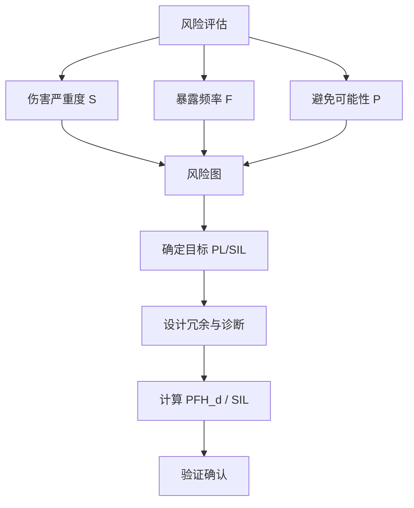
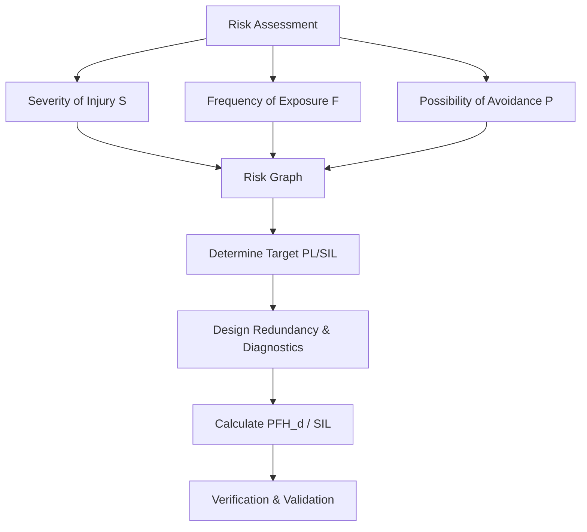
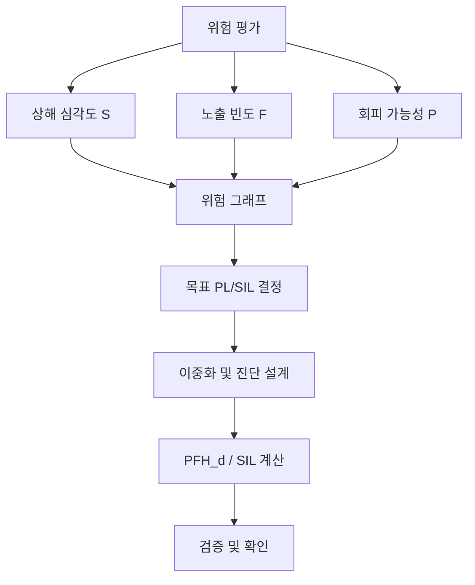

## 概述
IEC 61508是人形机器人领域的重要标准。以下内容整理自项目 Wiki，供深入查阅。

## 核心内容
人形机器人在人机共融环境中运行，其安全相关控制系统必须满足**功能安全（functional safety）**要求：当发生故障时，系统仍能将机器人带入安全状态。功能安全等级通常用 **IEC 61508 的 SIL（Safety Integrity Level）** 或 **ISO 13849 的 PL（Performance Level）** 来量化[37][38]。

!!! note "术语解释：功能安全、SIL、PL、安全完整性、故障安全"
    - **功能安全（functional safety）**：安全功能在故障情况下仍能正确执行的能力。
    - **SIL（Safety Integrity Level）**：IEC 61508 定义的安全完整性等级，从 SIL1 到 SIL4。
    - **PL（Performance Level）**：ISO 13849 定义的安全性能等级，从 PL a 到 PL e。
    - **安全完整性（safety integrity）**：安全功能按要求执行的概率。
    - **故障安全（fail-safe）**：故障后进入安全状态的设计理念。

ISO 13849 主要适用于机械安全相关控制系统，其 PL 等级与每小时危险失效概率 $PFH_d$（Probability of Dangerous Failure per Hour）对应：

| PL | $PFH_d$（每小时） | 典型应用 |
|---|---|---|
| PL a | $5 \times 10^{-5} \sim <10^{-4}$ | 低风险 |
| PL b | $3 \times 10^{-5} \sim <5 \times 10^{-5}$ | 一般风险 |
| PL c | $2 \times 10^{-6} \sim <3 \times 10^{-5}$ | 中等风险 |
| PL d | $1 \times 10^{-6} \sim <2 \times 10^{-6}$ | 较高风险 |
| PL e | $\sim 1 \times 10^{-6}$ | 高风险 |

IEC 61508 的 SIL 主要针对电气/电子/可编程电子系统，SIL1–SIL4 对应不同风险降低因子。对于人形机器人这类复杂机电系统，通常 SIL2/PL d 是较高要求，SIL3/PL e 用于与人频繁近距离交互的关键功能。

!!! note "术语解释：PFH_d、危险失效概率、风险降低因子、安全相关控制系统"
    - **PFH_d**：每小时危险失效概率（Probability of Dangerous Failure per Hour）。
    - **危险失效概率（dangerous failure probability）**：导致安全功能丧失的失效概率。
    - **风险降低因子（risk reduction factor）**：基准风险与采用安全功能后剩余风险之比。
    - **安全相关控制系统（safety-related control system）**：执行安全功能的控制部件集合。

ISO 13849 确定 PL 的过程称为**风险图（risk graph）**方法。设计者从三个维度评估风险：

1. **伤害严重程度（S）**：S1（轻微，通常可恢复）或 S2（严重，不可逆）。
2. **暴露于危险的频率和时间（F）**：F1（很少或短）或 F2（频繁或长）。
3. **避免危险的可能性（P）**：P1（可能）或 P2（几乎不可能）。

根据 S、F、P 的组合，风险图给出推荐 PL 等级。例如，S2+F2+P2 通常要求 PL e。

!!! note "术语解释：风险图、伤害严重程度、暴露频率、避免可能性"
    - **风险图（risk graph）**：根据伤害严重程度、暴露频率和避免可能性确定 PL 的图形化方法。
    - **伤害严重程度（severity）**：事故造成伤害的严重程度。
    - **暴露频率（frequency of exposure）**：人员暴露于危险的频繁程度。
    - **避免可能性（possibility of avoidance）**：人员能否及时避免危险。

实现高 SIL/PL 的核心技术包括：

- **冗余（redundancy）**：关键传感器、执行器或通道重复配置，如双编码器、双通道急停。
- **诊断覆盖率（Diagnostic Coverage, DC）**：系统能检测到的危险失效比例，分为 none、low、medium、high 四档。
- **平均危险失效间隔时间（MTTFd）**：子系统平均无危险失效的时间，用于计算整体 PFH_d。
- **共因失效（Common Cause Failure, CCF）控制**：通过电气隔离、多样化设计、物理隔离降低多通道同时失效概率。

!!! note "术语解释：冗余、诊断覆盖率、MTTFd、共因失效"
    - **冗余（redundancy）**：通过重复配置提高可靠性的方法。
    - **诊断覆盖率（DC）**：能被诊断出的危险失效占总危险失效的比例。
    - **MTTFd（Mean Time To dangerous Failure）**：平均危险失效间隔时间。
    - **共因失效（CCF）**：由同一原因导致多个独立通道同时失效的现象。

IEC 62061 是 IEC 61508 在机械安全领域的应用标准，常用于机器人安全控制系统设计。它采用 SIL 等级，并结合 ISO 13849 的 PFH_d 计算方法来评估系统安全完整性。实际项目中，人形机器人安全功能（如安全停止、速度监控、碰撞检测）需要同时满足适用的机械安全标准与功能安全标准。

!!! note "术语解释：IEC 62061、安全功能、验证确认、残余风险"
    - **IEC 62061**：机械安全控制系统与安全有关的电气控制系统标准。
    - **安全功能（safety function）**：为保护人员而设计的功能，如安全停止。
    - **验证确认（verification & validation）**：检查设计是否满足要求并确认是否满足真实需求。
    - **残余风险（residual risk）**：采取安全措施后仍然存在的风险。

## 参考
- Wiki extraction
- 项目 Wiki：chapter-08.md#8.7.5 功能安全与 SIL/PL

## Overview
IEC 61508 is an important standard in the field of humanoid robotics. The following content is compiled from the project Wiki for in-depth reference.

## Content
Humanoid robots operate in human-robot collaborative environments, and their safety-related control systems must meet **functional safety** requirements: when a fault occurs, the system must still be able to bring the robot to a safe state. Functional safety levels are typically quantified using **IEC 61508's SIL (Safety Integrity Level)** or **ISO 13849's PL (Performance Level)** [37][38].

!!! note "Term Explanation: Functional Safety, SIL, PL, Safety Integrity, Fail-Safe"
    - **Functional safety**: The ability of a safety function to be correctly executed even under fault conditions.
    - **SIL (Safety Integrity Level)**: Safety integrity levels defined by IEC 61508, ranging from SIL1 to SIL4.
    - **PL (Performance Level)**: Safety performance levels defined by ISO 13849, ranging from PL a to PL e.
    - **Safety integrity**: The probability of a safety function being performed as required.
    - **Fail-safe**: A design philosophy where the system enters a safe state upon failure.

ISO 13849 primarily applies to safety-related control systems for machinery, and its PL levels correspond to the probability of dangerous failure per hour $PFH_d$:

| PL | $PFH_d$ (per hour) | Typical Application |
|---|---|---|
| PL a | $5 \times 10^{-5} \sim <10^{-4}$ | Low risk |
| PL b | $3 \times 10^{-5} \sim <5 \times 10^{-5}$ | General risk |
| PL c | $2 \times 10^{-6} \sim <3 \times 10^{-5}$ | Medium risk |
| PL d | $1 \times 10^{-6} \sim <2 \times 10^{-6}$ | Higher risk |
| PL e | $\sim 1 \times 10^{-6}$ | High risk |

IEC 61508's SIL primarily targets electrical/electronic/programmable electronic systems, with SIL1–SIL4 corresponding to different risk reduction factors. For complex electromechanical systems like humanoid robots, SIL2/PL d is typically a high requirement, while SIL3/PL e is used for critical functions involving frequent and close human interaction.

!!! note "Term Explanation: PFH_d, Dangerous Failure Probability, Risk Reduction Factor, Safety-Related Control System"
    - **PFH_d**: Probability of Dangerous Failure per Hour.
    - **Dangerous failure probability**: The probability of a failure that leads to the loss of a safety function.
    - **Risk reduction factor**: The ratio of baseline risk to the residual risk after implementing safety functions.
    - **Safety-related control system**: A collection of control components that execute safety functions.

The process for determining PL in ISO 13849 is called the **risk graph** method. Designers assess risk from three dimensions:

1. **Severity of injury (S)**: S1 (slight, usually reversible) or S2 (severe, irreversible).
2. **Frequency and duration of exposure to hazard (F)**: F1 (rare or short) or F2 (frequent or long).
3. **Possibility of avoiding hazard (P)**: P1 (possible) or P2 (almost impossible).

Based on the combination of S, F, and P, the risk graph recommends a PL level. For example, S2+F2+P2 typically requires PL e.

!!! note "Term Explanation: Risk Graph, Severity of Injury, Frequency of Exposure, Possibility of Avoidance"
    - **Risk graph**: A graphical method for determining PL based on severity of injury, frequency of exposure, and possibility of avoidance.
    - **Severity of injury**: The severity of harm caused by an accident.
    - **Frequency of exposure**: How often personnel are exposed to a hazard.
    - **Possibility of avoidance**: Whether personnel can avoid the hazard in time.

Core technologies for achieving high SIL/PL include:

- **Redundancy**: Duplicate configuration of critical sensors, actuators, or channels, e.g., dual encoders, dual-channel emergency stop.
- **Diagnostic Coverage (DC)**: The proportion of dangerous failures that the system can detect, categorized as none, low, medium, or high.
- **Mean Time To dangerous Failure (MTTFd)**: The average time a subsystem operates without a dangerous failure, used to calculate the overall PFH_d.
- **Common Cause Failure (CCF) control**: Reducing the probability of simultaneous failure in multiple channels through electrical isolation, diverse design, and physical separation.

!!! note "Term Explanation: Redundancy, Diagnostic Coverage, MTTFd, Common Cause Failure"
    - **Redundancy**: A method to improve reliability through duplicate configuration.
    - **Diagnostic Coverage (DC)**: The proportion of total dangerous failures that can be diagnosed.
    - **MTTFd (Mean Time To dangerous Failure)**: The average time to a dangerous failure.
    - **Common Cause Failure (CCF)**: A phenomenon where multiple independent channels fail simultaneously due to the same cause.

IEC 62061 is an application standard of IEC 61508 in the field of machinery safety, commonly used in the design of robot safety control systems. It adopts SIL levels and combines ISO 13849's PFH_d calculation method to assess system safety integrity. In practical projects, safety functions for humanoid robots (e.g., safe stop, speed monitoring, collision detection) must simultaneously meet applicable machinery safety standards and functional safety standards.

!!! note "Term Explanation: IEC 62061, Safety Function, Verification & Validation, Residual Risk"
    - **IEC 62061**: Standard for safety-related electrical control systems for machinery.
    - **Safety function**: A function designed to protect personnel, e.g., safe stop.
    - **Verification & validation**: Checking whether the design meets requirements and confirming it satisfies real needs.
    - **Residual risk**: The risk that remains after safety measures have been implemented.

## 개요
IEC 61508은 휴머노이드 로봇 분야의 중요한 표준입니다. 다음 내용은 프로젝트 Wiki에서 정리한 것으로, 심층 참고용입니다.

## 핵심 내용
휴머노이드 로봇이 인간-로봇 공존 환경에서 작동할 때, 안전 관련 제어 시스템은 **기능 안전(functional safety)** 요구사항을 충족해야 합니다: 고장이 발생하더라도 시스템이 로봇을 안전 상태로 전환할 수 있어야 합니다. 기능 안전 등급은 일반적으로 **IEC 61508의 SIL(Safety Integrity Level)** 또는 **ISO 13849의 PL(Performance Level)** 로 정량화됩니다[37][38].

!!! note "용어 설명: 기능 안전, SIL, PL, 안전 무결성, 페일 세이프"
    - **기능 안전(functional safety)**: 고장 상황에서도 안전 기능이 올바르게 실행될 수 있는 능력.
    - **SIL(Safety Integrity Level)**: IEC 61508에서 정의한 안전 무결성 등급으로, SIL1부터 SIL4까지 있음.
    - **PL(Performance Level)**: ISO 13849에서 정의한 안전 성능 등급으로, PL a부터 PL e까지 있음.
    - **안전 무결성(safety integrity)**: 안전 기능이 요구대로 실행될 확률.
    - **페일 세이프(fail-safe)**: 고장 후 안전 상태로 진입하는 설계 개념.

ISO 13849는 주로 기계 안전 관련 제어 시스템에 적용되며, PL 등급은 시간당 위험 고장 확률 $PFH_d$(Probability of Dangerous Failure per Hour)에 대응됩니다:

| PL | $PFH_d$ (시간당) | 일반적 적용 |
|---|---|---|
| PL a | $5 \times 10^{-5} \sim <10^{-4}$ | 저위험 |
| PL b | $3 \times 10^{-5} \sim <5 \times 10^{-5}$ | 일반 위험 |
| PL c | $2 \times 10^{-6} \sim <3 \times 10^{-5}$ | 중간 위험 |
| PL d | $1 \times 10^{-6} \sim <2 \times 10^{-6}$ | 높은 위험 |
| PL e | $\sim 1 \times 10^{-6}$ | 고위험 |

IEC 61508의 SIL은 주로 전기/전자/프로그래밍 가능 전자 시스템을 대상으로 하며, SIL1–SIL4는 서로 다른 위험 감소 계수에 대응됩니다. 휴머노이드 로봇과 같은 복잡한 전기-기계 시스템의 경우, 일반적으로 SIL2/PL d가 높은 요구사항이며, SIL3/PL e는 인간과 빈번하고 밀접하게 상호작용하는 핵심 기능에 사용됩니다.

!!! note "용어 설명: PFH_d, 위험 고장 확률, 위험 감소 계수, 안전 관련 제어 시스템"
    - **PFH_d**: 시간당 위험 고장 확률(Probability of Dangerous Failure per Hour).
    - **위험 고장 확률(dangerous failure probability)**: 안전 기능 상실을 초래하는 고장 확률.
    - **위험 감소 계수(risk reduction factor)**: 기준 위험과 안전 기능 적용 후 잔여 위험의 비율.
    - **안전 관련 제어 시스템(safety-related control system)**: 안전 기능을 실행하는 제어 부품 집합.

ISO 13849에서 PL을 결정하는 과정을 **위험 그래프(risk graph)** 방법이라고 합니다. 설계자는 세 가지 차원에서 위험을 평가합니다:

1. **상해 심각도(S)**: S1(경미, 일반적으로 회복 가능) 또는 S2(심각, 비가역적).
2. **위험 노출 빈도 및 시간(F)**: F1(드물거나 짧음) 또는 F2(빈번하거나 김).
3. **위험 회피 가능성(P)**: P1(가능) 또는 P2(거의 불가능).

S, F, P의 조합에 따라 위험 그래프는 권장 PL 등급을 제시합니다. 예를 들어, S2+F2+P2는 일반적으로 PL e를 요구합니다.

!!! note "용어 설명: 위험 그래프, 상해 심각도, 노출 빈도, 회피 가능성"
    - **위험 그래프(risk graph)**: 상해 심각도, 노출 빈도 및 회피 가능성에 따라 PL을 결정하는 그래픽 방법.
    - **상해 심각도(severity)**: 사고로 인한 상해의 심각한 정도.
    - **노출 빈도(frequency of exposure)**: 사람이 위험에 노출되는 빈도.
    - **회피 가능성(possibility of avoidance)**: 사람이 위험을 적시에 회피할 수 있는지 여부.

높은 SIL/PL을 달성하기 위한 핵심 기술은 다음과 같습니다:

- **이중화(redundancy)**: 핵심 센서, 액추에이터 또는 채널을 중복 구성, 예: 이중 엔코더, 이중 채널 비상 정지.
- **진단 커버리지(Diagnostic Coverage, DC)**: 시스템이 감지할 수 있는 위험 고장 비율로, none, low, medium, high의 네 단계로 구분.
- **평균 위험 고장 간격 시간(MTTFd)**: 서브시스템이 평균적으로 위험 고장 없이 작동하는 시간으로, 전체 PFH_d 계산에 사용.
- **공통 원인 고장(Common Cause Failure, CCF) 제어**: 전기적 절연, 다양화 설계, 물리적 격리를 통해 다중 채널 동시 고장 확률을 낮춤.

!!! note "용어 설명: 이중화, 진단 커버리지, MTTFd, 공통 원인 고장"
    - **이중화(redundancy)**: 중복 구성을 통해 신뢰성을 높이는 방법.
    - **진단 커버리지(DC)**: 진단 가능한 위험 고장이 전체 위험 고장에서 차지하는 비율.
    - **MTTFd(Mean Time To dangerous Failure)**: 평균 위험 고장 간격 시간.
    - **공통 원인 고장(CCF)**: 동일한 원인으로 여러 독립 채널이 동시에 고장나는 현상.

IEC 62061은 기계 안전 분야에서 IEC 61508의 응용 표준으로, 로봇 안전 제어 시스템 설계에 자주 사용됩니다. 이 표준은 SIL 등급을 사용하며, ISO 13849의 PFH_d 계산 방법을 결합하여 시스템 안전 무결성을 평가합니다. 실제 프로젝트에서 휴머노이드 로봇의 안전 기능(예: 안전 정지, 속도 모니터링, 충돌 감지)은 적용 가능한 기계 안전 표준과 기능 안전 표준을 동시에 충족해야 합니다.

!!! note "용어 설명: IEC 62061, 안전 기능, 검증 및 확인, 잔여 위험"
    - **IEC 62061**: 기계 안전 제어 시스템과 관련된 전기 제어 시스템 표준.
    - **안전 기능(safety function)**: 사람을 보호하기 위해 설계된 기능, 예: 안전 정지.
    - **검증 및 확인(verification & validation)**: 설계가 요구사항을 충족하는지 확인하고 실제 요구를 충족하는지 확인하는 과정.
    - **잔여 위험(residual risk)**: 안전 조치를 취한 후에도 여전히 존재하는 위험.
