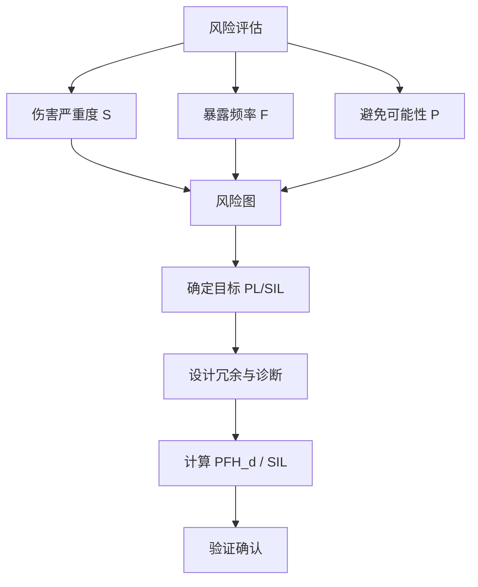

## 概述
ISO 13849是人形机器人领域的重要standard。以下内容整理自项目 Wiki，供深入查阅。

## 核心内容
人形机器人在人机共融环境中运行，其安全相关控制系统必须满足**功能安全（functional safety）**要求：当发生故障时，系统仍能将机器人带入安全状态。功能安全等级通常用 **IEC 61508 的 SIL（Safety Integrity Level）** 或 **ISO 13849 的 PL（Performance Level）** 来量化[37][38]。

!!! note "术语解释：功能安全、SIL、PL、安全完整性、故障安全"
    - **功能安全（functional safety）**：安全功能在故障情况下仍能正确执行的能力。
    - **SIL（Safety Integrity Level）**：IEC 61508 定义的安全完整性等级，从 SIL1 到 SIL4。
    - **PL（Performance Level）**：ISO 13849 定义的安全性能等级，从 PL a 到 PL e。
    - **安全完整性（safety integrity）**：安全功能按要求执行的概率。
    - **故障安全（fail-safe）**：故障后进入安全状态的设计理念。

ISO 13849 主要适用于机械安全相关控制系统，其 PL 等级与每小时危险失效概率 $PFH_d$（Probability of Dangerous Failure per Hour）对应：

| PL | $PFH_d$（每小时） | 典型应用 |
|---|---|---|
| PL a | $5 \times 10^{-5} \sim <10^{-4}$ | 低风险 |
| PL b | $3 \times 10^{-5} \sim <5 \times 10^{-5}$ | 一般风险 |
| PL c | $2 \times 10^{-6} \sim <3 \times 10^{-5}$ | 中等风险 |
| PL d | $1 \times 10^{-6} \sim <2 \times 10^{-6}$ | 较高风险 |
| PL e | $\sim 1 \times 10^{-6}$ | 高风险 |

IEC 61508 的 SIL 主要针对电气/电子/可编程电子系统，SIL1–SIL4 对应不同风险降低因子。对于人形机器人这类复杂机电系统，通常 SIL2/PL d 是较高要求，SIL3/PL e 用于与人频繁近距离交互的关键功能。

!!! note "术语解释：PFH_d、危险失效概率、风险降低因子、安全相关控制系统"
    - **PFH_d**：每小时危险失效概率（Probability of Dangerous Failure per Hour）。
    - **危险失效概率（dangerous failure probability）**：导致安全功能丧失的失效概率。
    - **风险降低因子（risk reduction factor）**：基准风险与采用安全功能后剩余风险之比。
    - **安全相关控制系统（safety-related control system）**：执行安全功能的控制部件集合。

ISO 13849 确定 PL 的过程称为**风险图（risk graph）**方法。设计者从三个维度评估风险：

1. **伤害严重程度（S）**：S1（轻微，通常可恢复）或 S2（严重，不可逆）。
2. **暴露于危险的频率和时间（F）**：F1（很少或短）或 F2（频繁或长）。
3. **避免危险的可能性（P）**：P1（可能）或 P2（几乎不可能）。

根据 S、F、P 的组合，风险图给出推荐 PL 等级。例如，S2+F2+P2 通常要求 PL e。

!!! note "术语解释：风险图、伤害严重程度、暴露频率、避免可能性"
    - **风险图（risk graph）**：根据伤害严重程度、暴露频率和避免可能性确定 PL 的图形化方法。
    - **伤害严重程度（severity）**：事故造成伤害的严重程度。
    - **暴露频率（frequency of exposure）**：人员暴露于危险的频繁程度。
    - **避免可能性（possibility of avoidance）**：人员能否及时避免危险。

实现高 SIL/PL 的核心技术包括：

- **冗余（redundancy）**：关键传感器、执行器或通道重复配置，如双编码器、双通道急停。
- **诊断覆盖率（Diagnostic Coverage, DC）**：系统能检测到的危险失效比例，分为 none、low、medium、high 四档。
- **平均危险失效间隔时间（MTTFd）**：子系统平均无危险失效的时间，用于计算整体 PFH_d。
- **共因失效（Common Cause Failure, CCF）控制**：通过电气隔离、多样化设计、物理隔离降低多通道同时失效概率。

!!! note "术语解释：冗余、诊断覆盖率、MTTFd、共因失效"
    - **冗余（redundancy）**：通过重复配置提高可靠性的方法。
    - **诊断覆盖率（DC）**：能被诊断出的危险失效占总危险失效的比例。
    - **MTTFd（Mean Time To dangerous Failure）**：平均危险失效间隔时间。
    - **共因失效（CCF）**：由同一原因导致多个独立通道同时失效的现象。

IEC 62061 是 IEC 61508 在机械安全领域的应用标准，常用于机器人安全控制系统设计。它采用 SIL 等级，并结合 ISO 13849 的 PFH_d 计算方法来评估系统安全完整性。实际项目中，人形机器人安全功能（如安全停止、速度监控、碰撞检测）需要同时满足适用的机械安全标准与功能安全标准。

!!! note "术语解释：IEC 62061、安全功能、验证确认、残余风险"
    - **IEC 62061**：机械安全控制系统与安全有关的电气控制系统标准。
    - **安全功能（safety function）**：为保护人员而设计的功能，如安全停止。
    - **验证确认（verification & validation）**：检查设计是否满足要求并确认是否满足真实需求。
    - **残余风险（residual risk）**：采取安全措施后仍然存在的风险。

## 参考
- Wiki extraction
- 项目 Wiki：chapter-08.md#8.7.5 功能安全与 SIL/PL

