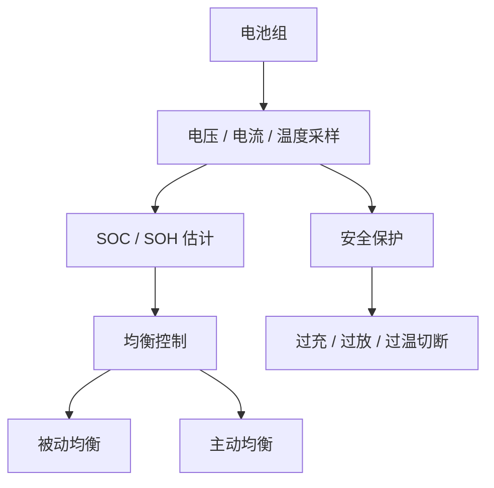

## 概述
电池管理系统是人形机器人领域的重要零部件。以下内容整理自项目 Wiki，供深入查阅。

## 核心内容
电池管理系统（BMS）监控并保护电池组，确保其在安全、高效和长寿命的窗口内工作。

!!! note "术语解释：BMS、SOC、SOH、均衡、热失控、过充、过放"
    - **BMS（Battery Management System）**：电池管理系统，负责监测、保护和控制电池组。
    - **SOC（State of Charge）**：荷电状态，表示剩余电量百分比。
    - **SOH（State of Health）**：健康状态，反映电池当前最大容量与初始容量的比值。
    - **均衡（balancing）**：让串联电池单体间电压/容量趋于一致，防止个别单体过充或过放。
    - **热失控（thermal runaway）**：电池内部放热反应自我加速，导致温度急剧上升的现象。
    - **过充 / 过放**：充电电压超过上限或放电电压低于下限，可能损害电池或引发安全事故。

**热失控机理**。锂离子电池热失控通常由过充、过放、短路、机械损伤或高温引发。过程包括：SEI 膜分解（约 80–120 °C）、隔膜收缩（约 130 °C）、正极释氧与电解液氧化（约 150–250 °C），最终导致内部短路和剧烈放热。BMS 通过电压、温度和气体传感器（如 CO、HF）进行多级预警，并在检测到异常时切断主继电器、启动灭火或排气装置。

!!! note "术语解释：SEI 膜、隔膜、电解液、正极释氧、气体传感器"
    - **SEI 膜（Solid Electrolyte Interphase）**：负极表面形成的固态电解质界面膜，对电池性能和安全性至关重要。
    - **正极释氧（cathode oxygen release）**：高温下正极材料释放氧气，加剧电解液燃烧风险。
    - **气体传感器（gas sensor）**：检测电池异常产气（CO、HF、烃类）的传感器。

**SOC 估计**。库仑计数法通过积分电流估计 SOC：

$$
SOC(t) = SOC(t_0) + \frac{1}{Q_{nom}} \int_{t_0}^{t} \eta \, I(\tau) \, d\tau
$$

其中 \(Q_{nom}\) 为标称容量，\(\eta\) 为充放电效率，\(I\) 为电流（充电为正）。库仑计数会累积误差，常与开路电压（OCV）查表或卡尔曼滤波结合。

!!! note "术语解释：库仑计数、开路电压、卡尔曼滤波、内阻"
    - **库仑计数（coulomb counting）**：通过积分电流估计电池充放电量的方法。
    - **开路电压（OCV）**：电池在无负载时的端电压，与 SOC 存在单调关系。
    - **卡尔曼滤波（Kalman filter）**：利用模型和测量递归估计状态的算法。
    - **内阻（internal resistance）**：电池内部的等效电阻，导致充放电时端电压偏离 OCV。

**SOH 估计**。常用方法包括：容量衰减法、内阻增长法、增量容量分析（ICA）和差分电压分析（DVA）。

**扩展卡尔曼滤波（EKF）SOC 估计**。电池可建模为一阶 RC 等效电路：

$$
U_t = U_{OCV}(SOC) - I R_0 - U_1
$$
$$
\dot{U}_1 = -\frac{U_1}{R_1 C_1} + \frac{I}{C_1}
$$
$$
\dot{SOC} = -\frac{\eta I}{Q_{nom}}
$$

状态向量取 \([SOC, U_1]^T\)，观测量为端电压 \(U_t\)。EKF 在每个采样时刻先通过模型预测状态，再用电压测量更新状态，从而同时抑制电流积分漂移和电压测量噪声。更先进的无迹卡尔曼滤波（UKF）和粒子滤波（PF）可处理强非线性，但计算量更大。

!!! note "术语解释：等效电路模型、一阶 RC、极化电压、扩展卡尔曼滤波、无迹卡尔曼滤波"
    - **等效电路模型（equivalent circuit model, ECM）**：用电压源、电阻、电容模拟电池电气行为的简化模型。
    - **一阶 RC 模型**：包含一个欧姆内阻 \(R_0\) 和一个 RC 并联极化支路的电池模型。
    - **极化电压（polarization voltage）**：电池充放电过程中由于电化学极化和浓差极化产生的额外压降。
    - **无迹卡尔曼滤波（UKF）**：通过无迹变换处理非线性系统的卡尔曼滤波变体。
    - **粒子滤波（PF）**：基于蒙特卡洛采样的非线性/非高斯状态估计方法。

**均衡**。被动均衡通过电阻消耗高电压单体的能量；主动均衡通过电感、电容或变压器把能量从高压单体转移到低压单体，效率更高但成本更高。

## 参考
- [Identification of a Physics-Based Electrical Power Consumption Model for the Unitree G1 Humanoid Arm](https://arxiv.org/abs/2606.15915)
- 项目 Wiki：chapter-06.md#6.5.2 电池管理系统 BMS：SOC/SOH 估计、均衡、过充过放保护、热失控

