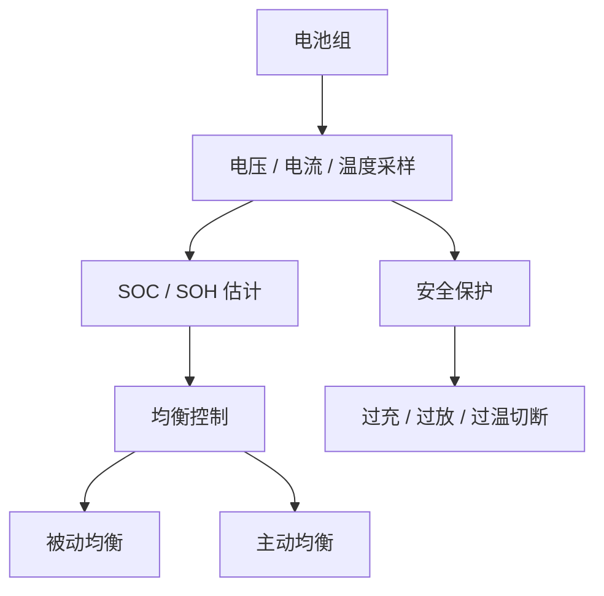

## 概述
电池管理系统是人形机器人领域的重要零部件。以下内容整理自项目 Wiki，供深入查阅。

## 核心内容
电池管理系统（BMS）监控并保护电池组，确保其在安全、高效和长寿命的窗口内工作。

!!! note "术语解释：BMS、SOC、SOH、均衡、热失控、过充、过放"
    - **BMS（Battery Management System）**：电池管理系统，负责监测、保护和控制电池组。
    - **SOC（State of Charge）**：荷电状态，表示剩余电量百分比。
    - **SOH（State of Health）**：健康状态，反映电池当前最大容量与初始容量的比值。
    - **均衡（balancing）**：让串联电池单体间电压/容量趋于一致，防止个别单体过充或过放。
    - **热失控（thermal runaway）**：电池内部放热反应自我加速，导致温度急剧上升的现象。
    - **过充 / 过放**：充电电压超过上限或放电电压低于下限，可能损害电池或引发安全事故。

**热失控机理**。锂离子电池热失控通常由过充、过放、短路、机械损伤或高温引发。过程包括：SEI 膜分解（约 80–120 °C）、隔膜收缩（约 130 °C）、正极释氧与电解液氧化（约 150–250 °C），最终导致内部短路和剧烈放热。BMS 通过电压、温度和气体传感器（如 CO、HF）进行多级预警，并在检测到异常时切断主继电器、启动灭火或排气装置。

!!! note "术语解释：SEI 膜、隔膜、电解液、正极释氧、气体传感器"
    - **SEI 膜（Solid Electrolyte Interphase）**：负极表面形成的固态电解质界面膜，对电池性能和安全性至关重要。
    - **正极释氧（cathode oxygen release）**：高温下正极材料释放氧气，加剧电解液燃烧风险。
    - **气体传感器（gas sensor）**：检测电池异常产气（CO、HF、烃类）的传感器。

**SOC 估计**。库仑计数法通过积分电流估计 SOC：

$$
SOC(t) = SOC(t_0) + \frac{1}{Q_{nom}} \int_{t_0}^{t} \eta \, I(\tau) \, d\tau
$$

其中 \(Q_{nom}\) 为标称容量，\(\eta\) 为充放电效率，\(I\) 为电流（充电为正）。库仑计数会累积误差，常与开路电压（OCV）查表或卡尔曼滤波结合。

!!! note "术语解释：库仑计数、开路电压、卡尔曼滤波、内阻"
    - **库仑计数（coulomb counting）**：通过积分电流估计电池充放电量的方法。
    - **开路电压（OCV）**：电池在无负载时的端电压，与 SOC 存在单调关系。
    - **卡尔曼滤波（Kalman filter）**：利用模型和测量递归估计状态的算法。
    - **内阻（internal resistance）**：电池内部的等效电阻，导致充放电时端电压偏离 OCV。

**SOH 估计**。常用方法包括：容量衰减法、内阻增长法、增量容量分析（ICA）和差分电压分析（DVA）。

**扩展卡尔曼滤波（EKF）SOC 估计**。电池可建模为一阶 RC 等效电路：

$$
U_t = U_{OCV}(SOC) - I R_0 - U_1
$$
$$
\dot{U}_1 = -\frac{U_1}{R_1 C_1} + \frac{I}{C_1}
$$
$$
\dot{SOC} = -\frac{\eta I}{Q_{nom}}
$$

状态向量取 \([SOC, U_1]^T\)，观测量为端电压 \(U_t\)。EKF 在每个采样时刻先通过模型预测状态，再用电压测量更新状态，从而同时抑制电流积分漂移和电压测量噪声。更先进的无迹卡尔曼滤波（UKF）和粒子滤波（PF）可处理强非线性，但计算量更大。

!!! note "术语解释：等效电路模型、一阶 RC、极化电压、扩展卡尔曼滤波、无迹卡尔曼滤波"
    - **等效电路模型（equivalent circuit model, ECM）**：用电压源、电阻、电容模拟电池电气行为的简化模型。
    - **一阶 RC 模型**：包含一个欧姆内阻 \(R_0\) 和一个 RC 并联极化支路的电池模型。
    - **极化电压（polarization voltage）**：电池充放电过程中由于电化学极化和浓差极化产生的额外压降。
    - **无迹卡尔曼滤波（UKF）**：通过无迹变换处理非线性系统的卡尔曼滤波变体。
    - **粒子滤波（PF）**：基于蒙特卡洛采样的非线性/非高斯状态估计方法。

**均衡**。被动均衡通过电阻消耗高电压单体的能量；主动均衡通过电感、电容或变压器把能量从高压单体转移到低压单体，效率更高但成本更高。



## 参考
- [Identification of a Physics-Based Electrical Power Consumption Model for the Unitree G1 Humanoid Arm](https://arxiv.org/abs/2606.15915)
- 项目 Wiki：chapter-06.md#6.5.2 电池管理系统 BMS：SOC/SOH 估计、均衡、过充过放保护、热失控

## Overview
The battery management system is a critical component in the field of humanoid robots. The following content is compiled from the project Wiki for in-depth reference.

## Content
A Battery Management System (BMS) monitors and protects the battery pack, ensuring it operates within a safe, efficient, and long-lasting window.

!!! note "Terminology: BMS, SOC, SOH, Balancing, Thermal Runaway, Overcharge, Overdischarge"
    - **BMS (Battery Management System)**: Responsible for monitoring, protecting, and controlling the battery pack.
    - **SOC (State of Charge)**: Indicates the remaining charge as a percentage.
    - **SOH (State of Health)**: Reflects the ratio of the battery's current maximum capacity to its initial capacity.
    - **Balancing**: Equalizes voltage/capacity among series-connected cells to prevent individual cells from overcharging or overdischarging.
    - **Thermal runaway**: A self-accelerating exothermic reaction inside the battery, leading to a rapid temperature rise.
    - **Overcharge / Overdischarge**: Charging voltage exceeding the upper limit or discharging voltage falling below the lower limit, potentially damaging the battery or causing safety incidents.

**Mechanism of Thermal Runaway**. Thermal runaway in lithium-ion batteries is typically triggered by overcharge, overdischarge, short circuit, mechanical damage, or high temperature. The process includes: SEI decomposition (approx. 80–120 °C), separator shrinkage (approx. 130 °C), cathode oxygen release and electrolyte oxidation (approx. 150–250 °C), ultimately leading to internal short circuits and intense heat generation. The BMS provides multi-level warnings via voltage, temperature, and gas sensors (e.g., CO, HF), and upon detecting anomalies, it disconnects the main relay and activates fire suppression or venting systems.

!!! note "Terminology: SEI, Separator, Electrolyte, Cathode Oxygen Release, Gas Sensor"
    - **SEI (Solid Electrolyte Interphase)**: A solid electrolyte interface film formed on the anode surface, crucial for battery performance and safety.
    - **Cathode oxygen release**: The release of oxygen from cathode materials at high temperatures, exacerbating the risk of electrolyte combustion.
    - **Gas sensor**: A sensor that detects abnormal gas production (CO, HF, hydrocarbons) from the battery.

**SOC Estimation**. Coulomb counting estimates SOC by integrating current:

$$
SOC(t) = SOC(t_0) + \frac{1}{Q_{nom}} \int_{t_0}^{t} \eta \, I(\tau) \, d\tau
$$

where \(Q_{nom}\) is the nominal capacity, \(\eta\) is the charge/discharge efficiency, and \(I\) is the current (positive for charging). Coulomb counting accumulates errors and is often combined with open-circuit voltage (OCV) lookup tables or Kalman filtering.

!!! note "Terminology: Coulomb Counting, Open-Circuit Voltage, Kalman Filter, Internal Resistance"
    - **Coulomb counting**: A method for estimating battery charge/discharge by integrating current.
    - **Open-circuit voltage (OCV)**: The terminal voltage of a battery under no load, which has a monotonic relationship with SOC.
    - **Kalman filter**: An algorithm that recursively estimates states using a model and measurements.
    - **Internal resistance**: The equivalent resistance inside the battery, causing terminal voltage to deviate from OCV during charge/discharge.

**SOH Estimation**. Common methods include: capacity fade method, internal resistance growth method, incremental capacity analysis (ICA), and differential voltage analysis (DVA).

**Extended Kalman Filter (EKF) for SOC Estimation**. The battery can be modeled as a first-order RC equivalent circuit:

$$
U_t = U_{OCV}(SOC) - I R_0 - U_1
$$
$$
\dot{U}_1 = -\frac{U_1}{R_1 C_1} + \frac{I}{C_1}
$$
$$
\dot{SOC} = -\frac{\eta I}{Q_{nom}}
$$

The state vector is \([SOC, U_1]^T\), and the observation is the terminal voltage \(U_t\). At each sampling instant, the EKF first predicts the state using the model, then updates it with the voltage measurement, thereby suppressing both current integration drift and voltage measurement noise. More advanced methods like the Unscented Kalman Filter (UKF) and Particle Filter (PF) can handle strong nonlinearities but require higher computational cost.

!!! note "Terminology: Equivalent Circuit Model, First-Order RC, Polarization Voltage, Extended Kalman Filter, Unscented Kalman Filter"
    - **Equivalent circuit model (ECM)**: A simplified model using voltage sources, resistors, and capacitors to simulate battery electrical behavior.
    - **First-order RC model**: A battery model including an ohmic internal resistance \(R_0\) and one RC parallel polarization branch.
    - **Polarization voltage**: The additional voltage drop during battery charge/discharge due to electrochemical and concentration polarization.
    - **Unscented Kalman Filter (UKF)**: A variant of the Kalman filter that handles nonlinear systems via the unscented transform.
    - **Particle Filter (PF)**: A Monte Carlo sampling-based method for nonlinear/non-Gaussian state estimation.

**Balancing**. Passive balancing dissipates energy from high-voltage cells through resistors; active balancing transfers energy from high-voltage cells to low-voltage cells using inductors, capacitors, or transformers, offering higher efficiency but at a higher cost.

```mermaid
flowchart TD
    A["Battery Pack"] --> B["Voltage / Current / Temperature Sampling"]
    B --> C["SOC / SOH Estimation"]
    C --> D["Balancing Control"]
    D --> E["Passive Balancing"]
    D --> F["Active Balancing"]
    B --> G["Safety Protection"]
    G --> H["Overcharge / Overdischarge / Overtemperature Cutoff"]

## 개요
배터리 관리 시스템은 휴머노이드 로봇 분야의 중요한 부품입니다. 아래 내용은 프로젝트 Wiki에서 정리한 것으로, 심층적인 참고를 위해 제공됩니다.

## 핵심 내용
배터리 관리 시스템(BMS)은 배터리 팩을 모니터링하고 보호하여 안전하고 효율적이며 긴 수명 범위 내에서 작동하도록 보장합니다.

!!! note "용어 설명: BMS, SOC, SOH, 균등화, 열 폭주, 과충전, 과방전"
    - **BMS(Battery Management System)**: 배터리 관리 시스템으로, 배터리 팩의 모니터링, 보호 및 제어를 담당합니다.
    - **SOC(State of Charge)**: 충전 상태로, 남은 전력량을 백분율로 나타냅니다.
    - **SOH(State of Health)**: 건강 상태로, 배터리의 현재 최대 용량과 초기 용량의 비율을 반영합니다.
    - **균등화(balancing)**: 직렬 연결된 배터리 셀 간의 전압/용량을 일치시켜 특정 셀의 과충전 또는 과방전을 방지합니다.
    - **열 폭주(thermal runaway)**: 배터리 내부의 발열 반응이 자기 가속화되어 온도가 급격히 상승하는 현상입니다.
    - **과충전 / 과방전**: 충전 전압이 상한을 초과하거나 방전 전압이 하한 미만으로 떨어져 배터리를 손상시키거나 안전 사고를 유발할 수 있습니다.

**열 폭주 메커니즘**. 리튬이온 배터리의 열 폭주는 일반적으로 과충전, 과방전, 단락, 기계적 손상 또는 고온에 의해 유발됩니다. 과정은 다음과 같습니다: SEI 막 분해(약 80–120 °C), 분리막 수축(약 130 °C), 양극 산소 방출 및 전해질 산화(약 150–250 °C), 최종적으로 내부 단락과 격렬한 발열로 이어집니다. BMS는 전압, 온도 및 가스 센서(예: CO, HF)를 통해 다단계 경고를 수행하고, 이상이 감지되면 주 릴레이를 차단하고 소화 또는 배기 장치를 작동시킵니다.

!!! note "용어 설명: SEI 막, 분리막, 전해질, 양극 산소 방출, 가스 센서"
    - **SEI 막(Solid Electrolyte Interphase)**: 음극 표면에 형성된 고체 전해질 계면 막으로, 배터리 성능과 안전성에 매우 중요합니다.
    - **양극 산소 방출(cathode oxygen release)**: 고온에서 양극 재료가 산소를 방출하여 전해질 연소 위험을 증가시킵니다.
    - **가스 센서(gas sensor)**: 배터리 이상 가스(CO, HF, 탄화수소)를 감지하는 센서입니다.

**SOC 추정**. 쿨롱 카운팅법은 전류를 적분하여 SOC를 추정합니다:

$$
SOC(t) = SOC(t_0) + \frac{1}{Q_{nom}} \int_{t_0}^{t} \eta \, I(\tau) \, d\tau
$$

여기서 \(Q_{nom}\)은 공칭 용량, \(\eta\)는 충방전 효율, \(I\)는 전류(충전 시 양수)입니다. 쿨롱 카운팅은 오차가 누적되므로, 개방 회로 전압(OCV) 테이블 조회 또는 칼만 필터와 결합하여 사용됩니다.

!!! note "용어 설명: 쿨롱 카운팅, 개방 회로 전압, 칼만 필터, 내부 저항"
    - **쿨롱 카운팅(coulomb counting)**: 전류를 적분하여 배터리의 충방전량을 추정하는 방법입니다.
    - **개방 회로 전압(OCV)**: 무부하 상태에서 배터리의 단자 전압으로, SOC와 단조 관계를 가집니다.
    - **칼만 필터(Kalman filter)**: 모델과 측정값을 사용하여 상태를 재귀적으로 추정하는 알고리즘입니다.
    - **내부 저항(internal resistance)**: 배터리 내부의 등가 저항으로, 충방전 시 단자 전압이 OCV에서 벗어나게 합니다.

**SOH 추정**. 일반적인 방법으로는 용량 감소법, 내부 저항 증가법, 증분 용량 분석(ICA) 및 차동 전압 분석(DVA)이 있습니다.

**확장 칼만 필터(EKF) SOC 추정**. 배터리는 1차 RC 등가 회로로 모델링할 수 있습니다:

$$
U_t = U_{OCV}(SOC) - I R_0 - U_1
$$
$$
\dot{U}_1 = -\frac{U_1}{R_1 C_1} + \frac{I}{C_1}
$$
$$
\dot{SOC} = -\frac{\eta I}{Q_{nom}}
$$

상태 벡터는 \([SOC, U_1]^T\)로 하고, 관측량은 단자 전압 \(U_t\)입니다. EKF는 각 샘플링 시점에서 먼저 모델을 통해 상태를 예측한 후, 전압 측정값으로 상태를 업데이트하여 전류 적분 드리프트와 전압 측정 노이즈를 동시에 억제합니다. 더 진보된 무향 칼만 필터(UKF)와 입자 필터(PF)는 강한 비선형성을 처리할 수 있지만 계산량이 더 많습니다.

!!! note "용어 설명: 등가 회로 모델, 1차 RC, 분극 전압, 확장 칼만 필터, 무향 칼만 필터"
    - **등가 회로 모델(equivalent circuit model, ECM)**: 전압원, 저항, 커패시터를 사용하여 배터리의 전기적 거동을 모방한 단순화된 모델입니다.
    - **1차 RC 모델**: 하나의 옴 내부 저항 \(R_0\)과 하나의 RC 병렬 분극 분기로 구성된 배터리 모델입니다.
    - **분극 전압(polarization voltage)**: 배터리 충방전 과정에서 전기화학적 분극과 농도 분극으로 인해 발생하는 추가 전압 강하입니다.
    - **무향 칼만 필터(UKF)**: 무향 변환을 통해 비선형 시스템을 처리하는 칼만 필터 변형입니다.
    - **입자 필터(PF)**: 몬테카를로 샘플링 기반의 비선형/비가우시안 상태 추정 방법입니다.

**균등화**. 수동 균등화는 저항을 통해 높은 전압 셀의 에너지를 소모합니다. 능동 균등화는 인덕터, 커패시터 또는 변압기를 통해 높은 전압 셀에서 낮은 전압 셀로 에너지를 전달하며, 효율은 높지만 비용이 더 높습니다.

```mermaid
flowchart TD
    A["배터리 팩"] --> B["전압 / 전류 / 온도 샘플링"]
    B --> C["SOC / SOH 추정"]
    C --> D["균등화 제어"]
    D --> E["수동 균등화"]
    D --> F["능동 균등화"]
    B --> G["안전 보호"]
    G --> H["과충전 / 과방전 / 과온 차단"]

## 개요
배터리 관리 시스템은 휴머노이드 로봇 분야의 중요한 부품입니다. 아래 내용은 프로젝트 Wiki에서 정리한 것으로, 심층적인 참고를 위해 제공됩니다.

## 핵심 내용
배터리 관리 시스템(BMS)은 배터리 팩을 모니터링하고 보호하여 안전하고 효율적이며 긴 수명 범위 내에서 작동하도록 보장합니다.

!!! note "용어 설명: BMS, SOC, SOH, 균등화, 열 폭주, 과충전, 과방전"
    - **BMS(Battery Management System)** : 배터리 관리 시스템으로, 배터리 팩의 모니터링, 보호 및 제어를 담당합니다.
    - **SOC(State of Charge)** : 충전 상태로, 남은 전력량을 백분율로 나타냅니다.
    - **SOH(State of Health)** : 건강 상태로, 배터리의 현재 최대 용량과 초기 용량의 비율을 반영합니다.
    - **균등화(balancing)** : 직렬 연결된 배터리 셀 간의 전압/용량을 일치시켜 특정 셀의 과충전 또는 과방전을 방지합니다.
    - **열 폭주(thermal runaway)** : 배터리 내부의 발열 반응이 자체적으로 가속화되어 온도가 급격히 상승하는 현상입니다.
    - **과충전 / 과방전** : 충전 전압이 상한을 초과하거나 방전 전압이 하한 미만으로 떨어져 배터리 손상이나 안전 사고를 유발할 수 있습니다.

**열 폭주 메커니즘**. 리튬이온 배터리의 열 폭주는 일반적으로 과충전, 과방전, 단락, 기계적 손상 또는 고온에 의해 유발됩니다. 과정은 다음과 같습니다: SEI 막 분해(약 80–120 °C), 분리막 수축(약 130 °C), 양극 산소 방출 및 전해질 산화(약 150–250 °C), 최종적으로 내부 단락과 격렬한 발열로 이어집니다. BMS는 전압, 온도 및 가스 센서(예: CO, HF)를 통해 다단계 경고를 수행하고, 이상 징후 감지 시 주 릴레이를 차단하고 소화 또는 배기 장치를 작동시킵니다.

!!! note "용어 설명: SEI 막, 분리막, 전해질, 양극 산소 방출, 가스 센서"
    - **SEI 막(Solid Electrolyte Interphase)** : 음극 표면에 형성된 고체 전해질 계면 막으로, 배터리 성능과 안전성에 매우 중요합니다.
    - **양극 산소 방출(cathode oxygen release)** : 고온에서 양극 재료가 산소를 방출하여 전해질 연소 위험을 증가시킵니다.
    - **가스 센서(gas sensor)** : 배터리 이상 가스(CO, HF, 탄화수소)를 감지하는 센서입니다.

**SOC 추정**. 쿨롱 카운팅법은 전류를 적분하여 SOC를 추정합니다:

$$
SOC(t) = SOC(t_0) + \frac{1}{Q_{nom}} \int_{t_0}^{t} \eta \, I(\tau) \, d\tau
$$

여기서 \(Q_{nom}\)은 공칭 용량, \(\eta\)는 충방전 효율, \(I\)는 전류(충전 시 양수)입니다. 쿨롱 카운팅은 오차가 누적되므로, 개방 회로 전압(OCV) 테이블 조회 또는 칼만 필터와 결합하여 사용됩니다.

!!! note "용어 설명: 쿨롱 카운팅, 개방 회로 전압, 칼만 필터, 내부 저항"
    - **쿨롱 카운팅(coulomb counting)** : 전류를 적분하여 배터리의 충방전량을 추정하는 방법입니다.
    - **개방 회로 전압(OCV)** : 무부하 상태에서 배터리의 단자 전압으로, SOC와 단조 관계를 가집니다.
    - **칼만 필터(Kalman filter)** : 모델과 측정값을 사용하여 상태를 재귀적으로 추정하는 알고리즘입니다.
    - **내부 저항(internal resistance)** : 배터리 내부의 등가 저항으로, 충방전 시 단자 전압이 OCV에서 벗어나게 합니다.

**SOH 추정**. 일반적인 방법으로는 용량 감소법, 내부 저항 증가법, 증분 용량 분석(ICA) 및 차동 전압 분석(DVA)이 있습니다.

**확장 칼만 필터(EKF) SOC 추정**. 배터리는 1차 RC 등가 회로로 모델링할 수 있습니다:

$$
U_t = U_{OCV}(SOC) - I R_0 - U_1
$$
$$
\dot{U}_1 = -\frac{U_1}{R_1 C_1} + \frac{I}{C_1}
$$
$$
\dot{SOC} = -\frac{\eta I}{Q_{nom}}
$$

상태 벡터는 \([SOC, U_1]^T\)로 하고, 관측량은 단자 전압 \(U_t\)입니다. EKF는 각 샘플링 시점에서 먼저 모델을 통해 상태를 예측한 후, 전압 측정값으로 상태를 업데이트하여 전류 적분 드리프트와 전압 측정 노이즈를 동시에 억제합니다. 더 진보된 무향 칼만 필터(UKF)와 입자 필터(PF)는 강한 비선형성을 처리할 수 있지만 계산량이 더 많습니다.

!!! note "용어 설명: 등가 회로 모델, 1차 RC, 분극 전압, 확장 칼만 필터, 무향 칼만 필터"
    - **등가 회로 모델(equivalent circuit model, ECM)** : 전압원, 저항, 커패시터를 사용하여 배터리의 전기적 거동을 모방한 단순화된 모델입니다.
    - **1차 RC 모델** : 옴 내부 저항 \(R_0\)과 하나의 RC 병렬 분극 분기로 구성된 배터리 모델입니다.
    - **분극 전압(polarization voltage)** : 배터리 충방전 과정에서 전기화학적 분극과 농도 분극으로 인해 발생하는 추가 전압 강하입니다.
    - **무향 칼만 필터(UKF)** : 무향 변환을 통해 비선형 시스템을 처리하는 칼만 필터 변형입니다.
    - **입자 필터(PF)** : 몬테카를로 샘플링 기반의 비선형/비가우시안 상태 추정 방법입니다.

**균등화**. 수동 균등화는 저항을 통해 높은 전압 셀의 에너지를 소모합니다. 능동 균등화는 인덕터, 커패시터 또는 변압기를 통해 높은 전압 셀에서 낮은 전압 셀로 에너지를 전달하며, 효율은 더 높지만 비용도 더 높습니다.

```mermaid
flowchart TD
    A["배터리 팩"] --> B["전압 / 전류 / 온도 샘플링"]
    B --> C["SOC / SOH 추정"]
    C --> D["균등화 제어"]
    D --> E["수동 균등화"]
    D --> F["능동 균등화"]
    B --> G["안전 보호"]
    G --> H["과충전 / 과방전 / 과온 차단"]
