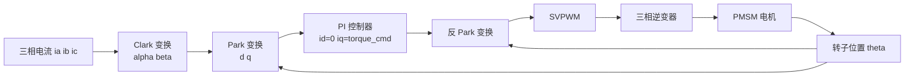

## 概述
无刷直流电机是人形机器人领域的重要零部件。以下内容整理自项目 Wiki，供深入查阅。

## 核心内容
**无刷直流电机**（BLDC）与 PMSM 结构相似，但反电动势波形不同：BLDC 设计为梯形波，配合简单的六步换相（每 60° 电角度切换一次导通相）；PMSM 反电动势为正弦波，配合 FOC 可获得更小转矩脉动、更高效率。

!!! note "术语解释：无刷直流电机、梯形反电动势、六步换相、霍尔传感器、正弦反电动势"
    - **无刷直流电机（brushless DC motor, BLDC）**：用电子换相替代机械电刷的直流电机，通常反电动势为梯形波，控制简单、成本较低。
    - **梯形反电动势 / 正弦反电动势**：分别指电机绕组中感应电压随转子位置呈梯形或正弦变化。正弦电机配合正弦电流可实现零转矩脉动。
    - **六步换相（six-step commutation）**：BLDC 每 60° 电角度切换一次导通相，任一时刻两相导通、一相悬空。
    - **霍尔传感器（Hall sensor）**：检测转子磁极位置的磁性开关，常用于 BLDC 换相。

**磁场定向控制** 的核心思想是把三相静止坐标系下的电流通过 **Clark 变换** 变到两相静止 \(\alpha\beta\) 坐标系，再通过 **Park 变换** 变到随转子旋转的 \(dq\) 坐标系，从而使交流量变成直流量，用 PI 控制器分别控制 \(i_d\) 和 \(i_q\)。最后通过 **空间矢量脉宽调制**（SVPWM）生成三相逆变器开关信号。

!!! note "术语解释：磁场定向控制、Clark 变换、Park 变换、空间矢量脉宽调制、逆变器"
    - **磁场定向控制（field-oriented control, FOC）**：把定子电流矢量分解到转子旋转坐标系进行独立控制，使交流电机像直流电机一样易于控制转矩。
    - **Clark 变换**：把三相静止坐标系 \(abc\) 转换为两相静止坐标系 \(\alpha\beta\)。
    - **Park 变换**：把两相静止坐标系 \(\alpha\beta\) 转换为随转子旋转的 \(dq\) 坐标系。
    - **空间矢量脉宽调制（SVPWM）**：一种让三相逆变器输出最接近目标电压矢量的 PWM 方法，比正弦 PWM 电压利用率高约 15%。
    - **逆变器（inverter）**：把直流电变换为交流电的功率电子电路，通常由六个开关管组成三相桥。



## 参考
- [Identification of a Physics-Based Electrical Power Consumption Model for the Unitree G1 Humanoid Arm](https://arxiv.org/abs/2606.15915)
- 项目 Wiki：chapter-04.md#4.2.4 无刷直流电机与正弦永磁同步电机的换相及 FOC

## Overview
Brushless DC motors are an important component in the field of humanoid robotics. The following content is compiled from the project Wiki for in-depth reference.

## Content
**Brushless DC motors** (BLDC) are structurally similar to PMSMs, but their back-EMF waveforms differ: BLDC motors are designed with a trapezoidal waveform, paired with simple six-step commutation (switching the conducting phase every 60° electrical angle); PMSM back-EMF is sinusoidal, and when combined with FOC, it achieves lower torque ripple and higher efficiency.

!!! note "Terminology explanation: brushless DC motor, trapezoidal back-EMF, six-step commutation, Hall sensor, sinusoidal back-EMF"
    - **Brushless DC motor (BLDC)**: A DC motor that replaces mechanical brushes with electronic commutation, typically featuring a trapezoidal back-EMF waveform, simple control, and lower cost.
    - **Trapezoidal back-EMF / Sinusoidal back-EMF**: Refers to the induced voltage in the motor windings varying with rotor position in a trapezoidal or sinusoidal manner. A sinusoidal motor paired with sinusoidal current can achieve zero torque ripple.
    - **Six-step commutation**: In BLDC motors, the conducting phase is switched every 60° electrical angle, with two phases conducting and one phase floating at any given time.
    - **Hall sensor**: A magnetic switch used to detect the rotor's magnetic pole position, commonly employed for BLDC commutation.

The core idea of **Field-Oriented Control** is to transform the currents from the three-phase stationary coordinate system to the two-phase stationary \(\alpha\beta\) coordinate system via **Clark transformation**, and then to the rotor-rotating \(dq\) coordinate system via **Park transformation**. This converts AC quantities into DC quantities, allowing PI controllers to independently control \(i_d\) and \(i_q\). Finally, **Space Vector Pulse Width Modulation** (SVPWM) generates the switching signals for the three-phase inverter.

!!! note "Terminology explanation: Field-Oriented Control, Clark transformation, Park transformation, Space Vector Pulse Width Modulation, inverter"
    - **Field-Oriented Control (FOC)**: Decomposes the stator current vector into the rotor rotating coordinate system for independent control, making AC motors as easy to control torque as DC motors.
    - **Clark transformation**: Converts the three-phase stationary coordinate system \(abc\) to the two-phase stationary coordinate system \(\alpha\beta\).
    - **Park transformation**: Converts the two-phase stationary coordinate system \(\alpha\beta\) to the rotor-rotating \(dq\) coordinate system.
    - **Space Vector Pulse Width Modulation (SVPWM)**: A PWM method that enables the three-phase inverter to output a voltage vector closest to the target, offering approximately 15% higher voltage utilization than sinusoidal PWM.
    - **Inverter**: A power electronic circuit that converts DC power to AC power, typically consisting of six switching devices forming a three-phase bridge.

```mermaid
flowchart LR
    A["Three-phase currents ia ib ic"] --> B["Clark transformation<br/>alpha beta"]
    B --> C["Park transformation<br/>d q"]
    C --> D["PI controllers<br/>id=0 iq=torque_cmd"]
    D --> E["Inverse Park transformation"]
    E --> F["SVPWM"]
    F --> G["Three-phase inverter"]
    G --> H["PMSM motor"]
    H --> I["Rotor position theta"]
    I --> C
    I --> E

## 개요
브러시리스 DC 모터는 휴머노이드 로봇 분야의 중요한 부품입니다. 아래 내용은 프로젝트 Wiki에서 정리한 것으로, 심층적인 참고를 위해 제공됩니다.

## 핵심 내용
**브러시리스 DC 모터**(BLDC)는 PMSM과 구조가 유사하지만, 역기전력 파형이 다릅니다. BLDC는 사다리꼴 파형으로 설계되어 간단한 6단계 정류(60° 전기각마다 도통 상을 전환)를 사용합니다. 반면 PMSM의 역기전력은 정현파이며, FOC와 결합하면 더 작은 토크 리플과 더 높은 효율을 얻을 수 있습니다.

!!! note "용어 설명: 브러시리스 DC 모터, 사다리꼴 역기전력, 6단계 정류, 홀 센서, 정현파 역기전력"
    - **브러시리스 DC 모터(brushless DC motor, BLDC)**: 기계적 브러시를 전자적 정류로 대체한 DC 모터로, 일반적으로 역기전력이 사다리꼴 파형이며 제어가 간단하고 비용이 낮습니다.
    - **사다리꼴 역기전력 / 정현파 역기전력**: 각각 모터 권선에서 유도되는 전압이 회전자 위치에 따라 사다리꼴 또는 정현파 형태로 변화하는 것을 의미합니다. 정현파 모터에 정현파 전류를 적용하면 토크 리플이 0에 가까워집니다.
    - **6단계 정류(six-step commutation)**: BLDC가 60° 전기각마다 도통 상을 전환하며, 임의의 순간에 두 상이 도통되고 한 상은 개방됩니다.
    - **홀 센서(Hall sensor)**: 회전자 자극 위치를 감지하는 자기 스위치로, BLDC 정류에 자주 사용됩니다.

**자계 지향 제어**의 핵심 개념은 3상 정지 좌표계의 전류를 **Clark 변환**을 통해 2상 정지 \(\alpha\beta\) 좌표계로 변환한 후, **Park 변환**을 통해 회전자와 함께 회전하는 \(dq\) 좌표계로 변환하여 교류 성분을 직류 성분으로 만드는 것입니다. 그런 다음 PI 제어기를 사용하여 \(i_d\)와 \(i_q\)를 각각 제어합니다. 마지막으로 **공간 벡터 펄스 폭 변조**(SVPWM)를 통해 3상 인버터의 스위칭 신호를 생성합니다.

!!! note "용어 설명: 자계 지향 제어, Clark 변환, Park 변환, 공간 벡터 펄스 폭 변조, 인버터"
    - **자계 지향 제어(field-oriented control, FOC)**: 고정자 전류 벡터를 회전자 회전 좌표계로 분해하여 독립적으로 제어함으로써, 교류 모터를 DC 모터처럼 토크를 쉽게 제어할 수 있게 합니다.
    - **Clark 변환**: 3상 정지 좌표계 \(abc\)를 2상 정지 좌표계 \(\alpha\beta\)로 변환합니다.
    - **Park 변환**: 2상 정지 좌표계 \(\alpha\beta\)를 회전자와 함께 회전하는 \(dq\) 좌표계로 변환합니다.
    - **공간 벡터 펄스 폭 변조(SVPWM)**: 3상 인버터가 목표 전압 벡터에 가장 가깝게 출력하도록 하는 PWM 방식으로, 정현파 PWM보다 전압 이용률이 약 15% 높습니다.
    - **인버터(inverter)**: 직류 전력을 교류 전력으로 변환하는 전력 전자 회로로, 일반적으로 6개의 스위칭 소자로 구성된 3상 브리지 형태입니다.

```mermaid
flowchart LR
    A["3상 전류 ia ib ic"] --> B["Clark 변환<br/>alpha beta"]
    B --> C["Park 변환<br/>d q"]
    C --> D["PI 제어기<br/>id=0 iq=torque_cmd"]
    D --> E["역 Park 변환"]
    E --> F["SVPWM"]
    F --> G["3상 인버터"]
    G --> H["PMSM 모터"]
    H --> I["회전자 위치 theta"]
    I --> C
    I --> E

## 개요
브러시리스 DC 모터는 휴머노이드 로봇 분야의 중요한 부품입니다. 아래 내용은 프로젝트 Wiki에서 정리한 것으로, 심층적인 참고를 위해 제공됩니다.

## 핵심 내용
**브러시리스 DC 모터**(BLDC)는 PMSM과 구조가 유사하지만, 역기전력 파형이 다릅니다. BLDC는 사다리꼴 파형으로 설계되어 간단한 6스텝 정류(60° 전기각마다 통전 상을 전환)를 사용합니다. PMSM의 역기전력은 정현파이며, FOC와 결합하면 더 작은 토크 리플과 더 높은 효율을 얻을 수 있습니다.

!!! note "용어 설명: 브러시리스 DC 모터, 사다리꼴 역기전력, 6스텝 정류, 홀 센서, 정현파 역기전력"
    - **브러시리스 DC 모터(brushless DC motor, BLDC)**: 기계적 브러시를 전자적 정류로 대체한 DC 모터로, 일반적으로 역기전력이 사다리꼴 파형이며 제어가 간단하고 비용이 낮습니다.
    - **사다리꼴 역기전력 / 정현파 역기전력**: 각각 모터 권선에서 유도되는 전압이 회전자 위치에 따라 사다리꼴 또는 정현파 형태로 변화하는 것을 의미합니다. 정현파 모터에 정현파 전류를 사용하면 토크 리플이 0에 가까워집니다.
    - **6스텝 정류(six-step commutation)**: BLDC가 60° 전기각마다 통전 상을 전환하며, 임의의 시점에 두 상이 통전되고 한 상은 개방됩니다.
    - **홀 센서(Hall sensor)**: 회전자 자극 위치를 감지하는 자기 스위치로, BLDC 정류에 자주 사용됩니다.

**자계 지향 제어**의 핵심 아이디어는 3상 정지 좌표계의 전류를 **Clark 변환**을 통해 2상 정지 \(\alpha\beta\) 좌표계로 변환한 후, **Park 변환**을 통해 회전자와 함께 회전하는 \(dq\) 좌표계로 변환하여 교류량을 직류량으로 만드는 것입니다. 그런 다음 PI 제어기로 \(i_d\)와 \(i_q\)를 각각 제어합니다. 마지막으로 **공간 벡터 펄스 폭 변조**(SVPWM)를 통해 3상 인버터의 스위칭 신호를 생성합니다.

!!! note "용어 설명: 자계 지향 제어, Clark 변환, Park 변환, 공간 벡터 펄스 폭 변조, 인버터"
    - **자계 지향 제어(field-oriented control, FOC)**: 고정자 전류 벡터를 회전자 회전 좌표계로 분해하여 독립적으로 제어함으로써, 교류 모터를 직류 모터처럼 토크를 쉽게 제어할 수 있게 합니다.
    - **Clark 변환**: 3상 정지 좌표계 \(abc\)를 2상 정지 좌표계 \(\alpha\beta\)로 변환합니다.
    - **Park 변환**: 2상 정지 좌표계 \(\alpha\beta\)를 회전자와 함께 회전하는 \(dq\) 좌표계로 변환합니다.
    - **공간 벡터 펄스 폭 변조(SVPWM)**: 3상 인버터가 목표 전압 벡터에 가장 가깝게 출력하도록 하는 PWM 방식으로, 정현파 PWM보다 전압 이용률이 약 15% 높습니다.
    - **인버터(inverter)**: 직류 전력을 교류 전력으로 변환하는 전력 전자 회로로, 일반적으로 6개의 스위칭 소자로 구성된 3상 브리지입니다.

```mermaid
flowchart LR
    A["3상 전류 ia ib ic"] --> B["Clark 변환<br/>alpha beta"]
    B --> C["Park 변환<br/>d q"]
    C --> D["PI 제어기<br/>id=0 iq=torque_cmd"]
    D --> E["역 Park 변환"]
    E --> F["SVPWM"]
    F --> G["3상 인버터"]
    G --> H["PMSM 모터"]
    H --> I["회전자 위치 theta"]
    I --> C
    I --> E
