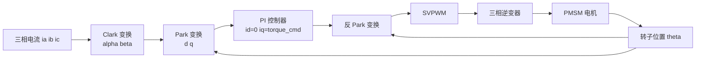

## 概述
无刷直流电机是人形机器人领域的重要零部件。以下内容整理自项目 Wiki，供深入查阅。

## 核心内容
**无刷直流电机**（BLDC）与 PMSM 结构相似，但反电动势波形不同：BLDC 设计为梯形波，配合简单的六步换相（每 60° 电角度切换一次导通相）；PMSM 反电动势为正弦波，配合 FOC 可获得更小转矩脉动、更高效率。

!!! note "术语解释：无刷直流电机、梯形反电动势、六步换相、霍尔传感器、正弦反电动势"
    - **无刷直流电机（brushless DC motor, BLDC）**：用电子换相替代机械电刷的直流电机，通常反电动势为梯形波，控制简单、成本较低。
    - **梯形反电动势 / 正弦反电动势**：分别指电机绕组中感应电压随转子位置呈梯形或正弦变化。正弦电机配合正弦电流可实现零转矩脉动。
    - **六步换相（six-step commutation）**：BLDC 每 60° 电角度切换一次导通相，任一时刻两相导通、一相悬空。
    - **霍尔传感器（Hall sensor）**：检测转子磁极位置的磁性开关，常用于 BLDC 换相。

**磁场定向控制** 的核心思想是把三相静止坐标系下的电流通过 **Clark 变换** 变到两相静止 \(\alpha\beta\) 坐标系，再通过 **Park 变换** 变到随转子旋转的 \(dq\) 坐标系，从而使交流量变成直流量，用 PI 控制器分别控制 \(i_d\) 和 \(i_q\)。最后通过 **空间矢量脉宽调制**（SVPWM）生成三相逆变器开关信号。

!!! note "术语解释：磁场定向控制、Clark 变换、Park 变换、空间矢量脉宽调制、逆变器"
    - **磁场定向控制（field-oriented control, FOC）**：把定子电流矢量分解到转子旋转坐标系进行独立控制，使交流电机像直流电机一样易于控制转矩。
    - **Clark 变换**：把三相静止坐标系 \(abc\) 转换为两相静止坐标系 \(\alpha\beta\)。
    - **Park 变换**：把两相静止坐标系 \(\alpha\beta\) 转换为随转子旋转的 \(dq\) 坐标系。
    - **空间矢量脉宽调制（SVPWM）**：一种让三相逆变器输出最接近目标电压矢量的 PWM 方法，比正弦 PWM 电压利用率高约 15%。
    - **逆变器（inverter）**：把直流电变换为交流电的功率电子电路，通常由六个开关管组成三相桥。

## 参考
- [Identification of a Physics-Based Electrical Power Consumption Model for the Unitree G1 Humanoid Arm](https://arxiv.org/abs/2606.15915)
- 项目 Wiki：chapter-04.md#4.2.4 无刷直流电机与正弦永磁同步电机的换相及 FOC

