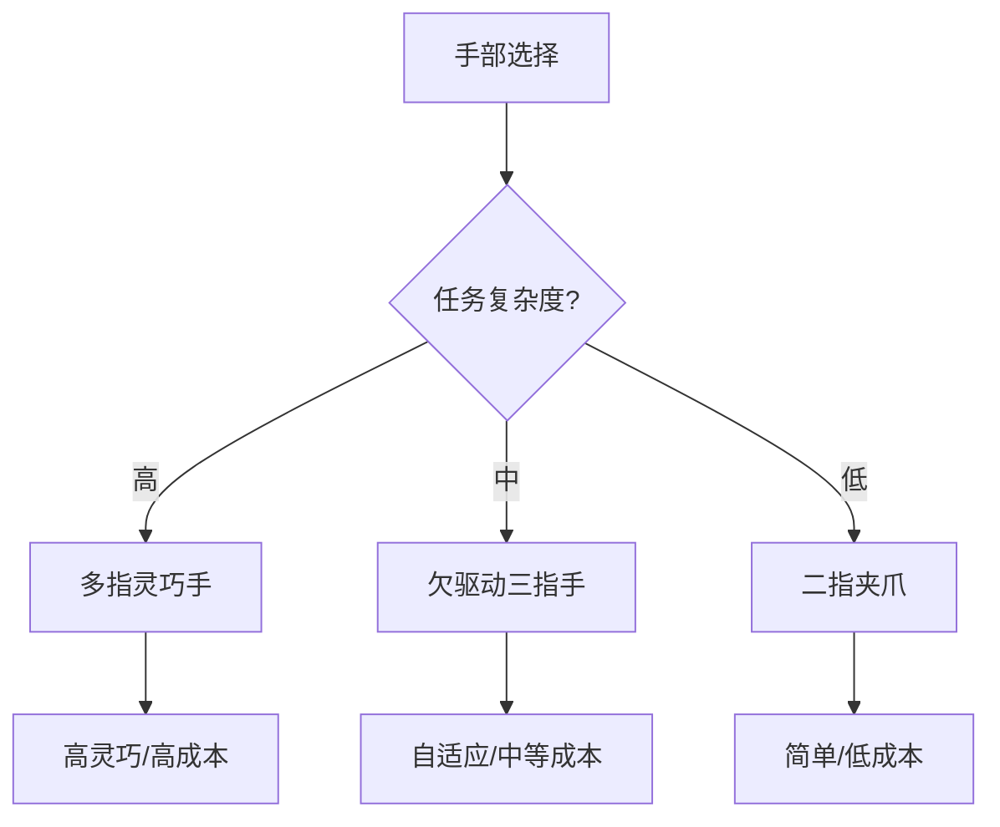

## 概述
灵巧手是人形机器人领域的重要零部件。以下内容整理自项目 Wiki，供深入查阅。

## 核心内容
机器人手部主要分为**多指灵巧手（dexterous hand）**与**二指/三指夹爪（gripper）**。灵巧手自由度高、适应性强，但控制复杂、成本高；夹爪结构简单、成本低，但只能完成有限抓取类型。

!!! note "术语解释：灵巧手、夹爪、欠驱动、全驱动、自适应抓取"
    - **灵巧手（dexterous hand）**：具有多手指、多自由度、可完成复杂操作的末端执行器。
    - **夹爪（gripper）**：通常自由度较少、结构简单的抓取装置。
    - **欠驱动（underactuated）**：执行器数量少于自由度，通过机械耦合传递运动。
    - **全驱动（fully actuated）**：每个自由度由独立执行器驱动。
    - **自适应抓取（adaptive grasp）**：手根据物体形状自动包络的抓取方式。

| 类型 | 自由度 | 驱动方式 | 优点 | 缺点 | 代表 |
|---|---|---|---|---|---|
| 全驱动灵巧手 | 16–24 | 电机/腱/直驱 | 高灵巧 | 复杂、贵 | Shadow Hand、HIT Hand |
| 欠驱动灵巧手 | 8–16 | 腱/杆/差动 | 自适应、轻 | 控制精度低 | Robotiq 3F、SVH |
| 二指夹爪 | 1–2 | 电机+丝杠 | 简单、可靠 | 类型受限 | Robotiq 2F |
| 软体手 | 多变 | 气动/线缆 | 顺应、安全 | 力控难 | RBO Hand、PneuNet |



## 参考
- [Robotic Hand](https://en.wikipedia.org/wiki/Robotic_hand)
- 项目 Wiki：chapter-09.md#9.4.2 灵巧手与夹爪：自由度、驱动与成本权衡

## Overview
The dexterous hand is an important component in the field of humanoid robots. The following content is compiled from the project Wiki for in-depth reference.

## Content
Robot hands are mainly divided into **multi-fingered dexterous hands** and **two-finger/three-finger grippers**. Dexterous hands offer high degrees of freedom and strong adaptability, but are complex to control and costly; grippers have a simple structure and low cost, but can only perform limited types of grasping.

!!! note "Terminology: Dexterous Hand, Gripper, Underactuated, Fully Actuated, Adaptive Grasp"
    - **Dexterous hand**: An end-effector with multiple fingers and multiple degrees of freedom, capable of performing complex manipulations.
    - **Gripper**: A grasping device with typically few degrees of freedom and a simple structure.
    - **Underactuated**: The number of actuators is less than the number of degrees of freedom, with motion transmitted through mechanical coupling.
    - **Fully actuated**: Each degree of freedom is driven by an independent actuator.
    - **Adaptive grasp**: A grasping method where the hand automatically envelops the object's shape.

| Type | Degrees of Freedom | Drive Method | Advantages | Disadvantages | Representative |
|---|---|---|---|---|---|
| Fully actuated dexterous hand | 16–24 | Motor/tendon/direct drive | High dexterity | Complex, expensive | Shadow Hand, HIT Hand |
| Underactuated dexterous hand | 8–16 | Tendon/rod/differential | Adaptive, lightweight | Low control precision | Robotiq 3F, SVH |
| Two-finger gripper | 1–2 | Motor+leadscrew | Simple, reliable | Limited types | Robotiq 2F |
| Soft hand | Variable | Pneumatic/cable | Compliant, safe | Difficult force control | RBO Hand, PneuNet |

```mermaid
flowchart TD
    A["Hand Selection"] --> B{"Task Complexity?"}
    B -->|"High"| C["Multi-fingered Dexterous Hand"]
    B -->|"Medium"| D["Underactuated Three-finger Hand"]
    B -->|"Low"| E["Two-finger Gripper"]
    C --> F["High Dexterity/High Cost"]
    D --> G["Adaptive/Medium Cost"]
    E --> H["Simple/Low Cost"]

## 개요
인간형 로봇 분야에서 중요한 부품인 **다기능 손(Dexterous Hand)**에 관한 내용입니다. 아래 내용은 프로젝트 Wiki에서 정리한 것으로, 심층적인 참고 자료로 활용하시기 바랍니다.

## 핵심 내용
로봇 손은 크게 **다지 다기능 손(Dexterous Hand)**과 **2지/3지 그리퍼(Gripper)**로 구분됩니다. 다기능 손은 자유도가 높고 적응성이 뛰어나지만 제어가 복잡하고 비용이 높은 반면, 그리퍼는 구조가 간단하고 비용이 낮지만 제한된 파지 유형만 수행할 수 있습니다.

!!! note "용어 설명: 다기능 손, 그리퍼, 언더액추에이티드, 풀액추에이티드, 적응형 파지"
    - **다기능 손(Dexterous Hand)**: 여러 손가락과 높은 자유도를 가지며 복잡한 조작이 가능한 엔드 이펙터.
    - **그리퍼(Gripper)**: 일반적으로 자유도가 적고 구조가 단순한 파지 장치.
    - **언더액추에이티드(Underactuated)**: 액추에이터 수가 자유도보다 적으며, 기계적 결합을 통해 운동을 전달.
    - **풀액추에이티드(Fully Actuated)**: 각 자유도가 독립적인 액추에이터로 구동.
    - **적응형 파지(Adaptive Grasp)**: 손이 물체의 형상에 따라 자동으로 감싸는 파지 방식.

| 유형 | 자유도 | 구동 방식 | 장점 | 단점 | 대표 사례 |
|---|---|---|---|---|---|
| 풀액추에이티드 다기능 손 | 16–24 | 모터/텐던/직접 구동 | 높은 기민성 | 복잡, 고가 | Shadow Hand, HIT Hand |
| 언더액추에이티드 다기능 손 | 8–16 | 텐던/링크/차동 기어 | 적응성, 경량 | 제어 정밀도 낮음 | Robotiq 3F, SVH |
| 2지 그리퍼 | 1–2 | 모터+볼스크류 | 단순, 신뢰성 | 유형 제한 | Robotiq 2F |
| 소프트 핸드 | 다양 | 공압/케이블 | 순응성, 안전 | 힘 제어 어려움 | RBO Hand, PneuNet |

```mermaid
flowchart TD
    A["손 선택"] --> B{"작업 복잡도?"}
    B -->|"높음"| C["다지 다기능 손"]
    B -->|"중간"| D["언더액추에이티드 3지 손"]
    B -->|"낮음"| E["2지 그리퍼"]
    C --> F["높은 기민성/고비용"]
    D --> G["적응성/중간 비용"]
    E --> H["단순/저비용"]

## 개요
로봇 핸드는 인간형 로봇 분야의 중요한 부품입니다. 아래 내용은 프로젝트 Wiki에서 정리한 것으로, 심층적인 참고를 위해 제공됩니다.

## 핵심 내용
로봇 핸드는 크게 **다지 손가락 로봇 핸드(다지 손가락 로봇 핸드)**와 **두 손가락/세 손가락 그리퍼(그리퍼)**로 나뉩니다. 다지 손가락 로봇 핸드는 자유도가 높고 적응성이 뛰어나지만 제어가 복잡하고 비용이 높습니다. 그리퍼는 구조가 간단하고 비용이 낮지만 제한된 유형의 파지 작업만 수행할 수 있습니다.

!!! note "용어 설명: 다지 손가락 로봇 핸드, 그리퍼, 언더액추에이티드, 풀액추에이티드, 적응형 파지"
    - **다지 손가락 로봇 핸드(다지 손가락 로봇 핸드)**: 여러 손가락과 높은 자유도를 가지며 복잡한 조작이 가능한 엔드 이펙터입니다.
    - **그리퍼(그리퍼)**: 일반적으로 자유도가 적고 구조가 간단한 파지 장치입니다.
    - **언더액추에이티드(언더액추에이티드)**: 액추에이터 수가 자유도보다 적으며, 기계적 결합을 통해 운동을 전달합니다.
    - **풀액추에이티드(풀액추에이티드)**: 각 자유도가 독립적인 액추에이터에 의해 구동됩니다.
    - **적응형 파지(적응형 파지)**: 로봇 핸드가 물체의 형상에 따라 자동으로 감싸 쥐는 파지 방식입니다.

| 유형 | 자유도 | 구동 방식 | 장점 | 단점 | 대표 사례 |
|---|---|---|---|---|---|
| 풀액추에이티드 다지 손가락 로봇 핸드 | 16–24 | 모터/텐던/직접 구동 | 높은 기민함 | 복잡하고 비쌈 | Shadow Hand, HIT Hand |
| 언더액추에이티드 다지 손가락 로봇 핸드 | 8–16 | 텐던/링크/차동 기어 | 적응성, 가벼움 | 제어 정밀도 낮음 | Robotiq 3F, SVH |
| 두 손가락 그리퍼 | 1–2 | 모터+볼 스크류 | 간단하고 신뢰성 높음 | 유형 제한적 | Robotiq 2F |
| 소프트 로봇 핸드 | 다양함 | 공압/케이블 | 순응성, 안전성 | 힘 제어 어려움 | RBO Hand, PneuNet |

```mermaid
flowchart TD
    A["로봇 핸드 선택"] --> B{"작업 복잡도?"}
    B -->|"높음"| C["다지 손가락 로봇 핸드"]
    B -->|"중간"| D["언더액추에이티드 세 손가락 로봇 핸드"]
    B -->|"낮음"| E["두 손가락 그리퍼"]
    C --> F["높은 기민함/높은 비용"]
    D --> G["적응성/중간 비용"]
    E --> H["간단함/낮은 비용"]
