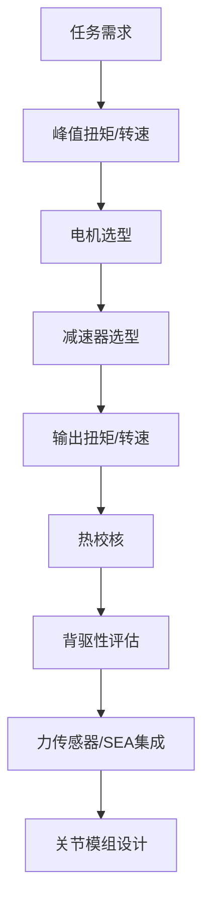
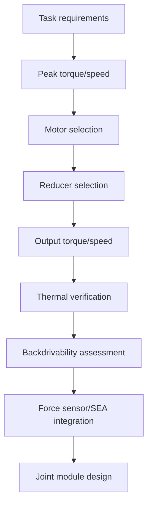
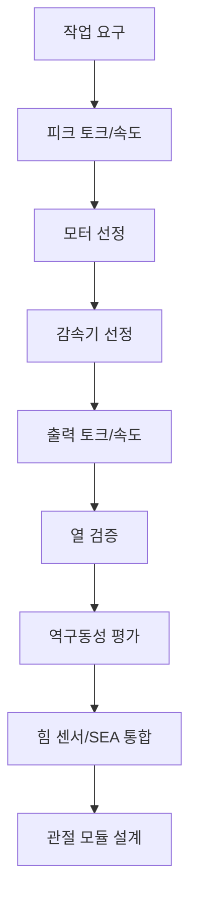

## 概述

无框力矩电机（Frameless Torque Motor）是一种取消外壳、端盖和轴承，将定子与转子直接嵌入关节机械结构的电机形态，以最大化扭矩密度和集成度。它真正改变的不是电机的电磁原理，而是电机与机械结构的边界——让电机本体成为结构件，从而在人形机器人髋、肩等大扭矩关节中实现高透明度与高带宽的直接驱动或低减速比驱动。

## 核心内容

### 是什么：准确定义

无框力矩电机（frameless torque motor）本质上仍是一台永磁同步电机（PMSM），其电磁转矩产生机理与普通伺服电机完全一致。区别在于**机械形态**：它没有机壳（housing）、没有端盖（end cover）、没有自身的输出轴和轴承，交付给用户的只是定子组件（含绕组）和转子组件（含永磁体）。用户需要自行设计壳体、轴承支撑和轴系，把定子压装或胶接到关节壳体上，把转子套装到关节轴上。

这种"半成品"交付方式看似增加了集成难度，却换来了两个关键收益：一是**轴向长度大幅缩短**——省去了两端端盖和轴承座，电机可以做得更薄；二是**直径可以做得更大**——因为没有外壳限制，定子外径可以扩展到与关节壳体同尺寸，而扭矩与直径的平方成正比（见原理拆解），大直径直接转化为高扭矩密度。

在人形机器人领域，无框力矩电机通常与谐波减速器、编码器、力矩传感器共同组成**旋转执行器（rotary actuator）**，作为髋关节、肩关节等大扭矩关节的核心动力源。

### 为什么存在：痛点与历史定位

人形机器人髋关节、肩关节往往需要几十到上百 N·m 的输出扭矩。若采用普通伺服电机加高减速比，虽可放大扭矩，但会牺牲透明度和带宽——减速器的齿轮间隙（背隙）带来非线性，反射惯量按减速比的平方放大，导致力控时"手感"发涩、带宽受限。

历史上，工业机器人普遍采用"高减速比 + 高刚度"路线，因为工业场景不要求与人安全交互。但人形机器人需要在未知环境中与人对物共处，必须具有**背驱性（backdrivability）**——即外力能反向推动关节，让电机"透明"地呈现环境力。这要求减速比尽可能低，而低减速比又要求电机本身输出足够大的扭矩。

无框力矩电机的出现正是为了打破这一矛盾：通过增大直径、增加极数，在低转速下直接输出大扭矩，从而允许使用低减速比（甚至直驱）。它真正改变的不是电机技术本身，而是**机器人关节的设计哲学**——从"电机小、减速器大"转向"电机大、减速器小"，把扭矩密度和透明度同时推到新高度。

### 原理拆解

**① 扭矩密度的几何根源：为什么大直径如此重要**

无框力矩电机的扭矩输出可表示为：

$$
\tau = 2 \pi r^2 l B_{\text{gap}} J_s
$$

其中 \(r\) 为气隙半径，\(l\) 为轴向长度，\(B_{\text{gap}}\) 为气隙磁密，\(J_s\) 为电负荷（绕组总电流 per 周长）。这个公式揭示了无框力矩电机的核心设计逻辑：**扭矩与气隙半径的平方成正比**。增大 \(r\) 对扭矩的提升是二次方关系，因此大直径无框电机在相同质量下可获得更高扭矩。这就是为什么无框力矩电机普遍做成"薄饼"形状——直径大、轴向短，在有限空间内最大化扭矩。

**② 极对数与低速大扭矩**

无框力矩电机通常设计为多极（高极对数 \(p\)）。在磁场定向控制（FOC）下，电磁转矩为：

$$
\tau = \frac{3}{2} p \, \lambda_f \, i_q
$$

其中 \(p\) 为极对数，\(\lambda_f\) 为永磁体磁链，\(i_q\) 为交轴电流。高极对数意味着在相同电流下产生更大转矩，同时电机的同步转速 \(n = 60f/p\) 降低——这正是"低转速下直接输出大扭矩"的电磁学基础。

**③ 与减速器的配合：透明度与带宽的权衡**

无框力矩电机并非必须直驱。工程实践中，它常与谐波减速器（减速比 50–160）配合使用。此时减速比的选择需要综合优化：减速比越大，输出扭矩越大，但反射惯量按减速比平方放大、背驱性变差。人形机器人踝关节、髋关节因力矩需求高，通常选用高减速比、高扭矩密度方案；腕关节、颈部更注重速度与背驱性，减速比相对较低。

### 关键参数与规格

无框力矩电机的选型核心参数包括：

| 参数 | 典型含义 | 选型要点 |
|---|---|---|
| 峰值扭矩 \( \tau_{\text{peak}} \) | 短时最大输出扭矩 | 由峰值电流决定，需覆盖关节峰值力矩需求 |
| 连续扭矩 \( \tau_{\text{cont}} \) | 热约束下的持续输出扭矩 | 由绕组温升决定，需校核最坏工况 |
| 扭矩常数 \( K_t \) | 单位电流产生的扭矩（N·m/A） | 与极对数、磁链相关，决定电流环增益 |
| 额定转速 | 连续运行的最高转速 | 需匹配关节峰值角速度需求 |
| 外径/内径/轴向长度 | 机械安装尺寸 | 决定关节壳体设计与集成方式 |
| 总线电压 \( V_{\text{bus}} \) | 驱动器直流母线电压 | 决定最高转速（空载转速 ≈ \( V_{\text{bus}} / K_t \)） |
| 极对数 \( p \) | 转子磁极对数 | 影响扭矩密度与转速范围 |

以语料中的电机参数示例：\( K_t = 0.35 \) N·m/A，\( R = 0.15 \) Ohm，\( V_{\text{bus}} = 48.0 \) V，\( I_{\text{peak}} = 60.0 \) A，\( I_{\text{cont}} = 20.0 \) A。由此可计算：峰值扭矩 \( \tau_{\text{m,peak}} = K_t \times I_{\text{peak}} = 21.0 \) N·m（按语料数据推算），连续扭矩 \( \tau_{\text{m,cont}} = K_t \times I_{\text{cont}} = 7.0 \) N·m（按语料数据推算）。若关节峰值扭矩需求为 \( \tau_{\text{peak}} \)，所需最小减速比 \( N_{\text{min}} = \tau_{\text{peak}} / (\eta \cdot \tau_{\text{m,peak}}) \)，其中 \( \eta = 0.8 \) 为减速器效率。

### 横向对比

| 维度 | 无框力矩电机 + 低减速比 | 普通伺服电机 + 高减速比 | 直驱电机（无减速器） |
|---|---|---|---|
| 扭矩密度 | 高（大直径 + 中等减速比） | 高（小电机 + 大减速比） | 中（需极大直径） |
| 透明度/背驱性 | 较好 | 差（反射惯量大、背隙） | 最好（无背隙） |
| 带宽 | 较高 | 低（惯量匹配差） | 最高 |
| 集成复杂度 | 高（需自行设计壳体轴承） | 低（一体式交付） | 中 |
| 轴向长度 | 短（无端盖） | 长（含减速器） | 短 |
| 典型应用 | 人形机器人髋/肩关节 | 工业机械臂 | 高精度力控关节 |

无框力矩电机的核心优势在于**在扭矩密度与透明度之间取得平衡**——它比直驱电机扭矩密度高，比高减速比方案透明度好。代价是集成难度：用户必须自行解决轴承支撑、散热、磁吸力管理等工程问题。

### 谁在用·应用案例

**Tesla Optimus** 的旋转关节 reportedly 采用无框力矩电机加谐波减速器的一体化方案。Optimus Gen 3 在 Gen 2 的 173 cm 躯干基础上，将单手自由度从 11 DOF 提升至 22 DOF，单只手搭载 25 个执行器，双手共 50 个执行器——这些执行器中的旋转关节大量采用无框力矩电机方案。

在人形机器人关节设计中，选型流程通常遵循以下链路：

设计要点包括：先确定关节峰值扭矩与峰值转速，再反推电机与减速器；连续扭矩由热约束决定，必须校核最坏工况下的绕组温升；减速比影响反射惯量、背驱性与输出转速，需综合优化；人形机器人常采用力矩/力传感器或 SEA 实现柔顺交互。

### 局限与边界

1. **集成门槛高**：无框力矩电机不是即插即用部件。用户需自行设计壳体、轴承、轴系和散热结构，对机械设计能力要求高。磁吸力在装配过程中可能造成转子与定子吸合，需要专用工装。

2. **热管理挑战**：大直径、多极设计使热量集中在定子绕组，而取消外壳后散热路径减少。连续扭矩受温升限制，必须设计有效的散热通道（如壳体水冷或风冷）。

3. **成本与供应链**：无框力矩电机属于定制化程度较高的部件，批量生产规模不如标准伺服电机，单价较高。供应链成熟度直接影响项目进度。

4. **并非万能**：对于腕关节、颈部等对速度要求高、扭矩需求低的关节，无框力矩电机的大直径反而成为劣势——此时普通小型伺服电机或空心杯电机更合适。它真正改变的不是所有关节，而是**大扭矩、低转速、高透明度需求集中的关节**。

### 常见误区

1. **"无框力矩电机就是直驱电机"**——错。无框力矩电机可以直驱，也可以配减速器。Tesla Optimus 的旋转关节就是"无框力矩电机 + 谐波减速器"方案。直驱只是无框力矩电机的可能用法之一。

2. **"扭矩越大越好"**——错。扭矩密度与热管理、重量、成本相互制约。过大的电机增加关节惯量和整机重量，反而降低动态性能。正确做法是按峰值扭矩和连续扭矩需求分别选型，并校核最坏工况。

3. **"无框力矩电机不需要减速器"**——错。对于髋关节、踝关节等需要上百 N·m 扭矩的关节，即使是大直径无框电机也往往需要中等减速比（如 50–100）才能满足峰值扭矩需求。直驱只适用于扭矩需求相对较低的关节。

4. **"取消外壳就一定能提升扭矩密度"**——不完全是。取消外壳的主要收益是缩短轴向长度和允许更大直径，但扭矩密度还取决于磁路设计、绕组填充率和散热能力。设计不当的无框电机可能比同体积带壳电机性能更差。

5. **"无框力矩电机是新技术"**——不准确。力矩电机（torque motor）的概念由来已久，无框形态在机床直驱转台、雷达天线驱动等工业领域早有应用。人形机器人只是把这一成熟技术推向了新的应用场景。

### 相关知识

- `ent_component_rotary_actuator_2024` — 无框力矩电机是旋转执行器的核心动力部件，与谐波减速器、编码器、力矩传感器共同组成关节模组。
- `ent_robot_system_tesla_optimus` — Tesla Optimus 的旋转关节采用无框力矩电机加谐波减速器的一体化方案，是这一技术路线的代表性应用。
- `ent_method_field_oriented_control` — 无框力矩电机的转矩控制依赖 FOC 实现 \(i_d\) 与 \(i_q\) 解耦，是高性能电流环控制的基础。
- `ent_component_bldc_motor` — 无框力矩电机在电磁结构上属于永磁同步电机（PMSM）家族，与 BLDC 电机共享基本工作原理。
- `ent_foundation_classical_mechanics` — 关节力矩需求分析（\(\tau = I \alpha\)）和功率计算（\(P = \tau \omega\)）是选择无框力矩电机规格的力学基础。
- `ent_company_kollmorgen_corporation_2024` — Kollmorgen 是力矩电机领域的传统供应商，其产品线覆盖无框力矩电机形态。

## 参考

- [Frameless Torque Motor - Wikipedia](https://en.wikipedia.org/wiki/Torque_motor)
- [Awesome Humanoid Robot - Chapter 08](https://github.com/YansongW/awesome-humanoid-robot/tree/main/wiki/docs/chapters/chapter-08.md)
- [Awesome Humanoid Robot - Chapter 04](https://github.com/YansongW/awesome-humanoid-robot/tree/main/wiki/docs/chapters/chapter-04.md)
- [Awesome Humanoid Robot - Full Development Workflow](https://github.com/YansongW/awesome-humanoid-robot/tree/main/docs/humanoid_full_development_workflow_v3.md)

## Overview

Frameless torque motors are a motor form factor that eliminates the housing, end caps, and bearings, embedding the stator and rotor directly into the joint's mechanical structure to maximize torque density and integration. What they truly change is not the electromagnetic principles of the motor, but the boundary between the motor and the mechanical structure—making the motor itself a structural component, thereby enabling high transparency and high bandwidth direct drive or low-ratio drive in high-torque joints such as the hip and shoulder of humanoid robots.

## Content

### What It Is: A Precise Definition

A frameless torque motor is essentially still a permanent magnet synchronous motor (PMSM), and its electromagnetic torque generation mechanism is completely identical to that of a standard servo motor. The difference lies in the **mechanical form factor**: it has no housing, no end covers, no output shaft, and no bearings of its own. What is delivered to the user is only the stator assembly (including windings) and the rotor assembly (including permanent magnets). The user must design the housing, bearing supports, and shaft system themselves, pressing or bonding the stator into the joint housing and mounting the rotor onto the joint shaft.

This "semi-finished" delivery method may seem to increase integration difficulty, but it yields two key benefits: first, **axial length is significantly reduced**—eliminating the end caps and bearing housings allows the motor to be made thinner; second, **diameter can be made larger**—without housing constraints, the stator outer diameter can be expanded to match the joint housing size, and since torque is proportional to the square of the diameter (see principle breakdown), a larger diameter directly translates into higher torque density.

In the humanoid robotics field, frameless torque motors are typically combined with harmonic reducers, encoders, and torque sensors to form a **rotary actuator**, serving as the core power source for high-torque joints such as the hip and shoulder.

### Why It Exists: Pain Points and Historical Positioning

Humanoid robot hip and shoulder joints often require output torques ranging from tens to hundreds of N·m. While a standard servo motor with a high reduction ratio can amplify torque, it sacrifices transparency and bandwidth—the gear backlash of the reducer introduces nonlinearity, and reflected inertia scales with the square of the reduction ratio, resulting in a "stiff" feel during force control and limited bandwidth.

Historically, industrial robots have adopted the "high reduction ratio + high stiffness" approach because industrial scenarios do not require safe human interaction. However, humanoid robots must coexist with humans and objects in unknown environments, requiring **backdrivability**—the ability for external forces to push the joint in reverse, allowing the motor to "transparently" present environmental forces. This demands the lowest possible reduction ratio, while a low reduction ratio in turn requires the motor itself to output sufficiently large torque.

The emergence of frameless torque motors is precisely to break this contradiction: by increasing diameter and pole count, they directly output high torque at low speeds, thereby permitting low reduction ratios (or even direct drive). What they truly change is not the motor technology itself, but the **design philosophy of robot joints**—shifting from "small motor, large reducer" to "large motor, small reducer," pushing both torque density and transparency to new heights simultaneously.

### Principle Breakdown

**① The Geometric Root of Torque Density: Why Large Diameter Matters**

The torque output of a frameless torque motor can be expressed as:

$$
\tau = 2 \pi r^2 l B_{\text{gap}} J_s
$$

where \(r\) is the airgap radius, \(l\) is the axial length, \(B_{\text{gap}}\) is the airgap flux density, and \(J_s\) is the electric loading (total winding current per circumference). This formula reveals the core design logic of frameless torque motors: **torque is proportional to the square of the airgap radius**. Increasing \(r\) improves torque quadratically, which is why large-diameter frameless motors can achieve higher torque at the same mass. This is why frameless torque motors are commonly made in a "pancake" shape—large diameter, short axial length, maximizing torque within limited space.

**② Pole Pairs and Low-Speed High Torque**

Frameless torque motors are typically designed with multiple poles (high pole pair count \(p\)). Under field-oriented control (FOC), the electromagnetic torque is:

$$
\tau = \frac{3}{2} p \, \lambda_f \, i_q
$$

where \(p\) is the number of pole pairs, \(\lambda_f\) is the permanent magnet flux linkage, and \(i_q\) is the quadrature-axis current. A high pole pair count means greater torque for the same current, while the motor's synchronous speed \(n = 60f/p\) decreases—this is the electromagnetic basis for "directly outputting high torque at low speeds."

**③ Coordination with Reducers: The Trade-off Between Transparency and Bandwidth**

Frameless torque motors are not necessarily direct-drive. In engineering practice, they are often paired with harmonic reducers (reduction ratios of 50–160). The choice of reduction ratio requires comprehensive optimization: a higher reduction ratio increases output torque, but reflected inertia scales with the square of the ratio and backdrivability deteriorates. For humanoid robot ankle and hip joints with high torque requirements, high reduction ratios and high torque density solutions are typically selected; wrist and neck joints prioritize speed and backdrivability, so reduction ratios are relatively lower.

### Key Parameters and Specifications

The core parameters for selecting a frameless torque motor include:

| Parameter | Typical Meaning | Selection Considerations |
|---|---|---|
| Peak torque \( \tau_{\text{peak}} \) | Short-term maximum output torque | Determined by peak current; must cover joint peak torque requirements |
| Continuous torque \( \tau_{\text{cont}} \) | Sustained output torque under thermal constraints | Determined by winding temperature rise; must verify worst-case conditions |
| Torque constant \( K_t \) | Torque produced per unit current (N·m/A) | Related to pole pairs and flux linkage; determines current loop gain |
| Rated speed | Maximum continuous operating speed | Must match joint peak angular velocity requirements |
| Outer diameter/inner diameter/axial length | Mechanical mounting dimensions | Determine joint housing design and integration method |
| Bus voltage \( V_{\text{bus}} \) | Driver DC bus voltage | Determines maximum speed (no-load speed ≈ \( V_{\text{bus}} / K_t \)) |
| Pole pairs \( p \) | Number of rotor magnetic pole pairs | Affects torque density and speed range |

Using the motor parameters from the source material as an example: \( K_t = 0.35 \) N·m/A, \( R = 0.15 \) Ohm, \( V_{\text{bus}} = 48.0 \) V, \( I_{\text{peak}} = 60.0 \) A, \( I_{\text{cont}} = 20.0 \) A. From this, we can calculate: peak torque \( \tau_{\text{m,peak}} = K_t \times I_{\text{peak}} = 21.0 \) N·m (derived from the source data), continuous torque \( \tau_{\text{m,cont}} = K_t \times I_{\text{cont}} = 7.0 \) N·m (derived from the source data). If the joint peak torque requirement is \( \tau_{\text{peak}} \), the minimum required reduction ratio is \( N_{\text{min}} = \tau_{\text{peak}} / (\eta \cdot \tau_{\text{m,peak}}) \), where \( \eta = 0.8 \) is the reducer efficiency.

### Horizontal Comparison

| Dimension | Frameless torque motor + low reduction ratio | Standard servo motor + high reduction ratio | Direct-drive motor (no reducer) |
|---|---|---|---|
| Torque density | High (large diameter + moderate reduction ratio) | High (small motor + large reduction ratio) | Medium (requires extremely large diameter) |
| Transparency/backdrivability | Good | Poor (large reflected inertia, backlash) | Best (no backlash) |
| Bandwidth | Relatively high | Low (poor inertia matching) | Highest |
| Integration complexity | High (requires self-designed housing and bearings) | Low (integrated delivery) | Medium |
| Axial length | Short (no end caps) | Long (includes reducer) | Short |
| Typical applications | Humanoid robot hip/shoulder joints | Industrial robotic arms | High-precision force-controlled joints |

The core advantage of frameless torque motors lies in **balancing torque density and transparency**—they offer higher torque density than direct-drive motors and better transparency than high-reduction-ratio solutions. The cost is integration difficulty: users must solve engineering challenges such as bearing support, heat dissipation, and magnetic attraction force management themselves.

### Who Uses It: Application Cases

**Tesla Optimus**'s rotary joints reportedly adopt an integrated solution of frameless torque motors with harmonic reducers. Building on the 173 cm torso of Gen 2, Optimus Gen 3 increases single-hand degrees of freedom from 11 DOF to 22 DOF, with 25 actuators per hand and 50 actuators across both hands—the rotary joints among these actuators extensively employ frameless torque motor solutions.

In humanoid robot joint design, the selection process typically follows this chain:

Design considerations include: first determining the joint peak torque and peak speed, then working backward to select the motor and reducer; continuous torque is determined by thermal constraints, and winding temperature rise under worst-case conditions must be verified; the reduction ratio affects reflected inertia, backdrivability, and output speed, requiring comprehensive optimization; humanoid robots often employ torque/force sensors or SEA for compliant interaction.

### Limitations and Boundaries

1. **High integration barrier**: Frameless torque motors are not plug-and-play components. Users must design the housing, bearings, shaft system, and heat dissipation structures themselves, requiring strong mechanical design capabilities. Magnetic attraction forces during assembly may cause the rotor and stator to snap together, requiring specialized tooling.

2. **Thermal management challenges**: Large-diameter, multi-pole designs concentrate heat in the stator windings, while eliminating the housing reduces heat dissipation paths. Continuous torque is limited by temperature rise, and effective cooling channels (such as liquid cooling or forced air cooling in the housing) must be designed.

3. **Cost and supply chain**: Frameless torque motors are highly customized components with smaller production scales than standard servo motors, resulting in higher unit costs. Supply chain maturity directly affects project timelines.

4. **Not a universal solution**: For joints such as the wrist or neck that prioritize speed and have low torque requirements, the large diameter of frameless torque motors becomes a disadvantage—standard small servo motors or coreless motors are more suitable in these cases. What they truly change is not all joints, but **joints with concentrated high-torque, low-speed, and high-transparency requirements**.

### Common Misconceptions

1. **"Frameless torque motors are direct-drive motors"**—Incorrect. Frameless torque motors can be direct-drive or paired with reducers. Tesla Optimus's rotary joints use a "frameless torque motor + harmonic reducer" solution. Direct drive is just one possible application of frameless torque motors.

2. **"Higher torque is always better"**—Incorrect. Torque density, thermal management, weight, and cost are mutually constraining. An oversized motor increases joint inertia and overall robot weight, actually degrading dynamic performance. The correct approach is to select based on peak torque and continuous torque requirements separately, and verify worst-case conditions.

3. **"Frameless torque motors do not need reducers"**—Incorrect. For joints requiring hundreds of N·m of torque, such as the hip or ankle, even large-diameter frameless motors often need moderate reduction ratios (e.g., 50–100) to meet peak torque requirements. Direct drive is only suitable for joints with relatively low torque requirements.

4. **"Eliminating the housing necessarily improves torque density"**—Not entirely. The main benefits of eliminating the housing are reduced axial length and allowing larger diameters, but torque density also depends on magnetic circuit design, winding fill factor, and heat dissipation capability. A poorly designed frameless motor may perform worse than a housed motor of the same volume.

5. **"Frameless torque motors are new technology"**—Inaccurate. The concept of torque motors has a long history, and the frameless form factor has long been used in industrial applications such as direct-drive rotary tables for machine tools and radar antenna drives. Humanoid robots are simply pushing this mature technology into new application scenarios.

### Related Knowledge

- `ent_component_rotary_actuator_2024` — Frameless torque motors are the core power component of rotary actuators, forming joint modules together with harmonic reducers, encoders, and torque sensors.
- `ent_robot_system_tesla_optimus` — Tesla Optimus's rotary joints use an integrated solution of frameless torque motors with harmonic reducers, representing a representative application of this technical approach.
- `ent_method_field_oriented_control` — Torque control of frameless torque motors relies on FOC to decouple \(i_d\) and \(i_q\), forming the basis for high-performance current loop control.
- `ent_component_bldc_motor` — Frameless torque motors belong to the permanent magnet synchronous motor (PMSM) family in electromagnetic structure, sharing fundamental operating principles with BLDC motors.
- `ent_foundation_classical_mechanics` — Joint torque requirement analysis (\(\tau = I \alpha\)) and power calculation (\(P = \tau \omega\)) are the mechanical foundations for selecting frameless torque motor specifications.
- `ent_company_kollmorgen_corporation_2024` — Kollmorgen is a traditional supplier in the torque motor field, with its product line covering the frameless torque motor form factor.

## 개요

프레임리스 토크 모터(Frameless Torque Motor)는 하우징, 엔드 커버 및 베어링을 제거하고 고정자와 회전자를 관절 기계 구조에 직접 통합하여 토크 밀도와 통합도를 극대화한 모터 형태입니다. 이것이 진정으로 바꾸는 것은 모터의 전자기 원리가 아니라 모터와 기계 구조 사이의 경계입니다. 즉, 모터 본체 자체를 구조 부품으로 만들어 휴머노이드 로봇의 엉덩이, 어깨 등 대토크 관절에서 높은 투명성과 높은 대역폭의 직접 구동 또는 저감속비 구동을 실현합니다.

## 핵심 내용

### 정의: 정확한 정의

프레임리스 토크 모터(frameless torque motor)는 본질적으로 여전히 영구자석 동기 모터(PMSM)이며, 전자기 토크 발생 메커니즘은 일반 서보 모터와 완전히 동일합니다. 차이점은 **기계적 형태**에 있습니다. 하우징, 엔드 커버, 자체 출력축 및 베어링이 없으며, 고객에게 제공되는 것은 고정자 어셈블리(권선 포함)와 회전자 어셈블리(영구자석 포함)뿐입니다. 사용자는 하우징, 베어링 지지 및 축계를 직접 설계하여 고정자를 관절 하우징에 압입 또는 접착하고 회전자를 관절 축에 장착해야 합니다.

이러한 "반제품" 납품 방식은 통합 난이도를 높이는 것처럼 보이지만 두 가지 핵심 이점을 제공합니다. 첫째, **축방향 길이가 크게 단축**됩니다. 양쪽 엔드 커버와 베어링 시트가 생략되어 모터를 더 얇게 만들 수 있습니다. 둘째, **직경을 더 크게 만들 수 있습니다.** 하우징 제약이 없기 때문에 고정자 외경을 관절 하우징과 동일한 크기로 확장할 수 있으며, 토크는 직경의 제곱에 비례하므로(원리 분석 참조) 큰 직경이 직접적으로 높은 토크 밀도로 이어집니다.

휴머노이드 로봇 분야에서 프레임리스 토크 모터는 일반적으로 하모닉 감속기, 엔코더, 토크 센서와 함께 **회전 액추에이터(rotary actuator)** 를 구성하여 엉덩이 관절, 어깨 관절 등 대토크 관절의 핵심 동력원 역할을 합니다.

### 존재 이유:痛点 및 역사적 위치

휴머노이드 로봇의 엉덩이 관절과 어깨 관절은 종종 수십에서 수백 N·m의 출력 토크가 필요합니다. 일반 서보 모터에 높은 감속비를 사용하면 토크를 증폭할 수 있지만 투명성과 대역폭을 희생합니다. 감속기의 기어 백래시(backlash)는 비선형성을 유발하고, 반사 관성은 감속비의 제곱으로 증폭되어 힘 제어 시 "감촉"이 뻑뻑해지고 대역폭이 제한됩니다.

역사적으로 산업용 로봇은 "고감속비 + 고강성" 방식을 일반적으로 채택했습니다. 산업 현장에서는 사람과의 안전한 상호작용이 요구되지 않기 때문입니다. 그러나 휴머노이드 로봇은 알 수 없는 환경에서 사람과 물건을 함께 공존해야 하므로 **역구동성(backdrivability)** 이 필수적입니다. 즉, 외력이 관절을 역방향으로 밀 수 있어 모터가 환경 힘을 "투명하게" 나타낼 수 있어야 합니다. 이를 위해서는 감속비를 가능한 한 낮춰야 하며, 낮은 감속비는 모터 자체가 충분히 큰 토크를 출력해야 합니다.

프레임리스 토크 모터의 등장은 바로 이러한 모순을 해결하기 위한 것입니다. 직경을 늘리고 극수를 증가시켜 저속에서 직접 큰 토크를 출력함으로써 낮은 감속비(또는 직접 구동)를 가능하게 합니다. 이것이 진정으로 바꾸는 것은 모터 기술 자체가 아니라 **로봇 관절의 설계 철학**입니다. "작은 모터, 큰 감속기"에서 "큰 모터, 작은 감속기"로 전환하여 토크 밀도와 투명성을 동시에 새로운 수준으로 끌어올립니다.

### 원리 분석

**① 토크 밀도의 기하학적 근원: 큰 직경이 왜 중요한가**

프레임리스 토크 모터의 토크 출력은 다음과 같이 표현됩니다.

$$
\tau = 2 \pi r^2 l B_{\text{gap}} J_s
$$

여기서 \(r\)은 에어갭 반경, \(l\)은 축방향 길이, \(B_{\text{gap}}\)은 에어갭 자속 밀도, \(J_s\)는 전기 부하(권선 총 전류 per 둘레)입니다. 이 공식은 프레임리스 토크 모터의 핵심 설계 논리를 보여줍니다. **토크는 에어갭 반경의 제곱에 비례합니다.** \(r\)을 증가시키면 토크 향상은 2차 관계이므로, 대직경 프레임리스 모터는 동일한 질량에서 더 높은 토크를 얻을 수 있습니다. 이것이 프레임리스 토크 모터가 일반적으로 "팬케이크" 형태로 제작되는 이유입니다. 직경이 크고 축방향이 짧아 제한된 공간에서 토크를 극대화합니다.

**② 극대수와 저속 대토크**

프레임리스 토크 모터는 일반적으로 다극(고극대수 \(p\))으로 설계됩니다. 자기장 방향 제어(FOC) 하에서 전자기 토크는 다음과 같습니다.

$$
\tau = \frac{3}{2} p \, \lambda_f \, i_q
$$

여기서 \(p\)는 극대수, \(\lambda_f\)는 영구자석 자속 쇄교, \(i_q\)는 q축 전류입니다. 높은 극대수는 동일한 전류에서 더 큰 토크를 생성하며, 동시에 모터의 동기 속도 \(n = 60f/p\)가 낮아집니다. 이것이 "저속에서 직접 큰 토크 출력"의 전자기학적 기초입니다.

**③ 감속기와의 조합: 투명성과 대역폭의 균형**

프레임리스 토크 모터가 반드시 직접 구동일 필요는 없습니다. 공학 실무에서는 하모닉 감속기(감속비 50–160)와 함께 사용되는 경우가 많습니다. 이때 감속비 선택은 종합적으로 최적화해야 합니다. 감속비가 클수록 출력 토크는 커지지만 반사 관성이 감속비의 제곱으로 증폭되고 역구동성이 나빠집니다. 휴머노이드 로봇의 발목 관절, 엉덩이 관절은 토크 요구가 높아 일반적으로 고감속비, 고토크 밀도 방식을 선택합니다. 손목 관절, 목은 속도와 역구동성을 더 중시하므로 감속비가 상대적으로 낮습니다.

### 주요 파라미터 및 사양

프레임리스 토크 모터 선정의 핵심 파라미터는 다음과 같습니다.

| 파라미터 | 일반적 의미 | 선정 시 고려사항 |
|---|---|---|
| 피크 토크 \( \tau_{\text{peak}} \) | 단시간 최대 출력 토크 | 피크 전류에 의해 결정되며 관절 피크 토크 요구를 충족해야 함 |
| 연속 토크 \( \tau_{\text{cont}} \) | 열 제약 하의 지속 출력 토크 | 권선 온도 상승에 의해 결정되며 최악의 운전 조건을 검증해야 함 |
| 토크 상수 \( K_t \) | 단위 전류당 생성 토크 (N·m/A) | 극대수, 자속 쇄교와 관련되며 전류 루프 이득을 결정 |
| 정격 속도 | 연속 운전의 최고 속도 | 관절 피크 각속도 요구와 일치해야 함 |
| 외경/내경/축방향 길이 | 기계적 설치 치수 | 관절 하우징 설계 및 통합 방식을 결정 |
| 버스 전압 \( V_{\text{bus}} \) | 드라이버 DC 버스 전압 | 최고 속도 결정 (무부하 속도 ≈ \( V_{\text{bus}} / K_t \)) |
| 극대수 \( p \) | 회전자 자기극 대수 | 토크 밀도와 속도 범위에 영향 |

말뭉치의 모터 파라미터 예시: \( K_t = 0.35 \) N·m/A, \( R = 0.15 \) Ohm, \( V_{\text{bus}} = 48.0 \) V, \( I_{\text{peak}} = 60.0 \) A, \( I_{\text{cont}} = 20.0 \) A. 이를 통해 계산할 수 있습니다: 피크 토크 \( \tau_{\text{m,peak}} = K_t \times I_{\text{peak}} = 21.0 \) N·m(말뭉치 데이터 기준), 연속 토크 \( \tau_{\text{m,cont}} = K_t \times I_{\text{cont}} = 7.0 \) N·m(말뭉치 데이터 기준). 관절 피크 토크 요구가 \( \tau_{\text{peak}} \)인 경우, 필요한 최소 감속비 \( N_{\text{min}} = \tau_{\text{peak}} / (\eta \cdot \tau_{\text{m,peak}}) \), 여기서 \( \eta = 0.8 \)은 감속기 효율입니다.

### 비교 분석

| 차원 | 프레임리스 토크 모터 + 저감속비 | 일반 서보 모터 + 고감속비 | 직접 구동 모터(감속기 없음) |
|---|---|---|---|
| 토크 밀도 | 높음 (대직경 + 중간 감속비) | 높음 (소형 모터 + 대감속비) | 중간 (매우 큰 직경 필요) |
| 투명성/역구동성 | 우수 | 나쁨 (반사 관성 큼, 백래시) | 최상 (백래시 없음) |
| 대역폭 | 높음 | 낮음 (관성 매칭 불량) | 최고 |
| 통합 복잡도 | 높음 (하우징 베어링 직접 설계 필요) | 낮음 (일체형 납품) | 중간 |
| 축방향 길이 | 짧음 (엔드 커버 없음) | 김 (감속기 포함) | 짧음 |
| 일반적 적용 | 휴머노이드 로봇 엉덩이/어깨 관절 | 산업용 로봇 팔 | 고정밀 힘 제어 관절 |

프레임리스 토크 모터의 핵심 장점은 **토크 밀도와 투명성 사이의 균형**에 있습니다. 직접 구동 모터보다 토크 밀도가 높고, 고감속비 방식보다 투명성이 우수합니다. 대가는 통합 난이도입니다. 사용자가 베어링 지지, 방열, 자기 흡인력 관리 등의 공학적 문제를 직접 해결해야 합니다.

### 사용 사례·적용 사례

**Tesla Optimus** 의 회전 관절은 프레임리스 토크 모터와 하모닉 감속기를 결합한 일체형 방식을 reportedly 채택하고 있습니다. Optimus Gen 3는 Gen 2의 173cm 체간을 기반으로 한 손 자유도를 11 DOF에서 22 DOF로 향상시켰으며, 한 손에 25개의 액추에이터를 탑재하여 양손 총 50개의 액추에이터를 갖추고 있습니다. 이 액추에이터 중 회전 관절은 대부분 프레임리스 토크 모터 방식을 사용합니다.

휴머노이드 로봇 관절 설계에서 선정 프로세스는 일반적으로 다음 체인을 따릅니다.

설계 핵심 사항: 먼저 관절 피크 토크와 피크 속도를 결정한 후 모터와 감속기를 역산합니다. 연속 토크는 열 제약에 의해 결정되며 최악의 운전 조건에서 권선 온도 상승을 검증해야 합니다. 감속비는 반사 관성, 역구동성 및 출력 속도에 영향을 미치므로 종합적으로 최적화해야 합니다. 휴머노이드 로봇은 종종 토크/힘 센서 또는 SEA를 사용하여 유연한 상호작용을 구현합니다.

### 한계 및 경계

1. **통합 진입 장벽 높음**: 프레임리스 토크 모터는 플러그 앤 플레이 부품이 아닙니다. 사용자가 하우징, 베어링, 축계 및 방열 구조를 직접 설계해야 하므로 기계 설계 능력에 대한 요구가 높습니다. 조립 과정에서 자기 흡인력으로 인해 회전자와 고정자가 흡착될 수 있어 전용 지그가 필요합니다.

2. **열 관리 과제**: 대직경, 다극 설계는 열이 고정자 권선에 집중되지만 하우징 제거로 방열 경로가 줄어듭니다. 연속 토크는 온도 상승에 의해 제한되므로 효과적인 방열 채널(하우징 수랭 또는 공랭 등)을 설계해야 합니다.

3. **비용 및 공급망**: 프레임리스 토크 모터는 맞춤화 정도가 높은 부품으로 표준 서보 모터만큼 대량 생산 규모가 크지 않아 단가가 높습니다. 공급망 성숙도는 프로젝트 진행에 직접적인 영향을 미칩니다.

4. **만능이 아님**: 손목 관절, 목 등 속도 요구가 높고 토크 요구가 낮은 관절의 경우 프레임리스 토크 모터의 대직경이 오히려 단점이 됩니다. 이때는 일반 소형 서보 모터 또는 코어리스 모터가 더 적합합니다. 이것이 진정으로 바꾸는 것은 모든 관절이 아니라 **대토크, 저속, 고투명성 요구가 집중된 관절**입니다.

### 일반적인 오해

1. **"프레임리스 토크 모터는 직접 구동 모터다"** — 틀림. 프레임리스 토크 모터는 직접 구동이 가능하며 감속기를 장착할 수도 있습니다. Tesla Optimus의 회전 관절은 "프레임리스 토크 모터 + 하모닉 감속기" 방식입니다. 직접 구동은 프레임리스 토크 모터의 가능한 용도 중 하나일 뿐입니다.

2. **"토크가 클수록 좋다"** — 틀림. 토크 밀도는 열 관리, 무게, 비용과 상호 제약됩니다. 과도하게 큰 모터는 관절 관성과 전체 무게를 증가시켜 오히려 동적 성능을 저하시킵니다. 올바른 방법은 피크 토크와 연속 토크 요구를 각각 기준으로 선정하고 최악의 운전 조건을 검증하는 것입니다.

3. **"프레임리스 토크 모터는 감속기가 필요 없다"** — 틀림. 엉덩이 관절, 발목 관절 등 수백 N·m의 토크가 필요한 관절의 경우 대직경 프레임리스 모터라도 피크 토크 요구를 충족하려면 중간 감속비(예: 50–100)가 필요한 경우가 많습니다. 직접 구동은 토크 요구가 상대적으로 낮은 관절에만 적용됩니다.

4. **"하우징을 제거하면 반드시 토크 밀도가 향상된다"** — 완전히 맞지는 않음. 하우징 제거의 주요 이점은 축방향 길이 단축과 더 큰 직경 허용이지만, 토크 밀도는 자기 회로 설계, 권선 충전율 및 방열 능력에도 의존합니다. 설계가 잘못된 프레임리스 모터는 동일 부피의 하우징 모터보다 성능이 더 나쁠 수 있습니다.

5. **"프레임리스 토크 모터는 신기술이다"** — 정확하지 않음. 토크 모터의 개념은 오래전부터 있었으며, 프레임리스 형태는 공작기계 직접 구동 턴테이블, 레이더 안테나 구동 등 산업 분야에서 오래전부터 적용되었습니다. 휴머노이드 로봇은 이 성숙한 기술을 새로운 적용 시나리오로 확장한 것뿐입니다.

### 관련 지식

- `ent_component_rotary_actuator_2024` — 프레임리스 토크 모터는 회전 액추에이터의 핵심 동력 부품으로, 하모닉 감속기, 엔코더, 토크 센서와 함께 관절 모듈을 구성합니다.
- `ent_robot_system_tesla_optimus` — Tesla Optimus의 회전 관절은 프레임리스 토크 모터와 하모닉 감속기를 결합한 일체형 방식을 채택하여 이 기술 경로의 대표적 적용 사례입니다.
- `ent_method_field_oriented_control` — 프레임리스 토크 모터의 토크 제어는 FOC를 통해 \(i_d\)와 \(i_q\)를 디커플링하며, 고성능 전류 루프 제어의 기초입니다.
- `ent_component_bldc_motor` — 프레임리스 토크 모터는 전자기 구조상 영구자석 동기 모터(PMSM) 계열에 속하며 BLDC 모터와 기본 작동 원리를 공유합니다.
- `ent_foundation_classical_mechanics` — 관절 토크 요구 분석(\(\tau = I \alpha\)) 및 동력 계산(\(P = \tau \omega\))은 프레임리스 토크 모터 사양 선정의 역학적 기초입니다.
- `ent_company_kollmorgen_corporation_2024` — Kollmorgen은 토크 모터 분야의 전통적 공급업체로, 제품 라인에 프레임리스 토크 모터 형태를 포함하고 있습니다.
