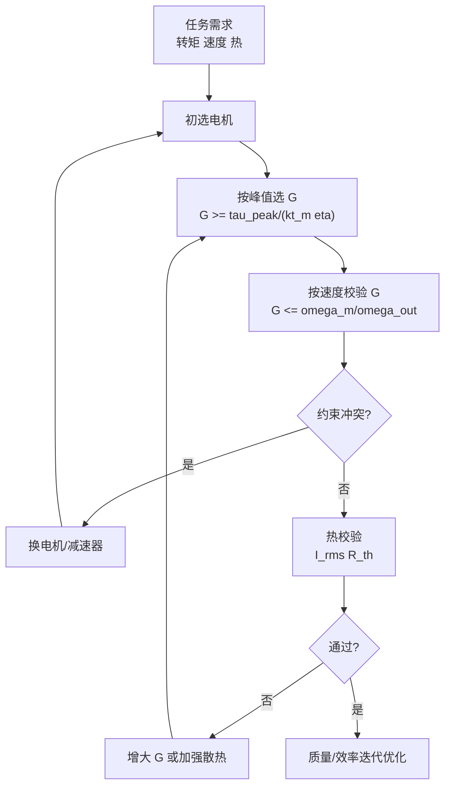

## 概述
关节电机是人形机器人领域的重要零部件。以下内容整理自项目 Wiki，供深入查阅。

## 核心内容
考虑一款 60 kg 级人形机器人的 **髋关节屈伸** 执行器，设计指标如下：

- 输出峰值扭矩：\(\tau_{peak} = 120\ \text{N·m}\)
- 输出连续 RMS 转矩：\(\tau_{rms} = 35\ \text{N·m}\)
- 输出最大角速度：\(\omega_{out,max} = 8\ \text{rad/s}\)
- 减速器效率：\(\eta = 0.85\)

候选电机参数：峰值转矩 \(\tau_{m,peak} = 3.0\ \text{N·m}\)，连续 RMS 转矩 \(\tau_{m,cont} = 1.0\ \text{N·m}\)，最大转速 \(\omega_{m,max} = 300\ \text{rad/s}\)。

**步骤 1：按峰值转矩初选减速比**

$$
G \ge \frac{\tau_{peak}}{\tau_{m,peak} \, \eta} = \frac{120}{3.0 \times 0.85} \approx 47.1
$$

**步骤 2：按速度要求校验上限**

$$
G \le \frac{\omega_{m,max}}{\omega_{out,max}} = \frac{300}{8} = 37.5
$$

步骤 1 与步骤 2 冲突：电机峰值转矩不足或最高转速不足。需重新选择电机，例如换用 \(\tau_{m,peak}=4.5\ \text{N·m}\)、\(\omega_{m,max}=400\ \text{rad/s}\) 的电机：

$$
G \ge \frac{120}{4.5 \times 0.85} \approx 31.4, \qquad
G \le \frac{400}{8} = 50
$$

取 \(G = 40\) 兼顾扭矩裕量与速度裕量。

**步骤 3：校验连续 RMS 转矩**

电机侧连续转矩需求为

$$
\tau_{m,rms} = \frac{\tau_{rms}}{G \eta} = \frac{35}{40 \times 0.85} \approx 1.03\ \text{N·m}
$$

略大于电机连续转矩 1.0 N·m，可通过稍微提高 \(G\) 至 42 或选用连续转矩 1.2 N·m 的电机解决。

**步骤 4：热校验**

设电机相电阻 \(R = 0.30\ \Omega\)，热阻 \(R_{th} = 1.8\ \text{K/W}\)，允许温升 \(\Delta T = 115\ \text{K}\)。

$$
P_{loss,allow} = \frac{\Delta T}{R_{th}} = \frac{115}{1.8} \approx 63.9\ \text{W}
$$

对应允许 RMS 电流

$$
I_{rms,max} = \sqrt{\frac{P_{loss,allow}}{R}} = \sqrt{\frac{63.9}{0.30}} \approx 14.6\ \text{A}
$$

电机转矩常数 \(k_t = 0.12\ \text{N·m/A}\)，则允许连续转矩

$$
\tau_{cont,allow} = k_t I_{rms,max} = 0.12 \times 14.6 \approx 1.75\ \text{N·m}
$$

大于需求 1.03 N·m，热设计通过。

**步骤 5：迭代优化**

若整机对质量敏感，可绘制 \(G\) 与电机质量、减速器质量、效率的 Pareto 前沿，选择满足全部约束且质量最小的组合。通常较高减速比允许更小电机但更重减速器；较低减速比则相反。人形机器人髋关节常在 \(G=30\sim80\) 之间权衡。

!!! note "术语解释：峰值扭矩、连续 RMS 转矩、减速比、效率、热校验、Pareto 前沿"
    - **峰值扭矩（peak torque）**：短时最大输出转矩，决定电机+减速器的强度下限。
    - **连续 RMS 转矩（continuous RMS torque）**：周期性负载的等效热转矩。
    - **减速比（gear ratio）**：电机转速与输出转速之比。
    - **热校验（thermal check）**：验证电机在 RMS 电流下的温升是否低于绝缘极限。
    - **Pareto 前沿（Pareto front）**：多目标优化中不可再同时改进所有目标的解集。



---

## 参考
- [Joint Motor](https://en.wikipedia.org/wiki/Servomotor)
- 项目 Wiki：chapter-04.md#4.7.6 选型算例：髋关节电机+减速器

## Overview
Joint motors are critical components in humanoid robotics. The following content is compiled from the project Wiki for in-depth reference.

## Content
Consider a **hip flexion/extension** actuator for a 60 kg humanoid robot, with the following design specifications:

- Peak output torque: \(\tau_{peak} = 120\ \text{N·m}\)
- Continuous RMS output torque: \(\tau_{rms} = 35\ \text{N·m}\)
- Maximum output angular velocity: \(\omega_{out,max} = 8\ \text{rad/s}\)
- Gearbox efficiency: \(\eta = 0.85\)

Candidate motor parameters: peak torque \(\tau_{m,peak} = 3.0\ \text{N·m}\), continuous RMS torque \(\tau_{m,cont} = 1.0\ \text{N·m}\), maximum speed \(\omega_{m,max} = 300\ \text{rad/s}\).

**Step 1: Preliminary gear ratio selection based on peak torque**

$$
G \ge \frac{\tau_{peak}}{\tau_{m,peak} \, \eta} = \frac{120}{3.0 \times 0.85} \approx 47.1
$$

**Step 2: Upper limit check based on speed requirement**

$$
G \le \frac{\omega_{m,max}}{\omega_{out,max}} = \frac{300}{8} = 37.5
$$

Conflict between Step 1 and Step 2: insufficient motor peak torque or insufficient maximum speed. A new motor must be selected, e.g., one with \(\tau_{m,peak}=4.5\ \text{N·m}\) and \(\omega_{m,max}=400\ \text{rad/s}\):

$$
G \ge \frac{120}{4.5 \times 0.85} \approx 31.4, \qquad
G \le \frac{400}{8} = 50
$$

Choose \(G = 40\) to balance torque margin and speed margin.

**Step 3: Verify continuous RMS torque**

The continuous torque requirement on the motor side is

$$
\tau_{m,rms} = \frac{\tau_{rms}}{G \eta} = \frac{35}{40 \times 0.85} \approx 1.03\ \text{N·m}
$$

This slightly exceeds the motor's continuous torque of 1.0 N·m, which can be resolved by slightly increasing \(G\) to 42 or selecting a motor with a continuous torque of 1.2 N·m.

**Step 4: Thermal check**

Assume motor phase resistance \(R = 0.30\ \Omega\), thermal resistance \(R_{th} = 1.8\ \text{K/W}\), and allowable temperature rise \(\Delta T = 115\ \text{K}\).

$$
P_{loss,allow} = \frac{\Delta T}{R_{th}} = \frac{115}{1.8} \approx 63.9\ \text{W}
$$

Corresponding allowable RMS current

$$
I_{rms,max} = \sqrt{\frac{P_{loss,allow}}{R}} = \sqrt{\frac{63.9}{0.30}} \approx 14.6\ \text{A}
$$

Motor torque constant \(k_t = 0.12\ \text{N·m/A}\), thus allowable continuous torque

$$
\tau_{cont,allow} = k_t I_{rms,max} = 0.12 \times 14.6 \approx 1.75\ \text{N·m}
$$

This is greater than the required 1.03 N·m, so the thermal design passes.

**Step 5: Iterative optimization**

If the overall system is sensitive to mass, plot the Pareto front of \(G\) versus motor mass, gearbox mass, and efficiency, and select the combination that satisfies all constraints with the minimum mass. Typically, a higher gear ratio allows a smaller motor but a heavier gearbox; the opposite is true for a lower gear ratio. For humanoid robot hip joints, the trade-off is often made within \(G=30\sim80\).

!!! note "Terminology explanation: peak torque, continuous RMS torque, gear ratio, efficiency, thermal check, Pareto front"
    - **Peak torque**: Maximum short-term output torque, determining the lower strength limit of the motor + gearbox.
    - **Continuous RMS torque**: Equivalent thermal torque for periodic loads.
    - **Gear ratio**: Ratio of motor speed to output speed.
    - **Thermal check**: Verifies that the motor's temperature rise under RMS current is below the insulation limit.
    - **Pareto front**: The set of solutions in multi-objective optimization where no objective can be improved without worsening another.

```mermaid
flowchart TD
    A["Task Requirements<br/>Torque Speed Thermal"] --> B["Preliminary Motor Selection"]
    B --> C["Select G by Peak Torque<br/>G >= tau_peak/(kt_m eta)"]
    C --> D["Check G by Speed<br/>G <= omega_m/omega_out"]
    D --> E{"Constraint Conflict?"}
    E -->|Yes| F["Change Motor/Gearbox"]
    F --> B
    E -->|No| G["Thermal Check<br/>I_rms R_th"]
    G --> H{"Pass?"}
    H -->|No| I["Increase G or Improve Cooling"]
    I --> C
    H -->|Yes| J["Mass/Efficiency Iterative Optimization"]

## 개요
관절 모터는 휴머노이드 로봇 분야의 중요한 부품입니다. 다음 내용은 프로젝트 Wiki에서 정리한 것으로, 심층적인 참고를 위해 제공됩니다.

## 핵심 내용
60kg급 휴머노이드 로봇의 **고관절 굴곡 신전** 액추에이터를 고려할 때, 설계 사양은 다음과 같습니다.

- 출력 피크 토크: \(\tau_{peak} = 120\ \text{N·m}\)
- 출력 연속 RMS 토크: \(\tau_{rms} = 35\ \text{N·m}\)
- 출력 최대 각속도: \(\omega_{out,max} = 8\ \text{rad/s}\)
- 감속기 효율: \(\eta = 0.85\)

후보 모터 파라미터: 피크 토크 \(\tau_{m,peak} = 3.0\ \text{N·m}\), 연속 RMS 토크 \(\tau_{m,cont} = 1.0\ \text{N·m}\), 최대 회전 속도 \(\omega_{m,max} = 300\ \text{rad/s}\).

**단계 1: 피크 토크에 따른 감속비 초기 선정**

$$
G \ge \frac{\tau_{peak}}{\tau_{m,peak} \, \eta} = \frac{120}{3.0 \times 0.85} \approx 47.1
$$

**단계 2: 속도 요구 사항에 따른 상한 검증**

$$
G \le \frac{\omega_{m,max}}{\omega_{out,max}} = \frac{300}{8} = 37.5
$$

단계 1과 단계 2가 충돌합니다: 모터 피크 토크가 부족하거나 최대 회전 속도가 부족합니다. 모터를 재선택해야 합니다. 예를 들어 \(\tau_{m,peak}=4.5\ \text{N·m}\), \(\omega_{m,max}=400\ \text{rad/s}\)인 모터로 교체:

$$
G \ge \frac{120}{4.5 \times 0.85} \approx 31.4, \qquad
G \le \frac{400}{8} = 50
$$

토크 여유와 속도 여유를 고려하여 \(G = 40\)을 선택합니다.

**단계 3: 연속 RMS 토크 검증**

모터 측 연속 토크 요구 사항은

$$
\tau_{m,rms} = \frac{\tau_{rms}}{G \eta} = \frac{35}{40 \times 0.85} \approx 1.03\ \text{N·m}
$$

모터 연속 토크 1.0 N·m보다 약간 크므로, \(G\)를 42로 약간 높이거나 연속 토크가 1.2 N·m인 모터를 선택하여 해결할 수 있습니다.

**단계 4: 열 검증**

모터 상 저항 \(R = 0.30\ \Omega\), 열 저항 \(R_{th} = 1.8\ \text{K/W}\), 허용 온도 상승 \(\Delta T = 115\ \text{K}\)라고 가정합니다.

$$
P_{loss,allow} = \frac{\Delta T}{R_{th}} = \frac{115}{1.8} \approx 63.9\ \text{W}
$$

해당 허용 RMS 전류

$$
I_{rms,max} = \sqrt{\frac{P_{loss,allow}}{R}} = \sqrt{\frac{63.9}{0.30}} \approx 14.6\ \text{A}
$$

모터 토크 상수 \(k_t = 0.12\ \text{N·m/A}\)이므로, 허용 연속 토크

$$
\tau_{cont,allow} = k_t I_{rms,max} = 0.12 \times 14.6 \approx 1.75\ \text{N·m}
$$

요구 사항 1.03 N·m보다 크므로 열 설계가 통과됩니다.

**단계 5: 반복 최적화**

전체 기계가 무게에 민감한 경우, \(G\)와 모터 무게, 감속기 무게, 효율의 Pareto 프론티어를 그려 모든 제약 조건을 만족하면서 무게가 가장 작은 조합을 선택할 수 있습니다. 일반적으로 높은 감속비는 더 작은 모터를 허용하지만 더 무거운 감속기를 필요로 하고, 낮은 감속비는 그 반대입니다. 휴머노이드 로봇의 고관절은 종종 \(G=30\sim80\) 사이에서 균형을 맞춥니다.

!!! note "용어 설명: 피크 토크, 연속 RMS 토크, 감속비, 효율, 열 검증, Pareto 프론티어"
    - **피크 토크 (peak torque)**: 단시간 최대 출력 토크로, 모터+감속기의 강도 하한을 결정합니다.
    - **연속 RMS 토크 (continuous RMS torque)**: 주기적 부하의 등가 열 토크입니다.
    - **감속비 (gear ratio)**: 모터 회전 속도와 출력 회전 속도의 비율입니다.
    - **열 검증 (thermal check)**: RMS 전류 하에서 모터의 온도 상승이 절연 한계 미만인지 확인합니다.
    - **Pareto 프론티어 (Pareto front)**: 다중 목표 최적화에서 모든 목표를 동시에 개선할 수 없는 해의 집합입니다.

```mermaid
flowchart TD
    A["작업 요구 사항<br/>토크 속도 열"] --> B["모터 초기 선정"]
    B --> C["피크에 따라 G 선정<br/>G >= tau_peak/(kt_m eta)"]
    C --> D["속도에 따라 G 검증<br/>G <= omega_m/omega_out"]
    D --> E{"제약 조건 충돌?"}
    E -->|예| F["모터/감속기 교체"]
    F --> B
    E -->|아니오| G["열 검증<br/>I_rms R_th"]
    G --> H{"통과?"}
    H -->|아니오| I["G 증가 또는 방열 강화"]
    I --> C
    H -->|예| J["무게/효율 반복 최적화"]

## 개요
관절 모터는 휴머노이드 로봇 분야의 중요한 부품입니다. 다음 내용은 프로젝트 Wiki에서 정리한 것으로, 심층 참고용으로 제공됩니다.

## 핵심 내용
60kg급 휴머노이드 로봇의 **고관절 굴곡 신전** 액추에이터를 고려하며, 설계 사양은 다음과 같습니다:

- 출력 피크 토크: \(\tau_{peak} = 120\ \text{N·m}\)
- 출력 연속 RMS 토크: \(\tau_{rms} = 35\ \text{N·m}\)
- 출력 최대 각속도: \(\omega_{out,max} = 8\ \text{rad/s}\)
- 감속기 효율: \(\eta = 0.85\)

후보 모터 파라미터: 피크 토크 \(\tau_{m,peak} = 3.0\ \text{N·m}\), 연속 RMS 토크 \(\tau_{m,cont} = 1.0\ \text{N·m}\), 최대 회전 속도 \(\omega_{m,max} = 300\ \text{rad/s}\).

**단계 1: 피크 토크 기준 감속비 초기 선정**

$$
G \ge \frac{\tau_{peak}}{\tau_{m,peak} \, \eta} = \frac{120}{3.0 \times 0.85} \approx 47.1
$$

**단계 2: 속도 요구 조건에 따른 상한 검증**

$$
G \le \frac{\omega_{m,max}}{\omega_{out,max}} = \frac{300}{8} = 37.5
$$

단계 1과 단계 2가 충돌: 모터 피크 토크 부족 또는 최대 회전 속도 부족. 모터를 재선택해야 하며, 예를 들어 \(\tau_{m,peak}=4.5\ \text{N·m}\), \(\omega_{m,max}=400\ \text{rad/s}\)인 모터로 교체:

$$
G \ge \frac{120}{4.5 \times 0.85} \approx 31.4, \qquad
G \le \frac{400}{8} = 50
$$

\(G = 40\)을 선택하여 토크 여유와 속도 여유를 모두 확보.

**단계 3: 연속 RMS 토크 검증**

모터 측 연속 토크 요구량은

$$
\tau_{m,rms} = \frac{\tau_{rms}}{G \eta} = \frac{35}{40 \times 0.85} \approx 1.03\ \text{N·m}
$$

모터 연속 토크 1.0 N·m보다 약간 크므로, \(G\)를 42로 약간 높이거나 연속 토크 1.2 N·m인 모터를 선택하여 해결 가능.

**단계 4: 열 검증**

모터 상 저항 \(R = 0.30\ \Omega\), 열 저항 \(R_{th} = 1.8\ \text{K/W}\), 허용 온도 상승 \(\Delta T = 115\ \text{K}\)로 가정.

$$
P_{loss,allow} = \frac{\Delta T}{R_{th}} = \frac{115}{1.8} \approx 63.9\ \text{W}
$$

해당 허용 RMS 전류

$$
I_{rms,max} = \sqrt{\frac{P_{loss,allow}}{R}} = \sqrt{\frac{63.9}{0.30}} \approx 14.6\ \text{A}
$$

모터 토크 상수 \(k_t = 0.12\ \text{N·m/A}\)이므로, 허용 연속 토크

$$
\tau_{cont,allow} = k_t I_{rms,max} = 0.12 \times 14.6 \approx 1.75\ \text{N·m}
$$

요구량 1.03 N·m보다 크므로 열 설계 통과.

**단계 5: 반복 최적화**

전체 기계가 무게에 민감한 경우, \(G\)와 모터 질량, 감속기 질량, 효율의 Pareto 프론티어를 도출하여 모든 제약 조건을 만족하면서 질량이 가장 작은 조합을 선택. 일반적으로 높은 감속비는 더 작은 모터를 허용하지만 더 무거운 감속기를 필요로 함; 낮은 감속비는 그 반대. 휴머노이드 로봇 고관절은 종종 \(G=30\sim80\) 사이에서 균형을 맞춤.

!!! note "용어 설명: 피크 토크, 연속 RMS 토크, 감속비, 효율, 열 검증, Pareto 프론티어"
    - **피크 토크 (peak torque)**: 단시간 최대 출력 토크로, 모터+감속기의 강도 하한을 결정.
    - **연속 RMS 토크 (continuous RMS torque)**: 주기적 부하의 등가 열 토크.
    - **감속비 (gear ratio)**: 모터 회전 속도와 출력 회전 속도의 비율.
    - **열 검증 (thermal check)**: RMS 전류 하에서 모터의 온도 상승이 절연 한계 이하인지 확인.
    - **Pareto 프론티어 (Pareto front)**: 다중 목표 최적화에서 모든 목표를 동시에 개선할 수 없는 해의 집합.

```mermaid
flowchart TD
    A["작업 요구<br/>토크 속도 열"] --> B["모터 초기 선정"]
    B --> C["피크 기준 G 선정<br/>G >= tau_peak/(kt_m eta)"]
    C --> D["속도 기준 G 검증<br/>G <= omega_m/omega_out"]
    D --> E{"제약 충돌?"}
    E -->|예| F["모터/감속기 교체"]
    F --> B
    E -->|아니오| G["열 검증<br/>I_rms R_th"]
    G --> H{"통과?"}
    H -->|아니오| I["G 증가 또는 방열 강화"]
    I --> C
    H -->|예| J["질량/효율 반복 최적화"]
