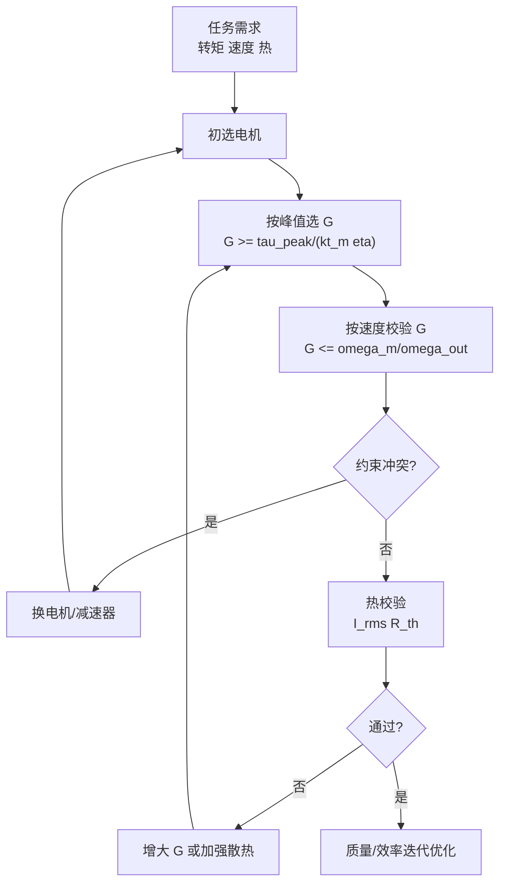

## 概述
关节电机是人形机器人领域的重要component。以下内容整理自项目 Wiki，供深入查阅。

## 核心内容
考虑一款 60 kg 级人形机器人的 **髋关节屈伸** 执行器，设计指标如下：

- 输出峰值扭矩：\(\tau_{peak} = 120\ \text{N·m}\)
- 输出连续 RMS 转矩：\(\tau_{rms} = 35\ \text{N·m}\)
- 输出最大角速度：\(\omega_{out,max} = 8\ \text{rad/s}\)
- 减速器效率：\(\eta = 0.85\)

候选电机参数：峰值转矩 \(\tau_{m,peak} = 3.0\ \text{N·m}\)，连续 RMS 转矩 \(\tau_{m,cont} = 1.0\ \text{N·m}\)，最大转速 \(\omega_{m,max} = 300\ \text{rad/s}\)。

**步骤 1：按峰值转矩初选减速比**

$$
G \ge \frac{\tau_{peak}}{\tau_{m,peak} \, \eta} = \frac{120}{3.0 \times 0.85} \approx 47.1
$$

**步骤 2：按速度要求校验上限**

$$
G \le \frac{\omega_{m,max}}{\omega_{out,max}} = \frac{300}{8} = 37.5
$$

步骤 1 与步骤 2 冲突：电机峰值转矩不足或最高转速不足。需重新选择电机，例如换用 \(\tau_{m,peak}=4.5\ \text{N·m}\)、\(\omega_{m,max}=400\ \text{rad/s}\) 的电机：

$$
G \ge \frac{120}{4.5 \times 0.85} \approx 31.4, \qquad
G \le \frac{400}{8} = 50
$$

取 \(G = 40\) 兼顾扭矩裕量与速度裕量。

**步骤 3：校验连续 RMS 转矩**

电机侧连续转矩需求为

$$
\tau_{m,rms} = \frac{\tau_{rms}}{G \eta} = \frac{35}{40 \times 0.85} \approx 1.03\ \text{N·m}
$$

略大于电机连续转矩 1.0 N·m，可通过稍微提高 \(G\) 至 42 或选用连续转矩 1.2 N·m 的电机解决。

**步骤 4：热校验**

设电机相电阻 \(R = 0.30\ \Omega\)，热阻 \(R_{th} = 1.8\ \text{K/W}\)，允许温升 \(\Delta T = 115\ \text{K}\)。

$$
P_{loss,allow} = \frac{\Delta T}{R_{th}} = \frac{115}{1.8} \approx 63.9\ \text{W}
$$

对应允许 RMS 电流

$$
I_{rms,max} = \sqrt{\frac{P_{loss,allow}}{R}} = \sqrt{\frac{63.9}{0.30}} \approx 14.6\ \text{A}
$$

电机转矩常数 \(k_t = 0.12\ \text{N·m/A}\)，则允许连续转矩

$$
\tau_{cont,allow} = k_t I_{rms,max} = 0.12 \times 14.6 \approx 1.75\ \text{N·m}
$$

大于需求 1.03 N·m，热设计通过。

**步骤 5：迭代优化**

若整机对质量敏感，可绘制 \(G\) 与电机质量、减速器质量、效率的 Pareto 前沿，选择满足全部约束且质量最小的组合。通常较高减速比允许更小电机但更重减速器；较低减速比则相反。人形机器人髋关节常在 \(G=30\sim80\) 之间权衡。

!!! note "术语解释：峰值扭矩、连续 RMS 转矩、减速比、效率、热校验、Pareto 前沿"
    - **峰值扭矩（peak torque）**：短时最大输出转矩，决定电机+减速器的强度下限。
    - **连续 RMS 转矩（continuous RMS torque）**：周期性负载的等效热转矩。
    - **减速比（gear ratio）**：电机转速与输出转速之比。
    - **热校验（thermal check）**：验证电机在 RMS 电流下的温升是否低于绝缘极限。
    - **Pareto 前沿（Pareto front）**：多目标优化中不可再同时改进所有目标的解集。

---

## 参考
- [Joint Motor](https://en.wikipedia.org/wiki/Servomotor)
- 项目 Wiki：chapter-04.md#4.7.6 选型算例：髋关节电机+减速器

