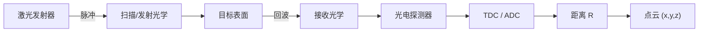

## 概述
### 5.3.1 飞行时间测距与 LiDAR 点云

## 核心内容
**激光雷达（Light Detection and Ranging, LiDAR）** 通过发射激光脉冲并测量其往返时间来获得目标距离。与相机不同，LiDAR 直接测量三维空间中的距离，输出的是离散的三维点集合，称为 **点云（point cloud）**。

!!! note "术语解释：激光雷达、LiDAR、点云、激光脉冲、回波、测距"
    - **激光雷达 / LiDAR（Light Detection and Ranging）**：利用激光进行探测和测距的主动光学传感器。
    - **点云（point cloud）**：三维空间中一组带坐标（通常还有强度、时间戳）的离散点，是 LiDAR 的输出形式。
    - **激光脉冲（laser pulse）**：LiDAR 发射的短时、高能量光束。
    - **回波（return / echo）**：激光照射目标后反射回来的信号。
    - **测距（ranging）**：测量传感器到目标之间距离的过程。

LiDAR 的基本测距方程为：

$$
R = \frac{c \, \Delta t}{2}
$$

其中 \(R\) 为距离，\(c\) 为光速，\(\Delta t\) 为发射与接收之间的时间差。

LiDAR 接收到的光功率可用 **雷达测距方程** 估算：

$$
P_r = P_t \, \frac{D_r^2}{4 R^2} \, \eta_{atm} \, \eta_{sys} \, \rho \, \cos\theta \, \frac{A_{spot}}{\pi R^2 \tan^2(\theta_{beam}/2)}
$$

其中 \(P_t\) 为发射功率，\(D_r\) 为接收孔径，\(\eta_{atm}\) 和 \(\eta_{sys}\) 分别为大气与系统光学效率，\(\rho\) 为目标反射率，\(\theta\) 为入射角，\(A_{spot}\) 为目标被照亮面积。该式说明：接收功率随距离平方（甚至四次方）衰减，因此远距离探测需要高峰值功率和大接收孔径。

!!! note "术语解释：雷达方程、反射率、接收孔径、大气衰减、光束发散角"
    - **雷达方程（radar equation / LiDAR equation）**：描述发射功率、目标特性、距离与接收功率之间关系的公式。
    - **反射率（reflectivity）**：目标表面反射光的比例，\(\rho\)。
    - **接收孔径（receiver aperture）**：接收光学系统的有效直径。
    - **大气衰减（atmospheric attenuation）**：光在传播中被大气散射和吸收导致的功率损失。
    - **光束发散角（beam divergence angle）**：激光束随传播扩大的角度，决定光斑大小。



## 参考
- Wiki extraction

## Overview
### 5.3.1 Time-of-Flight Ranging and LiDAR Point Clouds

## Content
**Light Detection and Ranging (LiDAR)** measures the distance to a target by emitting laser pulses and measuring their round-trip time. Unlike cameras, LiDAR directly measures distances in three-dimensional space, outputting a discrete set of three-dimensional points known as a **point cloud**.

!!! note "Terminology: LiDAR, point cloud, laser pulse, return/echo, ranging"
    - **LiDAR (Light Detection and Ranging)**: An active optical sensor that uses laser light for detection and ranging.
    - **Point cloud**: A set of discrete points in three-dimensional space with coordinates (and often intensity and timestamp), which is the output form of LiDAR.
    - **Laser pulse**: A short-duration, high-energy beam of light emitted by LiDAR.
    - **Return / Echo**: The signal reflected back after the laser illuminates a target.
    - **Ranging**: The process of measuring the distance from the sensor to a target.

The basic ranging equation for LiDAR is:

$$
R = \frac{c \, \Delta t}{2}
$$

where \(R\) is the distance, \(c\) is the speed of light, and \(\Delta t\) is the time difference between emission and reception.

The received optical power of LiDAR can be estimated using the **radar ranging equation**:

$$
P_r = P_t \, \frac{D_r^2}{4 R^2} \, \eta_{atm} \, \eta_{sys} \, \rho \, \cos\theta \, \frac{A_{spot}}{\pi R^2 \tan^2(\theta_{beam}/2)}
$$

where \(P_t\) is the transmitted power, \(D_r\) is the receiver aperture, \(\eta_{atm}\) and \(\eta_{sys}\) are the atmospheric and system optical efficiencies, \(\rho\) is the target reflectivity, \(\theta\) is the incidence angle, and \(A_{spot}\) is the illuminated area on the target. This equation shows that the received power decays with the square (or even the fourth power) of the distance, so long-range detection requires high peak power and a large receiver aperture.

!!! note "Terminology: Radar equation, reflectivity, receiver aperture, atmospheric attenuation, beam divergence angle"
    - **Radar equation / LiDAR equation**: A formula describing the relationship between transmitted power, target characteristics, distance, and received power.
    - **Reflectivity**: The proportion of light reflected by the target surface, denoted \(\rho\).
    - **Receiver aperture**: The effective diameter of the receiving optical system.
    - **Atmospheric attenuation**: Power loss caused by scattering and absorption of light in the atmosphere during propagation.
    - **Beam divergence angle**: The angle over which the laser beam expands as it propagates, determining the spot size.

```mermaid
flowchart LR
    A["Laser Transmitter"] -->|"Pulse"| B["Scanning/Transmission Optics"]
    B --> C["Target Surface"]
    C -->|"Return"| D["Receiving Optics"]
    D --> E["Photodetector"]
    E --> F["TDC / ADC"]
    F --> G["Distance R"]
    G --> H["Point Cloud (x,y,z)"]

## 개요
### 5.3.1 비행시간 거리 측정과 LiDAR 포인트 클라우드

## 핵심 내용
**라이다(Light Detection and Ranging, LiDAR)** 는 레이저 펄스를 발사하고 그 왕복 시간을 측정하여 목표물까지의 거리를 얻습니다. 카메라와 달리 LiDAR는 3차원 공간의 거리를 직접 측정하며, 출력은 **포인트 클라우드(point cloud)** 라고 불리는 이산적인 3차원 점들의 집합입니다.

!!! note "용어 설명: 라이다, LiDAR, 포인트 클라우드, 레이저 펄스, 에코, 거리 측정"
    - **라이다 / LiDAR(Light Detection and Ranging)** : 레이저를 이용하여 탐지 및 거리 측정을 수행하는 능동 광학 센서.
    - **포인트 클라우드(point cloud)** : 3차원 공간에서 좌표(일반적으로 강도, 타임스탬프 포함)를 가진 이산적인 점들의 집합으로, LiDAR의 출력 형태입니다.
    - **레이저 펄스(laser pulse)** : LiDAR가 발사하는 짧은 시간 동안의 고에너지 광선.
    - **에코(return / echo)** : 레이저가 목표물에 조사된 후 반사되어 돌아오는 신호.
    - **거리 측정(ranging)** : 센서에서 목표물까지의 거리를 측정하는 과정.

LiDAR의 기본 거리 측정 방정식은 다음과 같습니다:

$$
R = \frac{c \, \Delta t}{2}
$$

여기서 \(R\)은 거리, \(c\)는 광속, \(\Delta t\)는 발사와 수신 사이의 시간 차이입니다.

LiDAR가 수신하는 광출력은 **레이더 거리 방정식**을 통해 추정할 수 있습니다:

$$
P_r = P_t \, \frac{D_r^2}{4 R^2} \, \eta_{atm} \, \eta_{sys} \, \rho \, \cos\theta \, \frac{A_{spot}}{\pi R^2 \tan^2(\theta_{beam}/2)}
$$

여기서 \(P_t\)는 송신 출력, \(D_r\)은 수신 구경, \(\eta_{atm}\)과 \(\eta_{sys}\)는 각각 대기 및 시스템 광학 효율, \(\rho\)는 목표물 반사율, \(\theta\)는 입사각, \(A_{spot}\)은 목표물이 조명된 면적입니다. 이 식은 수신 출력이 거리의 제곱(또는 네제곱)에 따라 감쇠하므로, 원거리 탐지에는 높은 첨두 출력과 큰 수신 구경이 필요함을 설명합니다.

!!! note "용어 설명: 레이더 방정식, 반사율, 수신 구경, 대기 감쇠, 빔 발산각"
    - **레이더 방정식(radar equation / LiDAR equation)** : 송신 출력, 목표물 특성, 거리와 수신 출력 간의 관계를 설명하는 공식.
    - **반사율(reflectivity)** : 목표물 표면이 빛을 반사하는 비율, \(\rho\).
    - **수신 구경(receiver aperture)** : 수신 광학 시스템의 유효 직경.
    - **대기 감쇠(atmospheric attenuation)** : 빛이 전파 중 대기에 의해 산란 및 흡수되어 발생하는 출력 손실.
    - **빔 발산각(beam divergence angle)** : 레이저 빔이 전파됨에 따라 확장되는 각도로, 스팟 크기를 결정합니다.

```mermaid
flowchart LR
    A["레이저 송신기"] -->|"펄스"| B["스캔/송신 광학"]
    B --> C["목표물 표면"]
    C -->|"에코"| D["수신 광학"]
    D --> E["광전 검출기"]
    E --> F["TDC / ADC"]
    F --> G["거리 R"]
    G --> H["포인트 클라우드 (x,y,z)"]

## 개요
### 5.3.1 비행 시간 거리 측정과 LiDAR 포인트 클라우드

## 핵심 내용
**라이다(Light Detection and Ranging, LiDAR)** 는 레이저 펄스를 발사하고 왕복 시간을 측정하여 대상까지의 거리를 얻습니다. 카메라와 달리 LiDAR는 3차원 공간의 거리를 직접 측정하며, 출력은 **포인트 클라우드(point cloud)** 라고 불리는 이산적인 3차원 점 집합입니다.

!!! note "용어 설명: 라이다, LiDAR, 포인트 클라우드, 레이저 펄스, 에코, 거리 측정"
    - **라이다 / LiDAR(Light Detection and Ranging)** : 레이저를 이용하여 탐지 및 거리 측정을 수행하는 능동 광학 센서.
    - **포인트 클라우드(point cloud)** : 3차원 공간에서 좌표(일반적으로 강도, 타임스탬프 포함)를 가진 이산적인 점들의 집합으로, LiDAR의 출력 형태입니다.
    - **레이저 펄스(laser pulse)** : LiDAR가 발사하는 짧은 시간의 고에너지 광선.
    - **에코(return / echo)** : 레이저가 대상에 조사된 후 반사되어 돌아오는 신호.
    - **거리 측정(ranging)** : 센서에서 대상까지의 거리를 측정하는 과정.

LiDAR의 기본 거리 측정 방정식은 다음과 같습니다:

$$
R = \frac{c \, \Delta t}{2}
$$

여기서 \(R\)은 거리, \(c\)는 광속, \(\Delta t\)는 발사와 수신 사이의 시간 차이입니다.

LiDAR가 수신하는 광출력은 **레이더 거리 방정식**을 통해 추정할 수 있습니다:

$$
P_r = P_t \, \frac{D_r^2}{4 R^2} \, \eta_{atm} \, \eta_{sys} \, \rho \, \cos\theta \, \frac{A_{spot}}{\pi R^2 \tan^2(\theta_{beam}/2)}
$$

여기서 \(P_t\)는 송신 출력, \(D_r\)은 수신 구경, \(\eta_{atm}\)과 \(\eta_{sys}\)는 각각 대기 및 시스템 광학 효율, \(\rho\)는 대상 반사율, \(\theta\)는 입사각, \(A_{spot}\)은 대상이 조명된 면적입니다. 이 식은 수신 출력이 거리의 제곱(또는 네제곱)에 따라 감쇠하므로, 원거리 탐지에는 높은 첨두 출력과 큰 수신 구경이 필요함을 설명합니다.

!!! note "용어 설명: 레이더 방정식, 반사율, 수신 구경, 대기 감쇠, 빔 발산각"
    - **레이더 방정식(radar equation / LiDAR equation)** : 송신 출력, 대상 특성, 거리와 수신 출력 간의 관계를 설명하는 공식.
    - **반사율(reflectivity)** : 대상 표면이 빛을 반사하는 비율, \(\rho\).
    - **수신 구경(receiver aperture)** : 수신 광학 시스템의 유효 직경.
    - **대기 감쇠(atmospheric attenuation)** : 빛이 전파 중 대기에 의한 산란 및 흡수로 인한 출력 손실.
    - **빔 발산각(beam divergence angle)** : 레이저 빔이 전파됨에 따라 확장되는 각도로, 스팟 크기를 결정합니다.

```mermaid
flowchart LR
    A["레이저 송신기"] -->|"펄스"| B["스캔/송신 광학"]
    B --> C["대상 표면"]
    C -->|"에코"| D["수신 광학"]
    D --> E["광전 검출기"]
    E --> F["TDC / ADC"]
    F --> G["거리 R"]
    G --> H["포인트 클라우드 (x,y,z)"]
