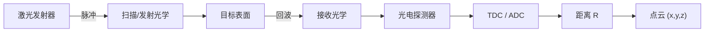

## 概述
### 5.3.1 飞行时间测距与 LiDAR 点云

## 核心内容
**激光雷达（Light Detection and Ranging, LiDAR）** 通过发射激光脉冲并测量其往返时间来获得目标距离。与相机不同，LiDAR 直接测量三维空间中的距离，输出的是离散的三维点集合，称为 **点云（point cloud）**。

!!! note "术语解释：激光雷达、LiDAR、点云、激光脉冲、回波、测距"
    - **激光雷达 / LiDAR（Light Detection and Ranging）**：利用激光进行探测和测距的主动光学传感器。
    - **点云（point cloud）**：三维空间中一组带坐标（通常还有强度、时间戳）的离散点，是 LiDAR 的输出形式。
    - **激光脉冲（laser pulse）**：LiDAR 发射的短时、高能量光束。
    - **回波（return / echo）**：激光照射目标后反射回来的信号。
    - **测距（ranging）**：测量传感器到目标之间距离的过程。

LiDAR 的基本测距方程为：

$$
R = \frac{c \, \Delta t}{2}
$$

其中 \(R\) 为距离，\(c\) 为光速，\(\Delta t\) 为发射与接收之间的时间差。

LiDAR 接收到的光功率可用 **雷达测距方程** 估算：

$$
P_r = P_t \, \frac{D_r^2}{4 R^2} \, \eta_{atm} \, \eta_{sys} \, \rho \, \cos\theta \, \frac{A_{spot}}{\pi R^2 \tan^2(\theta_{beam}/2)}
$$

其中 \(P_t\) 为发射功率，\(D_r\) 为接收孔径，\(\eta_{atm}\) 和 \(\eta_{sys}\) 分别为大气与系统光学效率，\(\rho\) 为目标反射率，\(\theta\) 为入射角，\(A_{spot}\) 为目标被照亮面积。该式说明：接收功率随距离平方（甚至四次方）衰减，因此远距离探测需要高峰值功率和大接收孔径。

!!! note "术语解释：雷达方程、反射率、接收孔径、大气衰减、光束发散角"
    - **雷达方程（radar equation / LiDAR equation）**：描述发射功率、目标特性、距离与接收功率之间关系的公式。
    - **反射率（reflectivity）**：目标表面反射光的比例，\(\rho\)。
    - **接收孔径（receiver aperture）**：接收光学系统的有效直径。
    - **大气衰减（atmospheric attenuation）**：光在传播中被大气散射和吸收导致的功率损失。
    - **光束发散角（beam divergence angle）**：激光束随传播扩大的角度，决定光斑大小。

## 参考
- Wiki extraction

