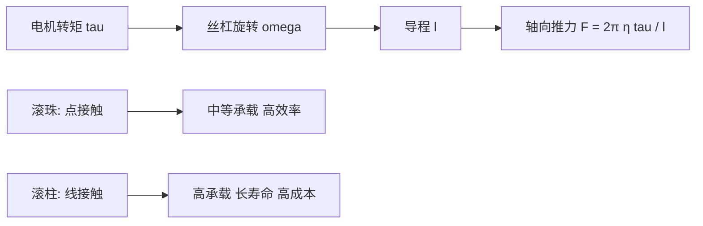

## 概述
行星滚柱丝杠是人形机器人领域的重要零部件。以下内容整理自项目 Wiki，供深入查阅。

## 核心内容
人形机器人的线性关节（如 Optimus 躯干与腿部的部分直线驱动器）常采用滚珠丝杠或行星滚柱丝杠把电机旋转运动转换为直线推力。其基本运动学关系为：螺距（lead）$l$ 表示丝杠旋转一周螺母前进的距离，因此螺母线位移

$$
x = \frac{l}{2\pi} \, \theta
$$

其中 $\theta$ 为丝杠转角（rad）。对时间求导得到线速度与角速度的关系

$$
v = \frac{l}{2\pi} \, \omega
$$

设电机输出转矩为 $\tau$，忽略损耗时产生的轴向推力为

$$
F = \frac{2\pi}{l} \, \tau
$$

计入传动效率 $\eta$ 后

$$
F = \frac{2\pi \, \eta}{l} \, \tau
$$

或反解电机所需转矩

$$
\tau = \frac{F \, l}{2\pi \, \eta}
$$

例如，Tesla Optimus 线性关节 reportedly 采用行星滚柱丝杠，若需输出 $F=8000\ \text{N}$，丝杠导程 $l=5\ \text{mm}=0.005\ \text{m}$，效率 $\eta=0.90$，则电机侧所需连续转矩约为

$$
\tau = \frac{8000 \times 0.005}{2\pi \times 0.90} \approx 7.07\ \text{N·m}
$$

这解释了为何直线关节仍需要较大尺寸的无框力矩电机。

!!! note "术语解释：螺距、导程、滚珠丝杠、行星滚柱丝杠、背驱、自锁"
    - **螺距 / 导程（lead, $l$）**：丝杠旋转一周螺母沿轴向移动的距离，单位 mm/rev 或 m/rad。
    - **滚珠丝杠（ball screw）**：通过滚珠在丝杠与螺母滚道间滚动传递载荷，摩擦低、效率高。
    - **行星滚柱丝杠（planetary roller screw）**：用多个行星滚柱替代滚珠，接触面积大、承载能力与寿命远高于同尺寸滚珠丝杠。
    - **背驱（back-driving）**：轴向负载推动螺母反向旋转的现象，与导程角和摩擦有关。
    - **自锁（self-locking）**：当导程角小于摩擦角时，轴向力无法反向驱动丝杠，关节保持静止。

丝杠的力学优势可用**导程角**（lead angle）$\lambda$ 理解。把丝杠螺纹展开为斜面，导程角满足

$$
\tan\lambda = \frac{l}{\pi d_m}
$$

其中 $d_m$ 为螺纹中径。丝杠副效率可近似写成

$$
\eta = \frac{\tan\lambda}{\tan(\lambda + \rho)}
$$

$\rho$ 为等效摩擦角，$\tan\rho = \mu$，$\mu$ 为滚动或滑动摩擦系数。对滚珠丝杠，$\mu\approx0.003$–$0.01$，效率可达 90%–95%；对滑动丝杠，$\mu$ 可达 0.1–0.2，效率仅 30%–50%。

!!! note "术语解释：导程角、摩擦角、等效摩擦系数、螺纹中径"
    - **导程角（lead angle, $\lambda$）**：螺纹展开后斜面与垂直于轴线的平面之间的夹角。
    - **摩擦角（friction angle, $\rho$）**：摩擦系数对应的等效角度，$\tan\rho=\mu$。
    - **等效摩擦系数（equivalent friction coefficient）**：综合滚动/滑动接触、润滑状态的摩擦系数。
    - **螺纹中径（pitch diameter, $d_m$）**：螺纹牙顶与牙底之间的平均直径。

当 $\lambda < \rho$ 时，丝杠具有**自锁**特性，即轴向负载无法反向驱动电机；当 $\lambda > \rho$ 时，丝杠可被背驱。人形机器人关节通常需要一定程度的背驱性以便力控与柔顺交互，因此多选用大导程滚珠/滚柱丝杠，而非自锁梯形丝杠。

滚珠丝杠与行星滚柱丝杠的核心差异在于承载元件。滚珠为点接触，赫兹接触应力高；行星滚柱为线接触，接触面积显著增大。SKF 技术资料显示，同尺寸下行星滚柱丝杠的额定动载荷可达滚珠丝杠的 3–5 倍，寿命可达 10–15 倍，但成本和制造精度要求也更高[43]。因此 Optimus 等强调高推力的平台倾向于滚柱丝杠，而一般工业直线模组多用滚珠丝杠。

## 参考
- [Planetary Roller Screw](https://en.wikipedia.org/wiki/Roller_screw)
- 项目 Wiki：chapter-04.md#滚珠丝杠与行星滚柱丝杠的力学与效率

