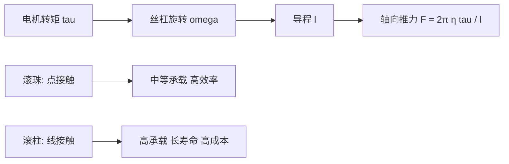

## 概述
行星滚柱丝杠是人形机器人领域的重要零部件。以下内容整理自项目 Wiki，供深入查阅。

## 核心内容
人形机器人的线性关节（如 Optimus 躯干与腿部的部分直线驱动器）常采用滚珠丝杠或行星滚柱丝杠把电机旋转运动转换为直线推力。其基本运动学关系为：螺距（lead）$l$ 表示丝杠旋转一周螺母前进的距离，因此螺母线位移

$$
x = \frac{l}{2\pi} \, \theta
$$

其中 $\theta$ 为丝杠转角（rad）。对时间求导得到线速度与角速度的关系

$$
v = \frac{l}{2\pi} \, \omega
$$

设电机输出转矩为 $\tau$，忽略损耗时产生的轴向推力为

$$
F = \frac{2\pi}{l} \, \tau
$$

计入传动效率 $\eta$ 后

$$
F = \frac{2\pi \, \eta}{l} \, \tau
$$

或反解电机所需转矩

$$
\tau = \frac{F \, l}{2\pi \, \eta}
$$

例如，Tesla Optimus 线性关节 reportedly 采用行星滚柱丝杠，若需输出 $F=8000\ \text{N}$，丝杠导程 $l=5\ \text{mm}=0.005\ \text{m}$，效率 $\eta=0.90$，则电机侧所需连续转矩约为

$$
\tau = \frac{8000 \times 0.005}{2\pi \times 0.90} \approx 7.07\ \text{N·m}
$$

这解释了为何直线关节仍需要较大尺寸的无框力矩电机。

!!! note "术语解释：螺距、导程、滚珠丝杠、行星滚柱丝杠、背驱、自锁"
    - **螺距 / 导程（lead, $l$）**：丝杠旋转一周螺母沿轴向移动的距离，单位 mm/rev 或 m/rad。
    - **滚珠丝杠（ball screw）**：通过滚珠在丝杠与螺母滚道间滚动传递载荷，摩擦低、效率高。
    - **行星滚柱丝杠（planetary roller screw）**：用多个行星滚柱替代滚珠，接触面积大、承载能力与寿命远高于同尺寸滚珠丝杠。
    - **背驱（back-driving）**：轴向负载推动螺母反向旋转的现象，与导程角和摩擦有关。
    - **自锁（self-locking）**：当导程角小于摩擦角时，轴向力无法反向驱动丝杠，关节保持静止。

丝杠的力学优势可用**导程角**（lead angle）$\lambda$ 理解。把丝杠螺纹展开为斜面，导程角满足

$$
\tan\lambda = \frac{l}{\pi d_m}
$$

其中 $d_m$ 为螺纹中径。丝杠副效率可近似写成

$$
\eta = \frac{\tan\lambda}{\tan(\lambda + \rho)}
$$

$\rho$ 为等效摩擦角，$\tan\rho = \mu$，$\mu$ 为滚动或滑动摩擦系数。对滚珠丝杠，$\mu\approx0.003$–$0.01$，效率可达 90%–95%；对滑动丝杠，$\mu$ 可达 0.1–0.2，效率仅 30%–50%。

!!! note "术语解释：导程角、摩擦角、等效摩擦系数、螺纹中径"
    - **导程角（lead angle, $\lambda$）**：螺纹展开后斜面与垂直于轴线的平面之间的夹角。
    - **摩擦角（friction angle, $\rho$）**：摩擦系数对应的等效角度，$\tan\rho=\mu$。
    - **等效摩擦系数（equivalent friction coefficient）**：综合滚动/滑动接触、润滑状态的摩擦系数。
    - **螺纹中径（pitch diameter, $d_m$）**：螺纹牙顶与牙底之间的平均直径。

当 $\lambda < \rho$ 时，丝杠具有**自锁**特性，即轴向负载无法反向驱动电机；当 $\lambda > \rho$ 时，丝杠可被背驱。人形机器人关节通常需要一定程度的背驱性以便力控与柔顺交互，因此多选用大导程滚珠/滚柱丝杠，而非自锁梯形丝杠。

滚珠丝杠与行星滚柱丝杠的核心差异在于承载元件。滚珠为点接触，赫兹接触应力高；行星滚柱为线接触，接触面积显著增大。SKF 技术资料显示，同尺寸下行星滚柱丝杠的额定动载荷可达滚珠丝杠的 3–5 倍，寿命可达 10–15 倍，但成本和制造精度要求也更高[43]。因此 Optimus 等强调高推力的平台倾向于滚柱丝杠，而一般工业直线模组多用滚珠丝杠。



## 参考
- [Planetary Roller Screw](https://en.wikipedia.org/wiki/Roller_screw)
- 项目 Wiki：chapter-04.md#滚珠丝杠与行星滚柱丝杠的力学与效率

## Overview
Planetary roller screws are critical components in the field of humanoid robotics. The following content is compiled from the project Wiki for in-depth reference.

## Content
Linear joints in humanoid robots (such as some linear actuators in Optimus's torso and legs) often use ball screws or planetary roller screws to convert the motor's rotational motion into linear thrust. The basic kinematic relationship is: the lead \(l\) represents the distance the nut advances per revolution of the screw, so the nut's linear displacement is

$$
x = \frac{l}{2\pi} \, \theta
$$

where \(\theta\) is the screw's rotation angle (rad). Differentiating with respect to time gives the relationship between linear velocity and angular velocity:

$$
v = \frac{l}{2\pi} \, \omega
$$

Assuming the motor output torque is \(\tau\), the axial thrust generated (ignoring losses) is

$$
F = \frac{2\pi}{l} \, \tau
$$

Including the transmission efficiency \(\eta\) yields

$$
F = \frac{2\pi \, \eta}{l} \, \tau
$$

or solving for the required motor torque:

$$
\tau = \frac{F \, l}{2\pi \, \eta}
$$

For example, the Tesla Optimus linear joint reportedly uses a planetary roller screw. If an output of \(F=8000\ \text{N}\) is required, with a screw lead \(l=5\ \text{mm}=0.005\ \text{m}\) and efficiency \(\eta=0.90\), the continuous torque required on the motor side is approximately

$$
\tau = \frac{8000 \times 0.005}{2\pi \times 0.90} \approx 7.07\ \text{N·m}
$$

This explains why linear joints still require relatively large frameless torque motors.

!!! note "Terminology: Lead, Pitch, Ball Screw, Planetary Roller Screw, Back-driving, Self-locking"
    - **Lead (\(l\))**: The axial distance the nut travels per revolution of the screw, units in mm/rev or m/rad.
    - **Ball screw**: Transmits load via balls rolling between the screw and nut raceways, offering low friction and high efficiency.
    - **Planetary roller screw**: Uses multiple planetary rollers instead of balls, providing larger contact area, significantly higher load capacity and lifespan compared to a similarly sized ball screw.
    - **Back-driving**: The phenomenon where an axial load causes the nut to rotate in reverse, related to the lead angle and friction.
    - **Self-locking**: Occurs when the lead angle is smaller than the friction angle, preventing axial force from driving the screw in reverse, thus keeping the joint stationary.

The mechanical advantage of a screw can be understood through the **lead angle** \(\lambda\). Unwrapping the screw thread into an inclined plane, the lead angle satisfies

$$
\tan\lambda = \frac{l}{\pi d_m}
$$

where \(d_m\) is the pitch diameter of the thread. The efficiency of a screw pair can be approximated as

$$
\eta = \frac{\tan\lambda}{\tan(\lambda + \rho)}
$$

\(\rho\) is the equivalent friction angle, with \(\tan\rho = \mu\), and \(\mu\) is the rolling or sliding friction coefficient. For ball screws, \(\mu\approx0.003\)–\(0.01\), achieving efficiencies of 90%–95%; for sliding screws, \(\mu\) can reach 0.1–0.2, with efficiencies of only 30%–50%.

!!! note "Terminology: Lead Angle, Friction Angle, Equivalent Friction Coefficient, Pitch Diameter"
    - **Lead angle (\(\lambda\))**: The angle between the unwound thread surface and the plane perpendicular to the screw axis.
    - **Friction angle (\(\rho\))**: The equivalent angle corresponding to the friction coefficient, \(\tan\rho=\mu\).
    - **Equivalent friction coefficient**: The friction coefficient that integrates rolling/sliding contact and lubrication conditions.
    - **Pitch diameter (\(d_m\))**: The average diameter between the thread crest and root.

When \(\lambda < \rho\), the screw exhibits **self-locking**, meaning an axial load cannot drive the motor in reverse; when \(\lambda > \rho\), the screw can be back-driven. Humanoid robot joints typically require a certain degree of back-drivability for force control and compliant interaction, so large-lead ball/roller screws are often chosen over self-locking trapezoidal screws.

The core difference between ball screws and planetary roller screws lies in the load-carrying elements. Balls provide point contact, leading to high Hertzian contact stress; planetary rollers provide line contact, significantly increasing the contact area. SKF technical data shows that for the same size, the rated dynamic load of a planetary roller screw can be 3–5 times that of a ball screw, with a lifespan 10–15 times longer, but the cost and manufacturing precision requirements are also higher [43]. Therefore, platforms emphasizing high thrust, like Optimus, tend to use roller screws, while general industrial linear modules often use ball screws.

```mermaid
flowchart LR
    A["Motor torque tau"] --> B["Screw rotation omega"]
    B --> C["Lead l"]
    C --> D["Axial thrust F = 2π η tau / l"]
    E["Balls: point contact"] --> F["Medium load, high efficiency"]
    G["Rollers: line contact"] --> H["High load, long life, high cost"]

## 개요
행성 롤러 나사는 휴머노이드 로봇 분야의 중요한 부품입니다. 아래 내용은 프로젝트 Wiki에서 정리한 것으로, 심층 참고용으로 제공됩니다.

## 핵심 내용
휴머노이드 로봇의 선형 관절(예: Optimus의 몸통 및 다리 일부 직선 구동기)은 종종 볼 나사 또는 행성 롤러 나사를 사용하여 모터의 회전 운동을 직선 추력으로 변환합니다. 기본 운동학 관계는 다음과 같습니다: 리드(lead) $l$은 나사가 한 바퀴 회전할 때 너트가 전진하는 거리를 나타내므로, 너트의 선형 변위는

$$
x = \frac{l}{2\pi} \, \theta
$$

여기서 $\theta$는 나사 회전 각도(rad)입니다. 시간에 대해 미분하면 선속도와 각속도의 관계는

$$
v = \frac{l}{2\pi} \, \omega
$$

모터 출력 토크를 $\tau$라고 할 때, 손실을 무시하면 발생하는 축 방향 추력은

$$
F = \frac{2\pi}{l} \, \tau
$$

전달 효율 $\eta$를 고려하면

$$
F = \frac{2\pi \, \eta}{l} \, \tau
$$

또는 모터에 필요한 토크를 역산하면

$$
\tau = \frac{F \, l}{2\pi \, \eta}
$$

예를 들어, Tesla Optimus 선형 관절은 행성 롤러 나사를 사용하는 것으로 알려져 있으며, $F=8000\ \text{N}$의 추력이 필요하고, 나사 리드 $l=5\ \text{mm}=0.005\ \text{m}$, 효율 $\eta=0.90$일 경우, 모터 측에서 필요한 연속 토크는 약

$$
\tau = \frac{8000 \times 0.005}{2\pi \times 0.90} \approx 7.07\ \text{N·m}
$$

입니다. 이는 선형 관절이 여전히 비교적 큰 크기의 프레임리스 토크 모터를 필요로 하는 이유를 설명합니다.

!!! note "용어 설명: 피치, 리드, 볼 나사, 행성 롤러 나사, 백드라이빙, 자체 잠금"
    - **리드(lead, $l$)** : 나사가 한 바퀴 회전할 때 너트가 축 방향으로 이동하는 거리, 단위 mm/rev 또는 m/rad.
    - **볼 나사(ball screw)** : 볼이 나사와 너트의 레이스웨이 사이를 구르며 하중을 전달하며, 마찰이 낮고 효율이 높습니다.
    - **행성 롤러 나사(planetary roller screw)** : 여러 개의 행성 롤러가 볼을 대체하며, 접촉 면적이 크고 동일 크기의 볼 나사에 비해 하중 지지 능력과 수명이 훨씬 높습니다.
    - **백드라이빙(back-driving)** : 축 방향 하중이 너트를 역회전시키는 현상으로, 리드 각과 마찰에 따라 달라집니다.
    - **자체 잠금(self-locking)** : 리드 각이 마찰각보다 작을 때 축 방향 힘이 나사를 역구동할 수 없어 관절이 정지 상태를 유지합니다.

나사의 기계적 이점은 **리드 각(lead angle)** $\lambda$으로 이해할 수 있습니다. 나사 나사산을 경사면으로 펼치면 리드 각은 다음을 만족합니다.

$$
\tan\lambda = \frac{l}{\pi d_m}
$$

여기서 $d_m$은 나사 유효 지름입니다. 나사 쌍의 효율은 대략 다음과 같이 표현할 수 있습니다.

$$
\eta = \frac{\tan\lambda}{\tan(\lambda + \rho)}
$$

$\rho$는 등가 마찰각이며, $\tan\rho = \mu$, $\mu$는 구름 또는 미끄럼 마찰 계수입니다. 볼 나사의 경우 $\mu\approx0.003$–$0.01$로 효율이 90%–95%에 달합니다. 미끄럼 나사의 경우 $\mu$는 0.1–0.2까지 가능하며 효율은 30%–50%에 불과합니다.

!!! note "용어 설명: 리드 각, 마찰각, 등가 마찰 계수, 나사 유효 지름"
    - **리드 각(lead angle, $\lambda$)** : 나사산을 펼쳤을 때 경사면과 축에 수직인 평면 사이의 각도.
    - **마찰각(friction angle, $\rho$)** : 마찰 계수에 해당하는 등가 각도로, $\tan\rho=\mu$.
    - **등가 마찰 계수(equivalent friction coefficient)** : 구름/미끄럼 접촉, 윤활 상태를 종합한 마찰 계수.
    - **나사 유효 지름(pitch diameter, $d_m$)** : 나사산의 산과 골 사이의 평균 지름.

$\lambda < \rho$일 때 나사는 **자체 잠금** 특성을 가지며, 축 방향 하중이 모터를 역구동할 수 없습니다. $\lambda > \rho$일 때 나사는 백드라이빙이 가능합니다. 휴머노이드 로봇 관절은 일반적으로 힘 제어와 순응적 상호작용을 위해 어느 정도의 백드라이빙 성능이 필요하므로, 자체 잠금 사다리꼴 나사보다는 큰 리드의 볼/롤러 나사를 주로 선택합니다.

볼 나사와 행성 롤러 나사의 핵심 차이는 하중 지지 요소에 있습니다. 볼은 점 접촉으로 헤르츠 접촉 응력이 높고, 행성 롤러는 선 접촉으로 접촉 면적이 크게 증가합니다. SKF 기술 자료에 따르면, 동일 크기에서 행성 롤러 나사의 정격 동적 하중은 볼 나사의 3–5배, 수명은 10–15배에 달할 수 있지만, 비용과 제조 정밀도 요구 사항도 더 높습니다[43]. 따라서 Optimus와 같이 높은 추력을 강조하는 플랫폼은 롤러 나사를 선호하는 반면, 일반 산업용 선형 모듈은 주로 볼 나사를 사용합니다.

```mermaid
flowchart LR
    A["모터 토크 tau"] --> B["나사 회전 omega"]
    B --> C["리드 l"]
    C --> D["축 방향 추력 F = 2π η tau / l"]
    E["볼: 점 접촉"] --> F["중간 하중 지지 고효율"]
    G["롤러: 선 접촉"] --> H["고하중 지지 장수명 고비용"]

## 개요
행성 롤러 스크류는 휴머노이드 로봇 분야의 중요한 부품입니다. 아래 내용은 프로젝트 Wiki에서 정리한 것으로, 심층 참고용으로 제공됩니다.

## 핵심 내용
휴머노이드 로봇의 선형 관절(예: Optimus의 몸통 및 다리 일부 직선 구동기)은 종종 볼 스크류 또는 행성 롤러 스크류를 사용하여 모터의 회전 운동을 직선 추력으로 변환합니다. 기본 운동학 관계는 다음과 같습니다: 리드(lead) $l$은 스크류가 한 바퀴 회전할 때 너트가 전진하는 거리를 나타내므로, 너트의 선형 변위는

$$
x = \frac{l}{2\pi} \, \theta
$$

여기서 $\theta$는 스크류 회전 각도(rad)입니다. 시간에 대해 미분하면 선속도와 각속도의 관계는

$$
v = \frac{l}{2\pi} \, \omega
$$

모터 출력 토크를 $\tau$라고 할 때, 손실을 무시하면 발생하는 축 방향 추력은

$$
F = \frac{2\pi}{l} \, \tau
$$

전달 효율 $\eta$를 고려하면

$$
F = \frac{2\pi \, \eta}{l} \, \tau
$$

또는 모터에 필요한 토크를 역산하면

$$
\tau = \frac{F \, l}{2\pi \, \eta}
$$

예를 들어, Tesla Optimus 선형 관절은 행성 롤러 스크류를 사용하는 것으로 알려져 있으며, $F=8000\ \text{N}$의 추력이 필요하고, 스크류 리드 $l=5\ \text{mm}=0.005\ \text{m}$, 효율 $\eta=0.90$일 경우, 모터 측에 필요한 연속 토크는 약

$$
\tau = \frac{8000 \times 0.005}{2\pi \times 0.90} \approx 7.07\ \text{N·m}
$$

입니다. 이는 선형 관절이 여전히 비교적 큰 크기의 프레임리스 토크 모터를 필요로 하는 이유를 설명합니다.

!!! note "용어 설명: 피치, 리드, 볼 스크류, 행성 롤러 스크류, 백 드라이빙, 셀프 록킹"
    - **리드(lead, $l$)** : 스크류가 한 바퀴 회전할 때 너트가 축 방향으로 이동하는 거리, 단위 mm/rev 또는 m/rad.
    - **볼 스크류(ball screw)** : 볼이 스크류와 너트의 레이스웨이 사이를 구르며 하중을 전달하며, 마찰이 낮고 효율이 높습니다.
    - **행성 롤러 스크류(planetary roller screw)** : 여러 개의 행성 롤러가 볼을 대체하며, 접촉 면적이 크고 동일 크기의 볼 스크류보다 하중 지지 능력과 수명이 훨씬 높습니다.
    - **백 드라이빙(back-driving)** : 축 방향 하중이 너트를 역회전시키는 현상으로, 리드 각과 마찰에 의해 결정됩니다.
    - **셀프 록킹(self-locking)** : 리드 각이 마찰각보다 작을 때 축 방향 힘이 스크류를 역구동할 수 없어 관절이 정지 상태를 유지합니다.

스크류의 기계적 이점은 **리드 각(lead angle)** $\lambda$으로 이해할 수 있습니다. 스크류 나사산을 경사면으로 펼치면 리드 각은 다음을 만족합니다.

$$
\tan\lambda = \frac{l}{\pi d_m}
$$

여기서 $d_m$은 나사산의 피치 직경입니다. 스크류 쌍의 효율은 근사적으로 다음과 같이 쓸 수 있습니다.

$$
\eta = \frac{\tan\lambda}{\tan(\lambda + \rho)}
$$

$\rho$는 등가 마찰각이며, $\tan\rho = \mu$, $\mu$는 구름 또는 미끄럼 마찰 계수입니다. 볼 스크류의 경우 $\mu\approx0.003$–$0.01$로 효율이 90%–95%에 달합니다. 미끄럼 스크류의 경우 $\mu$는 0.1–0.2까지 가능하며 효율은 30%–50%에 불과합니다.

!!! note "용어 설명: 리드 각, 마찰각, 등가 마찰 계수, 나사산 피치 직경"
    - **리드 각(lead angle, $\lambda$)** : 나사산을 펼쳤을 때 경사면과 축에 수직인 평면 사이의 각도.
    - **마찰각(friction angle, $\rho$)** : 마찰 계수에 해당하는 등가 각도로, $\tan\rho=\mu$.
    - **등가 마찰 계수(equivalent friction coefficient)** : 구름/미끄럼 접촉 및 윤활 상태를 종합한 마찰 계수.
    - **나사산 피치 직경(pitch diameter, $d_m$)** : 나사산의 산과 골 사이의 평균 직경.

$\lambda < \rho$일 때 스크류는 **셀프 록킹** 특성을 가지며, 축 방향 하중이 모터를 역구동할 수 없습니다. $\lambda > \rho$일 때 스크류는 백 드라이빙이 가능합니다. 휴머노이드 로봇 관절은 일반적으로 힘 제어와 순응적 상호작용을 위해 어느 정도의 백 드라이빙 성능이 필요하므로, 셀프 록킹 사다리꼴 스크류보다는 큰 리드의 볼/롤러 스크류를 주로 선택합니다.

볼 스크류와 행성 롤러 스크류의 핵심 차이는 하중 지지 요소에 있습니다. 볼은 점 접촉으로 헤르츠 접촉 응력이 높은 반면, 행성 롤러는 선 접촉으로 접촉 면적이 크게 증가합니다. SKF 기술 자료에 따르면, 동일 크기에서 행성 롤러 스크류의 정격 동적 하중은 볼 스크류의 3–5배, 수명은 10–15배에 달할 수 있지만, 비용과 제조 정밀도 요구 사항도 더 높습니다[43]. 따라서 Optimus와 같이 높은 추력을 강조하는 플랫폼은 롤러 스크류를 선호하는 반면, 일반 산업용 선형 모듈은 주로 볼 스크류를 사용합니다.

```mermaid
flowchart LR
    A["모터 토크 tau"] --> B["스크류 회전 omega"]
    B --> C["리드 l"]
    C --> D["축 방향 추력 F = 2π η tau / l"]
    E["볼: 점 접촉"] --> F["중간 하중 지지  고효율"]
    G["롤러: 선 접촉"] --> H["고하중 지지  긴 수명  고비용"]
