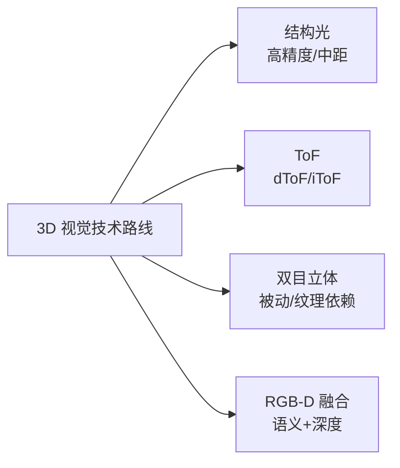
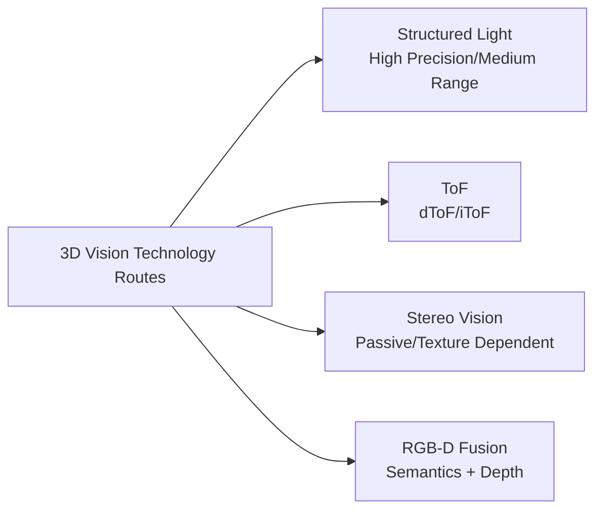
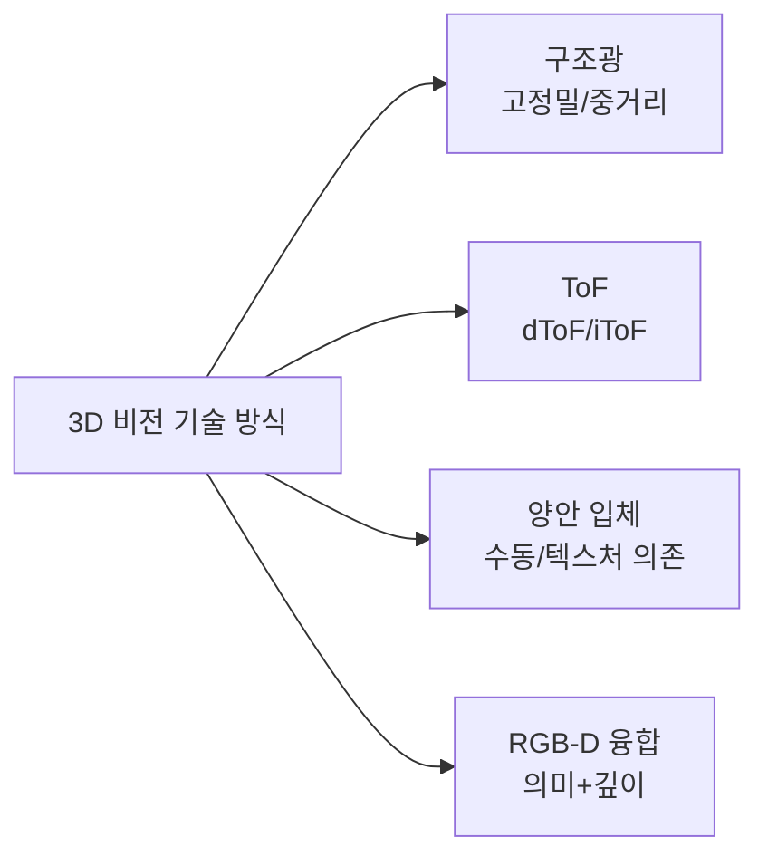

## 概述
RGB-D相机是人形机器人领域的重要零部件。以下内容整理自项目 Wiki，供深入查阅。

## 核心内容
视觉/深度相机是人形机器人外部感知与场景理解的核心入口。当前主流三维深度获取技术包括**结构光（structured light）**、**飞行时间（ToF，含 dToF/iToF）**和**双目立体视觉（stereo vision）**三条路线，分别依赖不同的光学器件、发射器和图像传感器组合。

!!! note "术语解释：结构光、飞行时间（ToF）、dToF、iToF、SPAD、VCSEL、双目立体视觉"
    - **结构光（structured light）**：通过投射已知红外图案并分析其在物体表面的变形来获取深度图像的技术。
    - **飞行时间（ToF, Time-of-Flight）**：测量光脉冲或调制光往返时间来计算距离的三维成像技术。
    - **dToF（direct ToF）**：直接测量单个光脉冲往返时间，常与 SPAD 配合实现远距离、低功耗深度感知。
    - **iToF（indirect ToF）**：通过测量调制光相位差间接计算距离，适合中短距离高分辨率场景。
    - **SPAD（Single-Photon Avalanche Diode）**：单光子雪崩二极管，具有高灵敏度，可用于 dToF 光子计数。
    - **VCSEL（Vertical-Cavity Surface-Emitting Laser）**：垂直腔面发射激光器，常用于结构光和 ToF 的光源。
    - **双目立体视觉（stereo vision）**：利用双相机视差和稠密匹配算法恢复深度的被动视觉方法。

| 公司 | 总部 | 核心技术与产品 | 典型机器人应用 | 供应状态/备注 |
|---|---|---|---|---|
| 灵明光子 | 中国 | SPAD/SiPM dToF 传感器 | 深度相机、避障 | 国产芯片，量产爬坡中[公司官网] |
| 聚芯微电子 | 中国 | iToF 图像传感器、3D 感知方案 | 服务机器人视觉 | 公开资料 |
| 阜时科技 | 中国 | SPAD dToF 芯片、结构光投射 | 机器人/刷脸/车载 | 公开资料 |
| 飞芯电子 | 中国 | dToF 激光雷达/深度传感芯片 | 机器人、扫地机 | 公开资料 |
| 海康机器人 | 中国 | 工业相机、RGB-D、立体相机 | 物流/制造机器人 | 海康威视子公司 |
| 奥比中光 | 中国 | 结构光/ToF 3D 视觉模组 | 服务/人形机器人 | 国产 3D 视觉龙头 |
| 图漾科技 | 中国 | 工业 3D 相机（结构光/ToF） | 物流抓取、检测 | 公开资料 |
| Intel RealSense | 美国 | 立体/结构光/RGB-D 深度相机 | 机器人开发原型 | 产品线调整，需关注 |
| Sony | 日本 | ToF 图像传感器、CMOS | 高端 3D 相机 | 核心器件供应商 |
| 舜宇光学 | 中国 | 光学镜头/模组/ToF 模组 | 手机/机器人视觉 | 光学组件供应稳定 |

## 参考
- Wiki extraction
- 项目 Wiki：chapter-07.md#7.3.3.1 视觉/深度相机模块

## Overview
RGB-D cameras are an important component in the field of humanoid robotics. The following content is compiled from the project Wiki for in-depth reference.

## Content
Vision/depth cameras are the core entry point for external perception and scene understanding in humanoid robots. Currently, mainstream 3D depth acquisition technologies include three routes: **structured light**, **Time-of-Flight (ToF, including dToF/iToF)**, and **stereo vision**, each relying on different combinations of optical components, emitters, and image sensors.

!!! note "Terminology Explanation: Structured Light, Time-of-Flight (ToF), dToF, iToF, SPAD, VCSEL, Stereo Vision"
    - **Structured light**: A technique that obtains depth images by projecting known infrared patterns and analyzing their deformation on object surfaces.
    - **Time-of-Flight (ToF)**: A 3D imaging technique that measures the round-trip time of light pulses or modulated light to calculate distance.
    - **dToF (direct ToF)**: Directly measures the round-trip time of a single light pulse, often used with SPAD for long-range, low-power depth sensing.
    - **iToF (indirect ToF)**: Indirectly calculates distance by measuring the phase difference of modulated light, suitable for medium-to-short range high-resolution scenarios.
    - **SPAD (Single-Photon Avalanche Diode)**: A single-photon avalanche diode with high sensitivity, used for photon counting in dToF.
    - **VCSEL (Vertical-Cavity Surface-Emitting Laser)**: A vertical-cavity surface-emitting laser commonly used as a light source for structured light and ToF.
    - **Stereo vision**: A passive vision method that recovers depth using disparity from dual cameras and dense matching algorithms.

| Company | Headquarters | Core Technology & Products | Typical Robot Applications | Supply Status/Notes |
|---|---|---|---|---|
| Luminar Photonics | China | SPAD/SiPM dToF Sensors | Depth cameras, obstacle avoidance | Domestic chip, mass production ramping up [Company Website] |
| Silergy Semiconductor | China | iToF Image Sensors, 3D Perception Solutions | Service robot vision | Public information |
| Fushitech | China | SPAD dToF Chips, Structured Light Projection | Robots/face recognition/automotive | Public information |
| Feixin Electronics | China | dToF LiDAR/Depth Sensing Chips | Robots, vacuum cleaners | Public information |
| Hikrobot | China | Industrial cameras, RGB-D, stereo cameras | Logistics/manufacturing robots | Subsidiary of Hikvision |
| Orbbec | China | Structured Light/ToF 3D Vision Modules | Service/humanoid robots | Leading domestic 3D vision company |
| Perceptin | China | Industrial 3D cameras (structured light/ToF) | Logistics grasping, inspection | Public information |
| Intel RealSense | USA | Stereo/structured light/RGB-D depth cameras | Robot development prototypes | Product line adjustments, needs monitoring |
| Sony | Japan | ToF Image Sensors, CMOS | High-end 3D cameras | Core component supplier |
| Sunny Optical | China | Optical lenses/modules/ToF modules | Mobile phone/robot vision | Stable optical component supply |

## 개요
RGB-D 카메라는 휴머노이드 로봇 분야의 중요한 부품입니다. 아래 내용은 프로젝트 Wiki에서 정리한 것으로, 심층적인 참고를 위해 제공됩니다.

## 핵심 내용
비전/깊이 카메라는 휴머노이드 로봇의 외부 인식 및 장면 이해를 위한 핵심 진입점입니다. 현재 주류 3차원 깊이 획득 기술로는 **구조광(structured light)**, **비행시간(ToF, dToF/iToF 포함)**, **양안 입체 시각(stereo vision)** 세 가지 방식이 있으며, 각각 다른 광학 부품, 발광기 및 이미지 센서 조합에 의존합니다.

!!! note "용어 설명: 구조광, 비행시간(ToF), dToF, iToF, SPAD, VCSEL, 양안 입체 시각"
    - **구조광(structured light)**: 미리 알려진 적외선 패턴을 투사하고 물체 표면에서의 변형을 분석하여 깊이 이미지를 획득하는 기술.
    - **비행시간(ToF, Time-of-Flight)**: 광 펄스 또는 변조된 빛의 왕복 시간을 측정하여 거리를 계산하는 3차원 이미징 기술.
    - **dToF(direct ToF)**: 단일 광 펄스의 왕복 시간을 직접 측정하며, 주로 SPAD와 결합하여 원거리, 저전력 깊이 인식을 구현.
    - **iToF(indirect ToF)**: 변조된 빛의 위상차를 측정하여 간접적으로 거리를 계산하며, 중단거리 고해상도 장면에 적합.
    - **SPAD(Single-Photon Avalanche Diode)**: 단일 광자 애벌런치 다이오드로 높은 감도를 가지며, dToF 광자 계수에 사용 가능.
    - **VCSEL(Vertical-Cavity Surface-Emitting Laser)**: 수직 공진 표면 발광 레이저로, 구조광 및 ToF의 광원으로 자주 사용됨.
    - **양안 입체 시각(stereo vision)**: 두 카메라의 시차와 조밀 매칭 알고리즘을 이용하여 깊이를 복원하는 수동적 비전 방법.

| 회사 | 본사 | 핵심 기술 및 제품 | 대표 로봇 응용 | 공급 상태/비고 |
|---|---|---|---|---|
| 灵明光子 | 중국 | SPAD/SiPM dToF 센서 | 깊이 카메라, 장애물 회피 | 국산 칩, 양산 확대 중[회사 공식 사이트] |
| 聚芯微电子 | 중국 | iToF 이미지 센서, 3D 인식 솔루션 | 서비스 로봇 비전 | 공개 자료 |
| 阜时科技 | 중국 | SPAD dToF 칩, 구조광 투사 | 로봇/얼굴 인식/차량 | 공개 자료 |
| 飞芯电子 | 중국 | dToF 라이다/깊이 센싱 칩 | 로봇, 청소기 | 공개 자료 |
| 海康机器人 | 중국 | 산업용 카메라, RGB-D, 입체 카메라 | 물류/제조 로봇 | 海康威视 자회사 |
| 奥比中光 | 중국 | 구조광/ToF 3D 비전 모듈 | 서비스/휴머노이드 로봇 | 국산 3D 비전 선두 기업 |
| 图漾科技 | 중국 | 산업용 3D 카메라(구조광/ToF) | 물류 파지, 검사 | 공개 자료 |
| Intel RealSense | 미국 | 입체/구조광/RGB-D 깊이 카메라 | 로봇 개발 프로토타입 | 제품 라인 조정 중, 주의 필요 |
| Sony | 일본 | ToF 이미지 센서, CMOS | 고급 3D 카메라 | 핵심 부품 공급업체 |
| 舜宇光学 | 중국 | 광학 렌즈/모듈/ToF 모듈 | 스마트폰/로봇 비전 | 광학 부품 안정적 공급 |
