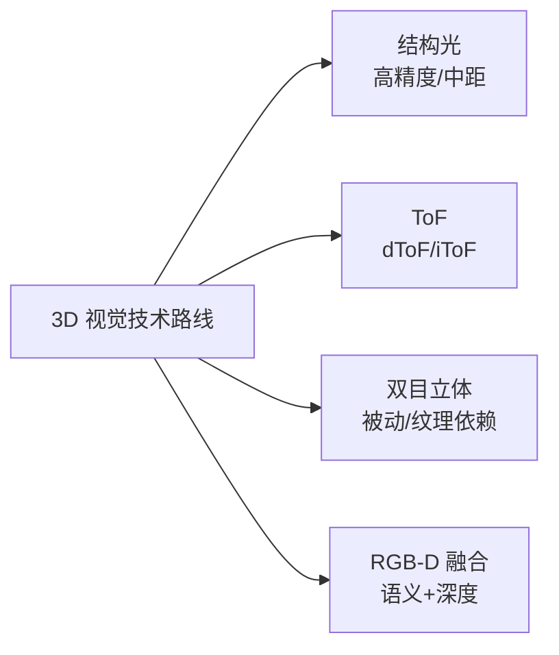

## 概述
RGB-D相机是人形机器人领域的重要component。以下内容整理自项目 Wiki，供深入查阅。

## 核心内容
视觉/深度相机是人形机器人外部感知与场景理解的核心入口。当前主流三维深度获取技术包括**结构光（structured light）**、**飞行时间（ToF，含 dToF/iToF）**和**双目立体视觉（stereo vision）**三条路线，分别依赖不同的光学器件、发射器和图像传感器组合。

!!! note "术语解释：结构光、飞行时间（ToF）、dToF、iToF、SPAD、VCSEL、双目立体视觉"
    - **结构光（structured light）**：通过投射已知红外图案并分析其在物体表面的变形来获取深度图像的技术。
    - **飞行时间（ToF, Time-of-Flight）**：测量光脉冲或调制光往返时间来计算距离的三维成像技术。
    - **dToF（direct ToF）**：直接测量单个光脉冲往返时间，常与 SPAD 配合实现远距离、低功耗深度感知。
    - **iToF（indirect ToF）**：通过测量调制光相位差间接计算距离，适合中短距离高分辨率场景。
    - **SPAD（Single-Photon Avalanche Diode）**：单光子雪崩二极管，具有高灵敏度，可用于 dToF 光子计数。
    - **VCSEL（Vertical-Cavity Surface-Emitting Laser）**：垂直腔面发射激光器，常用于结构光和 ToF 的光源。
    - **双目立体视觉（stereo vision）**：利用双相机视差和稠密匹配算法恢复深度的被动视觉方法。

| 公司 | 总部 | 核心技术与产品 | 典型机器人应用 | 供应状态/备注 |
|---|---|---|---|---|
| 灵明光子 | 中国 | SPAD/SiPM dToF 传感器 | 深度相机、避障 | 国产芯片，量产爬坡中[公司官网] |
| 聚芯微电子 | 中国 | iToF 图像传感器、3D 感知方案 | 服务机器人视觉 | 公开资料 |
| 阜时科技 | 中国 | SPAD dToF 芯片、结构光投射 | 机器人/刷脸/车载 | 公开资料 |
| 飞芯电子 | 中国 | dToF 激光雷达/深度传感芯片 | 机器人、扫地机 | 公开资料 |
| 海康机器人 | 中国 | 工业相机、RGB-D、立体相机 | 物流/制造机器人 | 海康威视子公司 |
| 奥比中光 | 中国 | 结构光/ToF 3D 视觉模组 | 服务/人形机器人 | 国产 3D 视觉龙头 |
| 图漾科技 | 中国 | 工业 3D 相机（结构光/ToF） | 物流抓取、检测 | 公开资料 |
| Intel RealSense | 美国 | 立体/结构光/RGB-D 深度相机 | 机器人开发原型 | 产品线调整，需关注 |
| Sony | 日本 | ToF 图像传感器、CMOS | 高端 3D 相机 | 核心器件供应商 |
| 舜宇光学 | 中国 | 光学镜头/模组/ToF 模组 | 手机/机器人视觉 | 光学组件供应稳定 |

## 参考
- Wiki extraction
- 项目 Wiki：chapter-07.md#7.3.3.1 视觉/深度相机模块

