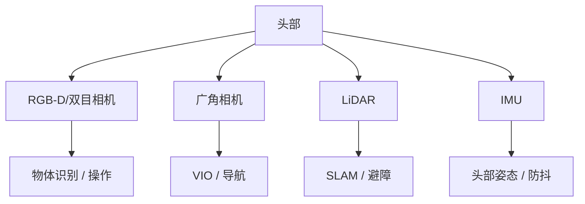

### 5.9.1 头部：RGB-D/双目/LiDAR/IMU 布局

人形机器人头部通常集成视觉和惯性传感器，用于环境感知、导航、交互和头部姿态估计。

!!! note "术语解释：头部感知、RGB-D 相机、宽视场、深度感知、头部姿态"
    - **头部感知（head perception）**：人形机器人头部传感器的配置与感知功能。
    - **RGB-D 相机（RGB-D camera）**：同时输出彩色图像和深度图像的相机。
    - **宽视场（wide field of view）**：相机能覆盖的大角度范围。
    - **深度感知（depth perception）**：获取场景三维距离信息的能力。
    - **头部姿态（head pose）**：头部坐标系相对于身体或世界坐标系的位姿。

典型头部配置包括：

- **RGB-D 或双目相机**：安装于面部或额头，用于物体识别、操作引导和场景理解。
- **广角/鱼眼相机**：用于导航和视觉里程计，覆盖机器人前方和侧方。
- **LiDAR**：部分平台在头部或躯干高处安装小型固态/MEMS LiDAR，用于大范围三维建图。
- **IMU**：安装在头部或颈部，测量头部运动，辅助图像稳定和视觉-惯性融合。

