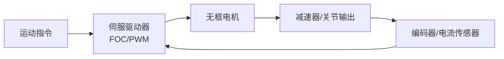

## 概述
伺服驱动器是人形机器人领域的重要component。以下内容整理自项目 Wiki，供深入查阅。

## 核心内容
伺服驱动器把控制器指令转换为电机功率输出，通常采用 FOC 控制，包含电流环、速度环和位置环。关节驱动器对体积、散热、EMI 和电流环带宽要求较高，是国产替代的重点环节。

!!! note "术语解释：伺服驱动器、电流环、速度环、位置环、总线通信"
    - **伺服驱动器（servo drive）**：控制伺服电机电流、速度和位置的功率电子装置。
    - **电流环/速度环/位置环**：伺服控制的三环结构，由内而外响应越来越快。
    - **总线通信**：驱动器与控制器通过 CAN/EtherCAT/RS485 等总线交换数据。

| 供应商 | 总部 | 主要产品 | 典型机器人应用 | 供应状态/备注 |
|---|---|---|---|---|
| Elmo Motion Control | 以色列 | 小型伺服驱动器 | 协作/医疗机器人 | 进口高端 |
| Copley Controls | 美国 | 伺服驱动器 | 精密运动 | 进口 |
| Ingenia Motion Control | 西班牙 | 数字伺服驱动器 | 机器人关节 | 进口 |
| 汇川技术 | 中国深圳 | 伺服驱动器、变频器 | 工业/人形 | 国产龙头 |
| 禾川科技 | 中国浙江 | 伺服驱动器 | 工业/机器人 | 公开资料 |
| 雷赛智能 | 中国深圳 | 伺服/步进驱动 | 工业自动化 | 公开资料 |
| 埃斯顿 | 中国南京 | 伺服驱动、控制器 | 工业机器人 | 公开资料 |
| 鸣志电器 | 中国上海 | 步进/伺服驱动 | 机器人 | 公开资料 |
| 步科股份 | 中国上海 | 低压伺服驱动器 | 移动/协作机器人 | 公开资料 |
| 英威腾 | 中国深圳 | 伺服驱动、变频器 | 工业 | 公开资料 |
| 信捷电气 | 中国无锡 | 伺服/PLC | 工业 | 公开资料 |
| 固高科技 | 中国深圳/香港 | 运动控制器/驱动 | 机器人/机床 | 公开资料 |

## 参考
- [Servo Drive](https://en.wikipedia.org/wiki/Servo_drive)
- 项目 Wiki：chapter-07.md#7.3.7.8 驱动器/伺服驱动器

