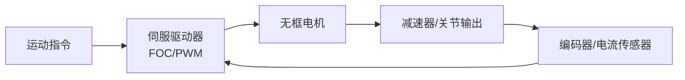

## 概述
伺服驱动器是人形机器人领域的重要零部件。以下内容整理自项目 Wiki，供深入查阅。

## 核心内容
伺服驱动器把控制器指令转换为电机功率输出，通常采用 FOC 控制，包含电流环、速度环和位置环。关节驱动器对体积、散热、EMI 和电流环带宽要求较高，是国产替代的重点环节。

!!! note "术语解释：伺服驱动器、电流环、速度环、位置环、总线通信"
    - **伺服驱动器（servo drive）**：控制伺服电机电流、速度和位置的功率电子装置。
    - **电流环/速度环/位置环**：伺服控制的三环结构，由内而外响应越来越快。
    - **总线通信**：驱动器与控制器通过 CAN/EtherCAT/RS485 等总线交换数据。

| 供应商 | 总部 | 主要产品 | 典型机器人应用 | 供应状态/备注 |
|---|---|---|---|---|
| Elmo Motion Control | 以色列 | 小型伺服驱动器 | 协作/医疗机器人 | 进口高端 |
| Copley Controls | 美国 | 伺服驱动器 | 精密运动 | 进口 |
| Ingenia Motion Control | 西班牙 | 数字伺服驱动器 | 机器人关节 | 进口 |
| 汇川技术 | 中国深圳 | 伺服驱动器、变频器 | 工业/人形 | 国产龙头 |
| 禾川科技 | 中国浙江 | 伺服驱动器 | 工业/机器人 | 公开资料 |
| 雷赛智能 | 中国深圳 | 伺服/步进驱动 | 工业自动化 | 公开资料 |
| 埃斯顿 | 中国南京 | 伺服驱动、控制器 | 工业机器人 | 公开资料 |
| 鸣志电器 | 中国上海 | 步进/伺服驱动 | 机器人 | 公开资料 |
| 步科股份 | 中国上海 | 低压伺服驱动器 | 移动/协作机器人 | 公开资料 |
| 英威腾 | 中国深圳 | 伺服驱动、变频器 | 工业 | 公开资料 |
| 信捷电气 | 中国无锡 | 伺服/PLC | 工业 | 公开资料 |
| 固高科技 | 中国深圳/香港 | 运动控制器/驱动 | 机器人/机床 | 公开资料 |



## 参考
- [Servo Drive](https://en.wikipedia.org/wiki/Servo_drive)
- 项目 Wiki：chapter-07.md#7.3.7.8 驱动器/伺服驱动器

## Overview
Servo drives are critical components in the humanoid robotics sector. The following content is compiled from the project Wiki for in-depth reference.

## Content
Servo drives convert controller commands into motor power output, typically employing FOC control with current, velocity, and position loops. Joint drives demand high performance in size, heat dissipation, EMI, and current loop bandwidth, making them a key focus for domestic substitution.

!!! note "Terminology: Servo Drive, Current Loop, Velocity Loop, Position Loop, Bus Communication"
    - **Servo drive**: A power electronic device that controls the current, velocity, and position of a servo motor.
    - **Current loop / Velocity loop / Position loop**: The three-loop structure of servo control, with response speed increasing from the innermost loop outward.
    - **Bus communication**: Data exchange between the drive and controller via buses such as CAN, EtherCAT, or RS485.

| Supplier | Headquarters | Main Products | Typical Robot Applications | Supply Status / Notes |
|---|---|---|---|---|
| Elmo Motion Control | Israel | Miniature servo drives | Collaborative / medical robots | Imported, high-end |
| Copley Controls | USA | Servo drives | Precision motion | Imported |
| Ingenia Motion Control | Spain | Digital servo drives | Robot joints | Imported |
| Inovance Technology | Shenzhen, China | Servo drives, inverters | Industrial / humanoid | Domestic leader |
| Hechuan Technology | Zhejiang, China | Servo drives | Industrial / robotics | Public information |
| Leadshine Technology | Shenzhen, China | Servo / stepper drives | Industrial automation | Public information |
| Estun Automation | Nanjing, China | Servo drives, controllers | Industrial robots | Public information |
| Moons' Industries | Shanghai, China | Stepper / servo drives | Robotics | Public information |
| Buke Technology | Shanghai, China | Low-voltage servo drives | Mobile / collaborative robots | Public information |
| INVT | Shenzhen, China | Servo drives, inverters | Industrial | Public information |
| Xinje Electric | Wuxi, China | Servo / PLC | Industrial | Public information |
| Googol Technology | Shenzhen / Hong Kong, China | Motion controllers / drives | Robotics / machine tools | Public information |

```mermaid
flowchart LR
    A["Motion command"] --> B["Servo drive<br/>FOC/PWM"]
    B --> C["Frameless motor"]
    C --> D["Reducer / joint output"]
    D --> E["Encoder / current sensor"]
    E --> B

## 개요
서보 드라이브는 휴머노이드 로봇 분야의 핵심 부품입니다. 아래 내용은 프로젝트 Wiki에서 정리한 것으로, 심층 참고용으로 제공됩니다.

## 핵심 내용
서보 드라이브는 컨트롤러 명령을 모터 전력 출력으로 변환하며, 일반적으로 FOC 제어를 사용하며 전류 루프, 속도 루프 및 위치 루프를 포함합니다. 관절 드라이브는 소형화, 방열, EMI 및 전류 루프 대역폭에 대한 요구 사항이 높으며, 국산 대체의 핵심 분야입니다.

!!! note "용어 설명: 서보 드라이브, 전류 루프, 속도 루프, 위치 루프, 버스 통신"
    - **서보 드라이브(servo drive)**: 서보 모터의 전류, 속도 및 위치를 제어하는 전력 전자 장치.
    - **전류 루프/속도 루프/위치 루프**: 서보 제어의 3중 루프 구조로, 내부에서 외부로 갈수록 응답 속도가 빨라집니다.
    - **버스 통신**: 드라이브와 컨트롤러가 CAN/EtherCAT/RS485 등의 버스를 통해 데이터를 교환합니다.

| 공급업체 | 본사 | 주요 제품 | 대표 로봇 응용 분야 | 공급 상태/비고 |
|---|---|---|---|---|
| Elmo Motion Control | 이스라엘 | 소형 서보 드라이브 | 협동/의료 로봇 | 수입 고급 |
| Copley Controls | 미국 | 서보 드라이브 | 정밀 운동 | 수입 |
| Ingenia Motion Control | 스페인 | 디지털 서보 드라이브 | 로봇 관절 | 수입 |
| 汇川技术 | 중국 선전 | 서보 드라이브, 인버터 | 산업/휴머노이드 | 국산 선두 |
| 禾川科技 | 중국 저장 | 서보 드라이브 | 산업/로봇 | 공개 자료 |
| 雷赛智能 | 중국 선전 | 서보/스테핑 드라이브 | 산업 자동화 | 공개 자료 |
| 埃斯顿 | 중국 난징 | 서보 드라이브, 컨트롤러 | 산업용 로봇 | 공개 자료 |
| 鸣志电器 | 중국 상하이 | 스테핑/서보 드라이브 | 로봇 | 공개 자료 |
| 步科股份 | 중국 상하이 | 저전압 서보 드라이브 | 이동/협동 로봇 | 공개 자료 |
| 英威腾 | 중국 선전 | 서보 드라이브, 인버터 | 산업 | 공개 자료 |
| 信捷电气 | 중국 우시 | 서보/PLC | 산업 | 공개 자료 |
| 固高科技 | 중국 선전/홍콩 | 모션 컨트롤러/드라이브 | 로봇/공작 기계 | 공개 자료 |

```mermaid
flowchart LR
    A["운동 명령"] --> B["서보 드라이브<br/>FOC/PWM"]
    B --> C["프레임리스 모터"]
    C --> D["감속기/관절 출력"]
    D --> E["엔코더/전류 센서"]
    E --> B

## 개요
서보 드라이브는 휴머노이드 로봇 분야의 핵심 부품입니다. 아래 내용은 프로젝트 Wiki에서 정리한 것으로, 심층 참고용으로 제공됩니다.

## 핵심 내용
서보 드라이브는 컨트롤러 명령을 모터 전력 출력으로 변환하며, 일반적으로 FOC 제어를 사용하며 전류 루프, 속도 루프 및 위치 루프를 포함합니다. 관절 드라이브는 소형화, 방열, EMI 및 전류 루프 대역폭에 대한 요구사항이 높으며, 국산 대체의 핵심 분야입니다.

!!! note "용어 설명: 서보 드라이브, 전류 루프, 속도 루프, 위치 루프, 버스 통신"
    - **서보 드라이브(servo drive)**: 서보 모터의 전류, 속도 및 위치를 제어하는 전력 전자 장치.
    - **전류 루프/속도 루프/위치 루프**: 서보 제어의 3중 루프 구조로, 내부에서 외부로 갈수록 응답 속도가 빨라집니다.
    - **버스 통신**: 드라이브와 컨트롤러가 CAN/EtherCAT/RS485 등의 버스를 통해 데이터를 교환합니다.

| 공급업체 | 본사 | 주요 제품 | 대표 로봇 응용 분야 | 공급 상태/비고 |
|---|---|---|---|---|
| Elmo Motion Control | 이스라엘 | 소형 서보 드라이브 | 협동/의료 로봇 | 수입 고급 |
| Copley Controls | 미국 | 서보 드라이브 | 정밀 운동 | 수입 |
| Ingenia Motion Control | 스페인 | 디지털 서보 드라이브 | 로봇 관절 | 수입 |
| 汇川技术 | 중국 선전 | 서보 드라이브, 인버터 | 산업/휴머노이드 | 국산 선두 |
| 禾川科技 | 중국 저장성 | 서보 드라이브 | 산업/로봇 | 공개 자료 |
| 雷赛智能 | 중국 선전 | 서보/스테핑 드라이브 | 산업 자동화 | 공개 자료 |
| 埃斯顿 | 중국 난징 | 서보 드라이브, 컨트롤러 | 산업용 로봇 | 공개 자료 |
| 鸣志电器 | 중국 상하이 | 스테핑/서보 드라이브 | 로봇 | 공개 자료 |
| 步科股份 | 중국 상하이 | 저전압 서보 드라이브 | 이동/협동 로봇 | 공개 자료 |
| 英威腾 | 중국 선전 | 서보 드라이브, 인버터 | 산업 | 공개 자료 |
| 信捷电气 | 중국 우시 | 서보/PLC | 산업 | 공개 자료 |
| 固高科技 | 중국 선전/홍콩 | 모션 컨트롤러/드라이브 | 로봇/공작 기계 | 공개 자료 |

```mermaid
flowchart LR
    A["운동 명령"] --> B["서보 드라이브<br/>FOC/PWM"]
    B --> C["프레임리스 모터"]
    C --> D["감속기/관절 출력"]
    D --> E["엔코더/전류 센서"]
    E --> B
