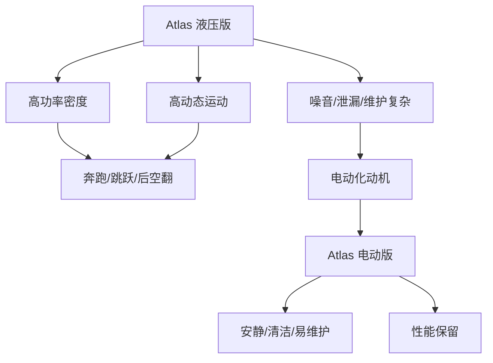

## 概述
波士顿动力 Atlas是人形机器人领域的重要robot_system。以下内容整理自项目 Wiki，供深入查阅。

## 核心内容
Boston Dynamics Atlas 以高动态运动著称。早期版本采用液压驱动，能够奔跑、跳跃、后空翻；2024 年发布的全新 Atlas 转向全电驱动，强调可维护性与商业化前景[35]。

!!! note "术语解释：液压驱动、电动驱动、高动态运动、后空翻、可维护性"
    - **液压驱动（hydraulic actuation）**：利用高压液体传递动力的驱动方式。
    - **电动驱动（electric actuation）**：利用电机与减速器传递动力的驱动方式。
    - **高动态运动（highly dynamic motion）**：快速、大加速度、高冲击的运动。
    - **后空翻（backflip）**：空中向后翻转的动作，展示高功率与控制能力。
    - **可维护性（maintainability）**：系统易于维修和保养的程度。

液压 Atlas 的优势在于高功率密度与抗冲击能力，但存在噪音、油液泄漏、维护复杂等问题。电动 Atlas 通过高扭矩密度电机与先进控制，试图在保持性能的同时降低运行与维护成本。

## 参考
- [Boston Dynamics Atlas](https://bostondynamics.com/atlas)
- 项目 Wiki：chapter-08.md#8.9.2 Boston Dynamics Atlas：液压驱动到电动驱动

