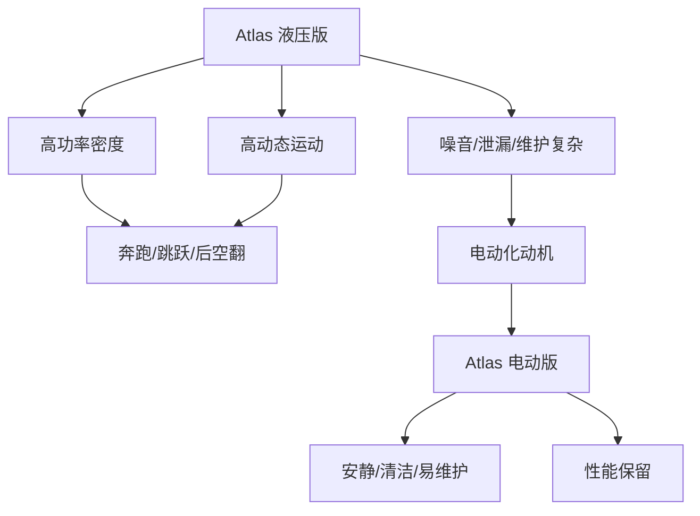

## 概述
波士顿动力 Atlas是人形机器人领域的重要机器人系统。以下内容整理自项目 Wiki，供深入查阅。

## 核心内容
Boston Dynamics Atlas 以高动态运动著称。早期版本采用液压驱动，能够奔跑、跳跃、后空翻；2024 年发布的全新 Atlas 转向全电驱动，强调可维护性与商业化前景[35]。

!!! note "术语解释：液压驱动、电动驱动、高动态运动、后空翻、可维护性"
    - **液压驱动（hydraulic actuation）**：利用高压液体传递动力的驱动方式。
    - **电动驱动（electric actuation）**：利用电机与减速器传递动力的驱动方式。
    - **高动态运动（highly dynamic motion）**：快速、大加速度、高冲击的运动。
    - **后空翻（backflip）**：空中向后翻转的动作，展示高功率与控制能力。
    - **可维护性（maintainability）**：系统易于维修和保养的程度。

液压 Atlas 的优势在于高功率密度与抗冲击能力，但存在噪音、油液泄漏、维护复杂等问题。电动 Atlas 通过高扭矩密度电机与先进控制，试图在保持性能的同时降低运行与维护成本。



## 参考
- [Boston Dynamics Atlas](https://bostondynamics.com/atlas)
- 项目 Wiki：chapter-08.md#8.9.2 Boston Dynamics Atlas：液压驱动到电动驱动

## Overview
Boston Dynamics' Atlas is an important robotic system in the field of humanoid robots. The following content is compiled from the project Wiki for in-depth reference.

## Content
Boston Dynamics Atlas is renowned for its highly dynamic motion. Early versions used hydraulic actuation, enabling running, jumping, and backflips; the new Atlas released in 2024 has shifted to fully electric actuation, emphasizing maintainability and commercial viability[35].

!!! note "Terminology explanation: hydraulic actuation, electric actuation, highly dynamic motion, backflip, maintainability"
    - **Hydraulic actuation**: A drive method that uses high-pressure fluid to transmit power.
    - **Electric actuation**: A drive method that uses motors and reducers to transmit power.
    - **Highly dynamic motion**: Fast, high-acceleration, high-impact movement.
    - **Backflip**: A backward aerial somersault, demonstrating high power and control capability.
    - **Maintainability**: The ease with which a system can be repaired and serviced.

The hydraulic Atlas excels in high power density and impact resistance, but suffers from issues such as noise, oil leakage, and complex maintenance. The electric Atlas, through high-torque-density motors and advanced control, aims to reduce operating and maintenance costs while preserving performance.

```mermaid
flowchart TD
    A["Atlas Hydraulic Version"] --> B["High Power Density"]
    A --> C["Highly Dynamic Motion"]
    A --> D["Noise/Leakage/Complex Maintenance"]
    B --> E["Running/Jumping/Backflip"]
    C --> E
    D --> F["Motivation for Electrification"]
    G["Atlas Electric Version"] --> H["Quiet/Clean/Easy Maintenance"]
    G --> I["Performance Retention"]
    F --> G

## 개요
보스턴 다이내믹스의 Atlas는 휴머노이드 로봇 분야에서 중요한 로봇 시스템입니다. 아래 내용은 프로젝트 Wiki에서 정리한 내용으로, 심층적인 참고를 위해 제공됩니다.

## 핵심 내용
Boston Dynamics Atlas는 고동적 운동으로 유명합니다. 초기 버전은 유압 구동 방식을 채택하여 달리기, 점프, 백플립이 가능했습니다. 2024년에 공개된 새로운 Atlas는 완전 전기 구동 방식으로 전환되며 유지보수성과 상업화 가능성을 강조했습니다[35].

!!! note "용어 설명: 유압 구동, 전기 구동, 고동적 운동, 백플립, 유지보수성"
    - **유압 구동(hydraulic actuation)**: 고압 액체를 이용해 동력을 전달하는 구동 방식.
    - **전기 구동(electric actuation)**: 모터와 감속기를 이용해 동력을 전달하는 구동 방식.
    - **고동적 운동(highly dynamic motion)**: 빠르고 큰 가속도와 높은 충격을 동반하는 운동.
    - **백플립(backflip)**: 공중에서 뒤로 회전하는 동작으로, 높은 출력과 제어 능력을 보여줌.
    - **유지보수성(maintainability)**: 시스템의 수리 및 유지보수 용이성.

유압 Atlas의 장점은 높은 출력 밀도와 충격 저항 능력에 있지만, 소음, 오일 누출, 복잡한 유지보수 등의 문제가 있습니다. 전기 Atlas는 고토크 밀도 모터와 첨단 제어를 통해 성능을 유지하면서도 운영 및 유지보수 비용을 낮추려고 합니다.

```mermaid
flowchart TD
    A["Atlas 유압 버전"] --> B["높은 출력 밀도"]
    A --> C["고동적 운동"]
    A --> D["소음/누출/복잡한 유지보수"]
    B --> E["달리기/점프/백플립"]
    C --> E
    D --> F["전동화 동기"]
    G["Atlas 전기 버전"] --> H["조용함/청결함/유지보수 용이"]
    G --> I["성능 유지"]
    F --> G

## 개요
보스턴 다이내믹스의 Atlas는 휴머노이드 로봇 분야에서 중요한 로봇 시스템입니다. 아래 내용은 프로젝트 Wiki에서 정리한 것으로, 심층적인 참고를 위해 제공됩니다.

## 핵심 내용
Boston Dynamics Atlas는 높은 동적 운동성으로 유명합니다. 초기 버전은 유압 구동 방식을 채택하여 달리기, 점프, 뒤공중돌기가 가능했습니다. 2024년에 공개된 새로운 Atlas는 완전 전기 구동 방식으로 전환되며, 유지보수성과 상업화 가능성을 강조하고 있습니다[35].

!!! note "용어 설명: 유압 구동, 전기 구동, 고동적 운동, 뒤공중돌기, 유지보수성"
    - **유압 구동(hydraulic actuation)**: 고압 액체를 이용해 동력을 전달하는 구동 방식.
    - **전기 구동(electric actuation)**: 모터와 감속기를 이용해 동력을 전달하는 구동 방식.
    - **고동적 운동(highly dynamic motion)**: 빠르고, 큰 가속도와 높은 충격을 수반하는 운동.
    - **뒤공중돌기(backflip)**: 공중에서 뒤로 회전하는 동작으로, 높은 출력과 제어 능력을 보여줌.
    - **유지보수성(maintainability)**: 시스템을 쉽게 수리하고 정비할 수 있는 정도.

유압 Atlas의 장점은 높은 출력 밀도와 충격 저항 능력에 있지만, 소음, 오일 누출, 복잡한 유지보수 등의 문제가 있습니다. 전기 Atlas는 고토크 밀도 모터와 첨단 제어를 통해 성능을 유지하면서도 운영 및 유지보수 비용을 낮추려고 합니다.

```mermaid
flowchart TD
    A["Atlas 유압 버전"] --> B["높은 출력 밀도"]
    A --> C["고동적 운동"]
    A --> D["소음/누출/복잡한 유지보수"]
    B --> E["달리기/점프/뒤공중돌기"]
    C --> E
    D --> F["전동화 동기"]
    G["Atlas 전기 버전"] --> H["조용함/청결함/쉬운 유지보수"]
    G --> I["성능 유지"]
    F --> G
