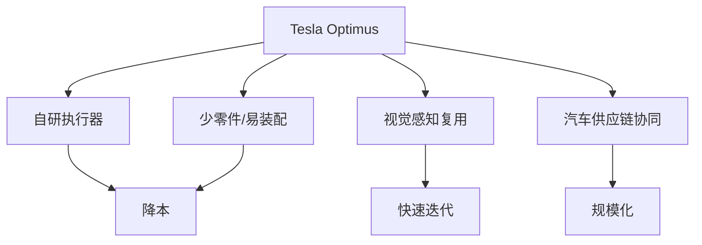

## 概述
Tesla Optimus是人形机器人领域的重要robot_system。以下内容整理自项目 Wiki，供深入查阅。

## 核心内容
Tesla Optimus 的设计目标是在汽车制造等场景中替代或辅助人类劳动，因此强调成本、产量与可维护性[17][18]。

!!! note "术语解释：Optimus、成本导向设计、规模化、制造场景"
    - **Optimus**：Tesla 开发的人形机器人。
    - **成本导向设计（cost-driven design）**：以降低成本为核心目标的设计决策。
    - **规模化（scalability）**：设计支持从小批量到大批量的扩展。
    - **制造场景（manufacturing scenario）**：工厂、仓储等重复性劳动环境。

Optimus 公开设计特点（公开资料）：
- 身高约 173 cm，质量约 63 kg。
- 采用 Tesla 自研执行器与控制器。
- 强调零件数量少、制造工艺简单、易于自动化装配。
- 视觉感知基于 Tesla 自动驾驶技术迁移。
- 目标低成本大规模生产。

## 参考
- [Tesla Optimus Official Page](https://www.tesla.com/optimus)
- [Interact Analysis — Humanoid Robots and Lithium-Ion Batteries](https://interactanalysis.com/insight/humanoid-robots-and-lithium-ion-batteries/)
- 项目 Wiki：chapter-08.md#8.9.3 Tesla Optimus：面向制造的成本导向设计

