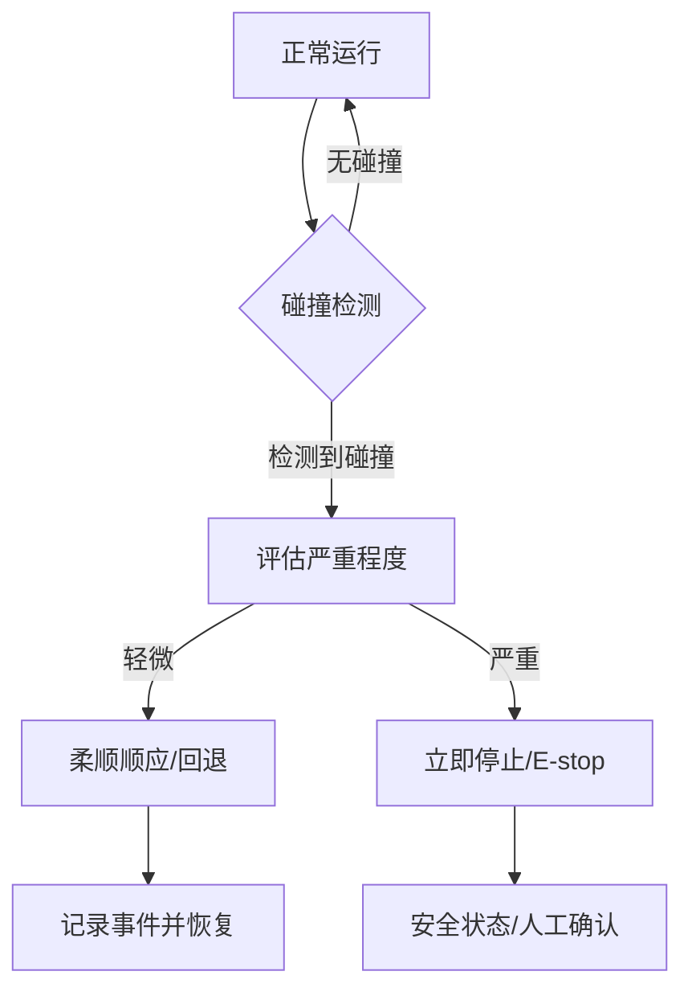
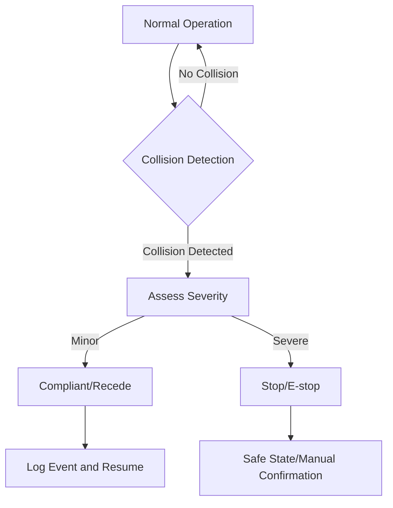
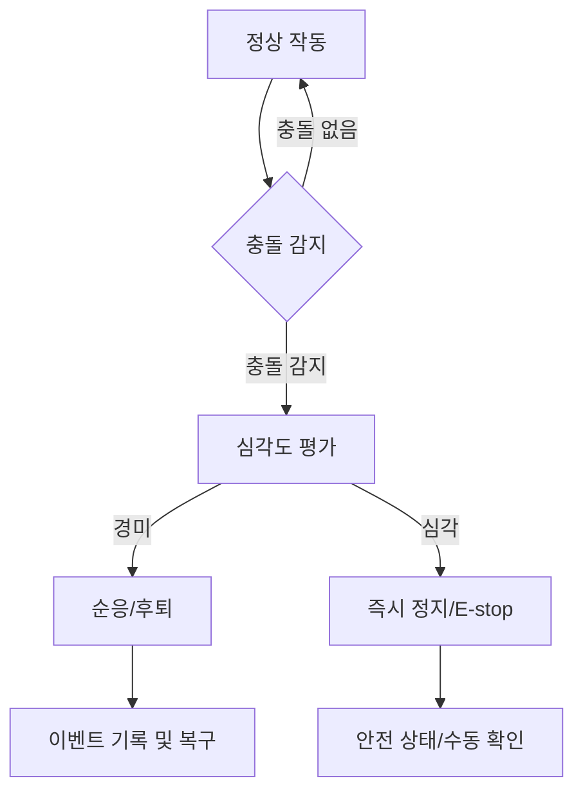

## 概述
脚踝柔顺机构是人形机器人领域的重要零部件。以下内容整理自项目 Wiki，供深入查阅。

## 核心内容
人形机器人在人机共融环境中无法避免与人或物体发生意外接触。**碰撞检测（collision detection）**与**柔顺控制（compliance control）**是降低碰撞伤害的两道防线：前者尽早发现异常接触，后者在接触发生后减小接触力[36][73]。

!!! note "术语解释：碰撞检测、柔顺控制、接触力、外部力矩、安全反应"
    - **碰撞检测（collision detection）**：识别机器人与外部物体发生非预期接触的过程。
    - **柔顺控制（compliance control）**：使机器人在受力时按期望动态响应的控制方法。
    - **接触力（contact force）**：机器人与外界接触时相互作用的力。
    - **外部力矩（external torque）**：由接触力在关节处产生的力矩。
    - **安全反应（safety reaction）**：检测到危险后触发的保护动作。

机器人通常没有在每个表面安装力传感器，因此需要通过**外部扭矩观测器（external torque observer）**间接估计接触。其基本思想是比较电机端测量的关节力矩与由动力学模型预测的名义力矩：

$$
\boldsymbol{\tau}_{\text{ext}} = \boldsymbol{\tau}_{\text{meas}} - \left[ \mathbf{M}(\mathbf{q})\ddot{\mathbf{q}} + \mathbf{C}(\mathbf{q}, \dot{\mathbf{q}})\dot{\mathbf{q}} + \mathbf{g}(\mathbf{q}) \right]
$$

$\boldsymbol{\tau}_{\text{ext}}$ 为各关节处的外部力矩估计。由于模型误差、摩擦、噪声，通常需要滤波和阈值处理。更鲁棒的方法包括基于动量观测器的碰撞检测，它通过比较实际动量与预测动量的偏差来检测碰撞：

$$
\mathbf{r}(t) = \mathbf{K}_I \left[ \mathbf{p}(t) - \int_0^t \left( \boldsymbol{\tau} - \mathbf{g}(\mathbf{q}) + \mathbf{r}(s) \right) ds \right]
$$

其中 $\mathbf{p} = \mathbf{M}(\mathbf{q})\dot{\mathbf{q}}$ 为广义动量，$\mathbf{K}_I$ 为观测器增益。动量观测器对加速度测量噪声不敏感，是人形机器人碰撞检测的常用方法。

!!! note "术语解释：外部扭矩观测器、动量观测器、名义力矩、观测器增益"
    - **外部扭矩观测器（external torque observer）**：估计关节外部力矩的算法。
    - **动量观测器（momentum observer）**：基于广义动量偏差检测碰撞的观测器。
    - **名义力矩（nominal torque）**：由动力学模型预测的关节力矩。
    - **观测器增益（observer gain）**：调节观测器响应速度与噪声抑制能力的参数。

碰撞检测阈值设定是关键。阈值过低会导致误触发，影响正常作业；阈值过高则延迟反应，增加伤害风险。阈值通常根据 ISO/TS 15066 的生物力学限值、机器人速度、工作空间和任务类型确定。例如，对于协作速度低于 1.5 m/s 的手臂，可将碰撞力阈值设为 150 N 左右。

!!! note "术语解释：碰撞阈值、误触发、生物力学限值、协作速度"
    - **碰撞阈值（collision threshold）**：触发安全反应的力/力矩或动量偏差门限。
    - **误触发（false positive）**：非碰撞情况下错误触发安全反应。
    - **生物力学限值（biomechanical limit）**：人体可承受的力、压力或能量上限。
    - **协作速度（collaborative speed）**：人机协作中允许的最大机器人速度。

检测到碰撞后，常见的安全反应策略包括：

1. **立即停止（stop）**：关闭电机力矩或进入位置保持，适用于低速轻接触。
2. **回退（recede）**：沿接触反方向移动，减小接触力，适用于可反向运动的情况。
3. **柔顺顺应（compliant）**：切换到零力/导纳控制模式，让机器人顺应外力自由运动。
4. **紧急停机（emergency stop）**：触发最高级别安全响应，切断动力。

!!! note "术语解释：立即停止、回退、导纳控制、紧急停机"
    - **立即停止（stop）**：机器人迅速减速并停止运动。
    - **回退（recede）**：机器人沿接触力反方向移动以脱离接触。
    - **导纳控制（admittance control）**：根据外力生成期望运动的控制策略。
    - **紧急停机（emergency stop）**：触发安全回路使机器人进入安全状态。

柔顺控制实现方式包括：

- **阻抗控制（impedance control）**：调节机器人表现出的质量-阻尼-弹簧特性，使接触力与位移成期望关系。
- **导纳控制（admittance control）**：根据测得的外力计算期望运动轨迹，适合位置控制的内环。
- **力矩控制（torque control）**：直接控制关节输出力矩，实现低刚度响应。
- **变刚度控制（variable stiffness control）**：根据任务阶段调整关节刚度，兼顾精度与安全。

在人形机器人中，柔顺控制不仅用于人机交互，也用于落地冲击吸收、不平地面顺应和跌倒保护。

!!! note "术语解释：阻抗控制、变刚度控制、落地冲击、跌倒保护"
    - **阻抗控制（impedance control）**：控制机器人端表现出的阻抗（质量-阻尼-刚度）。
    - **变刚度控制（variable stiffness control）**：在线调整关节刚度的控制方法。
    - **落地冲击（landing impact）**：脚触地时的冲击力。
    - **跌倒保护（fall protection）**：在失去平衡时采取措施减小伤害的策略。

## 参考
- Wiki extraction
- 项目 Wiki：chapter-08.md#8.7.6 碰撞检测与柔顺控制

## Overview
The ankle compliance mechanism is a critical component in the field of humanoid robotics. The following content is compiled from the project Wiki for in-depth reference.

## Content
Humanoid robots inevitably encounter accidental contact with humans or objects in human-robot collaborative environments. **Collision detection** and **compliance control** are two lines of defense to reduce collision injuries: the former detects abnormal contact as early as possible, while the latter minimizes contact forces after contact occurs [36][73].

!!! note "Terminology: Collision Detection, Compliance Control, Contact Force, External Torque, Safety Reaction"
    - **Collision detection**: The process of identifying unintended contact between a robot and an external object.
    - **Compliance control**: A control method that enables a robot to respond dynamically as desired when subjected to forces.
    - **Contact force**: The interactive force generated when a robot contacts the external environment.
    - **External torque**: The torque generated at a joint due to contact forces.
    - **Safety reaction**: Protective actions triggered after detecting a hazard.

Robots typically lack force sensors on every surface, so contact is indirectly estimated via an **external torque observer**. The basic idea is to compare the joint torque measured at the motor side with the nominal torque predicted by the dynamic model:

$$
\boldsymbol{\tau}_{\text{ext}} = \boldsymbol{\tau}_{\text{meas}} - \left[ \mathbf{M}(\mathbf{q})\ddot{\mathbf{q}} + \mathbf{C}(\mathbf{q}, \dot{\mathbf{q}})\dot{\mathbf{q}} + \mathbf{g}(\mathbf{q}) \right]
$$

$\boldsymbol{\tau}_{\text{ext}}$ is the estimated external torque at each joint. Due to model errors, friction, and noise, filtering and thresholding are typically required. A more robust method is collision detection based on a momentum observer, which detects collisions by comparing the deviation between actual and predicted momentum:

$$
\mathbf{r}(t) = \mathbf{K}_I \left[ \mathbf{p}(t) - \int_0^t \left( \boldsymbol{\tau} - \mathbf{g}(\mathbf{q}) + \mathbf{r}(s) \right) ds \right]
$$

where $\mathbf{p} = \mathbf{M}(\mathbf{q})\dot{\mathbf{q}}$ is the generalized momentum, and $\mathbf{K}_I$ is the observer gain. The momentum observer is insensitive to acceleration measurement noise and is a common method for collision detection in humanoid robots.

!!! note "Terminology: External Torque Observer, Momentum Observer, Nominal Torque, Observer Gain"
    - **External torque observer**: An algorithm for estimating external joint torques.
    - **Momentum observer**: An observer that detects collisions based on deviations in generalized momentum.
    - **Nominal torque**: The joint torque predicted by the dynamic model.
    - **Observer gain**: A parameter that adjusts the observer's response speed and noise suppression capability.

Setting the collision detection threshold is critical. A threshold that is too low can cause false positives, disrupting normal operations; a threshold that is too high delays the reaction, increasing the risk of injury. Thresholds are typically determined based on biomechanical limits from ISO/TS 15066, robot speed, workspace, and task type. For example, for an arm operating at a collaborative speed below 1.5 m/s, the collision force threshold can be set to approximately 150 N.

!!! note "Terminology: Collision Threshold, False Positive, Biomechanical Limit, Collaborative Speed"
    - **Collision threshold**: The force/torque or momentum deviation limit that triggers a safety reaction.
    - **False positive**: Incorrectly triggering a safety reaction in the absence of a collision.
    - **Biomechanical limit**: The maximum force, pressure, or energy that the human body can withstand.
    - **Collaborative speed**: The maximum allowable robot speed in human-robot collaboration.

After detecting a collision, common safety reaction strategies include:

1. **Stop**: Disable motor torque or enter position hold, suitable for low-speed, light contact.
2. **Recede**: Move in the opposite direction of the contact to reduce contact force, suitable for reversible motion.
3. **Compliant**: Switch to zero-force/admittance control mode, allowing the robot to move freely in response to external forces.
4. **Emergency stop**: Trigger the highest-level safety response, cutting off power.

!!! note "Terminology: Stop, Recede, Admittance Control, Emergency Stop"
    - **Stop**: The robot rapidly decelerates and halts motion.
    - **Recede**: The robot moves in the opposite direction of the contact force to disengage.
    - **Admittance control**: A control strategy that generates desired motion based on external forces.
    - **Emergency stop**: Triggering a safety circuit to place the robot in a safe state.

Implementation methods for compliance control include:

- **Impedance control**: Adjusts the mass-damper-spring characteristics exhibited by the robot, establishing a desired relationship between contact force and displacement.
- **Admittance control**: Calculates the desired motion trajectory based on measured external forces, suitable for position-controlled inner loops.
- **Torque control**: Directly controls joint output torque to achieve low-stiffness response.
- **Variable stiffness control**: Adjusts joint stiffness according to the task phase, balancing precision and safety.

In humanoid robots, compliance control is used not only for human-robot interaction but also for absorbing landing impacts, adapting to uneven terrain, and fall protection.

!!! note "Terminology: Impedance Control, Variable Stiffness Control, Landing Impact, Fall Protection"
    - **Impedance control**: Controls the impedance (mass-damping-stiffness) exhibited at the robot's end-effector.
    - **Variable stiffness control**: A control method that adjusts joint stiffness online.
    - **Landing impact**: The impact force when the foot contacts the ground.
    - **Fall protection**: Strategies to minimize injury when balance is lost.

## 개요
발목 순응 메커니즘은 휴머노이드 로봇 분야의 중요한 부품입니다. 다음 내용은 프로젝트 Wiki에서 정리한 것으로, 심층 참고를 위해 제공됩니다.

## 핵심 내용
휴머노이드 로봇은 인간-로봇 공존 환경에서 사람이나 물체와의 의도치 않은 접촉을 피할 수 없습니다. **충돌 감지(collision detection)**와 **순응 제어(compliance control)**는 충돌 피해를 줄이기 위한 두 가지 방어선입니다. 전자는 이상 접촉을 조기에 발견하고, 후자는 접촉 발생 후 접촉력을 감소시킵니다[36][73].

!!! note "용어 설명: 충돌 감지, 순응 제어, 접촉력, 외부 토크, 안전 반응"
    - **충돌 감지(collision detection)**: 로봇과 외부 물체 간의 의도치 않은 접촉을 식별하는 과정.
    - **순응 제어(compliance control)**: 로봇이 힘을 받을 때 원하는 동적 응답을 따르도록 하는 제어 방법.
    - **접촉력(contact force)**: 로봇이 외부와 접촉할 때 상호 작용하는 힘.
    - **외부 토크(external torque)**: 접촉력이 관절에서 발생시키는 토크.
    - **안전 반응(safety reaction)**: 위험 감지 후 트리거되는 보호 동작.

로봇은 일반적으로 모든 표면에 힘 센서를 장착하지 않으므로, **외부 토크 관측기(external torque observer)**를 통해 접촉을 간접적으로 추정해야 합니다. 기본 아이디어는 모터 측에서 측정된 관절 토크와 동역학 모델이 예측한 명목 토크를 비교하는 것입니다:

$$
\boldsymbol{\tau}_{\text{ext}} = \boldsymbol{\tau}_{\text{meas}} - \left[ \mathbf{M}(\mathbf{q})\ddot{\mathbf{q}} + \mathbf{C}(\mathbf{q}, \dot{\mathbf{q}})\dot{\mathbf{q}} + \mathbf{g}(\mathbf{q}) \right]
$$

$\boldsymbol{\tau}_{\text{ext}}$는 각 관절의 외부 토크 추정치입니다. 모델 오차, 마찰, 노이즈로 인해 일반적으로 필터링과 임계값 처리가 필요합니다. 더 강건한 방법으로는 운동량 관측기 기반 충돌 감지가 있으며, 이는 실제 운동량과 예측 운동량의 편차를 비교하여 충돌을 감지합니다:

$$
\mathbf{r}(t) = \mathbf{K}_I \left[ \mathbf{p}(t) - \int_0^t \left( \boldsymbol{\tau} - \mathbf{g}(\mathbf{q}) + \mathbf{r}(s) \right) ds \right]
$$

여기서 $\mathbf{p} = \mathbf{M}(\mathbf{q})\dot{\mathbf{q}}$는 일반화 운동량, $\mathbf{K}_I$는 관측기 이득입니다. 운동량 관측기는 가속도 측정 노이즈에 민감하지 않아 휴머노이드 로봇의 충돌 감지에 일반적으로 사용됩니다.

!!! note "용어 설명: 외부 토크 관측기, 운동량 관측기, 명목 토크, 관측기 이득"
    - **외부 토크 관측기(external torque observer)**: 관절 외부 토크를 추정하는 알고리즘.
    - **운동량 관측기(momentum observer)**: 일반화 운동량 편차를 기반으로 충돌을 감지하는 관측기.
    - **명목 토크(nominal torque)**: 동역학 모델이 예측한 관절 토크.
    - **관측기 이득(observer gain)**: 관측기의 응답 속도와 노이즈 억제 능력을 조절하는 매개변수.

충돌 감지 임계값 설정은 핵심입니다. 임계값이 너무 낮으면 오작동(false positive)이 발생하여 정상 작업에 지장을 주고, 너무 높으면 반응이 지연되어 부상 위험이 증가합니다. 임계값은 일반적으로 ISO/TS 15066의 생체역학 한계, 로봇 속도, 작업 공간 및 작업 유형에 따라 결정됩니다. 예를 들어, 협동 속도가 1.5 m/s 미만인 팔의 경우 충돌 힘 임계값을 약 150 N으로 설정할 수 있습니다.

!!! note "용어 설명: 충돌 임계값, 오작동, 생체역학 한계, 협동 속도"
    - **충돌 임계값(collision threshold)**: 안전 반응을 트리거하는 힘/토크 또는 운동량 편차 문턱값.
    - **오작동(false positive)**: 충돌이 아닌 상황에서 안전 반응이 잘못 트리거되는 현상.
    - **생체역학 한계(biomechanical limit)**: 인체가 견딜 수 있는 힘, 압력 또는 에너지의 상한.
    - **협동 속도(collaborative speed)**: 인간-로봇 협동에서 허용되는 최대 로봇 속도.

충돌 감지 후 일반적인 안전 반응 전략은 다음과 같습니다:

1. **즉시 정지(stop)**: 모터 토크를 차단하거나 위치 유지 모드로 전환, 저속 경접촉에 적합.
2. **후퇴(recede)**: 접촉 반대 방향으로 이동하여 접촉력을 감소, 역방향 이동이 가능한 경우에 적합.
3. **순응(compliant)**: 제로 포스/어드미턴스 제어 모드로 전환하여 로봇이 외력에 따라 자유롭게 움직이도록 함.
4. **비상 정지(emergency stop)**: 최고 수준의 안전 응답을 트리거하여 동력을 차단.

!!! note "용어 설명: 즉시 정지, 후퇴, 어드미턴스 제어, 비상 정지"
    - **즉시 정지(stop)**: 로봇이 빠르게 감속하고 움직임을 멈춤.
    - **후퇴(recede)**: 로봇이 접촉력 반대 방향으로 이동하여 접촉을 해제.
    - **어드미턴스 제어(admittance control)**: 외력에 따라 원하는 움직임을 생성하는 제어 전략.
    - **비상 정지(emergency stop)**: 안전 회로를 트리거하여 로봇을 안전 상태로 전환.

순응 제어 구현 방식은 다음과 같습니다:

- **임피던스 제어(impedance control)**: 로봇이 나타내는 질량-댐퍼-스프링 특성을 조절하여 접촉력과 변위가 원하는 관계를 갖도록 함.
- **어드미턴스 제어(admittance control)**: 측정된 외력에 따라 원하는 운동 궤적을 계산, 위치 제어 내부 루프에 적합.
- **토크 제어(torque control)**: 관절 출력 토크를 직접 제어하여 낮은 강성 응답을 구현.
- **가변 강성 제어(variable stiffness control)**: 작업 단계에 따라 관절 강성을 조정하여 정밀도와 안전성을 균형.

휴머노이드 로봇에서 순응 제어는 인간-로봇 상호작용뿐만 아니라 착지 충격 흡수, 불균일 지면 적응 및 낙상 보호에도 사용됩니다.

!!! note "용어 설명: 임피던스 제어, 가변 강성 제어, 착지 충격, 낙상 보호"
    - **임피던스 제어(impedance control)**: 로봇 끝단이 나타내는 임피던스(질량-댐퍼-강성)를 제어.
    - **가변 강성 제어(variable stiffness control)**: 온라인으로 관절 강성을 조정하는 제어 방법.
    - **착지 충격(landing impact)**: 발이 지면에 닿을 때의 충격력.
    - **낙상 보호(fall protection)**: 균형을 잃었을 때 피해를 줄이기 위한 조치 전략.
