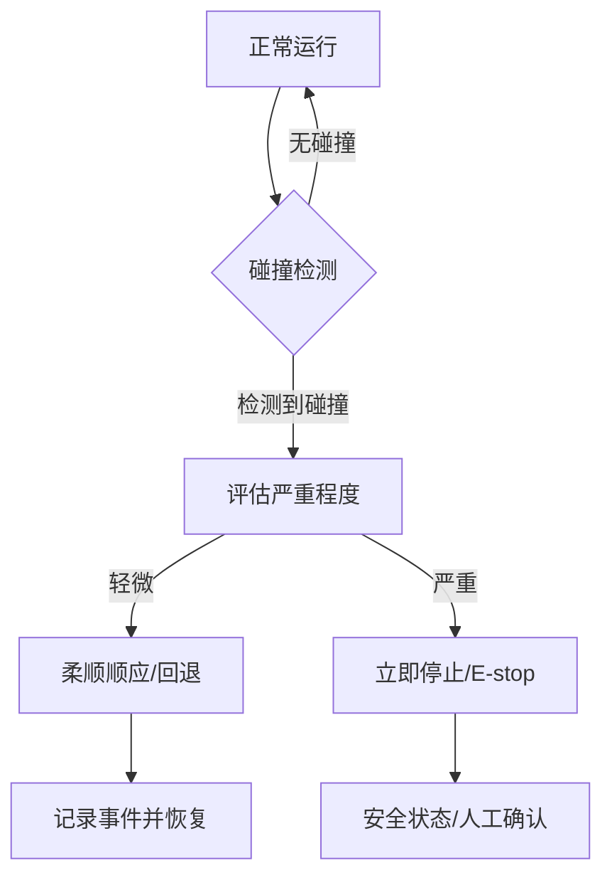

## 概述
脚踝柔顺机构是人形机器人领域的重要零部件。以下内容整理自项目 Wiki，供深入查阅。

## 核心内容
人形机器人在人机共融环境中无法避免与人或物体发生意外接触。**碰撞检测（collision detection）**与**柔顺控制（compliance control）**是降低碰撞伤害的两道防线：前者尽早发现异常接触，后者在接触发生后减小接触力[36][73]。

!!! note "术语解释：碰撞检测、柔顺控制、接触力、外部力矩、安全反应"
    - **碰撞检测（collision detection）**：识别机器人与外部物体发生非预期接触的过程。
    - **柔顺控制（compliance control）**：使机器人在受力时按期望动态响应的控制方法。
    - **接触力（contact force）**：机器人与外界接触时相互作用的力。
    - **外部力矩（external torque）**：由接触力在关节处产生的力矩。
    - **安全反应（safety reaction）**：检测到危险后触发的保护动作。

机器人通常没有在每个表面安装力传感器，因此需要通过**外部扭矩观测器（external torque observer）**间接估计接触。其基本思想是比较电机端测量的关节力矩与由动力学模型预测的名义力矩：

$$
\boldsymbol{\tau}_{\text{ext}} = \boldsymbol{\tau}_{\text{meas}} - \left[ \mathbf{M}(\mathbf{q})\ddot{\mathbf{q}} + \mathbf{C}(\mathbf{q}, \dot{\mathbf{q}})\dot{\mathbf{q}} + \mathbf{g}(\mathbf{q}) \right]
$$

$\boldsymbol{\tau}_{\text{ext}}$ 为各关节处的外部力矩估计。由于模型误差、摩擦、噪声，通常需要滤波和阈值处理。更鲁棒的方法包括基于动量观测器的碰撞检测，它通过比较实际动量与预测动量的偏差来检测碰撞：

$$
\mathbf{r}(t) = \mathbf{K}_I \left[ \mathbf{p}(t) - \int_0^t \left( \boldsymbol{\tau} - \mathbf{g}(\mathbf{q}) + \mathbf{r}(s) \right) ds \right]
$$

其中 $\mathbf{p} = \mathbf{M}(\mathbf{q})\dot{\mathbf{q}}$ 为广义动量，$\mathbf{K}_I$ 为观测器增益。动量观测器对加速度测量噪声不敏感，是人形机器人碰撞检测的常用方法。

!!! note "术语解释：外部扭矩观测器、动量观测器、名义力矩、观测器增益"
    - **外部扭矩观测器（external torque observer）**：估计关节外部力矩的算法。
    - **动量观测器（momentum observer）**：基于广义动量偏差检测碰撞的观测器。
    - **名义力矩（nominal torque）**：由动力学模型预测的关节力矩。
    - **观测器增益（observer gain）**：调节观测器响应速度与噪声抑制能力的参数。

碰撞检测阈值设定是关键。阈值过低会导致误触发，影响正常作业；阈值过高则延迟反应，增加伤害风险。阈值通常根据 ISO/TS 15066 的生物力学限值、机器人速度、工作空间和任务类型确定。例如，对于协作速度低于 1.5 m/s 的手臂，可将碰撞力阈值设为 150 N 左右。

!!! note "术语解释：碰撞阈值、误触发、生物力学限值、协作速度"
    - **碰撞阈值（collision threshold）**：触发安全反应的力/力矩或动量偏差门限。
    - **误触发（false positive）**：非碰撞情况下错误触发安全反应。
    - **生物力学限值（biomechanical limit）**：人体可承受的力、压力或能量上限。
    - **协作速度（collaborative speed）**：人机协作中允许的最大机器人速度。

检测到碰撞后，常见的安全反应策略包括：

1. **立即停止（stop）**：关闭电机力矩或进入位置保持，适用于低速轻接触。
2. **回退（recede）**：沿接触反方向移动，减小接触力，适用于可反向运动的情况。
3. **柔顺顺应（compliant）**：切换到零力/导纳控制模式，让机器人顺应外力自由运动。
4. **紧急停机（emergency stop）**：触发最高级别安全响应，切断动力。

!!! note "术语解释：立即停止、回退、导纳控制、紧急停机"
    - **立即停止（stop）**：机器人迅速减速并停止运动。
    - **回退（recede）**：机器人沿接触力反方向移动以脱离接触。
    - **导纳控制（admittance control）**：根据外力生成期望运动的控制策略。
    - **紧急停机（emergency stop）**：触发安全回路使机器人进入安全状态。

柔顺控制实现方式包括：

- **阻抗控制（impedance control）**：调节机器人表现出的质量-阻尼-弹簧特性，使接触力与位移成期望关系。
- **导纳控制（admittance control）**：根据测得的外力计算期望运动轨迹，适合位置控制的内环。
- **力矩控制（torque control）**：直接控制关节输出力矩，实现低刚度响应。
- **变刚度控制（variable stiffness control）**：根据任务阶段调整关节刚度，兼顾精度与安全。

在人形机器人中，柔顺控制不仅用于人机交互，也用于落地冲击吸收、不平地面顺应和跌倒保护。

!!! note "术语解释：阻抗控制、变刚度控制、落地冲击、跌倒保护"
    - **阻抗控制（impedance control）**：控制机器人端表现出的阻抗（质量-阻尼-刚度）。
    - **变刚度控制（variable stiffness control）**：在线调整关节刚度的控制方法。
    - **落地冲击（landing impact）**：脚触地时的冲击力。
    - **跌倒保护（fall protection）**：在失去平衡时采取措施减小伤害的策略。

## 参考
- Wiki extraction
- 项目 Wiki：chapter-08.md#8.7.6 碰撞检测与柔顺控制

