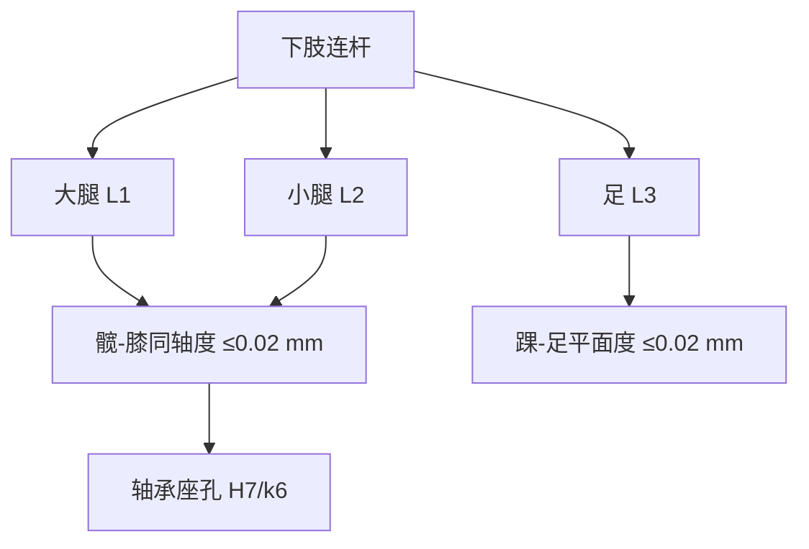
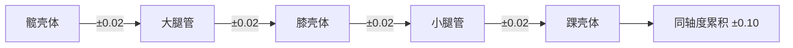
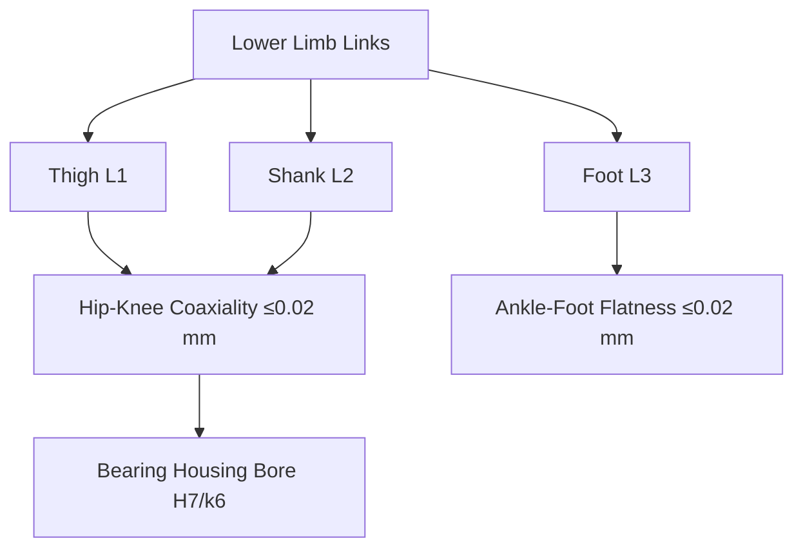

## 概述
腿部机构是人形机器人领域的重要零部件。以下内容整理自项目 Wiki，供深入查阅。

## 核心内容
下肢连杆长度、关节轴线偏移与配合公差直接决定运动学精度、装配可行性与动态性能。

!!! note "术语解释：连杆长度、关节轴线偏移、轴承座孔公差、同轴度、H7/g6、形位公差"
    - **连杆长度（link length）**：相邻关节轴线之间的垂直距离。
    - **关节轴线偏移（joint axis offset）**：实际旋转轴线与名义轴线之间的位置偏差。
    - **轴承座孔公差（bearing housing tolerance）**：安装轴承的孔的直径允许变动范围。
    - **同轴度（coaxiality）**：两轴或孔轴线重合程度的形位公差。
    - **H7/g6**：孔 H7、轴 g6 的配合代号，表示间隙配合。
    - **形位公差（geometric dimensioning and tolerancing, GD&T）**：控制零件几何特征相对理想形状、方向、位置和跳动允许的变动量。

**典型连杆长度范围**：以身高 1.6–1.8 m 的人形机器人为例：

| 尺寸 | 范围 | 说明 |
|---|---|---|
| 大腿长 \(l_{\text{thigh}}\) | 0.38–0.45 m | 髋-膝轴线距离 |
| 小腿长 \(l_{\text{shank}}\) | 0.38–0.45 m | 膝-踝轴线距离 |
| 足长 | 0.22–0.28 m | 足跟-足尖 |
| 足宽 | 0.08–0.12 m | 影响侧倾稳定 |
| 髋间距 | 0.16–0.22 m | 双髋关节轴线距离 |

**关节轴线偏移**：髋、膝、踝三轴在矢状面的共面度误差应控制在 \(\pm 0.3\,\text{mm}\) 以内，否则步态中会出现侧向摆动力矩。髋 yaw 轴与 pitch/roll 轴正交度建议 \(\le 0.05°\)。

**轴承座孔公差**：滚动轴承外圈与座孔常用 H7/k6（过渡配合）或 H7/g6（间隙配合便于装配）。关节输出轴与轴承内圈常用 k6/m6（轻微过盈）。轴承座孔圆柱度要求 \(\le 0.01\,\text{mm}\)，同轴度相对装配基准 \(\le 0.02\,\text{mm}\)。

**配合示例**：铝合金壳体中安装深沟球轴承 6206，外圈直径 \(D=62\,\text{mm}\)：座孔选 H7（\(+0.030/0\)），外圈配合后为轻微间隙或过渡；轴颈选 k6（\(+0.021/+0.002\)）以保证内圈随轴转动。




**GD&T 在下肢的应用示例**：以膝关节输出法兰为例：

| 特征 | 公差 | 基准 | 功能 |
|---|---|---|---|
| 法兰端面平面度 | \(0.02\,\text{mm}\) | — | 与小腿端面贴合 |
| 端面对轴颈垂直度 | \(0.03\,\text{mm}\) | A | 保证小腿轴线正交 |
| 轴颈圆柱度 | \(0.01\,\text{mm}\) | A | 轴承配合精度 |
| 螺栓孔位置度 | \(\phi 0.1\,\text{mm}\) | A|B|C | 装配通过性 |

**公差链示例**：从髋关节到踝关节的同轴度公差链包括：髋壳体轴承座同轴度、大腿管两端法兰同轴度、膝壳体同轴度、小腿管同轴度、踝壳体同轴度。若每项控制在 \(\pm 0.02\,\text{mm}\)，则 worst-case 累积为 \(\pm 0.10\,\text{mm}\)，需通过选配或调整垫片补偿。



## 参考
- Wiki extraction
- 项目 Wiki：chapter-09.md#9.2.13 下肢关键尺寸与公差

## Overview
Leg mechanisms are critical components in the field of humanoid robotics. The following content is compiled from the project Wiki for in-depth reference.

## Content
The length of lower limb links, joint axis offsets, and fit tolerances directly determine kinematic accuracy, assembly feasibility, and dynamic performance.

!!! note "Terminology: Link Length, Joint Axis Offset, Bearing Housing Tolerance, Coaxiality, H7/g6, GD&T"
    - **Link length**: The perpendicular distance between adjacent joint axes.
    - **Joint axis offset**: The positional deviation between the actual rotation axis and the nominal axis.
    - **Bearing housing tolerance**: The allowable variation range for the diameter of the hole where the bearing is installed.
    - **Coaxiality**: A geometric tolerance that controls the degree of alignment between the axes of two shafts or holes.
    - **H7/g6**: Fit designation for a hole of H7 and a shaft of g6, indicating a clearance fit.
    - **Geometric dimensioning and tolerancing (GD&T)**: Controls the allowable variation of a part's geometric features relative to its ideal shape, orientation, position, and runout.

**Typical Link Length Ranges**: For a humanoid robot with a height of 1.6–1.8 m:

| Dimension | Range | Description |
|---|---|---|
| Thigh length \(l_{\text{thigh}}\) | 0.38–0.45 m | Hip-knee axis distance |
| Shank length \(l_{\text{shank}}\) | 0.38–0.45 m | Knee-ankle axis distance |
| Foot length | 0.22–0.28 m | Heel-toe distance |
| Foot width | 0.08–0.12 m | Affects roll stability |
| Hip width | 0.16–0.22 m | Distance between hip joint axes |

**Joint Axis Offset**: The coplanarity error of the hip, knee, and ankle axes in the sagittal plane should be controlled within \(\pm 0.3\,\text{mm}\); otherwise, lateral sway torque will occur during gait. The orthogonality between the hip yaw axis and the pitch/roll axes is recommended to be \(\le 0.05°\).

**Bearing Housing Tolerance**: For rolling bearings, the outer ring and housing bore commonly use H7/k6 (transition fit) or H7/g6 (clearance fit for easier assembly). The joint output shaft and bearing inner ring commonly use k6/m6 (slight interference). The cylindricity of the bearing housing bore is required to be \(\le 0.01\,\text{mm}\), and the coaxiality relative to the assembly datum is \(\le 0.02\,\text{mm}\).

**Fit Example**: For a deep groove ball bearing 6206 installed in an aluminum alloy housing, with an outer ring diameter \(D=62\,\text{mm}\): the housing bore is selected as H7 (\(+0.030/0\)), resulting in a slight clearance or transition fit with the outer ring; the shaft journal is selected as k6 (\(+0.021/+0.002\)) to ensure the inner ring rotates with the shaft.



**GD&T Application Example in Lower Limb**: Taking the knee joint output flange as an example:

| Feature | Tolerance | Datum | Function |
|---|---|---|---|
| Flange end face flatness | \(0.02\,\text{mm}\) | — | Mating with shank end face |
| End face perpendicularity to journal | \(0.03\,\text{mm}\) | A | Ensures shank axis orthogonality |
| Journal cylindricity | \(0.01\,\text{mm}\) | A | Bearing fit precision |
| Bolt hole position | \(\phi 0.1\,\text{mm}\) | A|B|C | Assembly clearance |

**Tolerance Chain Example**: The coaxiality tolerance chain from the hip joint to the ankle joint includes: hip housing bearing bore coaxiality, coaxiality of both flanges of the thigh tube, knee housing coaxiality, shank tube coaxiality, and ankle housing coaxiality. If each item is controlled to \(\pm 0.02\,\text{mm}\), the worst-case accumulation is \(\pm 0.10\,\text{mm}\), which requires compensation through selective assembly or adjustment shims.

```mermaid
flowchart LR
    A["Hip Housing"] -->|"±0.02"| B["Thigh Tube"]
    B -->|"±0.02"| C["Knee Housing"]
    C -->|"±0.02"| D["Shank Tube"]
    D -->|"±0.02"| E["Ankle Housing"]
    E --> F["Coaxiality Accumulation ±0.10"]

## 개요
다리 기구는 휴머노이드 로봇 분야의 중요한 부품입니다. 아래 내용은 프로젝트 Wiki에서 정리한 것으로, 심층적인 참고를 위해 제공됩니다.

## 핵심 내용
하체 링크 길이, 관절 축 오프셋 및 조립 공차는 운동학 정밀도, 조립 가능성 및 동적 성능을 직접적으로 결정합니다.

!!! note "용어 설명: 링크 길이, 관절 축 오프셋, 베어링 하우징 공차, 동축도, H7/g6, 형상 공차"
    - **링크 길이(link length)**: 인접한 관절 축 사이의 수직 거리.
    - **관절 축 오프셋(joint axis offset)**: 실제 회전 축과 공칭 축 사이의 위치 편차.
    - **베어링 하우징 공차(bearing housing tolerance)**: 베어링을 설치하는 구멍의 직경 허용 변동 범위.
    - **동축도(coaxiality)**: 두 축 또는 구멍의 축이 일치하는 정도를 나타내는 형상 공차.
    - **H7/g6**: 구멍 H7, 축 g6의 끼워맞춤 기호로, 헐거운 끼워맞춤을 나타냄.
    - **형상 공차(geometric dimensioning and tolerancing, GD&T)**: 부품의 기하학적 특징이 이상적인 형상, 방향, 위치 및 흔들림에 대해 허용되는 변동량을 제어하는 것.

**일반적인 링크 길이 범위**: 키 1.6–1.8 m의 휴머노이드 로봇을 예로 들면:

| 치수 | 범위 | 설명 |
|---|---|---|
| 대퇴 길이 \(l_{\text{thigh}}\) | 0.38–0.45 m | 고관절-무릎 축 거리 |
| 하퇴 길이 \(l_{\text{shank}}\) | 0.38–0.45 m | 무릎-발목 축 거리 |
| 발 길이 | 0.22–0.28 m | 발뒤꿈치-발끝 |
| 발 너비 | 0.08–0.12 m | 측면 기울기 안정성에 영향 |
| 고관절 간격 | 0.16–0.22 m | 양쪽 고관절 축 거리 |

**관절 축 오프셋**: 고관절, 무릎, 발목의 세 축이 시상면에서 동일 평면에 있어야 하는 오차는 \(\pm 0.3\,\text{mm}\) 이내로 제어해야 하며, 그렇지 않으면 보행 중 측면 흔들림 모멘트가 발생합니다. 고관절 yaw 축과 pitch/roll 축의 직각도는 \(\le 0.05°\)를 권장합니다.

**베어링 하우징 공차**: 구름 베어링의 외륜과 하우징 구멍에는 일반적으로 H7/k6(중간 끼워맞춤) 또는 H7/g6(조립이 용이한 헐거운 끼워맞춤)이 사용됩니다. 관절 출력 축과 베어링 내륜에는 일반적으로 k6/m6(약간의 억지 끼워맞춤)이 사용됩니다. 베어링 하우징 구멍의 원통도는 \(\le 0.01\,\text{mm}\), 조립 기준에 대한 동축도는 \(\le 0.02\,\text{mm}\)를 요구합니다.

**끼워맞춤 예시**: 알루미늄 합금 하우징에 깊은 홈 볼 베어링 6206 설치 시, 외륜 직경 \(D=62\,\text{mm}\): 하우징 구멍은 H7(\(+0.030/0\))을 선택하여 외륜과의 끼워맞춤이 약간의 헐거움 또는 중간 상태가 되도록 함; 축 저널은 k6(\(+0.021/+0.002\))를 선택하여 내륜이 축과 함께 회전하도록 보장.

```mermaid
flowchart TD
    A["하체 링크"] --> B["대퇴 L1"]
    A --> C["하퇴 L2"]
    A --> D["발 L3"]
    B --> E["고관절-무릎 동축도 ≤0.02 mm"]
    C --> E
    D --> F["발목-발 평면도 ≤0.02 mm"]
    E --> G["베어링 하우징 구멍 H7/k6"]
```

**GD&T의 하체 적용 예시**: 무릎 관절 출력 플랜지를 예로 들면:

| 특징 | 공차 | 기준 | 기능 |
|---|---|---|---|
| 플랜지 끝면 평면도 | \(0.02\,\text{mm}\) | — | 하퇴 끝면과의 밀착 |
| 끝면의 저널에 대한 직각도 | \(0.03\,\text{mm}\) | A | 하퇴 축의 직각도 보장 |
| 저널 원통도 | \(0.01\,\text{mm}\) | A | 베어링 끼워맞춤 정밀도 |
| 볼트 구멍 위치도 | \(\phi 0.1\,\text{mm}\) | A|B|C | 조립 통과성 |

**공차 체인 예시**: 고관절에서 발목 관절까지의 동축도 공차 체인은 다음을 포함: 고관절 하우징 베어링 시트 동축도, 대퇴관 양단 플랜지 동축도, 무릎 하우징 동축도, 하퇴관 동축도, 발목 하우징 동축도. 각 항목을 \(\pm 0.02\,\text{mm}\)로 제어하면 최악의 경우 누적은 \(\pm 0.10\,\text{mm}\)가 되며, 선별 조립 또는 조정 심(shim)을 통해 보상해야 합니다.

```mermaid
flowchart LR
    A["고관절 하우징"] -->|"±0.02"| B["대퇴관"]
    B -->|"±0.02"| C["무릎 하우징"]
    C -->|"±0.02"| D["하퇴관"]
    D -->|"±0.02"| E["발목 하우징"]
    E --> F["동축도 누적 ±0.10"]

## 개요
다리 기구는 휴머노이드 로봇 분야의 중요한 부품입니다. 아래 내용은 프로젝트 Wiki에서 정리한 것으로, 심층 참고용입니다.

## 핵심 내용
하체 링크 길이, 관절 축선 오프셋 및 조립 공차는 운동학적 정밀도, 조립 가능성 및 동적 성능을 직접 결정합니다.

!!! note "용어 설명: 링크 길이, 관절 축선 오프셋, 베어링 시트 구멍 공차, 동축도, H7/g6, 형상 공차"
    - **링크 길이(link length)**: 인접한 관절 축선 사이의 수직 거리.
    - **관절 축선 오프셋(joint axis offset)**: 실제 회전 축선과 명목 축선 사이의 위치 편차.
    - **베어링 시트 구멍 공차(bearing housing tolerance)**: 베어링을 설치하는 구멍의 직경 허용 변동 범위.
    - **동축도(coaxiality)**: 두 축 또는 구멍의 축선이 일치하는 정도를 나타내는 형상 공차.
    - **H7/g6**: 구멍 H7, 축 g6의 끼워맞춤 기호로, 헐거운 끼워맞춤을 나타냄.
    - **형상 공차(geometric dimensioning and tolerancing, GD&T)**: 부품의 기하학적 특징이 이상적인 형상, 방향, 위치 및 흔들림에 대해 허용되는 변동량을 제어함.

**일반적인 링크 길이 범위**: 키 1.6–1.8 m의 휴머노이드 로봇을 예로 들면:

| 치수 | 범위 | 설명 |
|---|---|---|
| 대퇴 길이 \(l_{\text{thigh}}\) | 0.38–0.45 m | 고관절-무릎 축선 거리 |
| 하퇴 길이 \(l_{\text{shank}}\) | 0.38–0.45 m | 무릎-발목 축선 거리 |
| 발 길이 | 0.22–0.28 m | 발뒤꿈치-발끝 |
| 발 너비 | 0.08–0.12 m | 측면 기울기 안정성에 영향 |
| 고관절 간격 | 0.16–0.22 m | 양쪽 고관절 축선 거리 |

**관절 축선 오프셋**: 고관절, 무릎, 발목의 세 축이 시상면에서 동일 평면에 있어야 하는 오차는 \(\pm 0.3\,\text{mm}\) 이내로 제어해야 하며, 그렇지 않으면 보행 중 측면 흔들림 모멘트가 발생합니다. 고관절 yaw 축과 pitch/roll 축의 직각도는 \(\le 0.05°\)를 권장합니다.

**베어링 시트 구멍 공차**: 구름 베어링의 외륜과 시트 구멍은 일반적으로 H7/k6(과도 끼워맞춤) 또는 H7/g6(조립이 용이한 헐거운 끼워맞춤)을 사용합니다. 관절 출력축과 베어링 내륜은 일반적으로 k6/m6(약간의 억지 끼워맞춤)을 사용합니다. 베어링 시트 구멍의 원통도는 \(\le 0.01\,\text{mm}\), 조립 기준에 대한 동축도는 \(\le 0.02\,\text{mm}\)를 요구합니다.

**끼워맞춤 예시**: 알루미늄 합금 하우징에 깊은 홈 볼 베어링 6206을 설치할 때, 외륜 직경 \(D=62\,\text{mm}\): 시트 구멍은 H7(\(+0.030/0\))을 선택하여 외륜 끼워맞춤 후 약간의 헐거움 또는 과도 상태가 되도록 함; 축 저널은 k6(\(+0.021/+0.002\))를 선택하여 내륜이 축과 함께 회전하도록 보장.

```mermaid
flowchart TD
    A["하체 링크"] --> B["대퇴 L1"]
    A --> C["하퇴 L2"]
    A --> D["발 L3"]
    B --> E["고관절-무릎 동축도 ≤0.02 mm"]
    C --> E
    D --> F["발목-발 평면도 ≤0.02 mm"]
    E --> G["베어링 시트 구멍 H7/k6"]
```

**GD&T의 하체 적용 예시**: 무릎 관절 출력 플랜지를 예로 들면:

| 특징 | 공차 | 기준 | 기능 |
|---|---|---|---|
| 플랜지 단면 평면도 | \(0.02\,\text{mm}\) | — | 하퇴 단면과 밀착 |
| 단면의 축 저널에 대한 직각도 | \(0.03\,\text{mm}\) | A | 하퇴 축선의 직각도 보장 |
| 축 저널 원통도 | \(0.01\,\text{mm}\) | A | 베어링 끼워맞춤 정밀도 |
| 볼트 구멍 위치도 | \(\phi 0.1\,\text{mm}\) | A|B|C | 조립 통과성 |

**공차 체인 예시**: 고관절에서 발목 관절까지의 동축도 공차 체인은 다음을 포함: 고관절 하우징 베어링 시트 동축도, 대퇴관 양단 플랜지 동축도, 무릎 하우징 동축도, 하퇴관 동축도, 발목 하우징 동축도. 각 항목을 \(\pm 0.02\,\text{mm}\)로 제어하면 최악의 경우 누적이 \(\pm 0.10\,\text{mm}\)가 되며, 선별 조립 또는 조정 심(shim)을 통해 보상해야 함.

```mermaid
flowchart LR
    A["고관절 하우징"] -->|"±0.02"| B["대퇴관"]
    B -->|"±0.02"| C["무릎 하우징"]
    C -->|"±0.02"| D["하퇴관"]
    D -->|"±0.02"| E["발목 하우징"]
    E --> F["동축도 누적 ±0.10"]
