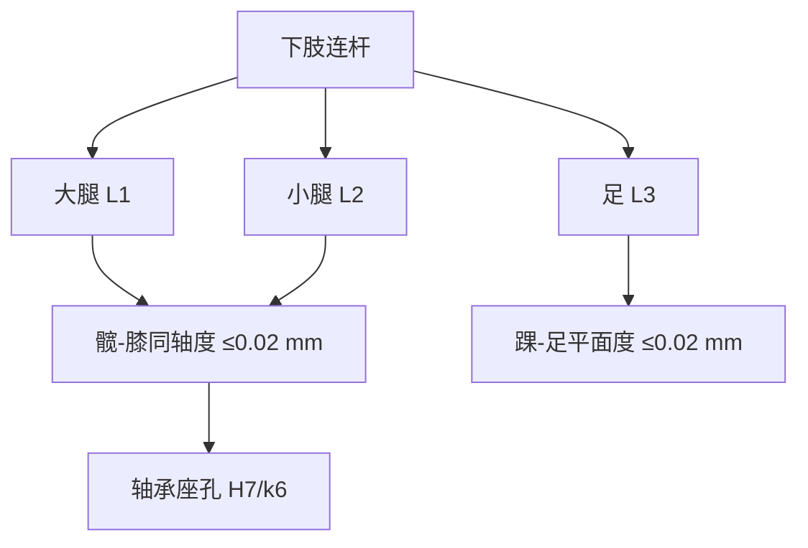
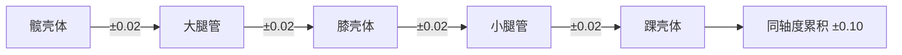

## 概述
腿部机构是人形机器人领域的重要零部件。以下内容整理自项目 Wiki，供深入查阅。

## 核心内容
下肢连杆长度、关节轴线偏移与配合公差直接决定运动学精度、装配可行性与动态性能。

!!! note "术语解释：连杆长度、关节轴线偏移、轴承座孔公差、同轴度、H7/g6、形位公差"
    - **连杆长度（link length）**：相邻关节轴线之间的垂直距离。
    - **关节轴线偏移（joint axis offset）**：实际旋转轴线与名义轴线之间的位置偏差。
    - **轴承座孔公差（bearing housing tolerance）**：安装轴承的孔的直径允许变动范围。
    - **同轴度（coaxiality）**：两轴或孔轴线重合程度的形位公差。
    - **H7/g6**：孔 H7、轴 g6 的配合代号，表示间隙配合。
    - **形位公差（geometric dimensioning and tolerancing, GD&T）**：控制零件几何特征相对理想形状、方向、位置和跳动允许的变动量。

**典型连杆长度范围**：以身高 1.6–1.8 m 的人形机器人为例：

| 尺寸 | 范围 | 说明 |
|---|---|---|
| 大腿长 \(l_{\text{thigh}}\) | 0.38–0.45 m | 髋-膝轴线距离 |
| 小腿长 \(l_{\text{shank}}\) | 0.38–0.45 m | 膝-踝轴线距离 |
| 足长 | 0.22–0.28 m | 足跟-足尖 |
| 足宽 | 0.08–0.12 m | 影响侧倾稳定 |
| 髋间距 | 0.16–0.22 m | 双髋关节轴线距离 |

**关节轴线偏移**：髋、膝、踝三轴在矢状面的共面度误差应控制在 \(\pm 0.3\,\text{mm}\) 以内，否则步态中会出现侧向摆动力矩。髋 yaw 轴与 pitch/roll 轴正交度建议 \(\le 0.05°\)。

**轴承座孔公差**：滚动轴承外圈与座孔常用 H7/k6（过渡配合）或 H7/g6（间隙配合便于装配）。关节输出轴与轴承内圈常用 k6/m6（轻微过盈）。轴承座孔圆柱度要求 \(\le 0.01\,\text{mm}\)，同轴度相对装配基准 \(\le 0.02\,\text{mm}\)。

**配合示例**：铝合金壳体中安装深沟球轴承 6206，外圈直径 \(D=62\,\text{mm}\)：座孔选 H7（\(+0.030/0\)），外圈配合后为轻微间隙或过渡；轴颈选 k6（\(+0.021/+0.002\)）以保证内圈随轴转动。

**GD&T 在下肢的应用示例**：以膝关节输出法兰为例：

| 特征 | 公差 | 基准 | 功能 |
|---|---|---|---|
| 法兰端面平面度 | \(0.02\,\text{mm}\) | — | 与小腿端面贴合 |
| 端面对轴颈垂直度 | \(0.03\,\text{mm}\) | A | 保证小腿轴线正交 |
| 轴颈圆柱度 | \(0.01\,\text{mm}\) | A | 轴承配合精度 |
| 螺栓孔位置度 | \(\phi 0.1\,\text{mm}\) | A|B|C | 装配通过性 |

**公差链示例**：从髋关节到踝关节的同轴度公差链包括：髋壳体轴承座同轴度、大腿管两端法兰同轴度、膝壳体同轴度、小腿管同轴度、踝壳体同轴度。若每项控制在 \(\pm 0.02\,\text{mm}\)，则 worst-case 累积为 \(\pm 0.10\,\text{mm}\)，需通过选配或调整垫片补偿。

## 参考
- Wiki extraction
- 项目 Wiki：chapter-09.md#9.2.13 下肢关键尺寸与公差

