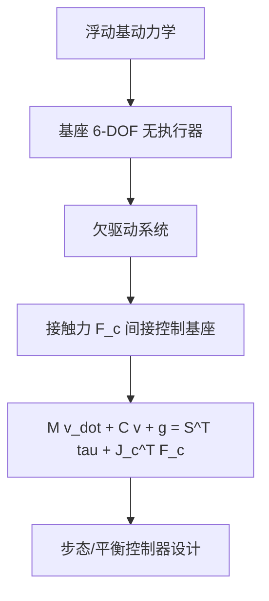
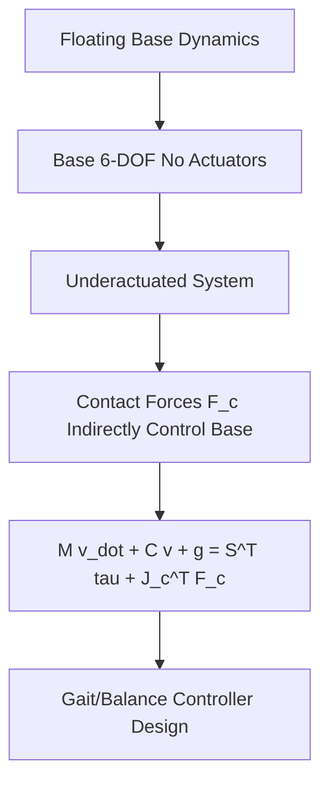
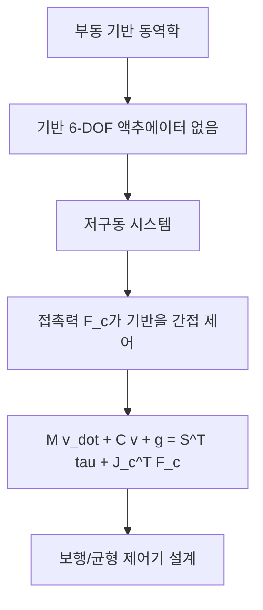

## 概述
#### 8.4.7 浮动基动力学

## 核心内容
人形机器人不同于固定基座的工业机械臂，其基座（躯干）可在空间中自由移动。因此需要用**浮动基（floating base）**坐标描述系统位形：

$$
\mathbf{q} = (\mathbf{p}_{\text{base}}, \mathbf{R}_{\text{base}}, \mathbf{q}_{\text{joints}})
$$

其中 $\mathbf{p}_{\text{base}} \in \mathbb{R}^3$ 为基座位置，$\mathbf{R}_{\text{base}} \in SO(3)$ 为基座姿态，$\mathbf{q}_{\text{joints}} \in \mathbb{R}^{n_j}$ 为关节角[4][6]。

!!! note "术语解释：浮动基、浮动基坐标、基座位置、基座姿态、广义坐标"
    - **浮动基（floating base）**：可在空间中自由平移和旋转的机器人基座。
    - **基座位置（base position）**：浮动基坐标系原点在惯性系中的位置。
    - **基座姿态（base orientation）**：浮动基坐标系相对于惯性系的旋转。
    - **广义坐标（generalized coordinates）**：描述系统位形的最小独立变量集合。

浮动基系统的关键特征是**欠驱动（underactuation）**：基座的 6 个自由度没有直接执行器，只能通过脚与地面的接触力间接控制。这使人形机器人本质上成为一个受接触力驱动的系统。

浮动基动力学方程的标准形式为：

$$
\mathbf{M}(\mathbf{q}) \dot{\mathbf{v}} + \mathbf{C}(\mathbf{q}, \mathbf{v}) \mathbf{v} + \mathbf{g}(\mathbf{q}) = \mathbf{S}^T \boldsymbol{\tau} + \sum_{c} \mathbf{J}_c^T(\mathbf{q}) \mathbf{F}_c
$$

其中：

- $\mathbf{M}(\mathbf{q})$：包含浮动基与关节的 $n \times n$ 质量矩阵。
- $\mathbf{C}(\mathbf{q}, \mathbf{v})$：科氏力与离心力项。
- $\mathbf{g}(\mathbf{q})$：重力项。
- $\mathbf{S}$：选择矩阵，把关节力矩 $\boldsymbol{\tau}$ 映射到广义坐标空间（仅作用于关节，不作用于浮动基）。
- $\mathbf{J}_c$：第 $c$ 个接触点对应的雅可比矩阵。
- $\mathbf{F}_c$：第 $c$ 个接触力。

!!! note "术语解释：欠驱动、选择矩阵、接触雅可比、广义力"
    - **欠驱动（underactuation）**：系统自由度多于独立控制输入的情形。
    - **选择矩阵（selection matrix）**：区分受控关节与未受控浮动基自由度的矩阵。
    - **接触雅可比（contact Jacobian）**：把广义速度映射到接触点速度的雅可比矩阵。
    - **广义力（generalized force）**：与广义坐标对应的力或力矩。

该方程也可按浮动基与关节分块写成：

$$
\begin{bmatrix}
\mathbf{M}_{b} & \mathbf{M}_{bj} \\
\mathbf{M}_{jb} & \mathbf{M}_{j}
\end{bmatrix}
\begin{bmatrix}
\dot{\mathbf{v}}_b \\
\ddot{\mathbf{q}}_j
\end{bmatrix}
+
\begin{bmatrix}
\mathbf{h}_b \\
\mathbf{h}_j
\end{bmatrix}
=
\begin{bmatrix}
\mathbf{0} \\
\boldsymbol{\tau}
\end{bmatrix}
+
\sum_c
\begin{bmatrix}
\mathbf{J}_{c,b}^T \\
\mathbf{J}_{c,j}^T
\end{bmatrix}
\mathbf{F}_c
$$

上块（浮动基）没有 $\boldsymbol{\tau}$ 项，这正是欠驱动的数学体现：基座加速度 $\dot{\mathbf{v}}_b$ 完全由接触力 $\mathbf{F}_c$ 决定。

!!! note "术语解释：质量矩阵分块、科氏力项、浮动基加速度、关节加速度"
    - **质量矩阵分块（partitioned mass matrix）**：把浮动基与关节对应子矩阵分开表示。
    - **科氏力项（Coriolis term）**：由坐标系旋转和相对运动耦合产生的惯性项。
    - **浮动基加速度（floating base acceleration）**：基座线加速度与角加速度的组合。
    - **关节加速度（joint acceleration）**：关节角对时间的二阶导数。

接触约束进一步限制了系统运动。若某接触点固定于地面（无滑移、无抬脚），则接触点速度为零：

$$
\mathbf{J}_c \mathbf{v} = \mathbf{0}
$$

求导得到加速度级约束：

$$
\mathbf{J}_c \dot{\mathbf{v}} + \dot{\mathbf{J}}_c \mathbf{v} = \mathbf{0}
$$

该约束与动力学方程联立，可同时求解关节力矩与接触力。这是人形机器人模型预测控制（MPC）与全身控制（WBC）的数学基础。

!!! note "术语解释：接触约束、无滑移约束、加速度级约束、模型预测控制（MPC）"
    - **接触约束（contact constraint）**：限制接触点运动学量的等式或不等式约束。
    - **无滑移约束（no-slip constraint）**：要求接触点切向速度为零的约束。
    - **加速度级约束（acceleration-level constraint）**：对加速度而非速度的约束。
    - **模型预测控制（MPC）**：基于动态模型在未来时域内滚动优化控制输入的方法。

## 参考
- Wiki extraction

## Overview
#### 8.4.7 Floating Base Dynamics

## Content
Unlike fixed-base industrial robotic arms, humanoid robots have a base (torso) that can move freely in space. Therefore, the system configuration is described using **floating base** coordinates:

$$
\mathbf{q} = (\mathbf{p}_{\text{base}}, \mathbf{R}_{\text{base}}, \mathbf{q}_{\text{joints}})
$$

where $\mathbf{p}_{\text{base}} \in \mathbb{R}^3$ is the base position, $\mathbf{R}_{\text{base}} \in SO(3)$ is the base orientation, and $\mathbf{q}_{\text{joints}} \in \mathbb{R}^{n_j}$ are the joint angles[4][6].

!!! note "Terminology: Floating Base, Floating Base Coordinates, Base Position, Base Orientation, Generalized Coordinates"
    - **Floating base**: A robot base that can freely translate and rotate in space.
    - **Base position**: The position of the floating base coordinate system origin in the inertial frame.
    - **Base orientation**: The rotation of the floating base coordinate system relative to the inertial frame.
    - **Generalized coordinates**: The minimal set of independent variables describing the system configuration.

A key characteristic of floating base systems is **underactuation**: the 6 degrees of freedom of the base have no direct actuators and can only be indirectly controlled through contact forces with the ground. This makes a humanoid robot essentially a system driven by contact forces.

The standard form of the floating base dynamics equation is:

$$
\mathbf{M}(\mathbf{q}) \dot{\mathbf{v}} + \mathbf{C}(\mathbf{q}, \mathbf{v}) \mathbf{v} + \mathbf{g}(\mathbf{q}) = \mathbf{S}^T \boldsymbol{\tau} + \sum_{c} \mathbf{J}_c^T(\mathbf{q}) \mathbf{F}_c
$$

where:

- $\mathbf{M}(\mathbf{q})$: The $n \times n$ mass matrix including the floating base and joints.
- $\mathbf{C}(\mathbf{q}, \mathbf{v})$: The Coriolis and centrifugal force terms.
- $\mathbf{g}(\mathbf{q})$: The gravity term.
- $\mathbf{S}$: The selection matrix, mapping joint torques $\boldsymbol{\tau}$ to generalized coordinate space (acting only on joints, not on the floating base).
- $\mathbf{J}_c$: The Jacobian matrix for the $c$-th contact point.
- $\mathbf{F}_c$: The $c$-th contact force.

!!! note "Terminology: Underactuation, Selection Matrix, Contact Jacobian, Generalized Force"
    - **Underactuation**: A situation where the system has more degrees of freedom than independent control inputs.
    - **Selection matrix**: A matrix that distinguishes between actuated joints and unactuated floating base degrees of freedom.
    - **Contact Jacobian**: The Jacobian matrix mapping generalized velocities to contact point velocities.
    - **Generalized force**: Forces or torques corresponding to generalized coordinates.

This equation can also be written in block form separating the floating base and joints:

$$
\begin{bmatrix}
\mathbf{M}_{b} & \mathbf{M}_{bj} \\
\mathbf{M}_{jb} & \mathbf{M}_{j}
\end{bmatrix}
\begin{bmatrix}
\dot{\mathbf{v}}_b \\
\ddot{\mathbf{q}}_j
\end{bmatrix}
+
\begin{bmatrix}
\mathbf{h}_b \\
\mathbf{h}_j
\end{bmatrix}
=
\begin{bmatrix}
\mathbf{0} \\
\boldsymbol{\tau}
\end{bmatrix}
+
\sum_c
\begin{bmatrix}
\mathbf{J}_{c,b}^T \\
\mathbf{J}_{c,j}^T
\end{bmatrix}
\mathbf{F}_c
$$

The upper block (floating base) has no $\boldsymbol{\tau}$ term, which is the mathematical manifestation of underactuation: the base acceleration $\dot{\mathbf{v}}_b$ is entirely determined by the contact forces $\mathbf{F}_c$.

!!! note "Terminology: Partitioned Mass Matrix, Coriolis Term, Floating Base Acceleration, Joint Acceleration"
    - **Partitioned mass matrix**: Representing the submatrices corresponding to the floating base and joints separately.
    - **Coriolis term**: Inertial terms arising from the coupling of coordinate rotation and relative motion.
    - **Floating base acceleration**: The combination of base linear acceleration and angular acceleration.
    - **Joint acceleration**: The second derivative of joint angles with respect to time.

Contact constraints further restrict the system motion. If a contact point is fixed to the ground (no slip, no lift-off), the contact point velocity is zero:

$$
\mathbf{J}_c \mathbf{v} = \mathbf{0}
$$

Differentiating yields the acceleration-level constraint:

$$
\mathbf{J}_c \dot{\mathbf{v}} + \dot{\mathbf{J}}_c \mathbf{v} = \mathbf{0}
$$

This constraint, combined with the dynamics equation, allows for the simultaneous solution of joint torques and contact forces. This is the mathematical foundation for Model Predictive Control (MPC) and Whole-Body Control (WBC) in humanoid robots.

!!! note "Terminology: Contact Constraint, No-Slip Constraint, Acceleration-Level Constraint, Model Predictive Control (MPC)"
    - **Contact constraint**: Equality or inequality constraints limiting the kinematic quantities of a contact point.
    - **No-slip constraint**: A constraint requiring the tangential velocity of the contact point to be zero.
    - **Acceleration-level constraint**: A constraint imposed on acceleration rather than velocity.
    - **Model Predictive Control (MPC)**: A method that optimizes control inputs over a future time horizon in a receding horizon manner based on a dynamic model.

## 개요
#### 8.4.7 부동 기반 동역학

## 핵심 내용
휴머노이드 로봇은 고정 기반의 산업용 로봇 팔과 달리, 그 기반(몸통)이 공간에서 자유롭게 움직일 수 있습니다. 따라서 **부동 기반(floating base)** 좌표를 사용하여 시스템의 형상을 기술합니다:

$$
\mathbf{q} = (\mathbf{p}_{\text{base}}, \mathbf{R}_{\text{base}}, \mathbf{q}_{\text{joints}})
$$

여기서 $\mathbf{p}_{\text{base}} \in \mathbb{R}^3$는 기반 위치, $\mathbf{R}_{\text{base}} \in SO(3)$는 기반 자세, $\mathbf{q}_{\text{joints}} \in \mathbb{R}^{n_j}$는 관절 각도입니다[4][6].

!!! note "용어 설명: 부동 기반, 부동 기반 좌표, 기반 위치, 기반 자세, 일반화 좌표"
    - **부동 기반(floating base)**: 공간에서 자유롭게 병진 및 회전할 수 있는 로봇의 기반.
    - **기반 위치(base position)**: 부동 기반 좌표계의 원점이 관성 좌표계에서 차지하는 위치.
    - **기반 자세(base orientation)**: 관성 좌표계에 대한 부동 기반 좌표계의 회전.
    - **일반화 좌표(generalized coordinates)**: 시스템의 형상을 기술하는 최소 독립 변수 집합.

부동 기반 시스템의 핵심 특징은 **저구동(underactuation)**입니다: 기반의 6 자유도에는 직접적인 액추에이터가 없으며, 발과 지면 사이의 접촉력을 통해서만 간접적으로 제어됩니다. 이로 인해 휴머노이드 로봇은 본질적으로 접촉력에 의해 구동되는 시스템이 됩니다.

부동 기반 동역학 방정식의 표준 형태는 다음과 같습니다:

$$
\mathbf{M}(\mathbf{q}) \dot{\mathbf{v}} + \mathbf{C}(\mathbf{q}, \mathbf{v}) \mathbf{v} + \mathbf{g}(\mathbf{q}) = \mathbf{S}^T \boldsymbol{\tau} + \sum_{c} \mathbf{J}_c^T(\mathbf{q}) \mathbf{F}_c
$$

여기서:

- $\mathbf{M}(\mathbf{q})$: 부동 기반과 관절을 포함하는 $n \times n$ 질량 행렬.
- $\mathbf{C}(\mathbf{q}, \mathbf{v})$: 코리올리 힘과 원심력 항.
- $\mathbf{g}(\mathbf{q})$: 중력 항.
- $\mathbf{S}$: 선택 행렬로, 관절 토크 $\boldsymbol{\tau}$를 일반화 좌표 공간에 매핑합니다 (관절에만 작용하고 부동 기반에는 작용하지 않음).
- $\mathbf{J}_c$: $c$번째 접촉점에 해당하는 야코비 행렬.
- $\mathbf{F}_c$: $c$번째 접촉력.

!!! note "용어 설명: 저구동, 선택 행렬, 접촉 야코비, 일반화 힘"
    - **저구동(underactuation)**: 시스템의 자유도가 독립적인 제어 입력보다 많은 경우.
    - **선택 행렬(selection matrix)**: 제어되는 관절과 제어되지 않는 부동 기반 자유도를 구분하는 행렬.
    - **접촉 야코비(contact Jacobian)**: 일반화 속도를 접촉점 속도로 매핑하는 야코비 행렬.
    - **일반화 힘(generalized force)**: 일반화 좌표에 대응하는 힘 또는 토크.

이 방정식은 부동 기반과 관절에 대해 블록 형태로 다음과 같이 쓸 수도 있습니다:

$$
\begin{bmatrix}
\mathbf{M}_{b} & \mathbf{M}_{bj} \\
\mathbf{M}_{jb} & \mathbf{M}_{j}
\end{bmatrix}
\begin{bmatrix}
\dot{\mathbf{v}}_b \\
\ddot{\mathbf{q}}_j
\end{bmatrix}
+
\begin{bmatrix}
\mathbf{h}_b \\
\mathbf{h}_j
\end{bmatrix}
=
\begin{bmatrix}
\mathbf{0} \\
\boldsymbol{\tau}
\end{bmatrix}
+
\sum_c
\begin{bmatrix}
\mathbf{J}_{c,b}^T \\
\mathbf{J}_{c,j}^T
\end{bmatrix}
\mathbf{F}_c
$$

위쪽 블록(부동 기반)에는 $\boldsymbol{\tau}$ 항이 없으며, 이것이 바로 저구동의 수학적 표현입니다: 기반 가속도 $\dot{\mathbf{v}}_b$는 전적으로 접촉력 $\mathbf{F}_c$에 의해 결정됩니다.

!!! note "용어 설명: 질량 행렬 분할, 코리올리 힘 항, 부동 기반 가속도, 관절 가속도"
    - **질량 행렬 분할(partitioned mass matrix)**: 부동 기반과 관절에 해당하는 부분 행렬을 분리하여 표현.
    - **코리올리 힘 항(Coriolis term)**: 좌표계 회전과 상대 운동 결합으로 발생하는 관성 항.
    - **부동 기반 가속도(floating base acceleration)**: 기반의 선형 가속도와 각가속도의 조합.
    - **관절 가속도(joint acceleration)**: 관절 각도의 시간에 대한 2차 도함수.

접촉 구속 조건은 시스템의 운동을 더욱 제한합니다. 특정 접촉점이 지면에 고정되어 있는 경우(미끄러짐 없음, 발 들림 없음), 접촉점 속도는 0입니다:

$$
\mathbf{J}_c \mathbf{v} = \mathbf{0}
$$

미분하여 가속도 수준의 구속 조건을 얻습니다:

$$
\mathbf{J}_c \dot{\mathbf{v}} + \dot{\mathbf{J}}_c \mathbf{v} = \mathbf{0}
$$

이 구속 조건은 동역학 방정식과 연립하여 관절 토크와 접촉력을 동시에 풀 수 있게 합니다. 이것은 휴머노이드 로봇의 모델 예측 제어(MPC)와 전신 제어(WBC)의 수학적 기초입니다.

!!! note "용어 설명: 접촉 구속 조건, 무미끄러짐 구속 조건, 가속도 수준 구속 조건, 모델 예측 제어(MPC)"
    - **접촉 구속 조건(contact constraint)**: 접촉점의 운동학적 양을 제한하는 등식 또는 부등식 구속 조건.
    - **무미끄러짐 구속 조건(no-slip constraint)**: 접촉점의 접선 방향 속도가 0이어야 한다는 구속 조건.
    - **가속도 수준 구속 조건(acceleration-level constraint)**: 속도가 아닌 가속도에 대한 구속 조건.
    - **모델 예측 제어(MPC)**: 동적 모델을 기반으로 미래 시간 영역에서 제어 입력을 순차적으로 최적화하는 방법.
