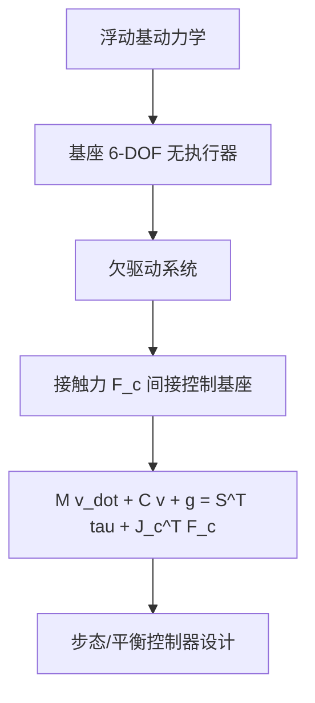

## 概述
#### 8.4.7 浮动基动力学

## 核心内容
人形机器人不同于固定基座的工业机械臂，其基座（躯干）可在空间中自由移动。因此需要用**浮动基（floating base）**坐标描述系统位形：

$$
\mathbf{q} = (\mathbf{p}_{\text{base}}, \mathbf{R}_{\text{base}}, \mathbf{q}_{\text{joints}})
$$

其中 $\mathbf{p}_{\text{base}} \in \mathbb{R}^3$ 为基座位置，$\mathbf{R}_{\text{base}} \in SO(3)$ 为基座姿态，$\mathbf{q}_{\text{joints}} \in \mathbb{R}^{n_j}$ 为关节角[4][6]。

!!! note "术语解释：浮动基、浮动基坐标、基座位置、基座姿态、广义坐标"
    - **浮动基（floating base）**：可在空间中自由平移和旋转的机器人基座。
    - **基座位置（base position）**：浮动基坐标系原点在惯性系中的位置。
    - **基座姿态（base orientation）**：浮动基坐标系相对于惯性系的旋转。
    - **广义坐标（generalized coordinates）**：描述系统位形的最小独立变量集合。

浮动基系统的关键特征是**欠驱动（underactuation）**：基座的 6 个自由度没有直接执行器，只能通过脚与地面的接触力间接控制。这使人形机器人本质上成为一个受接触力驱动的系统。

浮动基动力学方程的标准形式为：

$$
\mathbf{M}(\mathbf{q}) \dot{\mathbf{v}} + \mathbf{C}(\mathbf{q}, \mathbf{v}) \mathbf{v} + \mathbf{g}(\mathbf{q}) = \mathbf{S}^T \boldsymbol{\tau} + \sum_{c} \mathbf{J}_c^T(\mathbf{q}) \mathbf{F}_c
$$

其中：

- $\mathbf{M}(\mathbf{q})$：包含浮动基与关节的 $n \times n$ 质量矩阵。
- $\mathbf{C}(\mathbf{q}, \mathbf{v})$：科氏力与离心力项。
- $\mathbf{g}(\mathbf{q})$：重力项。
- $\mathbf{S}$：选择矩阵，把关节力矩 $\boldsymbol{\tau}$ 映射到广义坐标空间（仅作用于关节，不作用于浮动基）。
- $\mathbf{J}_c$：第 $c$ 个接触点对应的雅可比矩阵。
- $\mathbf{F}_c$：第 $c$ 个接触力。

!!! note "术语解释：欠驱动、选择矩阵、接触雅可比、广义力"
    - **欠驱动（underactuation）**：系统自由度多于独立控制输入的情形。
    - **选择矩阵（selection matrix）**：区分受控关节与未受控浮动基自由度的矩阵。
    - **接触雅可比（contact Jacobian）**：把广义速度映射到接触点速度的雅可比矩阵。
    - **广义力（generalized force）**：与广义坐标对应的力或力矩。

该方程也可按浮动基与关节分块写成：

$$
\begin{bmatrix}
\mathbf{M}_{b} & \mathbf{M}_{bj} \\
\mathbf{M}_{jb} & \mathbf{M}_{j}
\end{bmatrix}
\begin{bmatrix}
\dot{\mathbf{v}}_b \\
\ddot{\mathbf{q}}_j
\end{bmatrix}
+
\begin{bmatrix}
\mathbf{h}_b \\
\mathbf{h}_j
\end{bmatrix}
=
\begin{bmatrix}
\mathbf{0} \\
\boldsymbol{\tau}
\end{bmatrix}
+
\sum_c
\begin{bmatrix}
\mathbf{J}_{c,b}^T \\
\mathbf{J}_{c,j}^T
\end{bmatrix}
\mathbf{F}_c
$$

上块（浮动基）没有 $\boldsymbol{\tau}$ 项，这正是欠驱动的数学体现：基座加速度 $\dot{\mathbf{v}}_b$ 完全由接触力 $\mathbf{F}_c$ 决定。

!!! note "术语解释：质量矩阵分块、科氏力项、浮动基加速度、关节加速度"
    - **质量矩阵分块（partitioned mass matrix）**：把浮动基与关节对应子矩阵分开表示。
    - **科氏力项（Coriolis term）**：由坐标系旋转和相对运动耦合产生的惯性项。
    - **浮动基加速度（floating base acceleration）**：基座线加速度与角加速度的组合。
    - **关节加速度（joint acceleration）**：关节角对时间的二阶导数。

接触约束进一步限制了系统运动。若某接触点固定于地面（无滑移、无抬脚），则接触点速度为零：

$$
\mathbf{J}_c \mathbf{v} = \mathbf{0}
$$

求导得到加速度级约束：

$$
\mathbf{J}_c \dot{\mathbf{v}} + \dot{\mathbf{J}}_c \mathbf{v} = \mathbf{0}
$$

该约束与动力学方程联立，可同时求解关节力矩与接触力。这是人形机器人模型预测控制（MPC）与全身控制（WBC）的数学基础。

!!! note "术语解释：接触约束、无滑移约束、加速度级约束、模型预测控制（MPC）"
    - **接触约束（contact constraint）**：限制接触点运动学量的等式或不等式约束。
    - **无滑移约束（no-slip constraint）**：要求接触点切向速度为零的约束。
    - **加速度级约束（acceleration-level constraint）**：对加速度而非速度的约束。
    - **模型预测控制（MPC）**：基于动态模型在未来时域内滚动优化控制输入的方法。

## 参考
- Wiki extraction

