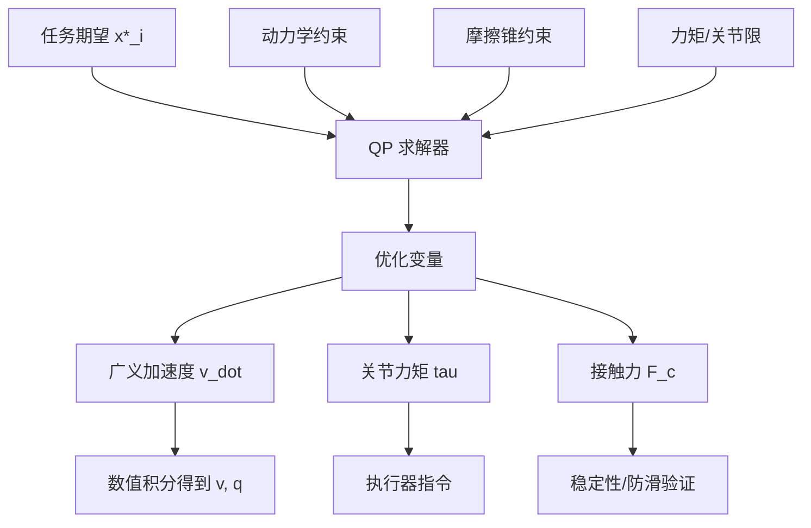

## 概述
标准二次规划（QP）是人形机器人领域的重要形式化方法。以下内容整理自项目 Wiki，供深入查阅。

## 核心内容
现代 WBC 的主流实现是**全身 QP 控制**。它把所有任务统一为二次规划问题，同时显式施加动力学、摩擦锥、关节力矩限、关节限位等约束。

!!! note "术语解释：全身 QP 控制、二次规划、等式约束、不等式约束"
    - **全身 QP 控制（whole-body QP control）**：用二次规划求解全身控制输入的方法。
    - **二次规划（Quadratic Programming, QP）**：目标函数为二次、约束为线性的优化问题。
    - **等式约束（equality constraint）**：必须精确满足的线性等式。
    - **不等式约束（inequality constraint）**：必须满足的不等式限制。

优化变量通常包括广义加速度 \(\dot{\mathbf{v}}\)、关节力矩 \(\boldsymbol{\tau}\) 与接触力 \(\mathbf{F}_c\)。目标函数为各任务跟踪误差加权和加上正则项：

$$
\min_{\dot{\mathbf{v}}, \boldsymbol{\tau}, \mathbf{F}_c} \quad \sum_i w_i \left\| \mathbf{J}_i \dot{\mathbf{v}} + \dot{\mathbf{J}}_i \mathbf{v} - \ddot{\mathbf{x}}_i^* \right\|^2 + w_{\tau}\|\boldsymbol{\tau}\|^2 + w_{f}\|\mathbf{F}_c\|^2
$$

约束条件包括：

**动力学约束**：

$$
\mathbf{M}\dot{\mathbf{v}} + \mathbf{C}\mathbf{v} + \mathbf{g} = \mathbf{S}^T \boldsymbol{\tau} + \sum_c \mathbf{J}_{c}^T \mathbf{F}_c
$$

**摩擦锥约束**：

$$
\mathbf{F}_c \in \mathcal{C}(\mu)
$$

**关节力矩限**：

$$
\boldsymbol{\tau}_{\min} \leq \boldsymbol{\tau} \leq \boldsymbol{\tau}_{\max}
$$

**关节限位（速度级）**：

$$
\mathbf{q}_{\min} \leq \mathbf{q} + \Delta t \, \dot{\mathbf{q}} \leq \mathbf{q}_{\max}
$$

!!! note "术语解释：动力学约束、摩擦锥约束、关节力矩限、关节限位"
    - **动力学约束（dynamic constraint）**：由牛顿-欧拉或拉格朗日方程给出的等式。
    - **摩擦锥约束（friction cone constraint）**：接触力必须位于摩擦锥内的约束。
    - **关节力矩限（torque limit）**：执行器可提供的最大/最小力矩。
    - **关节限位（joint limit）**：关节角度允许的范围。



## 参考
- [J. Nocedal and S. J. Wright, Numerical Optimization, 2nd ed., Springer, 2006](https://doi.org/10.1007/978-0-387-40065-5)
- 项目 Wiki：chapter-08.md#8.4.10.3 基于 QP 的全身控制公式

## Overview
Standard Quadratic Programming (QP) is an important formalization method in the field of humanoid robotics. The following content is compiled from the project Wiki for in-depth reference.

## Content
The mainstream implementation of modern WBC is **whole-body QP control**. It unifies all tasks into a quadratic programming problem while explicitly imposing constraints such as dynamics, friction cones, joint torque limits, and joint position limits.

!!! note "Terminology: Whole-body QP control, Quadratic Programming, Equality constraint, Inequality constraint"
    - **Whole-body QP control**: A method that uses quadratic programming to solve whole-body control inputs.
    - **Quadratic Programming (QP)**: An optimization problem with a quadratic objective function and linear constraints.
    - **Equality constraint**: A linear equality that must be satisfied exactly.
    - **Inequality constraint**: An inequality restriction that must be satisfied.

The optimization variables typically include generalized acceleration \(\dot{\mathbf{v}}\), joint torques \(\boldsymbol{\tau}\), and contact forces \(\mathbf{F}_c\). The objective function is the weighted sum of task tracking errors plus regularization terms:

$$
\min_{\dot{\mathbf{v}}, \boldsymbol{\tau}, \mathbf{F}_c} \quad \sum_i w_i \left\| \mathbf{J}_i \dot{\mathbf{v}} + \dot{\mathbf{J}}_i \mathbf{v} - \ddot{\mathbf{x}}_i^* \right\|^2 + w_{\tau}\|\boldsymbol{\tau}\|^2 + w_{f}\|\mathbf{F}_c\|^2
$$

The constraints include:

**Dynamic constraint**:

$$
\mathbf{M}\dot{\mathbf{v}} + \mathbf{C}\mathbf{v} + \mathbf{g} = \mathbf{S}^T \boldsymbol{\tau} + \sum_c \mathbf{J}_{c}^T \mathbf{F}_c
$$

**Friction cone constraint**:

$$
\mathbf{F}_c \in \mathcal{C}(\mu)
$$

**Joint torque limits**:

$$
\boldsymbol{\tau}_{\min} \leq \boldsymbol{\tau} \leq \boldsymbol{\tau}_{\max}
$$

**Joint position limits (velocity level)**:

$$
\mathbf{q}_{\min} \leq \mathbf{q} + \Delta t \, \dot{\mathbf{q}} \leq \mathbf{q}_{\max}
$$

!!! note "Terminology: Dynamic constraint, Friction cone constraint, Joint torque limit, Joint position limit"
    - **Dynamic constraint**: An equality given by Newton-Euler or Lagrange equations.
    - **Friction cone constraint**: The constraint that contact forces must lie within the friction cone.
    - **Torque limit**: The maximum/minimum torque that an actuator can provide.
    - **Joint limit**: The allowable range of joint angles.

```mermaid
flowchart TD
    A["Task Desired x*_i"] --> B["QP Solver"]
    C["Dynamic Constraint"] --> B
    D["Friction Cone Constraint"] --> B
    E["Torque/Joint Limits"] --> B
    B --> F["Optimization Variables"]
    F --> G["Generalized Acceleration v_dot"]
    F --> H["Joint Torques tau"]
    F --> I["Contact Forces F_c"]
    G --> J["Numerical Integration to v, q"]
    H --> K["Actuator Commands"]
    I --> L["Stability/Slip Verification"]

## 개요
표준 이차 계획법(QP)은 휴머노이드 로봇 분야에서 중요한 형식화 방법입니다. 아래 내용은 프로젝트 Wiki에서 정리한 것으로, 심층적인 참고를 위해 제공됩니다.

## 핵심 내용
현대 WBC의 주류 구현은 **전신 QP 제어**입니다. 이는 모든 작업을 이차 계획법 문제로 통합하고, 동시에 동역학, 마찰 원뿔, 관절 토크 한계, 관절 제한 등의 제약 조건을 명시적으로 적용합니다.

!!! note "용어 설명: 전신 QP 제어, 이차 계획법, 등식 제약 조건, 부등식 제약 조건"
    - **전신 QP 제어(whole-body QP control)**: 이차 계획법을 사용하여 전신 제어 입력을 계산하는 방법.
    - **이차 계획법(Quadratic Programming, QP)**: 목적 함수가 이차 함수이고 제약 조건이 선형인 최적화 문제.
    - **등식 제약 조건(equality constraint)**: 정확히 충족되어야 하는 선형 등식.
    - **부등식 제약 조건(inequality constraint)**: 충족되어야 하는 부등식 제한.

최적화 변수는 일반적으로 일반화 가속도 \(\dot{\mathbf{v}}\), 관절 토크 \(\boldsymbol{\tau}\), 접촉력 \(\mathbf{F}_c\)를 포함합니다. 목적 함수는 각 작업 추적 오차의 가중 합과 정규화 항으로 구성됩니다:

$$
\min_{\dot{\mathbf{v}}, \boldsymbol{\tau}, \mathbf{F}_c} \quad \sum_i w_i \left\| \mathbf{J}_i \dot{\mathbf{v}} + \dot{\mathbf{J}}_i \mathbf{v} - \ddot{\mathbf{x}}_i^* \right\|^2 + w_{\tau}\|\boldsymbol{\tau}\|^2 + w_{f}\|\mathbf{F}_c\|^2
$$

제약 조건은 다음과 같습니다:

**동역학 제약 조건**:

$$
\mathbf{M}\dot{\mathbf{v}} + \mathbf{C}\mathbf{v} + \mathbf{g} = \mathbf{S}^T \boldsymbol{\tau} + \sum_c \mathbf{J}_{c}^T \mathbf{F}_c
$$

**마찰 원뿔 제약 조건**:

$$
\mathbf{F}_c \in \mathcal{C}(\mu)
$$

**관절 토크 한계**:

$$
\boldsymbol{\tau}_{\min} \leq \boldsymbol{\tau} \leq \boldsymbol{\tau}_{\max}
$$

**관절 제한 (속도 수준)**:

$$
\mathbf{q}_{\min} \leq \mathbf{q} + \Delta t \, \dot{\mathbf{q}} \leq \mathbf{q}_{\max}
$$

!!! note "용어 설명: 동역학 제약 조건, 마찰 원뿔 제약 조건, 관절 토크 한계, 관절 제한"
    - **동역학 제약 조건(dynamic constraint)**: 뉴턴-오일러 또는 라그랑주 방정식으로 주어지는 등식.
    - **마찰 원뿔 제약 조건(friction cone constraint)**: 접촉력이 마찰 원뿔 내에 있어야 하는 제약 조건.
    - **관절 토크 한계(torque limit)**: 액추에이터가 제공할 수 있는 최대/최소 토크.
    - **관절 제한(joint limit)**: 관절 각도의 허용 범위.

```mermaid
flowchart TD
    A["작업 기대값 x*_i"] --> B["QP 솔버"]
    C["동역학 제약 조건"] --> B
    D["마찰 원뿔 제약 조건"] --> B
    E["토크/관절 제한"] --> B
    B --> F["최적화 변수"]
    F --> G["일반화 가속도 v_dot"]
    F --> H["관절 토크 tau"]
    F --> I["접촉력 F_c"]
    G --> J["수치 적분으로 v, q 획득"]
    H --> K["액추에이터 명령"]
    I --> L["안정성/미끄럼 방지 검증"]

## 개요
표준 이차 계획법(QP)은 휴머노이드 로봇 분야에서 중요한 형식화 방법입니다. 아래 내용은 프로젝트 Wiki에서 정리한 것으로, 자세한 내용은 해당 문서를 참고하시기 바랍니다.

## 핵심 내용
현대 WBC의 주류 구현 방식은 **전신 QP 제어**입니다. 이는 모든 작업을 이차 계획법 문제로 통합하면서, 동시에 동역학, 마찰 원뿔, 관절 토크 한계, 관절 한계 등의 제약 조건을 명시적으로 적용합니다.

!!! note "용어 설명: 전신 QP 제어, 이차 계획법, 등식 제약 조건, 부등식 제약 조건"
    - **전신 QP 제어(whole-body QP control)**: 이차 계획법을 사용하여 전신 제어 입력을 계산하는 방법입니다.
    - **이차 계획법(Quadratic Programming, QP)**: 목적 함수가 이차 함수이고 제약 조건이 선형인 최적화 문제입니다.
    - **등식 제약 조건(equality constraint)**: 정확히 충족되어야 하는 선형 등식입니다.
    - **부등식 제약 조건(inequality constraint)**: 충족되어야 하는 부등식 제한입니다.

최적화 변수는 일반적으로 일반화 가속도 \(\dot{\mathbf{v}}\), 관절 토크 \(\boldsymbol{\tau}\), 접촉력 \(\mathbf{F}_c\)를 포함합니다. 목적 함수는 각 작업 추적 오차의 가중 합과 정규화 항으로 구성됩니다:

$$
\min_{\dot{\mathbf{v}}, \boldsymbol{\tau}, \mathbf{F}_c} \quad \sum_i w_i \left\| \mathbf{J}_i \dot{\mathbf{v}} + \dot{\mathbf{J}}_i \mathbf{v} - \ddot{\mathbf{x}}_i^* \right\|^2 + w_{\tau}\|\boldsymbol{\tau}\|^2 + w_{f}\|\mathbf{F}_c\|^2
$$

제약 조건은 다음과 같습니다:

**동역학 제약 조건**:

$$
\mathbf{M}\dot{\mathbf{v}} + \mathbf{C}\mathbf{v} + \mathbf{g} = \mathbf{S}^T \boldsymbol{\tau} + \sum_c \mathbf{J}_{c}^T \mathbf{F}_c
$$

**마찰 원뿔 제약 조건**:

$$
\mathbf{F}_c \in \mathcal{C}(\mu)
$$

**관절 토크 한계**:

$$
\boldsymbol{\tau}_{\min} \leq \boldsymbol{\tau} \leq \boldsymbol{\tau}_{\max}
$$

**관절 한계(속도 수준)**:

$$
\mathbf{q}_{\min} \leq \mathbf{q} + \Delta t \, \dot{\mathbf{q}} \leq \mathbf{q}_{\max}
$$

!!! note "용어 설명: 동역학 제약 조건, 마찰 원뿔 제약 조건, 관절 토크 한계, 관절 한계"
    - **동역학 제약 조건(dynamic constraint)**: 뉴턴-오일러 또는 라그랑주 방정식으로 주어지는 등식입니다.
    - **마찰 원뿔 제약 조건(friction cone constraint)**: 접촉력이 마찰 원뿔 내에 위치해야 하는 제약 조건입니다.
    - **관절 토크 한계(torque limit)**: 액추에이터가 제공할 수 있는 최대/최소 토크입니다.
    - **관절 한계(joint limit)**: 관절 각도의 허용 범위입니다.

```mermaid
flowchart TD
    A["작업 기대값 x*_i"] --> B["QP 솔버"]
    C["동역학 제약 조건"] --> B
    D["마찰 원뿔 제약 조건"] --> B
    E["토크/관절 한계"] --> B
    B --> F["최적화 변수"]
    F --> G["일반화 가속도 v_dot"]
    F --> H["관절 토크 tau"]
    F --> I["접촉력 F_c"]
    G --> J["수치 적분으로 v, q 획득"]
    H --> K["액추에이터 명령"]
    I --> L["안정성/미끄럼 방지 검증"]
