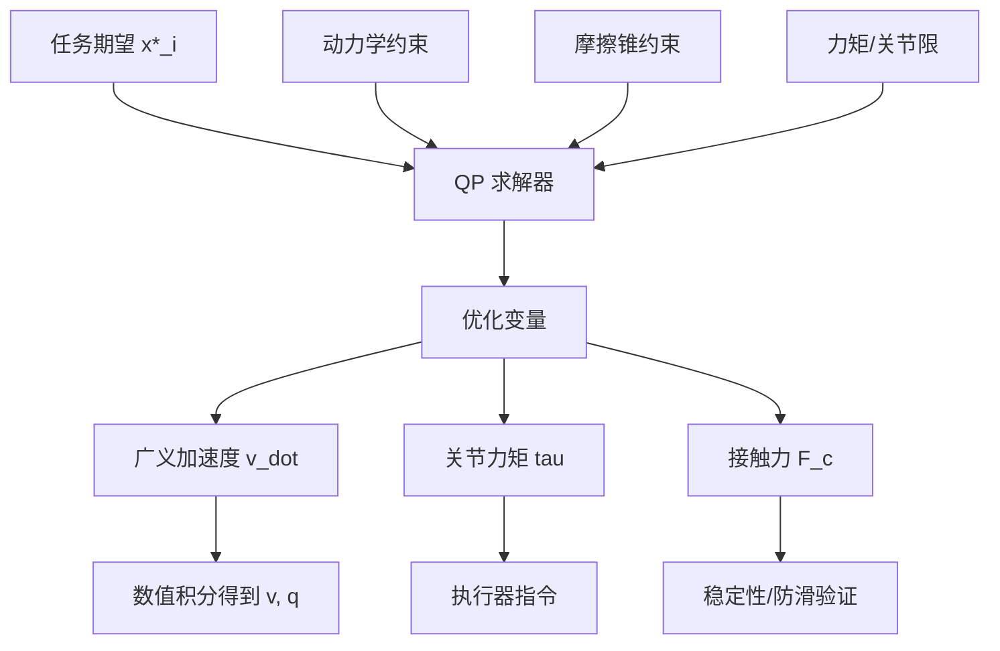

## 概述
标准二次规划（QP）是人形机器人领域的重要formalism。以下内容整理自项目 Wiki，供深入查阅。

## 核心内容
现代 WBC 的主流实现是**全身 QP 控制**。它把所有任务统一为二次规划问题，同时显式施加动力学、摩擦锥、关节力矩限、关节限位等约束。

!!! note "术语解释：全身 QP 控制、二次规划、等式约束、不等式约束"
    - **全身 QP 控制（whole-body QP control）**：用二次规划求解全身控制输入的方法。
    - **二次规划（Quadratic Programming, QP）**：目标函数为二次、约束为线性的优化问题。
    - **等式约束（equality constraint）**：必须精确满足的线性等式。
    - **不等式约束（inequality constraint）**：必须满足的不等式限制。

优化变量通常包括广义加速度 \(\dot{\mathbf{v}}\)、关节力矩 \(\boldsymbol{\tau}\) 与接触力 \(\mathbf{F}_c\)。目标函数为各任务跟踪误差加权和加上正则项：

$$
\min_{\dot{\mathbf{v}}, \boldsymbol{\tau}, \mathbf{F}_c} \quad \sum_i w_i \left\| \mathbf{J}_i \dot{\mathbf{v}} + \dot{\mathbf{J}}_i \mathbf{v} - \ddot{\mathbf{x}}_i^* \right\|^2 + w_{\tau}\|\boldsymbol{\tau}\|^2 + w_{f}\|\mathbf{F}_c\|^2
$$

约束条件包括：

**动力学约束**：

$$
\mathbf{M}\dot{\mathbf{v}} + \mathbf{C}\mathbf{v} + \mathbf{g} = \mathbf{S}^T \boldsymbol{\tau} + \sum_c \mathbf{J}_{c}^T \mathbf{F}_c
$$

**摩擦锥约束**：

$$
\mathbf{F}_c \in \mathcal{C}(\mu)
$$

**关节力矩限**：

$$
\boldsymbol{\tau}_{\min} \leq \boldsymbol{\tau} \leq \boldsymbol{\tau}_{\max}
$$

**关节限位（速度级）**：

$$
\mathbf{q}_{\min} \leq \mathbf{q} + \Delta t \, \dot{\mathbf{q}} \leq \mathbf{q}_{\max}
$$

!!! note "术语解释：动力学约束、摩擦锥约束、关节力矩限、关节限位"
    - **动力学约束（dynamic constraint）**：由牛顿-欧拉或拉格朗日方程给出的等式。
    - **摩擦锥约束（friction cone constraint）**：接触力必须位于摩擦锥内的约束。
    - **关节力矩限（torque limit）**：执行器可提供的最大/最小力矩。
    - **关节限位（joint limit）**：关节角度允许的范围。

## 参考
- [J. Nocedal and S. J. Wright, Numerical Optimization, 2nd ed., Springer, 2006](https://doi.org/10.1007/978-0-387-40065-5)
- 项目 Wiki：chapter-08.md#8.4.10.3 基于 QP 的全身控制公式

