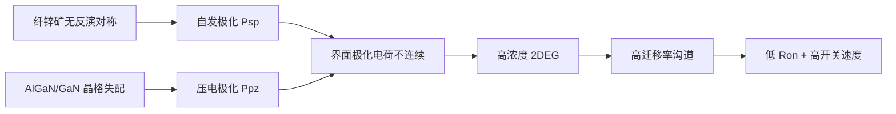
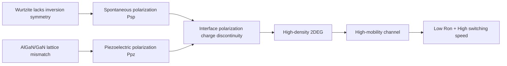
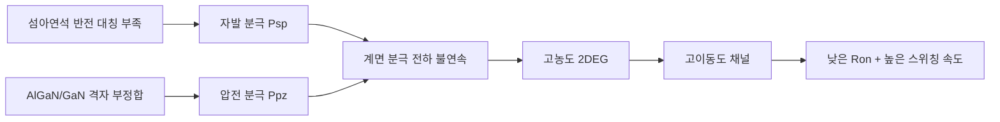

## 概述
### 3.4.3 氮化镓：极化效应与二维电子气

## 核心内容
GaN 通常以纤锌矿结构外延生长在异质衬底（Si、SiC、蓝宝石）上。由于纤锌矿结构缺乏反演对称性，GaN/AlGaN 异质界面存在**自发极化**（spontaneous polarization）和**压电极化**（piezoelectric polarization）。极化不连续在界面处诱导高浓度二维电子气（2DEG）：

$$
n_s = \frac{\sigma_{pol}}{e} - \frac{\varepsilon}{e^2 d}\left(e\phi_B + E_F - \Delta E_c\right)
$$

!!! note "术语解释：纤锌矿、自发极化、压电极化、二维电子气（2DEG）、HEMT"
    - **纤锌矿（wurtzite）**：一种六方晶体结构，缺乏中心反演对称性，因此存在自发极化。
    - **自发极化（spontaneous polarization）**：晶体本身因非中心对称结构而具有的固有电极化。
    - **压电极化（piezoelectric polarization）**：晶格失配产生应变，由于压电效应而产生的附加极化。
    - **二维电子气（2DEG）**：被限制在异质界面附近薄层内的高迁移率电子气。
    - **HEMT（High Electron Mobility Transistor）**：利用 2DEG 作为沟道的高电子迁移率晶体管。

其中 \(\sigma_{pol}\) 为极化电荷面密度，\(\phi_B\) 为肖特基势垒，\(d\) 为 AlGaN 势垒层厚度。2DEG 电子迁移率可达 1500-2000 cm\(^2\)/(V·s)，浓度达 10\(^{13}\) cm\(^{-2}\)，使 GaN HEMT 具有极低的导通电阻和极高的开关速度。

GaN HEMT 按栅极结构分为耗尽型（d-mode）、增强型（e-mode）和 cascode 结构。e-mode GaN 通过 p-GaN 帽层或凹槽栅实现常关特性，更适合功率电子应用。

## 参考
- Wiki extraction

## Overview
### 3.4.3 Gallium Nitride: Polarization Effects and Two-Dimensional Electron Gas

## Content
GaN is typically epitaxially grown in the wurtzite structure on heterogeneous substrates (Si, SiC, sapphire). Due to the lack of inversion symmetry in the wurtzite structure, the GaN/AlGaN heterointerface exhibits **spontaneous polarization** and **piezoelectric polarization**. The polarization discontinuity induces a high-density two-dimensional electron gas (2DEG) at the interface:

$$
n_s = \frac{\sigma_{pol}}{e} - \frac{\varepsilon}{e^2 d}\left(e\phi_B + E_F - \Delta E_c\right)
$$

!!! note "Terminology: wurtzite, spontaneous polarization, piezoelectric polarization, two-dimensional electron gas (2DEG), HEMT"
    - **Wurtzite**: A hexagonal crystal structure lacking center inversion symmetry, thus exhibiting spontaneous polarization.
    - **Spontaneous polarization**: The inherent electric polarization of a crystal due to its non-centrosymmetric structure.
    - **Piezoelectric polarization**: Additional polarization resulting from strain induced by lattice mismatch, due to the piezoelectric effect.
    - **Two-dimensional electron gas (2DEG)**: A high-mobility electron gas confined to a thin layer near the heterointerface.
    - **HEMT (High Electron Mobility Transistor)**: A transistor utilizing the 2DEG as the channel for high electron mobility.

Here, \(\sigma_{pol}\) is the polarization charge density, \(\phi_B\) is the Schottky barrier, and \(d\) is the thickness of the AlGaN barrier layer. The electron mobility of the 2DEG can reach 1500–2000 cm\(^2\)/(V·s), with a density of up to 10\(^{13}\) cm\(^{-2}\), enabling GaN HEMTs to achieve extremely low on-resistance and very high switching speeds.

GaN HEMTs are classified by gate structure into depletion-mode (d-mode), enhancement-mode (e-mode), and cascode structures. E-mode GaN achieves normally-off characteristics through a p-GaN cap layer or recessed gate, making it more suitable for power electronics applications.

## 개요
### 3.4.3 질화갈륨: 분극 효과와 2차원 전자 가스

## 핵심 내용
GaN은 일반적으로 섬아연석 구조로 이종 기판(Si, SiC, 사파이어) 위에 에피택셜 성장됩니다. 섬아연석 구조는 반전 대칭성이 부족하기 때문에 GaN/AlGaN 이종 계면에는 **자발 분극**(spontaneous polarization)과 **압전 분극**(piezoelectric polarization)이 존재합니다. 분극의 불연속성은 계면에서 고농도의 2차원 전자 가스(2DEG)를 유도합니다:

$$
n_s = \frac{\sigma_{pol}}{e} - \frac{\varepsilon}{e^2 d}\left(e\phi_B + E_F - \Delta E_c\right)
$$

!!! note "용어 설명: 섬아연석, 자발 분극, 압전 분극, 2차원 전자 가스(2DEG), HEMT"
    - **섬아연석(wurtzite)**: 육방정계 결정 구조로, 중심 반전 대칭성이 부족하여 자발 분극이 존재합니다.
    - **자발 분극(spontaneous polarization)**: 결정 자체가 비중심 대칭 구조로 인해 가지는 고유한 전기 분극입니다.
    - **압전 분극(piezoelectric polarization)**: 격자 부정합으로 인해 발생하는 변형으로, 압전 효과에 의해 추가로 생성되는 분극입니다.
    - **2차원 전자 가스(2DEG)**: 이종 계면 근처의 얇은 층에 갇힌 고이동도 전자 가스입니다.
    - **HEMT(High Electron Mobility Transistor)**: 2DEG를 채널로 사용하는 고전자 이동도 트랜지스터입니다.

여기서 \(\sigma_{pol}\)은 분극 전하 면밀도, \(\phi_B\)는 쇼트키 장벽, \(d\)는 AlGaN 장벽층 두께입니다. 2DEG의 전자 이동도는 1500-2000 cm\(^2\)/(V·s)에 달하며, 농도는 10\(^{13}\) cm\(^{-2}\)에 이르러 GaN HEMT는 매우 낮은 온 저항과 극도로 높은 스위칭 속도를 제공합니다.

GaN HEMT는 게이트 구조에 따라 공핍형(d-mode), 증가형(e-mode) 및 캐스코드(cascode) 구조로 나뉩니다. e-mode GaN은 p-GaN 캡층 또는 리세스 게이트를 통해 노멀리 오프 특성을 구현하며, 전력 전자 응용 분야에 더 적합합니다.
