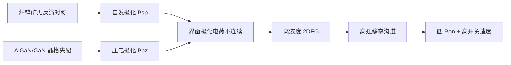

## 概述
### 3.4.3 氮化镓：极化效应与二维电子气

## 核心内容
GaN 通常以纤锌矿结构外延生长在异质衬底（Si、SiC、蓝宝石）上。由于纤锌矿结构缺乏反演对称性，GaN/AlGaN 异质界面存在**自发极化**（spontaneous polarization）和**压电极化**（piezoelectric polarization）。极化不连续在界面处诱导高浓度二维电子气（2DEG）：

$$
n_s = \frac{\sigma_{pol}}{e} - \frac{\varepsilon}{e^2 d}\left(e\phi_B + E_F - \Delta E_c\right)
$$

!!! note "术语解释：纤锌矿、自发极化、压电极化、二维电子气（2DEG）、HEMT"
    - **纤锌矿（wurtzite）**：一种六方晶体结构，缺乏中心反演对称性，因此存在自发极化。
    - **自发极化（spontaneous polarization）**：晶体本身因非中心对称结构而具有的固有电极化。
    - **压电极化（piezoelectric polarization）**：晶格失配产生应变，由于压电效应而产生的附加极化。
    - **二维电子气（2DEG）**：被限制在异质界面附近薄层内的高迁移率电子气。
    - **HEMT（High Electron Mobility Transistor）**：利用 2DEG 作为沟道的高电子迁移率晶体管。

其中 \(\sigma_{pol}\) 为极化电荷面密度，\(\phi_B\) 为肖特基势垒，\(d\) 为 AlGaN 势垒层厚度。2DEG 电子迁移率可达 1500-2000 cm\(^2\)/(V·s)，浓度达 10\(^{13}\) cm\(^{-2}\)，使 GaN HEMT 具有极低的导通电阻和极高的开关速度。

GaN HEMT 按栅极结构分为耗尽型（d-mode）、增强型（e-mode）和 cascode 结构。e-mode GaN 通过 p-GaN 帽层或凹槽栅实现常关特性，更适合功率电子应用。

## 参考
- Wiki extraction

