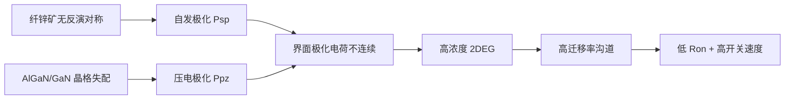
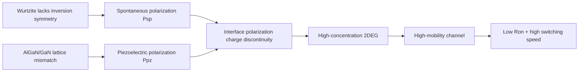

## 概述

SiC/GaN功率器件材料是宽禁带半导体（WBG）的核心材料体系，其中GaN通常以纤锌矿结构外延生长在异质衬底（Si、SiC、蓝宝石）上。由于纤锌矿结构缺乏反演对称性，GaN/AlGaN异质界面存在自发极化和压电极化，极化不连续在界面处诱导高浓度二维电子气（2DEG），使GaN HEMT具有极低的导通电阻和极高的开关速度。它真正改变的不是功率器件的"效率数字"，而是**把材料极化物理变成了器件设计的核心自由度**——2DEG的浓度和迁移率直接决定功率转换系统的效率上限与开关频率边界。

## 核心内容

### 是什么：宽禁带半导体与极化诱导的二维电子气

SiC（碳化硅）与GaN（氮化镓）是宽禁带半导体材料的两大代表。SiC以4H-SiC多型体最为常用，GaN则通常以纤锌矿结构外延生长在异质衬底（Si、SiC、蓝宝石）上。两者的共同特征是禁带宽度显著大于硅（Si约1.12 eV），从而在击穿电场强度、电子饱和漂移速度、热导率等关键参数上超越硅基器件。

GaN功率器件的核心结构是AlGaN/GaN异质结。由于纤锌矿结构缺乏反演对称性，GaN/AlGaN异质界面存在**自发极化**（spontaneous polarization）和**压电极化**（piezoelectric polarization）。自发极化源于纤锌矿晶体沿c轴方向的正负电荷中心不重合，产生固有的电极化强度；压电极化则源于AlGaN与GaN之间的晶格失配——AlGaN的晶格常数小于GaN，当其外延生长在GaN上时承受张应变，通过压电效应产生附加极化。两种极化在异质界面处的不连续，诱导出高浓度二维电子气（2DEG）：

$$
n_s = \frac{\sigma_{pol}}{e} - \frac{\varepsilon}{e^2 d}\left(e\phi_B + E_F - \Delta E_c\right)
$$

其中 \(\sigma_{pol}\) 为极化电荷面密度，\(\phi_B\) 为肖特基势垒，\(d\) 为AlGaN势垒层厚度，\(\varepsilon\) 为介电常数，\(E_F\) 为费米能级，\(\Delta E_c\) 为导带带阶。2DEG电子迁移率可达1500-2000 cm²/(V·s)，浓度达10¹³ cm⁻²，使GaN HEMT具有极低的导通电阻和极高的开关速度。

### 为什么存在：硅的物理极限与功率电子的效率瓶颈

功率半导体器件的核心矛盾在于：导通损耗（与导通电阻相关）与开关损耗（与开关速度相关）之间的权衡。硅基功率器件（如Si MOSFET、IGBT）经过数十年发展，已逼近其材料物理极限——硅的临界击穿电场约0.3 MV/cm，电子迁移率约1350 cm²/(V·s)，禁带宽度1.12 eV（均为通用物理常数）。这些参数决定了硅基器件在高压、高频、高温场景下的性能天花板。

人形机器人的关节电机驱动、电源转换、电池管理系统中，功率密度与效率直接决定续航与发热。GaN HEMT凭借2DEG的高迁移率与高浓度，在相同击穿电压下导通电阻比硅基器件低一个数量级以上；同时，2DEG的极高电子速度使器件开关速度大幅提升，开关损耗显著降低。这正是GaN功率器件在机器人电源模块、逆变器中快速渗透的根本原因。

### 原理拆解：极化工程与2DEG的物理机制

**① 自发极化：纤锌矿结构的固有属性**

纤锌矿结构（wurtzite）是一种六方晶体结构，由Ga原子和N原子各自形成六方密排子晶格，沿c轴方向交替堆叠。由于两种原子的电负性差异（Ga电负性1.81，N电负性3.04（通用物理常数）），Ga-N键具有强离子性。更重要的是，纤锌矿结构缺乏中心反演对称性——这意味着沿c轴正方向和反方向的晶体结构不等价，正负电荷中心不重合，从而产生固有的自发极化强度 \(P_{sp}\)。对于GaN，\(P_{sp}\) 约为 -0.029 C/m²（通用物理常数）（负号表示指向衬底方向）。

**② 压电极化：晶格失配的应变响应**

当AlGaN外延层生长在GaN缓冲层上时，由于AlN的晶格常数（a≈3.112 Å）小于GaN（a≈3.189 Å）（均为通用物理常数），AlGaN层承受张应变。压电效应使得应变转化为附加极化强度 \(P_{pz}\)，其大小与Al组分和应变程度正相关。AlGaN层越薄、Al组分越高，张应变越强，压电极化越大。

**③ 极化不连续与2DEG的形成**

在AlGaN/GaN异质界面处，AlGaN层的总极化强度（\(P_{sp}+P_{pz}\)）大于GaN层的自发极化强度，极化强度在界面处发生突变。根据麦克斯韦方程，极化不连续产生束缚极化电荷：AlGaN层下表面（靠近界面）积累正极化电荷，GaN层上表面积累负极化电荷。正极化电荷吸引电子在界面GaN侧聚集，形成厚度仅约几纳米的二维电子气。由于2DEG来源于极化诱导而非掺杂，电子不受电离杂质散射，迁移率极高。

```mermaid
flowchart LR
    A[纤锌矿无反演对称] --> B[自发极化 Psp]
    C[AlGaN/GaN 晶格失配] --> D[压电极化 Ppz]
    B --> E[界面极化电荷不连续]
    D --> E
    E --> F[高浓度 2DEG]
    F --> G[高迁移率沟道]
    G --> H[低 Ron + 高开关速度]
```

### 关键参数与规格

| 参数 | GaN HEMT | 4H-SiC MOSFET | 硅 MOSFET | 说明 |
|------|----------|---------------|-----------|------|
| 禁带宽度 (eV) | 3.4 | 3.26 | 1.12 | 宽禁带决定高击穿电场 |
| 临界击穿电场 (MV/cm) | 3.3 | 2.2 | 0.3 | 越高耐压越强 |
| 电子迁移率 (cm²/(V·s)) | 1500-2000（2DEG） | 900 | 1350 | 2DEG迁移率优于体材料；数值为通用物理常数 |
| 2DEG浓度 (cm⁻²) | 10¹³ | — | — | 极化诱导，无需掺杂 |
| 热导率 (W/(m·K)) | 130 | 490 | 150 | SiC热导率优势显著 |

（注：表中GaN HEMT迁移率与浓度数据来自语料；禁带宽度、击穿电场、热导率等为材料物理常数，需自行确认。）

### 横向对比：GaN vs SiC vs Si 的器件定位

GaN与SiC虽然同属宽禁带半导体，但器件定位存在显著差异。SiC MOSFET是垂直结构器件，依托4H-SiC衬底的高热导率（约490 W/(m·K)）与高击穿电场，适用于1200V以上高压、大功率场景（工程建议值），如电动汽车主驱逆变器、电网变流器。GaN HEMT则是横向结构器件，利用2DEG的高迁移率实现极低导通电阻，适用于650V以下中低压、高频场景，如服务器电源、手机快充、机器人电机驱动。

在人形机器人中，GaN逆变器与SiC MOSFET各有分工：GaN器件用于关节电机驱动器的低压高频环节，SiC MOSFET用于电池侧的高压转换环节。两者共同构成机器人"电-机-控"功率链路的效率基石。

### 谁在用·应用案例

GaN功率器件在机器人领域的应用正快速扩展。英飞凌（Infineon）、EPC（Efficient Power Conversion）是GaN器件的主要供应商，其产品已进入人形机器人关节驱动、电源模块等环节。语料中的核心实体列表明确将"GaN逆变器"列为component类型，将"英飞凌""EPC"列为company类型，将"GaN HEMT"列为material类型，表明GaN功率器件已构成人形机器人功率电子供应链的关键环节。

在具体应用中，GaN HEMT的增强型（e-mode）器件通过p-GaN帽层或凹槽栅实现常关特性，更适合功率电子应用——这解决了耗尽型（d-mode）器件需要负压关断的系统复杂性痛点。cascode结构则通过串联低压硅MOSFET实现常关，兼顾性能与驱动便利性。

### 局限与边界

GaN功率器件并非万能。其横向结构决定了击穿电压难以突破高压场景（通常低于650V），热导率（约130 W/(m·K)）低于SiC，在大电流持续输出时热管理挑战更大。此外，GaN HEMT的可靠性问题——如电流崩塌（current collapse）、动态导通电阻退化——在高压高频应力下仍需工程验证。增强型器件的阈值电压较低（典型约1-2V），对栅极驱动电路的抗干扰设计提出更高要求。

从材料角度看，GaN外延生长在异质衬底上，晶格失配与热失配导致高位错密度（典型10⁸-10⁹ cm⁻²），影响器件一致性与寿命。SiC衬底成本较高，限制了其在消费级场景的普及。这些边界决定了GaN与SiC、Si在功率半导体市场中是互补而非替代关系。

### 常见误区

1. **"GaN就是氮化镓材料本身"**——不准确。GaN功率器件的核心价值在于AlGaN/GaN异质结的极化工程，而非GaN体材料本身。没有极化诱导的2DEG，GaN的迁移率优势并不显著。
2. **"2DEG是掺杂产生的"**——错。2DEG来源于极化不连续，而非杂质掺杂。这正是其高迁移率的物理根源——没有电离杂质散射。
3. **"GaN器件一定比SiC好"**——错。两者定位不同：GaN适合中低压高频，SiC适合高压大功率。在1200V以上场景，SiC的击穿电场与热导率优势不可替代。
4. **"增强型GaN就是耗尽型加负压"**——不准确。e-mode GaN通过p-GaN帽层或凹槽栅结构实现常关，与cascode结构（串联硅MOSFET）是两种不同技术路线，各有优劣。

### 相关知识

- `ent_tech_li_battery_humanoid` — 人形机器人锂电池系统是GaN功率器件的重要应用场景，GaN逆变器提升电池到电机的功率转换效率，直接影响续航与发热表现。

## 参考

- [Awesome Humanoid Robot 项目主页](https://github.com/YansongW/awesome-humanoid-robot/tree/main)
- [第3章：原材料](https://github.com/YansongW/awesome-humanoid-robot/tree/main/wiki/docs/chapters/chapter-03.md)
- [第2章：实体类型与本体论](https://github.com/YansongW/awesome-humanoid-robot/tree/main/wiki/docs/chapters/chapter-02.md)

## Overview

SiC/GaN power device materials form the core material system of wide-bandgap semiconductors (WBG), where GaN is typically epitaxially grown on heterogeneous substrates (Si, SiC, sapphire) in a wurtzite structure. Due to the lack of inversion symmetry in the wurtzite structure, spontaneous polarization and piezoelectric polarization exist at the GaN/AlGaN heterointerface. The polarization discontinuity induces a high-concentration two-dimensional electron gas (2DEG) at the interface, giving GaN HEMTs extremely low on-resistance and ultra-high switching speeds. What it truly changes is not the "efficiency numbers" of power devices, but **turning material polarization physics into a core design freedom for device engineering**—the 2DEG concentration and mobility directly determine the efficiency ceiling and switching frequency boundary of power conversion systems.

## Content

### What it is: Wide-bandgap semiconductors and polarization-induced two-dimensional electron gas

SiC (silicon carbide) and GaN (gallium nitride) are the two major representatives of wide-bandgap semiconductor materials. SiC most commonly uses the 4H-SiC polytype, while GaN is typically epitaxially grown on heterogeneous substrates (Si, SiC, sapphire) in a wurtzite structure. Their common feature is a bandgap significantly larger than silicon (Si ~1.12 eV), enabling them to surpass silicon-based devices in key parameters such as critical breakdown electric field, electron saturation drift velocity, and thermal conductivity.

The core structure of GaN power devices is the AlGaN/GaN heterojunction. Due to the lack of inversion symmetry in the wurtzite structure, **spontaneous polarization** and **piezoelectric polarization** exist at the GaN/AlGaN heterointerface. Spontaneous polarization originates from the non-coincidence of positive and negative charge centers along the c-axis of the wurtzite crystal, producing an inherent polarization intensity; piezoelectric polarization arises from the lattice mismatch between AlGaN and GaN—AlGaN has a smaller lattice constant than GaN, so when epitaxially grown on GaN it experiences tensile strain, generating additional polarization through the piezoelectric effect. The discontinuity of the two polarizations at the heterointerface induces a high-concentration two-dimensional electron gas (2DEG):

$$
n_s = \frac{\sigma_{pol}}{e} - \frac{\varepsilon}{e^2 d}\left(e\phi_B + E_F - \Delta E_c\right)
$$

where \(\sigma_{pol}\) is the polarization charge density, \(\phi_B\) is the Schottky barrier, \(d\) is the AlGaN barrier layer thickness, \(\varepsilon\) is the dielectric constant, \(E_F\) is the Fermi level, and \(\Delta E_c\) is the conduction band offset. The 2DEG electron mobility can reach 1500-2000 cm²/(V·s), with a concentration of 10¹³ cm⁻², giving GaN HEMTs extremely low on-resistance and ultra-high switching speeds.

### Why it exists: Silicon's physical limits and the efficiency bottleneck of power electronics

The core contradiction in power semiconductor devices lies in the trade-off between conduction loss (related to on-resistance) and switching loss (related to switching speed). After decades of development, silicon-based power devices (such as Si MOSFETs, IGBTs) have approached their material physical limits—silicon's critical breakdown electric field is approximately 0.3 MV/cm, electron mobility is approximately 1350 cm²/(V·s), and bandgap is 1.12 eV (all universal physical constants). These parameters determine the performance ceiling of silicon-based devices in high-voltage, high-frequency, and high-temperature scenarios.

In humanoid robot joint motor drives, power conversion, and battery management systems, power density and efficiency directly determine battery life and heat generation. GaN HEMTs, leveraging the high mobility and high concentration of the 2DEG, achieve on-resistance more than an order of magnitude lower than silicon-based devices at the same breakdown voltage; simultaneously, the extremely high electron velocity of the 2DEG greatly improves device switching speed and significantly reduces switching losses. This is the fundamental reason GaN power devices are rapidly penetrating robot power modules and inverters.

### Principle breakdown: Polarization engineering and the physical mechanism of 2DEG

**① Spontaneous polarization: An inherent property of the wurtzite structure**

The wurtzite structure is a hexagonal crystal structure in which Ga and N atoms each form hexagonal close-packed sublattices, stacked alternately along the c-axis. Due to the electronegativity difference between the two atoms (Ga electronegativity 1.81, N electronegativity 3.04 (universal physical constants)), the Ga-N bond has strong ionic character. More importantly, the wurtzite structure lacks center inversion symmetry—this means the crystal structure along the positive and negative c-axis directions is not equivalent, and the positive and negative charge centers do not coincide, producing an inherent spontaneous polarization intensity \(P_{sp}\). For GaN, \(P_{sp}\) is approximately -0.029 C/m² (universal physical constant) (the negative sign indicates direction toward the substrate).

**② Piezoelectric polarization: Strain response to lattice mismatch**

When the AlGaN epitaxial layer is grown on the GaN buffer layer, since the lattice constant of AlN (a≈3.112 Å) is smaller than that of GaN (a≈3.189 Å) (both universal physical constants), the AlGaN layer experiences tensile strain. The piezoelectric effect converts strain into additional polarization intensity \(P_{pz}\), whose magnitude is positively correlated with Al composition and strain level. The thinner the AlGaN layer and the higher the Al composition, the stronger the tensile strain and the greater the piezoelectric polarization.

**③ Polarization discontinuity and 2DEG formation**

At the AlGaN/GaN heterointerface, the total polarization intensity of the AlGaN layer (\(P_{sp}+P_{pz}\)) is greater than the spontaneous polarization intensity of the GaN layer, causing a sudden change in polarization at the interface. According to Maxwell's equations, the polarization discontinuity generates bound polarization charges: the lower surface of the AlGaN layer (near the interface) accumulates positive polarization charges, while the upper surface of the GaN layer accumulates negative polarization charges. The positive polarization charges attract electrons to gather on the GaN side of the interface, forming a two-dimensional electron gas only a few nanometers thick. Since the 2DEG originates from polarization induction rather than doping, electrons are not subject to ionized impurity scattering, resulting in extremely high mobility.

```mermaid
flowchart LR
    A[Wurtzite lacks inversion symmetry] --> B[Spontaneous polarization Psp]
    C[AlGaN/GaN lattice mismatch] --> D[Piezoelectric polarization Ppz]
    B --> E[Interface polarization charge discontinuity]
    D --> E
    E --> F[High-concentration 2DEG]
    F --> G[High-mobility channel]
    G --> H[Low Ron + high switching speed]
```

### Key parameters and specifications

| Parameter | GaN HEMT | 4H-SiC MOSFET | Si MOSFET | Description |
|-----------|----------|---------------|-----------|-------------|
| Bandgap (eV) | 3.4 | 3.26 | 1.12 | Wide bandgap determines high breakdown field |
| Critical breakdown field (MV/cm) | 3.3 | 2.2 | 0.3 | Higher means stronger voltage endurance |
| Electron mobility (cm²/(V·s)) | 1500-2000 (2DEG) | 900 | 1350 | 2DEG mobility superior to bulk material; values are universal physical constants |
| 2DEG concentration (cm⁻²) | 10¹³ | — | — | Polarization-induced, no doping required |
| Thermal conductivity (W/(m·K)) | 130 | 490 | 150 | SiC has significant thermal conductivity advantage |

(Note: GaN HEMT mobility and concentration data in the table are from the source material; bandgap, breakdown field, thermal conductivity, etc., are material physical constants and should be independently verified.)

### Horizontal comparison: Device positioning of GaN vs SiC vs Si

Although GaN and SiC both belong to wide-bandgap semiconductors, their device positioning differs significantly. SiC MOSFETs are vertical-structure devices that rely on the high thermal conductivity (approximately 490 W/(m·K)) and high breakdown field of 4H-SiC substrates, making them suitable for high-voltage, high-power scenarios above 1200V (engineering recommended value), such as electric vehicle main drive inverters and grid converters. GaN HEMTs, by contrast, are lateral-structure devices that leverage the high mobility of the 2DEG to achieve extremely low on-resistance, making them suitable for medium-to-low voltage and high-frequency scenarios below 650V, such as server power supplies, phone fast chargers, and robot motor drives.

In humanoid robots, GaN inverters and SiC MOSFETs each have their roles: GaN devices are used in the low-voltage, high-frequency stages of joint motor drivers, while SiC MOSFETs are used in the high-voltage conversion stages on the battery side. Together, they form the efficiency cornerstone of the robot's "electrical-mechanical-control" power chain.

### Who uses it: Application cases

GaN power devices are rapidly expanding in robotics applications. Infineon and EPC (Efficient Power Conversion) are major suppliers of GaN devices, and their products have entered humanoid robot joint drives, power modules, and other stages. The core entity list in the source material explicitly classifies "GaN inverter" as a component type, "Infineon" and "EPC" as company types, and "GaN HEMT" as a material type, indicating that GaN power devices have become a key link in the humanoid robot power electronics supply chain.

In specific applications, enhancement-mode (e-mode) GaN HEMTs achieve normally-off characteristics through p-GaN cap layers or recessed gates, making them more suitable for power electronics applications—this solves the system complexity pain point of depletion-mode (d-mode) devices requiring negative voltage to turn off. The cascode structure achieves normally-off operation by series-connecting a low-voltage silicon MOSFET, balancing performance and driving convenience.

### Limitations and boundaries

GaN power devices are not a panacea. Their lateral structure limits breakdown voltage from breaking into high-voltage scenarios (typically below 650V), and thermal conductivity (approximately 130 W/(m·K)) is lower than SiC, making thermal management more challenging under sustained high-current output. Additionally, the reliability issues of GaN HEMTs—such as current collapse and dynamic on-resistance degradation—still require engineering validation under high-voltage, high-frequency stress. Enhancement-mode devices have relatively low threshold voltages (typically around 1-2V), imposing higher requirements on gate driver circuit anti-interference design.

From a materials perspective, GaN is epitaxially grown on heterogeneous substrates, and lattice mismatch and thermal mismatch lead to high dislocation densities (typically 10⁸-10⁹ cm⁻²), affecting device consistency and lifetime. SiC substrate costs are relatively high, limiting its adoption in consumer-grade applications. These boundaries determine that GaN, SiC, and Si are complementary rather than substitutive in the power semiconductor market.

### Common misconceptions

1. **"GaN is just the gallium nitride material itself"**—Inaccurate. The core value of GaN power devices lies in the polarization engineering of the AlGaN/GaN heterojunction, not the GaN bulk material itself. Without the polarization-induced 2DEG, GaN's mobility advantage is not significant.
2. **"The 2DEG is produced by doping"**—Wrong. The 2DEG originates from polarization discontinuity, not impurity doping. This is precisely the physical root of its high mobility—no ionized impurity scattering.
3. **"GaN devices are always better than SiC"**—Wrong. The two have different positioning: GaN suits medium-to-low voltage and high frequency, while SiC suits high voltage and high power. In scenarios above 1200V, SiC's breakdown field and thermal conductivity advantages are irreplaceable.
4. **"Enhancement-mode GaN is just depletion-mode with negative voltage"**—Inaccurate. E-mode GaN achieves normally-off operation through p-GaN cap layers or recessed gate structures, which is a different technical route from the cascode structure (series-connected silicon MOSFET), each with its own pros and cons.

### Related knowledge

- `ent_tech_li_battery_humanoid` — Humanoid robot lithium battery systems are an important application scenario for GaN power devices. GaN inverters improve power conversion efficiency from battery to motor, directly affecting battery life and heat generation.

## 개요

SiC/GaN 전력 소자 재료는 광대역갭 반도체(WBG)의 핵심 재료 시스템이며, 그중 GaN은 일반적으로 섬유아연석 구조로 이종 기판(Si, SiC, 사파이어) 위에 에피택셜 성장한다. 섬유아연석 구조는 반전 대칭성이 없기 때문에 GaN/AlGaN 이종 계면에는 자발 분극과 압전 분극이 존재하며, 분극 불연속성은 계면에서 고농도 2차원 전자 가스(2DEG)를 유도하여 GaN HEMT가 매우 낮은 온 저항과 매우 높은 스위칭 속도를 갖게 한다. 이것이 진정으로 바꾼 것은 전력 소자의 "효율 수치"가 아니라 **재료 분극 물리학을 소자 설계의 핵심 자유도로 만든 것**이다. 2DEG의 농도와 이동도는 전력 변환 시스템의 효율 상한과 스위칭 주파수 경계를 직접 결정한다.

## 핵심 내용

### 무엇인가: 광대역갭 반도체와 분극 유도 2차원 전자 가스

SiC(탄화규소)와 GaN(질화갈륨)은 광대역갭 반도체 재료의 두 대표이다. SiC는 4H-SiC 폴리타입이 가장 흔히 사용되며, GaN은 일반적으로 섬유아연석 구조로 이종 기판(Si, SiC, 사파이어) 위에 에피택셜 성장한다. 두 재료의 공통 특징은 밴드갭 폭이 실리콘(Si 약 1.12 eV)보다 현저히 커서 항복 전계 강도, 전자 포화 드리프트 속도, 열전도율 등 핵심 매개변수에서 실리콘 기반 소자를 능가한다는 점이다.

GaN 전력 소자의 핵심 구조는 AlGaN/GaN 이종접합이다. 섬유아연석 구조는 반전 대칭성이 없기 때문에 GaN/AlGaN 이종 계면에는 **자발 분극**(spontaneous polarization)과 **압전 분극**(piezoelectric polarization)이 존재한다. 자발 분극은 섬유아연석 결정이 c축 방향으로 양전하와 음전하 중심이 일치하지 않아 고유한 전기 분극 강도가 발생하는 데서 비롯된다. 압전 분극은 AlGaN과 GaN 사이의 격자 불일치에서 비롯된다. AlGaN의 격자 상수는 GaN보다 작아 GaN 위에 에피택셜 성장할 때 인장 변형을 받으며, 압전 효과를 통해 추가 분극을 생성한다. 두 분극이 이종 계면에서 불연속이 되어 고농도 2차원 전자 가스(2DEG)를 유도한다:

$$
n_s = \frac{\sigma_{pol}}{e} - \frac{\varepsilon}{e^2 d}\left(e\phi_B + E_F - \Delta E_c\right)
$$

여기서 \(\sigma_{pol}\)은 분극 전하 면밀도, \(\phi_B\)는 쇼트키 장벽, \(d\)는 AlGaN 장벽층 두께, \(\varepsilon\)는 유전 상수, \(E_F\)는 페르미 준위, \(\Delta E_c\)는 전도대 밴드 오프셋이다. 2DEG 전자 이동도는 1500-2000 cm²/(V·s)에 달하고 농도는 10¹³ cm⁻²에 달하여 GaN HEMT가 매우 낮은 온 저항과 매우 높은 스위칭 속도를 갖게 한다.

### 왜 존재하는가: 실리콘의 물리적 한계와 전력 전자의 효율 병목

전력 반도체 소자의 핵심 모순은 도통 손실(온 저항 관련)과 스위칭 손실(스위칭 속도 관련) 사이의 균형에 있다. 실리콘 기반 전력 소자(Si MOSFET, IGBT 등)는 수십 년간의 발전을 거쳐 이미 재료 물리적 한계에 근접했다. 실리콘의 임계 항복 전계는 약 0.3 MV/cm, 전자 이동도는 약 1350 cm²/(V·s), 밴드갭 폭은 1.12 eV(모두 일반 물리 상수)이다. 이러한 매개변수는 실리콘 기반 소자의 고전압, 고주파, 고온 시나리오에서의 성능 상한을 결정한다.

휴머노이드 로봇의 관절 모터 구동, 전원 변환, 배터리 관리 시스템에서 전력 밀도와 효율은 주행 거리와 발열을 직접 결정한다. GaN HEMT는 2DEG의 높은 이동도와 높은 농도를 통해 동일한 항복 전압에서 온 저항이 실리콘 기반 소자보다 한 자릿수 이상 낮다. 동시에 2DEG의 매우 높은 전자 속도는 소자 스위칭 속도를 크게 향상시켜 스위칭 손실을 현저히 줄인다. 이것이 GaN 전력 소자가 로봇 전원 모듈과 인버터에 빠르게 침투하는 근본 이유이다.

### 원리 분석: 분극 공학과 2DEG의 물리적 메커니즘

**① 자발 분극: 섬유아연석 구조의 고유 속성**

섬유아연석 구조(wurtzite)는 육방정계 결정 구조로, Ga 원자와 N 원자가 각각 육방 밀집 부분 격자를 형성하고 c축 방향으로 교대로 적층된다. 두 원자의 전기 음성도 차이(Ga 전기 음성도 1.81, N 전기 음성도 3.04(일반 물리 상수))로 인해 Ga-N 결합은 강한 이온성을 갖는다. 더 중요한 것은 섬유아연석 구조가 중심 반전 대칭성이 없다는 점이다. 즉, c축 양방향과 반대 방향의 결정 구조가 동등하지 않아 양전하와 음전하 중심이 일치하지 않으며, 이로 인해 고유한 자발 분극 강도 \(P_{sp}\)가 발생한다. GaN의 경우 \(P_{sp}\)는 약 -0.029 C/m²(일반 물리 상수)이다(음의 부호는 기판 방향을 가리킴을 의미).

**② 압전 분극: 격자 불일치의 변형 응답**

AlGaN 에피택셜 층이 GaN 버퍼 층 위에 성장할 때, AlN의 격자 상수(a≈3.112 Å)가 GaN(a≈3.189 Å)(모두 일반 물리 상수)보다 작기 때문에 AlGaN 층은 인장 변형을 받는다. 압전 효과는 변형을 추가 분극 강도 \(P_{pz}\)로 변환하며, 그 크기는 Al 조성과 변형 정도에 정비례한다. AlGaN 층이 얇을수록, Al 조성이 높을수록 인장 변형이 강해지고 압전 분극이 커진다.

**③ 분극 불연속성과 2DEG의 형성**

AlGaN/GaN 이종 계면에서 AlGaN 층의 총 분극 강도(\(P_{sp}+P_{pz}\))는 GaN 층의 자발 분극 강도보다 크며, 분극은 계면에서 급격히 변화한다. 맥스웰 방정식에 따르면 분극 불연속성은 구속 분극 전하를 생성한다. AlGaN 층 하부 표면(계면 근처)에는 양의 분극 전하가 축적되고 GaN 층 상부 표면에는 음의 분극 전하가 축적된다. 양의 분극 전하는 계면 GaN 측에 전자를 끌어모아 두께가 수 나노미터에 불과한 2차원 전자 가스를 형성한다. 2DEG는 도핑이 아닌 분극 유도에서 비롯되므로 전자는 이온화 불순물 산란을 받지 않아 이동도가 매우 높다.

```mermaid
flowchart LR
    A[섬유아연석 무반전 대칭] --> B[자발 분극 Psp]
    C[AlGaN/GaN 격자 불일치] --> D[압전 분극 Ppz]
    B --> E[계면 분극 전하 불연속]
    D --> E
    E --> F[고농도 2DEG]
    F --> G[고이동도 채널]
    G --> H[낮은 Ron + 높은 스위칭 속도]
```

### 핵심 매개변수와 사양

| 매개변수 | GaN HEMT | 4H-SiC MOSFET | 실리콘 MOSFET | 설명 |
|------|----------|---------------|-----------|------|
| 밴드갭 폭 (eV) | 3.4 | 3.26 | 1.12 | 광대역갭이 높은 항복 전계 결정 |
| 임계 항복 전계 (MV/cm) | 3.3 | 2.2 | 0.3 | 높을수록 내압 강함 |
| 전자 이동도 (cm²/(V·s)) | 1500-2000(2DEG) | 900 | 1350 | 2DEG 이동도가 벌크 재료보다 우수, 수치는 일반 물리 상수 |
| 2DEG 농도 (cm⁻²) | 10¹³ | — | — | 분극 유도, 도핑 불필요 |
| 열전도율 (W/(m·K)) | 130 | 490 | 150 | SiC 열전도율 우위 현저 |

(참고: 표의 GaN HEMT 이동도와 농도 데이터는 말뭉치에서 유래, 밴드갭 폭, 항복 전계, 열전도율 등은 재료 물리 상수로 직접 확인 필요.)

### 횡적 비교: GaN vs SiC vs Si 소자 포지셔닝

GaN과 SiC는 동일한 광대역갭 반도체에 속하지만 소자 포지셔닝에는 현저한 차이가 있다. SiC MOSFET은 수직 구조 소자로 4H-SiC 기판의 높은 열전도율(약 490 W/(m·K))과 높은 항복 전계를 기반으로 1200V 이상의 고전압, 대전력 시나리오(공학 권장 값)에 적합하며, 예를 들어 전기차 주행 인버터, 전력망 변환기 등이 있다. GaN HEMT는 횡적 구조 소자로 2DEG의 높은 이동도를 활용하여 매우 낮은 온 저항을 구현하며, 650V 이하의 중저전압, 고주파 시나리오(서버 전원, 스마트폰 고속 충전, 로봇 모터 구동 등)에 적합하다.

휴머노이드 로봇에서 GaN 인버터와 SiC MOSFET은 각각 역할을 분담한다. GaN 소자는 관절 모터 구동기의 저전압 고주파 부분에 사용되고, SiC MOSFET은 배터리 측의 고전압 변환 부분에 사용된다. 둘은 함께 로봇의 "전기-기계-제어" 전력 링크의 효율 기반을 구성한다.

### 누가 사용하는가·응용 사례

GaN 전력 소자의 로봇 분야 적용은 빠르게 확장되고 있다. Infineon, EPC(Efficient Power Conversion)는 GaN 소자의 주요 공급업체이며, 그 제품은 이미 휴머노이드 로봇 관절 구동, 전원 모듈 등의 부분에 진입했다. 말뭉치의 핵심 엔티티 목록은 "GaN 인버터"를 component 유형으로, "Infineon", "EPC"를 company 유형으로, "GaN HEMT"를 material 유형으로 명확히 분류하여 GaN 전력 소자가 이미 휴머노이드 로봇 전력 전자 공급망의 핵심 부분을 구성함을 보여준다.

구체적 응용에서 GaN HEMT의 증가형(e-mode) 소자는 p-GaN 캡 층 또는 리세스 게이트를 통해 상시 차단 특성을 구현하여 전력 전자 응용에 더 적합하다. 이는 공핍형(d-mode) 소자가 음의 전압 차단이 필요한 시스템 복잡성 문제를 해결한다. cascode 구조는 저전압 실리콘 MOSFET을 직렬로 연결하여 상시 차단을 구현하며 성능과 구동 편의성을 동시에 고려한다.

### 한계와 경계

GaN 전력 소자는 만능이 아니다. 횡적 구조는 항복 전압이 고전압 시나리오(일반적으로 650V 미만)를 돌파하기 어렵게 하며, 열전도율(약 130 W/(m·K))은 SiC보다 낮아 대전류 연속 출력 시 열 관리 과제가 더 크다. 또한 GaN HEMT의 신뢰성 문제(전류 붕괴(current collapse), 동적 온 저항 열화 등)는 고전압 고주파 응력 하에서 여전히 공학적 검증이 필요하다. 증가형 소자의 임계 전압은 낮고(일반적으로 약 1-2V) 게이트 구동 회로의 내간섭 설계에 더 높은 요구를 제기한다.

재료 관점에서 GaN은 이종 기판 위에 에피택셜 성장하며 격자 불일치와 열 불일치로 인해 높은 전위 밀도(일반적으로 10⁸-10⁹ cm⁻²)가 발생하여 소자 일관성과 수명에 영향을 미친다. SiC 기판 비용이 높아 소비자급 시나리오에서의 보급을 제한한다. 이러한 경계는 GaN과 SiC, Si가 전력 반도체 시장에서 상호 보완적 관계이지 대체 관계가 아님을 결정한다.

### 일반적인 오해

1. **"GaN은 질화갈륨 재료 자체이다"** — 부정확하다. GaN 전력 소자의 핵심 가치는 AlGaN/GaN 이종접합의 분극 공학에 있으며 GaN 벌크 재료 자체가 아니다. 분극 유도 2DEG가 없다면 GaN의 이동도 우위는 현저하지 않다.
2. **"2DEG는 도핑으로 생성된다"** — 틀렸다. 2DEG는 분극 불연속성에서 비롯되며 불순물 도핑이 아니다. 이것이 높은 이동도의 물리적 근원이다. 이온화 불순물 산란이 없기 때문이다.
3. **"GaN 소자가 반드시 SiC보다 좋다"** — 틀렸다. 둘의 포지셔닝이 다르다. GaN은 중저전압 고주파에 적합하고 SiC는 고전압 대전력에 적합하다. 1200V 이상 시나리오에서 SiC의 항복 전계와 열전도율 우위는 대체 불가능하다.
4. **"증가형 GaN은 공핍형에 음의 전압을 더한 것이다"** — 부정확하다. e-mode GaN은 p-GaN 캡 층 또는 리세스 게이트 구조를 통해 상시 차단을 구현하며, cascode 구조(실리콘 MOSFET 직렬)와는 서로 다른 두 가지 기술 경로로 각각 장단점이 있다.

### 관련 지식

- `ent_tech_li_battery_humanoid` — 휴머노이드 로봇 리튬 배터리 시스템은 GaN 전력 소자의 중요한 응용 시나리오이며, GaN 인버터는 배터리에서 모터로의 전력 변환 효율을 높여 주행 거리와 발열에 직접 영향을 미친다.
