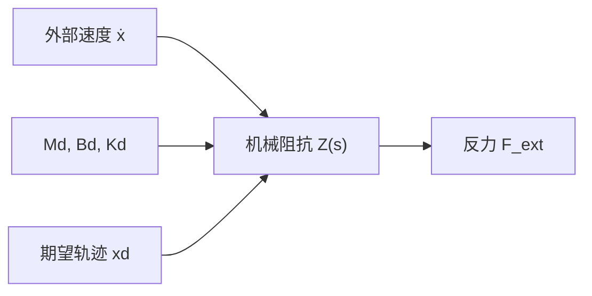
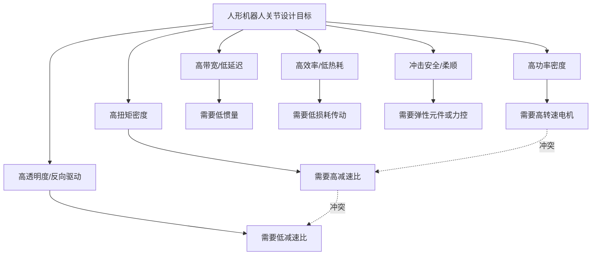

## 概述
阻抗控制的物理基础：从质点-弹簧-阻尼到端口特性相关内容如下。

#### 阻抗控制的物理基础：从质点-弹簧-阻尼到端口特性
把机器人末端抽象为一个质量-弹簧-阻尼单元，其动力学方程可由牛顿第二定律直接写出：

\[
M_d \, \ddot{x} + B_d \, \dot{x} + K_d \, (x - x_d) = F_{ext}
\]

其中：
- \(M_d\)：期望等效质量（kg），决定碰撞时加速度响应；
- \(B_d\)：期望等效阻尼（N·s/m 或 kg/s），决定能量耗散速率；
- \(K_d\)：期望等效刚度（N/m），决定位置偏差与恢复力的关系；
- \(x_d\)：期望轨迹位置（m）；
- \(F_{ext}\)：环境作用于机器人端的外部力（N）。

在拉普拉斯域，该方程可写成机器人端口的**机械阻抗**

\[
Z(s) = \frac{F_{ext}(s)}{\dot{X}(s)} = M_d s + B_d + \frac{K_d}{s}
\]

其物理意义是：外界以速度 \(\dot{x}\) “推动”机器人端口时，机器人以力 \(F_{ext}\) 回应；阻抗 \(Z(s)\) 就是力与速度之间的动态传递函数。阻抗越大，同样速度扰动产生的反力越大，机器人表现得越“刚硬”；阻抗越小，反力越小，表现越“柔顺”。

**数值示例**：设期望参数为 \(M_d=2\ \text{kg}\)、\(B_d=50\ \text{N·s/m}\)、\(K_d=2000\ \text{N/m}\)。当机器人末端被外界以 \(0.01\ \text{m/s}\) 的恒定速度推动时，稳态下弹簧项主导，接触力为

\[
F_{ext} \approx K_d \Delta x
\]

若推动 0.1 s，位移增量 \(\Delta x \approx 0.001\ \text{m}\)，则

\[
F_{ext} \approx 2000 \times 0.001 = 2\ \text{N}
\]

而无阻抗控制时，若机器人刚性位置环刚度高达 \(K_{pos}=10^5\ \text{N/m}\)，同样位移将产生

\[
F_{ext} \approx 10^5 \times 0.001 = 100\ \text{N}
\]

这说明阻抗控制可把潜在碰撞力降低约两个数量级。更深入的阻抗控制实现与无源性分析见第 4.5.6 节；与整机平衡/接触力规划的关系见第 6 章。

!!! note "术语解释：机械阻抗、拉普拉斯域、等效质量、等效阻尼、等效刚度"
    - **机械阻抗（mechanical impedance）**：力与速度之间的动态传递函数，单位 N·s/m。
    - **拉普拉斯域（Laplace domain）**：用复变量 \(s\) 描述线性时不变系统动态的频率/算子域。
    - **等效质量（equivalent mass）**：阻抗控制中机器人端口表现出的虚拟质量。
    - **等效阻尼（equivalent damping）**：阻抗控制中机器人端口表现出的虚拟阻尼，决定能量耗散。
    - **等效刚度（equivalent stiffness）**：阻抗控制中机器人端口表现出的虚拟弹簧刚度。

!!! note "术语解释：柔顺性、阻抗、导纳、人机交互安全"
    - **柔顺性（compliance）**：机构在外力作用下产生形变的能力。柔顺应理解为"刚度低"，例如弹簧比钢棒更柔顺。
    - **阻抗（impedance）**：机器人对外界施加的"阻力特性"，即力与位移/速度之间的关系。阻抗控制让机器人对外表现为一个设定的质量-弹簧-阻尼系统。
    - **导纳（admittance）**：阻抗的倒数，表示运动对外力的响应。位置控制为主的系统常用导纳控制实现力调节。
    - **人机交互安全（human-robot interaction safety）**：通过机械柔顺、力限制、碰撞检测与低惯性设计，把潜在碰撞造成的伤害降到可接受范围。

综合而言，一个优秀的人形机器人关节需要在图 4.1 所示的多维空间中取得折中。

## 参考
- 详见 chapter-04.md。

