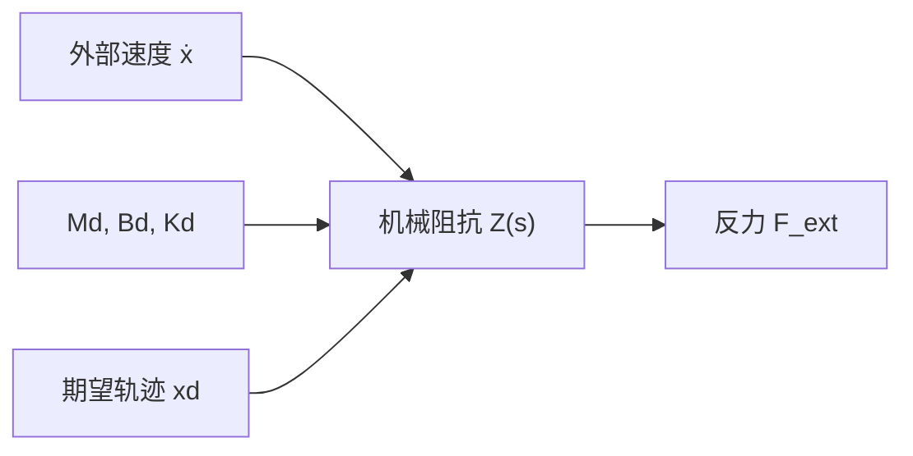
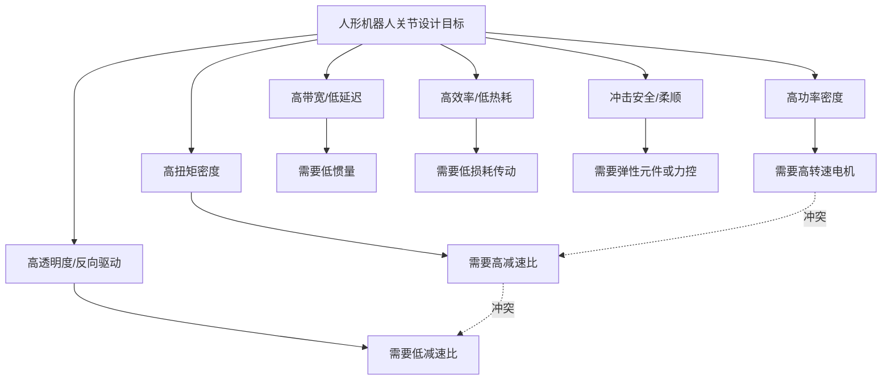
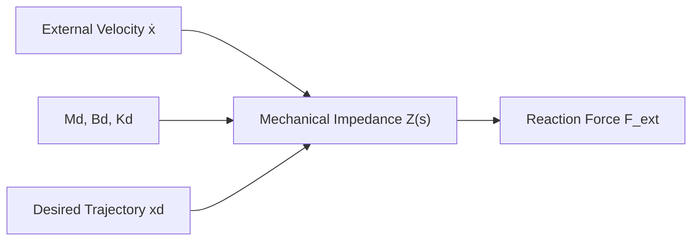

## 概述
阻抗控制的物理基础：从质点-弹簧-阻尼到端口特性相关内容如下。
## 核心内容
#### 阻抗控制的物理基础：从质点-弹簧-阻尼到端口特性
把机器人末端抽象为一个质量-弹簧-阻尼单元，其动力学方程可由牛顿第二定律直接写出：

\[
M_d \, \ddot{x} + B_d \, \dot{x} + K_d \, (x - x_d) = F_{ext}
\]

其中：
- \(M_d\)：期望等效质量（kg），决定碰撞时加速度响应；
- \(B_d\)：期望等效阻尼（N·s/m 或 kg/s），决定能量耗散速率；
- \(K_d\)：期望等效刚度（N/m），决定位置偏差与恢复力的关系；
- \(x_d\)：期望轨迹位置（m）；
- \(F_{ext}\)：环境作用于机器人端的外部力（N）。

在拉普拉斯域，该方程可写成机器人端口的**机械阻抗**

\[
Z(s) = \frac{F_{ext}(s)}{\dot{X}(s)} = M_d s + B_d + \frac{K_d}{s}
\]

其物理意义是：外界以速度 \(\dot{x}\) “推动”机器人端口时，机器人以力 \(F_{ext}\) 回应；阻抗 \(Z(s)\) 就是力与速度之间的动态传递函数。阻抗越大，同样速度扰动产生的反力越大，机器人表现得越“刚硬”；阻抗越小，反力越小，表现越“柔顺”。

**数值示例**：设期望参数为 \(M_d=2\ \text{kg}\)、\(B_d=50\ \text{N·s/m}\)、\(K_d=2000\ \text{N/m}\)。当机器人末端被外界以 \(0.01\ \text{m/s}\) 的恒定速度推动时，稳态下弹簧项主导，接触力为

\[
F_{ext} \approx K_d \Delta x
\]

若推动 0.1 s，位移增量 \(\Delta x \approx 0.001\ \text{m}\)，则

\[
F_{ext} \approx 2000 \times 0.001 = 2\ \text{N}
\]

而无阻抗控制时，若机器人刚性位置环刚度高达 \(K_{pos}=10^5\ \text{N/m}\)，同样位移将产生

\[
F_{ext} \approx 10^5 \times 0.001 = 100\ \text{N}
\]

这说明阻抗控制可把潜在碰撞力降低约两个数量级。更深入的阻抗控制实现与无源性分析见第 4.5.6 节；与整机平衡/接触力规划的关系见第 6 章。



!!! note "术语解释：机械阻抗、拉普拉斯域、等效质量、等效阻尼、等效刚度"
    - **机械阻抗（mechanical impedance）**：力与速度之间的动态传递函数，单位 N·s/m。
    - **拉普拉斯域（Laplace domain）**：用复变量 \(s\) 描述线性时不变系统动态的频率/算子域。
    - **等效质量（equivalent mass）**：阻抗控制中机器人端口表现出的虚拟质量。
    - **等效阻尼（equivalent damping）**：阻抗控制中机器人端口表现出的虚拟阻尼，决定能量耗散。
    - **等效刚度（equivalent stiffness）**：阻抗控制中机器人端口表现出的虚拟弹簧刚度。

!!! note "术语解释：柔顺性、阻抗、导纳、人机交互安全"
    - **柔顺性（compliance）**：机构在外力作用下产生形变的能力。柔顺应理解为"刚度低"，例如弹簧比钢棒更柔顺。
    - **阻抗（impedance）**：机器人对外界施加的"阻力特性"，即力与位移/速度之间的关系。阻抗控制让机器人对外表现为一个设定的质量-弹簧-阻尼系统。
    - **导纳（admittance）**：阻抗的倒数，表示运动对外力的响应。位置控制为主的系统常用导纳控制实现力调节。
    - **人机交互安全（human-robot interaction safety）**：通过机械柔顺、力限制、碰撞检测与低惯性设计，把潜在碰撞造成的伤害降到可接受范围。

综合而言，一个优秀的人形机器人关节需要在图 4.1 所示的多维空间中取得折中。



## 参考
- 详见 chapter-04.md。

## Overview
The physical foundation of impedance control: from mass-spring-damper to port characteristics. The relevant content is as follows.
## Content
#### The Physical Foundation of Impedance Control: From Mass-Spring-Damper to Port Characteristics
Abstracting the robot end-effector as a mass-spring-damper unit, its dynamic equation can be directly written using Newton's second law:

\[
M_d \, \ddot{x} + B_d \, \dot{x} + K_d \, (x - x_d) = F_{ext}
\]

where:
- \(M_d\): Desired equivalent mass (kg), determining the acceleration response during collision;
- \(B_d\): Desired equivalent damping (N·s/m or kg/s), determining the energy dissipation rate;
- \(K_d\): Desired equivalent stiffness (N/m), determining the relationship between position deviation and restoring force;
- \(x_d\): Desired trajectory position (m);
- \(F_{ext}\): External force (N) exerted by the environment on the robot end-effector.

In the Laplace domain, this equation can be expressed as the **mechanical impedance** of the robot port:

\[
Z(s) = \frac{F_{ext}(s)}{\dot{X}(s)} = M_d s + B_d + \frac{K_d}{s}
\]

Its physical meaning is: when the external world "pushes" the robot port at velocity \(\dot{x}\), the robot responds with force \(F_{ext}\); the impedance \(Z(s)\) is the dynamic transfer function between force and velocity. The larger the impedance, the greater the reaction force generated by the same velocity disturbance, and the "stiffer" the robot behaves; the smaller the impedance, the smaller the reaction force, and the "softer" the behavior.

**Numerical Example**: Assume the desired parameters are \(M_d=2\ \text{kg}\), \(B_d=50\ \text{N·s/m}\), \(K_d=2000\ \text{N/m}\). When the robot end-effector is pushed by the external world at a constant velocity of \(0.01\ \text{m/s}\), the spring term dominates in steady state, and the contact force is:

\[
F_{ext} \approx K_d \Delta x
\]

If pushed for 0.1 s, the displacement increment \(\Delta x \approx 0.001\ \text{m}\), then:

\[
F_{ext} \approx 2000 \times 0.001 = 2\ \text{N}
\]

Without impedance control, if the robot's rigid position loop stiffness is as high as \(K_{pos}=10^5\ \text{N/m}\), the same displacement would generate:

\[
F_{ext} \approx 10^5 \times 0.001 = 100\ \text{N}
\]

This shows that impedance control can reduce potential collision forces by approximately two orders of magnitude. For a deeper discussion of impedance control implementation and passivity analysis, see Section 4.5.6; for its relationship with whole-body balance/contact force planning, see Chapter 6.



!!! note "Terminology Explanation: Mechanical Impedance, Laplace Domain, Equivalent Mass, Equivalent Damping, Equivalent Stiffness"
    - **Mechanical Impedance**: The dynamic transfer function between force and velocity, unit N·s/m.
    - **Laplace Domain**: The frequency/operator domain describing the dynamics of linear time-invariant systems using the complex variable \(s\).
    - **Equivalent Mass**: The virtual mass exhibited by the robot port in impedance control.
    - **Equivalent Damping**: The virtual damping exhibited by the robot port in impedance control, determining energy dissipation.
    - **Equivalent Stiffness**: The virtual spring stiffness exhibited by the robot port in impedance control.

!!! note "Terminology Explanation: Compliance, Impedance, Admittance, Human-Robot Interaction Safety"
    - **Compliance**: The ability of a mechanism to deform under external force. Compliance should be understood as "low stiffness," e.g., a spring is more compliant than a steel rod.
    - **Impedance**: The "resistance characteristic" exerted by the robot on the external world, i.e., the relationship between force and displacement/velocity. Impedance control makes the robot behave externally as a set mass-spring-damper system.
    - **Admittance**: The inverse of impedance, representing the motion response to external force. Systems primarily using position control often employ admittance control for force regulation.
    - **Human-Robot Interaction Safety**: Reducing potential collision injuries to an acceptable level through mechanical compliance, force limitation, collision detection, and low-inertia design.

In summary, an excellent humanoid robot joint needs to achieve a compromise in the multi-dimensional space shown in Figure 4.1.

```mermaid
flowchart TD
    A["Humanoid Robot Joint Design Goals"] --> B["High Torque Density"]
    A --> C["High Power Density"]
    A --> D["High Bandwidth/Low Latency"]
    A --> E["High Transparency/Backdrivability"]
    A --> F["High Efficiency/Low Heat Dissipation"]
    A --> G["Impact Safety/Compliance"]
    B --> H["Requires High Reduction Ratio"]
    C --> I["Requires High-Speed Motor"]
    D --> J["Requires Low Inertia"]
    E --> K["Requires Low Reduction Ratio"]
    F --> L["Requires Low-Loss Transmission"]
    G --> M["Requires Elastic Elements or Force Control"]
    H -.Conflict.-> K
    I -.Conflict.-> H

## 개요
임피던스 제어의 물리적 기초: 질점-스프링-댐퍼에서 포트 특성까지의 관련 내용입니다.
## 핵심 내용
#### 임피던스 제어의 물리적 기초: 질점-스프링-댐퍼에서 포트 특성까지
로봇 말단을 질량-스프링-댐퍼 유닛으로 추상화하면, 그 동역학 방정식은 뉴턴 제2법칙으로 직접 쓸 수 있습니다:

\[
M_d \, \ddot{x} + B_d \, \dot{x} + K_d \, (x - x_d) = F_{ext}
\]

여기서:
- \(M_d\): 기대 등가 질량 (kg), 충돌 시 가속도 응답을 결정합니다;
- \(B_d\): 기대 등가 감쇠 (N·s/m 또는 kg/s), 에너지 소산 속도를 결정합니다;
- \(K_d\): 기대 등가 강성 (N/m), 위치 편차와 복원력의 관계를 결정합니다;
- \(x_d\): 기대 궤적 위치 (m);
- \(F_{ext}\): 환경이 로봇 말단에 작용하는 외력 (N).

라플라스 영역에서 이 방정식은 로봇 포트의 **기계적 임피던스**로 쓸 수 있습니다:

\[
Z(s) = \frac{F_{ext}(s)}{\dot{X}(s)} = M_d s + B_d + \frac{K_d}{s}
\]

그 물리적 의미는: 외부가 속도 \(\dot{x}\)로 로봇 포트를 "밀 때", 로봇은 힘 \(F_{ext}\)로 응답합니다; 임피던스 \(Z(s)\)는 힘과 속도 사이의 동적 전달 함수입니다. 임피던스가 클수록, 동일한 속도 섭동에 대해 발생하는 반력이 커져 로봇이 더 "강성"하게 보입니다; 임피던스가 작을수록 반력이 작아져 더 "유연"하게 보입니다.

**수치 예시**: 기대 파라미터를 \(M_d=2\ \text{kg}\), \(B_d=50\ \text{N·s/m}\), \(K_d=2000\ \text{N/m}\)로 설정합니다. 로봇 말단이 외부에 의해 \(0.01\ \text{m/s}\)의 일정 속도로 밀릴 때, 정상 상태에서는 스프링 항이 지배적이며 접촉력은:

\[
F_{ext} \approx K_d \Delta x
\]

0.1초 동안 밀면 변위 증가분 \(\Delta x \approx 0.001\ \text{m}\)이므로:

\[
F_{ext} \approx 2000 \times 0.001 = 2\ \text{N}
\]

반면, 임피던스 제어가 없을 때 로봇의 강성 위치 루프 강성이 \(K_{pos}=10^5\ \text{N/m}\)에 달하면, 동일한 변위에서:

\[
F_{ext} \approx 10^5 \times 0.001 = 100\ \text{N}
\]

이는 임피던스 제어가 잠재적 충돌력을 약 두 자릿수 낮출 수 있음을 보여줍니다. 더 깊은 임피던스 제어 구현과 수동성 분석은 4.5.6절을 참조하십시오; 전체 로봇 균형/접촉력 계획과의 관계는 6장을 참조하십시오.

```mermaid
flowchart LR
    A["외부 속도 ẋ"] --> B["기계적 임피던스 Z(s)"]
    B --> C["반력 F_ext"]
    D["Md, Bd, Kd"] --> B
    E["기대 궤적 xd"] --> B
```

!!! note "용어 설명: 기계적 임피던스, 라플라스 영역, 등가 질량, 등가 감쇠, 등가 강성"
    - **기계적 임피던스 (mechanical impedance)**: 힘과 속도 사이의 동적 전달 함수, 단위 N·s/m.
    - **라플라스 영역 (Laplace domain)**: 복소 변수 \(s\)로 선형 시불변 시스템 동역학을 설명하는 주파수/연산자 영역.
    - **등가 질량 (equivalent mass)**: 임피던스 제어에서 로봇 포트가 나타내는 가상 질량.
    - **등가 감쇠 (equivalent damping)**: 임피던스 제어에서 로봇 포트가 나타내는 가상 감쇠, 에너지 소산을 결정합니다.
    - **등가 강성 (equivalent stiffness)**: 임피던스 제어에서 로봇 포트가 나타내는 가상 스프링 강성.

!!! note "용어 설명: 유연성, 임피던스, 어드미턴스, 인간-로봇 상호작용 안전"
    - **유연성 (compliance)**: 기구가 외력作用下 변형을 생성하는 능력. 유연성은 "강성이 낮다"로 이해해야 하며, 예를 들어 스프링이 강철 막대보다 더 유연합니다.
    - **임피던스 (impedance)**: 로봇이 외부에 가하는 "저항 특성", 즉 힘과 변위/속도 사이의 관계. 임피던스 제어는 로봇이 외부에 대해 설정된 질량-스프링-댐퍼 시스템처럼 동작하게 합니다.
    - **어드미턴스 (admittance)**: 임피던스의 역수, 외력에 대한 운동의 응답을 나타냅니다. 위치 제어 위주의 시스템은 종종 어드미턴스 제어를 사용하여 힘 조절을 구현합니다.
    - **인간-로봇 상호작용 안전 (human-robot interaction safety)**: 기계적 유연성, 힘 제한, 충돌 감지 및 저관성 설계를 통해 잠재적 충돌로 인한 피해를 허용 가능한 범위로 줄입니다.

종합적으로, 우수한 휴머노이드 로봇 관절은 그림 4.1에 표시된 다차원 공간에서 절충점을 찾아야 합니다.

```mermaid
flowchart TD
    A["휴머노이드 로봇 관절 설계 목표"] --> B["높은 토크 밀도"]
    A --> C["높은 출력 밀도"]
    A --> D["높은 대역폭/낮은 지연"]
    A --> E["높은 투명성/역구동성"]
    A --> F["높은 효율/낮은 열 손실"]
    A --> G["충격 안전/유연성"]
    B --> H["높은 감속비 필요"]
    C --> I["고속 모터 필요"]
    D --> J["낮은 관성 필요"]
    E --> K["낮은 감속비 필요"]
    F --> L["낮은 손실 전동 필요"]
    G --> M["탄성 요소 또는 힘 제어 필요"]
    H -.충돌.-> K
    I -.충돌.-> H

## 개요
임피던스 제어의 물리적 기초: 질점-스프링-댐퍼에서 포트 특성까지 관련 내용은 다음과 같습니다.
## 핵심 내용
#### 임피던스 제어의 물리적 기초: 질점-스프링-댐퍼에서 포트 특성까지
로봇 말단을 질량-스프링-댐퍼 유닛으로 추상화하면, 그 동역학 방정식은 뉴턴의 제2법칙으로 직접 쓸 수 있습니다:

\[
M_d \, \ddot{x} + B_d \, \dot{x} + K_d \, (x - x_d) = F_{ext}
\]

여기서:
- \(M_d\): 기대 등가 질량 (kg), 충돌 시 가속도 응답 결정;
- \(B_d\): 기대 등가 감쇠 (N·s/m 또는 kg/s), 에너지 소산 속도 결정;
- \(K_d\): 기대 등가 강성 (N/m), 위치 편차와 복원력 관계 결정;
- \(x_d\): 기대 궤적 위치 (m);
- \(F_{ext}\): 환경이 로봇 말단에 작용하는 외력 (N).

라플라스 영역에서 이 방정식은 로봇 포트의 **기계적 임피던스**로 쓸 수 있습니다:

\[
Z(s) = \frac{F_{ext}(s)}{\dot{X}(s)} = M_d s + B_d + \frac{K_d}{s}
\]

그 물리적 의미는: 외부가 속도 \(\dot{x}\)로 로봇 포트를 "밀 때", 로봇은 힘 \(F_{ext}\)로 응답하며; 임피던스 \(Z(s)\)는 힘과 속도 사이의 동적 전달 함수입니다. 임피던스가 클수록 동일한 속도 섭동에 대해 반력이 커져 로봇이 더 "강성"하게 보이고; 임피던스가 작을수록 반력이 작아져 더 "유연"하게 보입니다.

**수치 예시**: 기대 파라미터를 \(M_d=2\ \text{kg}\), \(B_d=50\ \text{N·s/m}\), \(K_d=2000\ \text{N/m}\)로 설정합니다. 로봇 말단이 외부에 의해 \(0.01\ \text{m/s}\)의 일정 속도로 밀릴 때, 정상 상태에서는 스프링 항이 지배적이며 접촉력은:

\[
F_{ext} \approx K_d \Delta x
\]

0.1초 동안 밀면 변위 증가분 \(\Delta x \approx 0.001\ \text{m}\)이므로:

\[
F_{ext} \approx 2000 \times 0.001 = 2\ \text{N}
\]

반면, 임피던스 제어가 없을 때 로봇의 강성 위치 루프 강성이 \(K_{pos}=10^5\ \text{N/m}\)에 달하면, 동일한 변위에서:

\[
F_{ext} \approx 10^5 \times 0.001 = 100\ \text{N}
\]

이는 임피던스 제어가 잠재적 충돌력을 약 두 자릿수 낮출 수 있음을 보여줍니다. 더 깊은 임피던스 제어 구현과 수동성 분석은 섹션 4.5.6을 참조하십시오; 전체 로봇 균형/접촉력 계획과의 관계는 6장을 참조하십시오.

```mermaid
flowchart LR
    A["외부 속도 ẋ"] --> B["기계적 임피던스 Z(s)"]
    B --> C["반력 F_ext"]
    D["Md, Bd, Kd"] --> B
    E["기대 궤적 xd"] --> B
```

!!! note "용어 설명: 기계적 임피던스, 라플라스 영역, 등가 질량, 등가 감쇠, 등가 강성"
    - **기계적 임피던스 (mechanical impedance)**: 힘과 속도 사이의 동적 전달 함수, 단위 N·s/m.
    - **라플라스 영역 (Laplace domain)**: 복소 변수 \(s\)로 선형 시불변 시스템 동역학을 설명하는 주파수/연산자 영역.
    - **등가 질량 (equivalent mass)**: 임피던스 제어에서 로봇 포트가 나타내는 가상 질량.
    - **등가 감쇠 (equivalent damping)**: 임피던스 제어에서 로봇 포트가 나타내는 가상 감쇠, 에너지 소산 결정.
    - **등가 강성 (equivalent stiffness)**: 임피던스 제어에서 로봇 포트가 나타내는 가상 스프링 강성.

!!! note "용어 설명: 유연성, 임피던스, 어드미턴스, 인간-로봇 상호작용 안전"
    - **유연성 (compliance)**: 기구가 외력에 의해 변형되는 능력. 유연성은 "강성이 낮음"으로 이해되어야 하며, 예를 들어 스프링은 강철 막대보다 더 유연합니다.
    - **임피던스 (impedance)**: 로봇이 외부에 가하는 "저항 특성", 즉 힘과 변위/속도 사이의 관계. 임피던스 제어는 로봇이 외부에 대해 설정된 질량-스프링-댐퍼 시스템처럼 동작하게 합니다.
    - **어드미턴스 (admittance)**: 임피던스의 역수, 외력에 대한 운동 응답을 나타냅니다. 위치 제어 위주의 시스템은 종종 어드미턴스 제어를 사용하여 힘 조절을 구현합니다.
    - **인간-로봇 상호작용 안전 (human-robot interaction safety)**: 기계적 유연성, 힘 제한, 충돌 감지 및 낮은 관성 설계를 통해 잠재적 충돌로 인한 피해를 허용 가능한 범위로 줄입니다.

종합적으로, 우수한 휴머노이드 로봇 관절은 그림 4.1에 표시된 다차원 공간에서 절충점을 찾아야 합니다.

```mermaid
flowchart TD
    A["휴머노이드 로봇 관절 설계 목표"] --> B["높은 토크 밀도"]
    A --> C["높은 출력 밀도"]
    A --> D["높은 대역폭/낮은 지연"]
    A --> E["높은 투명성/역구동성"]
    A --> F["높은 효율/낮은 열 손실"]
    A --> G["충격 안전/유연성"]
    B --> H["높은 감속비 필요"]
    C --> I["고속 모터 필요"]
    D --> J["낮은 관성 필요"]
    E --> K["낮은 감속비 필요"]
    F --> L["낮은 손실 전동 필요"]
    G --> M["탄성 요소 또는 힘 제어 필요"]
    H -.충돌.-> K
    I -.충돌.-> H
