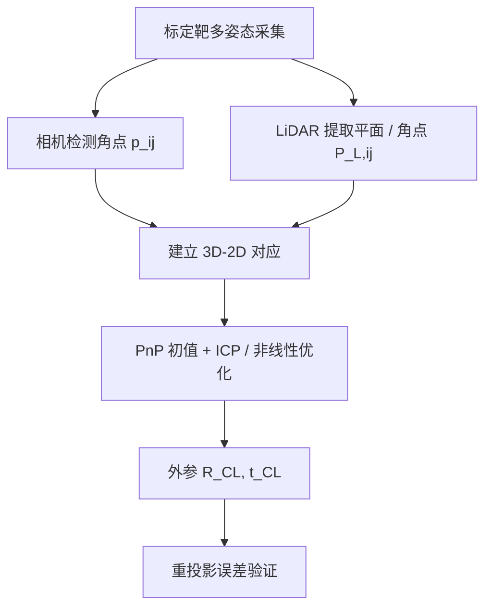

## 概述
联合标定是人形机器人领域的重要method。以下内容整理自项目 Wiki，供深入查阅。

## 核心内容
在人形机器人中，相机提供密集纹理与语义信息，LiDAR 提供精确三维几何。要实现 RGB 点云着色、深度融合、目标 3D 定位等功能，必须精确标定相机与 LiDAR 之间的外参（旋转 $\mathbf{R}_{CL}$ 和平移 $\mathbf{t}_{CL}$）。

!!! note "术语解释：相机-LiDAR 标定、外参、重投影误差、点云配准、标定靶"
    - **相机-LiDAR 标定（camera-LiDAR calibration）**：估计相机坐标系与 LiDAR 坐标系之间刚体变换的过程。
    - **外参（extrinsic parameters）**：两个传感器坐标系之间的旋转和平移。
    - **重投影误差（reprojection error）**：LiDAR 点投影到图像后与对应图像特征之间的距离。
    - **点云配准（point cloud registration）**：把多组点云对齐到同一坐标系的算法，如 ICP。
    - **标定靶（calibration target）**：带有已知几何特征（棋盘格、圆孔、镂空图案）的板，用于提取对应特征。

**坐标变换关系**

设空间点在世界/标定靶坐标系下为 $\mathbf{P}_W$，在相机坐标系下为 $\mathbf{P}_C$，在 LiDAR 坐标系下为 $\mathbf{P}_L$。相机内参矩阵为 $\mathbf{K}$，相机-LiDAR 外参为 $(\mathbf{R}_{CL}, \mathbf{t}_{CL})$，则有：

$$
\mathbf{P}_C = \mathbf{R}_{CL} \mathbf{P}_L + \mathbf{t}_{CL}
$$

$$
\mathbf{p} = \mathbf{K} \mathbf{P}_C / Z_C
$$

其中 $\mathbf{p} = [u, v, 1]^T$ 为图像像素坐标，$Z_C$ 为相机坐标系下的深度。



**基于标定靶的方法**

最常用的标定靶是棋盘格板或带圆孔的铝板。步骤如下：

1. **相机角点检测**：用 Zhang 法或 OpenCV 检测棋盘格角点，得到每个角点的像素坐标 $\mathbf{p}_{ij}$ 和世界坐标 $\mathbf{P}_{W,j}$。
2. **LiDAR 平面提取**：从点云中提取标定板平面，拟合平面方程；再提取平面边界或孔洞中心，得到角点在 LiDAR 坐标系下的三维坐标 $\mathbf{P}_{L,ij}$。
3. **对应点求解**：若同一角点在相机和 LiDAR 中都被检测到，则可用 PnP + ICP 或全局非线性优化求解 $(\mathbf{R}_{CL}, \mathbf{t}_{CL})$。

**最小化重投影误差**

把所有帧的对应点放在一起，最小化重投影误差：

$$
\min_{\mathbf{R}_{CL}, \mathbf{t}_{CL}} \sum_{i,j} \rho\left( \left\| \mathbf{p}_{ij} - \pi\left(\mathbf{K}, \mathbf{R}_{CL}\mathbf{P}_{L,ij} + \mathbf{t}_{CL}\right) \right\|^2 \right)
$$

其中 $\pi(\cdot)$ 为投影函数，$\rho(\cdot)$ 为鲁棒核函数（如 Huber），用于抑制错误对应点。

**基于点云边缘/互信息的方法**

当标定靶不便使用时，可利用场景中的自然几何边缘或反射强度信息：

- **边缘对齐**：提取图像边缘和 LiDAR 点云投影后的边缘，最小化边缘距离。
- **互信息最大化**：把 LiDAR 反射强度或深度渲染成伪图像，与相机图像求互信息，通过优化外参使两者对齐。

这些方法对初始值敏感，通常先用标定靶得到一个粗略外参，再在线 refinement。

**LiDAR 点云投影到图像的 Python 示例**

```python
import numpy as np
import cv2

def project_lidar_to_image(pts_lidar, R_cl, t_cl, K, dist_coeffs=None):
    """把 LiDAR 点云投影到相机图像。
    pts_lidar: Nx3 numpy array in LiDAR coordinate
    R_cl, t_cl: camera extrinsic w.r.t LiDAR (3x3, 3x1)
    K: 3x3 camera intrinsic matrix
    返回: Nx2 像素坐标和有效掩码
    """
    pts_cam = (R_cl @ pts_lidar.T + t_cl).T
    # 只保留相机前方的点
    valid = pts_cam[:, 2] > 0.1
    pts_cam = pts_cam[valid]
    # 投影
    uv = (K @ pts_cam.T).T
    uv = uv[:, :2] / uv[:, 2:3]
    return uv, valid

## 参考
- Wiki extraction
- 项目 Wiki：chapter-05.md#相机-LiDAR 联合标定

