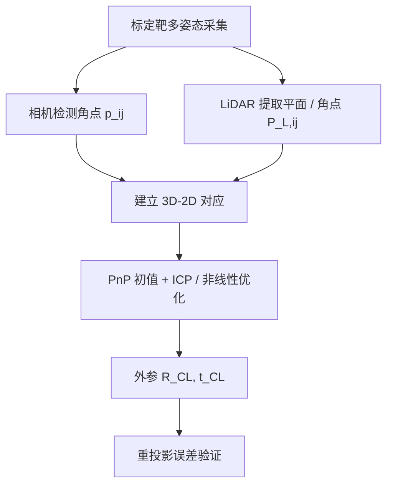
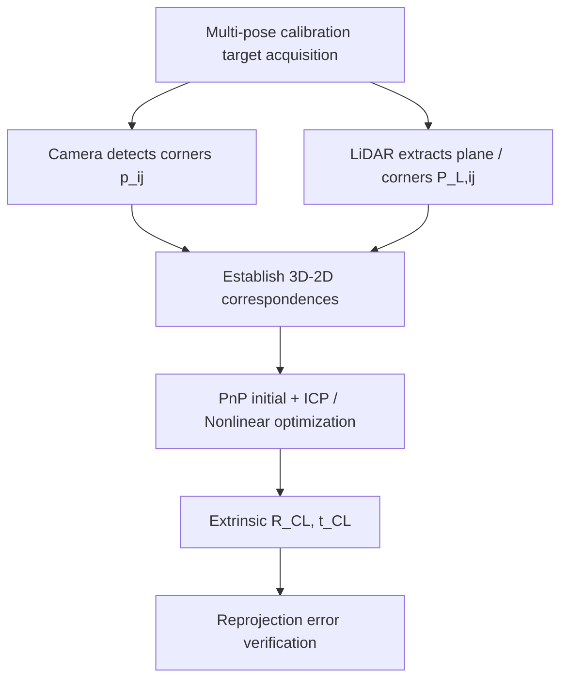
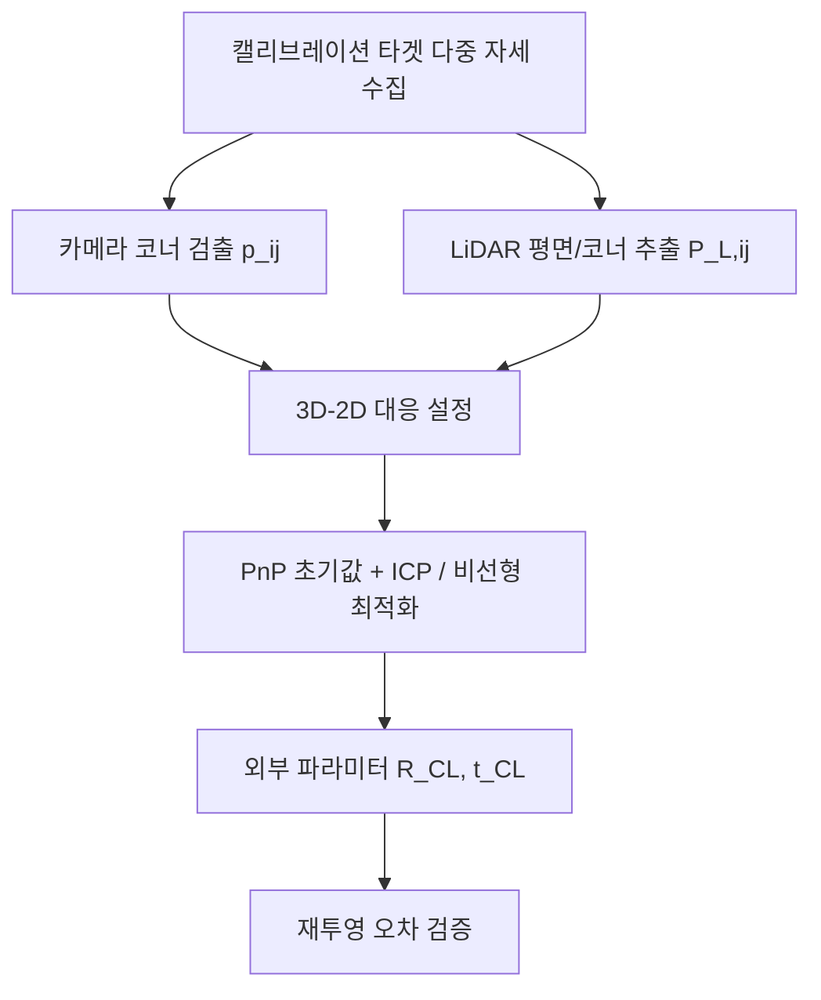

## 概述
联合标定是人形机器人领域的重要方法。以下内容整理自项目 Wiki，供深入查阅。

## 核心内容
在人形机器人中，相机提供密集纹理与语义信息，LiDAR 提供精确三维几何。要实现 RGB 点云着色、深度融合、目标 3D 定位等功能，必须精确标定相机与 LiDAR 之间的外参（旋转 $\mathbf{R}_{CL}$ 和平移 $\mathbf{t}_{CL}$）。

!!! note "术语解释：相机-LiDAR 标定、外参、重投影误差、点云配准、标定靶"
    - **相机-LiDAR 标定（camera-LiDAR calibration）**：估计相机坐标系与 LiDAR 坐标系之间刚体变换的过程。
    - **外参（extrinsic parameters）**：两个传感器坐标系之间的旋转和平移。
    - **重投影误差（reprojection error）**：LiDAR 点投影到图像后与对应图像特征之间的距离。
    - **点云配准（point cloud registration）**：把多组点云对齐到同一坐标系的算法，如 ICP。
    - **标定靶（calibration target）**：带有已知几何特征（棋盘格、圆孔、镂空图案）的板，用于提取对应特征。

**坐标变换关系**

设空间点在世界/标定靶坐标系下为 $\mathbf{P}_W$，在相机坐标系下为 $\mathbf{P}_C$，在 LiDAR 坐标系下为 $\mathbf{P}_L$。相机内参矩阵为 $\mathbf{K}$，相机-LiDAR 外参为 $(\mathbf{R}_{CL}, \mathbf{t}_{CL})$，则有：

$$
\mathbf{P}_C = \mathbf{R}_{CL} \mathbf{P}_L + \mathbf{t}_{CL}
$$

$$
\mathbf{p} = \mathbf{K} \mathbf{P}_C / Z_C
$$

其中 $\mathbf{p} = [u, v, 1]^T$ 为图像像素坐标，$Z_C$ 为相机坐标系下的深度。



**基于标定靶的方法**

最常用的标定靶是棋盘格板或带圆孔的铝板。步骤如下：

1. **相机角点检测**：用 Zhang 法或 OpenCV 检测棋盘格角点，得到每个角点的像素坐标 $\mathbf{p}_{ij}$ 和世界坐标 $\mathbf{P}_{W,j}$。
2. **LiDAR 平面提取**：从点云中提取标定板平面，拟合平面方程；再提取平面边界或孔洞中心，得到角点在 LiDAR 坐标系下的三维坐标 $\mathbf{P}_{L,ij}$。
3. **对应点求解**：若同一角点在相机和 LiDAR 中都被检测到，则可用 PnP + ICP 或全局非线性优化求解 $(\mathbf{R}_{CL}, \mathbf{t}_{CL})$。

**最小化重投影误差**

把所有帧的对应点放在一起，最小化重投影误差：

$$
\min_{\mathbf{R}_{CL}, \mathbf{t}_{CL}} \sum_{i,j} \rho\left( \left\| \mathbf{p}_{ij} - \pi\left(\mathbf{K}, \mathbf{R}_{CL}\mathbf{P}_{L,ij} + \mathbf{t}_{CL}\right) \right\|^2 \right)
$$

其中 $\pi(\cdot)$ 为投影函数，$\rho(\cdot)$ 为鲁棒核函数（如 Huber），用于抑制错误对应点。

**基于点云边缘/互信息的方法**

当标定靶不便使用时，可利用场景中的自然几何边缘或反射强度信息：

- **边缘对齐**：提取图像边缘和 LiDAR 点云投影后的边缘，最小化边缘距离。
- **互信息最大化**：把 LiDAR 反射强度或深度渲染成伪图像，与相机图像求互信息，通过优化外参使两者对齐。

这些方法对初始值敏感，通常先用标定靶得到一个粗略外参，再在线 refinement。

**LiDAR 点云投影到图像的 Python 示例**

```python
import numpy as np
import cv2

def project_lidar_to_image(pts_lidar, R_cl, t_cl, K, dist_coeffs=None):
    """把 LiDAR 点云投影到相机图像。
    pts_lidar: Nx3 numpy array in LiDAR coordinate
    R_cl, t_cl: camera extrinsic w.r.t LiDAR (3x3, 3x1)
    K: 3x3 camera intrinsic matrix
    返回: Nx2 像素坐标和有效掩码
    """
    pts_cam = (R_cl @ pts_lidar.T + t_cl).T
    # 只保留相机前方的点
    valid = pts_cam[:, 2] > 0.1
    pts_cam = pts_cam[valid]
    # 投影
    uv = (K @ pts_cam.T).T
    uv = uv[:, :2] / uv[:, 2:3]
    return uv, valid

## 参考
- Wiki extraction
- 项目 Wiki：chapter-05.md#相机-LiDAR 联合标定

## Overview
Joint calibration is an important method in the field of humanoid robots. The following content is compiled from the project Wiki for in-depth reference.

## Content
In humanoid robots, cameras provide dense texture and semantic information, while LiDAR provides precise 3D geometry. To achieve functions such as RGB point cloud coloring, depth fusion, and 3D object localization, it is essential to accurately calibrate the extrinsic parameters (rotation \(\mathbf{R}_{CL}\) and translation \(\mathbf{t}_{CL}\)) between the camera and LiDAR.

!!! note "Terminology: Camera-LiDAR calibration, extrinsic parameters, reprojection error, point cloud registration, calibration target"
    - **Camera-LiDAR calibration**: The process of estimating the rigid transformation between the camera coordinate system and the LiDAR coordinate system.
    - **Extrinsic parameters**: The rotation and translation between two sensor coordinate systems.
    - **Reprojection error**: The distance between a LiDAR point projected onto an image and the corresponding image feature.
    - **Point cloud registration**: Algorithms that align multiple point clouds into the same coordinate system, e.g., ICP.
    - **Calibration target**: A board with known geometric features (checkerboard, circular holes, cutout patterns) used to extract corresponding features.

**Coordinate Transformation Relationships**

Let a spatial point be \(\mathbf{P}_W\) in the world/calibration target coordinate system, \(\mathbf{P}_C\) in the camera coordinate system, and \(\mathbf{P}_L\) in the LiDAR coordinate system. The camera intrinsic matrix is \(\mathbf{K}\), and the camera-LiDAR extrinsic parameters are \((\mathbf{R}_{CL}, \mathbf{t}_{CL})\). Then:

$$
\mathbf{P}_C = \mathbf{R}_{CL} \mathbf{P}_L + \mathbf{t}_{CL}
$$

$$
\mathbf{p} = \mathbf{K} \mathbf{P}_C / Z_C
$$

where \(\mathbf{p} = [u, v, 1]^T\) are the image pixel coordinates, and \(Z_C\) is the depth in the camera coordinate system.



**Calibration Target-Based Methods**

The most common calibration targets are checkerboard boards or aluminum plates with circular holes. The steps are as follows:

1. **Camera Corner Detection**: Use Zhang's method or OpenCV to detect checkerboard corners, obtaining the pixel coordinates \(\mathbf{p}_{ij}\) and world coordinates \(\mathbf{P}_{W,j}\) for each corner.
2. **LiDAR Plane Extraction**: Extract the calibration board plane from the point cloud and fit a plane equation; then extract plane boundaries or hole centers to obtain the 3D coordinates of the corners in the LiDAR coordinate system \(\mathbf{P}_{L,ij}\).
3. **Correspondence Point Solving**: If the same corner is detected in both the camera and LiDAR, use PnP + ICP or global nonlinear optimization to solve for \((\mathbf{R}_{CL}, \mathbf{t}_{CL})\).

**Minimizing Reprojection Error**

Combine the corresponding points from all frames and minimize the reprojection error:

$$
\min_{\mathbf{R}_{CL}, \mathbf{t}_{CL}} \sum_{i,j} \rho\left( \left\| \mathbf{p}_{ij} - \pi\left(\mathbf{K}, \mathbf{R}_{CL}\mathbf{P}_{L,ij} + \mathbf{t}_{CL}\right) \right\|^2 \right)
$$

where \(\pi(\cdot)\) is the projection function, and \(\rho(\cdot)\) is a robust kernel function (e.g., Huber) used to suppress incorrect correspondences.

**Methods Based on Point Cloud Edges/Mutual Information**

When a calibration target is inconvenient to use, natural geometric edges or reflection intensity information in the scene can be utilized:

- **Edge Alignment**: Extract image edges and edges from the projected LiDAR point cloud, minimizing the edge distance.
- **Mutual Information Maximization**: Render LiDAR reflection intensity or depth into a pseudo-image, compute mutual information with the camera image, and optimize the extrinsic parameters to align them.

These methods are sensitive to initial values. A rough extrinsic parameter is usually obtained using a calibration target first, followed by online refinement.

**Python Example for Projecting LiDAR Point Cloud to Image**

```python
import numpy as np
import cv2

def project_lidar_to_image(pts_lidar, R_cl, t_cl, K, dist_coeffs=None):
    """Project LiDAR point cloud to camera image.
    pts_lidar: Nx3 numpy array in LiDAR coordinate
    R_cl, t_cl: camera extrinsic w.r.t LiDAR (3x3, 3x1)
    K: 3x3 camera intrinsic matrix
    Returns: Nx2 pixel coordinates and valid mask
    """
    pts_cam = (R_cl @ pts_lidar.T + t_cl).T
    # Keep only points in front of the camera
    valid = pts_cam[:, 2] > 0.1
    pts_cam = pts_cam[valid]
    # Project
    uv = (K @ pts_cam.T).T
    uv = uv[:, :2] / uv[:, 2:3]
    return uv, valid

## 개요
공동 캘리브레이션은 휴머노이드 로봇 분야의 중요한 방법입니다. 아래 내용은 프로젝트 Wiki에서 정리한 것으로, 심층적인 참고를 위해 제공됩니다.

## 핵심 내용
휴머노이드 로봇에서 카메라는 풍부한 텍스처와 의미 정보를 제공하고, LiDAR는 정밀한 3차원 기하학 정보를 제공합니다. RGB 포인트 클라우드 착색, 심층 융합, 객체 3D 위치 파악 등의 기능을 구현하려면 카메라와 LiDAR 간의 외부 파라미터(회전 $\mathbf{R}_{CL}$ 및 평행 이동 $\mathbf{t}_{CL}$)를 정밀하게 캘리브레이션해야 합니다.

!!! note "용어 설명: 카메라-LiDAR 캘리브레이션, 외부 파라미터, 재투영 오차, 포인트 클라우드 정합, 캘리브레이션 타겟"
    - **카메라-LiDAR 캘리브레이션(camera-LiDAR calibration)**: 카메라 좌표계와 LiDAR 좌표계 간의 강체 변환을 추정하는 과정.
    - **외부 파라미터(extrinsic parameters)**: 두 센서 좌표계 간의 회전 및 평행 이동.
    - **재투영 오차(reprojection error)**: LiDAR 포인트를 이미지에 투영한 후 해당 이미지 특징과의 거리.
    - **포인트 클라우드 정합(point cloud registration)**: 여러 포인트 클라우드를 동일한 좌표계로 정렬하는 알고리즘(예: ICP).
    - **캘리브레이션 타겟(calibration target)**: 알려진 기하학적 특징(체커보드, 원형 구멍, 절개 패턴)이 있는 판으로, 대응 특징을 추출하는 데 사용.

**좌표 변환 관계**

공간 점이 세계/캘리브레이션 타겟 좌표계에서 $\mathbf{P}_W$, 카메라 좌표계에서 $\mathbf{P}_C$, LiDAR 좌표계에서 $\mathbf{P}_L$이라고 가정합니다. 카메라 내부 파라미터 행렬은 $\mathbf{K}$, 카메라-LiDAR 외부 파라미터는 $(\mathbf{R}_{CL}, \mathbf{t}_{CL})$일 때, 다음이 성립합니다:

$$
\mathbf{P}_C = \mathbf{R}_{CL} \mathbf{P}_L + \mathbf{t}_{CL}
$$

$$
\mathbf{p} = \mathbf{K} \mathbf{P}_C / Z_C
$$

여기서 $\mathbf{p} = [u, v, 1]^T$는 이미지 픽셀 좌표, $Z_C$는 카메라 좌표계에서의 깊이입니다.



**캘리브레이션 타겟 기반 방법**

가장 일반적인 캘리브레이션 타겟은 체커보드 판 또는 원형 구멍이 있는 알루미늄 판입니다. 단계는 다음과 같습니다:

1. **카메라 코너 검출**: Zhang 방법 또는 OpenCV를 사용하여 체커보드 코너를 검출하고, 각 코너의 픽셀 좌표 $\mathbf{p}_{ij}$와 세계 좌표 $\mathbf{P}_{W,j}$를 얻습니다.
2. **LiDAR 평면 추출**: 포인트 클라우드에서 캘리브레이션 판 평면을 추출하고 평면 방정식을 피팅합니다. 그런 다음 평면 경계 또는 구멍 중심을 추출하여 LiDAR 좌표계에서 코너의 3차원 좌표 $\mathbf{P}_{L,ij}$를 얻습니다.
3. **대응점 해결**: 동일한 코너가 카메라와 LiDAR 모두에서 검출되면 PnP + ICP 또는 전역 비선형 최적화를 사용하여 $(\mathbf{R}_{CL}, \mathbf{t}_{CL})$를 해결합니다.

**재투영 오차 최소화**

모든 프레임의 대응점을 모아 재투영 오차를 최소화합니다:

$$
\min_{\mathbf{R}_{CL}, \mathbf{t}_{CL}} \sum_{i,j} \rho\left( \left\| \mathbf{p}_{ij} - \pi\left(\mathbf{K}, \mathbf{R}_{CL}\mathbf{P}_{L,ij} + \mathbf{t}_{CL}\right) \right\|^2 \right)
$$

여기서 $\pi(\cdot)$는 투영 함수, $\rho(\cdot)$는 잘못된 대응점을 억제하기 위한 강건 커널 함수(예: Huber)입니다.

**포인트 클라우드 에지/상호 정보 기반 방법**

캘리브레이션 타겟을 사용하기 어려운 경우, 장면의 자연 기하학적 에지 또는 반사 강도 정보를 활용할 수 있습니다:

- **에지 정렬**: 이미지 에지와 LiDAR 포인트 클라우드 투영 후의 에지를 추출하고 에지 거리를 최소화합니다.
- **상호 정보 최대화**: LiDAR 반사 강도 또는 깊이를 의사 이미지로 렌더링하고, 카메라 이미지와의 상호 정보를 계산하여 외부 파라미터를 최적화함으로써 둘을 정렬합니다.

이러한 방법은 초기값에 민감하므로, 일반적으로 캘리브레이션 타겟을 사용하여 대략적인 외부 파라미터를 먼저 얻은 후 온라인 리파인먼트를 수행합니다.

**LiDAR 포인트 클라우드를 이미지로 투영하는 Python 예제**

```python
import numpy as np
import cv2

def project_lidar_to_image(pts_lidar, R_cl, t_cl, K, dist_coeffs=None):
    """LiDAR 포인트 클라우드를 카메라 이미지로 투영합니다.
    pts_lidar: LiDAR 좌표계의 Nx3 numpy 배열
    R_cl, t_cl: LiDAR에 대한 카메라 외부 파라미터 (3x3, 3x1)
    K: 3x3 카메라 내부 파라미터 행렬
    반환: Nx2 픽셀 좌표 및 유효 마스크
    """
    pts_cam = (R_cl @ pts_lidar.T + t_cl).T
    # 카메라 전방에 있는 점만 유지
    valid = pts_cam[:, 2] > 0.1
    pts_cam = pts_cam[valid]
    # 투영
    uv = (K @ pts_cam.T).T
    uv = uv[:, :2] / uv[:, 2:3]
    return uv, valid

## Overview
Joint calibration is an important method in the field of humanoid robotics. The following content is compiled from the project Wiki for in-depth reference.

## Content
In humanoid robots, cameras provide dense texture and semantic information, while LiDAR provides precise 3D geometry. To achieve functions such as RGB point cloud coloring, depth fusion, and 3D object localization, it is essential to accurately calibrate the extrinsic parameters (rotation \(\mathbf{R}_{CL}\) and translation \(\mathbf{t}_{CL}\)) between the camera and LiDAR.

!!! note "Terminology: Camera-LiDAR Calibration, Extrinsic Parameters, Reprojection Error, Point Cloud Registration, Calibration Target"
    - **Camera-LiDAR calibration**: The process of estimating the rigid transformation between the camera coordinate system and the LiDAR coordinate system.
    - **Extrinsic parameters**: The rotation and translation between two sensor coordinate systems.
    - **Reprojection error**: The distance between the projection of a LiDAR point onto an image and its corresponding image feature.
    - **Point cloud registration**: Algorithms that align multiple point clouds into the same coordinate system, e.g., ICP.
    - **Calibration target**: A board with known geometric features (checkerboard, circular holes, cutout patterns) used to extract corresponding features.

**Coordinate Transformation Relationship**

Let a spatial point be \(\mathbf{P}_W\) in the world/calibration target coordinate system, \(\mathbf{P}_C\) in the camera coordinate system, and \(\mathbf{P}_L\) in the LiDAR coordinate system. The camera intrinsic matrix is \(\mathbf{K}\), and the camera-LiDAR extrinsic parameters are \((\mathbf{R}_{CL}, \mathbf{t}_{CL})\). Then:

$$
\mathbf{P}_C = \mathbf{R}_{CL} \mathbf{P}_L + \mathbf{t}_{CL}
$$

$$
\mathbf{p} = \mathbf{K} \mathbf{P}_C / Z_C
$$

where \(\mathbf{p} = [u, v, 1]^T\) is the image pixel coordinate, and \(Z_C\) is the depth in the camera coordinate system.


**Calibration Target-Based Methods**

The most commonly used calibration targets are checkerboard boards or aluminum plates with circular holes. The steps are as follows:

1. **Camera Corner Detection**: Use Zhang's method or OpenCV to detect checkerboard corners, obtaining the pixel coordinates \(\mathbf{p}_{ij}\) and world coordinates \(\mathbf{P}_{W,j}\) for each corner.
2. **LiDAR Plane Extraction**: Extract the calibration board plane from the point cloud and fit the plane equation; then extract the plane boundaries or hole centers to obtain the 3D coordinates \(\mathbf{P}_{L,ij}\) of the corners in the LiDAR coordinate system.
3. **Correspondence Point Solving**: If the same corner is detected in both the camera and LiDAR, use PnP + ICP or global nonlinear optimization to solve for \((\mathbf{R}_{CL}, \mathbf{t}_{CL})\).

**Minimizing Reprojection Error**

Combine corresponding points from all frames and minimize the reprojection error:

$$
\min_{\mathbf{R}_{CL}, \mathbf{t}_{CL}} \sum_{i,j} \rho\left( \left\| \mathbf{p}_{ij} - \pi\left(\mathbf{K}, \mathbf{R}_{CL}\mathbf{P}_{L,ij} + \mathbf{t}_{CL}\right) \right\|^2 \right)
$$

where \(\pi(\cdot)\) is the projection function, and \(\rho(\cdot)\) is a robust kernel function (e.g., Huber) used to suppress incorrect correspondences.

**Edge/Mutual Information-Based Methods**

When a calibration target is inconvenient to use, natural geometric edges or reflectivity information in the scene can be utilized:

- **Edge Alignment**: Extract image edges and edges from the projected LiDAR point cloud, then minimize the edge distance.
- **Mutual Information Maximization**: Render LiDAR reflectivity or depth as a pseudo-image, compute mutual information with the camera image, and optimize the extrinsic parameters to align them.

These methods are sensitive to initial values. A rough extrinsic parameter is typically obtained using a calibration target first, followed by online refinement.

**Python Example for Projecting LiDAR Point Cloud to Image**

```python
import numpy as np
import cv2

def project_lidar_to_image(pts_lidar, R_cl, t_cl, K, dist_coeffs=None):
    """Project LiDAR point cloud to camera image.
    pts_lidar: Nx3 numpy array in LiDAR coordinate
    R_cl, t_cl: camera extrinsic w.r.t LiDAR (3x3, 3x1)
    K: 3x3 camera intrinsic matrix
    Returns: Nx2 pixel coordinates and valid mask
    """
    pts_cam = (R_cl @ pts_lidar.T + t_cl).T
    # Keep only points in front of the camera
    valid = pts_cam[:, 2] > 0.1
    pts_cam = pts_cam[valid]
    # Projection
    uv = (K @ pts_cam.T).T
    uv = uv[:, :2] / uv[:, 2:3]
    return uv, valid
