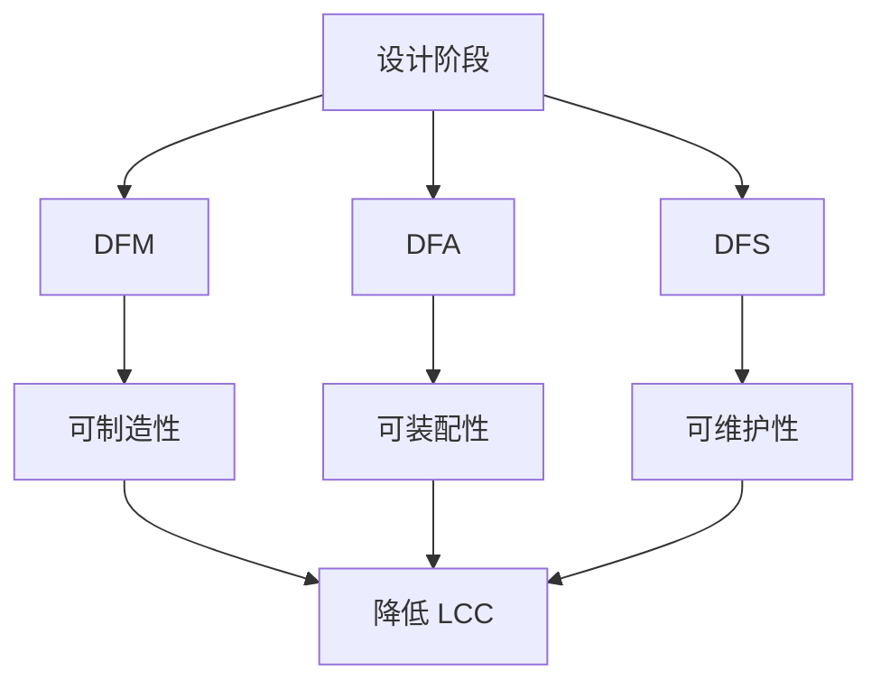

## 概述
8.6.1 DFM、DFA 与 DFS相关内容如下。

### 8.6.1 DFM、DFA 与 DFS
面向制造的设计（Design for Manufacturing, DFM）、面向装配的设计（Design for Assembly, DFA）与面向维护/服务的设计（Design for Serviceability, DFS）是降低全生命周期成本的关键方法。

!!! note "术语解释：DFM、DFA、DFS、面向成本的设计、生命周期成本"
    - **DFM（Design for Manufacturing）**：在产品设计阶段考虑制造工艺约束，降低制造难度与成本。
    - **DFA（Design for Assembly）**：简化装配过程，减少零件数量与装配时间。
    - **DFS（Design for Serviceability）**：便于维护、检修、更换与升级的设计。
    - **生命周期成本（LCC）**：产品从概念到报废全过程的总成本。

DFM 原则包括：
1. 减少零件数量与定制件比例。
2. 采用标准材料、标准件与标准工艺。
3. 避免无法加工或检测的几何特征。
4. 考虑公差累积与装配调整。

DFA 原则包括：
1. 设计自定位、自锁紧特征。
2. 减少紧固件种类与数量。
3. 保证装配方向单一、操作空间充足。
4. 采用模块化、子装配先调后装。

DFS 原则包括：
1. 高故障率部件（电池、风扇、线缆）易于更换。
2. 关键关节可在不解体整机的情况下拆装。
3. 提供维护窗口、诊断接口与状态监测。

## 参考
- 详见 chapter-08.md。

