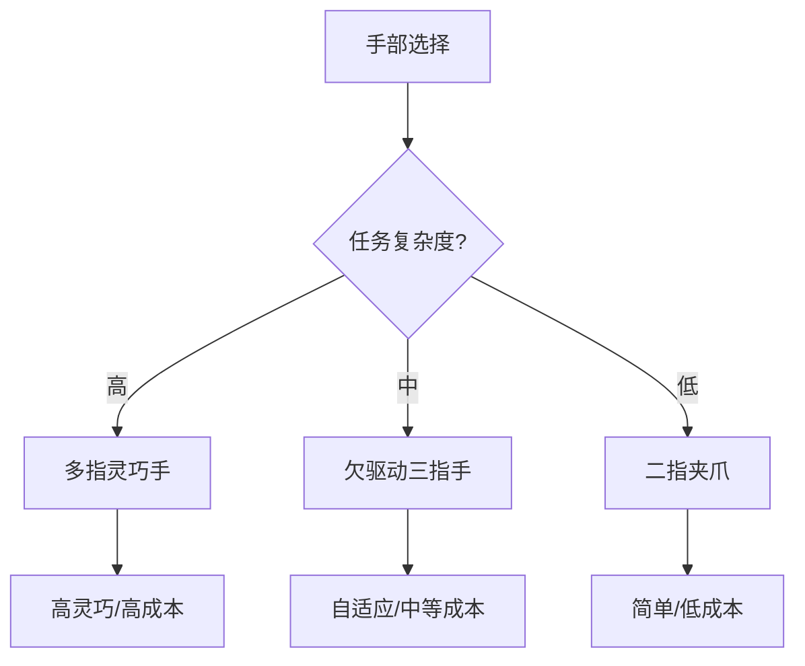

## 概述
9.4.2 灵巧手与夹爪：自由度、驱动与成本权衡相关内容如下。

### 9.4.2 灵巧手与夹爪：自由度、驱动与成本权衡
机器人手部主要分为**多指灵巧手（dexterous hand）**与**二指/三指夹爪（gripper）**。灵巧手自由度高、适应性强，但控制复杂、成本高；夹爪结构简单、成本低，但只能完成有限抓取类型。

!!! note "术语解释：灵巧手、夹爪、欠驱动、全驱动、自适应抓取"
    - **灵巧手（dexterous hand）**：具有多手指、多自由度、可完成复杂操作的末端执行器。
    - **夹爪（gripper）**：通常自由度较少、结构简单的抓取装置。
    - **欠驱动（underactuated）**：执行器数量少于自由度，通过机械耦合传递运动。
    - **全驱动（fully actuated）**：每个自由度由独立执行器驱动。
    - **自适应抓取（adaptive grasp）**：手根据物体形状自动包络的抓取方式。

| 类型 | 自由度 | 驱动方式 | 优点 | 缺点 | 代表 |
|---|---|---|---|---|---|
| 全驱动灵巧手 | 16–24 | 电机/腱/直驱 | 高灵巧 | 复杂、贵 | Shadow Hand、HIT Hand |
| 欠驱动灵巧手 | 8–16 | 腱/杆/差动 | 自适应、轻 | 控制精度低 | Robotiq 3F、SVH |
| 二指夹爪 | 1–2 | 电机+丝杠 | 简单、可靠 | 类型受限 | Robotiq 2F |
| 软体手 | 多变 | 气动/线缆 | 顺应、安全 | 力控难 | RBO Hand、PneuNet |

## 参考
- 详见 chapter-09.md。

