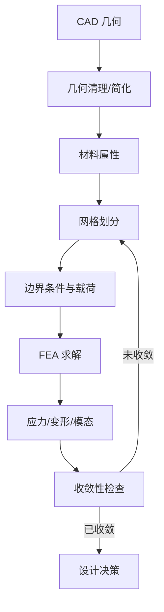

## 概述
#### 8.5.6 有限元分析在连杆设计中的应用

## 核心内容
**有限元分析（Finite Element Analysis, FEA）**是预测连杆、关节支架与壳体在载荷下应力、变形与模态的核心数值工具。通过把连续体离散为有限数量的单元，FEA 把偏微分方程转化为线性代数方程组求解，从而在设计阶段发现潜在的结构弱点[27][28]。

!!! note "术语解释：有限元分析（FEA）、离散化、单元、节点、自由度"
    - **有限元分析（FEA）**：把连续结构离散为有限单元并数值求解力学响应的方法。
    - **离散化（discretization）**：把连续几何和物理场分解为有限数量单元的过程。
    - **单元（element）**：构成有限元网格的基本几何块，如四面体、六面体、壳单元。
    - **节点（node）**：单元之间的连接点，场变量在节点处计算。
    - **自由度（DOF）**：每个节点上待求的位移分量数。

人形机器人连杆 FEA 的标准工作流程如下：

1. **几何导入与清理**：从 CAD 导入 STEP/IGES 模型，去除小圆角、螺纹、倒角、细小孔洞等不影响整体力学响应的特征。
2. **材料属性定义**：设置弹性模量 $E$、泊松比 $\nu$、密度 $\rho$，对于复合材料还需定义各向异性参数。
3. **网格划分**：把几何离散为单元集合。常见单元类型包括：
   - **四面体单元（tetrahedron）**：适应复杂几何，但同样节点数下精度通常低于六面体。
   - **六面体单元（hexahedron）**：规则网格精度高、收敛快，适合块状结构。
   - **壳单元（shell）**：用于薄壁结构，可显著降低自由度。
   - **梁单元（beam）**：用于细长杆件，计算效率最高。
4. **边界条件与载荷**：约束关节安装面或轴承座，施加重力、惯性载荷、关节力矩、地面反作用力等。
5. **求解与后处理**：计算位移、应力、应变、安全系数、固有频率，识别高应力区与变形模式。
6. **收敛性验证**：逐步细化网格，观察关键部位应力是否趋于稳定。

!!! note "术语解释：几何清理、网格收敛、后处理、边界条件、载荷工况"
    - **几何清理（geometry cleanup）**：去除不影响分析结果的小特征以简化模型。
    - **网格收敛（mesh convergence）**：随着网格细化，计算结果趋于稳定的现象。
    - **后处理（post-processing）**：对 FEA 结果进行可视化和评估。
    - **边界条件（boundary condition）**：约束位移或温度的条件。
    - **载荷工况（load case）**：特定工作状态下作用在结构上的载荷组合。

网格类型选择对结果影响显著。对于承受复杂应力状态的关节支架，二阶四面体单元（10 节点）能较好捕捉弯曲；对于细长连杆，六面体单元可提高效率。壳单元适用于壁厚远小于其他尺寸的罩壳和薄壁管。

**应力集中（stress concentration）**是连杆设计中的常见问题。几何突变处——如孔边、缺口、台阶、锐角——会出现局部应力显著高于名义应力的现象，应力集中系数 $K_t$ 可定义为：

$$
K_t = \frac{\sigma_{\max}}{\sigma_{\text{nom}}}
$$

其中 $\sigma_{\max}$ 为局部最大应力，$\sigma_{\text{nom}}$ 为名义应力。减缓应力集中的方法包括：增大圆角半径、避免尖角、采用渐变截面、在孔边设置加强环等。

!!! note "术语解释：应力集中、应力集中系数、圆角、名义应力"
    - **应力集中（stress concentration）**：几何突变导致局部应力显著增大的现象。
    - **应力集中系数（stress concentration factor）**：局部最大应力与名义应力之比。
    - **圆角（fillet）**：两个表面之间的圆滑过渡，用于降低应力集中。
    - **名义应力（nominal stress）**：按简化公式计算的平均应力。

收敛性检验是 FEA 可靠性的保障。理论上，当单元尺寸 $h \to 0$ 时，数值解应趋于精确解。工程上常采用 **h-收敛**：不断细化网格，绘制关键位置应力随单元数变化曲线；当相对变化小于 5% 时认为结果收敛。对于关键承载件，建议至少进行两次网格细化对比。

!!! note "术语解释：h-收敛、单元尺寸、数值解、精确解、收敛准则"
    - **h-收敛（h-convergence）**：通过减小单元尺寸提高计算精度的收敛方式。
    - **单元尺寸（element size）**：有限元网格中单元的典型边长。
    - **数值解（numerical solution）**：离散模型计算得到的近似解。
    - **精确解（exact solution）**：连续问题的理论解。
    - **收敛准则（convergence criterion）**：判断数值解是否足够稳定的判据。

## 参考
- Wiki extraction

