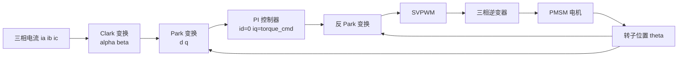
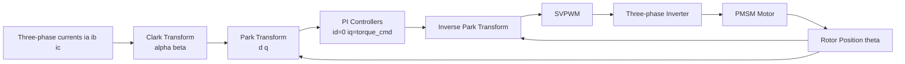

## 概述

磁场定向控制（Field-Oriented Control, FOC）是一种交流电机控制技术，通过坐标变换将三相定子电流分解到与转子磁链对齐的旋转 d-q 坐标系中，实现转矩与磁链的解耦独立控制。它使交流电机获得类似直流电机的控制特性，是人形机器人关节伺服驱动中最核心的电流环控制方法。

## 核心内容

### 是什么：准确定义

磁场定向控制（FOC）的核心思想是把三相静止坐标系下的电流通过 **Clark 变换** 变到两相静止 \(\alpha\beta\) 坐标系，再通过 **Park 变换** 变到随转子旋转的 \(dq\) 坐标系，从而使交流量变成直流量，用 PI 控制器分别控制 \(i_d\) 和 \(i_q\)。最后通过 **空间矢量脉宽调制**（SVPWM）生成三相逆变器开关信号。

在 **磁场定向控制**（FOC）下，把定子电流分解到随转子同步旋转的 \(d\) 轴（直轴，与永磁磁链对齐）和 \(q\) 轴（交轴，超前 \(d\) 轴 90° 电角度）。对于表面式永磁电机（SPMSM）有 \(L_d = L_q\)，电磁转矩为：

$$
\tau = \frac{3}{2} p \, \lambda_f \, i_q
$$

其中 \(p\) 为极对数，\(\lambda_f\) 为永磁体磁链，\(i_q\) 为交轴电流。这个公式揭示了一个关键事实：**它真正改变的不是电机的物理结构，而是控制者对电机内部电磁关系的认知方式**——把原本耦合的三相交流量变成两个独立的直流量，让转矩控制变得像控制直流电机一样直观。

### 为什么存在：痛点与历史定位

在 FOC 出现之前，交流电机的转矩控制长期受困于一个根本性难题：三相定子电流产生的旋转磁场与转子磁场之间存在复杂的耦合关系，转矩与磁链无法独立调节。直流电机之所以易于控制，是因为其励磁绕组与电枢绕组在空间上正交，天然实现了转矩与磁通的解耦；而交流电机的定子电流同时承担励磁与转矩两个功能，二者在物理上纠缠在一起。

**无刷直流电机**（BLDC）曾提供一种折中方案：BLDC 设计为梯形波反电动势，配合简单的六步换相（每 60° 电角度切换一次导通相），控制简单、成本较低。但六步换相的本质是"粗粒度"的电流控制——任一时刻两相导通、一相悬空，电流波形与理想正弦相去甚远，导致转矩脉动大、效率低。PMSM 反电动势为正弦波，配合 FOC 可获得更小转矩脉动、更高效率。

FOC 的历史定位在于：它通过数学变换而非硬件改动，解决了交流电机的高性能转矩控制问题。这一方法使 PMSM 在人形机器人等高动态、高精度场景中取代了 BLDC 和直流有刷电机，成为伺服驱动的事实标准。**它真正改变的不是电机本身，而是"交流电机难以精确控制"这一延续了近百年的技术判断。**

### 原理拆解

**① 坐标变换：从三相到两相旋转系**

FOC 的数学基础是两次坐标变换。**Clark 变换** 把三相静止坐标系 \(abc\) 转换为两相静止坐标系 \(\alpha\beta\)，**Park 变换** 把两相静止坐标系 \(\alpha\beta\) 转换为随转子旋转的 \(dq\) 坐标系。变换的核心意义在于：在 \(dq\) 坐标系中，原本随时间正弦变化的交流量变成了不随时间变化的直流量，这使得常规 PI 控制器可以直接施加于电流环。

**② 解耦控制：\(i_d\) 与 \(i_q\) 的独立调节**

在 \(dq\) 坐标系中，\(i_d\) 控制磁链（励磁分量），\(i_q\) 控制转矩（转矩分量）。对于表面式永磁电机（SPMSM），\(L_d = L_q\)，电磁转矩仅由 \(i_q\) 决定，与 \(i_d\) 无关。因此，令 \(i_d = 0\) 即可实现单位电流最大转矩控制，同时保持磁链恒定。这种解耦使交流电机像直流电机一样易于控制转矩。

**③ SVPWM：从控制量到开关信号**

PI 控制器输出的 \(dq\) 轴电压指令需经反 Park 变换回到 \(\alpha\beta\) 坐标系，再通过 **空间矢量脉宽调制**（SVPWM）生成三相逆变器开关信号。SVPWM 让三相逆变器输出最接近目标电压矢量的 PWM 方法，比正弦 PWM 电压利用率高约 15%（按语料数据推算）。**逆变器** 把直流电变换为交流电的功率电子电路，通常由六个开关管组成三相桥。

**④ 转子位置反馈：闭环的前提**

Park 变换需要实时转子位置 \(\theta\) 作为输入。转子位置通常由编码器或霍尔传感器提供，位置精度直接影响 \(dq\) 轴电流分解的准确性。整个 FOC 环路可表示为：

### 关键参数与规格

FOC 系统的关键参数可分为电机本体参数与控制参数两类：

| 参数类别 | 参数名称 | 典型值/范围 | 说明 |
|----------|----------|-------------|------|
| 电机本体 | 极对数 \(p\) | 4–20（工程判断） | 极对数越多，相同机械转速对应的电频率越高 |
| 电机本体 | 永磁体磁链 \(\lambda_f\) | 需自行确认 | 决定单位 \(i_q\) 产生的转矩 |
| 电机本体 | \(d\) 轴电感 \(L_d\) | 需自行确认 | SPMSM 中 \(L_d = L_q\) |
| 电机本体 | \(q\) 轴电感 \(L_q\) | 需自行确认 | 影响电流环带宽与电压需求 |
| 控制参数 | 电流环带宽 | 1–5 kHz（工程判断） | 需远高于速度环与位置环带宽 |
| 控制参数 | PWM 开关频率 | 10–20 kHz（工程判断） | 受逆变器开关损耗与散热限制 |
| 控制参数 | 编码器分辨率 | 需自行确认 | 转子位置精度直接影响 Park 变换准确性 |

同步转速与电频率的关系为：

$$
n_s = \frac{60 f}{p} \quad (\text{r/min})
$$

其中 \(f\) 为电频率，\(p\) 为极对数。**电角速度** 是机械角速度的 \(p\) 倍，这一关系决定了 FOC 中 Park 变换所需的电角度计算。

### 横向对比

FOC 并非唯一的电机控制策略，与主要替代方案的对比如下：

| 控制方法 | 转矩脉动 | 效率 | 控制复杂度 | 传感器需求 | 适用场景 |
|----------|----------|------|------------|------------|----------|
| 六步换相（BLDC） | 大 | 较低 | 低 | 霍尔传感器 | 低成本、低精度场景 |
| FOC（PMSM） | 小 | 高 | 高 | 编码器/霍尔+电流采样 | 人形机器人关节、伺服系统 |
| 直接转矩控制（DTC） | 中 | 中 | 中 | 需自行确认 | 需自行确认 |

FOC 的核心优势在于正弦电流驱动配合正弦反电动势可实现零转矩脉动（按语料数据推算），这对于人形机器人关节的平滑运动至关重要。相比之下，BLDC 的六步换相每 60° 电角度切换一次导通相，电流换相瞬间产生转矩脉动，在低速精细操作场景下尤为明显。**它真正改变的不是控制精度本身，而是"交流电机能否胜任高精度伺服"这一工程判断的答案。**

### 谁在用·应用案例

**① 人形机器人关节伺服驱动**

人形机器人每个关节都需要在质量、体积受限的前提下同时满足高瞬时扭矩、宽速度范围、毫秒级响应、可反向驱动的柔顺性，以及与人共处的安全性。FOC 作为电流环的核心控制方法，是上述所有性能指标的基础。以 60–80 kg 级人形机器人为例，若执行器总质量 20 kg、整机峰值机械功率 2–3 kW，则 **比功率**（power-to-mass）目标约为 100–150 W/kg（执行器本体），整机比功率约为 30–50 W/kg（按语料数据推算）。这些指标的实现离不开 FOC 提供的高效电流控制。

**② 伺服电机系统**

交流伺服电机通常采用 FOC。在同步旋转坐标系下，定子电流被分解为励磁分量 \(i_d\) 与转矩分量 \(i_q\)。通过电流环、速度环、位置环三级级联控制，伺服系统可实现高精度轨迹跟踪。编码器分辨率 \(N\) 决定了最小可分辨角度 \(\Delta \theta = 360^\circ / N\)，24 位编码器对应的分辨率需自行确认。

**③ 无框力矩电机**

人形机器人髋关节、肩关节往往需要几十到上百 N·m 的输出扭矩。**无框力矩电机** 把定子和转子直接嵌入关节结构，取消外壳、端盖和轴承，直径大、极数多，可在低转速下直接输出大扭矩。这类电机同样依赖 FOC 实现低转速下的平稳转矩输出。无框力矩电机的扭矩密度可表示为：

$$
\tau = 2 \pi r^2 l B_{\text{gap}} J_s
$$

其中 \(r\) 为气隙半径，\(l\) 为轴向长度，\(B_{\text{gap}}\) 为气隙磁密，\(J_s\) 为电负荷。增大 \(r\) 对扭矩的提升是二次方关系，因此大直径无框电机在相同质量下可获得更高扭矩。

### 局限与边界

**① 对转子位置精度的依赖**

FOC 的 Park 变换需要精确的转子位置 \(\theta\)。位置传感器误差会直接导致 \(dq\) 轴电流分解偏差，进而影响转矩控制精度。在高动态场景下，位置延迟还会降低电流环相位裕度，限制带宽。

**② 参数敏感性**

FOC 的转矩控制精度依赖于电机参数（\(p\)、\(\lambda_f\)、\(L_d\)、\(L_q\)）的准确性。温度变化会导致永磁体磁链 \(\lambda_f\) 漂移，磁饱和会改变电感值，这些参数失配都会降低解耦效果。

**③ 计算与硬件开销**

FOC 需要高速电流采样、坐标变换、PI 运算与 SVPWM 生成，对微控制器的算力与 ADC 采样率有较高要求。相比六步换相，FOC 的软硬件复杂度显著增加。

**④ 电压利用率限制**

SVPWM 比正弦 PWM 电压利用率高约 15%（按语料数据推算），但仍存在电压上限。在高速弱磁区，电压饱和会导致电流环失控，需要额外的弱磁控制策略。

### 常见误区

1. **"FOC 只适用于 PMSM"**——错。FOC 同样适用于异步电机（需转子磁链观测器）和 BLDC（正弦驱动模式），只是 PMSM 因转子永磁体天然提供磁链基准而实现最简单。

2. **"FOC 就是 SVPWM"**——错。SVPWM 只是 FOC 链路中的最终调制环节，FOC 的核心在于坐标变换与解耦控制，SVPWM 也可用于其他控制策略。

3. **"\(i_d = 0\) 是唯一最优策略"**——错。\(i_d = 0\) 仅对 SPMSM 在额定转速以下是单位电流最大转矩策略；对于内置式永磁电机（IPMSM），利用磁阻转矩的最大转矩电流比（MTPA）控制需要 \(i_d < 0\)；高速时还需弱磁控制 \(i_d < 0\)。

4. **"FOC 可以完全消除转矩脉动"**——错。FOC 配合正弦反电动势可接近零转矩脉动，但齿槽转矩、电流采样误差、死区效应等仍会引入残余脉动。

### 相关知识

- `ent_comp_servo_motor` — 伺服电机是 FOC 最主要的应用载体，FOC 是其实现高精度闭环控制的核心方法。
- `ent_component_bldc_motor` — BLDC 与 PMSM 结构相似但反电动势波形不同，FOC 是 BLDC 从六步换相升级到高性能正弦驱动的路径。
- `ent_component_frameless_torque_motor_2024` — 无框力矩电机依赖 FOC 实现低速大扭矩下的平稳输出，二者共同构成人形机器人关节方案。
- `ent_principle_current_velocity_position_loops` — FOC 是电流环的核心实现方法，电流环是速度环与位置环的内环基础。
- `ent_method_pid_control` — FOC 中的 \(i_d\) 与 \(i_q\) 均通过 PI 控制器调节，PID 是 FOC 电流环的基本控制律。

## 参考

- [N. Mohan, Advanced Electric Drives: Analysis, Control, and Modeling Using MATLAB/Simulink, Wiley, 2013](https://doi.org/10.1002/9781118704810)
- [P. C. Krause, O. Wasynczuk, and S. D. Sudhoff, Analysis of Electric Machinery and Drive Systems, 3rd ed., IEEE Press/Wiley, 2013](https://doi.org/10.1002/9781118526030)
- [Chapter 04: 执行器与人形机器人](https://github.com/YansongW/awesome-humanoid-robot/tree/main/wiki/docs/chapters/chapter-04.md)

## Overview

Field-Oriented Control (FOC) is an AC motor control technique that decomposes the three-phase stator currents into a rotating d-q coordinate system aligned with the rotor flux linkage through coordinate transformations, enabling decoupled and independent control of torque and flux linkage. It endows AC motors with control characteristics similar to DC motors and is the most core current-loop control method in humanoid robot joint servo drives.

## Content

### What It Is: Precise Definition

The core idea of Field-Oriented Control (FOC) is to transform the currents in the three-phase stationary coordinate system to the two-phase stationary \(\alpha\beta\) coordinate system via the **Clark transformation**, and then to the rotor-synchronously rotating \(dq\) coordinate system via the **Park transformation**, thereby converting AC quantities into DC quantities, with PI controllers separately regulating \(i_d\) and \(i_q\). Finally, **Space Vector Pulse Width Modulation** (SVPWM) generates the switching signals for the three-phase inverter.

Under **Field-Oriented Control** (FOC), the stator current is decomposed into the \(d\)-axis (direct axis, aligned with the permanent magnet flux linkage) and the \(q\)-axis (quadrature axis, leading the \(d\)-axis by 90° electrical degrees), both rotating synchronously with the rotor. For Surface-Mounted Permanent Magnet Synchronous Motors (SPMSM), \(L_d = L_q\), and the electromagnetic torque is:

$$
\tau = \frac{3}{2} p \, \lambda_f \, i_q
$$

where \(p\) is the number of pole pairs, \(\lambda_f\) is the permanent magnet flux linkage, and \(i_q\) is the quadrature-axis current. This formula reveals a key fact: **what it truly changes is not the physical structure of the motor, but the controller's perception of the internal electromagnetic relationships**—transforming the originally coupled three-phase AC quantities into two independent DC quantities, making torque control as intuitive as controlling a DC motor.

### Why It Exists: Pain Points and Historical Positioning

Before FOC emerged, torque control of AC motors had long been plagued by a fundamental challenge: the complex coupling between the rotating magnetic field generated by the three-phase stator currents and the rotor magnetic field made it impossible to independently regulate torque and flux linkage. DC motors are easy to control because their field winding and armature winding are spatially orthogonal, naturally achieving decoupling of torque and flux; whereas the stator current of an AC motor simultaneously serves both excitation and torque functions, which are physically intertwined.

**Brushless DC motors** (BLDC) once offered a compromise: BLDC motors are designed with trapezoidal back-EMF, paired with simple six-step commutation (switching the conducting phase every 60° electrical degrees), offering simple control and low cost. However, the essence of six-step commutation is "coarse-grained" current control—at any given moment, two phases conduct while one is floating, and the current waveform deviates significantly from the ideal sine wave, resulting in large torque ripple and low efficiency. PMSM motors have sinusoidal back-EMF, and when paired with FOC, they achieve smaller torque ripple and higher efficiency.

The historical positioning of FOC lies in solving the high-performance torque control problem of AC motors through mathematical transformations rather than hardware modifications. This method has made PMSM motors the de facto standard for servo drives, replacing BLDC and brushed DC motors in high-dynamics, high-precision applications such as humanoid robots. **What it truly changes is not the motor itself, but the near-century-old technical judgment that "AC motors are difficult to control precisely."**

### Principle Breakdown

**① Coordinate Transformation: From Three-Phase to Two-Phase Rotating Frame**

The mathematical foundation of FOC consists of two coordinate transformations. The **Clark transformation** converts the three-phase stationary coordinate system \(abc\) to the two-phase stationary coordinate system \(\alpha\beta\), and the **Park transformation** converts the two-phase stationary coordinate system \(\alpha\beta\) to the rotor-synchronously rotating \(dq\) coordinate system. The core significance of the transformation lies in the fact that, in the \(dq\) coordinate system, the AC quantities that originally varied sinusoidally with time become DC quantities that do not vary with time, allowing conventional PI controllers to be directly applied to the current loop.

**② Decoupled Control: Independent Regulation of \(i_d\) and \(i_q\)**

In the \(dq\) coordinate system, \(i_d\) controls the flux linkage (excitation component), and \(i_q\) controls the torque (torque component). For SPMSM, \(L_d = L_q\), and the electromagnetic torque is determined solely by \(i_q\), independent of \(i_d\). Therefore, setting \(i_d = 0\) achieves maximum torque per ampere while maintaining constant flux linkage. This decoupling makes torque control of AC motors as straightforward as that of DC motors.

**③ SVPWM: From Control Outputs to Switching Signals**

The \(dq\)-axis voltage commands output by the PI controllers must be transformed back to the \(\alpha\beta\) coordinate system via the inverse Park transformation, and then **Space Vector Pulse Width Modulation** (SVPWM) generates the three-phase inverter switching signals. SVPWM is a PWM method that makes the three-phase inverter output the closest approximation to the target voltage vector, offering approximately 15% higher voltage utilization than sinusoidal PWM (estimated from corpus data). The **inverter** is a power electronic circuit that converts DC power to AC power, typically consisting of six switching devices forming a three-phase bridge.

**④ Rotor Position Feedback: The Prerequisite for Closed-Loop Control**

The Park transformation requires real-time rotor position \(\theta\) as input. The rotor position is typically provided by an encoder or Hall sensors, and position accuracy directly affects the accuracy of the \(dq\)-axis current decomposition. The entire FOC loop can be represented as:

### Key Parameters and Specifications

The key parameters of an FOC system can be categorized into motor intrinsic parameters and control parameters:

| Parameter Category | Parameter Name | Typical Value/Range | Description |
|----------|----------|-------------|------|
| Motor Intrinsic | Number of pole pairs \(p\) | 4–20 (engineering estimate) | The more pole pairs, the higher the electrical frequency for the same mechanical speed |
| Motor Intrinsic | Permanent magnet flux linkage \(\lambda_f\) | To be confirmed | Determines the torque produced per unit \(i_q\) |
| Motor Intrinsic | \(d\)-axis inductance \(L_d\) | To be confirmed | For SPMSM, \(L_d = L_q\) |
| Motor Intrinsic | \(q\)-axis inductance \(L_q\) | To be confirmed | Affects current-loop bandwidth and voltage requirements |
| Control Parameter | Current-loop bandwidth | 1–5 kHz (engineering estimate) | Must be significantly higher than the speed-loop and position-loop bandwidths |
| Control Parameter | PWM switching frequency | 10–20 kHz (engineering estimate) | Limited by inverter switching losses and thermal dissipation |
| Control Parameter | Encoder resolution | To be confirmed | Rotor position accuracy directly affects Park transformation accuracy |

The relationship between synchronous speed and electrical frequency is:

$$
n_s = \frac{60 f}{p} \quad (\text{r/min})
$$

where \(f\) is the electrical frequency and \(p\) is the number of pole pairs. **Electrical angular velocity** is \(p\) times the mechanical angular velocity, and this relationship determines the electrical angle calculation required for the Park transformation in FOC.

### Horizontal Comparison

FOC is not the only motor control strategy. A comparison with the main alternatives is as follows:

| Control Method | Torque Ripple | Efficiency | Control Complexity | Sensor Requirements | Application Scenarios |
|----------|----------|------|------------|------------|----------|
| Six-step commutation (BLDC) | Large | Lower | Low | Hall sensors | Low-cost, low-precision applications |
| FOC (PMSM) | Small | High | High | Encoder/Hall + current sensing | Humanoid robot joints, servo systems |
| Direct Torque Control (DTC) | Medium | Medium | Medium | To be confirmed | To be confirmed |

The core advantage of FOC lies in the combination of sinusoidal current drive with sinusoidal back-EMF, which can achieve near-zero torque ripple (estimated from corpus data). This is crucial for the smooth motion of humanoid robot joints. In contrast, BLDC's six-step commutation switches the conducting phase every 60° electrical degrees, causing torque ripple at the moment of current commutation, which is particularly noticeable in low-speed fine manipulation scenarios. **What it truly changes is not control precision itself, but the answer to the engineering judgment of "whether AC motors can handle high-precision servo applications."**

### Who Uses It · Application Cases

**① Humanoid Robot Joint Servo Drives**

Each joint of a humanoid robot must simultaneously meet requirements for high instantaneous torque, wide speed range, millisecond-level response, backdrivable compliance, and safety for human coexistence, all under constraints of mass and volume. FOC, as the core method for the current loop, underpins all these performance metrics. Taking a 60–80 kg humanoid robot as an example, if the total actuator mass is 20 kg and the peak mechanical power of the entire machine is 2–3 kW, then the **power-to-mass ratio** target is approximately 100–150 W/kg (actuator body), and the whole-machine power-to-mass ratio is approximately 30–50 W/kg (estimated from corpus data). Achieving these metrics is inseparable from the efficient current control provided by FOC.

**② Servo Motor Systems**

AC servo motors typically employ FOC. In the synchronously rotating coordinate system, the stator current is decomposed into the excitation component \(i_d\) and the torque component \(i_q\). Through a three-level cascaded control structure of current loop, speed loop, and position loop, servo systems can achieve high-precision trajectory tracking. The encoder resolution \(N\) determines the minimum resolvable angle \(\Delta \theta = 360^\circ / N\), and the resolution corresponding to a 24-bit encoder needs to be confirmed.

**③ Frameless Torque Motors**

The hip and shoulder joints of humanoid robots often require output torques ranging from tens to hundreds of N·m. **Frameless torque motors** embed the stator and rotor directly into the joint structure, eliminating the housing, end caps, and bearings. With large diameters and high pole counts, they can directly output high torque at low speeds. These motors also rely on FOC to achieve smooth torque output at low speeds. The torque density of a frameless torque motor can be expressed as:

$$
\tau = 2 \pi r^2 l B_{\text{gap}} J_s
$$

where \(r\) is the air-gap radius, \(l\) is the axial length, \(B_{\text{gap}}\) is the air-gap flux density, and \(J_s\) is the electric loading. Increasing \(r\) improves torque quadratically, which is why large-diameter frameless motors can achieve higher torque for the same mass.

### Limitations and Boundaries

**① Dependence on Rotor Position Accuracy**

The Park transformation in FOC requires precise rotor position \(\theta\). Position sensor errors directly lead to deviations in the \(dq\)-axis current decomposition, thereby affecting torque control accuracy. In high-dynamics scenarios, position delay can also reduce the current-loop phase margin, limiting bandwidth.

**② Parameter Sensitivity**

The torque control accuracy of FOC depends on the accuracy of motor parameters (\(p\), \(\lambda_f\), \(L_d\), \(L_q\)). Temperature variations cause drift in the permanent magnet flux linkage \(\lambda_f\), and magnetic saturation changes the inductance values. These parameter mismatches degrade the decoupling effect.

**③ Computational and Hardware Overhead**

FOC requires high-speed current sensing, coordinate transformations, PI computations, and SVPWM generation, imposing significant demands on microcontroller computational power and ADC sampling rates. Compared to six-step commutation, the software and hardware complexity of FOC is substantially higher.

**④ Voltage Utilization Limits**

SVPWM offers approximately 15% higher voltage utilization than sinusoidal PWM (estimated from corpus data), but a voltage ceiling still exists. In the high-speed flux-weakening region, voltage saturation can cause the current loop to lose control, requiring additional flux-weakening control strategies.

### Common Misconceptions

1. **"FOC only applies to PMSM"**—Incorrect. FOC also applies to induction motors (requiring a rotor flux observer) and BLDC motors (in sinusoidal drive mode); PMSM simply offers the simplest implementation because the rotor permanent magnets naturally provide a flux reference.

2. **"FOC is SVPWM"**—Incorrect. SVPWM is merely the final modulation stage in the FOC chain. The core of FOC lies in coordinate transformation and decoupled control, and SVPWM can also be used in other control strategies.

3. **"\(i_d = 0\) is the only optimal strategy"**—Incorrect. \(i_d = 0\) is the maximum torque per ampere strategy only for SPMSM below rated speed. For Interior Permanent Magnet Synchronous Motors (IPMSM), Maximum Torque Per Ampere (MTPA) control that exploits reluctance torque requires \(i_d < 0\); at high speeds, flux-weakening control also requires \(i_d < 0\).

4. **"FOC can completely eliminate torque ripple"**—Incorrect. FOC combined with sinusoidal back-EMF can approach zero torque ripple, but cogging torque, current sensing errors, dead-time effects, and other factors still introduce residual ripple.

### Related Knowledge

- `ent_comp_servo_motor` — Servo motors are the primary application carrier of FOC, and FOC is the core method for achieving high-precision closed-loop control.
- `ent_component_bldc_motor` — BLDC and PMSM motors are structurally similar but differ in back-EMF waveform; FOC is the path for upgrading BLDC from six-step commutation to high-performance sinusoidal drive.
- `ent_component_frameless_torque_motor_2024` — Frameless torque motors rely on FOC to achieve smooth output at low speeds and high torque, and together they form the joint solution for humanoid robots.
- `ent_principle_current_velocity_position_loops` — FOC is the core implementation method of the current loop, which serves as the inner-loop foundation for the speed loop and position loop.
- `ent_method_pid_control` — Both \(i_d\) and \(i_q\) in FOC are regulated by PI controllers; PID is the fundamental control law for the FOC current loop.

## 개요

자기장 지향 제어(Field-Oriented Control, FOC)는 교류 전동기 제어 기술로, 좌표 변환을 통해 3상 고정자 전류를 회전자 자속과 정렬된 회전 d-q 좌표계로 분해하여 토크와 자속을 독립적으로 제어할 수 있게 한다. 이를 통해 교류 전동기가 직류 전동기와 유사한 제어 특성을 얻을 수 있으며, 휴머노이드 로봇 관절 서보 구동에서 가장 핵심적인 전류 루프 제어 방법이다.

## 핵심 내용

### 무엇인가: 정확한 정의

자기장 지향 제어(FOC)의 핵심 아이디어는 3상 정지 좌표계의 전류를 **Clark 변환**을 통해 2상 정지 \(\alpha\beta\) 좌표계로 변환하고, 다시 **Park 변환**을 통해 회전자와 함께 회전하는 \(dq\) 좌표계로 변환하여 교류 성분을 직류 성분으로 만든 뒤, PI 제어기로 \(i_d\)와 \(i_q\)를 각각 제어하는 것이다. 마지막으로 **공간 벡터 펄스 폭 변조**(SVPWM)를 통해 3상 인버터 스위칭 신호를 생성한다.

**자기장 지향 제어**(FOC)에서 고정자 전류는 회전자와 동기 회전하는 \(d\)축(직축, 영구자석 자속과 정렬)과 \(q\)축(교축, \(d\)축보다 90° 전기각 앞섬)으로 분해된다. 표면 부착형 영구자석 전동기(SPMSM)의 경우 \(L_d = L_q\)이며, 전자기 토크는 다음과 같다:

$$
\tau = \frac{3}{2} p \, \lambda_f \, i_q
$$

여기서 \(p\)는 극수, \(\lambda_f\)는 영구자석 자속, \(i_q\)는 교축 전류이다. 이 공식은 핵심적인 사실을 보여준다: **이 방법이 실제로 바꾸는 것은 전동기의 물리적 구조가 아니라, 제어자가 전동기 내부 전자기 관계를 인식하는 방식이다** — 원래 결합된 3상 교류량을 두 개의 독립적인 직류량으로 만들어 토크 제어를 직류 전동기 제어만큼 직관적으로 만든다.

### 왜 존재하는가: 문제점과 역사적 위치

FOC가 등장하기 전까지 교류 전동기의 토크 제어는 근본적인 난제에 오랫동안 시달렸다: 3상 고정자 전류가 생성하는 회전 자기장과 회전자 자기장 사이에는 복잡한 결합 관계가 있어 토크와 자속을 독립적으로 조절할 수 없었다. 직류 전동기가 제어하기 쉬운 이유는 여자 권선과 전기자 권선이 공간적으로 직교하여 토크와 자속의 분리가 자연스럽게 이루어지기 때문이다. 반면 교류 전동기의 고정자 전류는 여자와 토크라는 두 기능을 동시에 담당하며, 이 둘은 물리적으로 얽혀 있다.

**브러시리스 직류 전동기**(BLDC)는 한때 절충안을 제공했다: BLDC는 사다리꼴 역기전력으로 설계되어 간단한 6단계 정류(60° 전기각마다 도통 상을 전환)와 함께 제어가 간단하고 비용이 낮다. 그러나 6단계 정류의 본질은 "거친 입자"의 전류 제어이다 — 어느 순간에도 두 상만 도통되고 한 상은 개방되므로 전류 파형이 이상적인 정현파와 거리가 멀어 토크 맥동이 크고 효율이 낮다. PMSM의 역기전력은 정현파이며, FOC와 결합하면 더 작은 토크 맥동과 더 높은 효율을 얻을 수 있다.

FOC의 역사적 위치는 하드웨어 변경이 아닌 수학적 변환을 통해 교류 전동기의 고성능 토크 제어 문제를 해결했다는 점에 있다. 이 방법은 PMSM이 휴머노이드 로봇과 같은 고동적, 고정밀 환경에서 BLDC와 직류 브러시 전동기를 대체하여 서보 구동의 사실상 표준이 되게 했다. **이것이 실제로 바꾼 것은 전동기 자체가 아니라, "교류 전동기는 정밀 제어가 어렵다"는 거의 100년 동안 이어져 온 기술적 판단이다.**

### 원리 분해

**① 좌표 변환: 3상에서 2상 회전계로**

FOC의 수학적 기초는 두 번의 좌표 변환이다. **Clark 변환**은 3상 정지 좌표계 \(abc\)를 2상 정지 좌표계 \(\alpha\beta\)로 변환하고, **Park 변환**은 2상 정지 좌표계 \(\alpha\beta\)를 회전자와 함께 회전하는 \(dq\) 좌표계로 변환한다. 변환의 핵심 의미는 \(dq\) 좌표계에서 원래 시간에 따라 정현파로 변하던 교류량이 시간에 따라 변하지 않는 직류량이 되어, 일반적인 PI 제어기를 전류 루프에 직접 적용할 수 있다는 점이다.

**② 분리 제어: \(i_d\)와 \(i_q\)의 독립 조절**

\(dq\) 좌표계에서 \(i_d\)는 자속(여자 성분)을 제어하고, \(i_q\)는 토크(토크 성분)를 제어한다. 표면 부착형 영구자석 전동기(SPMSM)의 경우 \(L_d = L_q\)이므로 전자기 토크는 \(i_q\)에 의해서만 결정되며 \(i_d\)와 무관하다. 따라서 \(i_d = 0\)으로 설정하면 단위 전류당 최대 토크 제어를 구현하면서 자속을 일정하게 유지할 수 있다. 이러한 분리를 통해 교류 전동기는 직류 전동기처럼 토크를 쉽게 제어할 수 있다.

**③ SVPWM: 제어량에서 스위칭 신호로**

PI 제어기가 출력하는 \(dq\)축 전압 지령은 역 Park 변환을 거쳐 \(\alpha\beta\) 좌표계로 돌아간 뒤, **공간 벡터 펄스 폭 변조**(SVPWM)를 통해 3상 인버터 스위칭 신호를 생성한다. SVPWM은 3상 인버터가 목표 전압 벡터에 가장 가까운 PWM을 출력하게 하는 방법으로, 정현파 PWM보다 전압 이용률이 약 15% 높다(말뭉치 데이터 기준 추산). **인버터**는 직류를 교류로 변환하는 전력 전자 회로로, 일반적으로 6개의 스위칭 소자로 3상 브리지를 구성한다.

**④ 회전자 위치 피드백: 폐루프의 전제 조건**

Park 변환은 실시간 회전자 위치 \(\theta\)를 입력으로 필요로 한다. 회전자 위치는 일반적으로 엔코더나 홀 센서에서 제공되며, 위치 정밀도는 \(dq\)축 전류 분해의 정확도에 직접적인 영향을 미친다. 전체 FOC 루프는 다음과 같이 표현할 수 있다:

### 핵심 파라미터와 사양

FOC 시스템의 핵심 파라미터는 전동기 본체 파라미터와 제어 파라미터 두 가지로 나눌 수 있다:

| 파라미터 종류 | 파라미터 이름 | 일반값/범위 | 설명 |
|----------|----------|-------------|------|
| 전동기 본체 | 극수 \(p\) | 4–20(공학적 판단) | 극수가 많을수록 동일 기계 속도에서 전기 주파수가 높아짐 |
| 전동기 본체 | 영구자석 자속 \(\lambda_f\) | 직접 확인 필요 | 단위 \(i_q\)가 생성하는 토크를 결정 |
| 전동기 본체 | \(d\)축 인덕턴스 \(L_d\) | 직접 확인 필요 | SPMSM에서 \(L_d = L_q\) |
| 전동기 본체 | \(q\)축 인덕턴스 \(L_q\) | 직접 확인 필요 | 전류 루프 대역폭과 전압 요구에 영향 |
| 제어 파라미터 | 전류 루프 대역폭 | 1–5 kHz(공학적 판단) | 속도 루프 및 위치 루프 대역폭보다 훨씬 높아야 함 |
| 제어 파라미터 | PWM 스위칭 주파수 | 10–20 kHz(공학적 판단) | 인버터 스위칭 손실과 방열에 의해 제한 |
| 제어 파라미터 | 엔코더 분해능 | 직접 확인 필요 | 회전자 위치 정밀도가 Park 변환 정확도에 직접 영향 |

동기 속도와 전기 주파수의 관계는 다음과 같다:

$$
n_s = \frac{60 f}{p} \quad (\text{r/min})
$$

여기서 \(f\)는 전기 주파수, \(p\)는 극수이다. **전기 각속도**는 기계 각속도의 \(p\)배이며, 이 관계는 FOC에서 Park 변환에 필요한 전기각 계산을 결정한다.

### 횡적 비교

FOC는 유일한 전동기 제어 전략이 아니며, 주요 대안과의 비교는 다음과 같다:

| 제어 방법 | 토크 맥동 | 효율 | 제어 복잡도 | 센서 요구 | 적용 시나리오 |
|----------|----------|------|------------|------------|----------|
| 6단계 정류(BLDC) | 큼 | 낮음 | 낮음 | 홀 센서 | 저비용, 저정밀 시나리오 |
| FOC(PMSM) | 작음 | 높음 | 높음 | 엔코더/홀+전류 샘플링 | 휴머노이드 로봇 관절, 서보 시스템 |
| 직접 토크 제어(DTC) | 중간 | 중간 | 중간 | 직접 확인 필요 | 직접 확인 필요 |

FOC의 핵심 장점은 정현파 전류 구동과 정현파 역기전력의 결합으로 토크 맥동을 거의 0에 가깝게 만들 수 있다는 점이며(말뭉치 데이터 기준 추산), 이는 휴머노이드 로봇 관절의 부드러운 움직임에 매우 중요하다. 반면 BLDC의 6단계 정류는 60° 전기각마다 도통 상을 전환하므로 전류 정류 순간에 토크 맥동이 발생하며, 저속 정밀 조작 시나리오에서 특히 두드러진다. **이것이 실제로 바꾼 것은 제어 정밀도 자체가 아니라, "교류 전동기가 고정밀 서보에 적합한가"라는 공학적 판단의 답이다.**

### 누가 사용하는가·적용 사례

**① 휴머노이드 로봇 관절 서보 구동**

휴머노이드 로봇의 각 관절은 질량과 부피가 제한된 조건에서 높은 순시 토크, 넓은 속도 범위, 밀리초 단위 응답, 역구동 가능한 유연성, 그리고 인간과의 공존 안전성을 동시에 충족해야 한다. FOC는 전류 루프의 핵심 제어 방법으로서 위 모든 성능 지표의 기초가 된다. 60–80 kg급 휴머노이드 로봇을 예로 들면, 액추에이터 총 질량 20 kg, 전기 기계 최대 기계 출력 2–3 kW일 때 **비출력**(power-to-mass) 목표는 약 100–150 W/kg(액추에이터 본체), 전체 로봇 비출력은 약 30–50 W/kg이다(말뭉치 데이터 기준 추산). 이러한 지표의 달성은 FOC가 제공하는 고효율 전류 제어 없이는 불가능하다.

**② 서보 전동기 시스템**

교류 서보 전동기는 일반적으로 FOC를 사용한다. 동기 회전 좌표계에서 고정자 전류는 여자 성분 \(i_d\)와 토크 성분 \(i_q\)로 분해된다. 전류 루프, 속도 루프, 위치 루프의 3단 종속 제어를 통해 서보 시스템은 고정밀 궤적 추종을 구현할 수 있다. 엔코더 분해능 \(N\)은 최소 분해 각도 \(\Delta \theta = 360^\circ / N\)를 결정하며, 24비트 엔코더의 분해능은 직접 확인이 필요하다.

**③ 프레임리스 토크 전동기**

휴머노이드 로봇의 고관절, 어깨 관절은 수십에서 수백 N·m의 출력 토크가 필요한 경우가 많다. **프레임리스 토크 전동기**는 고정자와 회전자를 관절 구조에 직접 내장하고 하우징, 엔드 캡, 베어링을 제거하여 직경이 크고 극수가 많으며, 저속에서 직접 큰 토크를 출력할 수 있다. 이러한 전동기도 저속에서의 안정적인 토크 출력을 위해 FOC에 의존한다. 프레임리스 토크 전동기의 토크 밀도는 다음과 같이 표현할 수 있다:

$$
\tau = 2 \pi r^2 l B_{\text{gap}} J_s
$$

여기서 \(r\)은 공극 반경, \(l\)은 축 방향 길이, \(B_{\text{gap}}\)은 공극 자속 밀도, \(J_s\)는 전기 부하이다. \(r\)을 증가시키면 토크는 제곱 관계로 증가하므로, 대직경 프레임리스 전동기는 동일 질량에서 더 높은 토크를 얻을 수 있다.

### 한계와 경계

**① 회전자 위치 정밀도에 대한 의존성**

FOC의 Park 변환은 정확한 회전자 위치 \(\theta\)를 필요로 한다. 위치 센서 오차는 \(dq\)축 전류 분해 편차를 직접 유발하여 토크 제어 정밀도에 영향을 미친다. 고동적 시나리오에서 위치 지연은 전류 루프의 위상 여유를 낮추고 대역폭을 제한한다.

**② 파라미터 민감성**

FOC의 토크 제어 정밀도는 전동기 파라미터(\(p\), \(\lambda_f\), \(L_d\), \(L_q\))의 정확성에 의존한다. 온도 변화는 영구자석 자속 \(\lambda_f\)의 드리프트를 유발하고, 자기 포화는 인덕턴스 값을 변화시키며, 이러한 파라미터 불일치는 분리 효과를 저하시킨다.

**③ 연산 및 하드웨어 비용**

FOC는 고속 전류 샘플링, 좌표 변환, PI 연산, SVPWM 생성을 필요로 하므로 마이크로컨트롤러의 연산 능력과 ADC 샘플링 속도에 대한 요구가 높다. 6단계 정류와 비교하면 FOC의 소프트웨어·하드웨어 복잡도가 크게 증가한다.

**④ 전압 이용률 제한**

SVPWM은 정현파 PWM보다 전압 이용률이 약 15% 높지만(말뭉치 데이터 기준 추산), 여전히 전압 상한이 존재한다. 고속 약자속 영역에서는 전압 포화로 전류 루프가 불안정해질 수 있으며, 추가적인 약자속 제어 전략이 필요하다.

### 일반적인 오해

1. **"FOC는 PMSM에만 적용된다"** — 틀렸다. FOC는 유도 전동기(회전자 자속 관측기 필요)와 BLDC(정현파 구동 모드)에도 동일하게 적용되며, PMSM은 회전자 영구자석이 자연적으로 자속 기준을 제공하므로 구현이 가장 간단할 뿐이다.

2. **"FOC는 SVPWM이다"** — 틀렸다. SVPWM은 FOC 체인의 최종 변조 단계일 뿐이며, FOC의 핵심은 좌표 변환과 분리 제어에 있다. SVPWM은 다른 제어 전략에도 사용될 수 있다.

3. **"\(i_d = 0\)이 유일한 최적 전략이다"** — 틀렸다. \(i_d = 0\)은 SPMSM에서 정격 속도 이하일 때 단위 전류당 최대 토크 전략일 뿐이다. 매입형 영구자석 전동기(IPMSM)의 경우 릴럭턴스 토크를 활용하는 최대 토크 전류비(MTPA) 제어는 \(i_d < 0\)이 필요하며, 고속에서는 약자속 제어를 위해 \(i_d < 0\)이 필요하다.

4. **"FOC는 토크 맥동을 완전히 제거할 수 있다"** — 틀렸다. FOC와 정현파 역기전력의 결합은 토크 맥동을 거의 0에 가깝게 만들 수 있지만, 코깅 토크, 전류 샘플링 오차, 데드타임 효과 등은 여전히 잔여 맥동을 유발한다.

### 관련 지식

- `ent_comp_servo_motor` — 서보 전동기는 FOC의 가장 주요한 적용 매체이며, FOC는 고정밀 폐루프 제어를 구현하는 핵심 방법이다.
- `ent_component_bldc_motor` — BLDC와 PMSM은 구조가 유사하지만 역기전력 파형이 다르며, FOC는 BLDC를 6단계 정류에서 고성능 정현파 구동으로 업그레이드하는 경로이다.
- `ent_component_frameless_torque_motor_2024` — 프레임리스 토크 전동기는 FOC에 의존하여 저속 대토크에서 안정적인 출력을 구현하며, 둘이 함께 휴머노이드 로봇 관절 솔루션을 구성한다.
- `ent_principle_current_velocity_position_loops` — FOC는 전류 루프의 핵심 구현 방법이며, 전류 루프는 속도 루프와 위치 루프의 내부 루프 기반이다.
- `ent_method_pid_control` — FOC의 \(i_d\)와 \(i_q\)는 모두 PI 제어기로 조절되며, PID는 FOC 전류 루프의 기본 제어 법칙이다.
