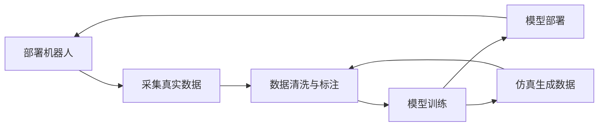

## 概述
车队数据飞轮是人形机器人领域的重要method。以下内容整理自项目 Wiki，供深入查阅。

## 核心内容
人形机器人的 AI 能力提升依赖于数据飞轮：

真实数据包括遥操作演示、人类动作捕捉、自主运行记录和失败案例。仿真数据可以快速生成大量多样场景，但存在 reality gap。成功的数据策略通常是真实数据与仿真数据的结合。

!!! note "术语解释：数据飞轮（Data Flywheel）"
    数据飞轮是指产品使用越多，产生的数据越多，模型越好，产品体验越好，从而吸引更多使用的正反馈循环。在人形机器人中，数据飞轮是实现泛化能力和持续改进的关键机制。

---

## 参考
- Wiki extraction
- 项目 Wiki：chapter-01.md#1.14.3 数据飞轮与规模化学习

