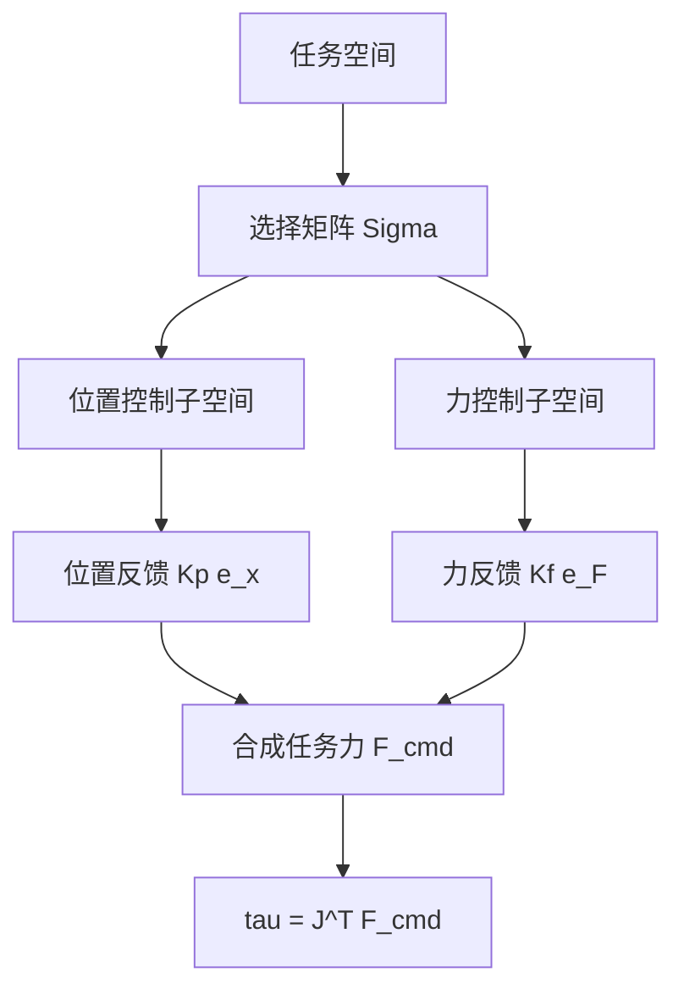

## 概述
力位混合控制是人形机器人领域的重要method。以下内容整理自项目 Wiki，供深入查阅。

## 核心内容
在许多任务中，某些方向需要控制位置，而另一些方向需要控制力。例如，沿桌面推动物体时，水平方向控制位置，垂直方向控制接触力。**混合力/位置控制（hybrid force/position control）**通过选择矩阵 \(\boldsymbol{\Sigma}\) 把任务空间分解为位置控制子空间与力控制子空间：

$$
\boldsymbol{\Sigma} = \text{diag}(\sigma_1, \ldots, \sigma_m), \quad \sigma_i \in \{0,1\}
$$

- 若 \(\sigma_i = 1\)，第 \(i\) 个方向控制位置。
- 若 \(\sigma_i = 0\)，第 \(i\) 个方向控制力。

!!! note "术语解释：混合力/位置控制、选择矩阵、位置控制子空间、力控制子空间"
    - **混合力/位置控制（hybrid force/position control）**：同时控制力和位置的策略。
    - **选择矩阵（selection matrix）**：选择位置控制方向或力控制方向的对角矩阵。
    - **位置控制子空间（position-controlled subspace）**：由选择矩阵选中的位置控制方向。
    - **力控制子空间（force-controlled subspace）**：未被选择矩阵选中的力控制方向。

假设任务空间误差为 \(\mathbf{e} = \mathbf{x}_d - \mathbf{x}\)，力误差为 \(\mathbf{e}_F = \mathbf{F}_d - \mathbf{F}\)，则控制律为：

$$
\mathbf{F}_{\text{cmd}} = \boldsymbol{\Sigma} \, \mathbf{K}_p (\mathbf{x}_d - \mathbf{x}) + (\mathbf{I} - \boldsymbol{\Sigma}) \, \mathbf{K}_f (\mathbf{F}_d - \mathbf{F})
$$

再通过 \(\boldsymbol{\tau} = \mathbf{J}^T \mathbf{F}_{\text{cmd}}\) 映射到关节力矩。这种控制在工业装配（如插轴入孔）中广泛应用。

!!! note "术语解释：位置误差、力误差、比例增益、控制律"
    - **位置误差（position error）**：期望位置与实际位置之差。
    - **力误差（force error）**：期望力与实际力之差。
    - **比例增益（proportional gain）**：控制器中误差的比例系数。
    - **控制律（control law）**：决定控制输出的数学表达式。

## 参考
- Wiki extraction
- 项目 Wiki：chapter-08.md#混合力/位置控制

