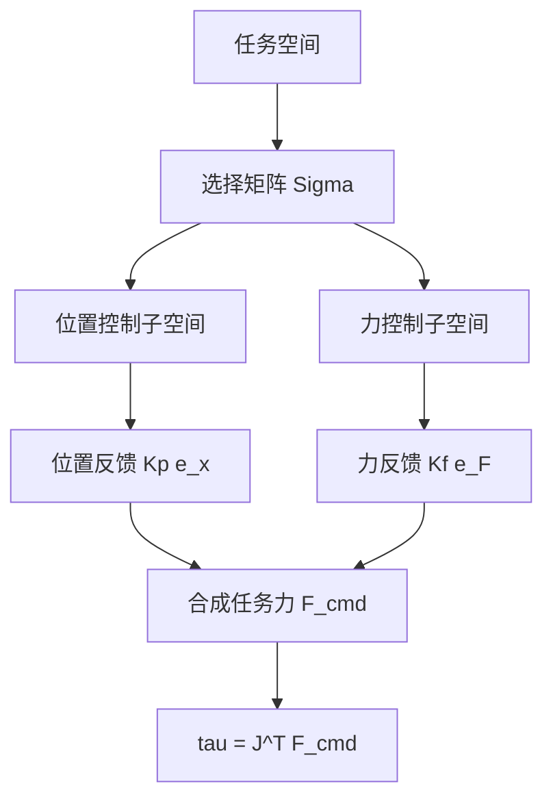

## 概述
力位混合控制是人形机器人领域的重要方法。以下内容整理自项目 Wiki，供深入查阅。

## 核心内容
在许多任务中，某些方向需要控制位置，而另一些方向需要控制力。例如，沿桌面推动物体时，水平方向控制位置，垂直方向控制接触力。**混合力/位置控制（hybrid force/position control）**通过选择矩阵 \(\boldsymbol{\Sigma}\) 把任务空间分解为位置控制子空间与力控制子空间：

$$
\boldsymbol{\Sigma} = \text{diag}(\sigma_1, \ldots, \sigma_m), \quad \sigma_i \in \{0,1\}
$$

- 若 \(\sigma_i = 1\)，第 \(i\) 个方向控制位置。
- 若 \(\sigma_i = 0\)，第 \(i\) 个方向控制力。

!!! note "术语解释：混合力/位置控制、选择矩阵、位置控制子空间、力控制子空间"
    - **混合力/位置控制（hybrid force/position control）**：同时控制力和位置的策略。
    - **选择矩阵（selection matrix）**：选择位置控制方向或力控制方向的对角矩阵。
    - **位置控制子空间（position-controlled subspace）**：由选择矩阵选中的位置控制方向。
    - **力控制子空间（force-controlled subspace）**：未被选择矩阵选中的力控制方向。

假设任务空间误差为 \(\mathbf{e} = \mathbf{x}_d - \mathbf{x}\)，力误差为 \(\mathbf{e}_F = \mathbf{F}_d - \mathbf{F}\)，则控制律为：

$$
\mathbf{F}_{\text{cmd}} = \boldsymbol{\Sigma} \, \mathbf{K}_p (\mathbf{x}_d - \mathbf{x}) + (\mathbf{I} - \boldsymbol{\Sigma}) \, \mathbf{K}_f (\mathbf{F}_d - \mathbf{F})
$$

再通过 \(\boldsymbol{\tau} = \mathbf{J}^T \mathbf{F}_{\text{cmd}}\) 映射到关节力矩。这种控制在工业装配（如插轴入孔）中广泛应用。

!!! note "术语解释：位置误差、力误差、比例增益、控制律"
    - **位置误差（position error）**：期望位置与实际位置之差。
    - **力误差（force error）**：期望力与实际力之差。
    - **比例增益（proportional gain）**：控制器中误差的比例系数。
    - **控制律（control law）**：决定控制输出的数学表达式。



## 参考
- Wiki extraction
- 项目 Wiki：chapter-08.md#混合力/位置控制

## Overview
Hybrid force/position control is an important method in the field of humanoid robotics. The following content is compiled from the project Wiki for in-depth reference.

## Content
In many tasks, certain directions require position control, while others require force control. For example, when pushing an object along a tabletop, the horizontal direction controls position, and the vertical direction controls contact force. **Hybrid force/position control** decomposes the task space into a position-controlled subspace and a force-controlled subspace using a selection matrix \(\boldsymbol{\Sigma}\):

$$
\boldsymbol{\Sigma} = \text{diag}(\sigma_1, \ldots, \sigma_m), \quad \sigma_i \in \{0,1\}
$$

- If \(\sigma_i = 1\), the \(i\)-th direction controls position.
- If \(\sigma_i = 0\), the \(i\)-th direction controls force.

!!! note "Terminology: Hybrid Force/Position Control, Selection Matrix, Position-Controlled Subspace, Force-Controlled Subspace"
    - **Hybrid force/position control**: A strategy that simultaneously controls force and position.
    - **Selection matrix**: A diagonal matrix that selects either position-controlled or force-controlled directions.
    - **Position-controlled subspace**: The directions selected by the selection matrix for position control.
    - **Force-controlled subspace**: The directions not selected by the selection matrix for force control.

Assume the task space error is \(\mathbf{e} = \mathbf{x}_d - \mathbf{x}\) and the force error is \(\mathbf{e}_F = \mathbf{F}_d - \mathbf{F}\). The control law is:

$$
\mathbf{F}_{\text{cmd}} = \boldsymbol{\Sigma} \, \mathbf{K}_p (\mathbf{x}_d - \mathbf{x}) + (\mathbf{I} - \boldsymbol{\Sigma}) \, \mathbf{K}_f (\mathbf{F}_d - \mathbf{F})
$$

This is then mapped to joint torques via \(\boldsymbol{\tau} = \mathbf{J}^T \mathbf{F}_{\text{cmd}}\). This control method is widely used in industrial assembly tasks (e.g., peg-in-hole insertion).

!!! note "Terminology: Position Error, Force Error, Proportional Gain, Control Law"
    - **Position error**: The difference between the desired position and the actual position.
    - **Force error**: The difference between the desired force and the actual force.
    - **Proportional gain**: The proportional coefficient of the error in the controller.
    - **Control law**: The mathematical expression that determines the control output.

```mermaid
flowchart TD
    A["Task Space"] --> B["Selection Matrix Sigma"]
    B --> C["Position-Controlled Subspace"]
    B --> D["Force-Controlled Subspace"]
    C --> E["Position Feedback Kp e_x"]
    D --> F["Force Feedback Kf e_F"]
    E --> G["Synthesized Task Force F_cmd"]
    F --> G
    G --> H["tau = J^T F_cmd"]

## 개요
힘-위치 혼합 제어는 휴머노이드 로봇 분야의 중요한 방법입니다. 아래 내용은 프로젝트 Wiki에서 정리한 것으로, 심층적인 참고를 위해 제공됩니다.

## 핵심 내용
많은 작업에서 특정 방향은 위치를 제어해야 하고, 다른 방향은 힘을 제어해야 합니다. 예를 들어, 책상 위에서 물체를 밀 때 수평 방향은 위치를 제어하고 수직 방향은 접촉력을 제어합니다. **혼합 힘/위치 제어(hybrid force/position control)**는 선택 행렬 \(\boldsymbol{\Sigma}\)을 통해 작업 공간을 위치 제어 부분 공간과 힘 제어 부분 공간으로 분해합니다:

$$
\boldsymbol{\Sigma} = \text{diag}(\sigma_1, \ldots, \sigma_m), \quad \sigma_i \in \{0,1\}
$$

- \(\sigma_i = 1\)이면, \(i\)번째 방향은 위치를 제어합니다.
- \(\sigma_i = 0\)이면, \(i\)번째 방향은 힘을 제어합니다.

!!! note "용어 설명: 혼합 힘/위치 제어, 선택 행렬, 위치 제어 부분 공간, 힘 제어 부분 공간"
    - **혼합 힘/위치 제어(hybrid force/position control)**: 힘과 위치를 동시에 제어하는 전략.
    - **선택 행렬(selection matrix)**: 위치 제어 방향 또는 힘 제어 방향을 선택하는 대각 행렬.
    - **위치 제어 부분 공간(position-controlled subspace)**: 선택 행렬에 의해 선택된 위치 제어 방향.
    - **힘 제어 부분 공간(force-controlled subspace)**: 선택 행렬에 의해 선택되지 않은 힘 제어 방향.

작업 공간 오차가 \(\mathbf{e} = \mathbf{x}_d - \mathbf{x}\)이고, 힘 오차가 \(\mathbf{e}_F = \mathbf{F}_d - \mathbf{F}\)라고 가정하면, 제어 법칙은 다음과 같습니다:

$$
\mathbf{F}_{\text{cmd}} = \boldsymbol{\Sigma} \, \mathbf{K}_p (\mathbf{x}_d - \mathbf{x}) + (\mathbf{I} - \boldsymbol{\Sigma}) \, \mathbf{K}_f (\mathbf{F}_d - \mathbf{F})
$$

그런 다음 \(\boldsymbol{\tau} = \mathbf{J}^T \mathbf{F}_{\text{cmd}}\)를 통해 관절 토크로 매핑됩니다. 이러한 제어는 산업용 조립(예: 구멍에 축 삽입)에서 널리 사용됩니다.

!!! note "용어 설명: 위치 오차, 힘 오차, 비례 이득, 제어 법칙"
    - **위치 오차(position error)**: 목표 위치와 실제 위치의 차이.
    - **힘 오차(force error)**: 목표 힘과 실제 힘의 차이.
    - **비례 이득(proportional gain)**: 제어기에서 오차의 비례 계수.
    - **제어 법칙(control law)**: 제어 출력을 결정하는 수학적 표현.

```mermaid
flowchart TD
    A["작업 공간"] --> B["선택 행렬 Sigma"]
    B --> C["위치 제어 부분 공간"]
    B --> D["힘 제어 부분 공간"]
    C --> E["위치 피드백 Kp e_x"]
    D --> F["힘 피드백 Kf e_F"]
    E --> G["합성 작업 힘 F_cmd"]
    F --> G
    G --> H["tau = J^T F_cmd"]

## 개요
힘-위치 혼합 제어는 휴머노이드 로봇 분야의 중요한 방법입니다. 아래 내용은 프로젝트 Wiki에서 정리한 것으로, 심층적인 참고를 위해 제공됩니다.

## 핵심 내용
많은 작업에서 특정 방향은 위치를 제어하고, 다른 방향은 힘을 제어해야 합니다. 예를 들어, 책상 위에서 물체를 밀 때 수평 방향은 위치를 제어하고 수직 방향은 접촉력을 제어합니다. **혼합 힘/위치 제어(hybrid force/position control)**는 선택 행렬 \(\boldsymbol{\Sigma}\)을 사용하여 작업 공간을 위치 제어 부분 공간과 힘 제어 부분 공간으로 분해합니다:

$$
\boldsymbol{\Sigma} = \text{diag}(\sigma_1, \ldots, \sigma_m), \quad \sigma_i \in \{0,1\}
$$

- \(\sigma_i = 1\)이면, \(i\)번째 방향은 위치를 제어합니다.
- \(\sigma_i = 0\)이면, \(i\)번째 방향은 힘을 제어합니다.

!!! note "용어 설명: 혼합 힘/위치 제어, 선택 행렬, 위치 제어 부분 공간, 힘 제어 부분 공간"
    - **혼합 힘/위치 제어(hybrid force/position control)**: 힘과 위치를 동시에 제어하는 전략.
    - **선택 행렬(selection matrix)**: 위치 제어 방향 또는 힘 제어 방향을 선택하는 대각 행렬.
    - **위치 제어 부분 공간(position-controlled subspace)**: 선택 행렬에 의해 선택된 위치 제어 방향.
    - **힘 제어 부분 공간(force-controlled subspace)**: 선택 행렬에 의해 선택되지 않은 힘 제어 방향.

작업 공간 오차가 \(\mathbf{e} = \mathbf{x}_d - \mathbf{x}\)이고, 힘 오차가 \(\mathbf{e}_F = \mathbf{F}_d - \mathbf{F}\)라고 가정하면, 제어 법칙은 다음과 같습니다:

$$
\mathbf{F}_{\text{cmd}} = \boldsymbol{\Sigma} \, \mathbf{K}_p (\mathbf{x}_d - \mathbf{x}) + (\mathbf{I} - \boldsymbol{\Sigma}) \, \mathbf{K}_f (\mathbf{F}_d - \mathbf{F})
$$

그런 다음 \(\boldsymbol{\tau} = \mathbf{J}^T \mathbf{F}_{\text{cmd}}\)를 통해 관절 토크로 매핑됩니다. 이러한 제어는 산업용 조립(예: 구멍에 축 삽입)에서 널리 사용됩니다.

!!! note "용어 설명: 위치 오차, 힘 오차, 비례 이득, 제어 법칙"
    - **위치 오차(position error)**: 목표 위치와 실제 위치의 차이.
    - **힘 오차(force error)**: 목표 힘과 실제 힘의 차이.
    - **비례 이득(proportional gain)**: 제어기에서 오차의 비례 계수.
    - **제어 법칙(control law)**: 제어 출력을 결정하는 수학적 표현.

```mermaid
flowchart TD
    A["작업 공간"] --> B["선택 행렬 Sigma"]
    B --> C["위치 제어 부분 공간"]
    B --> D["힘 제어 부분 공간"]
    C --> E["위치 피드백 Kp e_x"]
    D --> F["힘 피드백 Kf e_F"]
    E --> G["합성 작업 힘 F_cmd"]
    F --> G
    G --> H["tau = J^T F_cmd"]
