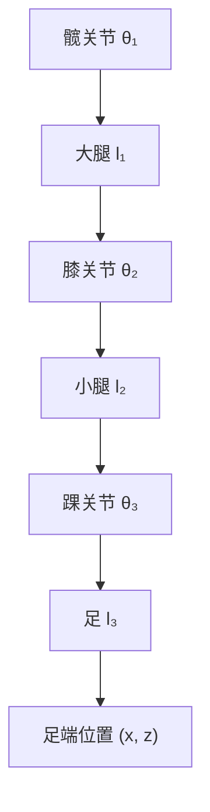

## 概述
正运动学是人形机器人领域的重要method。以下内容整理自项目 Wiki，供深入查阅。

## 核心内容
为便于分析下肢工作空间，常将单腿简化为 3-DOF 髋（roll/pitch/yaw）+ 1-DOF 膝 + 2-DOF 踝（pitch/roll）的串链。通过改进型 DH 参数或旋量法建立正运动学，可计算机足相对髋的位置。

!!! note "术语解释：正运动学、DH 参数、改进型 DH、旋量、齐次变换"
    - **正运动学（forward kinematics）**：由关节角计算末端位姿的映射。
    - **DH 参数（Denavit-Hartenberg parameters）**：用四个参数（a, α, d, θ）描述相邻连杆坐标系关系。
    - **改进型 DH（modified DH, MDH）**：将连杆长度 α 与扭角 α 定义在前一关节处，避免相邻平行轴奇异。
    - **旋量（screw）**：描述刚体绕轴旋转并沿轴平移的几何量。
    - **齐次变换（homogeneous transformation）**：4×4 矩阵，同时描述旋转与平移。

对于平面简化腿（髋 pitch θ₁、膝 θ₂、踝 pitch θ₃），足端位置可写为：

$$
\begin{aligned}
x &= l_1 \sin\theta_1 + l_2 \sin(\theta_1+\theta_2) + l_3 \sin(\theta_1+\theta_2+\theta_3) \\
z &= -l_1 \cos\theta_1 - l_2 \cos(\theta_1+\theta_2) - l_3 \cos(\theta_1+\theta_2+\theta_3)
\end{aligned}
$$

其中 \(l_1, l_2, l_3\) 分别为大腿、小腿与足长，z 轴向上为正。

## 参考
- Wiki extraction
- 项目 Wiki：chapter-09.md#9.2.2 运动学建模：简化腿的正运动学

