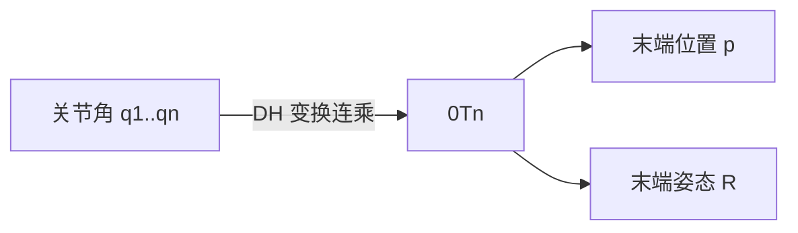

### 8.3.3 正运动学：从关节空间到操作空间

**正运动学（forward kinematics）**解决：给定关节角 $\mathbf{q}$，计算末端执行器在基坐标系中的位姿。通过连乘各连杆变换矩阵得到：

$$
{}^0\mathbf{T}_n(\mathbf{q}) = {}^0\mathbf{T}_1(q_1) \cdot {}^1\mathbf{T}_2(q_2) \cdots {}^{n-1}\mathbf{T}_n(q_n)
$$

末端位姿由 ${}^0\mathbf{T}_n$ 的旋转部分 $\mathbf{R}$ 和平移部分 $\mathbf{p}$ 给出。

!!! note "术语解释：正运动学、关节空间、操作空间、末端执行器"
    - **正运动学（forward kinematics）**：由关节变量计算末端位姿的映射。
    - **关节空间（joint space）**：以关节变量为坐标的空间。
    - **操作空间（task/operational space）**：以末端位姿为坐标的空间。
    - **末端执行器（end-effector）**：机器人与环境交互的末端装置。

