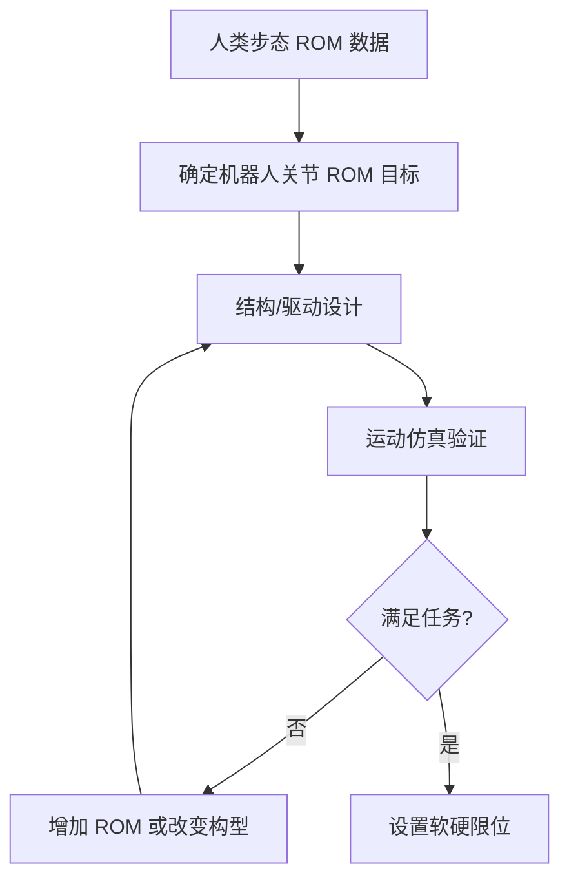

## 概述
步态规划是人形机器人领域的重要method。以下内容整理自项目 Wiki，供深入查阅。

## 核心内容
人类正常步态的关节运动范围（Range of Motion, ROM）为足部与腿部设计提供了重要参考：

| 关节 | 典型人类 ROM（步行） | 人形机器人设计目标 |
|---|---|---|
| 髋屈伸 | \(-30° \sim +30°\) | \(\pm 45°\) 以上 |
| 髋侧摆 | \(\pm 10°\) | \(\pm 20°\) 以上 |
| 髋旋转 | \(\pm 10°\) | \(\pm 30°\) 以上 |
| 膝屈伸 | \(0° \sim +60°\) | \(0° \sim +90°\) 以上 |
| 踝背屈/跖屈 | \(-10° \sim +20°\) | \(-20° \sim +30°\) 以上 |
| 踝内外翻 | \(\pm 5°\) | \(\pm 15°\) 以上 |

!!! note "术语解释：运动范围（ROM）、髋屈伸、髋侧摆、踝背屈/跖屈、踝内外翻"
    - **运动范围（Range of Motion, ROM）**：关节可活动的角度范围。
    - **髋屈伸（hip flexion/extension）**：大腿绕髋部前后摆动。
    - **髋侧摆（hip abduction/adduction）**：大腿绕髋部左右摆动。
    - **踝背屈/跖屈（ankle dorsiflexion/plantarflexion）**：脚背向上/脚尖向下的运动。
    - **踝内外翻（ankle inversion/eversion）**：脚掌绕前后轴向内/向外倾斜。

机器人关节 ROM 通常大于人类步行所需，以保留上下楼梯、跨越障碍、下蹲等动作余量。但过大的 ROM 会牺牲结构刚度与紧凑性，因此需在关节限位处设置软限位与硬限位双重保护。

## 参考
- Wiki extraction
- 项目 Wiki：chapter-08.md#运动范围与人类步态需求

