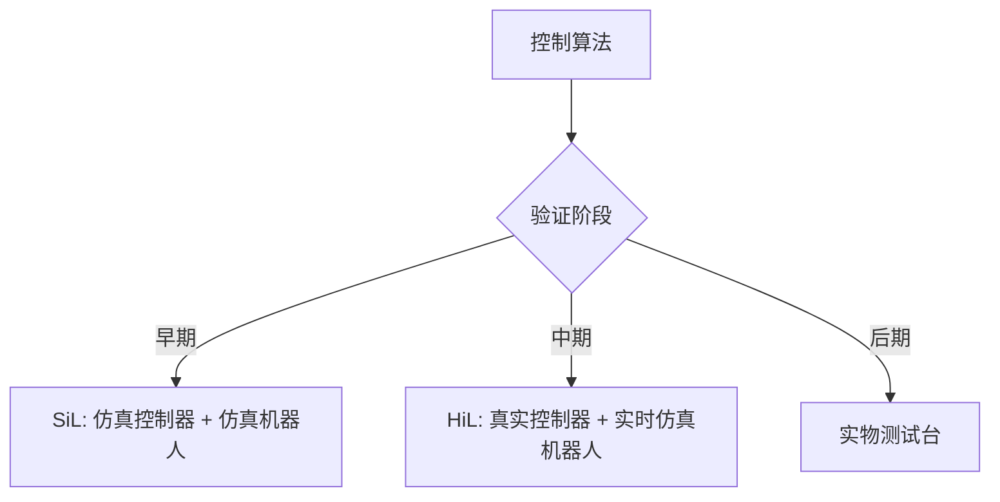

## 概述
硬件在环测试（HIL）是人形机器人领域的重要method。以下内容整理自项目 Wiki，供深入查阅。

## 核心内容
**SiL（Software-in-the-Loop）**在纯软件环境中验证控制算法；**HiL（Hardware-in-the-Loop）**将真实控制器与实时仿真模型连接，验证硬件接口与实时性能。

!!! note "术语解释：SiL、HiL、实时仿真、 plant model、控制器"
    - **SiL（软件在环）**：算法在仿真环境中运行的验证方式。
    - **HiL（硬件在环）**：真实控制器与仿真被控对象连接的验证方式。
    - **实时仿真（real-time simulation）**：仿真步长与实际时间同步的仿真。
    - **plant model**：被控对象的数学模型。
    - **控制器（controller）**：执行控制算法的硬件或软件。

SiL/HiL 对比：

| 方式 | 控制器 | 被控对象 | 用途 |
|---|---|---|---|
| SiL | 软件模型 | 软件模型 | 算法开发、参数调优 |
| HiL | 真实硬件 | 实时仿真 | 接口验证、实时性、故障注入 |

## 参考
- Wiki extraction
- 项目 Wiki：chapter-09.md#9.9.5 SiL/HiL：软件在环与硬件在环

